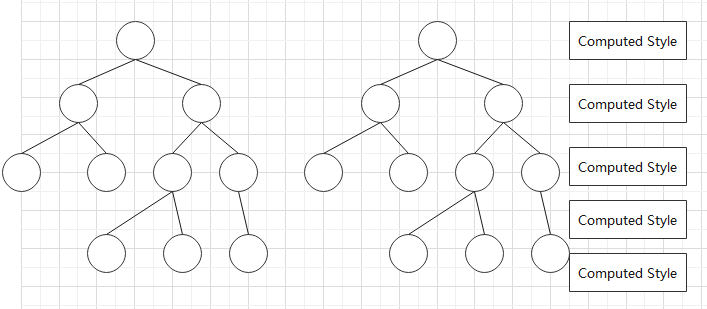
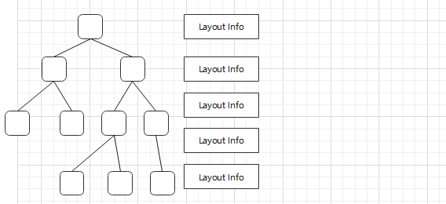
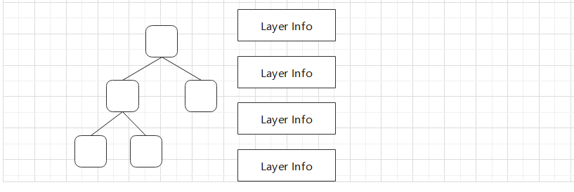
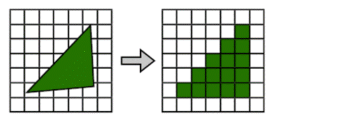
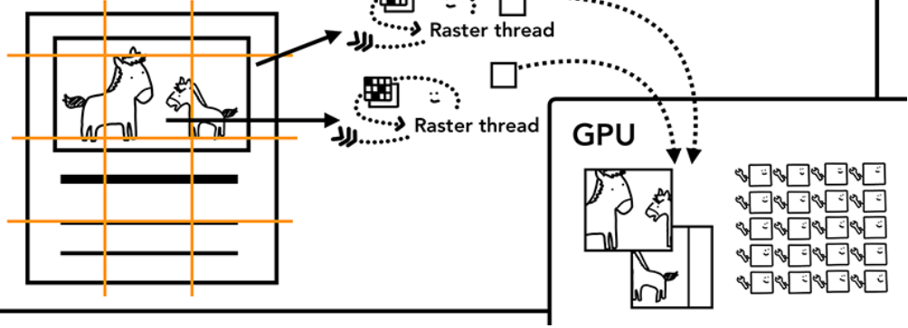
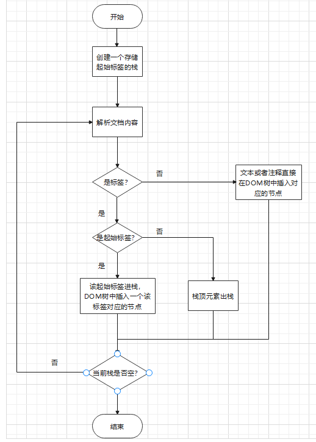

# 1 浏览器渲染(从事件上看)
* 1 HTML Parser启动开始解析文档构建DOM树，CSS Parser启动遇到css代码时开始解析构建CSSOM树。运行preload scanner预加载器，向后扫描异步资源并下载，加载器不会被js阻塞。document.readyState = loading。

* 2 遇到同步脚本则立即执行，脚本执行会阻塞HTML和CSS Parser

* 3 遇到非同步脚本 type="module" async defer会延迟执行，先下载脚本

* 4 HTML Parser解析完成后document.readyState = interactive

* 5 执行非同步脚本(不包含async脚本)

* 6 在document对象上派发DOMContentLoaded事件

* 7 加载未完成的图片，视频等仍未完成异步资源，加载异步脚本并执行(这些异步资源的加载和执行并不会阻塞下面的渲染操作)

* 8 根据CSSOM树(可能有异步CSS资源导致至此才构建完CSSOM树)和DOM树构建Render树。构建完成后进行Layout，确定Render树种元素的位置和大小。完成后进行Paint，将Render树中的内容渲染到页面

* 9 document.readyState = complete;在window对象上派发load事件

* 10 进入事件驱动阶段

# 2 浏览器渲染(从树上看)
pre：本栏主要是详细解答1中的第8点。

### 2.1 已经生成了DOM树和CSSOM树
>下面在优化中提到的回流和重绘就是下面要讲的这几个阶段。如果是几何信息发生了改变，比如dom节点上的变化，那么会触发回流。就是需要重新生成Layout Tree再走一次流程。重绘是指重新绘制，某些css发生了变化，重新进行光栅化即可，下面的阶段不需要多次遍历CSSOM树。可以理解为重绘发生在raster和compositor阶段，回流发生在DOM，Layout，Layer阶段。

### 2.2 生成Layout Tree
>先遍历DOM树，然后根据CSSOM树的计算样式计算，最终获取元素的几何样式(x坐标，y坐标，大小等等)。同时Layout Tree处理了伪元素和display为none的元素。伪元素可以显示，display为none的元素不显示

### 2.3 生成Layer Tree
>遍历Layout Tree，根据不同的堆叠上下文生成不同的图层，并且指明对应图层中的绘图顺序。这个绘图顺序可以称之为Layer Tree。一般来说不要有太多的堆叠上下文和图层，会造成渲染负担。

### 2.4 光栅化 (Raster)
>将文档结构(DOM)，元素样式(CSSOM)，元素几何信息(Layout)，元素绘图顺序(Layer)转化为显示器的像素就叫光栅化。该过程由渲染线程下的光栅化线程完成。

### 2.5 合成 (Compositor)
>图层很可能很大，渲染线程下的合成线程会把大的图层进行分块，分成小块发送给光栅化线程进行光栅化处理，最后回收分块组合到一起，按照图层顺序显示到界面。

### 2.6 举例: webkit渲染流程

# 3 DOM树构建过程
DOM树的构建类似于括号匹配算法。

注：实际上这并不是一个完整的过程。应该是：1.渲染引擎收到字节流 ------->2.根据编码格式转化成字符流----------->3.根据字符流进行词法分析和XSSAuditor检测生成词语(Token)，Token可以分辨出是标签还是文本---------------------->4.根据上述算法生成DOM树

# 4 浏览器渲染优化
pre: Critical Rendering Path(关键渲染路径)，这个概念指浏览器渲染的过程，从最初的HTML Parser启动到最后Render Tree被绘制到屏幕上的过程。
平常谈到的渲染优化也可以说是"关键渲染路径优化"

* 1 针对JavaScript
>1. (引入位置)脚本最好是body元素的最后一个子元素。很多代码有把脚本放在body外部的，在检查DOM树时能发现，如果脚本是body的后一个同辈元素那么会自动成为body的最后一个子元素，如果脚本是body的前一个同辈元素那么脚本会自动成为head的最后一个子元素; **如果JavaScript代码中不涉及操作CSS和DOM，起到插件作用， 可以放到header中link和css之前提高性能，避免JavaScript被CSS下载阻塞**
>
> 
>2. (引入标签选择)还可以考虑使用延迟脚本不阻塞HTML，CSS解析器,在使用src引入时可以考虑async和defer，使用ES6的module也可以   
>
> 
>3. (避免同步操作)不要使用document.write()。这是一个同步操作。假如write的内容是一个异步脚本，那么这个脚本就不能并行下载。
  在async和defer脚本中已经不允许使用该方法。   

* 2 针对CSS
>1. (引入标签选择)引入样式时尽可能使用link。link在引入样式时不会阻塞GUI渲染线程，@import url()会阻塞GUI渲染线程。   
>* 多个link会异步下载css资源，并且顺序返回;多个@import会异步下载css资源，不按顺序返回，如果资源间存在依赖很可能会出错(IE)   
>
> 
>* link和@import一起使用时，link会异步下载，但是link会阻塞@import，只有link下载完毕后@import才开始下载(IE)
>
> 
>* link是标签可以被JavaScript控制，@import不能被控制
>
> 
>2. (引入位置)link和style都尽量放到header中，先进行css加载。如果样式太靠后会增加Render树的构建时间

* 3 减少回流(ReFlow)与重绘(RePaint)
>1. 减少对DOM的频繁操作
>* 减少DOM树深度。
>* 要给节点添加子元素时可以考虑使用documentFragement。也可以先让元素脱离文档流再修改。  
>* 尽量不要使用table布局，table中的元素变化会引起DOM大幅度变化
>2. 减少对CSSOM的频繁操作
>* 减少css选择器的嵌套深度。
>* 使用cssText覆盖式修改内联样式。
>* 样式修改可以用切换类名实现。
>3. 会触发回流和重绘的操作
>* 获取元素的计算几何属性
>
>* 修改元素几何属性，位置(易忽视情况: 字体大小的改变，用户在文本框输入。都是影响几何属性或位置)
>
>  因此要在使用计算几何属性之前统一写回流重绘操作，不要交叉写(参加下面浏览器自身优化)

* 4 针对浏览器缓存
> 1.可以考虑使用服务线程拦截网络请求并缓存，之后修改成缓存优先网络请求次之

### 浏览器自身优化：
将回流与重绘操作放在一个渲染队列中，每隔一段时间出队执行，起到批处理的效果。但要注意，获取/使用元素的计算几何属性时会强制清空这个队列，因为我们使用计算属性时一定是当前代码计算出的结果，回流重绘操作不能再在队列里等待了。如果同时使用计算几何属性和回流重绘操作，建议应该回流重绘操作统一写在计算几何属性前，这样浏览器清空队列实际上就是一次回流重绘。最忌讳回流重绘操作和计算几何属性的使用在代码中交叉，这样就导致浏览器的渲染队列每次几乎就没有几个元素，失去了优化的意义。

# 5 渲染过程中的阻塞情况
### 5.1 HTML Parser和CSS Parser和Javascript之间的阻塞情况
HTML Parser: 不阻塞   
CSS Parser: 半阻塞, 只阻塞JavaScript(见下述测试)   
JavaScript: 全阻塞, 阻塞CSS Parser和HTML Parser

总结一下渲染中的阻塞就是:   
阻塞：下载和执行时不会并行执行其它操作   
上面代码中CSS下载时后续的JavaScript不会执行(CSS只阻塞JavaScript)，
但是HTML Parser会继续执行构建dom树(CSS不阻塞HTML)。

### 5.2 Layout树构建被阻塞
在4.1中提到了CSS，HTML，JavaScript解析之间的阻塞情况。在此考虑这三者对渲染树的阻塞影响，
在1中提到浏览器渲染过程中渲染树的构建必须要等到DOM树和CSSOM树全部构建完成才行，所以有以下阻塞情况。
* CSSOM构建阻塞：下载CSS文件速度慢
* DOM构建阻塞：HTML解析器被同步脚本阻塞
