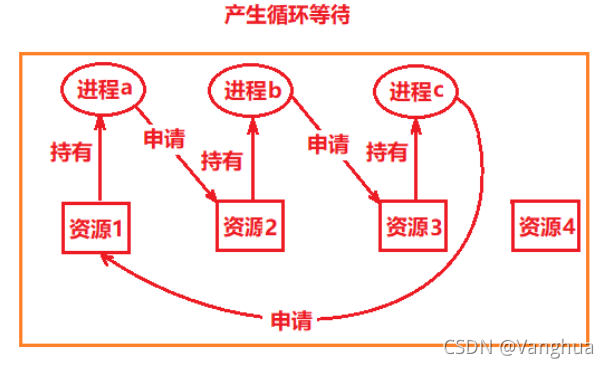
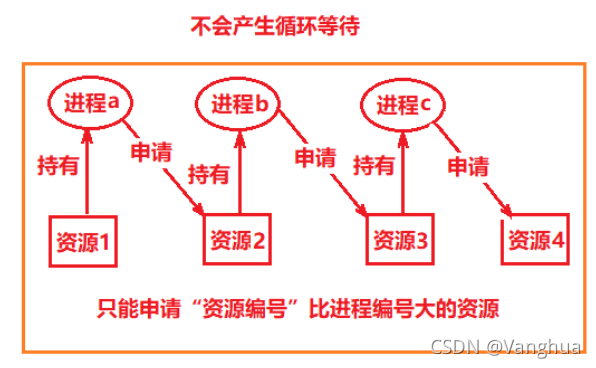
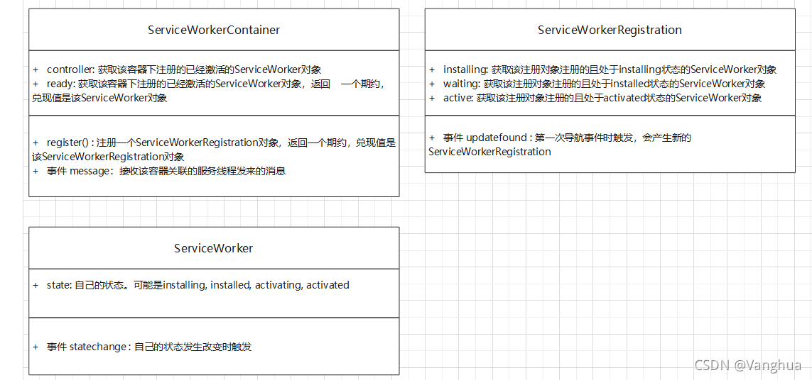
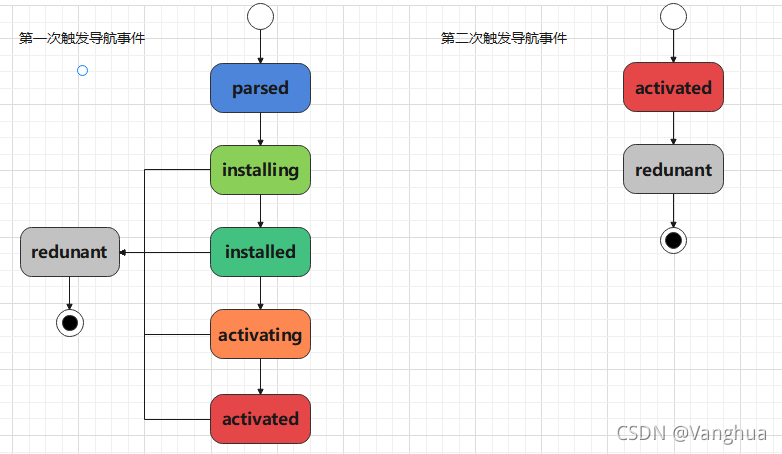
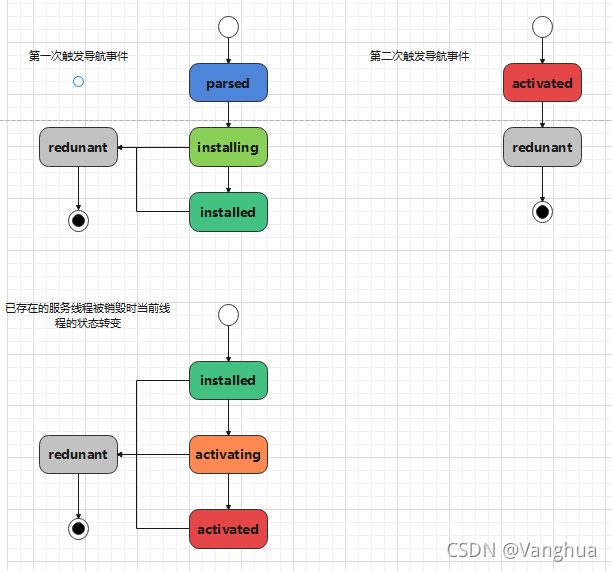

## 1.简述进程和线程
**进程：**

>1. 一段运行的程序指令
>
> 
>2. 是对CPU工作时间段的描述
>
> 
>3. 执行过程是先加载进程A运行需要的上下文环境(全局变量，库...)，执行进程A，保存A所需要的上下文，以相同的操作执行进程B...
**线程：**

>1. 一段运行的程序指令
>
>
>2. 是对CPU工作时间段的描述
>
>
>3. 执行过程是先加载线程A运行需要的上下文环境(全局变量，库...)，执行进程A，保存A所需要的上下文，以相同的操作执行线程B...线程的上下文是所属进程的上下文，相比进程上下文切换来说，线程上下文切换的开销要小一些


## 2.浏览器中的进程

**<font color=red>注：下面只列举Chrome中的主要进程，详细信息可以打开Chrome管理工具查看。不同浏览器进程名称和功能可能不同。</font>**

**浏览器进程**：

> **作用：** 管理tab页
>
> * **界面显示：** 渲染浏览器外壳。比如tab页签，书签搜索栏，前进回退刷新等
> * **用户交互：** 处理用户交互事件。比如鼠标事件，滚轮事件，键盘事件等
> * **子进程管理：** 启动和管理子进程。比如最初只有浏览器进程，后续提到的进程都由浏览器进程启动并管理
>
> **数量：** 一个

**网络进程：**

> **作用：** 管理网络请求
>
> **数量：** 一个
>
> **工作过程：** 可能会启动多线程加载网络资源，由该进程中的IO策略决定

**浏览器渲染进程**：

> **作用：** 渲染tab页
>
> **数量：** 每个页面都有一个渲染进程，通常是对应tab页的名称。**<font color=red>注：但是chrome计划为每个站点只生成一个渲染进程以优化效率。https://chromium.googlesource.com/chromium/src/+/main/docs/process_model_and_site_isolation.md#Modes-and-Availability</font>**
>
> **工作过程：** 启动一个渲染主线程处理HTML，CSS，JS资源

**存储进程：**

> **作用：** 实现浏览器存储能力
>
> **数量：** 一个
>
> **工作过程：** 为localStorage，sessionStorage，cacheStorage，indexDB等提供能力

**GPU进程**：

> **作用：** 3D绘制
>
> **数量：** 一个
>
> **工作过程：** 比如使用canvas进行3D绘制

**插件进程**：

> **作用：** 运行插件
>
> **数量：** 多个


## 3.浏览器渲染进程下的线程

**主线程 (Main Thread)**: 负责javascript运行，解析html和css

> **<font color=red>注：这只是把JavaScript工作流程的一部分拿出来看，比较片面，详情见"JavaScript解释器和编译器"</font>**
>
> JavaScript是解释型语言，JavaScript的运行分为以下几个步骤
> (1) 词法分析，语法分析
> (2) 预编译 
> (3) 执行
>
> 1. 语法分析是在预编译之前检测代码中是否存在语法错误
>
>
> 2. 预编译是在真正执行代码之前，分为4步
> * 创建Global Object/Activation Object(全局对象，局部对象)
> * 寻找var变量声明和形参声明，将其作为AO的属性，此时值为undefined
> * 将实参和形参统一，实参值赋给AO中形参属性
> * 寻找函数声明，将其作为AO的属性。由此可见为什么说var和function声明都是变量提升但是function比var优先;而且可知let，const声明并不会参与预编译阶段
>
>
> 3. 执行阶段像Python一样一行一行执行
> ```javascript
> var x = 10
> function foo(x) {
> console.log(x)
> var x = 20
> var a = 30
> function a() {
> 
>    }
>    var b = function() {
> 
>    }
> }
> foo(10)
> /* 预编译阶段：
> 1.创建GO对象，给GO对象添加x属性
> 2.创建AO对象, AO = {}
> 3.寻找var声明和形参声明作为AO的属性, AO = {x: undefined, a: undefined}
> 4.实参和形参值统一，从foo(10)可知实参值为19, AO = {x: 10, a: undefined}
> 5.寻找函数声明并作为AO的属性, AO = {x: 10, a: function(){}}
> */
> ```

**工作线程 (Work Thread)**: 负责专用工作者线程，共享工作者线程，服务工作者线程的处理

**光栅线程 (Raster Thread)**:  负责光栅化处理。指的是把文档结构(DOM)，文档样式(CSSOM)，文档几何信息(Layout)，文档图层信息(Layer)显示到显示器的像素上。

**合成线程 (Compositor Thread)**: 把不同图层分别切割成小块交给光栅线程进行光栅化处理，然后再收回组合，最后按照图层的绘制顺序绘制到显示器上。

**<font color=red>注：个人不确定的线程，不确定在哪个进程下：</font>**

**定时器线程**：负责定时器的处理。

>JavaScript中的定时器都会加入定时器观察者中的定时器容器中。 
>1. 举例而言，在node中这个容器由红黑树实现，按照setTimeout的第二个参数(延迟时间)插入红黑树。每次事件循环时到定时器观察者这里时，观察者都会查询红黑树中延时时间最短的定时器，检验它是否到达预定时间，到达则将其回调函数加入定时器观察者的事件队列中，并在红黑树中删除这个定时器。如果想利用定时器新建线程时要注意复杂度，对于红黑树的操作显然是O(lgn)级别的。
>2. 举例而言，为了更高效，在node中可以考虑使用process.nextTick，或者浏览器中使用setTimeImmediate，这样的时间复杂度都是O(1)级别的。
>
>3. 另外要注意的是，W3C规定计时器嵌套超过5层(5个setTimeout嵌套)时的延时时间不得小于4ms，如果小于4ms将会自动设为4ms。


# 4.客户端JavaScript的工作线程
### 4.1 JavaScript主线程和工作线程
### index.html(主线程)
```javascript
// 创建工作线程，如果是绝对url，必须同源
let worker = new Worker("./index.js")

// 发送信息，参数可以是任意类型，会经过结构化克隆
worker.postMessage({
    name: "Vanghua",
    gender: "man",
    age: 20
})

// 接收子线程的消息
worker.onmessage = function(event) {
    console.log(event.data)
}
```
### index.js(子线程)
```javascript
// 子线程执行CPU密集型操作
let start = Date.now()
for(let i = 0; i < 2 ** 24; i++) {

}
console.log((Date.now() - start) / 1000 + "秒")

// 子线程接收父线程传递的消息
self.onmessage = function(event) {
    console.log(event.data)
}

// 子线程发送消息
self.postMessage("Danny Van")
```

<br>

### 4.2 多个子工作线程通信
### index.html(主线程)
```javascript
// 创建工作线程，如果是绝对url，必须同源
let worker = new Worker("./index.js")
let worker2 = new Worker("./index2.js")

// 接收子线程传递来的信道端口，传送给另一个需要通信的子线程
worker.onmessage = function(event) {
    if(event.data instanceof MessagePort)
        worker2.postMessage(event.data, [event.data])
}
```

### index.js(子线程1)
```javascript
// 子线程执行CPU密集型操作
let start = Date.now()
for(let i = 0; i < 2 ** 24; i++) {

}
console.log((Date.now() - start) / 1000 + "秒")

// 创建信道
let messageChannel = new MessageChannel()

// 把信道端口1和另一个线程的名称传给父线程，请求建立直接通信。☆注意如果传送端口，必须要再加一个参数
self.postMessage(messageChannel.port1, [messageChannel.port1])

// 通信建立后的消息接收测试
messageChannel.port2.onmessage = function(event) {
    console.log(event.data)
}
```

### index2.js(子线程2)
```javascript
;(async function() {
    let port = await new Promise((resolve, reject) => {
        // 子线程接收另一个子线程的信道端口
        self.addEventListener("message", event => {
            if(event.data instanceof MessagePort)
                resolve(event.data)
            else
                reject()
        })
    });
    // 子线程向另一个子线程进行通信测试
    if(port)
        port.postMessage("index2.js向您发来问候")
})();
```

<br>

# 5.孤儿进程和僵尸进程
* 孤儿进程：父进程结束时，子进程没有结束。这样的子进程将会被init进程收养，init进程的进程号(PID)为1。
  
* 僵尸进程：子进程比父进程结束的快，但是父进程没有释放子进程占用的资源，此时子进程的进程描述符(类似于文件描述符，文件描述符一般操作系统是作数量限制的)仍保留于操作系统中。


> ### 在web 工作线程中测试该情况(线程和进程类似)
>
> 1. 创建主线程，子线程，孙子线程。
>
>
> 2. 通过子线程作为中介者，创建信道让主线程和孙子线程通信，之后在孙子线程上建立信道，专门用于孙子线程和主线程通信。
>
>
> 3. 在主线程中使用terminate方法结束子线程，在子线程中使用close方法结束自己。
>
>
> 4. 主线程再次向孙子线程通信，发现通信失败。    
> **结论是：工作线程的结束方法会避免孤儿线程的出现**
> ### index.html(主线程)
> ```javascript
>   // 创建子线程
>      let worker = new Worker("./sonThread.js")
> 
>      // async掩饰异步逻辑
>      ;(async function() {
>          // 获取建立在子线程上的信道的端口，另一个端口被传给孙子线程
>          let port = await new Promise((resolve, reject) => {
>              worker.onmessage = function(event) {
>                  if(event.data instanceof MessagePort) {
>                      resolve(event.data)
>                      worker.onmessage = null
>                  }
>              }
>          })
> 
>          // 获取建立在孙子线程上的信道的端口，另一个端口由孙子线程保留
>          let newPort = await new Promise((resolve, reject) => {
>              port.onmessage = function(event) {
>                  if(event.data instanceof MessagePort) {
>                      resolve(event.data)
>                      port.onmessage = null
>                  }
>              }
>          })
> 
>          // 主线程和孙子线程通信测试
>          newPort.postMessage("您好")
> 
>          // 结束子线程
>          worker.terminate()
> 
>          // 下面结果是孙子线程无法再接收到主线程的消息，据此结果分析，close方法和terminate方法会避免僵尸线程的存在
>          newPort.postMessage("您好2")
>      })();
> ```
> ### sonTread.js(子线程)
> ```javascript
> // 创建孙子线程
> let worker = new Worker("./grandsonThread.js")
> 
> // 创建子线程上的信道
> let messageChannel = new MessageChannel()
> 
> // 端口1传送给主线程
> self.postMessage(messageChannel.port1, [messageChannel.port1])
> 
> // 端口2传送给孙子线程
> worker.postMessage(messageChannel.port2, [messageChannel.port2])
> ```
> ### grandsonThread.js(孙子线程)
> ```javascript
> // index.html中掩饰了异步逻辑，这里不掩饰
> self.onmessage = function(event) {
> if(event.data instanceof MessagePort) {
>     // 获取建立在子线程上的信道的端口，另一个端口被传送给了主线程
>     let port = event.data
>     port.onmessage = function(event) {
>     console.log(event.data)
>     }
> 
> // 创建新的信道，之前的信道建立在子线程中，子线程终止后原信道将被破坏
>     let messageChannel = new MessageChannel()
>     port.postMessage(messageChannel.port1, [messageChannel.port1])
>     messageChannel.port2.onmessage = function(event) {
>         console.log(event.data)
>     }
>    }
> }
> ```


> ### 在node子进程中测试该情况
>
> 1. 创建主进程(node)，子进程，孙子进程。利用child_process模块的fork方法创建。
>
>
> 2. 尝试用kill方法的SIGTERM,SIGKILL等信号码终止子进程或主进程，观察到它们的子进程全部终止(nodejs官方文档也做了相同描述)
>
>
> 3. 尝试用exit方法不同的终止码0,1,2...终止子进程或主进程，观察它们的子进程发现也同时全部终止
>
>
> 4. 尝试在主进程或者子进程抛出TypeError结束该进程，发现这样的结束方法在监听道德exit事件中退出码仍为1(正常)，此时其子进程全部被终止   
> **结论是：node中(至少是通过fork创建的进程)进程的终止在下面情况看来是安全的，考虑到了子进程的终止**
> ### mainProcess.js
> ```javascript
> // 创建子进程
> let cp = require("child_process")
> let child1 = cp.fork("./childProcess.js")
> 
> // 获取主进程和子进程的pid，用于在任务管理器中检验进程是否还存在
> console.log("主进程的pid", process.pid)
> console.log("子进程的pid", child1.pid)
> 
> // 通过维持事件队列来保持主进程一直运行
> setTimeout(() => {
> 
> }, 1000 * 100)
> ```
> ### childProcess.js
> ```javascript
> // 创建孙子进程
> let cp = require("child_process")
> let grandChildProcess = cp.fork("./grandChildProcess")
> 
> // 获取孙子进程的pid，用于检验子进程终止后孙子进程是否还存在
> console.log("孙子进程的pid", grandChildProcess.pid)
> 
> // 子进程退出时的回调
> process.on("exit", function(exitCode, signal) {
> console.log(exitCode, signal)
> // 回调结束后孙子进程会被销毁，此时仍能获取孙子进程
> console.log(grandChildProcess)
> })
> 
> // 下面是测试的子进程终止方法
> process.exit(12)
> // process.kill(process.pid, "SIGKILL")
> // process.kill(process.pid, "SIGTERM")
> 
> // 维持事件队列来保持子进程的运行
> setTimeout(() => {
> 
> }, 1000 * 100)
> ```
> ### grandChildProcess.js
> ```javascript
> // 如果孙子进程不被终止，将会维持运行200秒
> setTimeout(() => {
> 
> }, 1000 * 200)
> ```

# 6.进程间的通信方式(中介者)
* **1.管道通信**
>
>1. 管道通信是需要pipe文件充当中介者，管道两端的进程都可以在该文件上读写。node中进程之间的通信就是通过管道通信(深入浅出nodejs)。
>
> 
>2. 这是一个半双工信道，同一时间只能单向通信。
>
> 
>3. 只有亲缘关系的进程才能通信，例如node中fork创建的父子进程自带管道

* **2.命名管道通信**
>可以解决管道通信对象的局限性，通信对象不仅仅是具有亲缘关系的进程(C++博主的博客提到该通信方式)

* **3.消息队列通信**
>在内存中创建一个消息队列用于两个进程通信，一个进程发送消息进入队列，另一个进程接收消息让队列中的元素出队即可。弊端是队列长度有限。与管道通信的区别是这个不是基于流。(与这个类似，web工作线程就是采用消息队列通信，先发消息再注册消息处理函数一样能收到之前积累的多条消息)

* **4.共享内存通信**
>在内存中开辟一段空间供一些进程进行通信

* **5.信号量通信**
>用于解决共享内存通信中的进程竞争内存资源的问题，这可以看做是锁机制。如果有一个进程正在访问共享内存，那么会产生一个信号量进行标识，其它进程此时不可访问该共享内存。

* **6.信号通信**
>先规定好一些信号对应的事件，如进程结束事件等等。然后给进程发送某个信号，进程就会执行对应的事件。举例而言，nodejs中可以通过process.kill()的第二个参数发送信号，
>如果是SIGKILL，SIGTERM，SIGINT进程就会立即退出。如果是其它的一些不重要的信号，对应进程不会立即执行对应的事件，因为切换进程需要的切换上下文开销很大，会延迟一下再执行。

* **7.套接字通信**
>运行在不同主机上的进程可以通过套接字通信，就是最常见的通过网络请求的方式进行相互通信。


# 7.浏览器多个tab页(进程)之间的通信
pre: 获取tab页引用的方法：
>1. 如果是iframe，在iframe加载完成后(window对象上派发load事件，或者观察document.readyState也可以)，通过iframe.contentWindow可以获取iframe中页面的引用
>2. 如果是在某个页面中通过window.open打开了一个新的页面，那么可以在新页面中通过window.opener获取打开它的页面的window对象的引用(在高版本谷歌浏览器中如果存在跨域，这个window.opener将报错)

pre: 为什么要多个tab页通信？
> (1)回想最初做项目的时候不懂单页路由，搞不明白多页路由怎样在多个页面之间传递信息。(2)还有就是浏览器history模式的前进和后退，在不懂原理之前一直觉得打开页面可以带参数，为什么页面后退不能带参数。
> (3)在网上看到有需求是打开一个弹窗，要给这个弹窗传递打开它的页面的数据。这实际上都可以用多个tab页通信来解决。postMessage应用范围多为iframe，websocket相关的网络套接字通信成本太大感觉没有必要，SharedWorker在测试时发现关键问题是tab页已经终止了但无法杀死这个线程(只有所有和它相连的tab页关闭才会终止)，最后体验下来还是
> localStorage好用，如果有频繁的通信可以考虑用共享线程

* ### **1.postMessage**
>### localhost:3000
>```html
> <iframe src="http://localhost:8099"></iframe>
> <script>
>  // iframe是异步资源，注意要在它加载完成后再进行操作
>  window.onload = function() {
>    let iframe = document.querySelector("iframe")
>    let otherWindow = iframe.contentWindow
>    // otherWindow表示对应页面的引用，第二个参数表示对应页面的源
>    otherWindow.postMessage("您好", "http://localhost:8099")
>  }
>  window.onmessage = function(event) {
>    console.log(event.data, event.origin)
>  }
></script>
>```
>
> ### localhost:8099
> ```html
> <div>iframe窗口内容</div>
> <script>
>    window.onmessage = function(event) {
>        // origin表示发送信息的页面的源，source表示发送信息的页面的引用
>        console.log(event.data, event.origin)
>        event.source.postMessage("已经收到消息", event.origin)
>    }
> </script>
> ```

* ### **2.localStorage**
> 利用本地存储实现tab页之间通信，但是要注意localStorage的作用域。仅限于相同浏览器打开的同源文档。也可以监听storage事件，localStorage存储内容变化时，在localStorage作用域内的页面的window对象都可监听到该事件。(cookie和sessionStorage也可实现，请参见"浏览器存储"相关总结)


* ### **3.websocket(或者其它网络请求也行)**
> ### websocket服务器
> ```javascript
> let ws = require("nodejs-websocket")
> // 连接数量
> let cnt = 0
> // 历史消息
> let info = []
> // 客户端服务器连接
> let connections = []
> let server = ws.createServer(function(conn) {
>   conn.on("text", function(text) {
>     info.push(text)
>     if(cnt >= 2) {
>       info.forEach(text => {
>           connections.forEach(conn => {
>               conn.send(text)
>           })
>       })
>     }
>   })
> })
> 
> server.on("connection", function(conn) {
>   console.log("新连接建立")
>   connections.push(conn)
>   cnt ++
> })
>
> server.listen(8081, err => {
>   if(err)
>       console.log(err)
>   else
>       console.log("websocket服务器运行在8081端口")
> })
> ```
> ### tab页1
> ```html
> <script>
>       let ws = new WebSocket("ws://localhost:8081")
>       ws.onopen = function() {
>           ws.send(JSON.stringify({
>               // 标识当前进程
>               id: "ProcessA",
>               // 想要发送的信息
>               text: "This is ProcessA. Who is that?",
>               // 如果想要广播那么用*，否则指明另一个进程的标识
>               target: "*"
>           }))
>       }
>
>       ws.onmessage = function(event) {
>           let info = JSON.parse(event.data)
>           if(info.id !== "ProcessA" && info.target === "*")
>               console.log("ProcessA接收到了 " + info.text)
>       }
>   </script>
> ```
>  ### tab页2
> ```html
> <script>
>        let ws = new WebSocket("ws://localhost:8081")
>        ws.onopen = function() {
>            ws.send(JSON.stringify({
>                // 标识当前进程
>                id: "ProcessB",
>                // 想要发送的信息
>                text: "This is ProcessB. Who is that?",
>                // 如果想要广播那么用*，否则指明另一个进程的标识
>                target: "*"
>            }))
>        }
>
>        ws.onmessage = function(event) {
>            let info = JSON.parse(event.data)
>            if(info.id !== "ProcessB" && info.target === "*")
>                console.log("ProcessB接收到了 " + info.text)
>        }
>    </script>
> ```

* ### **4.SharedWorker**
> SharedWorker有很多特殊点(以下列举自己的测试，在mdn上没有详细说明)
>1. 在ChromeDevTools中测试时，让服务器终止，但是发现共享线程没有终止，和上面提到的测试工作线程不太一样。(只有在所有页面断开和共享线程的连接，共享线程才会终止，就是页面关闭。没法用编程方法终止)
>
> 
>2. 使用Worker时可以在调试栏的netWork栏中观察到请求Worker需要用到的js资源，但是使用SharedWorker时不会被观测到，需要有chrome://inspect调试工具观测。
>
> 
>3. 多个线程使用一个共享线程时只需要用new即可，实际上提供了一个新的，能连接到共享线程的端口。
>
> 
>4. 共享线程连接事件触发时，如果不是其它线程同时向共享线程发送消息，共享线程只会收到一个端口，可以使用这个端口来标识是哪个线程发来的消息。
> ### tab页A
> ```html
> <script>
>       let worker = new SharedWorker("sharedWorker.js")
>       worker.port.postMessage({
>           text: "来自页面A的消息",
>           id: "A"
>       })
>       worker.port.onmessage = function(e) {
>           console.log(e.data)
>       }
> </script>
> ```
> ### tab页B
> ```html
> <script>
>        let worker = new SharedWorker("sharedWorker.js")
>        worker.port.postMessage({
>            text: "来自页面B的消息",
>            id: "B"
>        })
>        worker.port.onmessage = function(e) {
>            console.log(e.data)
>        }
> </script>
> ```
> 
> ### sharedWorker.js
> ```javascript
> onconnect = function(event) {
>    // 如果不是同时发送，这里只会收到一个端口，就是port
>    // 可以通过这个port来标识是哪一个线程发来的消息
>    let port = event.ports[0]
>    // SharedWorker和Worker不太一样，SharedWorker调用不会显示在调试框的网络请求内容中，需要用chrome://inspect进行调试
>    port.onmessage = function(event) {
>        port.postMessage(event.data)
>    }
> }
> ```

# 8.并发控制
### 8.1 并发控制
* #### **丢失修改**   
事务A读->事务B读->事务A修改->事务A写->事务B修改->事务B写   
此时文件中只能记录事务B的写操作，事务A修改后的写操作被丢失了
```javascript
let fs = require("fs");
let fsPromise = fs.promises;
const path = "./test.txt";
const encoding = "utf-8";
// test.txt: 16

await async function() {
    // 先同时读入文件
    [A, B] = await Promise.all([
      fsPromise.readFile(path),
      fsPromise.readFile(path)
    ]);
    [A, B] = [A.toString(encoding), B.toString(encoding)];
  
    // 都读完后再修改文件
    await Promise.all([
      fsPromise.writeFile(path, (A - 1).toString()),
      fsPromise.writeFile(path, (B - 1).toString())
    ]);
  
    [A, B] = await Promise.all([
      fsPromise.readFile(path),
      fsPromise.readFile(path)
    ]);
    [A, B] = [A.toString(encoding), B.toString(encoding)];
    console.log(A, B) // 输出15,15
}();
```

* #### **不可重复读**  
事务A读->事务B读->事务B修改->事务B写->事务A读   
最后事务A读到的内容和原始读到的内容不同，在两次事务A读取之间事务B进行了写操作
```javascript
let fs = require("fs");
let fsPromise = fs.promises;
const path = "./test.txt";
const encoding = "utf-8";
// test.txt: 16

await async function() {
    // 把数据恢复到16
    await fsPromise.writeFile(path, "16")

    // A先读入文件
    let A = (await fsPromise.readFile(path)).toString(encoding)
    // 数据暂存
    let tempData = A

    // B读入文件
    let B = (await fsPromise.readFile(path)).toString(encoding)
    // B写入文件
    await fsPromise.writeFile(path, (B - 1).toString())

    // 暂存数据由于某种原因内存被释放，需要再次读取，恢复原来的值
    tempData = null
    A = (await fsPromise.readFile(path)).toString(encoding)
    tempData = A
    console.log(tempData)
}();
```

* #### **读脏数据** 
事务A读->事务A修改->事务A写->事务B读->事务A写操作回滚   
事务B读到的内容和文件中的内容不符

```javascript
let fs = require("fs");
let fsPromise = fs.promises;
const path = "./test.txt";
const encoding = "utf-8";
// test.txt: 16

await async function() {
    await fsPromise.writeFile(path, "16")

    // A读取并修改，写入文件
    let A = (await fsPromise.readFile(path)).toString(encoding);
    await fsPromise.writeFile(path, (A - 1).toString())

    // B读取文件
    let B = (await fsPromise.readFile(path)).toString(encoding);

    // A撤销操作
    await fsPromise.writeFile(path, (A).toString())

    // 此时B得到的数据和文件中的数据不吻合
    console.log(B)
}();
```

### 8.2封锁协议
pre：有些并行操作会破坏事务的隔离性，需要封锁，看起来像串行一样。
1. X锁：表示写锁。事务T给数据A加上X锁后，只有事务T才能读取修改数据A。此时其它事务不能给A加任何其它锁。
2. Y锁：表示读锁。事务T给数据A加上Y锁后，事务T只能读取数据A，不能修改数据A。此时其它事务只能给A加读锁。

* **一级封锁协议**  
事务在读取数据之前必须加上写锁(X锁)。可以解决丢失修改问题。


* **二级封锁协议**   
在一级封锁协议基础上，事务在读取数据之前必须加上读锁(Y锁)，读完后立即释放。可以解决读脏数据问题。(因为另一个事务读时必须加读锁，而前一个事务的回滚还未结束，所以写锁还未释放)


* **三级封锁协议**
在一级封锁协议基础上，事务在读取数据之前必须加上读锁(Y锁)，事务结束后才能释放。可以解决不可重复读问题。

### 8.3活锁和死锁
pre：一般发生在进程，进程之间一般是竞争，线程之间一般是协作
1. 活锁：事务不满足触发的条件而一直等待，活锁可以自己解开。
> 事务T1给数据R上锁，事务T2请求给数据R上锁，事务T3请求给数据R上锁...当T1释放了锁后会首先批准最后一个事务给数据R上锁，这样会造成事务T2一直等待。
> 解决方案是只需要设置一个队列即可，先来的先释放锁。

2. 死锁: 多个事务因为抢夺资源而造成的相互等待，没有外力干涉，死锁不会解开。
> 事务T1封锁了数据R1，事务T2封锁了数据R2。此时事务T1请求封锁数据R2，事务T2请求封锁数据R1。这时两个事务会一直等待下去。

3. 死锁产生的必要条件
> 1.互斥条件：进程占用某个资源时，该资源不能被其它进程占用   
> 
> 
> 2.请求和保持条件：进程因为请求其它资源而阻塞时，不会释放已有资源   
>
> 
> 3.不可剥夺条件：进程获得的资源在使用完之前不会释放    
>
> 4.环路等待条件：发生死锁时一定有"进程--资源"的环形链
> 

4. 预防死锁的方法
>1. 破坏请求和保持条件：进程在开始前，把它所有需要的资源一次性分配完毕。但如果有资源被占用无法分配，那么其它任何资源也不给该进程分配。缺点是会造成大量资源空闲，利用率低。
>
> 
>2. 破坏不可剥夺条件：当一个进程请求资源不能被满足时，该进程应该立即释放它持有的其它资源。
>
> 
>3. 破坏环路等待条件：把资源按照顺序编号，当前进程申请新资源时只能申请比它占有资源序号大的资源。缺点是申请新资源时，申请编号小的资源可能不会造成死锁但是也会被拒绝。
> 


# 9.浏览器端的服务线程(Service Worker)
## 9.1 服务线程基础使用
三个核心对象常用属性方法(ServiceWorkerGlobalScope在此不做总结，可以查看mdn)


```html
<script>
    window.onload = async () => {
        // navigator.serviceworker是ServiceWorkerContainer对象
        let registration = await navigator.serviceWorker.register("./serviceWorker.js", {
            // 服务线程可以控制的页面的范围，这个就是默认值，与服务线程相同路径下的文件都可被控制
            scope: "./"
        })
        // registration是ServiceWorkerRegistration对象
        registration.onupdatefound = function() {
            // registration.installing是ServiceWorker对象
            registration.installing.onstatechange = function({target: { state }}) {
                console.log(state)
            }
        }
    }
</script>
```

## 9.2 服务线程生命周期
服务线程的生命周期
ServiceWorker对象的状态有parsed(已解析), installing(安装中), installed(已安装), activating(激活中), activated(已激活), redunant(已失效)
* 注册服务线程时不存在已经激活的服务线程
> 图示：
>
> 
>
> 第一次触发导航事件：   
> (1)虽然已经到达激活状态，但是服务线程不会控制页面(为了满足资源一致性，详情见<<JavaScript高级程序设计第四版>>)   
>
> (2)在安装和激活的相关状态中如果出现错误都会进入失效状态   
>
> (3)激活事件和安装事件都是可以在服务线程监听的，都是"可扩展"事件，提供waitUntil函数，可以阻塞程序，延长所处的状态
>
> 第二次触发导航事件：服务线程开始控制页面，可以通信，可以拦截请求，可以消息推送


* 注册服务线程时已经存在激活的服务线程
> 图示：
>
> 
>
> 
>
> 第一次触发导航事件：    
> (1)还是为了满足服务线程的一致性，不能现在就更新版本，因为其它页面可能还未检测到更新，如果更新会造成不同页面控制线程版本不一致。但是安装事件提供了激进的跳跃函数skipWaiting()，可以跳过installed直接activated，接替之前的服务线程，相当于进入了第二次导航事件。   
>
> (2)其它过程和第一种情况一样
>
> 已激活的服务线程被销毁：
> 当服务线程被销毁时当前处于installed状态的服务线程立即进行状态转换，该过程无法被监听。
>
> 第二次触发导航事件：
> 过程和第一种(当前不存在已激活的服务线程)情况一样

## 9.3 服务线程拦截网络请求
### test.html
```html
<script>
    window.onload = () => navigator.serviceWorker.register("./serviceWorker.js", {
        // 不希望服务线程被http缓存
        updateViaCache: "none"
    })
</script>
```

### serviceWorker.js (和test.html在同一路径下)
```javascript
// installing时缓存资源
self.oninstall = function(event) {
    event.waitUntil(new Promise(async resolve => {
        // cache的用法参见浏览器存储这篇总结
        if (await caches.match("/test.html") === false) {
            let cache = await caches.open("3000Test")
            await cache.add("/test.html")
            resolve()
        } else
            resolve()
    }))
}

// 拦截网络请求，优先用缓存替代
self.onfetch = function(fetchEvent) {
    fetchEvent.respondWith(caches.match(fetchEvent.request).then(res => {
        if(res) {
            console.log("缓存匹配成功")
            return res
        } else
            return fetch(fetchEvent.request)
    }))
}
```

### server.js (node环境下的web服务器)
```javascript
let fs = require("fs")

function read(path, res) {
    fs.readFile(path, function(err, data) {
        if(err)
            console.log(err)
        else if(path.slice(-2, path.length) === "js") {
            // 在这里不希望我们的服务线程被http缓存
            res.writeHead(200, {
                "Content-Type": "text/javascript",
                "Cache-Control": "max-age=0"
            })
            write(res, data)
        } else if(path.slice(-4, path.length) === "html") {
            res.writeHead(200, {
                "Content-Type": "text/html"
            })
            write(res, data)
        }
    })
}

function write(res, data) {
    res.write(data)
    res.end()
}

require("http").createServer(function(req, res) {
    if(req.url === "/favicon.ico")
        res.end()
    else
        read("." + req.url, res)
}).listen(3000, function(err) {
    if(err)
        console.log(err)
    else
        console.log("运行在3000端口")
})
```
解释：   
1. 拦截操作只能在服务线程处于"已激活(activated)"状态且已经触发过一次导航事件后才能进行。    


2. 上面服务线程首先是在"安装中(installing)"状态进行缓存，进行缓存时利用阻塞函数延长状态时间，缓存应当在此状态全部保存完。


3. onfetch监听发出的网络请求，event.respondWith()可以接收一个response对象，这是接收缓存的情况。也可以接收一个fetch对象，这是不走缓存直接进行网络请求的情况。


4. 实际拦截请求时有多种选择，可以缓存优先，也可以网络请求优先，也可以最后再加上备用的catch，两者都失败时，寻找本地备用文件。


## 9.4 服务线程和主线程通信
注：服务器代码都一样，就不再粘贴了
### test.html
```html
<script>
    window.onload = async () => {
        let registration = await navigator.serviceWorker.register("./serviceWorker.js", {
            // 在这里我们不想让我们的服务线程被http缓存
            updateViaCache: "none"
        })

        // 如果是第二次或更多次数触发导航事件，主线程主动向服务线程通信
        if(registration.active) {
            registration.active.postMessage("来自主线程的问候")
        }
    }

    // 服务线程容器来接收消息，不是通过ServiceWorker对象接收消息
    navigator.serviceWorker.onmessage = function(event) {
        console.log(event.data)
    }
</script>
```

### serviceWorker.js
```javascript
// 服务线程获取当前所有自己控制的服务端
self.clients.matchAll().then(clientList => {
    // 这个测试样例下服务线程只会控制一个页面
    if(clientList[0])
        clientList[0].postMessage("来自服务线程的问候")
})

// 监听主线程发来的消息
self.onmessage = function(event) {
    console.log(event.data)
}
```
解释：
1. 第一次导航事件不会发生任何通信。


2. 第二次导航事件时，浏览器服务线程检查自己已经有可控制页面了，于是向主线程发消息。此时主线程检查已经有一个激活服务线程了，
于是向服务线程发送消息。  


(☆注意：第二次导航事件最好是关闭浏览器再重新打开，否则clients检测不到自己控制的页面，clients好像有点特殊，对于拦截请求，并不用这样操作)

## 9.5 服务线程实现推送

其中用到的registration.pushManager.subscribe()方法是向FCM服务商获取订阅标识，这个api设计的是国外的FCM(处理推送服务的服务商)，需要翻墙，
后续一些操作也要翻墙。操作对国内不太友好。用到的时候再详细研究。
