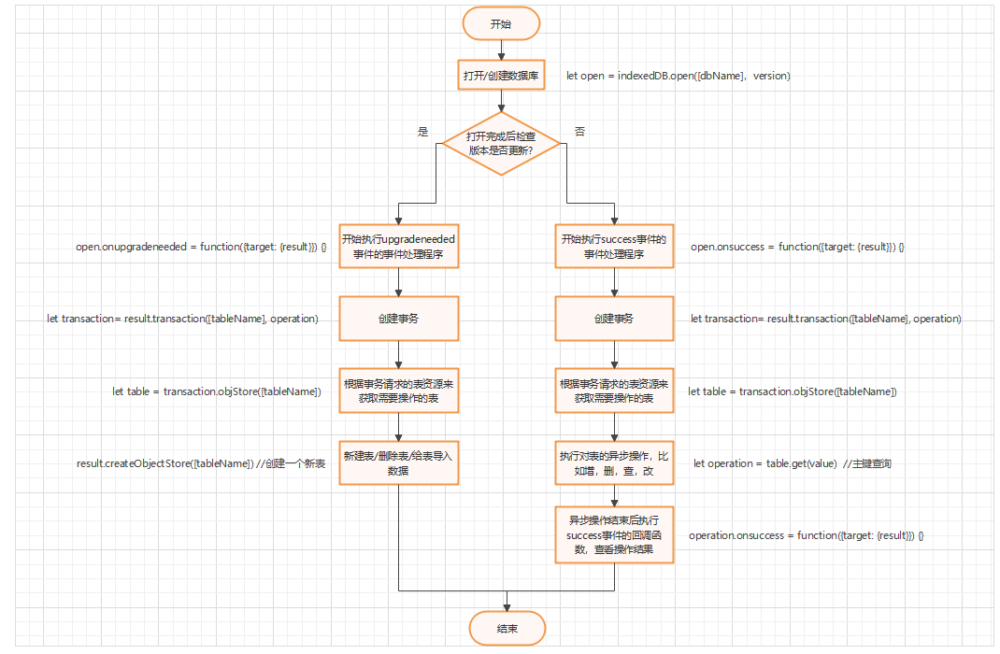

# 1.CacheStorage
### 1.1 介绍Cache
* **(设计目的)** cache是为了服务线程能够缓存网络请求而设计的，它只能存储网络请求，和网络请求响应。


* **(设计思路)** cache被设计成了二级字典结构。第一层字典是caches对象，每个键都是字符串，键所对应的值都是一个cache对象。
第二层字典是cache对象，每个键都是Request对象，每个值都是Response对象。


* **(作用域)** 与localStorage的作用域相同，都是相同浏览器下的相同源。


* **(特点)** cache的相关api全部为基于Promise的异步api


* **(使用)** (1)但实际上它不仅仅被挂载到了ServiceWorkerGlobalScope上，在Window对象上也可以使用。
调用caches即可。(2)cache一般是不允许存储非GET请求的，因为涉及到跟服务器动态交互，之前缓存内容很可能没用。
(3)浏览器会指定Storage空间，可以通过F12查看或者下述例子中也提到。


### 1.2 Caches常用API介绍
1. caches.open(cacheName) 获取cacheName键所对应的cache值，兑现值是cache值


2. caches.match(request) 直接通过二级字典caches去寻找一级字典cache，匹配一级字典cache的键，兑现值是键对应的response


3. caches.keys() 罗列存储的所有cacheName，兑现值是对应的数组


4. caches.has(cacheName) 查找是否存在键为cacheName的cache，兑现值是true或false


5. caches.delete(cacheName) 删除对应的一级字典，如果存在该cacheName对应的cache则以true兑现，否则以false兑现


### 1.3 Cache常用API介绍

1. cache.match(request, option) 获取键为request的值response，option参见官网，兑现值是response


2. cache.add(request) 添加一个键，键为request，添加完后自动发送请求并把response存储为键对应的值，兑现值undefined


3. cache.put(request, response) 手动添加网络请求键值对，可以在fetch中使用


4. cache.keys() 获取cache字典的所有键，和caches介绍一样


5. cache.delete(request) 删除缓存，和caches介绍一样


### 1.4 使用测试(服务器是node环境)
### server.js web服务器
```javascript
let fs = require("fs")
// 使用代理模块，http-proxy不是nodejs中的核心模块
let proxy = require("http-proxy").createProxyServer({})

function read(path, res) {
    fs.readFile(path, function(err, data) {
        if(err)
            console.log(err)
        else {
            // 可以打开html或者js文件(打开js文件这里测试用不到)
            res.writeHead(200, {
                "Content-Type": path.slice(-2, path.length) === "js" ? "text/javascript" : "text/html"
            })
            res.write(data)
            res.end()
        }
    })
}
require("http").createServer(function(req, res) {
    if(req.url === "/favicon.ico")
        res.end()
    // 约定：网络请求以/api开头都会被代理到对应的应用服务器，这里从使用上讲是反向代理，用户并不知道访问的是代理服务器
    else if(req.url.slice(0, 4) === "/api")
        proxy.web(req, res, {
            target: "http://localhost:8099"
        })
    else
        read("." + req.url, res)
}).listen(3000, function(err) {
    if(err)
        console.log(err)
    else
        console.log("运行在3000端口")
})
```

### appServer.js 应用服务器
```javascript
require("http").createServer(function (req, res) {
    switch(req.url) {
        case "/api/test":
            res.write("成功")
            res.end()
            break
        // 测试登录(这是之前测试用到的，本测试cache不存储post请求，所以用上面那个就行)
        case "/api/login":
            req.on("data", function(data) {
                let info = JSON.parse(data.toString("utf-8"))
                if(info.name === "Danny" && info.password === "79707536")
                    res.write("登陆成功")
                else
                    res.write("登录失败")
                console.log(info)
                res.end()
            })
            break
    }
}).listen(8099, err => {
    if(err)
        console.log(err)
    else
        console.log("运行在8099端口")
})
```

### test.html
```html
<script>
    // 获取浏览器限制的最大存储空间
    navigator.storage.estimate().then(info => {
        console.log(info.quota / Math.pow(2, 30) + "GB")
    })
    let headers = new Headers({
        "Content-Type": "application/json"
    })
    let request = new Request("/api/test", {
        method: "GET",
        headers: headers
    })
    caches.has("userInfo").then(async res => {
        let cache = await caches.open("userInfo")
        // 如果存在缓存那么就直接从缓存中获取
        if(res === true) {
            let response = await cache.match(request)
            // 展示缓存内容
            console.log(response.status, await response.text())
            // 展示一下一级字典cache的键
            await cache.keys().then(keys => {
                console.log(keys)
            })
            // 避免以后忘记删除，这里用完就清理掉
            await cache.delete(request)
            await caches.delete("userInfo")
        } else {
            // 不存在缓存那么就进行缓存
            await cache.add(request)
            console.log("缓存成功")
        }
    })
</script>
```

# 2.localStorage
> ### API:    
> localStorage.setItem(String, String)  // 设置存储  
> localStorage.getItem(String)         	 // 获取存储内容   
> localStorage.removeItem(String)      // 删除存储内容  
> localStorage.clear()                 			 // 删除所有存储内容   
> localStorage.x                       			   // 直接访问属性来进行操作
>
> ### Event:
> 当localStorage存储的内容发生变化时会在localStorage作用域下的tab页的window对象上派发storage事件。其它window对象都可以获取变化前后的存储内容，相当于是一广播通信。
>
> ### 作用域：   
> 相同浏览器下的同源文件
>
> ### 存储大小：
> 存储上限在5MB左右，测试正好5MB会超出存储上限报错，稍微小于5MB，比如4.7或4.8MB可以正常存储
>
> ### 生命周期：
> 永远

# 3.sessionStorage
> ### API:
> sessionStorage.setItem(String, String)     // 设置存储   
> sessionStorage.getItem(String)                 // 获取存储内容   
> sessionStorage.removeItem(String)         // 删除存储内容   
> sessionStorage.clear()                                // 删除所有存储内容  
> sessionStorage.x                                         // 直接访问属性来进行操作
>
> ### Event:
> MDN上说sessionStorage和localStorage都会触发同样的storage事件，但真正测试发现只有localStorage能够触发
>
> ### 作用域：
> 相同浏览器下的同源文件
> 
> ### 存储大小：
> 经测试发现，sessionStorage和localStorage的存储上限相同，均为5MB左右
>
> ### 生命周期：
> 浏览器的生命周期，当tab页关闭时sessionStorage将会被销毁

# 4.cookie
> ### 介绍：
> 1. **(服务端设置Cookie)** cookie是服务端向客户端发送的携带在响应头中的数据块。服务端通过设置响应头中的Set-Cookie字段(设置方法和下文介绍类似)来设置cookie值。
> 2. **(客户端接收并添加Cookie)** 客户端接收到响应后，会把Set-Cookie信息添加到当前页面的cookie中。
> 3. **(客户端修改Cookie)** 客户端可以修改当前页面下的Cookie值，就是下文介绍的方法。
> 4. **(客户端发送Cookie)** 客户端发送请求时会在请求头中带上Cookie字段，该字段会携带满足条件的cookie值。如果该页面存在cookie且domain和path和当前请求的URL相符合，那么就会携带该cookie。**如果该页面的某个Cookie没有设置domain，那么它会默认被携带。**
>
>
> ### API:
> 1. document.cookie = "私有字段" // 添加新的私有字段，或者更新已经存在的私有字段
>
>    **注意！！！document.cookie只能获取当前页面能够获取的cookie，如果不同源，path不对那么将无法获取**
>
>
> 2. document.cookie = "私有字段; max-age=xxx" // 删除私有字段，设置到期时间。也可以用expires设置一个已经过期的GMT时间，这样私有字段会被立即删除
>
> ### 字段规则说明：
> 举例而言：私有字段"Name=Vanghua" 公有字段是已经规定好的如"max-age=3"
> 1. 字段值规则：属性和属性值不允许有空格，逗号和分号。如果出现那么字段就会失效，如果非要使用可以用encodeURIComponent进行字符转义，需要的时候再decodeURIComponent就行
>
>
> 2. 字段数量规则：私有字段一次只能设置一个，同时设置多个私有字段，只有第一个会生效。公有字段应该添加在私有字段后面，否则就失去了意义，每个私有字段后面可以跟多个公有字段。
>
> ### 常见公有字段：
> 1. max-age：设置一个私有字段过期时间，是数值，表示对应秒后删除该私有字段
>
>
> 2. expires：设置一个私有字段到期时间，是格里尼治时间，表示到达该时间后删除该私有字段
>
>
> 4. path：设置作用域路径，只能向上设置作用域父节点。格式是必须"/"开头。 **11.18补充: 要理解作用域指的是什么意思。(1)从服务端来说，如果本地存储的cookie的path和客户端request中指定的服务端接口path是同级path，或者本地存储的cookie的path是其父路径，那么request会在headers中携带该cookie。 (2)从客户端来说，如果本地存储的cookie的path和当前网页的path是同级的，或者本地存储的cookie的path是其父路径，那么网页可以通过document.cookie访问控制该cookie**
>
>    
>
> 假设上图是服务器中的目录-文件树。如果不设置path，此时HTML中cookie使用的作用域是以4号节点为根节点的树。此时的path是"/node2/node4"。如果cookie向扩大作用域，那么只能沿着树向上扩展，HTML的父辈和祖辈都可以作为cookie作用域树的根节点。
>
>
> 5. domain：设置作用域作用到的子域名，格式必须是当前域名的子域名
>
> 
>
> 假设www.test.com是当前域名，想使用domain进行cookie作用域跨域扩展，就要沿着树向下扩展。domain的值需要设置成.aa.a.test.com这样的形式，表示对于某一个子域名可以使用cookie的此私有字段 
> ### 作用域：
> 文档的父节点所在的树都是cookie的作用域。但也可以通过设置公有字段扩大/缩小作用域。
>
> ### 存储大小：
> 4KB
>
> ### 生命周期：
> 浏览器的生命周期，浏览器关闭时cookie销毁。但也可以通过设置公有字段延长生命周期。
>
> ### 应用：
> 1. 最基础的满足浏览器存储需求，就是做到上面提到的Storage对象的存储效果，只需要添加私有字段即可，不需要过于关注公有字段，看起来就像一个缩水版的sessionStorage。
>
>
> 2. 利用cookie的作用域扩展，可以实现多个tab页之间通信，前提是tab页得是同源的。这么来说sessionStorage也可以实现多个tab页面之间通信，只不过需要手动存，手动取，和主流的四种方法相比生态环境不算太好。


# 5.IndexedDB
> ### 介绍：
> 1. **(封锁机制)** IndexedDB是类似NoSQL的非关系型数据库，是按照键值对存储，特点是不需要上锁。SQL中上锁的目的是为了保证记录的准确性，举例来说，在银行里取钱，两个人使用同一个账户，一个使用手机，一个使用ATM机。第一个取走1000元，第二个取走10元。如果两人同时查询账户后，再几乎同时修改，这就是丢失修改问题，如果不上锁，那么第一个人取走1000元后账户里会显示只取走10元，这就是第二条记录覆盖了第一条记录。但是在非关系型数据库中，我们侧重点不在记录，在于字段，字段的修改是覆盖式的，每次修改我们只关心最终结果。在SQL并发控制中提到了三种情况，丢失修改，不可重复读和读脏数据，现在设想这几种情况在不上锁的NoSQL中，结果都是NoSQL会获取到最终的修改结果，丢弃了中间修改结果。从另一角度来说，IndexedDB几乎不会碰到这种情况，IndexedDB的作用域是同源的，并且只存在你的电脑上。如果想复现上述情况，需要打开两个tab页后同时发起修改IndexedDB的请求，但是这种做法没有什么现实意义，也很难实现。
>
>
> 2. **(设计目的)** IndexedDB弥补了web Storage对象存储限制在5MB左右的问题，给web大容量存储提供了解决方案。比如大量省市区数据，之前项目是直接放到内存中，浪费了宝贵的内存资源，在这种情况下完全可以使用IndexedDB。
>
>
> 3. **(异步操作)** IndexedDB对于数据库的操作都是异步的，不会阻塞主线程JavaScript执行。
>
>
> 4. **(强制事务)** IndexedDB对于数据库的操作强制使用事务，在SQL中数据库操作可能是一条条语句，并不强制用事务。用事务的好处是发生错误可以回滚，安全性好。
>
> ### 作用域：    
>
> IndexedDB作用于同源文档，每个人的主机上都会存一份该数据库，IndexedDB并不是云数据库
>
> ### 存储大小：
> 浏览器有限制存储大小，如果超出浏览器限制后会询问用户是否同意继续存储。理论上可以存满硬盘。
> ### 生命周期：
> 永远
>
> ### 应用：
> |流程|SQL操作|IndexedDB操作| 
> |---|---|---|
> |第一步：打开/创建数据库|create database [name] / use [name]| open = indexedDB.open([name])|
> |第二步：添加新表|create table [tableName]\()|open.onupgradeneeded = function() {open.createObjectStore([tableName])}|
> |第三步：增删查改操作| insert, delete, select where, update| open.onsuccess = function() {创建事务；获取事务能够操纵的表table；table.add, table.delete, table.get/table.index.get, table.put}|
>
> 
>
> ```html
> <script>
>        // 打开或创建数据库
>        let openHandler = indexedDB.open("StuInfo", 1)
> 
>        // 成功打开数据库时触发
>        openHandler.onsuccess = async function() {
>            let db = openHandler.result
> 
>            // 先创建事务
>            let transaction = db.transaction(["student"], "readwrite")
>            // 获取此事务请求的资源中的某一个表
>            let student = transaction.objectStore("student")
>            // 表中写入数据，使用put或者add都可以
>            student.put({id: '001', name: 'Danny', gpa: '2.2', age: 20})
>            student.put({id: '002', name: 'Alice', gpa: '3.9', age: 19})
>            student.put({id: '003', name: 'Lily', gpa: '3.7', age: 20})
>            student.put({id: '004', name: 'Lawrence', gpa: '4.1', age: 21})
>            student.put({id: '005', name: 'Davids', gpa: '4.3', age: 22})
>            // 数据库写入操作必须先进行，这里进行一下阻塞
>            await new Promise(resolve => transaction.oncomplete = resolve)
> 
>            // 创建一个查询修改事务
>            let changeTransaction = db.transaction(["student"], "readwrite")
>            let studentChange = changeTransaction.objectStore("student")
>            // 按照主键查询表中的所有内容
>            studentChange.getAll().onsuccess = function(event) {
>                console.log("通过主键查询的所有内容", ...event.target.result)
>            }
>            // 通过索引查询
>            let index = studentChange.index("name")
>            index.get("Danny").onsuccess = function({target: {result}}) {
>                // 把Danny的GPA加1
>                result.gpa = (parseFloat(result.gpa) + 1).toString()
>                // 更新数据
>                studentChange.put(result)
>            }
> 
>            // 创建一个游标遍历事务
>            let cursorTransaction = db.transaction(["student"], "readwrite")
>            let studentCursor = cursorTransaction.objectStore("student")
>            // 打开游标
>            studentCursor.openCursor().onsuccess = function({target: {result}}) {
>                let cursor = result
>                // 检查游标指针是否到表末尾
>                if(cursor) {
>                    // 游标遍历时可以进行表的修改
>                    if(cursor.value.name === "Danny") {
>                        let result = cursor.value
>                        result.name = "Vanghua"
>                        // 表更新操作，还可已进行删除
>                        cursor.update(result)
>                    }
>                    console.log("游标遍历结果", cursor.value)
>                    // 还有其它方法可以指定游标移动步幅
>                    cursor.continue()
>                }
>            }
>        }
> 
>        // 数据库版本号发生变化时触发
>        // 此阶段是数据库版本更新阶段，不能创建事务，否则会和版本更新事务冲突
>        openHandler.onupgradeneeded = () => {
>            // 获取数据库对象
>            let db = openHandler.result
> 
>            // 假设学生信息的结构是
>            // id    学号
>            // name  姓名
>            // gpa   平均学分
>            // age   年龄
> 
>            // 创建学生表
>            let student = db.createObjectStore("student", { keyPath: "id" })
> 
>            // 设置非主键索引
>            student.createIndex("name", "name")
>            student.createIndex("gpa", "gpa")
>            student.createIndex("age", "age")
>        }
> 
> </script>
> ```

