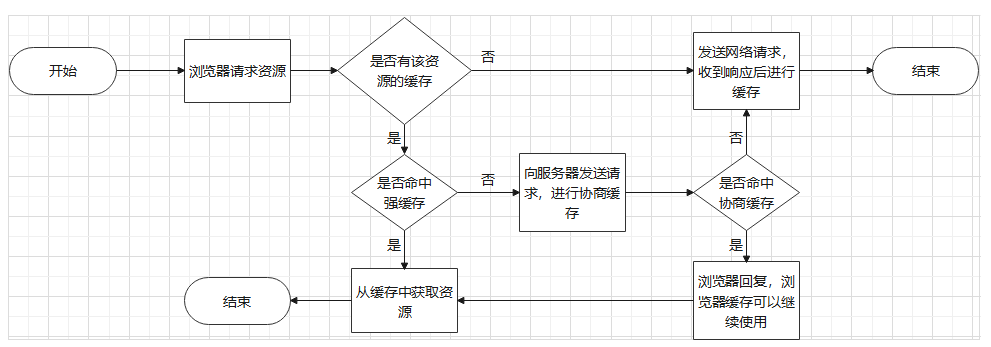

# 1.浏览器缓存配置
## 1.1 http中的Cache-Control

### 1.1.1 request中的主要Cache-Control属性值 

|属性值|说明|取值|类型|
|--------|-----|----|----|
|max-age|浏览器根据此时间(秒为单位)作为时间间隔。每个时间间隔检查缓存时间是否超过了request中设置的max-age时间。如果未超过那么继续使用，如果超过了那么进行缓存协商|数值|期限类型|
|min-fresh|浏览器将尽量使用缓存。使用前将比较min-fresh和当前时间到缓存过期时间的间隔，如果min-fresh较大，那么将使用缓存，反之将会缓存协商。这是一种较为严格的缓存策略|数值|期限类型|
|max-stale|浏览器将尽量使用缓存。如果不设置数值，那么浏览器会一直使用已有的缓存，当然如果没有缓存就会请求资源进行缓存并一直使用。如果设置数值，那么在缓存过期后，浏览器在max-stale设置的这段时间内仍能使用这个过期缓存，超出这个时间后才会进行缓存协商。|数值/不取值|期限类型|
|only-if-cached|浏览器将尽量使用缓存。当缓存过期后会进行缓存协商。|不取值|期限类型|
|no-cache|每次请求资源都要缓存协商|不取值|检查类型|
|no-store|禁止使用缓存|不取值|检查类型|
|no-transform|禁止代理服务器拦截请求来修改内容|不取值|检查类型|


### 测试
> ## max-age测试：   
> **测试步骤：**
>1. request和response中同时设置Cache-Control取值是max-age
>
> 
>2. 测试两者取不同大小时的情况，在应用服务器上对应接口查看是否发来请求来判断是否使用缓存
>
> **测试结果：**
>1. 当request中的max-age>response中的max-age时，浏览器每隔request中的max-age时间进行缓存更新
>
> 
>2. 当request中的max-age<response中的max-age时，浏览器每隔request中的max-age时间确认一下当前缓存是否过期。如果过期那么进行**缓存检查(可以参见下面的no-cache，至少要带上ETag字段)**
>
> **测试结论：**   
> 
> 当request和response中设置了max-age时，会依据request中的max-age时间进行缓存是否失效的检查。注意：在chrome浏览器中request的Cache-Control属性值都失效了。


> ## min-fresh测试：
> **测试步骤：**
>1. request中设置min-fresh为数值，response中设置max-age为数值
>
> 
>2. 测试两者大小不同时的情况，按照max-age中测试方法测试收到缓存的情况
> 
> **测试结果：**
> 
>1. 当min-fresh取值时，会把这个值和缓存剩余时间(还剩多长时间到期)做比较，如果这个值较小，那么就使用缓存，否则使用网络请求。
> 
> **测试结论：**   
> 
> 当response中设置了max-age时，request使用min-fresh会根据缓存到期时间来判断是否使用缓存。

> ## max-stale测试:
> **测试步骤：**
>1. request中设置max-stale为一个大数比如60，response中设置max-age为一个较小的数，比如5
>
> 
>2. 测试缓存接收情况
>
> 
>3. 修改max-stale为不取值
>
> 
>4. 测试缓存接收情况
> 
>  **测试结果：**
>1. 如果不设置值那么会一直使用缓存内容。如果缓存被被动删除，那么就会发网络请求，将这次结果缓存并一直使用。
>
> 
>2. 如果设置值，那么会在缓存过期后等待这个值要求的时间，之后才不会再使用缓存，而是使用网络请求。
> 
> **测试结论：**
>
> max-stale负责管控页面是否能接受一个过期的缓存，并且可以设置接受范围


> ## only-if-cached测试：
> **测试步骤：**
>1. request中设置only-if-cached，response中设置max-age为一个较小的数，比如10
>
>
>2. 测试10s内的缓存情况和10s后的缓存情况
>
> **测试结果：**
>
> 10s内获取缓存。当缓存过期后(10s后)，检测到没有缓存，那么就重新发送网络请求，重新使用缓存。
>
> **测试结论：**
>
> only-if-cached会在能使用缓存的时候尽量使用缓存，没有缓存那么会重新发送请求。


> ## no-cache测试：
> **测试步骤：**
> 1. request中设置no-cache，response中设置max-age
>
> 
> 2. 在服务器中准备验证代码，no-cache要求向服务器确认后通知浏览器是否进行缓存，浏览器对确认消息是有规范要求的
> ```javascript
> // 在对应的接口中设置检验部分
> const eTag = "12345"
> const lastModified = "123"
>    // 这个if用于缓存检验
>    // 在这里通知浏览器缓存永远没有过期，因为eTag值不会变，正常情况如果变更了，发送状态码200再加上正常请求即可
>    if(req.headers["if-none-match"]) {
>        if(req.headers["if-none-match"] === eTag) {
>            console.log("接收到验证请求")
>            res.writeHead(304, "Not Modified")
>            res.end()
>        }
>    } else {
>        // 这个部分用于还没有缓存的情况
>        res.writeHead(200, {
>            "Cache-Control": "max-age=60",
>            // 文件内容生成的hash，这里随便写了个代替
>            "ETag": eTag,
>            // 最后修改日期
>            "Last-Modified": lastModified
>        })
>        res.write("成功")
>        res.end()
>    }
> ```
> 说明：  
>* 浏览器要求收到的检验是一个状态码304的response回复，如果收到304回复那么浏览器认为缓存没有变更，会继续使用浏览器缓存。这样的好处是只需要判断状态码，不需要发送额外内容。
>
> 
>* 不论是request还是response中涉及到了“检验类型的取值”都要加上两个浏览器规定的字段，一个是"ETag"，一般是文件的hash码。一个是"Last-Modified"，是上次修改时间。有缓存检验属性时，浏览器会发送请求给服务端，会在headers加上"if-none-match"代表之前的ETag。加上"if-Modified-Since"代表之前的修改时间。服务端接收"if-none-match"可以跟目前的"ETag"对比，如果相同那么就返回304状态码，不同就重新发送新的内容作为新缓存。
>
> **测试结果：**
>1. 每次请求资源时，浏览器都会向服务器发送一个确认缓存是否变化的请求，要求返回消息状态码是304表示没有变化。
>
> **测试结论：**
>1. no-cache的好处是，是no-store的升级，允许浏览器进行缓存，但是每次请求资源都需要向服务器确认缓存是否变化


> ## no-store测试：
> 该测试比较简单，在这里简略说明，不论是request还是response中有no-store属性值，那么根本就不会使用缓存，每次都是使用网络请求。如果出现no-store和其它属性值共同使用，那么no-store的优先级是最高的。


### 1.1.2 response中的主要Cache-Control属性值
|属性值|说明|取值|类型|
|--------|-----|----|----|
|public|response传播路径上的用户(例如代理服务器)都可缓存|不取值|检查类型|
|private|response传播路径上的用户都不可缓存，只有浏览器可缓存|不取值|检查类型|
|no-cache|每次请求都要进行缓存协商|不取值|检查类型|
|must-revalidate|每次浏览器以request中的max-age作为时间间隔检查缓存是否过期时还要向浏览器发送请求进行缓存协商。这看起来像是对no-cache做了升级，减少了协商次数|不取值|检查类型|
|no-store|禁止使用缓存|不取值|检查类型|
|no-transform|代理服务器禁止修改response内容|不取值|检查类型|
|max-age|设置浏览器缓存到期时间，如果超出这个时间将会进行缓存协商|数值|期限类型|
|only-if-cached|浏览器将尽量使用缓存。当缓存过期后会进行缓存协商。|不取值|期限类型|
|immutable|2015年Facebook公司提出，希望能够进行永久缓存|不取值|期限类型|

### 测试
> ## must-revalidate测试：
> **测试步骤：**
> 
>1. request中设置max-age为一个较小数，比如10.在response中设置max-age为较大数，比如60。
>
> 
>2. 观察缓存情况
>
> 
> **测试结果：**
>1. 每隔10s，都会向页面发送一次缓存是否变更的网络请求，要求回复的状态码是304
>
> 
> **测试结论：** 
>1. must-revalidate相比于no-cache提升了效率，no-cache要求每次请求资源都要向服务器确认是否缓存变化。而must-revalidate要求当缓存过期时才向服务器发送确认消息。
> ```javascript
>    let eTag = "12345"
>    let lastModified = Date.now().toString()
>    let info = "成功"
>    
>    require("http").createServer(function (req, res) {
>       switch(req.url) {
>           case "/api/test":
>               if(req.headers["if-none-match"]) {
>                   // 如果缓存内容和服务器内容一样，虽然缓存过期了，那也接着用
>                   if(req.headers["if-none-match"] === eTag) {
>                       res.writeHead(304, "Not Modified")
>                       res.end()
>                   } else {
>                        // 如果缓存内容和服务器内容不一样，那么就重新发送回复并进行缓存
>                        res.writeHead(200, {
>                           "ETag": eTag,
>                           "Last-Modified": lastModified,
>                           "Cache-Control": "max-age=60, must-revalidate",
>                        })
>                       res.write(info)
>                       res.end()
>                   }
>               } else {
>                   res.writeHead(200, {
>                       // 添加了must-revalidata检查，在缓存过期后检查缓存内容和服务器内容是否相同
>                       "Cache-Control": "max-age=60, must-revalidate",
>                       // 文件内容生成的hash，这里随便写了个代替
>                       "ETag": eTag,
>                       // 最后修改日期
>                       "Last-Modified": lastModified
>                   })
>                   res.write(info)
>                   res.end()
>                   
>                   // 第一次(无缓存)请求后修改info和ETag和最后修改时间，模拟文件发生了更改
>                   info = "成功2"
>                   eTag = "123456"
>                   lastModified = Date.now().toString()
>            }
>            break
>       }
>   }).listen(3000)
> ```

> ## public private测试：
> **测试思路：**
>1. 由于public是允许response传播路径上所有对象缓存所以不做测试。把response设置为private，max-age=60。
>
> 
>2. 途径代理服务器时(web服务器)，使用反向代理监听到了response，测试是否可以改写headers，改写response body。
>
> **测试结果：**
>1. 代理服务器完全可以改写headers和body，可以修改response并传递给浏览器。
>
> **测试结论：**
>1. 个人的理解是public，private，no-transform这些属性实际上也类似前面提到的304状态码，是http协议的规范，如果在代理服务器中捕获response的headers见到了这样的属性，最好还是不要修改response也不要缓存。

> ## 组合使用属性的思考：
>1. request中使用max-age设置浏览器检查缓存是否过期的时间。response中使用max-age设置缓存过期时间，使用must-revalidate让浏览器每次检查都要向服务器确认，以应对多变的资源。
>
> 
>2. request中使用max-stale延长缓存使用时间，response中使用max-age设置过期时间，以应对变化较少的资源。
>
> 
>3. request中使用only-if-cached，更新缓存时间与response设置的max-age相同，response中使用max-age设置过期时间，以应对上述两种情况的折中情况。


## 1.2 http中的Expires
pre：http响应头中的Expires是用于http v1.0版本进行缓存控制，Cache-Control是用于http v1.1版本进行缓存控制

> **解释说明：**    
>1. Expires用于响应头中，取值是一个GMT(格林威治时间，北京是东八区)时间，这个时间指明了缓存到达这个时间后会过期。
>
> 
>2. 如果响应头中也设置了Cache-Control属性的过期时间，那么Expires设置的时间将会被取代。


## 1.3 http中的Pragma
pre：http响应头中的Pragma是用于http v1.0版本进行缓存控制，Cache-Control是用于http v1.1版本进行缓存控制

> **解释说明：**
>1. Pragma只能指定为no-cache，效果和Cache-Control中的no-cache效果相同。在http v1.0中可以配合Expires使用。
>
> 
>2. 由于Pragma是低版本字段，出现Cache-Control相关的检查类型属性值时Pragma将会被代替

# 2.浏览器缓存过程
### 2.1 强缓存
强缓存要求浏览器请求资源时，应该先检查缓存是否可以使用(过期)，如果可以使用那么就使用缓存，不发送网络请求

### 2.2 协商缓存
协商缓存要求浏览器在强缓存要求下请求资源时，发现当前缓存不可用(过期)，那么就应该向服务器发送一个协商缓存请求，带有if-none-match和if-modified-since字段，让服务器判断当前缓存过期后还可继续使用。

### 2.3 缓存过程


# 3.浏览器缓存位置
* ### **Service Worker:** (详情见浏览器中的进程和线程)
> Service Worker可以拦截网络请求，并利用Cache Storage进行缓存，这个实际是保存到了硬盘，可以用于离线文件加载。这个使用起来和响应头或者请求头设置Cache-Control差不多，但是设置缓存和网络请求的优先程度比较简单，做到永久缓存比较简单。Cache-Control利用immutable可以永久缓存，但是支持这个属性值的浏览器并不多。

* ### **Memory Cache:**   
> 存储在内存中，易丢失，一般存储一些小文件。

* ### **Disk Cache:**   
> 存储在硬盘中，一般存储一些大文件，由浏览器控制，响应头和请求头不能控制浏览器把缓存保存到某个具体位置

* ### **Push Cache:** (详情见计算机网络Http2.0新特性)
> http2.0中服务端可以主动给客户端推送静态文件，这和websocket推送实时数据是不一样的。举例来说，请求html网页时，html文件中含有一个css文件的请求。在http1时期需要客户端先获取html文件进行解析，遇到了远程css资源才会发送请求。而http2时期，服务端解析html文件，发现里面有css请求，此时会先把css推送到客户端，最后再发送html文件。可以理解为浏览器在接收到css时，会把css先缓存，因为html文件还没到达，这个缓存位置就是Push Cache。等到html到达后取出缓存使用并删除缓存。


# 4.浏览器刷新和导航事件
### 4.1 Chrome
* **F5刷新事件：** 浏览器重新加载页面，从缓存中加载
* **Ctrl F5强制刷新事件：** 浏览器让缓存强制过期，发送网络请求加载
* **导航事件：** 浏览器重新进行加载，先进行强缓存命中测试，如果未命中再向服务器发送请求进行缓存协商   


**注意：在测试Cache-Control时，Chrome中不论怎么设置请求头中的Cache-Control，都不会生效**

### 4.2 Firefox
* **F5刷新事件：** 浏览器重新加载页面，让缓存过期，向服务器发送请求，进行缓存协商
* **Ctrl F5强制刷新事件：** 浏览器让缓存强制过期，发送网络请求加载
* **导航事件：** 浏览器重新进行加载，先进行强缓存命中测试，如果未命中再向服务器测试协商缓存
