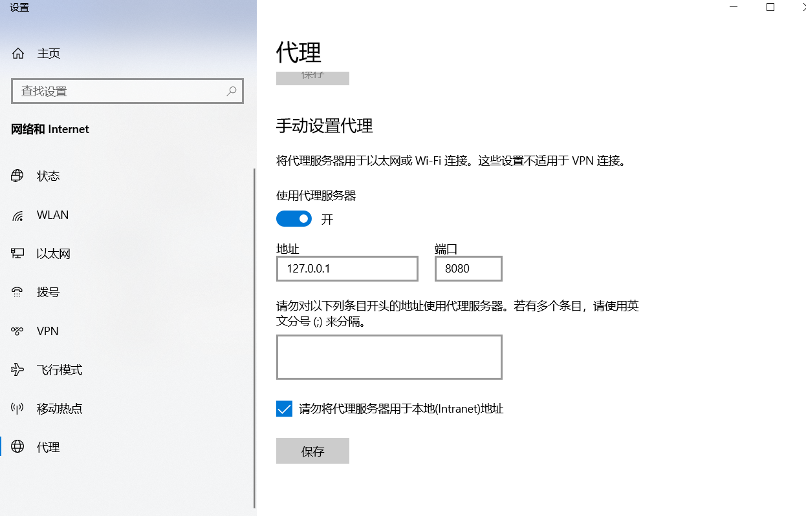

# 1.同源策略：
### 1.1 概念：
脚本只能与脚本所在文档同源的资源进行交互。**只是浏览器的安全策略，并不属于网络协议范畴。**
* 同源策略限制对象：脚本中的代码
* 同源策略中的源：脚本代码请求资源的源和包含脚本的文档的源
* 同源判断：资源的URL和文档的URL以下部分相同即可。protocol(协议) + domain(域名/IP地址) + port(端口号)

### 1.2 浏览器同源策略的实现：
1. 客户端请求能够正常发送，服务端能够正常接收，但是服务端传回来的响应会被浏览器拦截。
2. 客户端的请求无法发送，直接被浏览器拦截。

注：不少浏览器使用第一种实现方案，这很危险，请求虽然没有接到回应但是实际上触发了服务端的操作，可能会修改数据库。**测试中发现Chrome浏览器就是采取了第一种策略，所以后端接口在涉及敏感操作时一定要使用更安全的协议或者用更严格的身份验证机制。**

### 1.3 举例一：(脚本和文档不同源)
> ### 前提：
> 脚本A位于 www.Vanghua.com:8099/A.js    
> 
> 文档B位于 www.Danny.com:8080/B.html    
>
> 资源C位于 www.Danny.com:8080/C.png   
> 
> 资源D位于 www.Vanghua.com:8099/D.png   
> 
> 脚本A中有如下代码
> 
> ```javascript
> // 请求资源C
> fetch("http://www.Danny.com:8080/C.png").then(res => res.json()).then(console.log);
> // 请求资源D
> fetch("http://www.Vanghua.com:8099/D.png").then(res => res.json()).then(console.log);
> ```
> 
> 文档B中有如下代码   
> ```html
> <script src="http://www.vanghua.com:8099/A.js"></script>
> ```
> ### 问：
> 假设上述资源已经被部署到服务器上且没有代理服务器没有服务线程，现在打开文档B的链接，根据同源策略的概念脚本A能请求到什么样的资源？
> ### 答：
> 脚本A只能请求到资源C。虽然资源D和脚本A同源，但是脚本能访问的资源的源是和所包含它的文档的源是一致的，因此能够请求到资源C。**要注意！！！同源策略限制的是脚本中的代码，不会限制文档请求脚本，视频，样式表等异步资源。脚本只能和包含该脚本的文档同源的资源进行交互**

### 1.4 举例二：(脚本和文档同源)
> ### 前提：
> 文档B位于 www.Danny.com:8080/B.html  
> 
> 资源C位于 www.Danny.com:8080/C.png   
> 
> 资源D位于 www.Vanghua.com:8099/D.png   
> 
> 文档B中有如下代码
> ```html
> <script>
>   // 请求资源C
>   fetch("http://www.Danny.com:8080/C.png").then(res => res.json()).then(console.log);
>   // 请求资源D
>   fetch("http://www.Vanghua.com:8099/D.png").then(res => res.json()).then(console.log);
> </script>
> ```
> ### 问：
> 问题同举例一中的问题
> ### 答：
> 只能请求到资源C，因为资源C和文档B同源，此时没有了脚本的源作为干扰，判断起来容易一些。


# 2.CORS跨域：
### 2.1 CORS跨域介绍
CORS是基于HTTP头的跨域资源共享

### 2.2 简单请求下的CORS跨域
1. 简单请求方法请求包括：HEAD方法，GET方法，POST方法。   
   简单请求的请求头包括：Content-Type(取值只能为application/x-www-form-urlencoded、multipart/form-data、text/plain)，Accept，Accept-Language，Content-Language。   
   简单请求必须满足上述两个条件。


2. 请求配置：
   * **(Origin)** 请求头中添加Origin，取值为当前文档的源。
   * **(Credentials)** 请求对象可添加credentials属性，表示请求头携带cookie的原则，可以是不携带cookie，可以是携带同源cookie(domain和path满足条件)，可以携带跨源cookie。

3. 响应配置：
    * **(Access-Control-Allow-Origin)** 响应头必须配置Access-Control-Allow-Origin，这个表示允许跨域的源，如果和请求头中的源一样的话，那么就允许其跨域。如果为*，那么允许所有源跨域。
    * **(Access-Control-Allow-Credentials)** 响应头可以配置Access-Control-Allow-Credentials，这个表示响应头中的cookie，authorization等凭证信息是否可以暴露给客户端，如果是true表示可以暴露
    * **(Access-Control-Expose-Headers)** 响应头可以配置Access-Control-Expose-Headers，这个表示要暴露给客户端的响应头。**注!!!响应头可以在浏览器调试工具中全部看到。但是对于客户端，如果在此不做暴露，只能获取四种简单响应头(MDN)，是Accept，Accept-Language，Content-Language，Content-Type。** 

4. 测试代码：
   >### 请求跨域的客户端 
   >```html
   > <script>
   >   fetch("http://localhost:8091/test",{
   >      headers: {
   >         // 当前的源
   >         origin: "http://localhost:3000"
   >      },
   >      // 允许客户端发送同源的cookie，发送跨域cookie如果服务端没有配置和这个cookie相同的domain也会报跨域错误
   >      credentials: "same-origin"
   >   }).then(res => res.text()).then(res => {
   >      // 能够接收到服务端返回的数据"服务端同意跨域"
   >      console.log(res)
   >      // 查看服务端附带的cookie是否添加到本页面的cookie中
   >      console.log(document.cookie)
   >   })
   > </script>
   >```
   >
   >### web服务器代码 
   >```javascript
   > let fs = require("fs").promises
   > 
   > require("http").createServer(function(req, res) {
   >    // 客户端文件名为test.html，且和当前文件处于同一目录下
   >    if(req.url === "/test.html") {
   >       fs.readFile("./test.html").then(data => {
   >          res.writeHead(200, {
   >             "Content-Type": "text/html"
   >          })
   >          res.write(data)
   >          res.end()
   >       })
   >    }
   > }).listen(3000)
   > ```
   >
   >### 负责处理跨域请求的服务端 
   >```javascript
   > require("http").createServer(function(req, res) {
   >    if(req.url === "/test") {
   >        res.writeHead(200, {
   >            // 允许该源进行跨域
   >            "Access-Control-Allow-Origin": "http://localhost:3000",
   >            // 允许响应中附带凭证信息(cookie, authorization等)
   >            "Access-Control-Allow-Credentials": true,
   >            // 暴露给客户端的非基础响应头
   >            "Access-Control-Expose-Headers": "Danny",
   >            // 自定义了一个非基础响应头
   >            "Danny": "Fun Guy",
   >            // 服务端发给客户端的cookie
   >            "Set-Cookie": ["Name=Danny; max-age=10", "Gender=Man; max-age=10"]
   >        })
   >        res.write("服务端同意跨域")
   >        res.end()
   >    }
   > }).listen(8091)
   > ```

### 2.2  非简单请求下的跨域方法
1. 非简单请求的要求和上述简单请求的要求恰好相反


2. 请求过程：先向服务端发送一个Options请求，也叫预请求，prelight请求，请求头带有Origin。服务端给这个Options请求的回复需要特别配置，如果满足配置要求，那么就允许跨域。发送完预请求后，就会发送真正的请求，真正请求是否能够跨域取决于服务端给预请求的响应。Options请求会额外附带两个头字段，Access-Control-Request-Method和Access-Control-Request-Headers。


3. 请求配置：(和简单请求一样)
   * **(Origin)** 请求头中添加Origin，取值为当前文档的源。
   * **(Credentials)** 请求对象可添加credentials属性，表示请求头携带cookie的原则，可以是不携带cookie，可以是携带同源cookie(domain和path满足条件)，可以携带跨源cookie。


4. 响应配置：    
   4.1 对Option请求的响应：
      * Access-Control-Allow-Origin：必须配置允许跨域的源。
      * Access-Control-Allow-Methods：必须配置允许跨域的请求，也就是发送完Options请求后再次发送的请求使用什么方法能跨域。
      * Access-Control-Allow-Headers：可以选择配置。当Options请求结束，再次发送的请求请求头出现了非4种基本属性，那么必须在此设置才可跨域。
      * Access-Control-Max-Age：可以选择配置。表示预请求过期时间，为了提高性能减少Options请求次数可以选择缓存时间。单位是秒。
      * Access-Control-Allow-Credentials：在预检验中表示请求头中是否可以附带凭证信息。   
   
   4.2 对跨域请求的响应配置：
      * 与简单请求中的配置原则一样

5. 测试代码：
   > ### 客户端
   >```html 
   > <script>
   >     fetch("http://localhost:8091/test",{
   >         headers: {
   >             // 当前的源
   >             origin: "http://localhost:3000",
   >             // 添加一个非基础请求头也可以变为非简单请求
   >             testHeader: "hello"
   >         },
   >         // 允许客户端发送同源的cookie
   >         credentials: "include",
   >         // 改变方法变更为非简单请求
   >         method: "POST",
   >         body: JSON.stringify({
   >             message: "hello"
   >         })
   >     }).then(res => res.text()).then(res => {
   >         // 能够接收到服务端返回的数据"服务端同意跨域"
   >         console.log(res)
   >         // 查看服务端附带的cookie是否添加到本页面的cookie中
   >         console.log(document.cookie)
   >     })
   > </script>   
   >```
   > ### web服务器代码见上
   > ### 服务端
   >```javascript
   > require("http").createServer(function(req, res) {
   >   if(req.url === "/test") {
   >      if(req.headers["access-control-request-method"]) {
   >         // 如果当前是Options方法预检请求
   >         res.writeHead(200, {
   >            // 允许跨域的源
   >            "Access-Control-Allow-Origin": "http://localhost:3000",
   >            // 允许跨域的方法
   >            "Access-Control-Allow-Methods": "PUT, DELETE, GET, POST, HEAD",
   >            // 允许跨域的请求中允许的非基础头字段
   >            "Access-Control-Allow-Headers": "testHeader",
   >            // 允许请求头中附带cookie信息
   >            "Access-Control-Allow-Credentials": true,
   >            // 为了之后请求不必每次都发送预检请求，这里设置缓存时间为0秒
   >            "Access-Control-Max-Age": 0
   >         })
   >         res.end()
   >      } else {
   >         // 当前不是Options方法的预检请求
   >         res.writeHead(200, {
   >            // 允许跨域的源
   >            "Access-Control-Allow-Origin": "http://localhost:3000",
   >            // 允许响应头暴露给客户端的非基础响应头
   >            "Access-Control-Expose-Headers": "Danny",
   >            // 自定义的非基础响应头
   >            "Danny": "Danny",
   >            // 允许响应头携带cookie等凭证信息
   >            "Access-Control-Allow-Credentials": true,
   >            // 设置Cookie信息
   >            "Set-Cookie": ["Name=Danny; max-age=5", "Gender=Man; max-age=5"]
   >         })
   >         res.end()
   >      }
   >   }
   > }).listen(8091)
   >```

### 2.3 CORS跨域的优缺点

1. **移植性：** CORS便于移植，在后端代码配置跨域的源的白名单即可，收到请求后进行对比看是否可以跨域。


2. **安全性：** CORS的安全性不高，在请求头和响应头中都带有跨域者的源的信息，如果使用代理服务器这个信息会被屏蔽掉。


3. **工作量：** CORS需要前后端同时参加配置，并且如果使用了大量的非基础头字段，需要一个一个配置暴露。


# 3. JSONP跨域
### 3.1 JSONP跨域介绍

1. **(利用同源策略局限性)** JSONP跨域是利用同源策略的局限性，同源策略只是限制脚本中的代码不能访问与包含文档不同源的资源，像用link, @import, video, audio, script, img标签加载的资源是不会被同源策略限制的。JSONP设计思想是利用script标签进行跨域资源访问。


2. **(客户端script标签发送跨源请求)** 在脚本中新创建一个script标签并插入到文档中，把script的src修改为想要访问的资源，type改为text/javascript。由于这些标签加载资源都是通过get请求，所以如果想要带上参数的话需要在src的url中添加查询字段。


3. **(服务端返回可执行脚本)** 服务端在接收到请求后要配置好响应体。由于客户端使用script标签发送请求，那么请求到的数据将会作为JavaScript脚本执行。通常的做法是客户端发送的参数中除了一些感兴趣参数之外还必须带上一个回调函数标记，例如“src=http://localhost:8080/api/test?name=Danny&callback=callback” 这个callback指明了客户端已经设置了一个callback全局回调函数，服务端返回的数据应该是callback(param)形式，这样客户端接收到数据后会立即调用回调函数。

### 3.2 测试代码
> ### 客户端
>```html
> <script>
>    // 在全局作用域下赋值形式声明回调函数
>    const callback = console.log
>
>    // 创建一个script，来发送我们感兴趣的get方法http请求
>    let script = document.createElement("script")
>    script.type = "text/javascript"
>    script.src = "http://localhost:8091/test?callback=callback"
>
>    // 将script插入head，发送请求
>    document.head.append(script)
> </script>
>```
> ### web服务器代码见上
> ### 服务端代码
>```javascript
> require("http").createServer(function(req, res) {
>    if(req.url.slice(0, 5) === "/test") {
>        res.writeHead(200, {
>            'Content-Type': "text/javascript"
>        })
>
>        // 获取回调函数的名称，假设前后端工程师做了如下规定：回调函数一定在参数的最后一个
>        let callback = req.url.slice(req.url.lastIndexOf("=") + 1)
>        console.log(req.url)
>
>        // 回调函数的参数
>        let response = "服务端已经处理了请求"
>
>        // data是服务端要返回的值，以JavaScript代码返回
>        let data = `${callback}("${response}")`
>
>        res.write(data)
>        res.end()
>    }
> }).listen(8091)
>```

### 3.3 JSONP跨域的优缺点
1. **(优点)** 使用简单，不需要配置过多的条条框框
2. **(缺点)** 只支持get方法，灵活性不够

# 4.反向代理服务器
### 4.1 反向代理服务器介绍：
1. **(配置项目入口)** 代理服务器配置第一步，先指定项目入口，把项目入口文件的位置告知代理服务器。这样的话，当代理服务器启动时就会监听项目的网络请求，代理服务器会运行在某个端口上，当在浏览器访问指定端口时，代理服务器会根据指定的项目入口进行本地IO操作，将项目展示在浏览器上。
2. **(配置反向代理)** 在某个路由下配置proxy_pass，在后面指定项目的应用服务器的URL即可

### 4.2 配置介绍：(以nginx为例的简易介绍)
```nginx configuration
server {
   listen       80;
   server_name  localhost;
   location / {
       root   /usr/share/nginx/html;
       index  index.html;
    }	
   location /api {
       proxy_pass http://39.96.0.0:8051/api; # 避免项目IP地址暴露，最后两位改为0                                  
   }	
}
```
1. listen 80表示代理服务器监听80端口，当代理服务器运行时，可以通过该主机的80端口访问服务器上的内容


2. server_name 代理服务器域名


3. location表示匹配路由，假设当前服务器运行在http://danny.com:80上。访问http:danny.com:80/，此时将会匹配到“location /”规则。index指明要寻找index.html作为该URL的资源，root指明index.html位于这条目录下。location /api将会匹配所有客户端url前缀是“/api”的请求，然后proxy_pass指定将这些请求进行反向代理，请求URL"/api"之后的内容会被加在”http://39.96.0.0:8051/api“ 后面，此时位于“http://39.96.0.0:8051”上的应用服务器会接收到请求，服务器只要匹配对应的路由做出响应即可。


4. 在location匹配路由的基础上还可以给响应头或者请求头添加新的字段(可以参考浏览器服务线程充当代理服务器的操作)

### 4.3 代理服务器的优缺点

1. **(安全性)** 使用反向代理技术，能够屏蔽掉客户端的源
2. **(高性能)** 代理服务器可以进行负载均衡，参与分布式部署，能够提升效率
3. **(可移植性)** 相比CORS技术，代理服务器进行移植就稍微麻烦一些。如果应用服务器想接受多个不同的源的跨域请求，按照上面的配置方式，需要配置多台代理服务器。

# 5.postMessage + iframe 跨域
### 5.1 postMessage跨域介绍
1. **(postMessage和onmessage)** postMessage跨域主要是利用了window对象的postMessage方法发送消息，和message事件监听消息。


2. **(获取窗口引用)** 使用postMessage的前提是必须获取对应页面的window的引用。目前主要应用场景是页面和iframe页面通信，因为iframe页面的window引用易于获取。还可以通过打开一个页面后通过window.opener获取打开它的页面的window的引用，但是浏览器对此限制严格，如果跨域将无法通过window.opener获取window的引用。所以主要就是和iframe的通信。


### 5.2 测试代码
> ### test.html
> ```html
> <body>
>    <iframe src="http://localhost:4000/test2.html"></iframe>
>    <script>
>        let iframe = document.querySelector("iframe")
>        iframe.onload = function() {
>            let otherWindow = iframe.contentWindow
>            otherWindow.postMessage({
>                name: "test.html",
>                message: "hello"
>            }, "http://localhost:4000/test2.html")
>        }
>
>        window.onmessage = function({data}) {
>            console.log(data)
>        }
>    </script>
> </body>
> ```
> ### test.html所在的web服务器
>```javascript
>let fs = require("fs").promises
>
>require("http").createServer(function(req, res) {
>    // 客户端文件名为test.html，且和当前文件处于同一目录下
>    if(req.url === "/test.html") {
>        fs.readFile("./test.html").then(data => {
>            res.writeHead(200, {
>                "Content-Type": "text/html"
>            })
>            res.write(data)
>            res.end()
>        })
>    }
> }).listen(3000)
> ```
> ### test2.html
>```html
> <body>
>    <main>这是test2.html中的内容</main>
>    <script>
>        window.onmessage = function(event) {
>            console.log(event.data)
>            // 使用window.parent也可以获取嵌套本页面的页面的window的引用
>            event.source.postMessage({
>                name: "test2.html",
>                message: "I'm not fine"
>            }, "http://localhost:3000/test.html")
>        }
>    </script>
> </body>
>```
> ### test2.html所在的web服务器
> ```javascript
> let fs = require("fs").promises
>
> require("http").createServer(function(req, res) {
>    // 客户端文件名为test.html，且和当前文件处于同一目录下
>    if(req.url === "/test2.html") {
>        fs.readFile("./test2.html").then(data => {
>            res.writeHead(200, {
>                "Content-Type": "text/html"
>            })
>            res.write(data)
>            res.end()
>        })
>    }
> }).listen(4000)
> ```

### 5.3 postMessage的优缺点
1. **(通信速度快)** postMessage通信速度快，本质是利用率消息队列在进程之间通信，不发送网络请求
2. **(实现简单)** postMessage实现简单，只需要前端的参与
3. **(应用范围小)** postMessage使用范围比较小，主要就是主页面和嵌套的iframe页面通信

# 6. document.domain + iframe 跨域
### 6.1 document.domain跨域介绍
1. **(跨域判断依据)** 浏览器会依据document.domain的值进行跨域判断，document.domain表示当前网页的域名。


2. **(使用策略)** document.domain适合于子域名之间的跨域，大型公司可能有一个域名danny.com，又有很多不同功能的子域名a.danny.com, b.danny.com, a.a.danny.com等等，如果想在子域名间进行直接通信是跨域的。document.domain可以在子域名中进行设置，将域名级别进行提升，如果把两个子域名提升到同一个级别的域名那么就可以正常通信了。

### 6.2 代码测试
> ### 配置本地回环测试的子域名
>1. 打开 C:\Windows\System32\drivers\etc\hosts   
>
> 
>2. 在#号最后添加子域名，在此添加了3个子域名，由于localhost是顶级域名，进行子域名域名提升时不能提升至localhost(会报错)，所以这里设计了a.localhost
>```text
> # Copyright (c) 1993-2009 Microsoft Corp.
> #
> # This is a sample HOSTS file used by Microsoft TCP/IP for Windows.
> #
> # This file contains the mappings of IP addresses to host names. Each
> # entry should be kept on an individual line. The IP address should
> # be placed in the first column followed by the corresponding host name.
> # The IP address and the host name should be separated by at least one
> # space.
> #
> # Additionally, comments (such as these) may be inserted on individual
> # lines or following the machine name denoted by a '#' symbol.
> #
> # For example:
> #
> #      102.54.94.97     rhino.acme.com          # source server
> #       38.25.63.10     x.acme.com              # x client host
>
> # localhost name resolution is handled within DNS itself.
> #	127.0.0.1       localhost
> #	::1             localhost
> 127.0.0.1      a.localhost
> 127.0.0.1      b.a.localhost
> 127.0.0.1      c.a.localhost
> ```
> ### test.html 
>1. 测试时通过http://c.a.localhost:3000/test.html访问
> ```html
> <body>
>    <iframe src="http://b.a.localhost:3000/test2.html"></iframe>
>    <script>
>       // 测试数据，跨域后测试iframe中是否可以通过本页面window访问到该对象 
>       var info = {
>            name: "Danny",
>            message: "hello"
>        }
>        
>        // 当前document.domain是c.a.localhost，现在将域名提升至a.localhost 
>        document.domain = "a.localhost"
>
>        let iframe = document.querySelector("iframe")
>        iframe.onload = function() {
>            let otherWindow = iframe.contentWindow
>            // 测试结果是可以访问到document对象，在跨域时document对象无法访问
>            console.log(otherWindow.document)
>        }
>    </script>
> </body>
> ```
> 
> ### test2.html
>1. 测试时test.html作为iframe被嵌入test.html页面
> ```html
> <body>
>    <main>这是test2.html中的内容</main>
>    <script>
>        // 通过iframe获取本页面内容，此时本页面的document.domain是b.a.localhost，现在将域名提升至a.localhost
>        document.domain = "a.localhost"
> 
>        // 测试结果是可以访问到父页面的window对象的info元素，在跨域时只能用postMessage, onmessage属性，父页面的window对象也不能访问
>        console.log(window.parent.info)
>    </script>
> </body>
> ```
> 
> ### 本地web服务器
>```javascript
> let fs = require("fs").promises
>
> require("http").createServer(function(req, res) {
>     fs.readFile("." + req.url).then(data => {
>         res.writeHead(200, {
>             "Content-Type": "text/html"
>         })
>         res.write(data)
>         res.end()
>     }, err => {
>         res.writeHead(404)
>         res.end()
>     })
> }).listen(3000)
> ```

### 6.3 document.domain跨域优缺点：
很显然document.domain的适用情况只有子域名之间的跨域，document.domain不能设置成和当前域名完全不同的域名，只能进行子域名域名提升或降低。并且使用场所基本就是iframe，上述跨域思路是获取同源文档的window，在postMessage中提到获取窗口的引用除了同源下利用window.opener就是用iframe了，所以说这种情况基本在iframe下使用。

# 7. location.hash + iframe 跨域
### 7.1 介绍location.hash跨域
1. **(利用中介者思想)** A页面，B页面，C页面。A页面嵌套了B页面，A页面和B页面不同源，A页面和C页面同源，目前C页面用不到。如果不能使用postMessage，A和B也不是同一域名下的子域名，可以考虑使用中介者通信。**A传递消息给B，B无法传递消息给A，B把C嵌套在B页面中并设置为隐藏，再把消息传递给C。C由于和A同源，且被嵌套在A页面下(因为B被嵌在A中，C被嵌在B中)，因此C可以直接访问A的window对象，调用A设置好的消息回调函数，把B的消息传递过去。** C在此作为B的媒介帮B传递消息，严格上说这不是中介者，因为A可以直接给B通信，实际上这里的中介者指一个代发消息的对象。


2. **(利用JSONP思想)** JSONP是利用同源策略只限制脚本中的代码的局限性，改变script标签的src来发送get请求。这里参考该想法，利用iframe的src给iframe的window对象传递消息。1中过程的具体通信形式是：**A页面中给嵌套B页面的iframe的src添加hash，这样B页面的window对象可以是指hash值改变的监听函数，这样B页面就可以监听到A发来的信息。但是B页面没法向A通信，所以再嵌套页面C，以相同方法与页面C通信。由于页面C和页面A同源，从树的角度考虑嵌套形式，A的window对象是C的window对象的祖父，C可以直接操纵A的window对象，此时C直接可以把B传来的消息反馈给A。**

### 7.2 代码测试
> ### A.html (http://localhost:3000/A.html)
> ```html
> <iframe src="http://localhost:4000/B.html"></iframe>
> <script>
>  let iframe = document.querySelector("iframe")
>  iframe.onload = function() {
>      // 要发送的信息
>      let info = {
>          name: "Danny",
>          message: "hello"
>      }
>      // URL中不能出现%，经过JSON序列化可能出现这个%，需要进行编码使得字符串符合URI规则
>      let hash = "#" + encodeURIComponent(JSON.stringify(info))
>      // 利用src发送信息
>      iframe.src += hash
>  }
>
>  // 在全局作用域下添加回调函数，B收到信息后会转发给C，C会调用该回调函数
>  function callback(res) {
>      console.log("A已经收到了来自B的消息", res)
>  }
> </script>
> ```
> ### B.html (http://localhost:4000/B.html)
> ```html
> <main>
>   这是B.html的内容
>   <iframe src="http://localhost:3000/C.html" style="display: none;"></iframe>
> </main>
> <script>
>   let iframe = document.querySelector("iframe")
>   // 表示是否收到了来自A页面的消息
>   let get = false
>   iframe.onload = function() {
>       // B给A的回复信息
>       let info = {
>           name: "B",
>           message: "fuck you"
>       }
>       // JSON序列化后的字符串很肯不符合URI规范，需要再次编码
>       let hash = "#" + encodeURIComponent(JSON.stringify(info))
>       // B把消息转发给C，C直接把消息转发给A
>       iframe.src += hash
>       get = false
>   }
>
>   // 监听来自A页面的信息，监听本页面的URL中的hash值的变化
>  window.onhashchange = function({ newURL }) {
>       // A中的消息经过URI编码，需要先解码再使用JSON反序列化
>       console.log("B已经收到了A的消息", JSON.parse(decodeURIComponent(newURL.slice(newURL.lastIndexOf("#") + 1))))
>       get = true
>   }
> </script>
> ```
> ### C.html (http://localhost:3000/C.html)
> ```html
> <script>
>   window.onhashchange = ({ newURL }) => {
>       // 获取B发送的消息，遵守URI规范，必须要先进行解码后再反序列化
>       let info = JSON.parse(decodeURIComponent(newURL.slice(newURL.lastIndexOf("#") + 1)))
>       // 直接调用A的回调函数
>       window.parent.parent.callback(info)
>   }
> </script>
> ```
> ### web服务器 (A和C页面按照端口3000运行，B页面把端口改成4000运行)
> ```javascript
> let fs = require("fs").promises
>
> require("http").createServer(function(req, res) {
>     fs.readFile("." + req.url).then(data => {
>         res.writeHead(200, {
>             "Content-Type": "text/html"
>         })
>         res.write(data)
>         res.end()
>     }, err => {
>         res.writeHead(404)
>         res.end()
>     })
> }).listen(3000)
> ```
### 7.3 location.hash跨域优缺点分析
很显然这是一种复杂的跨域形式，必须需要额外的界面进行配合，代码量比较大。和document.domain相比，A和B页面不需要是同一个域名的子域名，更具有普适性。但是和postMessage方法相比，代码量过大，还必须依赖一个中介者，效率不如postMessage好。

# 8.window.name + iframe 跨域
### 8.1 window.name跨域介绍
1. **(window.name的特殊性)** window.name在当前页面的window.location发生变化时不会改变，但是其它挂载在window上的自定义全局变量会被清除。


2. **(设计思路)** 有A页面，B页面(被嵌套在A页面中)，proxy页面。其中A页面和proxy页面同源，B页面和两者不同源，和location.hash跨域的问题描述比较类似。A页面如果想要跨域获取B页面中的信息可以利用window.name。**B页面将信息保存至window.name，A页面控制当B页面加载完成后再加载和A同源的proxy页面，A页面可以直接访问被嵌套的proxy页面的window对象，此时就可以获取没有发生变化的window.name属性值了。** 严格上来讲，这只是单向通信。

### 8.2 代码测试
> ### A.html (http://localhost:3000/A.html)
> ```html
> <iframe src="http://localhost:4000/B.html"></iframe>
> <script>
>    let iframe = document.querySelector("iframe")
>    // iframe加载次数
>    let cnt = 0
>
>    iframe.onload = function() {
>       if(cnt === 1) {
>          // 第二次加载
>          // 获取嵌套页面的window对象
>          let otherWindow = iframe.contentWindow
>          // iframe.src改变不会应该嵌套页面的window.name的改变
>          console.log("A页面获取到嵌套的B页面的信息", JSON.parse(otherWindow.name))
>       } else {
>          // 第一次加载
>          cnt ++
>          // 修改iframe和当前页面同源，这样可以访问到其window对象。也可以通过iframe.contentWindow.location来修改
>          iframe.src = "http://localhost:3000/proxy.html"
>       }
>    }
> </script>
> ```
> B.html (http://localhost:4000/B.html)
> ```html
> <main>
>   这是B.html的内容
> </main>
> <script>
>   window.name = JSON.stringify({
>       name: "B",
>       message: "hello"
>   })
> </script>
> ```
> ### proxy.html (http://localhost:3000/proxy.html)
> 只需要创建一个html框架即可，什么都不用写
> ### web服务器
> 代码同上个问题

### 8.3 window.name跨域的优缺点
很显然这种方法也有很大的局限性，比location.hash的局限性还大，这只能用于页面获取嵌套页面的信息，是一种单向通信，并且可复用性很差。相比之下，postMessage几行代码就可以解决的问题，这里又大费周折。

# 9.websocket跨域

### 9.1 websocket跨域介绍
websocket是HTML5支持的一种新协议，支持全双工信道通信，同时可以进行跨域通信。websocket协议运行客户端与服务端进行持久连接

### 9.2 代码测试
> ### 使用流程
>1. 先运行服务器两个端口的本地服务器和websocket服务器
>
> 
>2. 打开A页面，此时A页面会完成websocket连接，并向B发送一条消息，由于B未连接此时存入B的消息队列
>
> 
>3. 刷新A页面，A页面断开连接后，A页面重新完成websocket连接，再次向B发送一条消息，此时B未连接，消息存入B的消息队列
>
> 
>4. 打开B页面，打开时websocket服务器把B消息队列中的消息全部发送给B，B每接收到一条消息就会向A回复一条消息
> ### A.html (http://localhost:3000/A.html)
> ```html
> <script>
>   let ws = new WebSocket("ws://localhost:8080")
>   ;(async function() {
>       await new Promise(resolve => {
>           ws.onopen = function () {
>               ws.send(JSON.stringify({
>                   origin: "",
>                   target: "",
>                   name: "A"
>               }))
>               resolve()
>           }
>       })
> 
>       ws.send(JSON.stringify({
>           origin: "A",
>           target: "B",
>           message: "hello I'm A"
>       }))
>
>       ws.onmessage = function ({data}) {
>           console.log(data)
>       }
>   })();
> </script>
> ```
> ### B.html (http://localhost:4000/B.html)
> ```html
> <script>
>   let ws = new WebSocket("ws://localhost:8080")
>
>   ;(async function() {
>       await new Promise(resolve => {
>          ws.onopen = function () {
>               ws.send(JSON.stringify({
>                   origin: "",
>                   target: "",
>                   name: "B"
>               }))
>               resolve()
>           }
>       })
>
>       ws.onmessage = function ({data}) {
>           console.log(data)
>           ws.send(JSON.stringify({
>               origin: "B",
>               target: "A",
>               message: "hello"
>           }))
>       }
>   })();
> </script>
> ```
> ### web服务器代码和前几个跨域测试代码中的服务器代码相同
> ### websocket服务器
> ```javascript
> // 使用外国友人封装的websocket包
> let ws = require("nodejs-websocket")
> // 连接名->消息队列的映射
> let messageMap = new Map()
> // 连接名->连接的映射
> let connMap = new Map()
> 
> // 发送消息
> function send(target) {
>     let messageQueue = messageMap.get(target)
>     let conn = connMap.get(target)
>     messageQueue.forEach(info => conn.send(info))
>     // 清空消息队列，注意map.get获得的只是一个副本，哪怕map中键值的值是引用类型
>     messageMap.set(target, [])
> }
>
> // 创建websocket服务
> ws.createServer(function(conn) {
>     // 假设做出了规定，客户端发送的text符合以下格式
>     // origin 表示本客户端名称
>     // target 表示要发送的客户端名称
>     // message 要发送的信息
>     // name   第一次连接时告知服务端本客户端的名称，只有第一次连接会附带这个属性
> 
>     conn.on("text", text => {
>         text = JSON.parse(text)
>
>         // 如果是第一次连接那么设置连接名->连接的映射
>         if("name" in text) {
>             connMap.set(text.name, conn)
>             // 如果当前用户连接时它的消息队列有内容，那么立即发送给它
>             if(messageMap.has(text.name))
>                 send(text.name)
>         }
>         // 如果不是第一连接那么进行消息转发
>         else {
>             // 发送目标是否拥有消息队列
>             if(messageMap.has(text.target))
>                 // 有消息队列时将消息加入消息队列
>                 messageMap.get(text.target).push(text.message)
>             else
>                 // 没有消息队列时先创建消息队列，之后将消息加入消息队列
>                 messageMap.set(text.target, []).get(text.target).push(text.message)
>
>             // 如果当前发送目标已经连接到服务器，那么发送消息队列中的所有内容
>             if(connMap.has(text.target))
>                 send(text.target)
>         }
>     })
>
>     conn.on("error", err => {
>         // 这个处理用于客户端强制退出后重启，如果不加错误监听处理服务端一定宕机
>     })
> }).listen(8080)
> ```
### 9.3 websocket跨域优缺点分析
websocket虽然支持跨域，但是最初设计目的不是用来跨域的。websocket和http协议相比最大的特点是能够持久连接，websocket适合开发推送模型，适合用于聊天室等推送订阅模型。

<br>


# 10. 代理服务器中的正向代理和反向代理
### 10.1 正向代理
> ### 正向代理介绍
> 正向代理是代理服务器的一种行为，正向代理时代理服务器会将连接到代理服务器的**所有**客户端的请求拦截，并以代理服务器的名义转发。这些连接到代理服务器的客户端可以通过此方式访问**任何**服务端。由于是以代理服务器的名义转发客户端请求，所以服务端只知道是代理服务器发送请求，并不知道存在客户端。
> ### 正向代理流程
>1. 给应用程序设置代理服务器，下图是在win10下设置了应用于wifi和以太网的代理服务器。本地任何通过wifi或以太网发送的请求都将被代理服务器拦截转发。
>
> 
>2. 打开浏览器测试，发送一个http请求(下面是http代理服务器)。此时该http请求会被运行在127.0.0.1的8080端口的代理服务器捕获，代理服务器将转发该请求。
>
> 
>3. 服务端收到请求，发送方是某个代理服务器。服务端将响应返回给代理服务器，代理服务器收到响应后，将响应内容转发给客户端。
> 
> ### 正向代理服务器代码
> ```javascript
> // 这是一个最基础的仅仅对http请求进行正向代理的代理服务器
> require("http").createServer(function (req, res) {
>     console.log("catch the request is " + req.url)
>
>     // 配置完正向代理后，这里将会拦截所有请求，由nodejs转发这些请求
>     let request = http.request(req.url, {
>         headers: req.headers
>     }, function(response) {
>         // nodejs转发后接收到请求，再把这些请求转发给客户端
>         response.on("data", data => {
>             res.write(data)
>         })
>         response.on("end", () => {
>             res.end()
>         })
>         response.on("error", err => console.log)
>     })
>
>     // 请求发送完成
>     request.end()
> }).listen(8080)
> ```
> ### 配置正向代理
> 

### 10.2 反向代理

> ### 反向代理介绍
> 反向代理是代理服务器的一种行为，反向代理时代理服务器会将连接到代理服务器的**所有**客户端的请求拦截，代理服务器只能拦截host是代理服务器的请求(danny.com代理服务器不能拦截google.com的请求，可以拦截danny.com/api/test请求)，并以代理服务器的名义转发。这些客户端可以访问代理服务器**指定**的服务端，这些服务端是客户端不可见的，因为它们根本不知道服务端地址，在正向代理中客户端请求中明确给出了服务端地址。由于代理服务器指定某些服务端，所以客户端并只知道代理服务器，不知道服务端的存在。
> ### 反向代理流程
>1. 不用像正向代理那样配置代理，只需要维持反向代理服务器运行即可
>
> 
>2. 打开浏览器测试，发送一个host是反向代理服务器的请求。例如反向代理服务器是danny.com,就发送danny.com/test。如果用下面代码测试，那么就发送http://localhost:4000/A.html。代理服务器捕获该请求，将其转发给自己指定的服务端http://localhost:3000，由于完整请求时http://localhost:4000/A.html，所以转发为http://localhost:3000/A.html
>
> 
>3. 服务端收到请求(提前运行服务端http://localhost:3000，并在同目录下创建A.html用作测试)，将响应返回给代理服务器，代理服务器再将响应转发给客户端
> 
> ### 反向代理服务器代码
> ```javascript
> let proxy = require("http-proxy").createProxyServer({})
>
> require("http").createServer(function(req, res) {
>     proxy.web(req, res, {
>         target: "http://localhost:3000"
>     })
> }).listen(4000)
> ```
> ### 代理目标服务器代码 (反向代理是否成功的测试)
> ```javascript
> let fs = require("fs").promises
>
> require("http").createServer(function(req, res) {
>     fs.readFile("." + req.url).then(data => {
>         res.writeHead(200, {
>             "Content-Type": "text/html"
>         })
>         res.write(data)
>         res.end()
>     })
> }).listen(3000)
> ```

> ### 参考
> [1] https://segmentfault.com/a/1190000011145364    
> [2] <<Javascript权威指南(第七版)>>   
> [3] https://blog.csdn.net/w2sft/article/details/103979438   
> [4] https://www.jianshu.com/p/89c18b9eaad5    
> [5] https://www.zhihu.com/question/36412304/answer/471185862  
> [6] https://www.zhihu.com/question/24723688/answer/128105528
