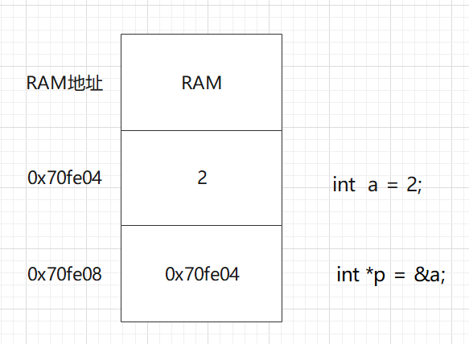
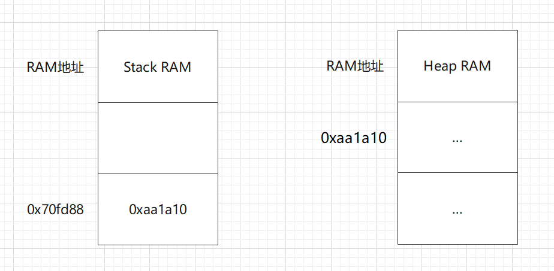

### 1.引用

#### 1.1 静态特性

 引用创建时必须指向一块内存，并且不能再次更改，类似于const声明的静态变量。

#### 1.2 封装特性

 引用在汇编层面的表现和指针一样，都占用一块内存，存储着另一块内存的地址。但在高级语言层面引用的表现和它指向的内存对应的变量的表现相同，因此在此层面可以说引用是变量的别名。

举例:

**1.引用是变量的别名：**

```c++
int c = 20;
int b = 10;
int &a = b;
a = c;
cout << a << " " << &a; // 20 0x70fe0c

int* k = new int(2);
int* &q = k;
q = new int(3);
cout << q; // 3
```

**2.找不到方法改变引用：**

```c++
// none
```

#### 1.3 引用的声明

引用的声明只需要在变量前加上取址符即可


### 2.指针

#### 2.1 指针的创建过程

1. 在程序中声明一个指针，给指针赋值，值是一个地址。

2. 在内存中开辟一块空间，把传给指针的地址保存进去。

#### 2.2 基本类型变量指针和对象指针

存储在栈内存中基本类型变量指针图示：



存储在堆内存中的对象类型变量指针图示：

