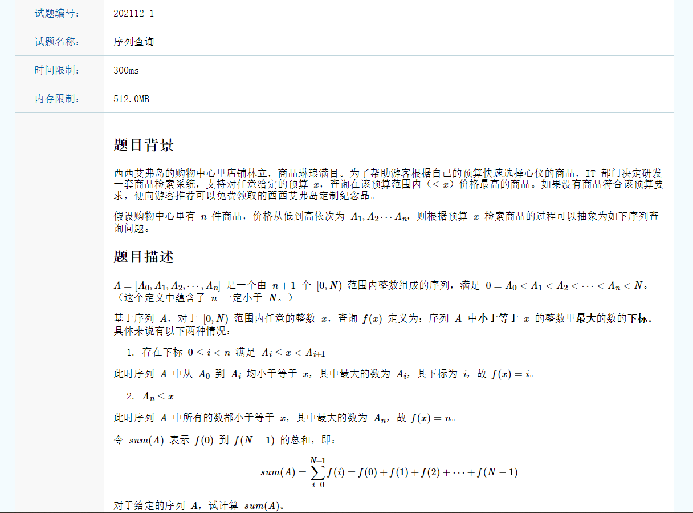
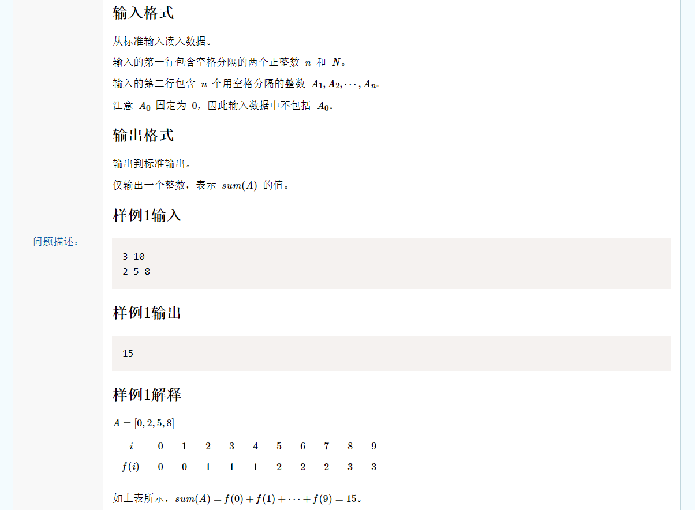
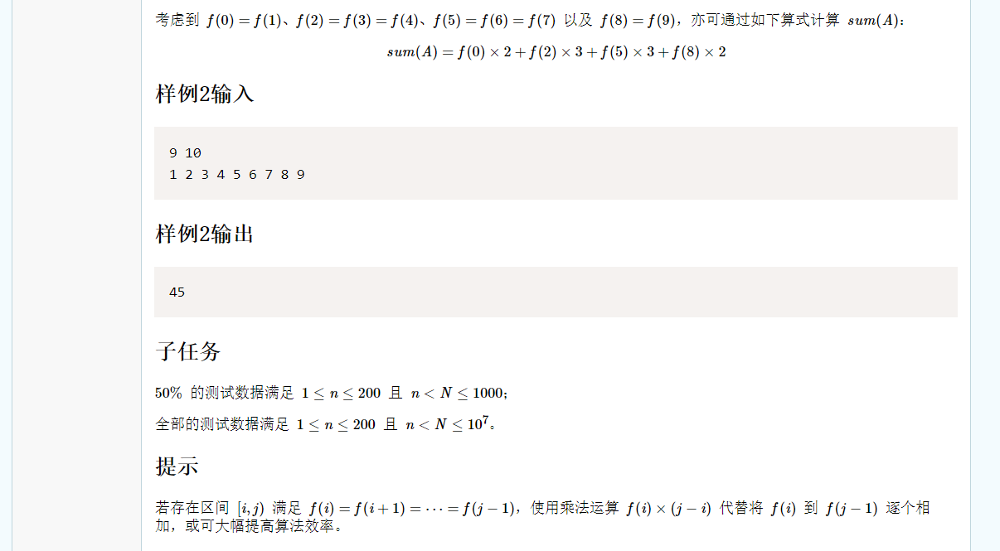

# 思路一：二分查找

遍历0-N来计算f(i)是不可避免的，至少有O(N)的复杂度。

题目中提到A数列是不下降序列，且有“查找最大的不大于x的下标”的语句，不难想到二分查找。

在计算每个f(i)时，使用二分查找的复杂度是O(logn)，计算所有f(i)的复杂度就是O(N*logn)。

最终复杂度就是O(N*longn)。

```c++
#include <iostream>
using namespace std;
int ar[201];

int find(int* arr, int n, int target) {
	int l = 0, r = n, mid;
	while(l <= r) {
		mid = (l + r) / 2;
		if(arr[mid] <= target)
			l = mid + 1;
		else
			r = mid - 1;
	}
	return r;
}

int main() {
	int n, N, sum = 0;
	cin >> n >> N;
	for(int i = 1; i <= n; i ++) 
		cin >> ar[i];
	for(int i = 0; i < N; i ++) 
		sum += find(ar, n, i);
	cout << sum;
}
```


# 思路二：差分+前缀和

遍历0-N来计算f(i)是不可避免的，至少有O(N)的复杂度。

计算sum f(i)，根据“非零段划分”中的经验可知，在O(N)计算完f(i)后，通过递推前缀和即可O(1)查询sum。

如果使用暴力法，f(i)即在原数列中找到第一个小于等于i的下标，复杂度是O(n)。

考虑序列操作的常见优化，二分查找可以降低复杂度到O(logn)，记录差分数列后单点查询加前缀和优化，复杂度是O(1)。


**总结：**

**树状数组优化差分：**

> 树状数组对差分数列的优化是指在单点查询时复杂度降低到了O(logn)。如果查询连续多个点，性能不如前缀和优化的差分。

**前缀和优化差分：**

> 但是如果需要使用差分数列查询一些连续的点，可以使用差分数列的前缀和数列优化，使用O(n)复杂度遍历差分数列计算出差分数列的前缀和数列，之后查询任何一点的复杂度都是O(1)。


使用差分的话就考虑原数列中差分的含义。原数列有x和y，x的下标比y的下标小1，那么y - x即为差分。不难看出差分与f(i)的关系，如果i取[x, y - 1]的值，那么f(i)一定为i。那么相当于初始时f(i)数列都为0， 此时[x, y - 1]区间内的f(i)的值都加上i。那么根据差分的性质，直接更新对应位置的差分数列的值即可。

在求f(i)时，求对应差分数列的前缀和即可。由于要求出所有的f(i)，是多个连续操作，因此适合前缀和优化差分。最终复杂度是O(1)。

最终复杂度就是O(N)。

```c++
#include <iostream>
using namespace std;
int br[10000001];

int main() {
	int n, N, x = 0, y;
	cin >> n >> N;
	for(int i = 0; i < n; i ++) {
		y = x;
		cin >> x;
		if(x >= y) {
			br[y] += i;
			br[x] -= i;
		}
	}
	
	if(N - 1 >= x) {
		br[x] += n;
		br[N] -= n; 
	}
	
	int preSum = 0, sum = 0;
	for(int i = 0; i < N; i ++) {
		preSum += br[i];
		sum += preSum;
	}
	
	cout << sum;
}
```


# 思路三：差分+前缀和+题目提示优化

题目中提示没必要求出所有的f(i)，对于相同的f(i)只需要知道其个数即可。在思路二中提到差分的意义是对应区间的f(i)都加上i，那么就是说明对应区间的f(i)的值都是i。由此可知我们求完差分后直接可以得出所有f(i)之和，没必要遍历[0, N)求出所有f(i)，因为可能有很多f(i)相同。这样就把时间复杂度由O(N)降低到了O(n)，空间复杂度由O(N)降低到了O(1)。

其实就是一个递推式子，硬要扯上关系就是用到了差分和前缀和的思想。

```c++
#include <iostream>
using namespace std;

int main() {
	int n, N, x = 0, y, sum = 0;
	cin >> n >> N;
	for(int i = 0; i < n; i ++) {
		y = x;
		cin >> x;
		if(x > y) 
			sum += (x - y) * i;
	}
	if(N > x)
		sum += (N - x) * n;
	cout << sum;
}
```

