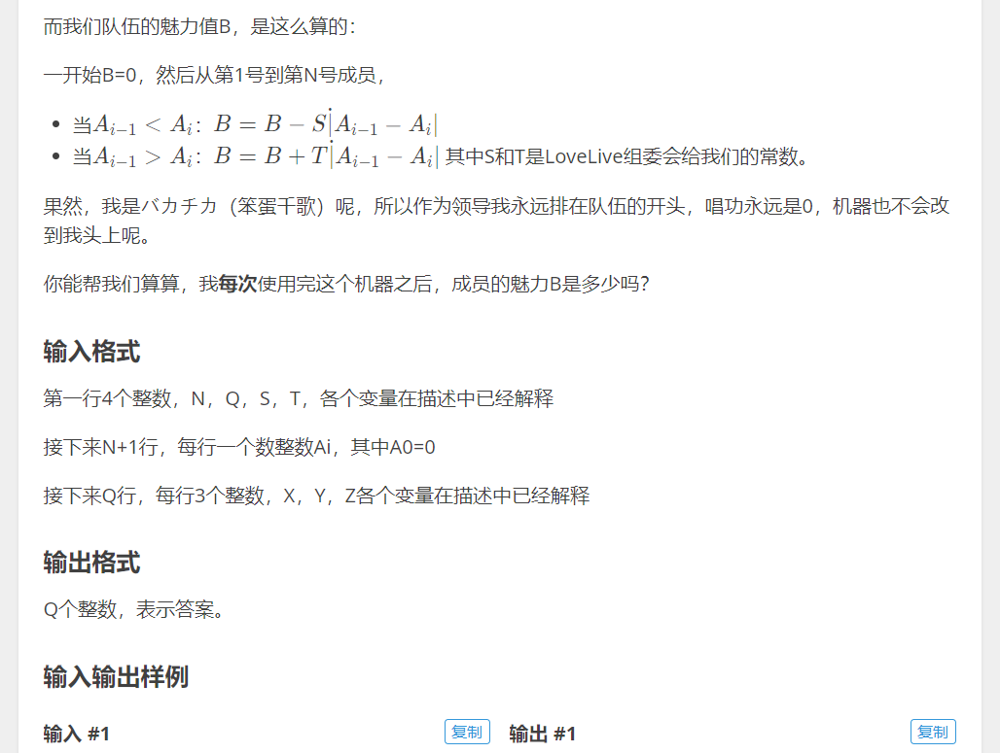
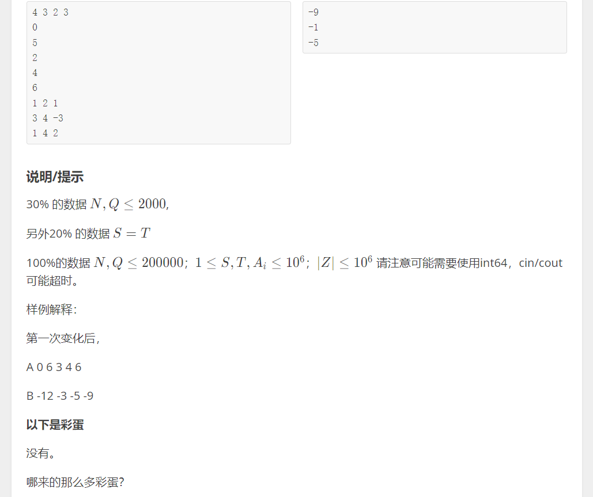

# 思路：

参考“树状数组数据结构”博客，这道题是明显的区间修改，单点查询类型。只不过是将单点查询变了个意思，每次查询队伍的魅力值。队伍的魅力值是由原数列所有元素计算的来的，可以算得上是单点查询。当前的魅力值和上一次的魅力值相比，差异的原因是修改区间的左边界和右边界造成的，在此维护差分数组即可。当前的魅力值因此就可以由上次的魅力值以O(1)的复杂度推出。

此题的数据量是```2*10^5```，计算魅力值时使用O(logn)的算法也可以，也就是用树状数组也能过。但是是用树状数组就没什么意思了，代码变得复杂。树状数组存储原数列的差分值即可。每当查询当前魅力值时计算左右边界的差分即可。

```c++
#include <cstdio>
#include <cmath>
#include <iostream>
using namespace std;
#define ll long long
ll ar[200002];

int main() {
	int N, Q;
	ll B = 0, S, T;
	scanf("%d %d %ld %ld", &N, &Q, &S, &T);
	int x, l, r, y, k;
	
	scanf("%d", &x);
	for(int i = 1; i <= N; i ++) {
		y = x;
		scanf("%d", &x);
		ar[i] = x - y;
		B += x > y ? (-1) * S * (x - y) : T * (y - x);
	}
	ll lastValL, lastValR, nowValL, nowValR;
	for(int i = 0; i < Q; i ++) {
		scanf("%d %d %d", &l, &r, &k);
		lastValL = ar[l] > 0 ? (-1) * S * abs(ar[l]) : T * abs(ar[l]);
		nowValL = ar[l] + k > 0 ? (-1) * S * abs(ar[l] + k) : T * abs(ar[l] + k);
		B += nowValL - lastValL;
		lastValR = r + 1 > N ? 0 : ar[r + 1] > 0 ? (-1) * S * abs(ar[r + 1]) : T * abs(ar[r + 1]);
		nowValR = r + 1 > N ? 0 : ar[r + 1] - k > 0 ? (-1) * S * (ar[r + 1] - k) : T * abs(ar[r + 1] - k);
		B += nowValR - lastValR;
		ar[l] += k;
		ar[r + 1] -= k;
		printf("%ld\n", B);
	}
}
```

