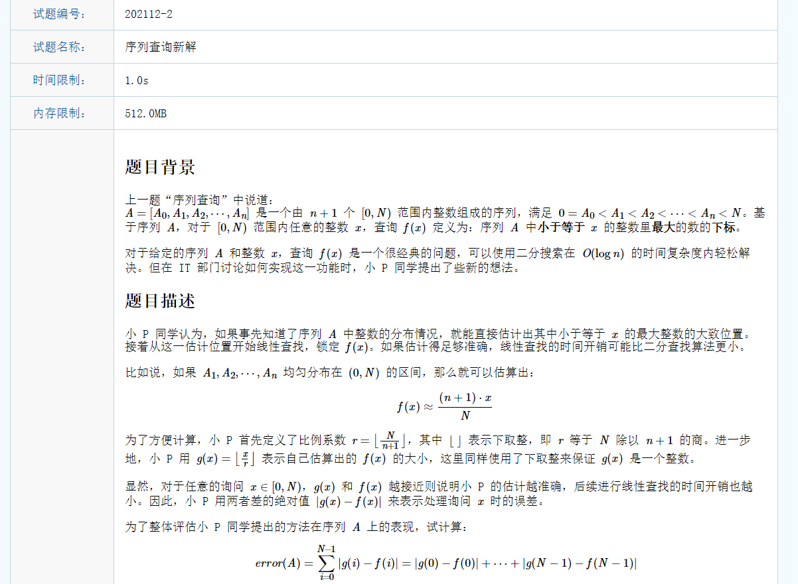
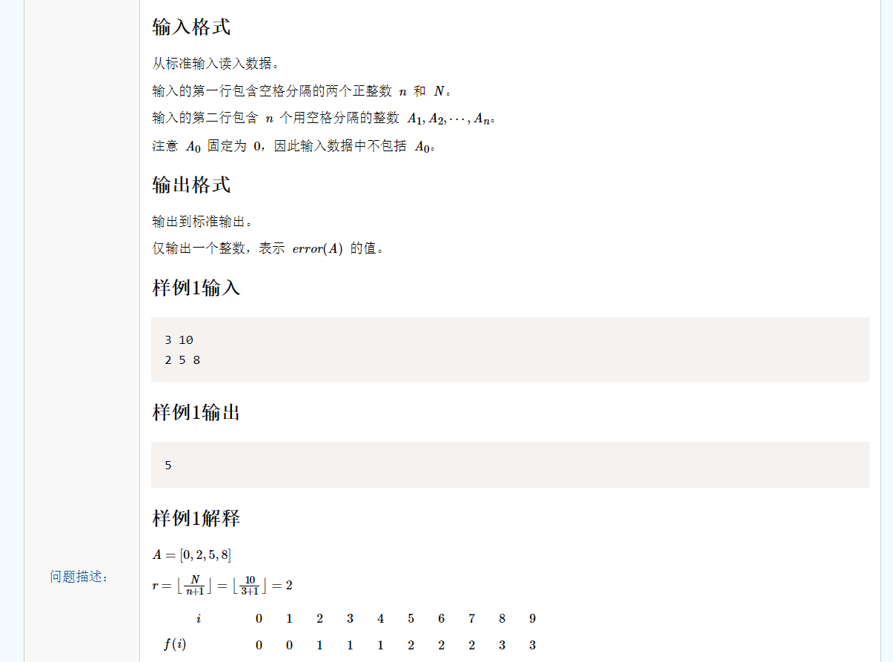
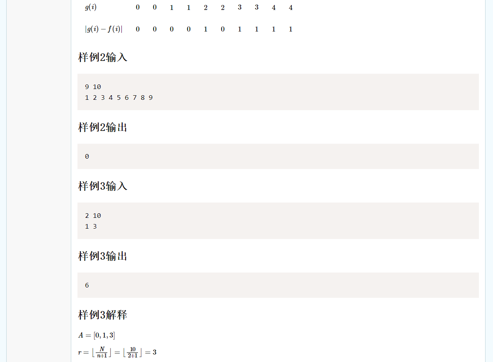
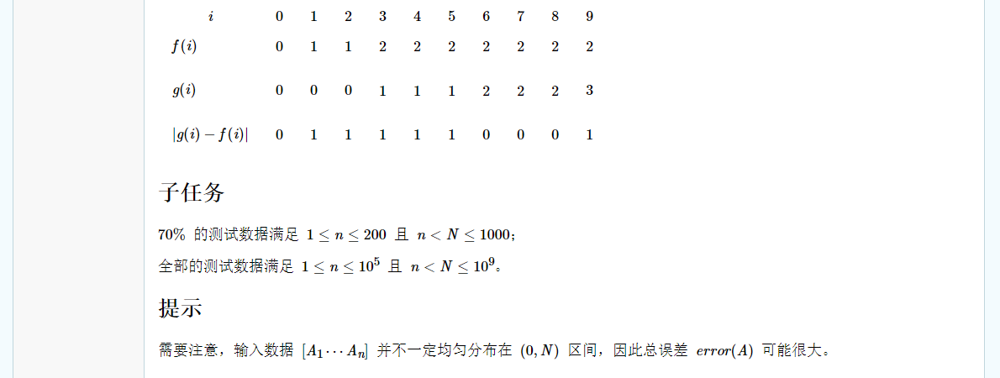
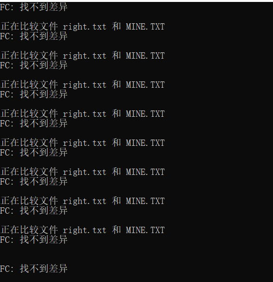
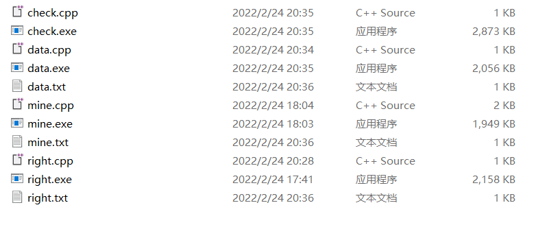

### 拿“序列新解查询”为例来说明对拍程序的使用










### 1.你的待验证代码 mine.cpp

题目样例很少，我们需要自己制造更多样例。

```c++
#include <iostream>
#include <cmath>
using namespace std;
#define ll long long 

ll getFSum(int x, int y, int i) {
	return (ll)(x - y) * i;
}

ll getGSum(int pos, int r) {
	int st = 0;
	int seqNum = (pos + 1) / r;
	int lastSeqNum = (pos + 1) % r == 0 ? 0 : 1;
	ll sum = (ll)seqNum * (seqNum - 1) / 2 * r;
	ll lastSum = (ll)seqNum * lastSeqNum * ((pos + 1) % r);
	return sum + lastSum; 
}

ll getSum(int x, int y, int r, int i) {
	int f, gMin, gMax, changedIndex;
	ll sum = 0;
	f = i;	
	gMin = y / r;
	gMax = (x - 1) / r;
	if(f >= gMax) 
		sum += getFSum(x, y, i) - (getGSum(x - 1, r) - getGSum(y - 1, r));
	else if(f <= gMin) 
		sum += (getGSum(x - 1, r) - getGSum(y - 1, r)) - getFSum(x, y, i);
	else {
		for(int k = gMin; k <= gMax; k ++)
			if(k >= i) {
				changedIndex = y + (k - gMin) * r;
				sum += getFSum(changedIndex, y, i) - (getGSum(changedIndex - 1, r) - getGSum(y - 1, r));
				sum += (getGSum(x - 1, r) - getGSum(changedIndex - 1, r)) - getFSum(x, changedIndex, i);
				break;
			}
	}
	return sum;
}

int main() {
	int n, N, x = 0, y, r;
	ll sum = 0;
	cin >> n >> N;
	r = N / (n + 1);
	
	for(int i = 0; i < n; i ++) {
		y = x;
		cin >> x;
		if(x > y) 
			sum += getSum(x, y, r, i);
	}
	
	sum += getSum(N, x, r, n);

	cout << sum;
}
```


### 2.你的绝对正确的暴力代码 right.cpp

该代码是从网络上摘取的AC代码

```cpp
#include <bits/stdc++.h>
using namespace std;

long long h(long long i, long long r) { 
    if (i < 0) return 0;
    else return r * ((i + 1) / r - 1) * ((i + 1) / r) / 2 + (i + 1) % r * (i / r);
}

long long cal(long long fi, long long lft, long long rgt, long long r) { 
    return abs(h(rgt, r) - h(lft - 1, r) - fi * (rgt - lft + 1));
}

int main()
{
	long long n, N, t;
	cin >> n >> N;
	vector<long long> a = {0};
	for (int i = 0; i < n; ++i) {
		cin >> t;
		a.push_back(t);
	}
	a.push_back(N);
	long long r = N / (n + 1), ans = 0;
		long long lft = a[fi], rgt = a[fi + 1] - 1;
		if (lft / r >= fi || rgt / r <= fi) ans += cal(fi, lft, rgt, r); 
		else ans += cal(fi, lft, r * fi, r) + cal(fi, r * fi + 1, rgt, r); 
	}
	cout << ans;
	return 0;
}
```


### 3.数据生成代码 data.cpp

模仿题目输入格式，以相同格式输出数据即可

```srand(time(0));```表示种下随机数种子，每次使用时随机数不同。

```c++
#include <iostream> 
#include <ctime>
#include <algorithm>
using namespace std;
int ar[1000];
int main()
{
	srand(time(0));
	int n, N = 0, x = 0, y;
	n = rand()%10 + 1;
	
	for(int i = 0; i < n; i ++) {
		y = x;
		x = rand()%10 + 1;
		while(x < y)
			x = rand()%10 + 1;
		ar[i] = x;
	}
	
	N = rand()%11 + 10;
	cout << n << " " << N << endl;
	for(int i = 0; i < n; i ++) 
		cout << ar[i] << " ";
	return 0;
}
```


### 4.对拍程序控制代码 check.cpp

``` system("data.exe > data.txt");```表示执行data.exe，将结果写入data.txt。>表示写入(大于小于号的箭头方向表示数据方向)。

```system("mine.exe < data.txt > mine.txt");```表示执行mine.exe，从data.txt读入数据，结果写入mine.txt。<表示读取。

```system("fc right.txt mine.txt")``` fc两个txt文件表示对比两个文件的差别。

```c++
#include<iostream>
#include<windows.h>
using namespace std;
int main()
{
	int t=200;
    while(t)
    {
		t--;
        system("data.exe > data.txt");
        system("mine.exe < data.txt > mine.txt");
        system("right.exe < data.txt > right.txt");
        if(system("fc right.txt mine.txt"))   break;
    }
    cout<<"no error"<<endl;
    return 0;
}
```

对拍程序运行示例：




### 5.文件位置以及事先准备工作

步骤一：将这些cpp放入同一个文件夹下，因为check.cpp中写的就是从当前文件夹读取与写入。



步骤二：需要实现对除了check.cpp之外的文件进行编译，得到目标代码（可参考编译原理）。

步骤三：最后编译运行check.cpp即可。