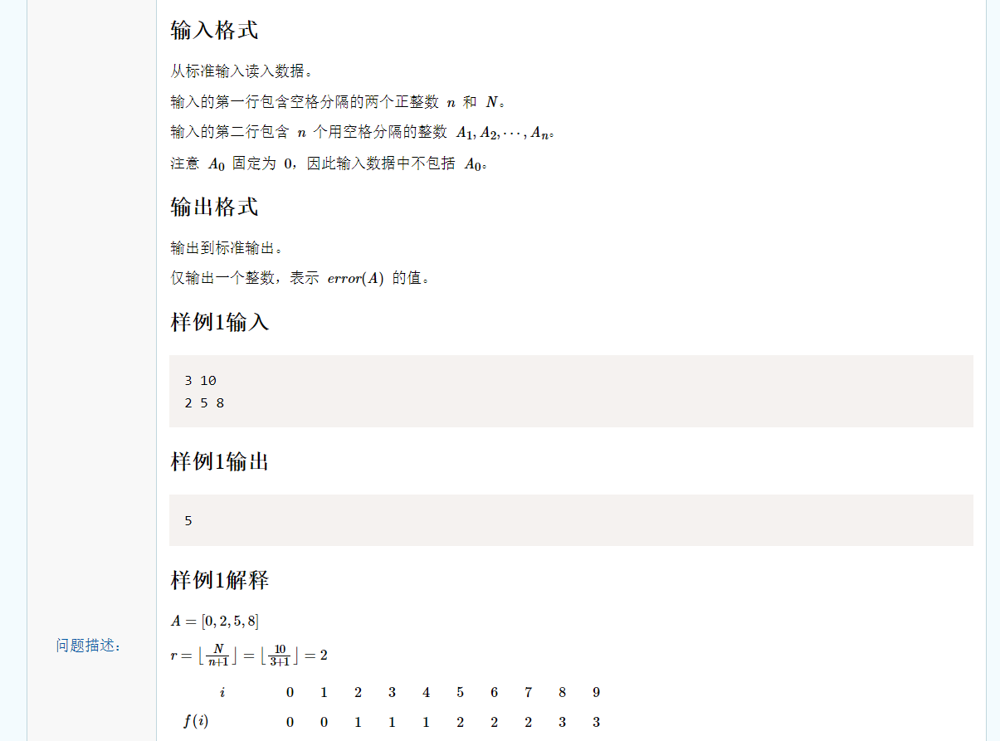
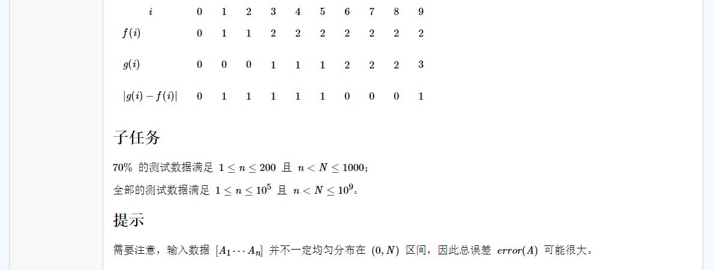

# 思路：

**回顾序列查询：**

本题是“序列查询”的延续，在序列查询中介绍了最优方法是O(n)，遍历原数列，原数列中大于0的差分```a[i + 1] - a[i]```的含义就是在该区间内的```f(k)，k∈[a[i], a[i + 1])```的值都为```i```。在本题中继续延续该思路即可，如果是暴力法，遍历```[0, N)```再对于每个值在原数列中二分查找答案，这样复杂度是O(N*logn)，N是10^9，肯定超时。

**尝试直接使用公式求g数列某个区间的和：**

本题先确定差分的含义（如上），根据差分容易求出差分值对应区间所有f(i)的和。观察g数列，好像也能在差分值对应区间求出其g(i)的和。但是要注意，g数列每过r个数后值加一，在差分值对应的区间```[a[i], a[i + 1])```中，可以确定第一个g(i)和最后一个g(i)，但是不好以O(1)的复杂度确认这个区间所有g(i)之和。情况比较多，导致公式比较复杂，在初次思考时就是想要直接以O(1)复杂度直接求出某个区间的g数列之和。这样公式变量很多，调整很多次才发现情况远比最初思考的要多。

**维护g数列的前缀和来求g数列某个区间的和：**

回顾一下，根据差分值的实际意义，我们容易求出f数列某个区间之和。但是对于g数列，直接求和的公式非常繁琐，考虑情况也很多。这时不妨考虑维护前缀和数组。继续观察g数列，发现求g数列的前缀和的情况要简单的多。g数列一定是由k个长度为r的区间组成，最后一个区间的长度在```[0, r - 1]```之间，可以通过```(a[i + 1] - a[i]) % r```求出，这样发现维护前缀和的空间复杂度为O(1)，不需要使用数组递推得到。因此有了前缀和数列，可以简单地以O(1)复杂度查询g数列某个区间的和。

**计算某个区间f数列的和减去g数列的和：**

已经思考出了O(1)查询g数列和f数列的某个区间的和，但是不能直接令其相减。如果g数列在这个区间中，先是小于f数列值，又在某个位置之后大于f数列的值，这样```|Σg(i) - Σf(i)| != Σ|g(i)-f(i)|```。我们只能在一个f数列全部小于等于g数列的区间或者一个f数列全部大于等于g数列的区间进行计算，否则就不得不以O(N)暴力遍历i的值了。不过转折点很好找，利用g数列的特点容易找到转折点分开计算，就是下面代码提到的```changedIndex```即为转折点。

最终复杂度是O(n)。

```c++
#include <iostream>
#include <cmath>
using namespace std;
#define ll long long 

// 求f数列某个区间的值。x表示区间的右边界开区间，y表示左边界闭区间，i表示区间内的任意元素值为i
ll getFSum(int x, int y, int i) {
	return (ll)(x - y) * i;
}

// 计算g数列前pos项的和
ll getGSum(int pos, int r) {
	int st = 0;
	// 前pos项中完整长度为r的区间的个数
	int seqNum = (pos + 1) / r;
	// 前pos项中最后一个不完整区间的个数，为0或1
	int lastSeqNum = (pos + 1) % r == 0 ? 0 : 1;
	// 千seqNum个区间的区间和
	ll sum = (ll)seqNum * (seqNum - 1) / 2 * r;
	// 最后一个区间中的值的和
	ll lastSum = (ll)seqNum * lastSeqNum * ((pos + 1) % r);
	return sum + lastSum; 
}

// 计算yx区间内g-f的绝对值
ll getSum(int x, int y, int r, int i) {
	int f, gMin, gMax, changedIndex;
	ll sum = 0;
	f = i;	
	gMin = y / r;
	gMax = (x - 1) / r;
	if(f >= gMax) 
		sum += getFSum(x, y, i) - (getGSum(x - 1, r) - getGSum(y - 1, r));
	else if(f <= gMin) 
		sum += (getGSum(x - 1, r) - getGSum(y - 1, r)) - getFSum(x, y, i);
	else {
		for(int k = gMin; k <= gMax; k ++)
			if(k >= i) {
				changedIndex = y + (k - gMin) * r;
				sum += getFSum(changedIndex, y, i) - (getGSum(changedIndex - 1, r) - getGSum(y - 1, r));
				sum += (getGSum(x - 1, r) - getGSum(changedIndex - 1, r)) - getFSum(x, changedIndex, i);
				break;
			}
	}
	return sum;
}

int main() {
	int n, N, x = 0, y, r;
	ll sum = 0;
	cin >> n >> N;
	r = N / (n + 1);
	
	for(int i = 0; i < n; i ++) {
		y = x;
		cin >> x;
		if(x > y) 
			sum += getSum(x, y, r, i);
	}
	
	// 最后计算xN区间
	sum += getSum(N, x, r, n);

	cout << sum;
}
```


# 差分总结：

### 1.差分值的实际意义：

**1.基本意义：后一个数与前一个数的差**

举例：

优化区间修改和单点查询。

差分+前缀和：通常区间修改是O(n)操作，单点查询是O(1)操作。使用差分优化后区间修改是O(1)操作，单点查询需要求差分数组前缀和，是O(n)操作，通常以O(n)维护差分数组前缀和，之后查询就是O(1)查询了。**(非零段划分)**

差分+树状数组：通常区间修改是O(n)操作，单点查询是O(1)操作。使用差分优化后区间修改是O(1)操作，单点查询需要求差分数组前缀和，是O(n)操作，如果单点查询次数不多，可以使用树状数组优化，求前缀和的时间复杂度降低到O(logn)。**(非零段划分)**


**2.表示某个区间**

举例：

差分值表示对某一个区间进行加上一个数或减去一个数的操作。**(非零段划分，序列查询，序列查询新解)**


**3.表示最终结果**

举例：

差分值表示最终结果的一部分。**(NOIP积木大赛，NOIP铺设道路)**


### 2.差分的变式：

在差分的基础模型中差分表示后一个数减去前一个数。但实际上很多时候会有限制，比如我们只需要后一个数大于前一个数的差分值。**(积木大赛，铺设道路，非零段划分，序列查询)**


### 3.差分关注什么：

在**非零段划分，积木大赛，铺设道路** 中只考虑差分值，很难与最终结果建立联系。但是差分就是关注后一个数与前一个数的差值关系。

在**积木大赛** 中，我们只在一个不下降的序列中计算差分值，表示当前积木比前一个积木需要多花费几天。在**非零段划分** 中差分值对应的区间中的p值来划分当前数列，至少在当前位置制造一个非零段。在考虑时想要把差分的局部状态和全局状态建立联系需要更严格的证明，但是不妨推测差分的局部状态影响全局状态也是一种好方法。

