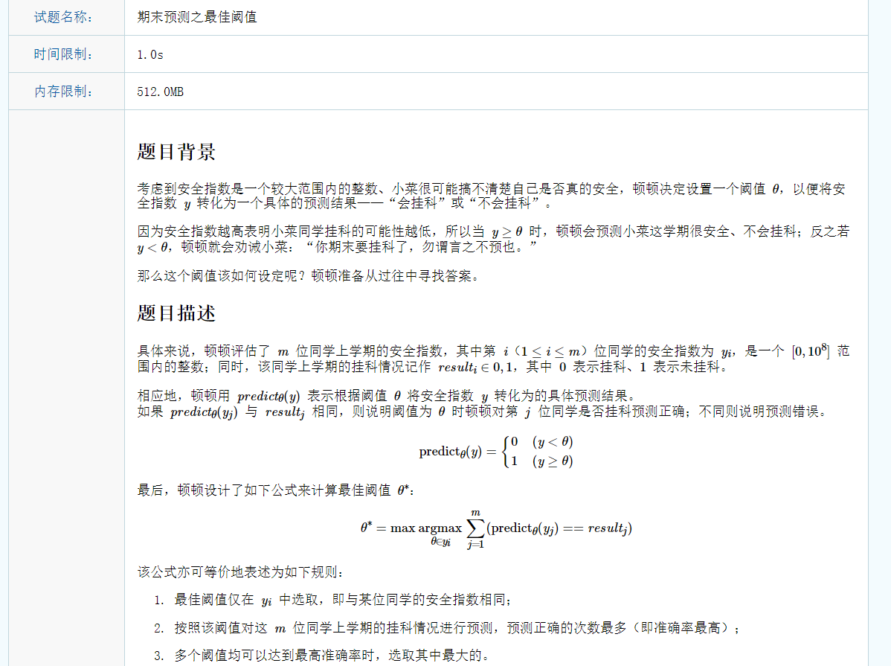
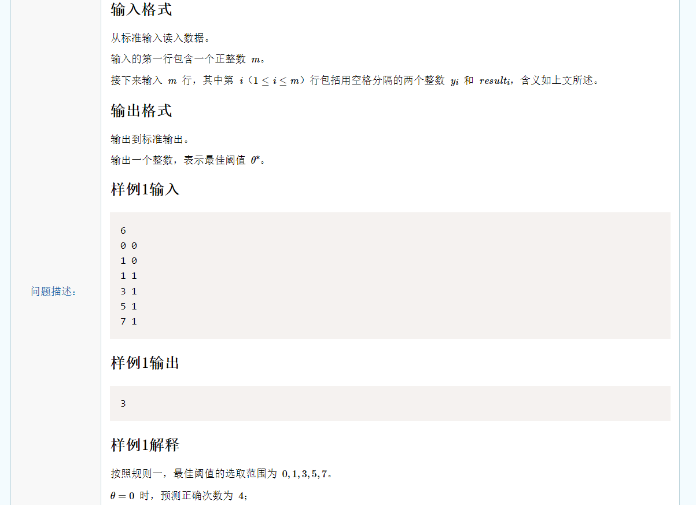
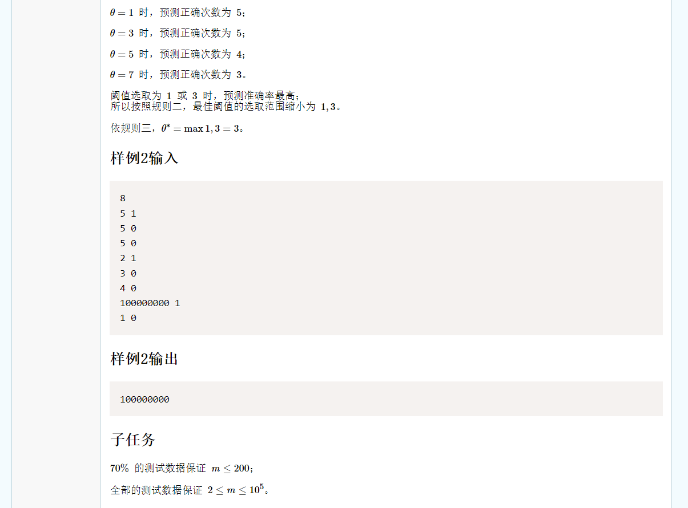

# 思路一：二分查找

如果使用暴力法，在尝试每一个y值时都要遍历一遍数列做对比，查询总时间是O(n^2)，对于每一个y都是O(n)的查询时间。

对于y的查询推测可以降低到O(1)或O(logn)级别，对于O(1)级别，一定是有公式可以直接推导出该y值能够准确预测的数目。

如果能够将及格的同学和不及格的同学分开，然后将其升序排序，此时对于一个y值就可以快速找到其能正确预测的数目，在不及格的同学中，y小于该y值的数目就是在不及格同学中准确预测数目。在及格同学中，y大于等于该y值的数目就是及格同学中准确预测数目。但是查找第一个小于或第一个大于等于该y值的下标仍是耗时操作，但是可以参考另一篇博客“静态查找表算法”，使用二分查找来把复杂度降低到O(logn)，所以此时对于每个y值，其查询复杂度是O(logn)。总体复杂度是O(nlogn)。

```c++
#include <iostream>
#include <algorithm>
using namespace std;

struct Stu {
	int y;
	bool res;
}pass[100001], fail[100001], stu[100001];

bool cmp(const struct Stu &a, const struct Stu &b) {
	return a.y < b.y;
}

// 找到第一个比target小的值的位置
int find(struct Stu* ar, int n, int target) {
	int l = 0, r = n - 1, mid;
	while(l <= r) {
		mid = (l + r) / 2;
		if(ar[mid].y < target)
			l = mid + 1;
		else
			r = mid - 1;
	}
	return r;
}

int main() {
	int n, passIndex = 0, failIndex = 0;
	cin >> n;
	for(int i = 0; i < n; i ++) {
		cin >> stu[i].y >> stu[i].res;
		if(stu[i].res)
			pass[passIndex].y = stu[i].y, pass[passIndex ++].res = stu[i].res;
		else
			fail[failIndex].y = stu[i].y, fail[failIndex ++].res = stu[i].res;
	}
	
	sort(pass, pass + passIndex, cmp);
	sort(fail, fail + failIndex, cmp);
	
	int correctNum, ans = 0, t;
	for(int i = 0; i < n; i ++) {
		correctNum = 0;
		correctNum += (find(fail, failIndex, stu[i].y) + 1) + (passIndex - find(pass, passIndex, stu[i].y) - 1);
		if(ans <= correctNum) {
			if(ans < correctNum) {
				ans = correctNum;
				t = stu[i].y;
			} else
				t = t < stu[i].y ? stu[i].y : t;
		}
	}
	
	cout << t;
}
```


# 思路二：前缀和&后缀和

以O(n)的时间复杂度维护前缀和与后缀和。重新观察数列，如果不像思路一那样分成及格同学和不及格同学，而是将其按照y值升序排列。那么查询某一个y值的预测准确数就可以快速查询，小于当前y值的的所有不及格同学的数量加上大于等于当前y值的所有及格同学的数量就是准确预测数量。不及格同学使用一个前缀和数列维护，及格同学使用一个后缀和数列维护。大致意思是前缀和数列的第i个值就是前i个同学中不及格的数量，即result为0的数量。后缀和数列的第i个值就是后i个同学中及格的数量。

这样看起来很简单，也做到了O(1)的查询。但是真正打出代码用样例测试发现少考虑了一方面。如果多个同学的y值相同且result都为0，那么前缀和不应该把这些0都算上。举例：

| 第i个同学 | y值（表示预测值） | result值（表示是否及格） | 前缀和 |
| --------- | ----------------- | ------------------------ | ------ |
| 0         | 0                 | 0                        | 1      |
| 1         | 1                 | 0                        | 2      |
| 2         | 1                 | 0                        | 1      |
| 3         | 1                 | 0                        | 1      |

在第一段话中认为上述示例的前缀和应为“1 2 3 4”，但实际是不对的。应该更正为当前y值的前缀和为小于当前y值的所有值中第一次出现的值的前缀和之和。这样是对前缀和的变形，并不是简单前项加后项，后缀和也是如此。

需要用两个变量来维护才能实现（**不太容易实现，因为平时几乎没有遇到这种模型，想的时候费点时间。其实找上一个y值在数列中第一次出现的位置最容易想到的方法还是O(logn)的二分查找**）

p和q表示小于当前y值的上一个y值在数列中第一次出现的位置。

```c++
#include <iostream>
#include <algorithm>
using namespace std;

struct Stu {
	int y;
	bool res;
}stu[100001];

int preSum[100001], afterSum[100001];

bool cmp(const struct Stu &a, const struct Stu &b) {
	return a.y < b.y;
}

int main() {
	int n;
	cin >> n;
	for(int i = 0; i < n; i ++) 
		cin >> stu[i].y >> stu[i].res;
	
	sort(stu, stu + n, cmp);
	
	int p, q;
	for(int i = 0; i < n; i ++) 
		if(i == 0) {
			if(!stu[i].res)
				preSum[i] = 1;
			else
				preSum[i] = 0;
			p = 0;
			q = 0;
		} else {
			if(stu[i].y == stu[i - 1].y) {
				if(stu[i].res)
					preSum[i] = preSum[q];
				else
					preSum[i] = preSum[q] + 1;
			} else {
				q = p;
				if(stu[i].res)
					preSum[i] = preSum[p];
				else
					preSum[i] = preSum[p] + 1;
				p = i;
			}
		}
			
	for(int i = n - 1; i >= 0; i --)
		if(i == n - 1) {
			if(stu[i].res)
				afterSum[i] = 1;
			else
				afterSum[i] = 0;
			p = n - 1;
			q = n - 1;
		} else {
			if(stu[i].y == stu[i + 1].y) {
				if(stu[i].res)
					afterSum[i] = afterSum[q] + 1;
				else
					afterSum[i] = afterSum[q];
			} else {
				q = p;
				if(stu[i].res)
					afterSum[i] = afterSum[p] + 1;
				else
					afterSum[i] = afterSum[p];
				p = i;
			}
		}
	
	int maxn = 0, tmp, t;
	for(int i = 0; i < n; i ++) {
		tmp = stu[i].res ? preSum[i] + afterSum[i] : preSum[i] + afterSum[i] - 1;
		if(maxn <= tmp) {
			if(maxn < tmp) {
				maxn = tmp;
				t = stu[i].y;
			} else
				t = t < stu[i].y ? stu[i].y : t;
		}
	}
	
	cout << t;
}
```


# 思路三：前缀和&后缀和的优化

本方法源自网络，网络作者发现在处理相同y值的情况时只需要将其忽略即可。在求前缀和与后缀和时正常求解即可。（**也是不容易想到**）

```c++
#include<iostream>
#include<algorithm>
using namespace std;
pair<int,int> pii[100005];      //pair数组储存信息，每个pair存储一个同学的y和result
int pre0[100005];               //记录该位置及前面的result为0的个数（前缀和）
int rear1[100005];              //记录该位置及后面的result为1的个数（后缀和）
int k = -1,ma = 0;              //k用来记录最佳阈值，ma用来存储最佳阈值对应的预测成国公数目
int main(){
    int m;
    cin>>m;                     //输入m
    pii[0] = pair<int,int>(-1,-1);
    for(int i = 1;i <= m;++i)   //初始化pii数组
        cin>>pii[i].first>>pii[i].second;
    sort(pii + 1,pii + 1 + m);  //将所有学生信息按照阈值从小到大排序，方便后续前缀后缀和的操作
    for(int i = 1;i <= m;++i)            //记录前缀0个数
        if(pii[i].second == 0)
            pre0[i] = pre0[i - 1] + 1;
        else
            pre0[i] = pre0[i - 1];
    for(int i = m;i >= 1;--i)           //记录后缀1个数
        if(pii[i].second == 1)
            rear1[i] = rear1[i + 1] + 1;
        else
            rear1[i] = rear1[i + 1];
    for(int i = 1;i <= m;++i){          //最终处理
        if(pii[i].first == pii[i - 1].first)
            continue;                   //如果有阈值相同的情况，那么在相同区间的第一个位置统计了，直接跳过
        if(ma <= pre0[i - 1] + rear1[i])//更新k和ma
            ma = pre0[i - 1] + rear1[i],k = pii[i].first;
    }
    cout<<k;
    return 0;
}
————————————————
版权声明：本文为CSDN博主「Alan_Lowe」的原创文章，遵循CC 4.0 BY-SA版权协议，转载请附上原文出处链接及本声明。
原文链接：https://blog.csdn.net/qq_45985728/article/details/114903481
```

