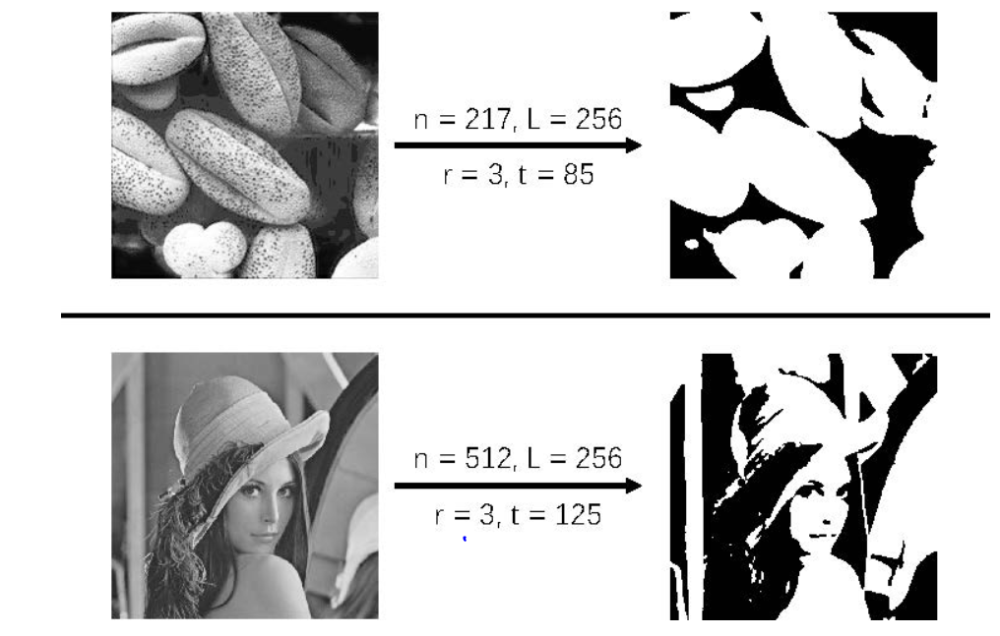
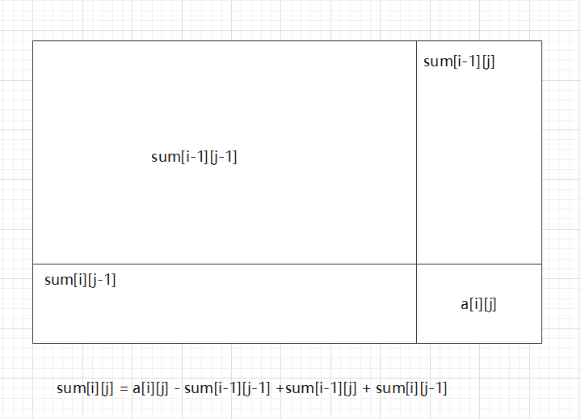

# **邻域均值**

## **题目背景**

**顿顿在学习了数字图像处理后，想要对手上的一副灰度图像进行降噪处理。不过该图像仅在较暗区域有很多噪点，如果贸然对全图进行降噪，会在抹去噪点的同时也模糊了原有图像。因此顿顿打算先使用邻域均值来判断一个像素是否处于较暗区域，然后仅对处于较暗区域的像素进行降噪处理。**

## **问题描述**

**待处理的灰度图像长宽皆为n个像素，可以表示为一个n×n大小的矩阵A，其中每个元素是一个[0,L)范围内的整数，表示对应位置像素的灰度值。**
**对于矩阵中任意一个元素Aij（0≤i,j<n），其邻域定义为附近若干元素的集和：**

**Neighbor(i,j,r)={Axy|0≤x,y<n and |x−i|≤r and |y−j|≤r}**

**这里使用了一个额外的参数r来指明Aij附近元素的具体范围。根据定义，易知Neighbor(i,j,r)最多有(2r+1)2个元素。**

**如果元素Aij邻域中所有元素的平均值小于或等于一个给定的阈值t，我们就认为该元素对应位置的像素处于较暗区域。**
**下图给出了两个例子，左侧图像的较暗区域在右侧图像中展示为黑色，其余区域展示为白色。**



**现给定邻域参数r和阈值t，试统计输入灰度图像中有多少像素处于较暗区域。**

## **输入格式**

**输入共n+1行。**

**输入的第一行包含四个用空格分隔的正整数n、L、r和t，含义如前文所述。**

**第二到第n+1行输入矩阵A。**
**第i+2（0≤i<n）行包含用空格分隔的n个整数，依次为Ai0,Ai1,⋯,Ai(n−1)。**

## **输出格式**

**输出一个整数，表示输入灰度图像中处于较暗区域的像素总数。**

## **样例1输入**

**`4 16 1 6`**

**`0 1 2 3`**

**`4 5 6 7`**

**`8 9 10 11`**

**`12 13 14 15`**

## **样例1输出**

**7**

**样例2输入**

**`11 8 2 2`**

**`0 0 0 0 0 0 0 0`**

**`0 0 0 0 0 0 0 0`**

**`0 0 0 0 0 0 0 7`**

**`0 0 0 7 0 0 7 7`**

**`0 7 0 7 0 7 0 7`**

**`0 7 0 7 7 0 0 0`**

**`7 0 0 0 7 0 7 7`**

**`0 0 0 0 7 0 0 7`**

**`7 0 7 0 0 0 0 0`**

**`7 0 7 0 0 7 0 7`**

**`0 7 0 7 0 7 0 0`**

**`0 7 0 0 0 7 0 0`**

**`7 0 0 0 0 0 0 0`**

**`0 0 0 0 0 0 0 0`**

**`0 0 0 0 0 0 0 0`**

**样例2输出**

**83**

## **数据范围**

**70%的测试数据满足n≤100、r≤10。**

**全部的测试数据满足0<n≤600、0<r≤100且2≤t<L≤256。**


# 思路一：二维前缀和

很显然这是裸的二维前缀和问题，前缀和算法适用于以O(1)的时间复杂度查询区间和，二维前缀和需要花费O(n^2)时间来维护前缀和数组。如果不使用前缀和优化查询区间和，那么区间和的查询复杂度是O(r^2)，显然没有O(1)好。



# 注意事项

本人在做题时敲代码过快容易忽略这个细节：```sum[yb][xr]```易写错为```sum[xr][yb]```，要搞清楚谁是代表行，谁是代表列，默认总想着x行，y列。

```c++
#include <iostream>
using namespace std;
int ar[601][601], sum[601][601];

int main() {
	int n, l, r;
	float t;
	cin >> n >> l >> r >> t;
	for(int i = 1; i <= n; i ++) 
		for(int j = 1; j <= n; j ++) {
			cin >> ar[i][j];
			sum[i][j] = sum[i - 1][j] + sum[i][j - 1] - sum[i - 1][j - 1] + ar[i][j];
		}
	
	int xl, xr, yt, yb, sumVal, cnt = 0;
	float avgVal;
	for(int i = 1; i <= n; i ++) 
		for(int j = 1; j <= n; j ++) {
			xl = j - r >= 1 ? j - r : 1;
			xr = j + r <= n ? j + r : n;
			yt = i - r >= 1 ? i - r : 1;
			yb = i + r <= n ? i + r : n;
			sumVal = sum[yb][xr] - sum[yb][xl - 1] - sum[yt - 1][xr] + sum[yt - 1][xl - 1];
			avgVal = (float)sumVal / ((yb - yt + 1) * (xr - xl + 1));
			if(avgVal <= t)
				cnt ++;
		}
	cout << cnt;
}
```

# 思路二：类似前缀和的递推

其实在对二维前缀和不知情的情况下也可以想到类似二维前缀和的优化方法。在每一行中，每个元素的邻域区间都和其相邻元素的邻域区间很接近。为了避免屡次进行O(r^2)的查询，我们希望通过某个邻域区间递推其余邻域区间。

同一行相邻元素的邻域区间有四种情况：

1. 后一个元素的邻域区间的左边界和前一个元素的邻域区间的左边界相等，后一个元素的邻域区间的右边界比前一个元素的邻域区间的右边界多一
2. 后一个元素的邻域区间的左边界和前一个元素的邻域区间的左边界相等，后一个元素的邻域区间的右边界和前一个元素的邻域区间的右边界相等
3. 后一个元素的邻域区间的左边界比前一个元素的邻域区间的左边界多一，后一个元素的邻域区间的右边界和前一个元素的邻域区间的右边界相等
4. 后一个元素的邻域区间的左边界比前一个元素的邻域区间的左边界多一，后一个元素的邻域区间的右边界比前一个元素的邻域区间的右边界多一

所以可以在每一行中只求出第一个元素的邻域区间和，根据上述规则递推其余元素的邻域区间和。复杂度介于O(r^2)和O(r)之间。
