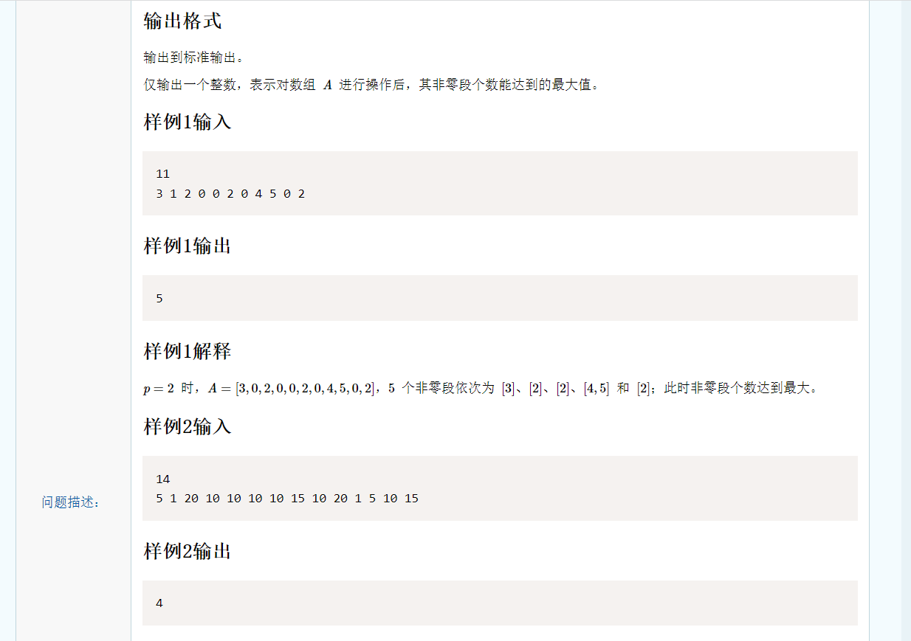
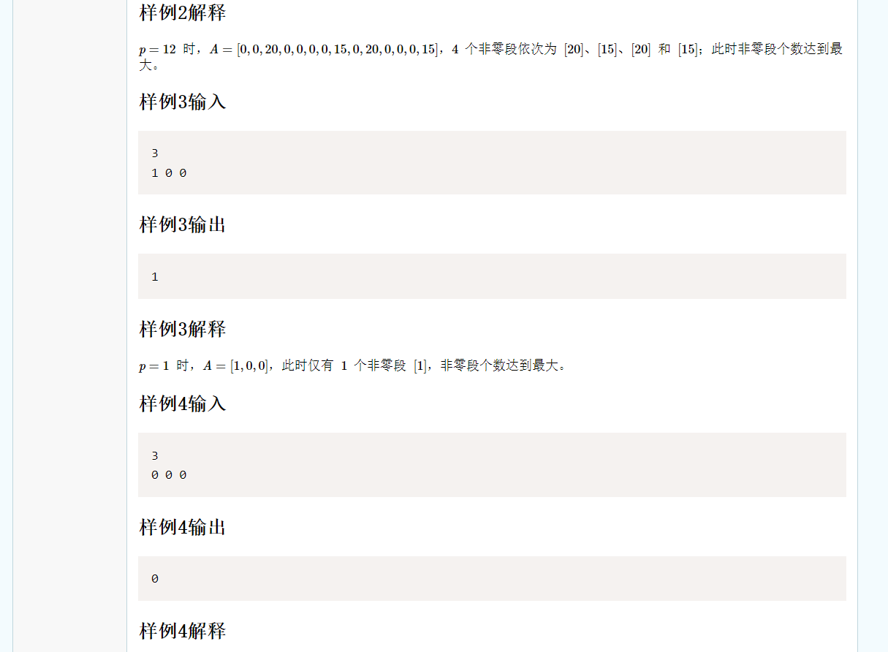

# 暴力法：

复杂度为O(n*m)，m是数列中最大数值，最大为10^4，n是数列元素个数，最大为5\*10^5。

p的取值为```[1, max(ar) +1]``` ```max(ar)```指给出数列中最大的元素。

遍历p的所有取值，然后对于每个取值都去原数列中计算一下非零段个数。

这样遍历所有的p可能的取值，复杂度是O(m)。查询对应取值下非零段的数量的复杂度是O(n)。总复杂度是O(n*m)。


# 思路一：差分数列

复杂度为O(m^2)，m是数列中最大数值，最大为10^4。

p的取值为```[1, max(ar) +1]``` ```max(ar)```指给出数列中最大的元素。数列c代表p取这些值时对应的非零段的数量，初始值为0.

维护一个差分数列，该差分数列是基于数列c产生，差分数列能够在区间更新后以O(n)的时间复杂度单点查询。

该差分数列有要求，当原数列后一个值比前一个值大时，此时p取这两个值的中间值进行切割，在该位置之前会产生一个非零段。

这样遍历所有的p可能的取值，复杂度是O(m)。查询对应取值下非零段的数量的复杂度是O(m)。总复杂度是O(m^2)。

```c++
#include <iostream>
#include <algorithm>
using namespace std;
int br[10002];

int main() {
	int n, index = 0, sum = 0, ans = 0, x = 0, y, brMax = 0;
	cin >> n;
	for(int i = 1; i <= n; i ++) {
		y = x;
		cin >> x;
		brMax = brMax > x ? brMax : x;
		if(x > y) {
			br[y + 1] ++;
			br[x + 1] --;
		}
	}

	for(int i = 1; i <= brMax + 1; i ++) {
		sum = 0;
		for(int j = 1; j <= i; j ++)
			sum += br[j];
		ans = ans > sum ? ans : sum;
	}
	
	cout << ans;
}
```


# 思路二： 树状数组+差分

复杂度为O(m*logm)，m是数列中最大数值，最大为10^4。

思路一中，查询每个p对应的非零段数量实际就是差分数列求前缀和。使用树状数组可以以O(logn)复杂度查询前缀和。

```c++
#include <iostream>
using namespace std;
const int limits = 10001;
int ar[limits];

int lowbit(int x) {
	return x & (-x);
}

void update(int* ar, int n, int pos, int val) {
	while(pos <= n) {
		ar[pos] += val;
		pos += lowbit(pos);
	}
}

int getSum(int* ar, int pos) {
	int sum = 0;
	while(pos >= 1) {
		sum += ar[pos];
		pos -= lowbit(pos);
	}
	return sum;
}

int main() {
	int n, index = 0, maxn = 0, tmp, brMax = 0, x = 0, y;
	cin >> n;
	for(int i = 0; i < n; i ++) {
		y = x;
		cin >> x; 
		brMax = brMax > x ? brMax : x;
		if(y < x) {
			update(ar, limits, y + 1, 1);
			update(ar, limits, x + 1, -1);
		}
	}
	
	for(int i = 1; i <= brMax + 1; i ++) {
		tmp = getSum(ar, i);
		maxn = maxn > tmp ? maxn : tmp;
	}
	cout << maxn;
}
```


# 思路三： 前缀和+差分

复杂度为O(m)，m是数列中最大数值，最大为10^4。

在以O(m)的复杂度查询p的所有取值时，对于每个p，都要求出差分数组br[p]的之前所有值的和。这个和递推来维护即可，即下面的```preSum```前缀和。

在做题时要明确最后所求结果的含义，本题要求差分数组中每个元素与其之前元素之和，即每次查询的都是一个区间之和。而前缀和可以以O(1)的复杂度查询区间和，固使用其优化之。当熟练之后，其实应该直接想到前缀和而不是上面的树状数组。

```c++
#include <iostream>
#include <algorithm>
using namespace std;
int br[10002];

int main() {
	int n, index = 0, sum = 0, ans = 0, x = 0, y, brMax = 0;
	cin >> n;
	for(int i = 1; i <= n; i ++) {
		y = x;
		cin >> x;
		brMax = brMax > x ? brMax : x;
		if(x > y) {
			br[y + 1] ++;
			br[x + 1] --;
		}
	}

	int preSum = 0;
	for(int i = 1; i <= brMax + 1; i ++) {
		preSum += br[i];
		ans = ans > preSum ? ans : preSum;
	}
	
	cout << ans;
}
```

