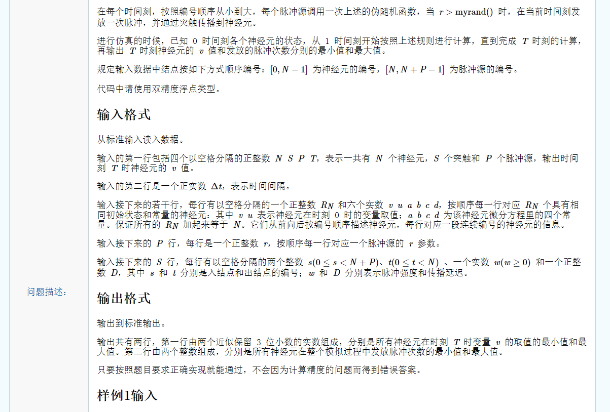

# 1.思路：

#### 1.大致分析每个时间点：

枚举每个时间点，每个时间点会有一些神经元或者脉冲源发送脉冲。

在神经元，脉冲源，突触组成的图中（神经元和脉冲源作为顶点，突触作为边），每一时刻哪个神经元/脉冲源发送脉冲，哪个神经元接收脉冲都是可以计算出来的。


#### 2.每个时间点脉冲源的行为分析：

在每个时间点中遍历每个脉冲源，判断每一个脉冲源是否发送脉冲，都要调用一次随机数函数。此时脉冲将会在一个时间间隔后传递到该脉冲源的所有临接顶点。如果采用邻接表存图，可以方便表示此过程。因此邻接表中描述边的数据结构中除了描述前驱顶点，边权值之外，还应该描述前驱顶点接收到脉冲的时间，脉冲在该边上传递的时间延迟，后继顶点发送的脉冲的强度。考虑到前驱顶点（一个神经元）收到第一个脉冲之前，可能后继顶点（脉冲源或另一个神经元）又发出了多个脉冲，因此描述前驱顶点接收脉冲时间的数据机构可以是队列。因此可大致写出下述代码：

```c++
#include <iostream>
#include <queue>
#include <vector>
using namespace std;

// 描述边（突触）的数据结构
class Edge {
	public: 
    	// 前驱顶点
		int to;
    	// 脉冲在该突触传播的时间开销
		int timeCost;
    	// 后继顶点发送的脉冲的强度
    	double w;
    	// 前驱顶点收到脉冲的时间队列
		queue<int>q;
		Edge() {}
		Edge(int to, int timeCost, double w) {
			this->to = to;
			this->timeCost = timeCost;
            this->w = w;
		}
};	

// 邻接表ar
vector<Edge*>ar[1000]; 

// 描述脉冲源的数据结构，每一个脉冲源除了临接顶点，临接边信息之外只有一个描述信息：发送脉冲的临界值。数组存储即可
int pulseNeuron[1000];

int main() {
	
}
```


#### 3.每个时间点神经元的行为分析：

**3.1** 在每个时间点中遍历每个神经元，判断每一个神经元接收到了多少脉冲，神经元接收到的脉冲来自于邻接顶点。如果采用邻接表存图，神经元只能知道自己作为后继顶点（v1->v2，称v1位后继顶点，v2为前驱顶点）的所有临接边，而神经元接收到脉冲，当且仅当神经元是前驱顶点。在这种情况下通过邻接表查询该神经元的后继顶点很费时，不妨在描述神经元的数据结构中存储神经元作为前驱顶点的所有临接边，这样可以快速得知神经元接收到的脉冲信息。因此可以写出下述描述神经元的数据机构。

```c++
class Neuron {
	public:
    	// 神经元常数	
		double a, b, c, d;
    	// 神经元动态参数
		double u, v;
    	// 该神经元发送脉冲的次数
    	int cnt;
    	// 神经元作为前驱顶点的所有临接边
		vector<Edge*>next;
		Neuron() {
            this->cnt = 0;
        }
		Neuron(double u, double v, double a, double b, double c, double d) {
			this->u = u;
			this->v = v;
			this->a = a;
			this->b = b;
			this->c = c;
			this->d = d;
            this->cnt = 0;
		}
    	void set(double u, double v, double a, double b, double c, double d) {
			this->u = u;
			this->v = v;
			this->a = a;
			this->b = b;
			this->c = c;
			this->d = d;
		}
};
// 存储所有神经元的数组
Neuron neuron[1000];
```

**3.2** 在每个时间点中遍历每个神经元，判断每一个神经元接收到了多少脉冲，此时神经网络需要更新参数，神经元的u，v参数需要结合已给出的常数和接收到的脉冲大小进行更新。

**3.3** 在每个时间点中遍历每个神经元，判断每一个神经元接收到了多少脉冲，并更新参数。此时根据更新完的参数来判断神经元是否会发出脉冲。


注：上述涉及到的图论术语按照《离散数学》Kenneth H. Rose书中的术语标准


# 2.流程分析：

### 1.输入处理

```c++
int main() {
    // 输入神经元个数，脉冲源个数，突触个数，时间点个数
	int N, S, P, T;
	cin >> N >> S >> P >> T;
	
    // 时间间隔
	double detaT;
	cin >> detaT;
	
    // 输入神经元信息
	int Rn, sumRn = 0, cnt = 0;
	double u, v, a, b, c, d;
	cin >> Rn >> v >> u >> a >> b >> c >> d;
	for(int i = 0; i < Rn; i ++)
		neuron[cnt ++].set(u, v, a, b, c, d);
	sumRn += Rn;
	while(sumRn < N) {
		cin >> Rn >> v >> u >> a >> b >> c >> d;
		sumRn += Rn;
		for(int i = 0; i < Rn; i ++)
			neuron[cnt ++].set(u, v, a, b, c, d);
	}
	
    // 输入脉冲源信息
	int limit;
	for(int i = 0; i < P; i ++) 
		cin >> pulseNeuron[i];
		
    // 输入突触信息
	int st, end, D;
	double w;
	for(int i = 0; i < S; i ++) {
		cin >> st >> end >> w >> D;
        // 使用new开辟空间，占用堆内存，ar和neuron使用edge相同的引用。
		Edge* edge = new Edge(end, D, w);
        // 邻接表存储该边
		ar[st].push_back(edge);
        // 神经元存储其作为前驱顶点的临接边，减少查询复杂度
		neuron[end].next.push_back(edge);
	}	
}
```


### 2.神经元和脉冲源处理

```c++
int st, end, D;
	double w, maxV = (-1) * DBL_MAX , minV = DBL_MAX;
	for(int i = 0; i < S; i ++) {
		cin >> st >> end >> w >> D;
		Edge* edge = new Edge(end, D, w);
		ar[st].push_back(edge);
		neuron[end].next.push_back(edge);
	}	
	
	// 枚举时间点
	for(int i = 1; i <= T; i ++) {
        // 处理每一个脉冲源
		for(int j = 0; j < P; j ++) {
            // 符合条件的脉冲源发送脉冲
			if(pulseNeuron[j] > myrand()) {
				int node = N + j;
				int size = ar[node].size();
                // 通知与该脉冲源相邻的突触，i + ar[node][k]->timeCost后突触另一端神经元收到脉冲
				for(int k = 0; k < size; k ++) 
					ar[node][k]->q.push(i + ar[node][k]->timeCost);
			}
		}
		
        // 处理每一个神经元
		for(int j = 0; j < N; j ++) {
			double I = 0;
			int size = neuron[j].next.size();
            // 枚举所有该神经元作为前驱顶点的临接边，计算出此时脉冲总大小I
			for(int k = 0; k < size; k ++) {
				Edge* edge = neuron[j].next[k];
				if(!edge->q.empty() && edge->q.front() == i) {
					edge->q.pop();
					I += edge->w;
				}
			}
			
            // 更新神经元的参数
			Neuron* n = &neuron[j];
			double v = n->v;
			n->v = n->v + detaT * (0.04 * pow(n->v, 2) + 5 * n->v + 140 - n->u) + I;
			n->u = n->u + detaT * n->a * (n->b * v - n->u);
			
            // 符合条件的神经元发送脉冲
			if(n->v >= 30) {
				n->v = n->c;
				n->u = n->u + n->d;
				int size = ar[j].size();
				for(int k = 0; k < size; k ++)
					ar[j][k]->q.push(i + ar[j][k]->timeCost);
				n->cnt ++;
			}
			
            // 记录最后时刻神经元参数，为输出要求
			if(i == T) {
				minV = min(minV, n->v);
				maxV = max(maxV, n->v);
			}	
		}
	} 
```


### 3.总代码

这个代码只是一个暴力代码，并不是满分代码，能拿33或66分。在这里梳理清流程，学会在复杂模拟题目中合理分析。

```c++
#include <iostream>
#include <queue>
#include <cmath>
#include <vector>
#include <float.h>
#include <climits>
#include <cstdio>
using namespace std;

class Edge {
	public: 
		int to;
		int timeCost;
		double w;
		queue<int>q;
		Edge() {}
		Edge(int to, int timeCost, double w) {
			this->to = to;
			this->timeCost = timeCost;
			this->w = w;
		}
};	

class Neuron {
	public:
		double a, b, c, d;
		double u, v;
		vector<Edge*>next;
		int cnt;
		Neuron() {
			this->cnt = 0;
		}
		Neuron(double u, double v, double a, double b, double c, double d) {
			this->u = u;
			this->v = v;
			this->a = a;
			this->b = b;
			this->c = c;
			this->d = d;
			this->cnt = 0;
		}
		void set(double u, double v, double a, double b, double c, double d) {
			this->u = u;
			this->v = v;
			this->a = a;
			this->b = b;
			this->c = c;
			this->d = d;
		}
};

Neuron neuron[1000];
vector<Edge*>ar[1000];
int pulseNeuron[1000];

static unsigned long nt = 1;
/* RAND_MAX assumed to be 32767 */
int myrand(void) {
    nt = nt * 1103515245 + 12345;
    return((unsigned)(nt/65536) % 32768);
}

int main() {
	int N, S, P, T;
	cin >> N >> S >> P >> T;
	
	double detaT;
	cin >> detaT;
	
	int Rn, sumRn = 0, cnt = 0;
	double u, v, a, b, c, d;
	cin >> Rn >> v >> u >> a >> b >> c >> d;
	for(int i = 0; i < Rn; i ++)
		neuron[cnt ++].set(u, v, a, b, c, d);
	sumRn += Rn;
	while(sumRn < N) {
		cin >> Rn >> v >> u >> a >> b >> c >> d;
		sumRn += Rn;
		for(int i = 0; i < Rn; i ++)
			neuron[cnt ++].set(u, v, a, b, c, d);
	}
	
	int limit;
	for(int i = 0; i < P; i ++) 
		cin >> pulseNeuron[i];
		
	int st, end, D;
	double w, maxV = (-1) * DBL_MAX , minV = DBL_MAX;
	for(int i = 0; i < S; i ++) {
		cin >> st >> end >> w >> D;
		Edge* edge = new Edge(end, D, w);
		ar[st].push_back(edge);
		neuron[end].next.push_back(edge);
	}	
	
	for(int i = 1; i <= T; i ++) {
		for(int j = 0; j < P; j ++) {
			if(pulseNeuron[j] > myrand()) {
				int node = N + j;
				int size = ar[node].size();
				for(int k = 0; k < size; k ++) 
					ar[node][k]->q.push(i + ar[node][k]->timeCost);
			}
		}
		
		for(int j = 0; j < N; j ++) {
			double I = 0;
			int size = neuron[j].next.size();
			for(int k = 0; k < size; k ++) {
				Edge* edge = neuron[j].next[k];
				if(!edge->q.empty() && edge->q.front() == i) {
					edge->q.pop();
					I += edge->w;
				}
			}
			
			Neuron* n = &neuron[j];
			double v = n->v;
			n->v = n->v + detaT * (0.04 * pow(n->v, 2) + 5 * n->v + 140 - n->u) + I;
			n->u = n->u + detaT * n->a * (n->b * v - n->u);
			
			if(n->v >= 30) {
				n->v = n->c;
				n->u = n->u + n->d;
				int size = ar[j].size();
				for(int k = 0; k < size; k ++)
					ar[j][k]->q.push(i + ar[j][k]->timeCost);
				n->cnt ++;
			}
			
			if(i == T) {
				minV = min(minV, n->v);
				maxV = max(maxV, n->v);
			}	
		}
	} 
	
	printf("%.3lf %.3lf\n", minV, maxV);
	
	int minCnt = INT_MAX, maxCnt = INT_MIN;
	for(int i = 0; i < N; i ++)
		minCnt = min(minCnt, neuron[i].cnt), maxCnt = max(maxCnt, neuron[i].cnt);
		
	cout << minCnt << " " << maxCnt;
}
```


# 3.总结

### 3.1 复杂问题中的调试

第一次代码写的比上面的繁琐的多，拿到66分。经过统计，使用了24个左右的变量。其中出现了5-6次变量名使用错误，就是张冠李戴。在调试中如果发现出错，可以顺着代码流程走一遍，确认每个变量含义是否正确。本题如果使用第二个样例进行手动调试将会花费大量时间，写对拍程序测试也会占用大量时间（数据制造繁琐），在此类问题中不妨通过检查变量来进行调试。

### 3.2 堆内存与栈内存

虽然之前总结了这个问题，但是在应用的时候却失误了。在上述代码使用对象时，例如```neuron[j]```，这样很繁琐，于是最初就设置局部变量代替之，```Neuron n = neuron[j]```，然后在n上进行修改。这样是不正确的。neuron数组在初始化时没有使用new，是占用栈内存空间，上述局部变量代替的方法实际上是对象的浅拷贝，栈内存中的内容将会重新拷贝一份，堆内存不拷贝。而希望的是修改```neuron[j]``` 的栈内存，所以这样做就无法起到效果了。做法可以是获取```neuron[j]``` 的地址，或者是直接将n声明为引用类型，上述代码采用第一种策略。