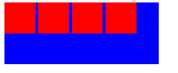

### 水平间隙介绍：

水平间隙一般是指行内块元素连续排列造成的水平间隙，示例如下：

```html
<div style="width: 250px; height: 100px; background: blue;">
    <div style="width: 50px; height: 50px; background: red; display: inline-block;"></div>
    <div style="width: 50px; height: 50px; background: red; display: inline-block;"></div>
    <div style="width: 50px; height: 50px; background: red; display: inline-block;"></div>
    <div style="width: 50px; height: 50px; background: red; display: inline-block;"></div>
</div>
```



### 原因：

由于行内块标签之间的空格和回车和换行造成的


### 解决方案：

1. 消除行内块标签之间的空格回车和换行，代码不换行无空格

```html
<div style="width: 250px; height: 100px; background: blue;">
    <div style="width: 50px; height: 50px; background: red; display: inline-block;"></div><div style="width: 50px; height: 50px; background: red; display: inline-block;"></div><div style="width: 50px; height: 50px; background: red; display: inline-block;"></div><div style="width: 50px; height: 50px; background: red; display: inline-block;"></div>
</div>
```

2. 消除行内块标签之间的空格回车和换行，在行内块元素之间加上注释

```html
<div style="width: 250px; height: 100px; background: blue;">
    <div style="width: 50px; height: 50px; background: red; display: inline-block;"></div><!--
--><div style="width: 50px; height: 50px; background: red; display: inline-block;"></div><!--
--><div style="width: 50px; height: 50px; background: red; display: inline-block;"></div><!--
--><div style="width: 50px; height: 50px; background: red; display: inline-block;"></div>
</div>
```

3. 行内块元素设置浮动，再清除浮动，防止父元素高度塌陷

```html
<div style="width: 250px; height: 100px; background: blue;">
    <div style="width: 50px; height: 50px; background: red; display: inline-block; float: left;"></div>
    <div style="width: 50px; height: 50px; background: red; display: inline-block; float: left;"></div>
    <div style="width: 50px; height: 50px; background: red; display: inline-block; float: left;"></div>
    <div style="width: 50px; height: 50px; background: red; display: inline-block; float: left;"></div>
    <div style="clear: both;"></div>
</div>
```

4. 采用特殊布局方案，如flex，grid等，这些布局方案的要求要优先于行内块元素布局的外在表现

```html
<div style="width: 250px; height: 100px; background: blue; display: flex;">
    <div style="width: 50px; height: 50px; background: red; display: inline-block;"></div>
    <div style="width: 50px; height: 50px; background: red; display: inline-block;"></div>
    <div style="width: 50px; height: 50px; background: red; display: inline-block;"></div>
    <div style="width: 50px; height: 50px; background: red; display: inline-block;"></div>
</div>
```

