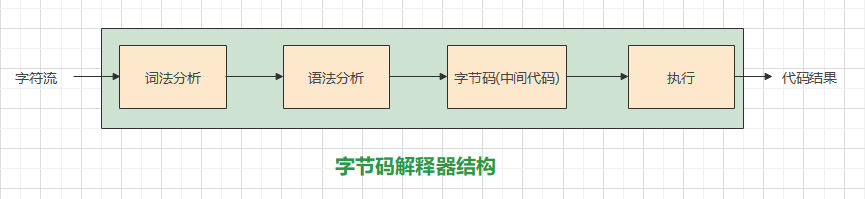
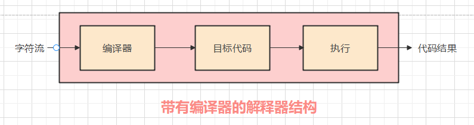
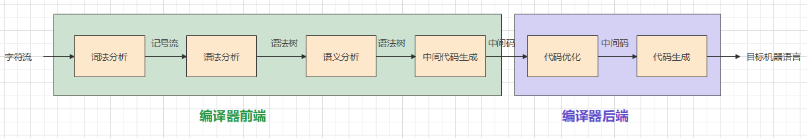
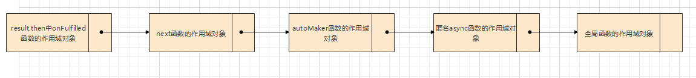
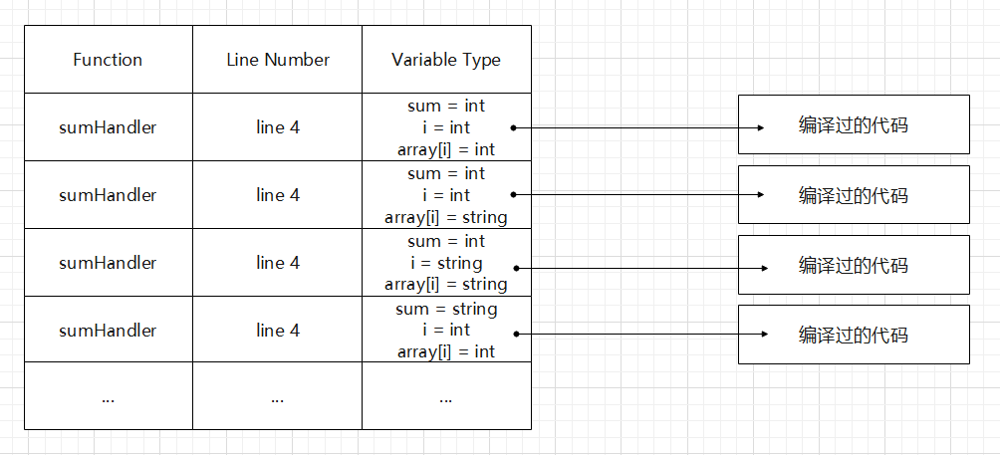
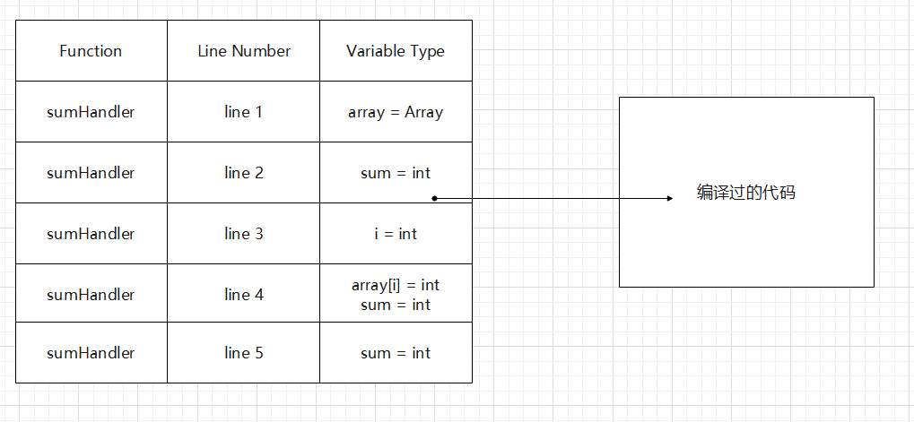
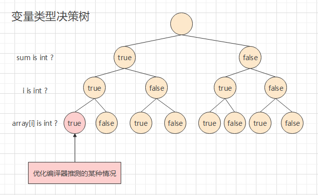

# 1.组成原理基础复习

### 微命令：

控制门电路的开关，一个微命令只能控制一个门电路。

举例：控制总线内容是否能够进入寄存器，存储器内容是否能够进入总线等待。


### 微指令：

由[操作码] + [测试码] + [下一条地址]构成。一条微指令能够控制多条微命令，执行连贯动作。

举例：读取存储器中xxx地址的数据并送入寄存器A，可以通过操纵多条微命令控制门电路来完成。


### 机器指令：

由[操作码字段] + [地址码字段] 构成，地址码字段可以有多个。每条机器指令都对应着一个由多条微指令构成的微程序。

举例：二地址码的加指令，首先需要从内存中读取数据的微指令，然后需要控制算数逻辑单元运算的微指令，需要把结果存储的微指令等等。


### 汇编语言：

建立在机器指令基础上，机器指令用二进制表示难以实际使用，汇编语言是给机器指令提供了助记符。实际上汇编语言还是机器指令。

举例：add  a b就可以代表机器指令中的加指令，mov x y就可以表示机器指令中的移动指令。


### 高级程序语言：

建立在汇编语言基础上，把汇编语言的多条操作汇聚成一条操作。

举例：a + b就可能涉及到十几条汇编指令，先读取，再移动到寄存器，再运算等待。


# 2.解释器

### 介绍

1. 解释器的输入是代码，将代码一行一行执行，输出是代码的结果

2. 解释器结构：
   * 使用字节码的解释器：源代码 -> 字节码 -> 执行
   * 带有编译器的解释器：源代码 -> 编译器 -> 目标代码 -> 执行
   






# 3.编译器

### 介绍

1. 编译器是把源代码转化成机器可执行的代码

2. 编译器结构：
   * 前端：源代码 -> 中间代码(可以理解成虚拟机使用的机器指令)
   * 后端：中间代码 -> 机器码(上面所述的机器指令)
   




# 4.JavaScript运行过程

### 了解发生在词法分析之前的事件：
参考"浏览器渲染原理"：浏览器渲染进程下的主线程以字节流的形式收到HTML文件，首先根据编码格式将字节流处理成字符流。之后HTML Parser和Preload Scanner开始工作。HTML Parser遇到脚本后被阻塞，JavaScript引擎开始解析脚本(这里指同步脚本)。JavaScript引擎将会根据收到的字符流完成后续过程。

### 1. 词法分析
JavaScript引擎将字符流(char stream)转换为记号流(token stream)，将字符转换成可辨识的词法单元token。下面的例子是"var answer = 1 + 2"
```json
[
    {
        "type": "Keyword",
        "value": "var"
    },
    {
        "type": "Identifier",
        "value": "answer"
    },
    {
        "type": "Punctuator",
        "value": "="
    },
    {
        "type": "Numeric",
        "value": "1"
    },
    {
        "type": "Punctuator",
        "value": "+"
    },
    {
        "type": "Numeric",
        "value": "2"
    }
]
```
注：生成器地址：https://esprima.org/demo/parse.html# 

### 2. 语法分析
Javascript引擎将token转换成AST(Abstract Syntax Tree)抽象语法树。下面的例子是"var answer = 1 + 2"
```json
{
  "type": "Program",
  "body": [
    {
      "type": "VariableDeclaration",
      "declarations": [
        {
          "type": "VariableDeclarator",
          "id": {
            "type": "Identifier",
            "name": "answer"
          },
          "init": {
            "type": "BinaryExpression",
            "operator": "+",
            "left": {
              "type": "Literal",
              "value": 1,
              "raw": "1"
            },
            "right": {
              "type": "Literal",
              "value": 2,
              "raw": "2"
            }
          }
        }
      ],
      "kind": "var"
    }
  ],
  "sourceType": "script"
}
```
注：生成器地址：https://esprima.org/demo/parse.html#

### 3.执行
### 3.1 执行上下文和执行栈的概念
执行上下文：
1. 执行上下文分为全局执行上下文，函数执行上下文，eval执行上下文。

执行栈：
1. 当程序运行时，首先创建全局执行上下文并压入执行栈，在执行某个函数时先创建其执行上下文，然后压入执行栈，如果函数执行完成那么将执行上下文弹出执行栈。
2. 执行栈可以看做是一大块栈内存，函数执行前的创建的执行上下文就是在其中申请栈内存空间，函数执行上下文被弹出时就是清理其占有的栈内存。


### 3.2 执行上下文的创建
### 1.绑定this
>**非严格模式下this的绑定：**
>1. 箭头函数中的this永远绑定为父作用域的this值
>2. 函数中被对象调用时this绑定为对象
>3. 函数未被对象调用时this绑定为全局对象
>4. 构造函数中this绑定为新创建的对象
>5. 使用apply，call，bind绑定的this
>
>**严格模式下this的绑定：**
>1. 箭头函数中的this为undefined
>2. 函数被对象调用时this绑定为对象
>3. 函数未被对象调用时的this为undefined
>4. 构造函数中的this绑定为新创建的对象
>5. 使用apply，call，bind绑定的this
>
>**注：**    
>事件处理函数中的this绑定为事件目标对象 **(不论是严格模式还是非严格模式都是如此，事件处理程序和事件监听器来处理事件时，函数都是在事件目标对象的作用域下执行)**
>
>内联事件处理函数比较特殊，会给处理语句外包裹一个函数(见犀牛书)，并带有event参数。这个函数默认不是严格模式，默认this绑定到事件目标对象。如果手动在其中开启严格模式，那么将会绑定为undefined(参考mdn)

### 2. 创建词法环境
>词法环境是一个对象，这个对象会记录两方面内容。     
> **(1)** 记录函数的属性，如name, prototype, arguments等等。
>
> **(2)** 记录外部环境的引用(此环境可以访问到的外部环境，其实这就是作用域链的实现)，如果是全局执行上下文那么词法环境记录的外部环境的引用为null，已经到头了。
> * **☆** JavaScript中使用的都是词法作用域，即函数执行时使用的作用域是函数定义时的作用域，而不是执行时的作用域。当函数定义时会记录当前可访问的外部作用域，假设这个作用域被记录到了scope属性中(个人虚构的一个属性)。那么当执行上下文创建时，词法环境和变量环境中记录外部环境的引用会从scope中取出这个外部作用域。这其实是闭包机制，函数对父作用域的引用导致父作用域不能被销毁。

### 3. 创建变量环境
>变量环境是一个对象，这个对象会记录两方面内容。   
> **(1)** 记录函数中的变量
> * 在作用域中寻找var声明的变量和形参声明的变量，把它们作为属性加入作用域对象，属性值为undefined
> * 在作用域中寻找let和const声明的变量，把它们作为属性加入作用域对象，属性值为“未初始化”，若在赋值语句前调用会报语法错误，这也叫暂时性死区。
> * 将实参值带入，作用域对象中形参属性的属性值为实参值
> * 将声明式函数也作为作用域对象的属性，属性值为undefined
>
> **(2)** 记录和词法环境相同的可以访问的外部环境的引用(其实就是实现了作用域链)

**注：如果词法环境和变量环境中出现了重名的变量，那么会优先访问变量环境中的变量。在ES6给出的示例中，变量环境的创建在词法环境之后，所以变量环境中的变量的优先级更高。**

### 3.3 执行上下文的执行

创建完执行上下文后，依据执行上下文的词法环境，变量环境和this来执行对应的代码。

### 3.4 执行上下文和作用域链相关常见习题
> ### 例题1---作用域链
> 在此举一个异步迭代器的手动迭代的例子(之前异步编程总结忘记写了)
> ```javascript
> // 使用异步迭代器使得串行Promise实现方法更多样，同时也给了流读写支持
> ;(async function() {
> 
> let p1 = new Promise(resolve => setTimeout(resolve.bind(this, "p1"), 3000))
> let p2 = new Promise(resolve => setTimeout(resolve.bind(this, "p2"), 2000))
> let ar = [p1, p2]
> 
> function asyncIteratorMaker(ar) {
>     let index = 0
>     return {
>         [Symbol.asyncIterator]() {
>             return this
>         },
>         next() {
>             if(index === ar.length)
>                 return new Promise(resolve => resolve({ done: true, value: undefined }))
>             else if(ar[index] instanceof Promise)
>                 return new Promise((resolve, reject) => {
>                     ar[index ++].then(res => {
>                         resolve({ done: false, value: res })
>                     }, reject)
>                 })
>             else
>                 return new Promise(resolve => resolve({ done: false, value: ar[index ++]}))
>         }
>     }
> }
> 
> ;(function autoMaker(asyncIter) {
>     let result = asyncIter.next();
>     ;(function next() {
>         result.then(res => {
>             if(res.done !== true) {
>                 console.log(res.value)
>                 result = asyncIter.next()
>                 next()
>             }
>         })
>     })();
> })(asyncIteratorMaker(ar));
> })();
> ```
> 
> ### 描述：
> 讨论对象是异步迭代器自动执行函数"autoMaker"中的result.then方法中的第一个参数"onFulfilled"函数。假如此时要执行该函数并且第一步作用域对象已经创建完毕，那么该创建作用域链。上图给出了onFulfilled函数的作用域链，onFulfilled函数的作用域对象为链表第一个元素，一直向后添加父作用域对象，直到全局作用域对象。
> ### 问：
> onFulfilled函数中使用的result变量，是来自哪里？
> ### 答：
> 在创建onFulfilled函数的作用域对象时由于result并不是形参，var声明，函数声明。同时也不是执行时运行的let或const声明语句的到的变量。当代码运行时发现result并不是上述几种情况，那么就会沿着上图的作用域链向上查找，发现到达next函数的作用域对象时存在该变量，那么就使用之。
> ### 例题2---变量环境
> ```javascript
> var x = 1;
> function f(x, y = function () { x = 3; console.log(x); }) {
>  console.log(x)
>  var x = 2
>  y()
>  console.log(x)
> }
> f()
> console.log(x)
> // 输出结果是undefined 3 2 1
> // 第一次作答我的答案是undefined 3 2 3
> ```
> ### 解答：
> **(1)词法作用域** 由函数的词法作用域可知，y在执行时的作用域是定义y时的作用域，定义y时的作用域是函数f的参数的块级作用域，所以y只可以访问到f的参数。**(2)词法环境和语法环境** 词法环境中会存储函数参数，语法环境中会存储函数中的变量，如果两个环境中有重名变量，那么会优先访问语法环境中的变量，ES6示例中语法环境的晚于词法环境创建。
>
> 因此y中x=3修改的是f函数词法环境中的x，而f函数变量环境中的x，函数y是无法访问也无法修改的。
>
> ### 例题3---变量环境
> ```javascript
> var x = 1;
> function f(x, y = function () { x = 3; console.log(x); }) {
>  console.log(x)
>  y()
>  console.log(x)
> }
> f()
> console.log(x)
> // 输出结果是 undefined 3 3 1
> ```
> ### 解答：
> 相比第一题，第二题少了var x = 2的赋值语句。这就意味着f函数中只有词法环境中存在x变量，语法环境中的x变量不存在了。当y函数给词法环境中的x赋值后，会紧接着执行下一条输出x的语句。此时x在语法变量里无法找到，那么会去此法环境中接着寻找，发现存在变量x，那么输出3。
>
> ### 例题4---变量环境
> ```javascript
> var x = 1;
> function f(xx, y = function () { x = 3; console.log(x); }) {
>  console.log(x)
>  var x = 2
>  y()
>  console.log(x)
> }
> f()
> console.log(x)
> // 输出是undefined 3 2 3
> ```
> ### 例题5---变量环境
> ```javascript
> var x = 1;
> function f(x = 4, y = function () { x = 3; console.log(x); }) {
>  console.log(x)
>  var x = 2
>  y()
>  console.log(x)
> }
> f()
> console.log(x)
> // 输出是4 3 2 1
> ```
> ### 例题6---作用域链
> ```javascript
> ;(function () {
>  let a = []
>  for(var i = 0; i < 10; i++)
>      a[i] = () => console.log(i)
>  a[1]() // 输出10
> 
>  for(let i = 0; i < 10; i++)
>      a[i] = () => console.log(i)
>  a[1]() // 输出1
> })();
> ```
> ### 解答：
> JavaScript是使用词法作用域，当函数执行时使用的是函数定义时的作用域，而不是函数执行时的作用域。    
> **(1)** 第一个循环中，定义了十个函数，在函数定义时会记录所属的作用域，for循环会产生10个块级作用域，函数会记录自己对应的块级作用域。在循环执行时由于循环变量是var声明，是函数作用域，所以每次循环在对应块级作用域声明的i的值会覆盖当前函数中所有使用var声明的i的值，所以循环执行完后10个块级作用域中的每个i的值都是10。调用a[1] ()时，去第一个块级作用域寻找i，输出10。
>
> **(2)** 第一个循环中，定义了十个函数，在函数定义时会记录所属的作用域，for循环会产生10个块级作用域，函数会记录自己对应的块级作用域。在循环执行时由于循环变量是let声明，是块级作用域，所以每次循环在对应块级作用域声明的i的值会老老实实在自己作用域里待着，所以循环执行完后10个块级作用域中的每个i的值都是对应块级作用域标号。调用a[1] ()时，去第一个块级作用域寻找i，输出1。
>
> 涉及知识点：词法作用域(闭包)，执行上下文创建和作用域链，变量声明

# 5.JIT优化
在JavaScript执行时V8引擎会做JIT优化    
参考：https://hacks.mozilla.org/2017/02/a-crash-course-in-just-in-time-jit-compilers/

### 1.JIT优化介绍
1. **(场景介绍)** 假设有以下场景
```javascript
function sumHandler(array) {
    let sum =0
    for(let i = 0; i < array.length; i++)
        sum += array[i]
    return sum
}
```
正常来说，在做完词法分析，语法分析等一系列操作后，上述代码将交付解释器一行一行地解释执行。每一次解释执行都是将语句编译后执行。在上述情况中这种做法的效率将会大打折扣，每一次循环解释器都需要重新编译执行相同的语句，而对比之下编译器工作时只需要编译一次。

2. **(JIT引入)** JIT专门针对这种重复语句进行优化，设计思路是将重复语句进行编译储存，用时不再编译。JIT全称是Just In Time，是混合使用编译器和解释器进行优化。

### 2.基线编译器 (BaseLine Compiler)

1. **(warm标记)** 运行时发现某些代码段运行次数很多，会被标记为"warm"，这时代码段将会交付给基线编译器。


2. **(根据决策树编译存储)** 根据变量不同的类型的情况进行编译并存储，如下图。总共变量类型有8中可能的情况(情况可以用决策树表示)，此时基线编译器会根据每一种情况进行一次编译，把行号和变量类型作为索引，通过这个索引可以找到对应情况的编译代码。**注意！！！基线编译器编译时间不会太久，如果变量太多，可能的情况将会以指数级增长，对于warm标记的代码段花过量时间编译就不划算了。所以情况复杂时可能不会存储所有的编译结果**


4. **(优化执行)** 再次执行时通过行号和变量类型作为索引，去寻找对应的编译过的代码。



### 3.优化编译器 (Optimizing Compiler)

1. **(hot标记)** 运行时发现某个代码段执行次数过多，比标记为warm的次数还要多的多时，就会被标记为hot，这时代码会被交付给优化编译器。


2. **(根据决策树推测编译存储)** 由于决策树分支很多，优化编译器会推测其中的一种情况作为理想情况。之后根据这种情况进行编译存储，并且会把**整个函数**进行编译存储。这样的推测可能不适合所有优化情况，但是能够让80%的情况得到不错的优化已经是巨大的成功。
   
   

3. **(优化执行)** 优化编译器编译了整个函数，在下次执行时，在函数入口就会进行类型检查，如果类型不符合优化编译器推测类型，如果类型和行号符合，那么直接使用编译结果。如果不匹配，那么会进行"去优化"操作。此时将会回退到基线编译器，如果基线编译器没有存储决策树的所有可能情况(决策树分支过多)，并且此时的变量类型的情况恰好基线编译器没有提前编译存储，那么继续将会回退到原始的解释器重新编译执行阶段。


注意：优化编译器可能会陷入"优化-去优化"的恶性循环，造成效率低下。实际应用中会规定去优化的次数，比如如果去优化次数超过10次，那么就不再使用优化编译器。

### 4.V8引擎中的解释器结构图
结合上述介绍的三点可以大致地画出V8引擎中使用JIT优化的解释器工作图

