# 1.HTTP基本工作模式测试
### 1.1 服务器代码准备
服务器使用nodejs环境，3000端口为web服务器，4000端口为应用服务器，使用CORS解决跨域问题。
```javascript
// server.js
let fs = require("fs").promises
require("http").createServer(function(req, res) {
    if(req.url.indexOf("B.html") !== -1) {
        fs.readFile("." + req.url).then(data => {
            res.writeHead(200, {
                "Content-Type": "text/html"
            })
            res.write(data)
            res.end()
        })
    }
}).listen(3000, err => {
    if(err)
        console.log(err)
    else
        console.log("run in 3000")
})

require("http").createServer(function(req, res) {
    if(req.url.indexOf("html") !== -1) {
        fs.readFile("." + req.url).then(data => {
            res.writeHead(200, {
                "Content-Type": "text/html",
                "Access-Control-Allow-Origin": req.headers.origin
            })
            res.write(data)
            res.end()
        })
    }
}).listen(4000, err => {
    if(err)
        console.log(err)
    else
        console.log("run in 4000")
})
```
### 1.2 资源代码准备
资源代码和服务器代码在同一个文件夹下，在资源代码中配合服务器使用CORS跨域，并向服务器请求另一个资源C.html，C.html随便写就行
```html
// B.html
<html>
<head>
    <meta charset="UTF-8">
    <title>Document</title>
</head>
<body>
    <script>
        let t1 = fetch("http://localhost:4000/C.html", {
            headers: {
                origin: "http://localhost:4000",
                connection: "keep-alive"
            },
            method: "get",
            credentials: "same-origin"
        }).then(res => res).then(console.log)
    </script>
</body>
</html>
```

### 1.3.抓包与分析
### 1.3.1 运行服务器程序


### 1.3.2 打开浏览器访问指定资源
在访问浏览器前前先打开wireshark，选择loopBack虚拟网卡进行环路测试，过滤器设置为```tcp.port == 300 or tcp.port == 4000```
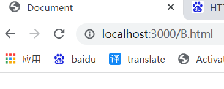

### 1.3.3 分析B.html获取
1. 先进行TCP三次握手(TCP连接建立的细节字段不是本次重点)，127.0.0.1的63395端口与127.0.0.1的3000端口建立TCP连接，就是如图所示的前三个TCP报文。 **(注：这个环路测试与访问互联网上的资源有所不同，详细见下解释)**
   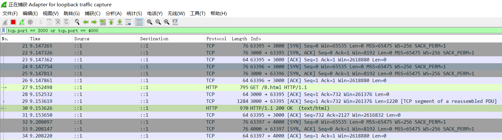


2. 之后的三条报文表示进行了63396端口与3000端口的TCP连接，也是3次握手。 


3. 下一条报文表示HTTP报文，表示客户端向服务器请求资源，使用get方法，这个表示请求B.html的文档。点击详细内容发现，就是最初的63395端口向3000端口发送的HTTP请求。
    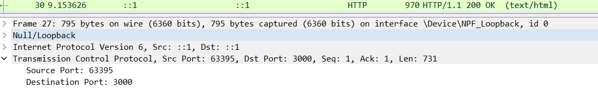


4. 紧接着下一条报文是TCP报文，长度64，数据部分长度为0，只有头部。这是一条确认报文，服务器发送给客户端，表示服务器已经接收到了客户端的HTTP请求。


5. 接下来两条报文实际是一起的，点开HTTP报文的详细内容。首先确认了是服务器3000端口向客户端63395端口发送的。之后发现这个报文占用了两个TCP报文进行传输。分别是上一条数据长度为1220的TCP报文，和当前HTTP报文所包含的TCP报文，数据部分长度为906。观察具体传输内容发现，传输的就是B.html的内容。
    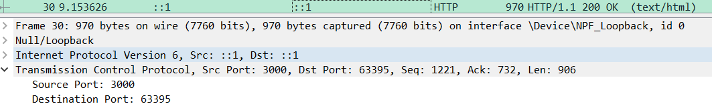
    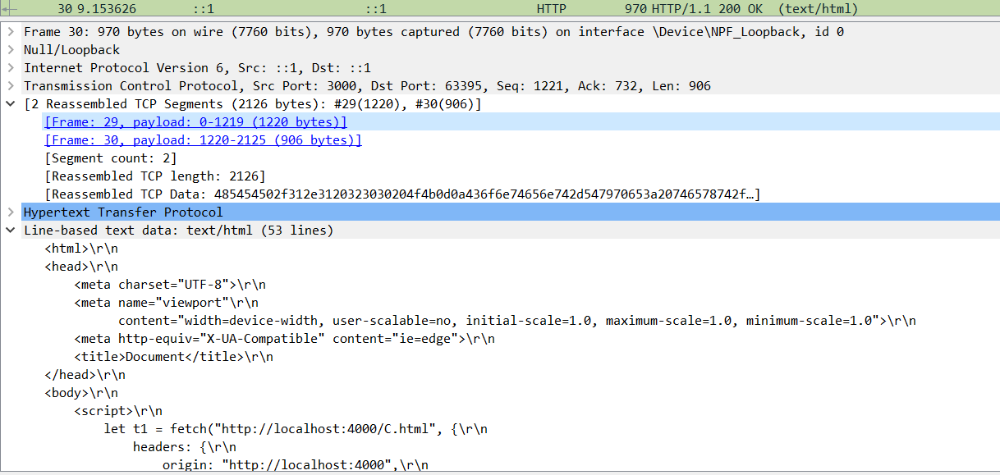


6. 接下来的一条TCP报文是客户端发给服务器表示客户端确认收到了HTTP请求的响应，是客户端63395端口向服务器3000端口发送。


7. 接下来三条报文属于下一个部分

### 1.3.4 分析C.html的获取
1. 首先三条TCP报文表示T客户端63397端口和服务端4000端口三次握手建立TCP连接。原因是刚刚客户端接收到B.html，完成解析与执行后（具体步骤参见“浏览器渲染原理”），脚本向服务器4000端口请求新的资源，所以先建立TCP连接。
    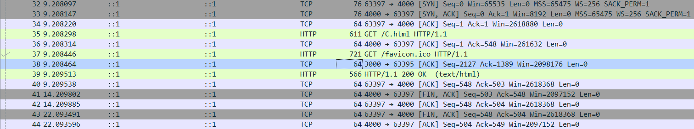


2. 接下来两条报文表示，客户端63397端口向服务器4000端口发送HTTP请求，请求C.html资源。紧接着服务器向客户端发送确认，表示已经收到HTTP请求。


3. 下面这条报文很特殊，是HTTP报文，是客户端的63395端口向服务器3000端口发送请求，请求B.html显示在浏览器标签栏的图标。这个请求比较靠后，是为了避免阻塞重要资源加载。这里可以看出HTTP1.1的特性，是持久连接的，仍旧使用63395端口和3000端口的TCP连接。


4. 下面两条报文就可以参考“B.html”中的分析，就是服务器的响应和客户端的确认


5. 下面四条报文表示客户端63397端口到服务器4000端口的TCP连接的释放。


### 1.3.5 分析HTTP1.1持久连接
1. 在2.4中已经遇到了第一个持久连接，就是最初的63395端口到3000端口的连接，该连接在上述报文分析中没有应用。


2. 如下截图表示了63396端口和3000端口的TCP连接的持久连接请求和最终维持一段时间后的释放，该连接用于服务器向客户端发送HTTP响应。
    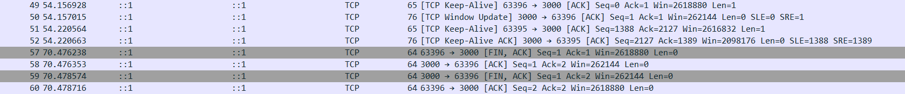


3. 如下截图表示了最初的63395端口到3000端口的连接的持久连接请求，发现它一直没有释放，该连接用于客户端向服务端发送HTTP请求。
    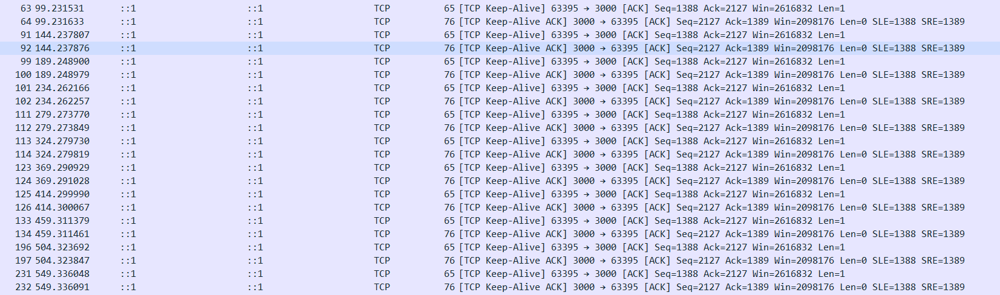


# 2.大量并发请求测试
**实验环境：** 谷歌浏览器97.0.4692.99 (正式版本)  

### 实验一：观察并发请求的时间消耗情况   

**实验说明：**   
时序图瀑布流说明：白色代表请求进入发送队列时间，灰色代表发送前阻塞时间，绿色代表服务端响应时间，蓝色代表响应体下载时间。对于此的说明可以详细参考https://bugs.chromium.org/p/chromium/issues/detail?id=476749 开源的chromium的bug网站。   

**实验目的：**   
观察单一客户端页面对服务端某个接口发起大量并发http请求的时间开销情况   

**实验内容：**   
1. 服务端准备接口，返回一个视频。客户端在脚本中同时发起10个面对该接口的请求。实验进行三次。
2. 客户端再脚本中同时发起20个请求。实验两次

**实验代码：**   
客户端
```html
<script>
    for(let i = 0; i < 20; i ++) {
        let xhr = new XMLHttpRequest()
        xhr.open("get", "/test.mp4")
        xhr.send()
    }
</script>
```
服务端
```javascript
let http = require("http")
let fs = require("fs")
let fss = fs.promises

http.createServer(function(req, res) {
    if(req.url.includes("html")) {
        fss.readFile("." + req.url).then(data => {
            res.writeHead(200, {
                "Content-Type": "text/html"
            })
            res.write(data)
            res.end()
        })
    }  else if(req.url.includes("mp4")) {
        fss.readFile("." + req.url).then(data => {
            res.writeHead(200, {
                "Content-Type": "video/mp4"
            })
            res.write(data)
            res.end()
        })
    }
}).listen(3000)
```

**实验结果：**

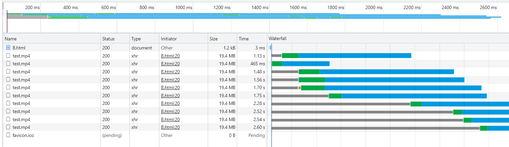
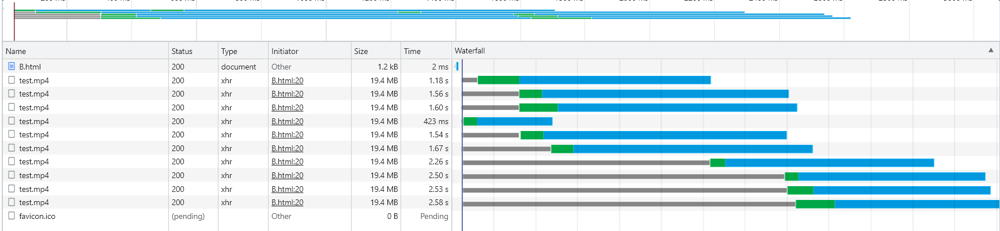
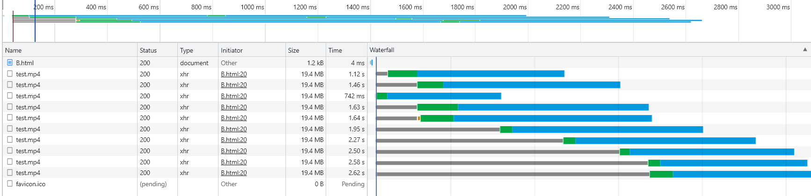
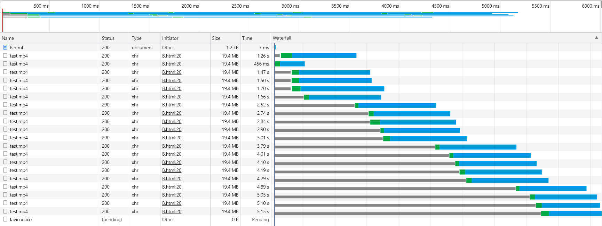
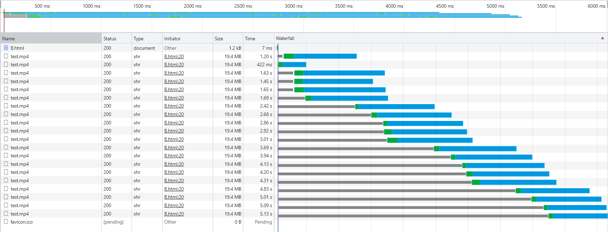

**实验结论：**
1. **(存在并发)** 刚开始一定不是并发发送，在发送完一两个请求后会存在并发发送情况。据此推测，JavaScript引擎对请求发起的调度是智能的，会根据前几个请求的响应状况来决定接下来的请求发起应该采用何种策略。


2. **(套接字池限制并发)** 并发发送会受到阻塞(灰色部分)，往往是5到6个请求会集中到某个时间发送出去。在查阅了https://bugs.chromium.org/p/chromium/issues/detail?id=476749 中的灰色部分“stalled”状态原因，了解到这主要是受到了套接字的限制。chromium使用JavaScript的v8引擎，v8引擎限制单个tab页对同一域名建立tcp连接不超过6个，最多使用6个套接字，chrome是基于chromium的闭源项目。也是同样的限制。“stalled”还可能受到磁盘和内存的影响但是影响不大，因此可知上图中并发往往集中在每5到6个请求是由于套接字限制。


### 实验二：推测影响并发调度的原因
**实验目的：**   
在实验一的实验结果中，第一条说明了实验中观察到并发调度存在智能调度的情况，我们在这里希望通过实验二来探究有哪些因素影响了这种并发调度。首先我们要明确，绿色部分之前的灰色和白色部分(很小，在上图看不到)不是影响并发调度的原因，这两个部分只是反应http请求的发送被阻塞。

**实验推测：**   
并发调度与绿色部分(服务器响应时间)和蓝色部分(响应体下载时间)有关

**实验内容：**  
保持实验一的代码，仅在实验一服务端代码做出修改，在返回响应时分别设置5ms，50ms，150ms，250ms的延迟，总共四次实验，观察时序图。

**实验代码：**   
客户端  
```html
<script>
    for(let i = 0; i < 10; i ++) {
        let xhr = new XMLHttpRequest()
        xhr.open("get", "/test.mp4")
        xhr.send()
    }
</script>
```
服务端
```javascript
let http = require("http")
let fs = require("fs")
let fss = fs.promises

http.createServer(function(req, res) {
    if(req.url.includes("html")) {
        fss.readFile("." + req.url).then(data => {
            res.writeHead(200, {
                "Content-Type": "text/html"
            })
            res.write(data)
            res.end()
        })
    }  else if(req.url.includes("mp4")) {
        fss.readFile("." + req.url).then(data => {
            res.writeHead(200, {
                "Content-Type": "video/mp4"
            })
            setTimeout(() => {
                res.write(data)
                res.end()
            }, 5) // 5, 50, 150, 250
        })
    }
}).listen(3000)
```
**实验结果：**   

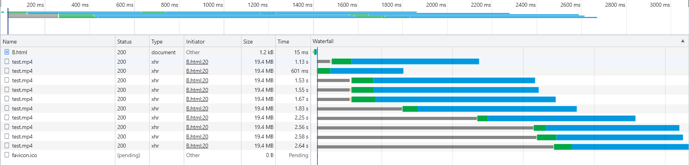
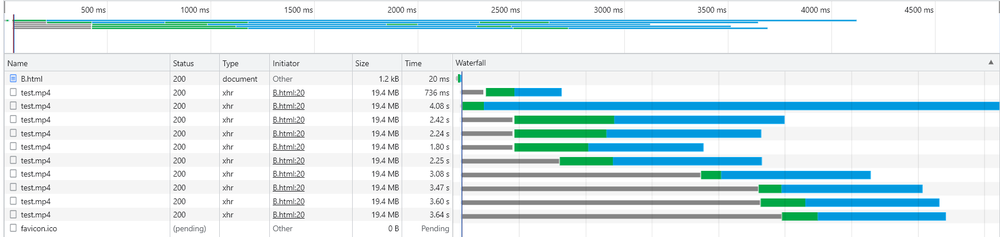
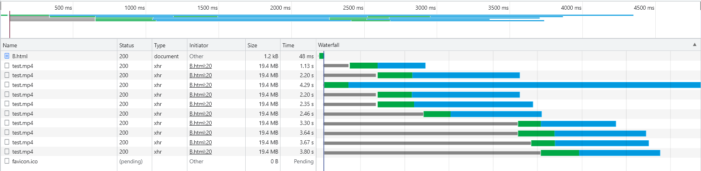
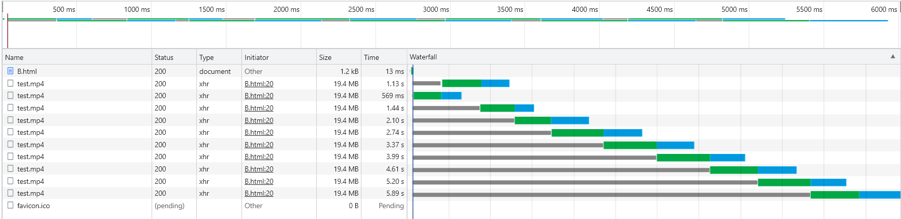

**实验结论：**   
**(响应返回时间影响并发请求)** 在设置5ms，50ms，150ms返回响应的延迟时，仍存在并发发送请求的情况。但是到了250ms时已经全部变成串行发送请求了。因此可见，并发调度的策略取决于响应返回的时间，如果响应返回的时间较快，那么允许并发发送请求，否则不能并发。


### 实验三：验证Http1.1的默认工作模式
**实验说明：**   
在实验一和实验二中都出现了并发的情况，但是我们并不清楚这种并发中是否都是源于新建套接字，这种并发还有可能来自于套接字的复用，在同一个套接字上进行流水线模式发送Http请求。

**实验目的：**   
验证Http1.1是默认工作在流水线模式，还是工作在非流水线模式。

**实验内容：**   
1. 使用wireshark抓包查看具体的tcp端口，由于视频基本都是MB级别的大小，在使用wireshark抓取时可能导致wireshark崩溃，因此这里将请求改为请求图片。
2. 客户端同时发起20个请求，都面对服务端相同的接口，请求内容是图片。服务端将返回视频改为返回图片。实验两次。
3. 实验时在浏览器时序流中确认是否出现并发情况，在wireshark中对每一个请求的tcp端口和时间进行确认，来判断是否出现流水线模式。

**实验代码：**   
客户端
```html
<script>
    for(let i = 0; i < 20; i ++) {
        fetch("/visit.PNG")
    }
</script>
```
服务端
```javascript
let http = require("http")
let fs = require("fs")
let fss = fs.promises

http.createServer(function(req, res) {
    if(req.url.includes("html")) {
        fss.readFile("." + req.url).then(data => {
            res.writeHead(200, {
                "Content-Type": "text/html"
            })
            res.write(data)
            res.end()
        })
    } else if(req.url.includes("PNG")) {
        fss.readFile("." + req.url).then(data => {
            res.writeHead(200, {
                "Content-Type": "image/png"
            })
                res.write(data)
                res.end()
        })
    }
}).listen(3000)
```

**实验结果：**   
由于两次实验，每次实验都分析20个请求，图片过多，就不一一列巨额，下面列举代表性结果。

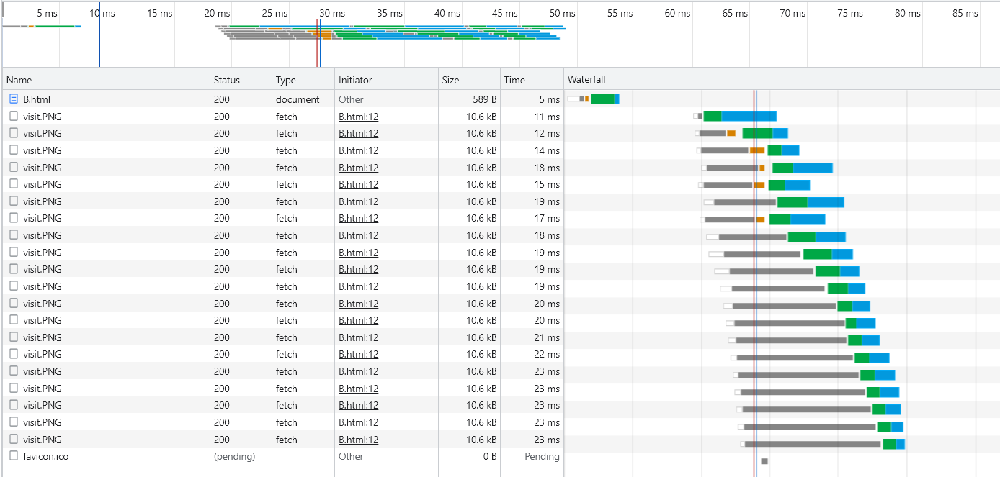
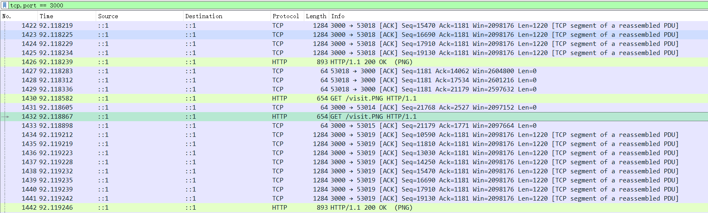

**实验结论：**   
**(默认工作在非流水线模式，并发原因是新的套接字)** 在请求图片时存在并发情况，在wireshark中捕获到了并发情况，在一个http请求的响应未到时就发出另一个请求。经过验证，上图这两个http请求使用不同的套接字。在两次实验中依次验证四十个请求，发现存在套接字复用的情况，但是使用相同套接字的请求都是工作在非流水线模式下，必须等待上个请求的响应到达才可发送。


# 3.总结
1. 在Part1中测试了Http的基本工作模式，从三次握手分析到四次挥手，中间还分析了Http1.1的持续连接，测试了脚本中的基础单一请求。对计算机网络课本上的知识做了初步验证。


2. 在Part2中测试了Http1.1对大量并发的处理，得到了如下的结论
    * 同时发起大量请求时，请求存在并发发送情况
    * 并发发送数量受到浏览器套接字池的限制
    * 并发发送调度受到http的响应时间的影响，时间长会取消并发
    * http1.1默认工作在非流水线模式，并发发送是创建新的tcp套接字