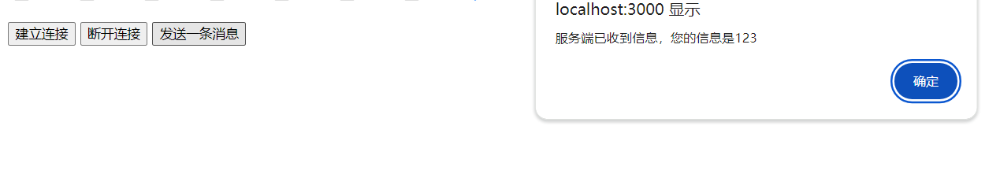
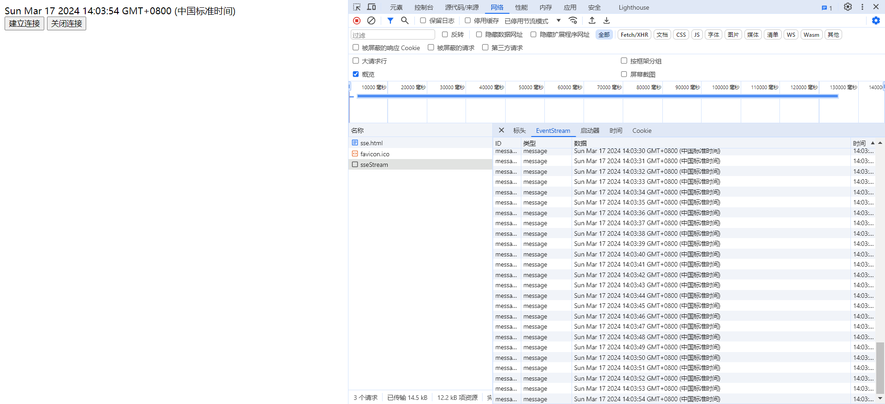

### 1.轮询

#### 1.1 轮询的形式

> **短连接轮询**
>
> 前端每隔一段时间向服务端发起一次Http请求来获取数据。
>
> ```javascript
> const shortPolling = () => {
>   const intervalHandler = setInterval(() => {
>     fetch('/xxx/yyy')
>       .then(response => response.json())
>       .then(response => {
>         /* 自定义短轮询成功标记 */
>         if(response?.code === '1') {
>           /* 自定义工作代码 */
>           /* 结束短轮询 */  
>           clearInterval(intervalHandler)  
>         } 
>       })
>   }, 5000); 
> }
> ```
>
> **长连接轮询**
>
> 前端向服务端发起一次Http请求，当接收到响应体时重新发起请求来获取数据。
>
> ```javascript
> const longPolling = () => {
>     fetch('/xxx/yyy')
>         .then(response => response.json())
>         .then(data => {
>            /* 自定义工作代码 */
>         	/* 继续长轮询 */
>         	longPolling();
>     	})
> }
> ```

#### 1.2 轮询的实现

> **基于Ajax技术轮询**
>
> > 在1中已经举了关于基于ajax技术实现长轮询和短轮询的例子
>
> **基于Iframe的轮询**
>
> > 古老的轮询方式，需要装填数据到jsp，php等形式文档中，没有实现前后端分离开发。
> >
> > * **插入：** 前端在页面中插入一个隐藏的iframe，iframe的src设置为后端接口地址。
> >
> > * **填充：** 接口返回数据格式为html，服务端用传统web开发形式向html中插入数据，例如php，jsp。
> >
> > * **通信：** 返回的html在iframe中运行，通过postMessage与原页面进行通信。
> >
> > * **轮询：** 原页面收到数据后重新加载iframe进行下次轮询（可以根据策略进行长轮询或短轮询）。
>
> **基于Jsonp的轮询**
>
> > 古老的轮询方式，请求失败时无法通过删除标签关闭连接。
> >
> > * **插入：** 前端在页面中插入一个script标签，src设置为后端接口地址，参数上拼接回调函数名称，当接收到数据后调用之。
> >
> > * **填充：** 接口返回可执行脚本，脚本最后调用回调函数，便于通知数据已接收到。
> >
> > * **通信：** 通过回调函数通信。
> >
> > * **轮询：** 接收到数据后前端重新发起Jsonp轮询，删除标签后插入新的标签继续请求（根据需求进行长轮询或短轮询）。


### 2.iframe长连接

> **原理**
>
> 例如使用http1.x进行通信，服务端在发送响应信息后不关闭信道（在nodejs中即不写 ```res.end()``` ），每隔一段时间向客户端发送一次消息。这个可以利用服务端持续向iframe输入文档实现。如果使用fetch，xhr，那么无法直接实现，它们只能支持接收一次消息。<font color=green>**（目前一般不使用iframe这种古老做法）**</font>
>
> 
>
> **前端代码**
>
> ```html
> <html>
>   <head>
>     <meta charset="UTF-8" />
>   </head>
>   <body>
>     <div id="display-div"></div>
>     <button onclick="handleStartConnect()">开始连接</button>
>     <button onclick="handleStopConnect()">断开连接</button>
> 
>     <script type="text/javascript">
>       // 开始连接
>       const handleStartConnect = () => {
>         const iframe = document.createElement("iframe");
>         iframe.id = "iframe-connector";
>         iframe.src = "/iframeLongConnection";
>         iframe.style.display = "none";
>         document.body.append(iframe);
>       };
> 
>       // 断开连接
>       const handleStopConnect = () =>
>         document.querySelector("#iframe-connector").remove();
> 
>       // 收集长连接信息  
>       window.addEventListener("message", (event) => {
>         document.querySelector("#display-div").innerHTML = event.data;
>       });
>     </script>
>   </body>
> </html>
> ```
>
> **服务器代码**
>
> ```javascript
> let fs = require("fs");
> 
> // 服务器基本服务
> const read = (path, res) => {
>   // 支持读取html和js
>   fs.readFile(path, (err, data) => {
>     if (err) console.log(err);
>     else {
>       res.writeHead(200, {
>         "Content-Type":
>           path.slice(-2, path.length) === "js"
>             ? "text/javascript"
>             : "text/html",
>       });
>       res.write(data);
>       res.end();
>     }
>   });
> };
> 
> // 输入到iframe中的模板
> const getTemplate = () => {
>   const template = `
>     <script type="text/javascript">
>         window.parent.postMessage(new Date().toLocaleTimeString(), "http://localhost:3000/index.html");
>     </script>
>   `;
>   return template;
> };
> 
> // 服务端定时器维持长连接
> const circulate = (res) => {
>   res.writeHead(200, { "Content-Type": "text/html" });
>   setInterval(() => {
>     res.write(getTemplate());
>   }, 1000);
> };
> 
> require("http")
>   .createServer(function (req, res) {
>     // 处理图标
>     if (req.url === "/favicon.ico") res.end();
>     // 长连接测试
>     else if (req.url === "/iframeLongConnection") circulate(res);
>     // 服务器基本服务
>     else read("." + req.url, res);
>   })
>   .listen(3000, function (err) {
>     if (err) console.log(err);
>     else console.log("运行成功");
>   });
> ```


### 4.Websocket长连接

#### 4.1 Websocket实现

> **4.1 综述**
>
> <font color=green>**技术综述：**</font>
>
> > websocket是协议，是对http协议的升级。
> >
> > websocket基于TCP协议，也是使用80端口。
>
> <font color=green>**功能特点：**</font> 
>
> > * 前端实现简单，只需要建立连接，监听屈指可数的几个事件。
> > * 支持全双工通信。服务端和客户端可以互相发送消息。
> > * 不局限于web端。其它终端设备或应用程序也可以使用该协议。
>
> **4.2 web端Websocket事件和方法**
>
> | 事件    | 描述     |
> | ------- | -------- |
> | open    | 连接建立 |
> | close   | 连接关闭 |
> | error   | 发生错误 |
> | message | 接收信息 |
>
> | 实例方法 | 描述     |
> | -------- | -------- |
> | send     | 发送消息 |
> | close    | 关闭连接 |
>
> **4.3 服务端Websocket的事件和方法**
>
> 服务端实现websocket通常采用第三方库，不同的第三方库对方法和事件的规定各不相同，在此不做具体介绍。
>
> **4.4 客户端代码实现**
>
> 
>
> ```html
> <html>
> <head>
>  <meta charset="UTF-8" />
> </head>
> <body>
>  <button onclick="handleBuild()">建立连接</button>
>  <button onclick="socket.close()">断开连接</button>
>  <button onclick="socket.send(123)">发送一条消息</button>
> 
>  <script type="text/javascript">
>    let socket = null;
> 
>    // 连接相关事件监听函数
>    const handleMessage = (event) => alert(event.data);
>    const handleOpen = () => alert("连接成功");
>    const handleError = () => alert("连接错误");
>    const handleClose = () => {
>      alert("连接关闭");
>      socket.removeEventListener("open", handleOpen);
>      socket.removeEventListener("close", handleClose);
>      socket.removeEventListener("error", handleError);
>      socket.removeEventListener("message", handleMessage);
>    };
> 
>    // 建立连接
>    const handleBuild = () => {
>      socket = new WebSocket("ws://localhost:3001/testSocket");
>      socket.addEventListener("open", handleOpen);
>      socket.addEventListener("close", handleClose);
>      socket.addEventListener("error", handleError);
>      socket.addEventListener("message", handleMessage);
>    };
> 
>    // 关闭连接
>    const handleDestroy = () => socket.close();
> 
>    // 发送消息
>    const sendMessage = (message) => socket.send(JSON.stringify(message));
>  </script>
> </body>
> </html>
> ```
>
> **4.5 服务端代码实现**
>
> ```javascript
> const fs = require("fs");
> const ws = require("nodejs-websocket");
> 
> // 基本读写服务
> const read = (path, res) => {
>   // 支持读取html和js
>   fs.readFile(path, (err, data) => {
>     if (err) console.log(err);
>     else {
>       res.writeHead(200, {
>         "Content-Type":
>           path.slice(-2, path.length) === "js"
>             ? "text/javascript"
>             : "text/html",
>       });
>       res.write(data);
>       res.end();
>     }
>   });
> };
> 
> require("http")
>   .createServer(function (req, res) {
>     // 处理图标
>     if (req.url === "/favicon.ico") res.end();
>     else read("." + req.url, res);
>   })
>   .listen(3000, function (err) {
>     if (err) console.log(err);
>     else console.log("运行成功");
>   });
> 
> const wsServer = ws.createServer((conn) => {
>   // 接收信息
>   conn.on("text", (text) =>
>     conn.sendText(`服务端已收到信息，您的信息是${text}`)
>   );
> 
>   // 连接错误
>   conn.on("error", () => console.log("连接错误"));
> 
>   // 连接关闭
>   conn.on("close", () => console.log("连接断开"));
> });
> 
> wsServer.on("connection", () => console.log("新连接建立"));
> wsServer.listen(3001);
> ```

#### 4.2 Websocket建立与销毁

> <font color=green>**Http握手**</font>
>
> Websocket连接建立需要Http1.1或以上版本的get方法握手，这个过程在浏览器调试栏中无法抓包得到，只能抓包分析Websocket协议。
>
> 在前端和后端实现websocket时这个过程和配置对于开发者是无感知的。
>
> * **请求头：**
>
>   | 字段                     | 取值                         | 含义                        | 是否必设置 |
>   | ------------------------ | ---------------------------- | --------------------------- | ---------- |
>   | Connection               | upgrade                      | 希望协议升级                | 必须       |
>   | Upgrade                  | websocket                    | 协议应该升级到websocket协议 | 必须       |
>   | Sec-Websocket-Key        | 经过base64编码的16字节随机值 |                             | 必须       |
>   | Sec-WebSocket-Version    | 版本值                       | websocket版本               | 必须       |
>   | Sec-WebSocket-Protocol   | 子协议名称                   | websocket通信时需要的子协议 | 非必须     |
>   | Sec-WebSocket-Extensions | 扩展协议名称                 | websocket通信时的扩展协议   | 非必须     |
>
> * **响应头：**
>
>   | 字段                     | 取值          | 含义                    | 是否必设置 |
>   | ------------------------ | ------------- | ----------------------- | ---------- |
>   | Sec-WebSocket-Accept     | SHA-1哈希值   | 是否支持websocket协议   | 必须       |
>   | Sec-WebSocket-Version    | websocket版本 | 选择支持的websocket版本 | 必须       |
>   | Sec-WebSocket-Protocol   | 子协议名称    | 选择支持的子协议        | 非必须     |
>   | Sec-WebSocket-Extensions | 扩展协议名称  | 选择支持的扩展协议名称  | 非必须     |
>
> * **响应状态码：**
>
>   响应状态码为101时表示可以使用websocket协议
>   
> * **Sec-Websocket-Key验证：**
>
>   <font color=green>**验证过程类似于加密解密。**</font> 客户端传给服务端Sec-Websocket-Key，服务端将这个key和一个规定的并且是固定的Websocket魔数（字符串）拼接。之后服务端将这个拼接的字符串输入SHA-1哈希算法，得到哈希值。最后服务端将哈希值返回给客户端，客户端用同样方式解密来判断服务端是否支持websocket协议。
>
> <font color=green>**挥手**</font>
>
> 服务端发出关闭连接的消息或客户端发来关闭连接的消息后将关闭websocket连接


### 5.SSE长连接

> **5.1 综述**
>
> <font color=green>**技术综述：**</font> 
>
> > SSE是一种基于Http协议的技术，不是一种新的协议。
>
> <font color=green>**功能特点：**</font>
>
> > * 前端需要实现代码不多。
> > * 由于只是使用Http协议，因此前后端的配置会比使用Websocket协议简单些。
> > * 由于只是使用Http协议，因此只能服务端向前端推送消息，相比Websocket协议的长连接像阉割版。
>
> <font color=green>**性能限制：**</font>
>
> >  同一个浏览器同一个域的Http连接最多支持并发6个，如果长时间用SSE技术保持长连接，会降低该域的并发连接数量。
>
> **5.2 客户端代码实现**
>
> 
>
> ```javascript
> <html>
>   <head>
>     <meta charset="UTF-8" />
>   </head>
>   <body>
>     <div id="message-collector"></div>
>     <button onclick="handleBuild()">建立连接</button>
>     <button onclick="SSETarget.close()">关闭连接</button>
>     <script type="text/javascript">
>       let SSETarget = null;
> 
>       const handleBuild = () => {
>         SSETarget = new EventSource("http://localhost:3002/sseStream");
>         SSETarget.addEventListener("open", () => alert("数据链路可以通信"));
>         SSETarget.addEventListener("error", () => alert("数据链路发生错误"));
> 
>         // 接收数据
>         SSETarget.addEventListener(
>           "message",
>           (event) =>
>             (document.querySelector("#message-collector").innerHTML =
>               event.data)
>         );
> 
>         // 监听服务端配置的自定义事件
>         SSETarget.addEventListener("testEvent", (event) => console.log(event));
>       };
>     </script>
>   </body>
> </html>
> ```
>
> **5.3 服务端代码实现**
>
> * **响应类型：** 保证返回的数据类型是 ```text/event-stream``` 。
> * **响应数据结构：** 保证换行返回，保证数据是 ```xxx: yyy``` 形式返回，xxx可取值有 ```event, data, id``` 等等，分别表示描述事件的响应，描述数据内容的响应，描述数据id的响应。
>
> ```javascript
> // 服务器基本读写服务
> const read = (path, res) => {
>   // 支持读取html和js
>   require("fs").readFile(path, (err, data) => {
>     if (err) console.log(err);
>     else {
>       res.writeHead(200, {
>         "Content-Type":
>           path.slice(-2, path.length) === "js"
>             ? "text/javascript"
>             : "text/html",
>       });
>       res.write(data);
>       res.end();
>     }
>   });
> };
> 
> require("http")
>   .createServer((req, res) => {
>     // SSE技术服务端简单实现
>     if (req.url === "/sseStream") {
>       res.writeHead(200, {
>         // 必须得返回类型
>         "Content-Type": "text/event-stream"
>       });
>       res.write("retry: 10000\n");
> 
>       // 自定义一个事件
>       res.write("event: testEvent\n");
>       // 在该自定义事件下发送信息给客户端
>       res.write("id: " + "testId\n\n");
>       res.write("data: " + new Date() + "\n\n");
> 
>       interval = setInterval(() => {
>         res.write("event: message\n");
>         res.write("id: " + "messageId\n\n");
>         res.write("data: " + new Date() + "\n\n");
>       }, 1000);
> 
>       req.connection.addListener("close", () => clearInterval(interval), false);
>     } // 处理图标
>     else if (req.url === "/favicon.ico") res.end();
>     // 服务器基本服务
>     else read("." + req.url, res);
>   })
>   .listen(3002);
> ```


