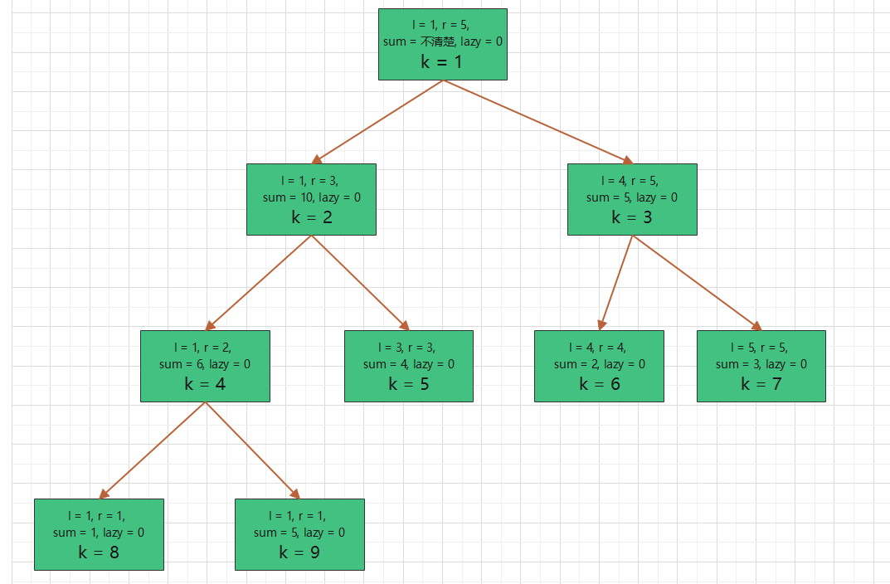

# 1.线段树概念

线段树简单来说就是仅通过一个数组来描述一棵树。数组中每个元素存储树中对应节点存储的信息，不存储描述树的层次结构的信息。

注：这和树状数组的描述很像，因为线段树是一棵平衡二叉树（具体证明不在此演示）不需要特定存储层次结构信息，树状数组的父子节点具有特殊的与关系，也不需要存储特定的层次结构信息。


# 2.线段树的存储

### 2.1 线段树的核心性质

1. **（每个节点存储着一个区间的区间和）** 每个线段树节点存储两个边界值，表示区间的左右边界，除此之外应存储一个区间和变量，用于记录区间的和，当前节点的区间和等于左右孩子的区间和之和。

2. **（每个节点的左子节点是2倍该节点编号，右子节点是2被该节点编号加1）** 线段树是平衡二叉树，按照编号规则容易得出该结论。假设当前节点编号为```k``` 那么左孩子的节点编号是```2 * k``` 那么右孩子的节点的编号是```2 * k + 1```

3. **（每个节点要么有2个子节点，要么没有子节点）** 不考虑特殊线段树的“假孩子”的情况，基础的线段树的节点要么有两个子节点，要么没有子节点。因为节点代表一个区间，一个区间要么可以分成两个子区间，要么不能再分，左边界等于右边界。

4. **（由n个元素的数列产生的线段树一共有2n-1个节点）** 该结论可以由数学归纳法等方法证明~~（本人不做竞赛，在此暂不深究）~~。

5. **（由n个元素的数列产生的线段树占用的空间最坏在4n级别） ** 虽然节点数是2n级别，但是注意线段树实际占用的空间不是2n级别的。选择不同策略创建出的线段树是不一样的，例如下文在建立线段树时选择将mid划分到左子区间中，这样最终线段树的结果为：如果为满二叉树，那么最后一层全为叶子结点。如果不是满二叉树，那么最后一层的叶子结点可能会靠左也可能会靠右，如果靠在右边，那么会造成空间浪费。可以看到下述情况的第一幅图就浪费了空间，8-11号节点并没有存储任何内容，此时的编号是13，已经超过了2n级别的存储空间。

   

   

### 2.2 线段树的数据结构描述

```c++
typedef struct Node {
    // 左右区间
	int l, r;
    // 节点懒惰标记（下文介绍），区间和
	int lazy, sum;
	Node() {
		this->l = 0;
		this->r = 0;
		this->lazy = 0;
		this->sum = 0;
	}
	Node(int l, int r, int lazy, int sum) {
		this->l = l;
		this->r = r;
		this->lazy = lazy;
		this->sum = sum;
	}
}Node;

// 存储线段树的数组
Node nodes[10000];
```


### 2.3 线段树的创建

给出一个数列```ar``` ，根据此创建一棵线段树。

```ar = [1, 5, 4, 2, 3]``` 

**特别注意：这里的特别注意与“树状数组数据结构”这篇博客中的特别注意相同，存储线段树的数组下标应该从1开始，否则从0开始时计算左孩子和右孩子的下标时会一直为0。另外区间的表示也要从1开始，因此原数列的存储下标最好也是从1开始。**


**类比：由下面的步骤可以看出，线段树的创建是“根左右”的顺序，类似于“树的先序遍历”。但是在更细区间和的值的时候是“左右根”的顺序，类似于“树的后序遍历”。**


**第一步：** 创建根节点，区间为整个区间，即数列的第一个元素到最后一个元素。区间和暂时未知，lazy标记在创建时不会使用，不用考虑。根节点的编号是1。


**第二步：** 当前节点的区间不是最小区间（左边界等于右边界），因此先创建当前节点的左子节点。左子节点的区间仍不是最小区间，所以当前的区间和仍然未知。


**第三步：** 当前节点的区间不是最小区间（左边界等于右边界），因此先创建当前节点的左子节点


**第四步：** 创建当前节点的左子节点，创建的节点的区间是最小区间，即左边界等于右边界。此时取原数列获取对应下标的元素值，```ar[1] = 1```， 因此8号节点的区间和是1。


**第五步：** 8号节点是最小区间，没有左孩子也没有右孩子，因此回溯到4号节点。4号节点的左孩子已经创建完毕，此时创建右孩子。发现右孩子的区间也是最小区间，因此知道区间和。


**第六步：** 9号节点没有左孩子右孩子，回溯到4号节点，因为4号节点的左右孩子都创建完毕，所以可以按照2.1中提到的核心性质更新4号节点的区间和为左孩子的区间和加上右孩子的区间和。


**第七步：** 4号节点的左右孩子已经创建完毕，并且已经更新了区间和的值，4号节点已经彻底创建完毕，此时回溯到2号节点。2号节点接着创建右孩子。因为新创建的右孩子的区间是最小区间，因此知道区间和的值。


**第八步：**回溯到2号节点，更细2号节点的区间和的值，为左右孩子的区间和的和，此时已经知道4号和5号节点的区间和，因此可以直接更新2号节点的区间和。


**第九步：** 2号节点已经创建完毕，回溯到1号节点，接着创建1号节点的右孩子。


**第十步：** 因为3号节点的区间不是最小区间，所以有孩子，因此接着创建3号节点的左孩子。发现3号节点的左孩子6号节点的区间是最小区间，因此直接查找原数列，获取区间和，就是```ar[4]``` 的值。


**第十一步：** 6号节点创建完毕后回溯到3号节点，3号节点接着创建右孩子7号节点。7号节点的区间也是最小区间，因此直接可得出区间和。


**第十二步：** 7号节点创建完毕，回溯到3号节点，更新3号节点的区间和。



**第十三步：** 3号节点已经彻底创建完毕，回溯到1号节点，并更新1号节点的区间和。至此线段树创建完毕。


# 3.线段树的基本功能

### 3.1 概述

1. ```changePoint``` 修改某个点的值，以O(logn)的复杂度从根节点找到该节点进行修改，再以O(logn)的复杂度回溯，更新路径上的节点的区间和。
2. ```changeSeg``` 修改一段区间上所有点的值，以O(logn)的复杂度从根节点找到表示该区间的节点，根据修改类型给区间更新lazy标记，再以O(logn)的复杂度回溯，更新路径上的节点的区间和。
3. ```query``` 查询一段区间的区间和，以O(logn)的复杂度从根节点找到表示该区间的节点，返回该节点的区间和。如果在寻找路径上发现某些节点的lazy标记不是0，那么进行lazy标记下传操作。
4. ```pushdown``` 将当前节点的lazy标记下传给当前节点的两个孩子节点，并更新孩子的区间和。结束后将自己的lazy标记设置为0。


### 3.2 线段树的创建

下述代码对应2中的示例。

**特别注意：在下述代码中“创建左孩子时”把mid划分到了左孩子中，也就是说讲一个区间划分为两个小区间时，中间点属于左小区间。这看起来好像不值得注意，但是在之后涉及到的区间修改，单点修改，区间查询时都要注意，在区间划分时也要遵循这个相同的规则。**

#### 3.2.1 算法流程描述

（1）更新当前节点的左右区间值

（2）递归边界：如果是最小区间的节点，直接更新区间和并返回

（3）递归生成左孩子，mid值划分给左区间

（4）递归生成右孩子

（5）回溯时更细当前节点的区间和

```c++
#include <iostream>
using namespace std;

typedef struct Node {
	int l, r, sum, lazy;
	Node() {
		this->sum = 0;
		this->lazy = 0;
	}
	Node(int l, int r) {
		this->l = l;
		this->r = r;
	}
}Node;

// 线段树节点数量是2n-1
Node nodes[10];
// 原数列从1开始计数，此数列长度为5，即n=5
int ar[6] = {0, 1, 5, 4, 2, 3};

// 当节点的左右孩子创建完毕后调用update函数更新自己的区间和
void update(int k) {
	nodes[k].sum = nodes[2 * k].sum + nodes[2 * k + 1].sum;
}

// 创建线段树，第一个参数是当前线段树中的节点的编号，第二三个参数是当前线段树中的节点要存储的区间的左右边界
void build(int k, int l, int r) {
	nodes[k].l = l;
	nodes[k].r = r;
	int mid = (l + r) >> 1;
    // 如果节点的区间是最小区间，直接获取区间和
	if(l == r) {
		nodes[k].sum = ar[l];
		return;
	}
    // 先创建左孩子
	build(2 * k, l, mid);
    // 再创建右孩子
	build(2 * k + 1, mid + 1, r);
    // 创建完孩子后更新当前节点的前缀和
	update(k);
} 

int main() {
    // 从线段树的第一个节点开始创建，根节点编号为1
	build(1, 1, 5);
	
	for(int i = 1; i <= 9; i ++) 
		cout << "当前节点编号为：" << i << " 当前节点的区间左边界为：" << nodes[i].l << " 当前节点的区间右边界为：" << nodes[i].r << " 当前节点的区间的区间和为：" << nodes[i].sum << endl;
}

// 当前节点编号为：1 当前节点的区间左边界为：1 当前节点的区间右边界为：5 当前节点的区间的区间和为：15
// 当前节点编号为：2 当前节点的区间左边界为：1 当前节点的区间右边界为：3 当前节点的区间的区间和为：10
// 当前节点编号为：3 当前节点的区间左边界为：4 当前节点的区间右边界为：5 当前节点的区间的区间和为：5
// 当前节点编号为：4 当前节点的区间左边界为：1 当前节点的区间右边界为：2 当前节点的区间的区间和为：6
// 当前节点编号为：5 当前节点的区间左边界为：3 当前节点的区间右边界为：3 当前节点的区间的区间和为：4
// 当前节点编号为：6 当前节点的区间左边界为：4 当前节点的区间右边界为：4 当前节点的区间的区间和为：2
// 当前节点编号为：7 当前节点的区间左边界为：5 当前节点的区间右边界为：5 当前节点的区间的区间和为：3
// 当前节点编号为：8 当前节点的区间左边界为：1 当前节点的区间右边界为：1 当前节点的区间的区间和为：1
// 当前节点编号为：9 当前节点的区间左边界为：2 当前节点的区间右边界为：2 当前节点的区间的区间和为：5
```


### 3.3 线段树单点修改

#### 3.3.1 算法流程描述

（1）递归边界：如果到达最小区间节点，那么找到目标节点，修改后返回

（2）如果目标节点大于当前区间的中间值，那么去当前区间的右子区间寻找

（3）如果目标节点小于等于当前区间的中间值，那么去当前区间的左子区间寻找

（4）修改完毕回溯时更新当前路径上的节点的区间和

```c++
void changePoint(int k, int x, int y) {
	int mid = (nodes[k].l + nodes[k].r) >> 1;
    // 如果到达最小区间，那么找到该点
	if(nodes[k].l == nodes[k].r)
		nodes[k].sum += y;
	if(x > mid)
        // 当前点的位置属于当前区间的右小区间
		changePoint(2 * k + 1, x, y);
	else
        // 当前点的位置属于当前区间的左小区间（遵循了3.2中mid划分给左小区间的规则）
		changePoint(2 * k, x, y);
    // 如果修改完毕后，在回溯过程中更新路径上的点的值
	update(k);
}
```


### 3.4 线段树区间修改

#### 3.4.1 算法流程描述

（1）递归边界：当前区间等于目标区间，那么直接打标记，更新区间和后退出

（2）下传标记

（3）如果目标区间完全位于当前区间的右小区间，那么去右小区间寻找目标区间

（4）如果目标区间完全位于当前区间的左小区间，那么去左小区间寻找目标空间

（5）如果目标空间跨域了当前区间的左小区间和右小区间，那么分别去这两个小区间寻找分割的目标区间

（6）回溯时更新路径上的节点的区间和

#### 3.4.2 lazy标记的解释

> 假设当前要求是，对某一个区间都加上一个数。

**3.4.2.1 树状数组解决区间修改的做法：**

树状数组的做法是节点存储差分值，当区间修改时，更新区间边界的差分值，不更新每一个点的值，更新操作的时间复杂度是O(1)。

在线段树中我们肯定也不能更新每个点的值，这样是一个O(n)的操作，加上线段树寻找节点还是O(logn)操作，更新每个点的值会非常耗时。

**3.4.2.2 线段树解决区间修改的做法：**

线段树当然不会对每个节点修改。当找到目标区间时，线段树不再向下寻找，线段树给当前表示目标区间的节点打上lazy标记。如果要求对目标区间加上y，那么当前节点的lazy标记值加上y。<u>含义是：当前节点的区间和已经更新，但是子节点的区间和还没有更新，子节点的区间中每个节点的值都要加上当前节点的lazy的值。</u>

**3.4.2.3 标记下传：**

当某次操作要修改一个lazy标记不为0的区间时，例如给该区间的所有数都加上x。那么此时要用到该区间子区间的值，此时必须下传lazy标记。

```c++
void changeSegment(int k, int l, int r, int y) {
    // 如果这是目标区间，那么直接修改区间和，并打标记，不再修改该区间下的节点
	if(nodes[k].l == l && nodes[k].r == r) {
		nodes[k].lazy += y;
		nodes[k].sum += (r - l + 1) * y;
		return;
	}
    
    // 下传标记
    if(nodes[k].lazy)
        pushdown(k);
	
    int mid = (nodes[k].l + nodes[k].r) >> 1;
    // 目标区间与当前区间有三种关系
	if(l > mid)
        // 目标区间完全位于当前区间的右小区间
		changeSegment(2 * k + 1, l, r, y);
	else if(r <= mid)
        // 目标区间完全位于当前区间的左小区间
		changeSegment(2 * k, l, r, y);
	else {
        // 目标区间跨越了当前区间的左小区间和右小区间
		changeSegment(2* k, l, mid, y);
		changeSegment(2 * k + 1, mid + 1, r, y);
	}
    // 修改完毕回溯时修改路径上的节点的区间和
	update(k);
}
```


### 3.5 线段树的区间查询

#### 3.5.1 算法流程描述

（1）如果当前节点有不为0的lazy标记，把该标记传给子节点，更新子节点

（2）递归边界：如果当前区间等于目标区间，那么返回区间和

（3）根据当前区间和目标区间的三种关系，进行递归查找目标区间

```c++
int query(int k, int l, int r) {
    // 如果当前节点有不为0的lazy标记，
    // 那么必须把该标记传给子节点，更新子节点，因为查询的区间一定在当前区间的子区间中，必须进行更新
	if(nodes[k].lazy)
		pushdown(k);
	int mid = (nodes[k].l + nodes[k].r) >> 1;
    // 递归边界是找到目标区间
	if(l == nodes[k].l && r == nodes[k].r)
		return nodes[k].sum;
    // 目标区间和当前区间还是三种关系，已经在区间修改中介绍了
	if(l > mid) 
		return query(2 * k + 1, l, r);
	else if(r <= mid)
		return query(2 * k, l, r);
	else 
		return query(2 * k, l, mid) + query(2 * k + 1, mid + 1, r);
} 
```


### 3.6 线段树的标记下放

#### 3.6.1 算法流程描述

（1）如果是最小区间节点，则取消标记并返回

（2）更新两个子节点的标记值，进行累加

（3）更新两个子节点的区间和，进行累加

（4）去除当前节点的标记值

```c++
void pushdown(int k) {
    // 如果当前节点是最小区间节点，那么取消lazy标记，有lazy标记没有作用
	if(nodes[k].l == nodes[k].r) {
		nodes[k].lazy = 0;
		return;
	}
	
    // 更新当前节点的左右子节点的lazy值
	nodes[2 * k].lazy += nodes[k].lazy;
	nodes[2 * k + 1].lazy += nodes[k].lazy;
	
    // 更新当前节点的左右子节点的区间和值
	nodes[2 * k].sum += nodes[k].lazy * (nodes[2 * k].r - nodes[2 * k].l + 1);
	nodes[2 * k + 1].sum += nodes[k].lazy * (nodes[2 * k + 1].r - nodes[2 * k].l + 1);
	
    // 当前节点的标记已经下传，可以去除标记
	nodes[k].lazy = 0; 
}
```


# 4.线段树的优势

> 注：相比树状数组，线段树的操作更加直观。

### 4.1 单点更新&区间查询

#### 4.1.1 时间复杂度

单点更新时间复杂度：O(logn)，区间查询时间复杂度：O(logn)

#### 4.1.2 方法综述

单点更新时直接调用```changePoint``` 即可，区间查询时直接调用```query``` 即可

### 4.2 区间更新&单点查询

#### 4.2.1 时间复杂度

区间更新时间复杂度：O(logn)，区间查询时间复杂度：O(logn)

#### 4.2.2 方法综述

区间更新时直接调用```changeSeg``` 即可，区间查询时直接调用```query``` 即可，左区间等于右区间

### 4.3 区间更新&单点查询

#### 4.3.1 时间复杂度

区间更新时间复杂度：O(logn)，区间查询时间复杂度：O(logn)

#### 4.3.2 方法综述

区间更新时直接调用```changeSeg``` 即可，区间查询时直接调用```query``` 即可


# 5.线段树操作例题

### 5.1 区间修改&单点查询

**P3368 【模板】树状数组 2**

https://www.luogu.com.cn/problem/P3368

注：不使用树状数组时，使用线段树，这里常规scanf或者cin会tle，得加上快读，擦边ac。

```c++
#include <iostream>
using namespace std;

typedef long long ll;

typedef struct Node {
	int l, r;
	ll sum, lazy;
	Node() {
		this->sum = 0;
		this->lazy = 0;
	}
}Node;

const int limit = 500001;
Node nodes[4 * limit];
ll ar[limit];

inline long long read(){
	long long f=1,outt=0;char a=getchar();
	while(a>'9'||a<'0'){if(a=='-')f=-1;a=getchar();}
	while(a<='9'&&a>='0'){outt*=10;outt+=a-'0';a=getchar();}
	return f*outt;
}

void update(int k) {
	nodes[k].sum = nodes[2 * k].sum + nodes[2 * k + 1].sum;
}

void build(int k, int l, int r) {
	nodes[k].l = l;
	nodes[k].r = r;
	if(nodes[k].l == nodes[k].r) {
		nodes[k].sum = ar[l];
		return;
	}
	int mid = (l + r) >> 1;
	build(2 * k, l, mid);
	build(2 * k + 1, mid + 1, r);
	update(k);
}

void pushdown(int k) {
	if(nodes[k].l == nodes[k].r) {
		nodes[k].lazy = 0;
		return;
	}
	
	nodes[2 * k].lazy += nodes[k].lazy;
	nodes[2 * k + 1].lazy += nodes[k].lazy;
	
	nodes[2 * k].sum += (nodes[2 * k].r - nodes[2 * k].l + 1) * nodes[k].lazy;
	nodes[2 * k + 1].sum += (nodes[2 * k + 1].r - nodes[2 * k + 1].l + 1) * nodes[k].lazy;
	
	nodes[k].lazy = 0;
}

void changeSeg(int k, int l, int r, int y) {
	if(nodes[k].l == l && nodes[k].r == r) {
		nodes[k].lazy += y;
		nodes[k].sum += y * (r - l + 1);
		return;
	}
	
	if(nodes[k].lazy)
		pushdown(k);
	
	int mid = (nodes[k].l + nodes[k].r) >> 1;
	if(l > mid)
		changeSeg(2 * k + 1, l, r, y);
	else if(r <= mid)
		changeSeg(2 * k, l, r, y);
	else {
		changeSeg(2 * k, l, mid, y);
		changeSeg(2 * k + 1, mid + 1, r, y);
	}
	update(k);
}

ll query(int k, int l, int r) {
	if(nodes[k].lazy) 
		pushdown(k);
	
	if(nodes[k].l == l && nodes[k].r == r) 
		return nodes[k].sum;
	
	int mid = (nodes[k].l + nodes[k].r) >> 1;
	if(l > mid)
		return query(2 * k + 1, l, r);
	else if(r <= mid)
		return query(2 * k, l, r);
	else
		return query(2 * k, l, mid) + query(2 * k + 1, mid + 1, r);
}

int main() {
	int n, m, op, l, r;
	ll y;
	cin >> n >> m;
	for(int i = 1; i <= n; i ++) 
		ar[i] = read();
	
	build(1, 1, n);
	
	for(int i = 0; i < m; i ++) {
		cin >> op;
		if(op == 1) {
			l = read();
			r = read();
			y = read();
			changeSeg(1, l, r, y);
		} else {
			l = read();
			cout << query(1, l, l) << endl;
		}
	}
}
```


### 5.2 区间修改&区间查询

**P3372 【模板】线段树1**

https://www.luogu.com.cn/problem/P3372

```c++
#include <iostream>
using namespace std;

typedef long long ll;

typedef struct Node {
	int l, r;
	ll sum, lazy;
	Node() {
		this->sum = 0;
		this->lazy = 0;
	}
}Node;


const int limit = 100001;
Node nodes[4 * limit];
ll ar[limit];

void update(int k) {
	nodes[k].sum = nodes[2 * k].sum + nodes[2 * k + 1].sum;
}

void build(int k, int l, int r) {
	nodes[k].l = l;
	nodes[k].r = r;
	if(nodes[k].l == nodes[k].r) {
		nodes[k].sum = ar[l];
		return;
	}
	int mid = (l + r) >> 1;
	build(2 * k, l, mid);
	build(2 * k + 1, mid + 1, r);
	update(k);
}

void pushdown(int k) {
	if(nodes[k].l == nodes[k].r) {
		nodes[k].lazy = 0;
		return;
	}
	
	nodes[2 * k].lazy += nodes[k].lazy;
	nodes[2 * k + 1].lazy += nodes[k].lazy;
	
	nodes[2 * k].sum += (nodes[2 * k].r - nodes[2 * k].l + 1) * nodes[k].lazy;
	nodes[2 * k + 1].sum += (nodes[2 * k + 1].r - nodes[2 * k + 1].l + 1) * nodes[k].lazy;
	
	nodes[k].lazy = 0;
}

void changeSeg(int k, int l, int r, int y) {
	if(nodes[k].l == l && nodes[k].r == r) {
		nodes[k].lazy += y;
		nodes[k].sum += y * (r - l + 1);
		return;
	}
	
	if(nodes[k].lazy)
		pushdown(k);
	
	int mid = (nodes[k].l + nodes[k].r) >> 1;
	if(l > mid)
		changeSeg(2 * k + 1, l, r, y);
	else if(r <= mid)
		changeSeg(2 * k, l, r, y);
	else {
		changeSeg(2 * k, l, mid, y);
		changeSeg(2 * k + 1, mid + 1, r, y);
	}
	update(k);
}

ll query(int k, int l, int r) {
	if(nodes[k].lazy) 
		pushdown(k);
	
	if(nodes[k].l == l && nodes[k].r == r) 
		return nodes[k].sum;
	
	int mid = (nodes[k].l + nodes[k].r) >> 1;
	if(l > mid)
		return query(2 * k + 1, l, r);
	else if(r <= mid)
		return query(2 * k, l, r);
	else
		return query(2 * k, l, mid) + query(2 * k + 1, mid + 1, r);
}

int main() {
	int n, m, op, l, r;
	ll y;
	cin >> n >> m;
	for(int i = 1; i <= n; i ++) 
		cin >> ar[i];
	
	build(1, 1, n);
	
	for(int i = 0; i < m; i ++) {
		cin >> op;
		if(op == 1) {
			cin >> l >> r >> y;
			changeSeg(1, l, r, y);
		} else {
			cin >> l >> r;
			cout << query(1, l, r) << endl;
		}
	}
}
```

