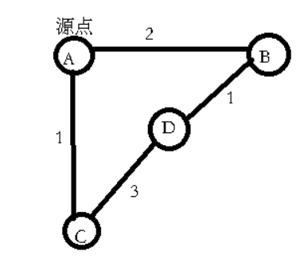

# 1.Dijkstra算法

### 1.1 算法流程阐释

**1.初始化：**

出发点的最短路长度置为零，其余点的最短路长度置为正无穷。

**2.n轮松弛：**

Dij算法将点分为已经求出最短路的点的集合和未求出最短路的点的集合。最终得出结果必须使未求出最短路的点的集合为空，初始时所有点都未求出最短路，因此需要N轮松弛，就是最外层循环次数。

**3.每轮松弛：在未求出最短路的点的集合中找到距离出发点最近的点：**

在未求出最短路的点的集合中找到一个到出发点的距离最近的点，把它加入已求出最短路的点的集合。

**4.每轮松弛：更新该点到所有未求出最短路的点的集合中的点的距离：**

找到该点后遍历该点的所有临接顶点，如果邻接顶点在未求出最短路的点的集合中，那么更新它到出发点的距离。


### 1.2 注意事项

在《数据结构》严蔚敏版中给出的Dijkstra算法是使用邻接矩阵存图描述，背景是没有自环和重边的情况。书中写到Dijkstra算法需要n-1轮松弛，对于出发点而言，书中直接初始化了出发点能够访问到的点的最短路。这不具有普遍性，如果有重边和自环需要在初始化时注意这两个细节，额外改写。这样不如把出发点的情况也并入松弛中，总共n轮松弛，简化代码逻辑。


### 1.3 复杂度

时间复杂度为O(n^2)。主要的原因是有n轮松弛时间复杂度是O(n)，在每轮松弛中都要在未求出最短路的点的集合中找到目标点并进行更新，这个操作是O(n)，总复杂度是O(n^2)


### 1.4 Dijkstra求单源最短路示例:

给出一个图的描述以及一个出发点，求这个出发点到所有点的最短路(https://www.luogu.com.cn/problem/P3371)

```c++
#include <iostream>
#include <vector>
#include <climits>
#include <cmath>
using namespace std;

struct Edge {
	int to;
	int cost;
	Edge(int to, int cost) {
		this->to = to;
		this->cost = cost;
	}
	Edge() {}
};

const int INF = INT_MAX;
vector<Edge>ar[10001];
int dis[10001];
bool vis[10001];

int main() {
	int n, m, st, x, y, z;
	cin >> n >> m >> st;
	for(int i = 0; i < m; i ++) {
		cin >> x >> y >> z;
		ar[x].push_back(Edge(y, z));
	}
	
	// init
	for(int i = 1; i <= n; i ++)
		dis[i] = INF;
	dis[st] = 0;
	
	// dijkstra
	int target = st, size, minn = INF;
	Edge next;
	for(int i = 1; i <= n; i ++) { 
		minn = INF;
		for(int j = 1; j <= n; j ++) {
			if(!vis[j] && dis[j] < minn) {
				minn = dis[j];
				target = j;
			}
		}
		vis[target] = true;
		
		size = ar[target].size();
		for(int j = 0; j < size; j ++) { 
			next = ar[target][j];
			if(!vis[next.to])
				dis[next.to] = min(dis[next.to], dis[target] + next.cost);
		}
	}
	
	for(int i = 1; i <= n; i ++)
		cout << dis[i] << " ";
}
```


### 1.5 记录路径

在1.4的基础上添加一些内容。在1.1中的步骤四会更新最短路，在此时记录最短路发生改变的顶点的前驱即可。这里使用了新的数据结构Node来记录某个顶点的前驱。

```c++
#include <iostream>
#include <vector>
#include <climits>
#include <cmath>
using namespace std;

struct Edge {
	int to;
	int cost;
	Edge(int to, int cost) {
		this->to = to;
		this->cost = cost;
	}
	Edge() {}
};

struct Node {
	int to;
	int pre;
};

const int INF = INT_MAX;
vector<Edge>ar[10001];
int dis[10001];
bool vis[10001];
Node nodes[10001];

void printRoute(int x, int st) {
	if(x == st)
		return;
	printRoute(nodes[x].pre, st);
	cout << nodes[x].pre << "->";
}

int main() {
	int n, m, st, x, y, z;
	cin >> n >> m >> st;
	for(int i = 0; i < m; i ++) {
		cin >> x >> y >> z;
		ar[x].push_back(Edge(y, z));
	}
	
	// init
	for(int i = 1; i <= n; i ++)
		dis[i] = INF;
	dis[st] = 0;
	
	// dijkstra
	int target = st, size, minn = INF;
	Edge next;
	for(int i = 1; i <= n; i ++) { 
		minn = INF;
		for(int j = 1; j <= n; j ++) {
			if(!vis[j] && dis[j] < minn) {
				minn = dis[j];
				target = j;
			}
		}
		vis[target] = true;
		
		size = ar[target].size();
		for(int j = 0; j < size; j ++) { 
			next = ar[target][j];
			if(!vis[next.to]) {
				if(dis[next.to] > dis[target] + next.cost) {
					dis[next.to] = dis[target] + next.cost;
					nodes[next.to].pre = target;
				}
			}
		}
	}
	
	for(int i = 1; i <= n; i ++) {
		cout << dis[i] << endl;
		printRoute(i, st);
		cout << i << endl;
	}
}
```


# 2.stl优先队列自定义堆

```c++
#include <iostream>
#include <queue>
using namespace std;

struct Student {
	int grade;
	string name;
	Student(int grade, string name) {
		this->grade = grade;
		this->name = name;
	}
};

struct Cmp {
	bool operator()(const Student &a, const Student &b) {
        // 大顶堆排序依据（同JavaScript的sort，与c++的sort依据相反）
		return a.grade < b.grade;
	}
};

priority_queue<Student, vector<Student>, Cmp> q;

int main() {
	int n, grade;
	string name;
	cin >> n;
	for(int i = 0; i < n; i ++) {
		cin >> name >> grade;
		q.push(Student(grade, name));
	}
	
	while(!q.empty()) {
		Student tmp = q.top();
		cout << tmp.name << " " << tmp.grade << endl;
		q.pop();
	}
}
```


# 3.堆优化的Dijkstra算法

### 3.1 算法流程阐释

**1.初始化：**

出发点的最短路长度置为零，其余点的最短路长度置为正无穷。

**2.m轮松弛：**

Dijkstra算法让点按照1中提到的规则分布在两种不同的集合中。实际上遍历完图中的所有边，就相当于遍历完了所有点。那些没有临接边的顶点的最短路为正无穷，不用遍历。

**3.每轮松弛：把当前顶点临接的未求出最短路的点的集合中的点都加入到一个小顶堆中**

把当前顶点临接的未求出最短路的点的集合中的边都加入到一个小顶堆中，这里使用了一个策略使得我们不需要通过vis数组来判断一个点是否在未求出最短路的点的集合中。在松弛过程中我们将当前顶点临接的所有顶点的到源点的最短路径大于当前顶点加上该边的权值的邻接顶点加入小顶堆，反映到代码中即```if(dis[next.to] > dis[target] + next.cost)```，只有在未求出最短路的点的集合中的点才会满足该式子。**这个操作对应无优化的Dijkstra算法中的操作是：找到target点后，更新与之临接的在未求出最短路的点的集合中的点的最短路。**

**4.每轮松弛：小顶堆排序：**

除了Edge外我们还需要另一个结构体Node，在小顶堆中，排序依据是顶点到源点的最短路，在代码中即```dis[i]```。Node需要有顶点的编号以及顶点到源点的最短路长度。因此小顶堆中每个节点都存储一个Node数据结构。这样每轮松弛开始都从优先队列（我们设置成小顶堆结构）中取出队首元素，这样相当于找到了一个未求出最短路的点的集合中的到源点距离最近的点，时间复杂度是O(logn)。对应到无优化的Dijkstra，它是通过O(n)的复杂度找到这个顶点。**这个操作对应无优化的Dijkstra算法中的操作是：在未求出最短路的点的集合中找到一个离源点最近的点。**


### 3.2 注意事项

堆优化的Dijkstra还可以进一步做优化。图中的每一个有临接边的顶点都会从优先队列中出队一次，求出最短路。但是由于把顶点加入小顶堆是一个bfs操作，类似于spfa算法中的bfs。这样就可能出现一种情况，可能同一个顶点在它松弛之前被多次加入优先队列，每次加入优先队列都会触发一次堆排序，最终一定是该顶点第一次出队时Node中的dis值是最小的。当这个顶点再次出队时，结果一定不是最优的，反而还要占用一次松弛，这会耗费时间。解决方案是维护一个vis数组，判断当前顶点是否出队过。如果已经出队，那么跳过该顶点本次松弛过程。**举例如下：D会两次入队，在出队时我们只对第一次出队的D进行松弛**




### 3.3 复杂度

堆优化的Dijkstra算法优化点在于以O(logn)的时间复杂度找到未求出最短路的点的集合中距离源点最近的点。总复杂度是O(mlogn)，m是边数。


### 3.4 示例

给出一个图的描述以及一个出发点，求这个出发点到所有点的最短路(https://www.luogu.com.cn/problem/P4779

```c++
#include <iostream>
#include <vector>
#include <climits>
#include <queue>
using namespace std;
#define ll long long

struct Edge {
	int to;
	int cost;
	Edge(int to, int cost) {
		this->to = to;
		this->cost = cost;
	}
	Edge(){}
};

struct Node {
	int to;
	int dis;
	Node(int to, int dis) {
		this->to = to;
		this->dis = dis;
	}
	Node() {}
};

struct Cmp {
	bool operator()(Node &a, Node &b) {
        // 小根堆排序依据，与JavaScript中的sort依据相同，与c++中的sort依据相反。表示a.dis大于b.dis时交换a和b
		return a.dis > b.dis;
	}
};

const int INF = INT_MAX;
vector<Edge>ar[100001];
int dis[100001];
bool vis[100001];
priority_queue<Node, vector<Node>, Cmp>q;

int main() {
	int n, m, st, x, y, z;
	cin >> n >> m >> st;
	for(int i = 0; i < m; i ++) {
		cin >> x >> y >> z;
		ar[x].push_back(Edge(y, z));
	}
	
	// init 
	for(int i = 1; i <= n; i ++)
		dis[i] = INF;
	dis[st] = 0;
	q.push(Node(st, 0));
	
	// dijkstra
	while(!q.empty()) {
		int target = q.top().to;
		q.pop();
		if(vis[target])
			continue;
		vis[target] = true;
		int size = ar[target].size();
		Edge next;
		for(int i = 0; i < size; i ++) {
			next = ar[target][i];
			if(dis[next.to] > dis[target] + next.cost) {
				dis[next.to] = dis[target] + next.cost;
				q.push(Node(next.to, dis[next.to]));
			}
		}
	}
	
	for(int i = 1; i <= n; i ++)
		cout << dis[i] << " ";
}
```

### 3.5 记录路径

```c++
#include <iostream>
#include <vector>
#include <climits>
#include <queue>
using namespace std;
#define ll long long

struct Edge {
	int to;
	int cost;
	Edge(int to, int cost) {
		this->to = to;
		this->cost = cost;
	}
	Edge(){}
};

struct Node {
	int to;
	int dis;
	Node(int to, int dis) {
		this->to = to;
		this->dis = dis;
	}
	Node() {}
};

struct Node2 {
	int to;
	int pre;
};

struct Cmp {
	bool operator()(Node &a, Node &b) {
		return a.dis > b.dis;
	}
};

const int INF = INT_MAX;
vector<Edge>ar[100001];
int dis[100001];
bool vis[100001];
priority_queue<Node, vector<Node>, Cmp>q;
Node2 nodes[100001];

void printRoute(int x, int st) {
	if(x == st)
		return;
	printRoute(nodes[x].pre, st);
	cout << nodes[x].pre << "->";
}

int main() {
	int n, m, st, x, y, z;
	cin >> n >> m >> st;
	for(int i = 0; i < m; i ++) {
		cin >> x >> y >> z;
		ar[x].push_back(Edge(y, z));
	}
	
	// init 
	for(int i = 1; i <= n; i ++)
		dis[i] = INF;
	dis[st] = 0;
	q.push(Node(st, 0));
	
	// dijkstra
	while(!q.empty()) {
		int target = q.top().to;
		q.pop();
		if(vis[target])
			continue;
		vis[target] = true;
		int size = ar[target].size();
		Edge next;
		for(int i = 0; i < size; i ++) {
			next = ar[target][i];
			if(dis[next.to] > dis[target] + next.cost) {
				dis[next.to] = dis[target] + next.cost;
				nodes[next.to].to = next.to;
				nodes[next.to].pre = target;
				q.push(Node(next.to, dis[next.to]));
			}
		}
	}
	
	for(int i = 1; i <= n; i ++) {
		cout << dis[i] << endl;
		printRoute(i, st);
		cout << i << endl;
	}
}
```


# 4.SPFA算法

### 4.1 复杂度：

O(nm)

### 4.2 注意事项：

队列中的顶点一定是不同的，不允许队列中存在多个相同的顶点，这样存在无效操作。同一个顶点可以多次入队被更新。


### 4.3 示例：

给出一个图的描述以及一个出发点，求这个出发点到所有点的最短路(https://www.luogu.com.cn/problem/P3371)

```c++
#include <iostream>
#include <climits>
#include <vector>
#include <queue>
using namespace std;
const int INF = INT_MAX;

struct Edge {
	int to;
	int cost;
	Edge(int to, int cost) {
		this->to = to;
		this->cost = cost;
	}
};

vector<Edge>ar[10001];
queue<int>q;
int dis[10001];
bool vis[10001];

int main() {
	int n, m, st, x, y, z;
	cin >> n >> m >> st;
	for(int i = 0; i < m; i ++) {
		cin >> x >> y >> z;
		ar[x].push_back(Edge(y, z));
	}
	
	for(int i = 1; i <= n; i ++)
		dis[i] = INF;
	
	dis[st] = 0;
    vis[st] = true;
	q.push(st);
    
	while(!q.empty()) {
		int node = q.front();
		int size = ar[node].size();
		vis[node] = false;
		q.pop();
		for(int i = 0; i < size; i ++) {
			Edge next = ar[node][i];
			if(dis[next.to] > dis[node] + next.cost) {
				dis[next.to] = dis[node] + next.cost;
				if(!vis[next.to]) {
					vis[next.to] = true;
					q.push(next.to);
				}
			}
		}
	}
	
	for(int i = 1; i <= n; i ++)
		cout << dis[i] << " ";
}
```

### 4.4 记录路径

```c++
#include <iostream>
#include <climits>
#include <vector>
#include <queue>
using namespace std;
const int INF = INT_MAX;

struct Edge {
	int to;
	int cost;
	Edge(int to, int cost) {
		this->to = to;
		this->cost = cost;
	}
};

struct Node {
	int to;
	int pre;
};

vector<Edge>ar[10001];
queue<int>q;
int dis[10001];
Node nodes[10001];
bool vis[10001];

void printRoute(int x, int st) {
	if(x == st)
		return;
	printRoute(nodes[x].pre, st);
	cout << nodes[x].pre << "->";
}

int main() {
	int n, m, st, x, y, z;
	cin >> n >> m >> st;
	for(int i = 0; i < m; i ++) {
		cin >> x >> y >> z;
		ar[x].push_back(Edge(y, z));
	}
	
	for(int i = 1; i <= n; i ++)
		dis[i] = INF;
	
	dis[st] = 0;
	vis[st] = true;
    q.push(st);
    
	while(!q.empty()) {
		int node = q.front();
		int size = ar[node].size();
        vis[node] = false;
		q.pop();
		for(int i = 0; i < size; i ++) {
			Edge next = ar[node][i];
			if(dis[next.to] > dis[node] + next.cost) {
				dis[next.to] = dis[node] + next.cost;
				if(!vis[next.to]) {
					vis[next.to] = true;
                    nodes[next.to].pre = node;
					q.push(next.to);
				}
			}
		}
	}
	
	for(int i = 1; i <= n; i ++) {
		cout << dis[i] << endl;
		printRoute(i, st);
		cout << i << endl;
	}
}
```


### 4.4 负环判断

https://www.luogu.com.cn/problem/P3385

负环表示从某一点出发存在一条返回该点的回路，且总权值为负值。

负环的判断可以根据顶点入队次数来判断，如果顶点入队大于等于n次，则有负环。

注：4.4之前的SPFA没有处理负环的代码，一旦遇到负环就停不下来了。

```c++
#include <iostream>
#include <vector>
#include <queue>
#include <climits>

using namespace std;

struct Edge {
	int to;
	int cost;
	Edge(int to, int cost) {
		this->to = to;
		this->cost = cost;
	}
	Edge() {}
};

vector<Edge>ar[2001];
queue<int>q;
int cnt[2001], dis[2001];
bool vis[2001]; 

int main() {
	int T, n, m, u, v, w;
	bool exist = false;
	cin >> T;
	for(int i = 0; i < T; i ++) {
		cin >> n >> m;
		for(int k = 0; k < 2001; k ++) {
			cnt[k] = 0;
			dis[k] = INT_MAX;
			ar[k].clear();
			vis[k] = false;
		}
		q = queue<int>(); 
		exist = false;
		for(int j = 0; j < m; j ++) {
			cin >> u >> v >> w;
			if(w >= 0)
				ar[u].push_back(Edge(v, w)), ar[v].push_back(Edge(u, w));
			else
				ar[u].push_back(Edge(v, w));
		}
		q.push(1);
		dis[1] = 0;
		vis[1] = true;
		cnt[1] ++;
		
		while(!q.empty()) {
			int now = q.front();
			q.pop();
			vis[now] = false;
			if(cnt[now] >= n) {
				cout << "YES" << endl;
				exist = true;
				break;
			}
			int size = ar[now].size();
			for(int j = 0; j < size; j ++) {
				Edge next = ar[now][j];
				if(dis[next.to] > dis[now] + next.cost) {
					dis[next.to] = dis[now] + next.cost;
					if(!vis[next.to]) {
						vis[next.to] = true;
						q.push(next.to);
						cnt[next.to] ++;
					}
				}	
			}
		}
		if(!exist)
			cout << "NO" << endl;
 	}
} 
```


# 5.Floyd算法

### 5.1 注意事项：

第一层循环枚举中间点k。在比较当前路径和经过中间点的路径的大小时，要注意不要越界，下面代码对越过int上界的情况做了特判。


### 5.2 示例：

给出一个图的描述以及一个出发点，求这个出发点到所有点的最短路(https://www.luogu.com.cn/problem/P3371)

70分

```c++
#include <iostream>
#include <climits>
#include <cmath>
using namespace std;

const int INF = INT_MAX;
int ar[1001][1001];

int main() {
	int n, m, st, u, v, w;
	cin >> n >> m >> st;
	
	for(int i = 1; i <= n; i ++)
		for(int j = 1; j <= n; j ++)
			if(i == j)
				ar[i][j] = 0;
			else
				ar[i][j] = INF;
	
	for(int i = 0; i < m; i ++) {
		cin >> u >> v >> w;
		ar[u][v] = min(ar[u][v], w);
	}
	
	for(int k = 1; k <= n; k ++)
		for(int i = 1; i <= n; i ++)
			for(int j = 1; j <=n ;j ++) {
				if(ar[i][k] == INF || ar[k][j] == INF)
					continue;
				ar[i][j] = min(ar[i][j], ar[i][k] + ar[k][j]);
			}
	
	for(int i = 1; i <= n; i ++) 
		cout << ar[st][i] << " ";
}
```

