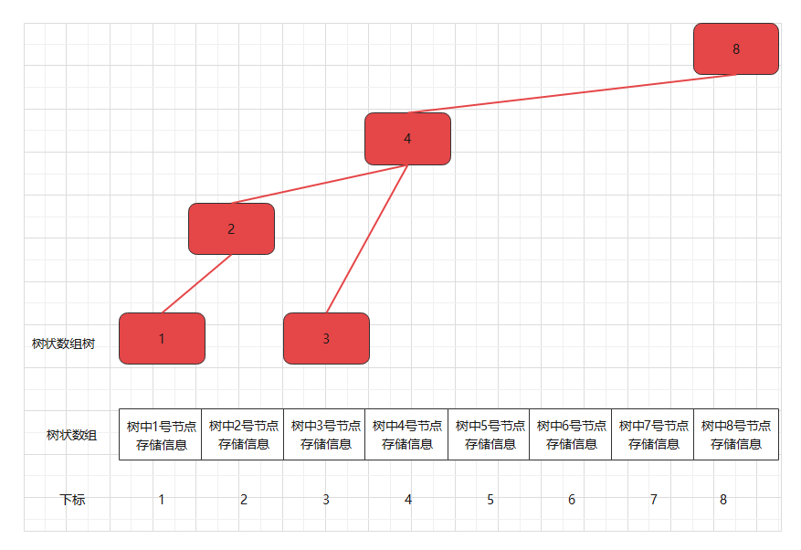

# 1.树状数组概念

树状数组简单来说就是仅通过一个数组来描述一棵树或一个森林。数组中每个元素只存储着树中对应节点存储的信息，不存储描述树的层次结构的信息。


# 2.普通树的存储

对于一棵普通的树，在《数据结构》严蔚敏版中提到可以使用如下方法进行存储：

### 2.1 父节点表示法

用一个数组中存储节点信息，节点信息包括节点存储数据和父节点编号。

```c++
struct Node {
    int data; // 节点存储的数据
    int parent; // 节点对应的父节点的编号
}

struct Tree {
    struct Node* node; // 存储节点的数组的指针
    int r; // 树中根节点的编号
    int n; // 树中节点个数
}
```


### 2.2 孩子表示法

用一个数组存储节点信息，节点信息包括节点存储数据和子节点链表。

```c++
struct Child {
    int data; // 节点存储的数据
    int childNumber; // 该节点是第几个孩子
    struct Child* nextChild; // 指向下一个孩子的指针
}

struct Node {
    int data; // 该节点存储的信息
    struct Child* firstChild; // 该节点的孩子数组的指针 
}

struct Tree {
    struct Node* node; // 存储节点的数组的指针
    int r; // 树中根节点的编号
    int n; // 树中节点个数
}
```


### 2.3 孩子兄弟表示法

用一个数组存储节点信息，节点信息包括节点存储数据，节点下一个兄弟节点，节点第一个子节点。

想要访问某一个节点的子节点只需要从第一个子节点出发通过兄弟节点依次寻找即可。

孩子兄弟表示法也是二叉树表示法，因为每个节点有两个指针。

```c++
struct Node {
    int data; // 节点存储的数据
    struct Node* nextSibiling; // 指向下一个兄弟节点的指针
    struct Node* firstChild; // 指向第一个子节点的指针
}

struct Tree {
    struct Node* node; // 存储节点的数组的指针
    int r; // 树中根节点的编号
    int n; // 树中节点个数
}
```


### 2.4 遍历序列表示法

> 树的先序+后序遍历数组不能唯一确定一棵树。
>
> 树的先序+中序遍历数组能唯一确定一棵树。
>
> 树的后序+中序遍历数组能唯一确定一棵树。

这种表示方法是使用两个数组来存储节点信息，节点信息只包括节点存储数据，不包含对树层次结构的描述。


# 3.树状数组树的存储

在1中提到树状数组只是一个数组且不存储树或森林的层次结构信息，这和2中的几种方法对比即可发现，这是不可能准确描述一棵树的。实际上树状数组拥有特殊性质，层次结构信息在树状数组中不需要额外描述。**注：树状数组描述的不一定是一个树，也有可能是一个森林，下文为了表述简便期间，用树状数组树代替可能产生的树或森林。**

### 3.1 树状数组和树状数组树的核心性质

1. **(数组下标和树中节点编号对应)** 树状数组中的每个元素的下标都对应着树状数组树中的节点的编号，树状数组中第一个元素就是树状数组树中编号为1的节点。
2. **(树状数组第一个元素对应树中节点)** 树状数组中第一个元素是树状数组树的第一个叶子结点。
3. **(树状数组树中节点的层次关系)** 树状数组树中的某个节点编号为```i```，它的父节点编号是```i + (i & (-i))```。由此可向上追溯到祖先节点。树状数组树中的某个节点编号为```i```，编号小于```i```且层级最高的节点编号是是```i - (i & (-i))```。


### 3.2 由树状数组创建一课树状数组树

给出一个树状数组```ar```，由此创建一棵树状数组树。

```ar = [x1, x2, x3, x4, x5, x6, x7, x8]``` x表示对应元素存储的信息，我们在此用x替代，我们在3.2只关注如何创建树状数组树。

**特别注意：下面的图中指明了```ar```数组的下标从1开始，在程序中存储时也应注意，如果从0开始存储，在计算第一个节点的父节点，也就是```i + (i & (-i))``` 时会始终计算为0，原因是0的补码导致，在此不是终点，可以查阅计算机组成原理相关知识。 **

**第一步：** 从第一个元素开始遍历树状数组

根据3.1性质1和2可知，树状数组的第一个元素对应着树状数组树中的第一个叶子结点，并且该节点编号为1。


根据3.1性质3可知，树状数组树的层次结构中的父节点编号可以由当前节点编号推出。经过计算，可以一直推导出祖先节点。

8号节点当然可以继续往后推导，但是会超过树状数组的界限，树状数组只存储了8个树中节点的信息。


**第二步：** 遍历到第二个元素

树状数组中第二个元素对应的下标2已经存在在步骤一构造的树中，这代表着树状数组中下标为2的元素对应的树中的节点2已经被创建，所以直接跳过即可。

**第三步：** 遍历到第三个元素

第三个元素对应的节点还未被创建，因为上图中的节点还没有编号为3。因此使用同样的规则创建节点。



**第四步：** 遍历到第四个元素

4号节点已被创建，跳过

**第五步：** 遍历到第五个元素


**第六步：** 遍历到第六个元素

6号节点已在树中存在，跳过

**第七步：** 遍历到第七个元素


**第八步：** 遍历到第八个元素

8号节点已在树中存在，跳过。

**注：如果树状数组仅有7个元素，那么就是把上图的8号节点去掉，这时产生的就是一个森林。**


# 4.树状数组的基本功能

1. ```update```函数表示在树状数组树中更新某个节点的值，并以O(logn)时间复杂度沿着该节点向上到祖先节点，更新这条路径上经过的节点的值。

2. ```getSum```函数表示在树状数组中以O(logn)时间复杂度求前缀和。

3. 树状数组的核心在于树状数组树的叶子结点存储什么样的信息，叶子节点存储的信息在使用时会通过```getSum```以前缀和形式使用。

**只需知道树状数组的功能，工作原理会在后文介绍。**

```c++
int lowbit(int x) {
	return x & (-x);
}

void update(int *ar, int pos, int n, int val) {
	while(pos <= n) {
		ar[pos] += val;
		pos += lowbit(pos);
	}
}

int getSum(int *ar, int pos) {
	int sum = 0;
	while(pos >= 1) {
		sum += ar[pos];
		pos -= lowbit(pos); 
	}
	return sum;
}
```


# 5.树状数组数据结构的优势

从3中的过程可知树状数组的建立的时间复杂度为O(n)。

### 5.1 单点更新&区间查询

**背景：**

> 原数列中进行多轮修改操作，每轮修改操作会修改其中某一个数的值，每轮修改后询问一个特定区间的和

**树状数组(树)存储信息：**

> 树状数组树的叶子结点存储的值和原数列对应位置的值相同。

**优势：**

> O(logn)单点更新，O(logn)区间查询


#### 5.1.1 修改树状数组的创建

在这种情况下给出树状数组树的创建（也可以说是树状数组的创建）的代码。

> 已知一个序列，要求创建出序列对应的树状数组```ar```

```c++
#include <iostream>
using namespace std;

int lowbit(int x) {
	return x & (-x);
}

void update(int *ar, int pos, int n, int val) {
	while(pos <= n) {
		ar[pos] += val;
		pos += lowbit(pos);
	}
}

int main() {
	int n, x;
	cin >> n;
	int ar[n + 1];
	for(int i = 1; i <= n; i ++)
		ar[i] = 0;
	for(int i = 1; i <= n; i ++) {
		cin >> x;
		update(ar, i, n, x);
	}
    
    for(int i = 1; i <= n; i ++)
		cout << ar[i] << " ";
}

// 测试数据
// 8
// 1 2 3 4 5 6 7 8
// 结果
// 1 3 3 10 5 11 7 36
```

#### 5.1.2 区间和查询

因为树状数组树的每个节点的元素都存储着其所有子节点存储值的和，那么原数列中前```i```个元素的前缀和就可以由树状数组树的第```i```个节点以及第```i```个节点之前的所有层级最高的节点所存储值的和来表示。**利用了3.1中的性质3**


```c++
int getSum(int *ar, int pos) {
	int sum = 0;
	while(pos >= 1) {
		sum += ar[pos];
		pos -= lowbit(pos); // 找到编号小于pos，且层级最高的那个节点
	}
	return sum;
}
```

由此可以获得前缀和，时间复杂度是O(logn)。由前缀和可以求得区间和。```getSum(ar, 5) - getSum(ar, 1)```可以获得[2, 5]区间的区间和。

#### 5.1.3 单点更新

单点更新直接调用```update```函数即可。


### 5.2 区间更新&单点查询

**背景：**

> 原数列中进行多轮修改操作，每轮修改操作会修改其中某一个区间的所有值，给区间中每个数都加上或减去一个新的数。每轮修改后都会查询序列中某个点的值。

**树状数组(树)存储信息：**

> 树状数组树的叶子结点存储的值和原数列的差分数列对应位置的值。

**优势：**

> O(logn)区间更新 O(logn)单点查询


#### 5.2.1 修改树状数组的创建

如果是使用4.2.1中的树状数组创建方式，即在创建时每次树状数组更新函数接收序列值a[i]。这样在区间更新时需要对每个树状数组元素进行更新操作，与直接在原序列上更新无异。此时可以使用差分的方法创建树状数组。（差分可以参考另一篇博客“前缀和与差分”）

```c++
#include <iostream>
using namespace std;

int lowbit(int x) {
	return x & (-x);
}

void update(int *ar, int pos, int n, int val) {
	while(pos <= n) {
		ar[pos] += val;
		pos += lowbit(pos);
	}
}

int getSum(int *ar, int pos) {
	int sum = 0;
	while(pos >= 1) {
		sum += ar[pos];
		pos -= lowbit(pos);
	}
	return sum;
}

int main() {
	int n, x, y;
	cin >> n;
	int ar[n + 1];
	for(int i = 1; i <= n; i ++)
		ar[i] = 0;
	for(int i = 1; i <= n; i ++) {
        y = x;
		cin >> x;
		update(ar, i, n, i == 1 ? x : x - y);
	}
    
    for(int i = 1; i <= n; i ++)
		cout << getSum(ar, i) << " ";
}

// 测试数据
// 8
// 1 2 3 4 5 6 7 8
// 结果
// 1 2 3 4 5 6 7 8
```

#### 5.2.2 区间修改

区间修改利用差分的特性即可。

对于原数列区间[l, r]的修改，例如对原数列区间[l, r]上的每一个数都加上k。那么原数列的差分数列b只有b[l]和b[r + 1]的值会发生变化。因为在5.2的背景下，树状数组是基于原数列的差分数列构建的，因此差分数列改变时树状数组应该修改。调用```update(ar, l, n, k)```和```update(ar, r + 1, n, -k)```即可。

此时的区间修改对于差分数列是O(1)操作，对于树状数组是O(logn)操作。

#### 5.2.3 单点查询

单点查询由4.1.2可知```getSum(ar, i)```即可获得差分数列的第i个前缀和，即为原数列下标```i```的元素的值，这个操作是O(logn)的。

其实使用数列差分也可以解决“区间修改，单点查询”问题，但是数列差分在单点查询时需要求前缀和，这个操作是O(n)的。

树状数组是对数列差分解决该问题的优化。


### 5.3 区间更新&区间查询

**背景：**

> 原数列中进行多轮修改操作，每轮修改操作会修改其中某一个区间的所有值，给区间中每个数都加上或减去一个新的数。每轮修改后都会查询序列中某个区间的值的和

**树状数组(树)存储信息：**

> 一个树状数组树的叶子结点存储的值和原数列的差分数列对应位置的值。
>
> 另一树状数组的叶子结点存储的值和原数列的差分数列对应位置的值乘上该位置减一对应。

**优势：**

> O(logn)区间更新 O(logn)单点查询


#### 5.3.1 使用差分数列记录区间更新

差分数列的主要用途就是用于区间更新后的单点查询。但是这种情况是区间更新后的区间和查询，如果只使用差分数列或者是5.2中提到的树状数组优化的差分数列，那么在计算区间和时最好是O(n)时间复杂度。由于在4中提到了树状数组的优势是求区间和，因此考虑在5.2的基础是否能构造一个特殊树状数组能够使其前缀和满足差分数列推导出的原数列前缀和，这样就可以O(logn)时间复杂度查询前缀和。

#### 5.3.1 使用差分数列推导原数列前缀和

对于原数列a，可知其差分数列b，可知其前缀和数列sum。

其中前缀和数列sum中的每一项和差分数列b中的每一项的关系如下：
$$
sum_i=\sum^{i}_{j=1}(i-j+1)b_j\\sum_i=i\times{b_1}+(i-1)\times{b_2}+{...}+2\times{b_{i-1}}+1\times{b_i}
$$

#### 5.3.2 尝试创建一个前缀和满足差分数列推导公式的树状数组

在4中提到树状数组的核心在于O(logn)求前缀和与树状数组树的叶子结点存储的信息。在了解差分的前提下，可知上述表达式。在了解5.2和5.1的例子后更是发现树状数组树的叶子结点存储信息不同导致前缀和结果不同，那么在此考虑是否可以令树状数组树的叶子结点存储某种特殊信息能够使调用```getSum```函数获取前缀和时直接得到上述结果。

#### 5.3.3 一定不存在一个树状数组的前缀和满足差分数列的推导公式

在5.1.2中提到树状数组树求前缀和，在求前缀和过程中一定包括第一个叶子结点的值，因为第一个叶子结点的值也是构建树状数组树的数列中的值。但是在上面的推导公式中可见，当i取不同值时，前缀和的计算公式中b1一定要乘上i，这就导致树状数组求前缀和一定不满足上述公式。**树状数组的前缀和满足大致下列形式：**
$$
treeSum_i=a_i+a_{i-lowbit(i)}+{...}
$$

#### 5.3.4 改写差分数列推导原数列前缀和公式

$$
sum_i=(i\times{b_1}+i\times{b_2}+{...}+i\times{b_{i-1}}+i\times{b_i})-(0\times{b_1}+1\times{b_2}+{...}+(i-2)\times{b_{i-1}}+(i-1)\times{b_i})
$$

改写该公式的目的是使得该公式尽可能与5.3.3中提到的树状数组前缀和形式接近。可以看到该公式的后半部分与树状数组的前缀和公式匹配，虽然前面有一个系数，但是该系数与下标有关，并不是不可预测的。可以看到该公式的前半部分也是与树状数组的前缀和匹配公式匹配，只是前面有一个系数i。那么这样原数列的前缀和公式可以由两个树状数组的前缀和来表示：
$$
sum_i=i*getSum(tree1,n,i)-getSum(tree2,n,i)
$$
第一个树状数组的每个叶子结点```i```存储的是原数列的差分数列的对应值```b[i]```

第二个树状数组的每个叶子结点```i```存储的是原数列的差分数列的对应值```b[i]```乘上```i-1```

至此可知，在区间更新时的时间复杂度是O(logn)，在区间查询时的时间复杂度也是O(logn)。


# 6.树状数组序列操作例题

### 6.1 区间修改&区间查询

**A Simple Problem with Integers** 

http://poj.org/problem?id=3468

```c++
#include <iostream>
using namespace std;
long long ar[100001];
long long br[100001];

long long lowbit(long long x) {
	return x & (-x);
}

void update(long long* ar, int n, int pos, long long x) {
	while(pos <= n) {
		ar[pos] += x;
		pos += lowbit(pos);
	}
}

long long getSum(long long* ar, int pos) {
	long long sum = 0;
	while(pos >= 1) {
		sum += ar[pos];
		pos -= lowbit(pos);
	}
	return sum;
}

int main() {
	int n, p, l, r;
	char op;
	long long x, y, extraData;
	cin >> n >> p;
	for(int i = 1; i <= n; i ++) {
		y = x;
		cin >> x;
		update(ar, n, i, i == 1 ? x : x - y);
		update(br, n, i, i == 1 ? 0 : (x - y) * (i - 1));
	}
	
	for(int i = 0; i < p; i ++) {
		cin >> op;
		if(op == 'Q') {
			cin >> l >> r;
			cout << getSum(ar, r) * r - getSum(br, r) - getSum(ar, l - 1) * (l - 1) + getSum(br, l - 1) << endl;
		} else {
			cin >> l >> r >> extraData;
			update(ar, n, l, extraData);
			update(br, n, l, extraData * (l - 1));
			update(ar, n, r + 1, -extraData);
			update(br, n, r + 1, -extraData * r);
		}
	}
}
```

### 6.2 区间修改&单点查询

**P4939 Agent2**

https://www.luogu.com.cn/problem/P4939

```c++
#include <iostream>
using namespace std;
int ar[10000001];

int lowbit(int x) {
	return x & (-x);
}

void update(int* ar, int n, int pos, int val) {
	while(pos <= n) {
		ar[pos] += val;
		pos += lowbit(pos);
	}
}

int getSum(int* ar, int pos) {
	int sum = 0;
	while(pos >= 1) {
		sum += ar[pos];
		pos -= lowbit(pos);
	}
	return sum;
}

int main() {
	int n, m, op, l, r;
	cin >> n >> m;
	for(int i = 0; i < m; i ++) {
		cin >> op;
		if(op == 0) {
			cin >> l >> r;
			update(ar, n, l, 1);
			update(ar, n, r + 1, -1);
		} else {
			cin >> l;
			cout << getSum(ar, l) << endl;
		}
	}
}
```

**P3368 【模板】树状数组 2**

https://www.luogu.com.cn/problem/P3368

```c++
#include <iostream>
using namespace std;
int ar[500001];

int lowbit(int x) {
	return x & (-x);
}

void update(int* ar, int n, int pos, int val) {
	while(pos <= n) {
		ar[pos] += val;
		pos += lowbit(pos);
	}
}

int getSum(int* ar, int pos) {
	int sum = 0;
	while(pos >= 1) {
		sum += ar[pos];
		pos -= lowbit(pos);
	}
	return sum;
}

int main() {
	int n, m, x, y, op, l, r, k;
	cin >> n >> m;
	for(int i = 1; i <= n; i++) {
		y = x;
		cin >> x;
		update(ar, n, i, i == 1 ? x : x - y);
	}
	for(int i = 0; i < m; i ++) {
		cin >> op;
		if(op == 1) {
			cin >> l >> r >> k;
			update(ar, n, l, k);
			update(ar, n, r + 1, -k);
		} else {
			cin >> l;
			cout << getSum(ar, l) << endl;
		}
	}
}
```

### 6.3 单点修改&区间查询

**P3374 【模板】树状数组 1**

https://www.luogu.com.cn/problem/P3374

```c++
#include <iostream>
using namespace std;
int ar[500001];

int lowbit(int x) {
	return x & (-x);
}

void update(int* ar, int n, int pos, int val) {
	while(pos <= n) {
		ar[pos] += val;
		pos += lowbit(pos);
	}
}

int getSum(int* ar, int pos) {
	int sum = 0;
	while(pos >= 1) {
		sum += ar[pos];
		pos -= lowbit(pos);
	}
	return sum;
}

int main() {
	int n, m, x, op, l, r, k;
	cin >> n >> m;
	for(int i = 1; i <= n; i++) {
		cin >> x;
		update(ar, n, i, x);
	}
	for(int i = 0; i < m; i ++) {
		cin >> op;
		if(op == 1) {
			cin >> l >> k;
			update(ar, n, l, k);
		} else {
			cin >> l >> r;
			cout << getSum(ar, r) - getSum(ar, l - 1) << endl;
		}
	}
}
```
