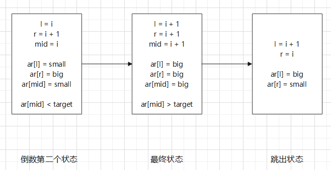
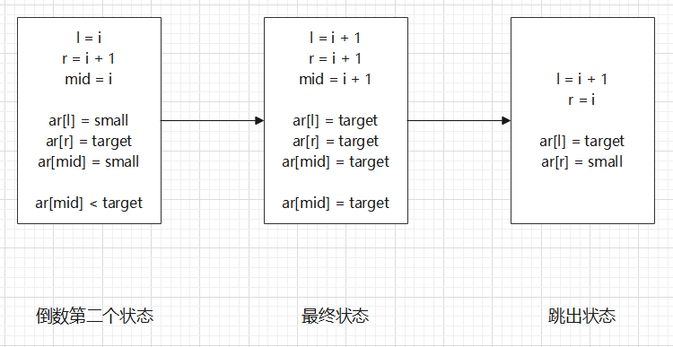

### 1.二分查找的前提：

二分查找属于静态查找表系列算法的有序表查找算法，意思就是二分查找应该使用在有序数列中，数列必须是升序或者降序排列。


### 2.主流二分查找应用场景：

#### 2.1 二分查找目标值

```c++
int find(int *ar, int l, int r, int target) {
	while(l <= r) {
		int mid = (l + r) / 2;
		if(ar[mid] == target)
			return mid;
		else if(ar[mid] > target)
			r = mid - 1;
		else
			l = mid + 1;
	}
	return -1;
}
```

**思路：**

> 二分查找的思路大致叙述为是根据中间值的状况，每次把查找区间缩小一半。当查找区间缩小为左边界等于右边界时到达查找最终状态，下一个状态退出查找。


#### 2.2 二分查找第一个大于等于目标值的值

```c++
int find(int *ar, int length, int target) {
	int l = 0, r = length - 1, mid;
	while(l <= r) {
		mid = (l + r) / 2;
		if(ar[mid] <= target) 
			l = mid + 1;
		else 
			r = mid - 1;
	}
	return l;
}
```

**基本思路：**

> 二分查找第一个比目标值大的值的思路大致叙述为是根据中间值的状况，每次把查找区间缩小一半。当查找区间缩小为左边界等于右边界时到达查找最终状态，下一个状态退出查找。但是由此无法确定状态退出时到底是左边界为预期结果还是右边界是预期结果。
>
> 根据二分查找目标值算法，可以得到如下解决方案。此时有两点还不能确定：
>
> 1. 函数返回值是左边界l还是右边界r还是其它某个值？
> 2. ```ar[mid]=target```该如何处理，应该左边界右移还是右边界左移？还是这种情况不影响最终结果？
>
> ```c++
> int find(int *ar, int length, int target) {
> 	int l = 0, r = length - 1, mid;
> 	while(l <= r) {
> 		mid = (l + r) / 2;
> 		if(ar[mid] < target) 
> 			l = mid + 1;
> 		else 
> 			r = mid - 1;
> 	}
> }
> ```


**返回值是左边界还是右边界的确认：**

> 由于二分查找应用在有序数列中，因此除了最终状态，其余所有状态下都是左边界的值小于右边界的值，且目标值介于两者之间（假设在一个升序顺序的数列中）。因此倒数第二个状态一定是区间长度为2，左边界小于右边界，此时有四种情况。
>
> 用target表示目标值，用small表示倒数第二个状态中的左边界的值小于target，用big表示倒数第二个状态的右边界的值大于target。下面每个状态的两个值表示左边界的值和右边界的值。
>
> 1. small  big
> 2. small target
> 3. target big
> 4. target target
>
> 想要确定返回值是左边界还是右边界，需要测试一下。只需要测试最普通的第一种情况即可。
>
> 
>
> 下一个状态一定是左边界右移，big big。终止状态一定是右边界左移，big small。此时是左边界对应值为所求值。因此其余三种情况也要满足左边界是所求值。


**```ar[mid]=target```是右边界左移还是左边界右移的确认：**

>在上一个环节中确认了左边界是返回值。那么确定```ar[mid]=target```的操作需要在上个环节提到的剩余三种情况中验证得知。用small target确认即可。
>
>
>
>倒数第二个状态到最终状态根据得到的框架代码就可知道。在上文“基本思路”中提到的框架代码中并没有解决```ar[mid]=target```时的情况。在这里一定是```ar[mid]=target```时右边界左移，因为只有右边界左移才能保证最后结果是左边界。

**测试：**

```c++
int ar[12] = {1, 2, 3, 4, 5, 6, 6, 6, 7, 8, 9, 10}, target = 6;
cout << find(ar, 0, 11, 6); // 8
```


#### 2.3 二分查找第一个小于等于目标值的值

```c++
int find(int *ar, int l, int r, int target) {
	while(l <= r) {
		int mid = (l + r) / 2;
		if(ar[mid] > target)
			r = mid - 1;
		else
			l = mid + 1;
	}
	return r;
}
```

**思路：**

思路同上，“small big”验证出r是结果，“small target”中验证出相等时左边界右移。


#### 2.4 二分查找第一个大于目标值的值

```c++
int find(int *ar, int l, int r, int target) {
	while(l <= r) {
		int mid = (l + r) / 2;
		if(ar[mid] > target)
			r = mid - 1;
		else
			l = mid + 1;
	}
	return l;
}
```

**思路：**

思路同上，“small big”验证出l是结果，“small target”中验证出相等时左边界右移。如果是“small target”情况一定是序列不存在大于目标值的值，此时一定是序列末尾，左边界右移将跳出序列最大右边界。


#### 2.5 二分查找第一个小于目标值的值

```c++
int find(int *ar, int l, int r, int target) {
	while(l <= r) {
		int mid = (l + r) / 2;
		if(ar[mid] <= target)
			r = mid - 1;
		else
			l = mid + 1;
	}
	return r;
}
```

**思路：**

思路同上，“small big”验证出r是结果，“small target”中验证出相等时右边界左移。如果是“small target”情况一定是序列不存在小于目标值的值，此时一定是序列开头，右边界左移将跳出序列最小左边界。


### 3.归纳二分查找的要求

1. 二分查找适用于升序或降序的有序序列。
2. 二分查找基本思路是每次查找将查找区间缩小一半，最终状态时左边界等于右边界，下一个状态停止查找。
3. 二分查找在查找过程中应该始终保持目标值介于左边界对应值和右边界对应值之间。