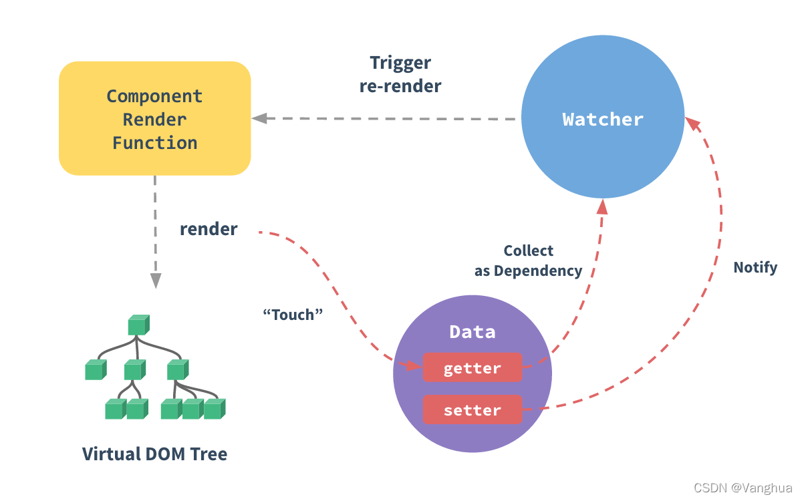
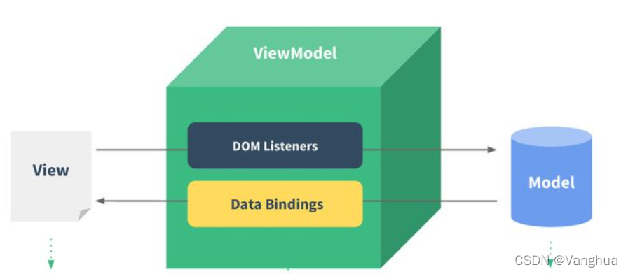
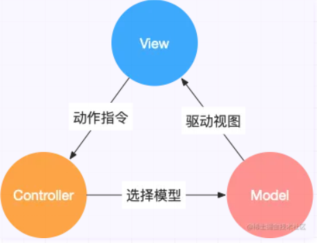
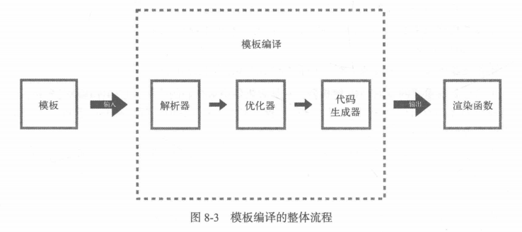

### 1.Vue响应式原理如何实现？



#### 1.1 综述：

数据变化时视图自动进行更新

#### 1.2 数据监听细粒度：

Vue2数据侦测面向的是组件。

#### 1.3 Observer类：

* **（Observer的职责）** Vue2使用Observer类的实例侦测数据对象中的数据变化。

* **（Observer和对象的对应关系）** 每一个组件的data属性本身以及其中的每一个对象都对应一个Observer类的实例。

* **（Observer的实现）** Vue2的Observer类实例化时递归地（对象中可能嵌套对象）使用Object.defineProperty将对象中的每一个属性变成访问器属性getter和setter。

#### 1.4 Watcher类：

* **（Watcher的职责）** Vue2使用Watcher类依据Observer侦测的数据变化做出响应。
* **（Watcher和组件的对应关系）** 依赖指的是Watcher类的实例，每一个组件的data对应一个Watcher类实例（因为用户可自定义添加多个Watcher监听数据变化vm.$watch()）。

#### 1.5 Dep类：

* **（Dep的职责）** 在读取数据时Dep通过getter收集Watcher依赖，在修改数据时Dep通过setter通知Watcher依赖进行响应。

* **（Dep和Observer的对应关系）** 每个Observer类实例中都有一个Dep类实例用于存储若干Watcher依赖实例。

#### 1.6 数组的数据侦测：

* 改写原型链，在Array.prototype上层创建新的原型，并对push，pop，shift，unshift，sort，reverse，splice方法进行重写，在重写的函数中进行拦截。

#### 1.7 Vue2数据侦测的局限性：

* 通过数组下标修改数据无法被监听
* 修改数组长度无法被监听

* 删除添加属性无法被监听，需要用vm.set()添加响应式属性，vm.delete()删除响应式属性。并且不能在根data上使用vm.set()和vm.delete()。


### 2.谈谈对MVVM和MVC的理解？

#### 2.1 MVVM：



* **（MVVM是什么）** MVVM指Model-View-ViewModel。
* **（MVVM三层的作用）** Model层指组件中用到的数据，实际是Vue组件中写的数据和逻辑；View层指组件的视图，实际是Vue组件中写的模板；ViewModel层是View和Model层的通信桥梁，负责数据绑定，实际是Vue框架。
* **（MVVM工作过程）** View更新时，通知ViewModel对Model更新。Model更新时通知ViewModel对View更新。
* **（MVVM的好处）** MVVM让开发者更多地关注于数据的维护，不需要手动操作DOM。

#### 2.2 MVC：



* **（MVC是什么）** MVC指Model-View-Controller
* **（MVC三层的作用）** Model层指数据和逻辑。View层指视图。Controller负责Model和View通信。
* **（MVC工作过程）** View更新时，通知Controller找到负责该页面的Model进行数据更新。Model更新时，手动操作DOM对View更新。


### 3.双向数据绑定如何实现？

#### 3.1 综述：

双向数据绑定指数据发生变化时视图自动更新，视图更新时数据自动发生变化。Vue的双向数据绑定通过v-model实现。

#### 3.2 双向数据绑定的实现：

* 双向数据绑定中数据变化时视图自动更新是响应式原理实现的，只需要实现视图更新时数据更新即可。
* 在input标签上监听input事件，并将input表签的value绑定为data中的变量。在input事件发生时，改变data中的该变量即可。
* 同样可以根据此思路应用于自定义组件上

```vue
<template>
   <!-- 这里添加了input时间的监听和value的属性绑定 -->
   <input @input='onInput' :value='localValue' />
   <span>{{localValue}}</span>
</template>
<script>
  export default{
    data(){
      return {
        localValue:'',
      }
    },
    methods:{
      onInput(v){
         //在input事件的处理函数中更新value的绑定值
         this.localValue=v.target.value;
         console.log(this.localValue)
      }
    }
  }
</script>
```


### 4.谈谈Vue模板编译原理？



* **（解析器阶段）** 首先解析器遍历模板，核心思想是通过栈来匹配标签，生成抽象语法树AST来描述模板的层级关系。抽象语法树AST中的每一个节点都描述了一个标签或文本的详细信息，包括标签类型，父节点，子节点等信息。
* **（优化器阶段）** 之后是优化器遍历抽象语法树AST，找到静态子树例如纯文本节点后打标记，表示虚拟DOM的Patch阶段可以跳过。
* **（代码生成器阶段）** 之后将优化过的抽象语法树传给代码生成器，生成可供渲染函数使用的代码字符串
* **（渲染函数）** 最后将代码字符串传给渲染函数生成虚拟DOM


### 5.谈谈Vue虚拟DOM？

#### 5.1 综述

Vue中的虚拟DOM是为了解决中等细粒度绑定下的渲染问题。

* 在没有数据驱动视图的时代，必须手动操作DOM，操作复杂。
* Vue1中采用高细粒度数据绑定，只需要关注视图。Vue监听每一个数据，任何数据改变后，更新其对应的DOM节点。这样会导致Watcher过多造成性能问题。
* 在Vue2中采用了中等细粒度的数据绑定，只需要关注视图。Vue监听每一个组件，每一个组件一个Watcher。当数据变化时会通知到组件，此时组件内需要判断哪些节点发生变化，再去更新。

因此Vue使用了虚拟DOM来判断组件中哪些节点需要更新。

#### 5.2 虚拟DOM的优缺点

* **（缺点：静态页面）** 如果是静态或变化较少的页面，使用虚拟DOM比原生DOM耗时，因为多了虚拟DOM创建操作
* **（缺点：DOM变化已知）** 在某些场合下提前得知DOM某些部分会在某些时刻变化，此时可以精确操作DOM。而虚拟DOM的Patch算法对比节点会花费大量时间。
* **（优点：没有渲染队列）** 在过去没有渲染队列的浏览器中，DOM操作会立即执行，使用虚拟DOM只关注若干DOM操作的结果，最终只执行一次DOM操作。

#### 5.3 Diff算法的大致流程

* 新旧虚拟DOM两个节点不同，那么不跨层比较，不再比较它们子节点，即使它们子节点一样，也直接进行替换。
* 新旧虚拟DOM两个节点相同，但是一个有子节点，一个无子节点，那么进行子节点添加或删除。
* 新旧虚拟DOM两个节点相同，但是都有子节点，进行子节点更新操作。

#### 5.4 虚拟DOM中对列表渲染的优化

* **（key优化）** Vue推荐在列表渲染v-for中使用key属性，Vue会建立key与index的索引关系。在Diff算法的子节点更新时，最坏时间复杂度是O(n)，对于n个子节点，新虚拟DOM中的某个子节点可以通过映射在O(1)的时间内找到旧虚拟DOM中对应子节点的位置。如果不使用key子节点对比时间复杂度较高。
* **（key使用限制）** 列表渲染使用key时不建议用列表索引index作为key值，因为列表变化时原有列表项的index会变化，这会导致建立好的映射发生变化。使用变化的映射寻找节点会造成错误。

#### 5.5 虚拟DOM中对条件渲染的优化

当使用多个v-if和v-if-else进行切换时，Vue不会重新渲染节点，可能保留某些相同成分。当不希望保留相同成分时可以给条件渲染标签添加key属性绑定不同值。


### 6.介绍一下Vue生命周期?

#### 6.1 综述：

Vue实例从创建到销毁的过程是Vue的生命周期

#### 6.2 生命周期函数：


* **beforeCreate： ** 实现创建组件实例。

* **beforeCreate->created：** 初始化阶段。实现数据响应式和数据解析。

* **created：** 实现响应式原理。完成了data，props，methods，computed，watch的设置。
  * （回忆：如果在此修改DOM需要使用vm.$nextTick。）

* **created->beforeMount：** 模板编译阶段。实现模板编译。检查是否有el属性，无el属性调用vm.$mount(xxx)函数手动关联一个DOM节点；有el属性检查是否有template属性。template优先度高于el，有template时，直接编译template的模板，没有template时，编译el的模板。最终生成渲染函数。
  * （回忆：不管也没有el，都要调用vm.$mount将vue实例和DOM节点关联，有el时只是底层代码帮我们处理了这件事。）

* **beforeMount：** 实现了模板编译为渲染函数。

* **beforeMount->mounted：** 挂载阶段。实现挂载。创建vm.$el替换el属性，vm.$el表示vue实例挂载到的DOM节点

* **mounted：**实现挂载。此时可以访问DOM。
* **mounted->beforeUpdated：**更新阶段。在虚拟DOM上使用Patch算法决定更新DOM哪些节点。
* **updated：**实现更新。DOM已经重新渲染。
* **updated->beforeDestroy：**卸载阶段。调用vm.$destroy()函数开始卸载。

* **beforeDestroy：**开始卸载。vm.$destroy()函数开始执行前的间隙。
* **beforeDestroy->Destroyed：** 卸载依赖，子组件，事件监听器。
* **Destroyed：** 完成卸载。

#### 6.3 父子组件的生命周期

**（创建时）** 

父组件beforeCreate

父组件created

父组件beforeMount

子组件beforeCreate

子组件created

子组件beforeMount

子组件mounted

父组件mounted

**（更新时）**

父组件beforeUpdate

子组件beforeUpdate

子组件updated

父组件updated

**（销毁时）**

父组件beforeDestroy

子组件beforeDestroy

子组件destroyed

父组件destroyed

#### 6.3 异步请求适合的生命周期

异步请求可以一般放在mounted和created周期。created周期中的异步请求通常会请求DOM渲染时用到的数据，例如通过异步请求给data中的数据赋值，如果这些请求放到mounted中会造成渲染变慢。mounted周期中的异步请求通常会请求修改DOM，如果这些请求放到created中还必须使用Vue.$nextTick。


### 7.介绍一下Vue.$nextTick的用法？

#### 7.1 综述：

* vm.$nextTick用法有两种，分为回调函数方法和promise方法。

  ```javascript
  vm.$nextTick(function() {})
  vm.$nextTick().then(() => {})
  ```

* vm.$nextTick表示把传入的函数在DOM渲染之后执行。在实现上可以将传入的函数加入宏任务队列。


### 8.Vue组件中的data为什么是return一个对象的函数，而不是一个对象？

**（共享引用问题）** 如果data是一个对象，在组件复用时会有多个父组件共享该组件的data对象，这样一个父组件修改data，会导致该组件在其他父组件环境下的data发生变化。因此使用函数每次返回一个对象，这样的对象的地址不同，不会共享引用。


### 9.computed属性和watch属性和methods属性的区别？

#### 9.1 watch属性

* **（watch职责简述）** watch属性表示我的变化对别人造成什么影响。
* **（watch监听和作用对象）** watch属性监听data或props中的变量，修改其它data或props中变量的值。
* **（watch使用形式）** watch监听的每个属性都是对象形式，handler表示监听前后的变化函数，immediate表示在组件第一次加载时是否触发监听，deep表示是否监听对象内部属性。
* **（异步与缓存）** watch中可以有异步操作，可以在异步变化之后修改受影响的值。watch没有缓存机制，因为watch监听到数据变化时不一定是计算值。
* **（使用场景）** 监听数据涉及异步操作。

```javascript
data() {
  return {
      testData: 1,
      testDataRes: 1
  }  
},
watch: {
    testData: {
        handler(newVal, oldVal) {
            this.testDataRes = newVal + 1
        },
        immediate: true,
        deep: true
    }
}
```

#### 9.2 computed属性

* **（computed职责简述）** computed属性表示别人的变化对我造成什么影响。
* **（computed监听和作用对象）** computed属性监听data或props中的变量，计算返回一个data和props中不存在的变量。
* **（computed使用形式）** computed计算的每个变量都是函数形式
* **（异步与缓存）** computed内有异步操作是无效的，必须返回一个同步计算值。computed有缓存机制，缓存返回的计算值。如果监听的数据没有变化，那么不再计算，返回上次的值。当监听的数据变化时，才再次计算。
* **（使用场景）** 在多次计算值的大开销操作中，使用缓存效率更高。

```javascript
data() {
	return {
        test: 1
    }
},
computed: {
    testData() {
        return this.test + 1
    }
}
```

#### 9.3 methods属性

* **（methods缺点）** methods和computed相比都是返回一个函数的结果，可以用于计算，但是methods没有缓存机制。


### 10.组件通信的方法有哪些？

#### 10.1 父子组件：props—$emit通信

父组件在子组件上绑定属性向子组件发消息，在子组件上绑定方法来接收子组件的消息

```Vue
// 父组件
<Child @RecieveMsg = "handleRecieveMsg" :msg = "msg"></Child>

data() {
	return {
		msg: "123"
	}
},
methods: {
	handleRecieveMsg(arg) {
		console.log(arg)
	}
}
```

子组件通过props接收父组件的消息，通过$emit(方法名，若干参数)来向父组件发消息

```vue
// 子组件
<button @click="handleClick">click me</button>
props: ["msg"],
methods: {
	handleClick() {
		this.$emit("RecieveMsg", 1, 2, 3)
	}
}
```

#### 10.2 父子组件：回调函数

与props-$emit通信不同之处在于少了$emit，父组件在子组件上绑定属性来向子组件发信息，在子组件上绑定属性接收子组件的信息。

```javascript
// 父组件
<Child :callback = "callback" :msg = "msg"></Child>

data() {
	return {
		msg: "123"
	}
},
methods: {
	callback() {
		this.msg = "456"
	}
}
```

#### 10.3 父子组件：$parent—$children通信

父组件通过$children访问子组件

子组件通过$parent访问父组件

#### 10.4 祖孙组件：provide—inject通信

父组件设置provide属性提供通信变量，任何一个子层级组件需要使用时使用inject注入即可

```javascript
// 父组件
data() {
    return {}    
},
provide: {
	msg: "123"    
}
```

```javascript
// 某层级的子组件
data() {
    return {}
},
inject: ["msg"]
```

#### 10.5 祖孙组件：$attrs—$listeners

父组件绑定在子组件上的属性和方法子组件可以通过$attrs和$listeners获取，这样父组件向孙子组件通信时，子组件在孙子组件上绑定$attrs和$listeners即可，不需要一个个属性和方法再打一遍。（在Vue3中$listeners被移除，方法也可以通过$attrs获取）

```vue
// 父组件
<child :msg="msg" @sendMsg="handleSendMsg"></child>
```

```vue
// 子组件
<grandchild v-bind = "$attrs" v-on = "$listeners"></grandchild>
```

```vue
// 孙子组件
<button @click = "handleClick">向爷爷组件通信</button>
props: ["msg"],
methods: {
	handleClick() {
		this.$emit("sendMsg", "孙子组件发来问候")
	}
}
```

#### 10.6 父子组件：ref—$refs通信

父组件使用$refs属性访问子组件，从而调用其方法。

```vue
// 父组件
<Child ref="child"></Child>
mounted() {
	this.$refs.child.run()
}
```

```vue
// 子组件
methods: {
	run() {
		console.log("running")
	}
}
```

#### 10.7 兄弟组件：事件总线通信

借助Vue实例提供的$on和$emit方法来实现发布订阅模式使兄弟组件间通信。

```javascript
// 事件总线控制器
import Vue from "vue"
export const eventBus = new Vue()
```

```javascript
// 某个组件中订阅
eventBus.$on("func", arg => {

})
```

```javascript
// 某个组件中发布
eventBus.$emit("func", xxx)
```

#### 10.8 兄弟组件：Vuex通信


### 11.Vue有哪些插槽，怎么使用？

#### 11.1 综述：

* 插槽是Vue内容分发机制，父组件将特定内容插入子组件中。

* 在子组件中用slot标签描述插槽，在父组件中使用template将内容分发到插槽。

#### 11.2 插槽分类：

* **（匿名插槽）** 子组件中只有一个slot标签描述插槽，父组件可以向插槽插入若干内容

* **（具名插槽）** 子组件中有多个slot标签描述插槽并设置name属性，父组件通过template设置v-slot属性向指定插槽插入若干内容
* **（作用域插槽）** 父组件在向插槽插入内容时希望访问子组件内容。子组件插槽slot通过v-bind绑定希望访问的数据，父组件通过v-slot=“”绑定该数据


### 12.过滤器的用法？

#### 12.1 综述：

* 在Vue3中取消了过滤器。

* 过滤器是处理数据格式的函数，在Vue实例中设置filters属性来定义过滤器函数。

* 通常在mustach模板语法或v-bind绑定中使用过滤器。

```vue
<div>{{msg | reverse}}</div>
<div>{{msg | capitalize}}</div>
filters: {
    reverse(val) {
        val = val.toString()
        return val.split("").reverse().join("")
    },
    capitalize(val) {
        val = val.toString()
        return val[0].toUpperCase() + val.slice(1)
    }
}
```


### 13.v-if和v-show的区别？

* v-if是指为真时元素被渲染，为假时元素不被渲染。

* v-show是指不论如何元素一定会被渲染，只是通过设置display属性控制元素是否显示。

* 当需要频繁切换元素时使用v-show性能更好。


### 14. v-if和v-for一起使用时要注意什么？

v-for优先程度高于v-if。v-for和v-if不要写在同一标签上，当v-for和v-if写在同一标签上时会先创建列表节点后再一个个判断v-if是否显示效率低下。v-if可以写在v-for标签外也可以写在v-for标签里来解决性能问题。

```vue
// 不推荐的写法
<div v-for="item in items" v-if="flag">
    <p>item.content</p>
</div>

// 推荐的写法1
<template v-if="flag">
	<div v-for="item in items">
    	<p>item.content</p>
	</div>
</template>

// 推荐的写法2
<div v-for="item in items" v-if="flag">
    <template v-if="flag">
    	<p>item.content</p>
    </template>
</div>
```


### 15.v-html怎么用？

* **（介绍）** v-html属性绑定数据，数据会替换v-html属性所在标签的子标签。

  ```vue
  <div v-html="html">
      <h1>Danny</h1>
  </div>
  data() {
  	return {
  		html: "<p>hello</p>"
  	}
  }
  ```

* **（编译）** v-html插入的内容会直接插入不会经过vue模板编译
* **（缺点）** 由于v-html是直接插入，容易受到XSS攻击，应甄别插入内容


### 16.谈一谈Vue常用事件修饰符？

* **.stop** 阻止事件冒泡，事件不会被父元素捕获

* **.prevent** 阻止原生事件发生，不阻止事件冒泡

* **.capture** 提前进行事件捕获

  ```vue
  <div @click = "out">
  	<div @click = "grandFather">
      	<div @click = "father">
          	<div @click = "son"></div>
          </div>
      </div>
  </div>
  methods: {
   	out() {
        console.log('最外层')
      },
      father() {
        console.log('父亲')
      },
      grandFather() {
        console.log('爷爷')
      },
      son() {
        console.log('儿子')
      }
  }
  点击儿子节点，输出为“儿子 父亲 爷爷 最外层”
  
  <div @click = "out">
  	<div @click.capture = "grandFather">
      	<div @click.capture = "father">
          	<div @click = "son"></div>
          </div>
      </div>
  </div>
  点击儿子节点，输出为“爷爷 父亲 儿子 最外层”
  ```

* **.self** 在事件冒泡中屏蔽该事件，只有在本身触发事件时才会触发监听器

  ```vue
  <div @click = "out">
  	<div @click.self = "grandFather">
      	<div @click = "father">
          	<div @click = "son"></div>
          </div>
      </div>
  </div>
  点击儿子节点，输出为“儿子 父亲 最外层”
  ```

* **.once** 只触发一次回调

  ```vue
  <div @click = "out"></div>
  methods: {
   	out() {
        console.log('最外层')
      }
  }
  多次点击该标签，只会输出一次“最外层”
  ```


### 17.谈谈mixins和extends的用法和覆盖逻辑？

* **（功能介绍）** mixins和extends都是用于抽离组建公共逻辑，降低代码耦合度。

* **（mixins用法）** mixins是混入一个数组，接收若干个对象，每个对象的属性应和Vue实例的属性一样。

* **（extends用法）** extends是组合一个对象，对象的属性应和Vue实例的属性一样。

* **（mixins和extends覆盖逻辑）** 非钩子函数会覆盖组件中没有的数据，如果数据一样那么组件内部数据优先。钩子函数不会覆盖，而是会按照传入顺序依次执行，最后执行组件内部的钩子函数。


### 18.什么是Vue自定义指令？

* **（应用场景）** 进行可复用的底层DOM操作可以使用Vue自定义指令。

* **（使用方式）** 

  * 组件内局部注册并使用“v-指令名”表示自定义指令。

  * 外部设置钩子函数和底层DOM操作。

  * 常见的钩子函数有bind指令绑定到元素时触发，inserted被绑定元素插入父元素时触发，update所在组件的vnode更新时触发。

  ```vue
  // 组件内部注册使用
  <div v-test=""></div>
  import test from "./test.js"
  directives: {
  	test
  }
  ```

  ```javascript
  // 组件外部设置钩子函数
  export default {
      // bind为指令绑定时触发的钩子函数
      bind(el, binding, vnode) {
          // el为指令绑定的元素
          // binding为指令绑定信息，包括指令名，指令绑定指等等
      },
      // inserted为指令绑定元素插入父元素时触发的钩子函数
      inserted() {},
      // 所在组件的VNode更新时触发的钩子函数
      update() {}
  }
  ```

​	

### 19.template和jsx使用上有何不同？

* **（功能）** 使用template需要先模板编译再传给渲染函数进行渲染。使用jsx是直接写传给渲染函数的参数，不需要模板编译。

* **（优点比较）** 使用jsx更贴近底层的渲染函数所以更灵活，能更好地控制交互。使用template比较直观容易维护。


### 20.子组件可以直接改变父组件的数据吗？

（注：子组件改变父组件的数据一般是指在props—$emit通信中，子组件修改props中的属性。并不是指子组件通过$parent等方法修改父组件中的数据。）

* **（不可修改）** 子组件不推荐通过修改props来修改父组件中的数据，在Vue2中可以实现但是会控制台会报错，还会使数据流向变得难以理解；在Vue3中无法修改。
* **（修改方法）** （1）通过$emit告知父组件修改props数据内容（2）或使用.sync修饰符，父组件在子组件上绑定属性时属性名后加.sync表示让props变成双向数据流，原理也是$emit通知父组


### 21.什么是keep-alive？该如何使用？

* **（缓存机制）** keep-alive负责缓存组件，当发生组件切换时组件不会被销毁而是被缓存，再次访问该组件时不会重新创建。

* **（生命周期）** keep-alive组件在切换时会有activated和deactivated生命周期表示缓存命中和组件切换，不会触发created，mounted钩子函数。

* **（使用方法）** 在router-view外面包裹；在父组件调用子组件外面包裹；在路由配置项中可配置。


### 22.什么是路由懒加载？

* **（路由懒加载含义）** 路由懒加载指在路由配置页中不引入组件，减少js文件下载大小。等到组件使用时再加载组件。

* **（路由懒加载使用）** 使用component+一个返回import的函数

  ```javascript
  component: () => import('../views/User/Send/Send'),
  ```


### 23.路由的hash模式和history模式有何区别？

#### 23.1 hash模式

* **（URL特点）** URL的路径前带有#，例如https://www.baidu.com/#/Page/Home

* **（HTTP请求特点）** hash值（即#及其后面的内容）不会出现在HTTP请求的URL中，因此hash值改变时不会发起新的HTTP请求

* **（原理）** 通过window.onhaschange监听hash值修改事件，当hash值发生修改时不会发起HTTP请求，在此可以加载新的页面
* **（优点）** 不需要判断hash值是否有效，无效hash值不会切换页面

#### 23.2 history模式

* **（URL特点）** URL的路径前不带有#

* **（HTTP请求特点）** URL后的路径改变时不会发起HTTP请求
* **（原理）** 通过history.pushState函数和history.popState函数添加和删除历史记录，在添加删除的同时可以修改URL并不发起HTTP请求。history对象控制前进后退的函数还有back，forward，go

* **（缺点）** 需要判断路径是否有效，无效路径会push一个空状态导致白屏。判断路径通常在web服务器中配置。也可以在路由配置项中通过path:"*"匹配所有路径，来使无效路径返回404。

  ```nginx
  location / {
      index  /index.html;
      try_files $uri $uri/ /index.html;
  }
  ```


### 24.Vue的$router和$route的区别？

* $router是全局路由对象，描述路由配置详细信息。一般用来进行路由跳转。

* $route是当前的路由对象。


#### 25.hash路由模式下如何获取页面hash变化？

* 监听haschange事件，window.location.hash获取hash值

* 监听$route对象的变化，watch中开启深度监听


### 26.Vue路由跳转与传参有哪些方法？

#### 26.1 Vue路由跳转

路由跳转有如下四种方法，通过name或path来确定跳转到的路由对象

* router-link标签：

  ```vue
  <router-link :to="{name: 'home'}">主页</router-link>
  <router-link :to="{path: '/home'}">主页</router-link>
  ```

* $router.push()：追加历史记录

  ```javascript
  $router.push({name: "home"})
  $router.push({path: "/home"})
  ```

* $router.replace()：替换历史记录

  ```javascript
  $router.replace({name:'home'}) 
  $router.replace({path:'/home'})

* $router.go(n)，$router.forward(n)在历史记录中前进

#### 26.2 Vue路由传参

* **params传参：URL不显示**

  * 配合路由跳转函数或router-link使用，不用修改路由配置信息。
  * 页面刷新后传参丢失

  ```javascript
  // 传参
  this.$router.push({ 
  	name:"admin",　　　　
  	params:{id:item.id} 
  }) 
  // 接收
  this.$route.params.id
  ```

* **params传参：URL显示**

  * 配合路由跳转函数使用，需要修改路由配置信息
  * 页面刷新后参数不会丢失

  ```javascript
  // 路由配置
  { 　　
  	path: '/admin:id', 　　
  	name: 'admin', 　　
  	component: Admin, 
  }
  
  // 传参
  this.$router.push({
  	path:"/admin/${item.id}", 
  }) 
  
  // 接收
  this.$route.params.id
  ```

* **query传参：**

  * 配合路由跳转函数或router-link使用，不用修改路由配置信息
  * 页面刷新后参数不丢失

  ```javascript
  // 传参
  this.$router.push({ 
  	name:"/admin",　　　　 
  	query:{id：item.id} 
  }) 
  
  // 接收
  this.$route.query.id
  ```


### 27.Vue-router跳转和location.href跳转有什么区别？

* vue-router跳转：单页路由只是修改了URL但是没有进行页面刷新和发起HTTP请求
* history.pushState跳转：只是修改URL但是没有进行页面刷新和发起HTTP请求
* location.href跳转：修改URL并发其HTTP请求重新加载页面


### 28.谈一谈对单页路由的理解？

* **（什么是单页路由）** 页面切换不发起HTTP请求，只切换URL。

* **（单页路由优势）** 页面切换速度快。前后端分离便于开发。
* **（单页路由大致实现思路）** 使用history对象的pushState和popState方法，只修改URL不发起HTTP请求。或修改URL的hash值，不发起HTTP请求，监听haschange事件，hash值变化时切换页面。


### 29.Vuex中actions和mutations的区别？

* **（actions和mutations使用回顾）** actions中的方法用dispatch触发，方法内部必须commit调用mutations。mutations中的方法用commit触发

* **（同步异步区别和执行先后区别）** mutations是只支持同步操作来修改state中的值。actions是可以用异步操作来修改state中的值，但是流程是action异步操作执行完毕后提交给mutations来修改state中的值。


### 30.为什么使用Vuex？

用于解决多个兄弟组件通信问题。例如项目中用户登录信息需要被若干个组件共享


### 31. Vuex有哪几种属性？

state，getters，mutations，actions，modules

- state => 基本数据
- getters => 基本数据计算得来
- mutations => 同步更改数据
- actions => 异步更改数据
- modules => 模块化不同的数据集
