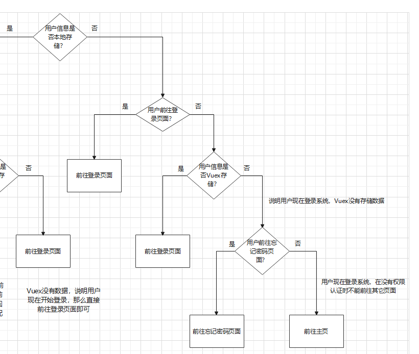

**1.Vue响应式原理是怎么实现的，从面向对象角度谈一谈？**

> （1）Observer类：负责监听数据变化。data对象以及其内部的每个对象都对应一个Observer实例。Observer实例化时通过Object.defineProperty递归地将对象方法设置为访问器方法getter和setter进行拦截。（2）Watcher类：负责依据监听到的数据变化做出响应。每个组件的data对象对应一个Watcher实例。（3）Dep类：负责收集Watcher依赖和通知Watcher数据发生变化。每个Observer实例中都有一个Dep类用于收集Watcher实例。Dep在getter中收集Watcher实例，在setter中通知Watcher实例做出响应。


**2.Vue响应式原理是如何处理数组的？**

>在Array.prototype上加一层原型，继承自Array.prototype，重写（1）push（2）pop（3）shift（4）unshift（5）reverse（6）sort（7）splice方法进行拦截。


**3.Vue2响应式原理有哪些缺陷，有什么解决方案？**

> Vue2响应式实现使用的Object.defineProperty()拦截能力差，不能拦截（1）通过下标修改数组元素（2）修改数组属性，例如array.length（3）添加或删除对象中的属性。Vue2只有针对（3）的解决方案，提供了set和delete方法来响应式添加和删除对象的属性。


**4.对MVVM和MVC的理解？**

> （1）MVVM指Model-View-ViewModel。Model层指组件中的JavaScript数据和逻辑，View层指组件中的模板或视图，ViewModel层指Vue.js框架。这三层的工作模式是：View发生变化时ViewModel自动通知Model更新，Model发生变化时ViewModel自动通知View更新。这样的好处是开发者可以将精力更多地关注Model层数据的变化，而不是操纵DOM。（2）MVC值Model-View-Controller。Model层指数据与逻辑，View层指视图，Controller层指控制器负责两层的通信。这三层的工作模式是：View发生变化时通知Controller选择Model更新，Model发生变化时手动操作DOM使View更新。这样的缺点是开发者除了关注Model层数据的变化外还要关注如何操作DOM更新View。


**5.双向数据绑定通过什么实现？**

> 双向数据绑定是指视图更新时数据自动更新，数据自动更新时视图自动更新。Vue响应式原理已经实现了数据更新时视图更新，视图更新时数据更新可以通过v-model实现。


**6.v-model实现原理是什么？**

> （1）例如v-model作用于input标签，相当于在input上监听input事件，并绑定value属性。当input事件触发时，用新输入的值更新绑定的value。（2）依据此思路，v-model可以作用于自定义组件。


**7.Vue模板编译过程是什么？**

> （1）选定的模板进入解析器，以栈的思想匹配标签，解析成AST，描述了代码的层级关系，AST每个节点描述了标签的内容（2）AST进入代码优化器，标记静态子树，例如纯文本节点，使其在虚拟DOM的Patch算法运行时不会被考虑（3）优化后的AST进入代码生成器，生成代码字符串，代码字符串用于传入渲染函数生成虚拟DOM


**8.Vue模板编译时同时出现el和template该如何选择？**

> （1）判断是否有el属性，有el属性调用$mount(el)挂载并判断是否有template属性。无el属性必须有手动调用$mount(el)挂载（2）判断是否有template属性，有template属性则选择template的模板编译，无template属性则选择el对应的模板编译。


**9.介绍一下Vue的每一个生命周期？**

> （1）beforeCreate周期：Vue实例创建并开始初始化
>
> （2）created周期：Vue实例完成初始化，实现响应式原理，data、props、watch、computed、methods可访问
>
> （3）beforeMount周期：完成模板编译准备开始挂载
>
> （4）mounted周期：挂载完成，可以访问DOM
>
> （5）beforeUpdate周期：更新前，虚拟DOM的patch算法运行完毕，判断出哪些节点要更新
>
> （6）updated周期：更新完毕，视图完成重新渲染
>
> （7）beforeDestroy周期：卸载之前
>
> （8）destroyed周期：卸载结束


**10.介绍一下Vue生命周期发生转变时的动作？**

> （1）beforeCreate->created：设置属性data、computed、watch、methods、props，实现响应式原理
>
> （2）created->beforeMount：模板编译，选择el或template的模板进行编译，生成渲染函数
>
> （3）beforeMount->mounted：模板挂载，生成DOM
>
> （4）mounted->beforeUpdate：更新前后虚拟DOM使用patch算法选择需要更新的节点
>
> （5）beforeUpdate->updated：视图更新渲染
>
> （6）updated->beforeDestroy：调用$destroy()函数
>
> （7）beforeDestroy->destroyed：$destroy()函数执行


**11.父子组件的生命周期是什么样的？**

> （1）创建时，父组件先初始化，然后子组件完成初始化和挂载，父组件再挂载
>
> > 父组件beforeCreate。父组件created。父组件beforeMount
> >
> > 子组件beforeCreate。子组件created。子组件beforeMount。子组件mounted
> >
> > 父组件mounted
>
> （2）更新时，子组件先更新，父组件后更新
>
> > 父组件beforeUpdate
> >
> > 子组件beforeUpdate。子组件updated
> >
> > 父组件updated
>
> （3）销毁时，子组件先销毁，父组件后销毁
>
> > 父组件beforeDestroy
> >
> > 子组件beforeDestroy。子组件destroyed
> >
> > 父组件destroyed


**12.异步请求通常放到哪个生命周期中？**

> 异步请求习惯放在created或mounted周期中。请求data数据的异步请求通常放在created周期中，放在mounted周期中会造成数据显示变慢。请求修改DOM的异步请求通常放在mounted周期中，放在created周期中需要使用Vue.$nextTick进行操作。


**13.Vue.$nextTick是什么，该如何使用？**

> Vue.$nextTick是将指定函数推迟到下次视图渲染之后执行。用法是Vue.$nextTick(function(){})或Vue.$nextTick().then(function(){})。如果想要在Vue生命周期的mounted之前操作DOM可以使用该函数。


**14.computed属性和watch属性的区别？**

> （1）computed计算属性指别人变化影响我，watch指我变化影响别人。
>
> （2）computed计算属性是一个未声明的属性，是一个函数返回计算值。watch监听属性是在data或props中已经存在的属性，是一个对象，handler(newVal, oldVal)函数表示变化时的操作，immediate表示组件第一次加载是否监听，deep表示是否对对象内部属性监听。
>
> （3）computed有缓存机制，参与计算的属性不变时，调用计算属性不会重复计算。watch没有缓存机制，watch表示监听属性变化后做出某种操作，不一定是计算操作，所以没有缓存。
>
> （4）computed不支持异步操作，计算属性函数返回同步值。watch支持异步操作，可以在数据变化后做异步操作。


**15.是否能用methods代替computed计算属性，为什么？**

> 可以用methods代替computed计算某些属性值。但是methods没有缓存机制，当参与计算的数据没有发生改变时多次使用计算值，会多次重复计算，使用computed不会有这种情况。


**16.父子组件通信的方法有哪些？**

> （1）props—$emit通信（2）$parent—$children通信。（3）$refs—ref通信。父组件可以通过$refs访问子组件，在子组件上需要用ref属性标明子组件的名称，父组件通过$refs.名称访问。


**17.兄弟组件通信的方法有哪些？**

> （1）事件总线通信。通过Vue提供的$on和$emit方法实现发布订阅模式，引入一个新的Vue实例作为发布订阅模式控制器。（2）Vuex通信


**18.如何解决爷孙组件通信？**

> （1）$attrs—$listeners通信。$attrs表示父组件绑定在子组件上的所有属性，$listeners表示父组件绑定在子组件上的所有监听器，子组件可以通过这两个属性将绑定内容传给孙子组件，不用再一个个写出绑定属性和绑定方法。（2）provide—inject通信。在父组件上设置provide属性提供哪些数据，在孙子组件上设置inject属性接收。


**19.子组件可以直接改变父组件中的数据吗？**

> 在Vue2中可以但不推荐，在Vue3中不可改变。父子组件应该维护单向数据流，否则数据流向在调试时会难以理解。子组件不应该直接修改props数据来修改父组件中数据。子组件可以通过$emit告知父组件修改props数据，或者使用便捷写法，即父组件在子组件上绑定props时在属性后添加.sync修饰符使子组件可直接修改props数据。


**20.为什么用虚拟DOM**？

> 虚拟DOM是为了解决数据驱动视图模式下的渲染问题。传统DOM操作繁琐，因此诞生了MVVM数据驱动视图的模式，使开发者只关注于数据的变化。在Vue1中采用高细粒度绑定，每个数据都有一个Watcher监听，数据变化后会精确更新DOM，但是Watcher太多效率低。在Vue2中采用中等细粒度绑定，每个组件有一个Watcher监听，数据变化后需要在组件中判断哪些DOM需要更新，而不是重新输出整个组件进行渲染。因此用虚拟DOM来判断组件中哪些节点需要更新。


**21.简述虚拟DOM的Diff算法？**

> （1）新旧虚拟DOM两个节点不同，进行替换。即使它们的子节点都相同，也不进行各层比较。
>
> （2）新旧虚拟DOM两个节点相同，一个有子节点，一个没有子节点。进行子节点添加或删除。
>
> （3）新旧虚拟DOM两个节点相同，都有子节点，进行子节点更新算法。


**22.简述虚拟DOM的优缺点？**

> （1）缺点：在静态页面或变化较少的页面中虚拟DOM速度比原生DOM慢，因为创建虚拟节点时额外的耗时操作。（2）缺点：在DOM操作可预测时，可以精确操纵并优化DOM操作，原生DOM比虚拟DOM更快，不需要虚拟节点创建和虚拟节点对比。（3）优点：在老的没有渲染队列的浏览器中，原生DOM操作会一个个执行，可能有无效渲染。虚拟DOM只关注最终结果进行一次DOM操作。


**23.列表渲染为什么最好加上key属性？**

> Vue会建立key和index的映射。在Diff算法进行子节点更新时，新虚拟DOM子节点可以通过映射在O(1)的时间内找到就虚拟DOM中对应子节点位置进行比较，不再需要循环嵌套寻找对应子节点，这样子节点更新的最坏时间复杂度是O(n)，提高了效率。


**24.条件渲染什么时候要加上key属性？**

> 条件渲染v-if，v-if-else，v-else在切换时Vue不会从头重新渲染元素，会尽可能保留相同部分提高渲染效率。如果不想保留相同部分，则给条件渲染元素绑定key属性，传入不同的值，这样会从头重新渲染。


**25.为什么不建议用列表渲染中的索引值index作为key属性的值？**

> 因为列表项顺序发生变化或列表发生添加删除时，index的值都会变化，建立的映射关系应该是不变的，否则会引起映射错误。这就类似于在数组顺序发生变化或数组元素发生添加删除时仍用index遍历数组会发生错误一样。


**26.了解Vue插槽吗？是做什么用的？**

> （1）插槽是Vue的内容分发机制，父组件将特定内容插入子组件中。
>
> （2）父组件通过template标签描述插入插槽的若干内容，子组件通过slot标签描述插槽。
>
> （3）插槽分为匿名插槽，具名插槽和作用域插槽。匿名插槽是子组件中只有一个slot标签描述插槽。具名插槽是子组件中有多个slot描述插槽，使用时要通过name和v-slot区分。作用域插槽是父组件能访问子组件内容，通过v-bind和v-slot绑定数据访问。


**27.Vue常用事件修饰符有哪些？**

> （1）.stop修饰符表示阻止事件冒泡（2）.prevent修饰符表示阻止原生事件发生但不阻止事件冒泡（3）.capture修饰符表示在事件冒泡前进行事件捕获（4）.self修饰符表示只有在当前元素触发事件才会触发监听器，不受事件冒泡影响。（5）.once修饰符表示多次触发事件只会触发一次回调


**28.mixins和extends是怎么用的？覆盖逻辑是什么样的？**

> （1）mixins和extends表示抽离组件公共逻辑，降低代码耦合度
>
> （2）mixins用法是混入一个数组，数组中有若干对象，每个对象的属性都是Vue实例的属性
>
> （3）extends用法是组合一个对象，对象的属性都是Vue实例的属性
>
> （4）对象属性不是钩子函数时，组件内部属性优先度高，发生冲突时组件内部数据覆盖对象数据。对象属性是钩子函数时，钩子函数会按传入顺序依次执行，最后执行组件内部钩子函数


**29.v-if和v-show的区别是什么？**

> （1）v-if指为true时创建组件，为false时卸载组件。
>
> （2）v-show指为true时渲染元素，为false时不渲染元素，通过控制display属性控制是否显示
>
> （3）元素频繁切换时用v-show好，v-if频繁渲染效率低下


**30.v-if和v-for为什么不推荐同时写在一个标签上？**

> （1）v-for优先程度高于v-if。会先创建列表节点，然后依次判断每个节点的v-if来判断是否显示，效率低下。
>
> （2）可以将v-if写在template标签上放在v-for标签的内部或外部解决该问题。


**31.v-html怎么使用？**

> （1）v-html属性绑定数据，作用于某标签，将数据替换该标签的子节点
>
> （2）v-html替换的内容不会经过Vue模板编译
>
> （3）v-html直接插入文档应提防XSS攻击


**32.什么是Vue自定义指令？**

> Vue自定义指令指“自定义可复用的操纵底层DOM的操作”。自定义指令通过directive注册，通过v-自定义指令名使用。编写Vue自定义指令时主要考虑bind，update，inserted钩子函数，分别表示指令绑定到元素时触发，组件虚拟DOM更新时触发，元素插入父元素时触发。


**33.mixins和extends的用法和覆盖逻辑是什么样的？**

> （1）mixins和extends表示抽离组件公共逻辑，降低代码耦合度。
>
> （2）mixins混入一个数组。数组中有若干对象，对象属性都是组件中的属性。
>
> （3）extends组合一个对象。对象属性都是组件中的属性。
>
> （4）如果属性不是钩子函数，那么组件中属性优先度高，发生冲突时优先组件中数据覆盖对象中数据。如果属性是钩子函数，那么按照传入的顺序依次执行，最后执行组件内钩子函数。


**34.组件中的过滤器如何使用？**

> （1）Vue3中取消了过滤器，过滤器通常用于数据格式规范化，用于v-bind或mustache语法
>
> （2）用法是变量后面跟上“| 过滤器函数名”，如何在组件中的filters属性中像设置methods一样设置过滤器函数


**35.template和jsx使用上有何不同？**

> （1）template中的模板需要先进行模板编译，然后将代码字符串传给渲染函数进行渲染。jsx是直接编写代码字符串传给渲染函数，不需要模板编译的流程。（2）template使用直观方便维护，jsx使用贴近底层更加灵活能更好处理交互问题。


**36.了解keep-alive吗？keep-alive如何使用？**

> keep-alive表示缓存组件，使组件切换时不用频繁创建销毁。使用keep-alive后组件生命周期变化，命中组件时触发activated钩子函数，切换组件时触发deactivated钩子函数。keep-alive可以在组件外嵌套，可以在router-view外嵌套，可以在路由配置项中配置。


**37.什么是路由懒加载？**

> 在加载路由配置文件时不引入路由页面的组件，等到使用时再引入，以便于减少文件下载大小。具体写法是component: () => import("") 


**38.路由hash和history模式有什么区别？**

> （1）hash模式和history模式URL不同，hash模式下URL路径之前有一个#，history没有。
>
> （2）hash模式和history模式下URL改变不会发起HTTP请求。
>
> （3）hash模式原理是监听haschange事件，根据hash值变化来切换页面。history模式原理是监听pushstate，popstate事件，使用history相关API，例如pushState来切换页面。
>
> （4）hash模式优点是hash值无效时不会切换页面，history缺点是路径无效时也会切换页面，需要在web服务器配置路径无效时返回特殊页面，或在路由配置项中用path:"*"匹配所有页面，使无效页面返回404。


**39.Vue路由中$route和$router有什么区别？**

> $router是全局路由对象，包含路由配置详细信息，通常调用方法来路由跳转。$route是当前路由对象。


**40.Vue路由跳转方法有哪些？**

> （1）router-link标签跳转（2）$router相关方法跳转，例如push，replace，forward，back，go等


**41.Vue路由传参方法有哪些？**

> （1）params传参。不配置路由信息。传参内容不拼接在URL上，刷新后内容丢失。
>
> （2）params传参。配置路由信息。传参内容拼接在URL上，刷新后内容不丢失。
>
> （2）query传参。不配置路由信息。传参内容以查询拼接在URL上，刷新后传参内容不会丢失。


**42.vue-router跳转和location.href跳转有什么区别？**

> （1）vue-router跳转是修改URL并切换页面，但不发起HTTP请求。
>
> （2）locatio.href跳转是修改URL并切换页面，发起HTTP请求。
>
> （3）history.pushState跳转是修改URL并切换页面，但不发起HTTP请求。


**43.什么是单页路由？**

> 单页路由指的是页面切换不发起HTTP请求，只修改URL。这样的好处是页面切换速度快，前后端分离便于开发。


**44.单页路由大致实现思路？**

> （1）history+pushState方法。pushState和popState方法只修改URL但不发起新的HTTP请求。（2）hash+监听haschange事件。在window上监听haschange事件，当监听到hash变化，那么切换页面。


**45.Vuex中actions和mutations的区别？**

> （1）使用区别：mutations中方法使用commit触发，actions中方法使用dispatch触发，方法内部必须调用commit触发mutations中方法。
>
> （2）同步异步区别：mutations中只支持同步操作来修改state数据，actions中支持异步操作来修改state数据。
>
> （3）执行顺序区别：mutations直接修改state数据，actions想修改state数据必须用commit触发mutations中方法修改state数据。


**46.为什么使用Vuex？**

> 用于解决多个兄弟组件通信问题。例如项目中用户登录信息需要被若干个组件共享。


**47.Vuex有哪些属性？**

> state基本数据，getters基于基本数据计算，mutations同步操作修改基本数据，actions异步操作修改基本数据，modules模块化基本数据集


**48.JavaScript有哪些数据类型？**

> 八种基本类型：Number，String，Boolean，BigInt，Symbol，Undefined，Null，Object


**49.数据类型检测有哪些方法？**

> （1）typeof判断八种类型，null被判断为object，函数被判断为function。
>
> （2）instanceof通过原型链判断引用类型。
>
> （3）constructor通过构造函数判断有构造函数的类型。
>
> （4）Object.prototype.toString.call().slice(8, -1)判断所有类型，自定义类型可以用[Symbol.toStringTag]修改返回值。


**50.判断数组的方法有哪些？**

> （1）Object.prototype.toString.call().slice(8, -1)判断
>
> （2）Array.isArray判断
>
> （3）instanceof原型链判断


**51.null和undefined的区别是什么？**

> （1）null和undefined都是原始类型，这两个原始类型下都只各有一个值null和undefined。
>
> （2）null是JavaScript保留字。undefined不是保留字，可以用作变量名，可以通过void 0安全获得undefined值。
>
> （3）null表示一个空对象，只有栈内存没有堆内存。undefined表示变量已声明但未赋值。
>
> （4）第一版JavaScript规定了存储数据的低三位用于类型判断，对象和null低三位都是0，在使用typeof时null会被误判为对象。undefined不会出现这种问题。
>
> （5）使用宽松相等判断null==undefined时会返回true，使用严格相等时会返回false。


**52.typeof null 的结果为什么是object？**

> 第一版JavaScript规定数据存储中低三位用于数据类型判断，object低三位为000，null所有位都是0。并且typeof以此判断数据类型，因此null会被误判为object。


**53.instanceof该如何实现?**

> instanceof先判断变量是否是对象，如果是对象则沿着原型链一直查找，是否有目标原型。
>
> ```javascript
> function imitateInstanceof(left, right) {
>  // 开启尾调用优化条件
>  "use strict";
> 
>  // 检查右值是否有[Symbol.hasInstance]属性
>  if (right && !right[Symbol.hasInstance])
>      throw new TypeError("类型检查函数的第二个参数必须是类")
> 
>  // 如果左值不是引用类型，那么不存在原型链，直接返回false
>  if(!left || left && typeof left !== "object" && typeof left !== "function")
>      return false
> 
>  // 初始值设置
>  // 如果getPrototypeOf传入一个原始类型，那么会经历装箱，变成引用类型来寻找原型链，所以之前必须检查left是否是原始类型
>  let leftProto = Object.getPrototypeOf(left)
>  let rightProto = right.prototype;
> 
>  // 使用尾调用优化
>  return (function check() {
>      if(!leftPrototype)
>          return false
>      else if(leftPrototype === rightPrototype)
>          return true
>      else {
>          leftPrototype = Object.getPrototypeOf(leftPrototype)
>          return check()
>      }
>  })();
> }
> ```


**54.为什么0.1 + 0.2 ！= 0.3，如何让其相等？**

> JavaScript的数值类型使用IEEE754 64位标准存储，0.1和0.2不能二进制小数被精确表示，因此相加不为0.3。解决方法：（1）调用toFixed函数四舍五入变成字符串，然后再转化为数值。（2）把小数运算变成整数运算，同乘10.


**55.如何安全获得undefined值？**

> void 0。void后跟一个表达式但是不返回值，因此void 0的结果是undefined。


**56.引用类型到基本类型的转化规则是什么？**

> （1）偏数值算法：先调用valueOf若失败再调用toString（2）偏字符串算法：先调用toString若失败再调用valueOF。（3）无偏好算法：可以通过[Symbol.toPrimitive]改写原始偏好算法。在JavaScript中除了Date是偏字符串算法之外都是偏数值算法。


**57.其它类型到布尔类型的转化规则是什么？**

> 真值转化为true，假值转化为false。假值只有7个是0，-0，NaN，“”，undefined，null，false会转化为false，其余都会转化为true。


**58.其它类型到字符类型的转化规则是什么？**

> （1）基本类型都是直接转换，即加上双引号。
>
> （2）数组比较特殊，空数组转换为空串；只含一个数值的数值转换为该数值字符；其它形式的数组都按join(",")方法转化。
>
> （3）引用类型按偏好算法转换。


**59.其它类型到数值类型的转化规则是什么？**

> （1）null转化为0，undefined转化为NaN，false转化为0，true转化为1，Symbol无法转化为数值，String数值字符串转化为数值其它转化为NaN。
>
> （2）引用类型按偏好算法转换。


**60.如何进行隐式类型转换？**

> 隐式类型转换可以理解为不调用类型转换函数的转换。例如使用运算符隐式转换。
>
> （1）一元操作符+或-：表示正负数。转化为数值。
>
> （2）二元操作符+或-：表示加减运算。如果存在字符串那么都转化为字符串，否则都转化为数值。
>
> （3）二元操作符*或/：表示乘除运算。转化为数值。
>
> （4）二元操作符==或!=：表示宽松相等。除了null和undefined外，都转化为数值。
>
> （5）二元操作符>或<或>=或<=：表示比较。如果存在字符串那么转化为字符串，否则都转化为数值。
>
> （6）一元操作符!!：表示两次取反。转化为布尔值。


**61.||和&&操作符返回值是什么？**

> 与和或操作符会根据两边真值假值进行运算。与操作符只有操作符两侧都是真值才会返回操作符后的表达式结果，否则返回假值对应表达式结果。或操作符只有操作符两侧都是假值才会返回操作符后的表达式结果，否则返回真值对应表达式结果。


**62.Object.is()和==和===都是判断相等，有什么区别？**

> ==是宽松相等，比较前会做类型转换，除了null和undefined，会转化为数值再比较。===是严格相等，比较前不会做类型转换。Object.is(val1, val2)是经过修改的严格相等，+0和-0相等，NaN和NaN相等。


**63.isNaN函数和Number.isNaN函数的区别？**

> isNaN在判断时会先做类型转换，转换为数值再判断是不是NaN。Number.isNaN不会做类型转换。


**64.什么是JavaScript装箱和拆箱？**

> 装箱是基本类型到引用类型。指JavaScript基本类型没有方法，想要访问方法需要先使用基本类型工厂函数包装为引用类型才能访问方法。拆箱是引用类型到基本类型，可以通过valueOf和toString方法拆箱。


**65.为什么会有BigInt提案？**

> JavaScript数值采用IEEE754 64位标准存储，尾数52位，表示的最大整数精度是16位。用超过16位的整数进行科学计算会丢失精度，因此提出BigInt提案扩展计算精度。


**66.你有使用过ES6的什么内容？**

> （1）新的数据类型：Symbol用于call实现中给对象添加一个不重复属性。BigInt用于解决机器学习问题。
>
> （2）解构：机器学习函数参数比较多，利用解构描述形参，解构传参可以不按照变量顺序传参。解构提取深层嵌套对象中的内容。
>
> （3）三点运算符：作为其余运算符，扩展运算符，Object.assign的简写。
>
> （4）Promise异步编程：fetch发起网络请求。


**67.const和let的区别？**

> （1）const声明变量必须赋初始值。
>
> （2）const声明变量栈内存指针不能修改。


**68.let/const和var的区别？**

> （1）作用域不同。let/const是块级作用域，var是函数作用域。
>
> （2）变量提升和暂时性死区。var声明的变量在声明前可以使用，但是值为undefined。let/const声明的变量在声明前不能使用。
>
> （3）重复声明。var声明的变量可以重复声明，后声明的覆盖先声明的。let/const声明的变量不能重复声明。


**69.箭头函数和普通函数的区别？**

> （1）箭头函数的this继承自函数作用域，且不能被其它方法修改。普通函数的this要视情况而定，默认指向全局对象globalThis；作为对象方法时指向对象；可以被call，apply，bind修改。
>
> （2）箭头函数由于this不可被修改，因此不可作为构造函数。普通函数可以作为构造函数。
>
> （2）箭头函数没有Prototype，普通函数有Prototype。
>
> （3）箭头函数没有自己的arguments，普通函数有arguments。


**70.三点运算符如何使用？**

> 三点运算符可以作为“扩展运算符”或“其余运算符”或“Object.assign简写形式”
>
> （1）其余运算符。例如：函数定义式参数带有扩展运算符，表示传入实参时可以传递多个，被收集成一个数组。
>
> （2）扩展运算符。作为扩展运算符时，对可迭代对象使用三点运算符都会调用迭代器方法。例如：解构声明变量时配合扩展运算符可以声明数组；console.log中使用扩展运算符可以直接遍历可迭代对象；在中括号中对可迭代对象使用扩展运算符可以进行浅拷贝。
>
> （3）Object.assign简写形式。例如：用于对象浅拷贝，在{}中使用三点展开对象，效果同Object.assign且不会调用迭代器方法。


**71.谈谈对解构的理解？**

> 解构是一种针对性提取数据的方法。
>
> （1）数组解构是按照下标解构，对象解构是按照属性解构
>
> （2）解构可以方便地提取深层嵌套对象中的数据。函数参数过多时记不住顺序可以使用使用解构。
>
> ```javascript
> // 数组解构
> let [a, b, c] = [1, 2, 3] // a = 1, b = 2, c = 3
> 
> // 对象解构
> let obj = {
>  name: "Danny",
>  gender: "man"
> }
> // ES6增强型对象写法
> let { name, gender } = obj
> // 对象解构普通写法，属性值用于存储提取出来的数据，属性名要和原对象属性名相同
> let { name: name2, gender: gender2 } = obj
> 
> // 深层对象嵌套
> let obj = {
>  event: {
>      target: {
>          result: "Danny"
>      }
>  }
> }
> let { event: { target: { result } } } = obj
> console.log(result)
> 
> // 函数参数
> function linearRegression({theta, Y, X, alpha = 0.5, iter =10000}) {
>  // 略
> }
> 
> let theta = []
> let X = []
> let Y = []
> 
> // 调用时只需要直到有哪些参数即可，不需要考虑它们的顺序
> linearRegression({theta: theta, X: X, Y: Y})
> ```


**72.new操作符实现原理是什么？**

> （1）创建一个空对象（2）绑定构造函数的this指向该对象（3）绑定该对象的prototype指向构造函数的原型（4）判断构造函数返回值类型，如果是引用类型则返回引用类型，如果是基本类型则返回该对象


**73.Map和Object的区别是什么？**

> （1）Map中默认不包含键，Object中默认包含原型链上的键（2）Map中键可以是任意类型，Object中键只能是String或Symbol类型（3）Map中的键是依据插入顺序的，Object中的键无序（4）Map中键的个数可以用size获取，Object中的键的个数不能直接获取。（5）Map是可迭代对象，Object必须有迭代器协议才能迭代。（6）Map对频繁增删键值对情景有优化，Object对频繁增删键值对情景无优化


**74.Map是怎么实现的？**

> Map其实就是通过键快速查找到值，实现Map其实就是实现高效查找算法。C++中Map的实现有红黑树实现，不论是添加还是删除都能不超过3次旋转维护红黑树性质，哈希实现，平均复杂度在O(1)。


**75.Map和WeakMap的区别？**

> （1）Map中键可以是任意类型，WeakMap中键只能是引用类型（2）Map中键值对是强引用，Map外不再引用时不能被回收。WeakMap中键值对是弱引用，WeakMap外不再引用时，可以被垃圾回收。


**76.对前后端交换信息的JSON的理解？**

> （1）JSON是一种基于文本的轻量级数据交换格式，也是JavaScript语法的子集。
>
> （2）JSON中字符串都要求使用双引号，非字符串有true，false，null，数值。
>
> （3）JSON通常表示成数组或对象的形式。


**77.对JavaScript内置对象JSON的理解？**

> （1）JSON对象负责JavaScript对象和JSON格式对象的转换。stringify函数表示将JavaScript对象转换为JSON格式对象的字符串形式。parse函数表示将JSON格式对象的字符串形式转换为JavaScript对象。（2）JSON可以用来做对象深拷贝，但是无法深拷贝JavaScript内置对象和循环引用，但是可以给stringify的第二个参数传一个处理函数，复制属性时用WeakMap记录，如果某个键已经存在，则不再拷贝，用于解决循环引用问题。


**78.JavaScript脚本延迟加载的方法有哪些？**

> （1）defer属性：script标签会在html解析完成后再执行，不阻塞html解析。
>
> （2）async属性：async属性必须添加http请求的URL，表示该脚本异步请求，不阻塞html解析。
>
> （3）动态创建DOM：监听DOMContentLoaded事件，html加载完成后动态插入script标签。
>
> （4）宏任务队列：可以将脚本内容放入setTimeout中等html解析完后执行。
>
> （5）放置到文档底部：将script标签放到文档底部，不阻塞html解析。


**79.什么是类数组对象？**

> 拥有length属性和若干索引属性的对象是类数组对象，例如函数参数的arguments，获取若干DOM元素返回的结果。


**80.如何将类数组对象转化为数组对象？**

> （1）Array.from方法中传入类数组对象
>
> （2）通过原型调用Array方法。slice或splice或concat（与空数组拼接）。将类数组对象传入其中。


**81.说一说数组常用原生方法？**

> （1）归并方法：reduce(归并函数，初始值)。
>
> （2）首尾操作方法：push，pop，shift，unshift
>
> （3）查找方法：indexOf，lastIndexOf，includes
>
> （4）排序方法：sort，reverse
>
> （5）扁平化方法：flat，flatMap
>
> （6）截取方法：slice
>
> （7）拼接方法：concat
>
> （8）增删元素方法：splice
>
> （9）字符串方法：toString，join
>
> （10）迭代方法：forEach，map，filter，every，some


**82.知道数组slice方法吗，怎么使用？**

> （1）slice是数组截取函数。
>
> （2）slice接收两个参数，第一个参数表示开始截取位置，包含，第二个参数表示截取结束位置，不包含。不传第二个参数默认截取到数组尾部。第二个参数可以为负数，表示从数组尾部向前的位置。
>
> （3）slice返回一个新数组


**83.知道数组splice方法吗，怎么使用？**

> （1）splice是数组添加删除函数。
>
> （2）splice可以接收两个参数，第一个参数表示开始删除位置，第二个参数表示从这个位置开始删除多少个元素。splice可以接收超过两个参数，表示删除完后再添加若干元素。
>
> （3）splice修改原数组


**84.数组方法map和filter方法有什么区别？**

> （1）返回值不同。map的处理函数依据原数组元素返回一个新值。filter的处理函数以及数组元素返回true或false。
>
> （2）返回数组长度不同。map返回一个新数组和原数组长度相同，对每个元素都做了映射。filter返回一个新数组和原数组长度不一定相同，filter不会处理undefined元素，会抛弃返回值为false的元素。


**85.数组扁平化怎么实现？**

> 数组扁平化函数flat返回一个新数组。设计递归实现数组扁平化，递归函数参数是数组和扁平次数，递归方程是遍历当前数组每个元素，如果当前需扁平次数大于零且当前元素为数组，那么对调用扁平化函数对该数组扁平化，否则将元素加入新数组。
>
> ```javascript
> function flat(ar, num) {
>  let br = [];
>  (function work(ar, num) {
>      let len = ar.length
>      for(let i = 0; i < len; i ++) { // 递归方程是判断扁平化数量是否大于零，如果大于零且遇到数组，那么就进行扁平化，否则加入新数组
>          if(Array.isArray(ar[i]) && num)
>              work(ar[i], num - 1)
>          else
>              br.push(ar[i])
>      }
>  })(ar, num);
>  return br
> }
> 
> let ar = [1, 2, [1, 2, [3, 4, 5]], [1, 2, [3, 4, 5]]]
> console.log(flat(ar, 0))
> ```


**86.flatMap方法怎么使用？**

> flatMap方法结合了map和filter方法。flatMap是先进行映射再进行一次数组扁平化。flatMap可以用于过滤，如果某个元素映射值为空数组，那么扁平化时将会过滤掉该元素。


**87.数组方法中哪些方法会修改原数组？**

> （1）首尾修改方法push，pop，shift，unshift
>
> （2）排序方法sort，reverse
>
> （3）添加删除方法splice


**88.什么是AJAX？如何实现AJAX？**

> AJAX是不刷新页面就可以发起网络请求来更新页面。
>
> 实现AJAX：
>
> （1）创建一个XMLHttpRequest对象。
>
> （2）在该对象上创建Http请求，配置基本信息。
>
> （3）设置回调函数，监听XMLHttpRequest对象状态。readyState为4时正常，status为服务器返回的状态码。
>
> （4）发送Http请求。
>
> ```javascript
> // 1.创建对象
> let xhr = new XMLHttpRequest();
> 
> // 2.创建Http请求
> xhr.open("GET", "/api/test");
> // 2.配置基本信息
> xhr.responseType = "json"
> xhr.setRequestHeader("Accept", "application/json")
> 
> // 3.设置回调函数监听
> xhr.onreadystatechange = function() {
>  if (this.readyState ! == 4)
>      return;
>  if (this.status == 200) 
>      handle(this.response)
>  else
>      console.log(this.statusText)
> }
> 
> // 3.设置回调函数监听
> xhr.onerror = function() {
>  console.log(this.statusText)
> }
> 
> // 4.发送Http请求
> xhr.send(null)
> ```


**89.fetch如何使用？**

> ```javascript
> fetch("/api/test", {
> 	headers,
> 	method,
> 	body
> }).then(res => {
>  if(res.status == 200)
>      return res.text()
>  else
>      throw "error"
> }).then(ans => {
>  return ans
> }).catch(error = {
> 
> })
> ```


**90.fetch和XMLHttpRequest发起网络请求有什么区别？**

> （1）fetch最初不支持终止网络请求，现在可以用AbortController类终止Promise请求。XHR可以终止网络请求。
>
> （2）fetch默认不携带cookie，如果使用需要手动添加。XHR默认携带cookie。
>
> （3）fetch无法监听网络请求上传进度，XHR可以监听网络请求上传和下载进度。


**91.什么是尾调用优化？**

> 尾调用优化指提前让执行上下文出栈来降低空间复杂度。尾调用优化只能在严格模式下开启。尾调用优化情景是当前函数返回值和父级函数返回值相同，那么先让父级执行上下文出栈。


**92.ES6模块和CommonJS模块的异同？**

> （1）区别：ES6是对模块引用，CommonJS是对模块浅拷贝。ES6可以修改模块中内容，但是指向模块的指针不能修改，类似于const。CommonJS可以修改模块中的内容，也可以修改指向模块的指针。（2）共同点：ES6和CommonJS都可以修改引用的对象的内部值。


**93.常见DOM选择节点操作有哪些？**

> （1）document.getElementById。document.getElementsByClassName。document.getElementsByTagName。
>
> （2）document.querySelect。document.querySelectAll.


**94.常见DOM添加节点操作有哪些？**

> （1）element.append添加到孩子的末尾，element.prepend添加到孩子的开头。
>
> （2）element.after添加到自己后面，element.before添加到自己前面。


**95.常见DOM删除节点操作有哪些？**

> （1）element.remove删除自己
>
> （2）element.replaceWith替换自己


**96.谈一谈严格模式下熟悉的限制？**

> （1）不能有with，以提高解释器优化效率
>
> （2）变量必须先声明后使用
>
> （3）不能delete prop，只能delete global[prop]
>
> （4）禁止this指向全局对象


**97.for in和for of的区别？**

> （1）for of是ES6新提出的，根据迭代器协议遍历对象键值对。
>
> （2）for in是遍历对象键。for in会遍历原型链上所有可枚举属性。


**98.如何用for of迭代对象？**

> 给对象添加迭代器协议。迭代器协议函数返回一个对象，对象中有一个next方法，next方法返回一个对象{value：，done：}，当done为true时迭代结束。
>
> ```javascript
> let obj = {
>  a: 1, b: 2, c: 3
> }
> 
> obj[Symbol.iterator] = function() {
>  let keys = Object.keys(this)
>  let length = keys.length, cnt = 0
>  return {
>      next() {
>          if(cnt < length)
>              return { value: { key: keys[cnt], value: obj[keys[cnt ++]]}, done: false}
>          return { value: undefined, done: true }
>      }
>  }
> }
> 
> for(let { key, value } of obj)
>  console.log(key, value)
> ```


**99.描述一下原型链的指针关系？**

> （1）对象的\_\_proto\_\_属性指向原型对象。
>
> （2）原型对象的constructor指向构造函数，\_\_proto\_\_属性指向自己的原型对象。
>
> （3）构造函数的prototype属性指向原型对象，\_\_proto\_\_指向函数的原型对象。
>
> 注：一个对象深究，用两条原型链来描述，如下
>
> 


**100.原型链的终点是什么？**

> 原型链的终点是null而不是某一个对象


**101.如何获得对象非原型链上的属性？**

> 用for in遍历对象所有属性，用hasOwnProperty来判断是不是非原型链属性


**102.修改原型时该注意什么？**

> 修改原型尽量修改原型内部属性。如果重写原型，那么之前的对象的原型指针不能指向最新的原型对象。


**103.谈谈对闭包的理解？**

> 闭包是一种机制，即用函数声明时的作用域和函数内部变量解析函数的机制是闭包机制。闭包机制通常表现形式是，一个函数内部声明另一个函数，内函数访问并持有外函数变量的引用。


**104.什么是执行上下文？**

> JavaScript代码执行时的环境。执行上下文分为全局执行上下文和函数执行上下文。每个函数执行前都会创建自己的执行上下文环境并压入执行上下文栈，执行完毕时出栈。


**105.执行上下文创建过程是什么样的？**

> （1）绑定this。普通函数的this指向全局对象；箭头函数this的指向和所在函数作用域中的this指向相同；普通函数被作为对象方法调用时this指向对象；构造函数中this指向新创建的对象；apply，call，bind改变this的指向。
>
> （2）创建词法环境。词法环境记录了函数的外部作用域，记录了函数相关参数如name，prototype，arguments
>
> （3）创建变量环境。先找var声明的变量加入变量环境，属性值为undefined；找let和const变量声明的变量加入变量环境，属性值为未初始化不可访问；将实参值带入，形参属性值为实参值。将声明式函数加入变量环境，属性值为函数本身。


**106.改变this指向操作的优先级是什么？**

> this默认指向全局对象，有四种改变this指向的方法，分别为函数调用；对象方法调用；构造函数调用；call，apply，bind调用。改变this的优先程度是（1）构造函数调用（2）call，apply，bind调用（3）对象方法调用（4）函数调用


**107.call和apply的区别是什么？**

> call和apply只有使用形式上的区别。call接收若干个参数，第一个参数指定this指向，后续参数指定传入参数。apply接收两个参数，第一个参数指定this指向，第二个参数是数组，指定传入参数。


**108.call，apply如何实现？**

> （1）call，apply实现思路是让函数作为绑定的this对象的属性来调用，为了避免属性冲突可以使用Symbol作为属性。（2）call，apply也可以使用ES6中的代理对象实现。
>
> ```javascript
> // call的精简版实现，不考虑类型检查等问题
> Object.prototype.$call = function(tar, ...args) {
>  let prop = Symbol("call")
>  tar[prop] = this
>  let res = tar[prop](...args)
>  delete tar[prop]
>  return res
> }
> 
> // ES6的Proxy实现
> Object.prototype.$call = function(tar, ...args) {
>  return new Proxy(this, {
>      apply(target, thisArg, argArray) {
>          return Reflect.apply(target, tar, args)
>      }
>  })(...args)
> }
> ```


**109.bind如何使用？**

> bind接收若干个参数，第一个参数表示绑定函数中的this，后续若干个参数表示给函数传入初始参数。调用bind后返回一个新函数为绑定后的函数，bind不影响原函数。


**110.bind如何实现？**

> bind的实现是返回一个未执行的函数，用于接收bind未接收到的参数。该函数内部返回原函数调用call绑定this和参数的结果。
>
> ```javascript
> // bind实现精简版
> Object.prototype.$bind = function(tar, ...args) {
>  let that = this
>  return function Fun(...restArg) {
>      return that.call(tar, ...args, ...restArg)
>  }
> }
> ```


**111.使用异步编程有什么好处？**

> （1）便于解决回调函数多层嵌套不易理解的问题。例如多个异步操作必须依次执行，使用回调函数编写，必须回调函数中嵌套回调函数，不易于理解，使用Promise或async/await异步编程可以线性表示非线性逻辑，代码便于理解和维护。
>
> （2）便于解决回调函数嵌套错误不易传给顶层函数的问题。使用Promoise编写异步代码用catch容易解决。


**112.Promise如何实现？**

> （1）构造函数：传给Promise的函数立即执行，Promise把自己的resolve方法和reject方法传给该函数。
>
> （2）then方法：（2.1）接收解决回调函数和拒绝回调函数。如果当前Promise实例处于等待态，那么将回调函数加入回调函数队列，Promise维护回调函数队列是因为一个Promise实例可以用then注册若干回调函数。如果当前Promise已经解决或拒绝，那么依据PromiseA+标准，等到JavaScript主程序执行完后再执行回调函数，V8引擎是让回调函数在微任务队列执行。（2.2）除了对回调函数的处理，then还会立即返回一个Promise实例，会以兑现回调函数的返回值兑现或以拒绝回调函数的拒绝值拒绝。
>
> （3）resolve和reject方法：（3.1）resolve和reject方法会维护Promise有限状态自动机，Promise的状态只能由pending到fulfilled或rejected，不能逆向转变或多次由pending转变。（3.2）如果解决值或拒绝值不是Promise实例，那么会立即修改Promise实例状态转为解决或拒绝，并依次执行回调函数队列中的函数。（3.3）依据PromiseA+规范，如果解决值或拒绝值时Promise实例，那么当前Promise实例仍处于等待态，知道该Promise实例解决或拒绝时才解决或拒绝。此时只需要给解决值或拒绝值通过then方法注册回调函数，当它解决或拒绝时通知当前Promise实例即可。
>
> ```javascript
> // 精简版Promise实现，不考虑类型检查和异常处理
> class Promise {
>  status = "pending"
>  value
>  reason
>  onFulfilledCallback = []
> 	onRejectedCallback = []
> 	constructor(func) {
>      func(this.resolve.bind(this), this.reject.bind(this))
>  }
> 
>  resolve(value) {
>      if(this.status != "pending")
>          return
>      if(value instanceof Promise)
>          value.then(this.resolve.bind(this), this.reject.bind(this))
>      else {
>          this.value = value
>          this.status = "fulfilled"
>          this.onFulfilledCallback.forEach(onFulfilled => onFulfilled(value))
>      }
>  }
> 
>  reject(reason) {
>      if(this.status != "pending")
>          return
>      if(reason instanceof Promise)
>          reason.then(this.reject.bind(this), this.reject.this)
>      else {
>          this.reason = reason
>          this.status = "rejected"
>          this.onRejectedCallback.forEach(onRejected => onRejected(reason))
>      }
>  }
> 
>  then(onFulfilled, onRejected) {
>      let that = this
>      return new Promise((res, rej) => {
>          if(that.status == "pending") {
>              that.onFulfilledCallback.push(value => res(onFulfilled(value)))
>              that.onRejectedCallback.push(reason => rej(onRejected(reason)))
>          } else if(that.status == "fulfilled")
>              queueMicrotask(() => res(onFulfilled(that.value)))
>          else
>              queueMicrotask(() => rej(onRejected(that.reason)))
>      })
>  }
> }
> ```


**113.Promise.all和Promise.race的区别？**

> Promise.all和Promise.race都是接收一个数组。Promise.all等到所有Promise解决再返回一个数组，存储所有解决值，或者等到第一个Promise被拒绝，返回拒绝值。Promise.race返回第一个解决或拒绝的Promise的解决或拒绝值。


**114.Promise.any方法如何使用？**

> Promise.any接收一个数组，包含若干个Promise实例。返回第一个解决的Promise实例。


**115.Promise.allSettled方法如何使用？**

> Promise.allSettled方法接受一个数组，包含若干个Promise实例。等到所有Promise解决或拒绝后，返回所有Promise的解决值或拒绝值。


**116.async和await如何使用？**

> （1）await只能在声明时前面加上async的函数中使用。await等待Promise，await表达式的值是Promise的解决值或拒绝值。await会阻塞函数内后续操作。
>
> （2）声明时前面加上async的函数返回值是一个Promise，如果函数内部返回Promise那么async返回的Promise就是该Promise，否则返回一个已经解决的Promise，解决值是函数返回值。


**117.如何创建对象？**

> 主要三大类方法，其它方法大同小异。
>
> （1）工厂函数：直接调用函数创建一个对象，然后给对象添加属性和方法。缺点是方法无法复用
>
> （2）构造函数：new调用函数创建对象，对象方法设置在构造函数的原型上，做到方法复用
>
> （3）对象字面量创建：直接用大括号定义对象


**118.如何实现对象继承？**

> （1）函数实现对象继承，（1.1）子构造函数中调用父构造函数创建父对象，this指向该对象。（1.2）子构造函数的原型用Object.create传入父构造函数的原型来创建。
>
> （2）JavaScript自带函数实现，Object.create传入一个对象，作为新对象的原型，只是简单继承了原型上的属性。
>
> （3）ES6的类继承


**119.垃圾回收有哪些方式？**

> （1）引用计数。针对每个引用类型，都会有一个引用次数计数器，当计数器为0时立即垃圾回收。当引用赋值为null或执行上下文出栈时，引用次数会减一。优点是：能实时垃圾回收。缺点是：无法回收循环引用的情况。
>
> （2）标记清理。垃圾回收程序运行时，遍历所有引用类型，打上待清理的标记。再次遍历所有引用类型，如果当前执行栈中还能访问到某些对象，那么清楚标记。遍历结束后清理所有有标记的对象。优点：能解决循环引用问题。缺点：容易造成内存碎片化。
>
> （3）标记整理。在标记清理基础上多一步对碎片化内存整理，整理成连续内存。优点：不存在内存碎片化。缺点：时间开销大。
>
> （4）复制回收。在内存开辟两片相同区域，分为to和from。比如先在from中存储数据，当from中数据满时，将执行栈中能访问到的数据加入to区，然后清理from区，最后交换to和from区的内容。
>
> （5）增量回收。使得垃圾回收程序能和主程序并行进行（时间片上交替）。


**120.既然了解垃圾回收，那么怎样合理使用内存？**

> （1）对象不使用时赋值为null。变量不使用时赋值为null，能提前对象被垃圾回收的时间。
>
> （2）使用块级作用域。块级作用域最晚被销毁后会进行垃圾回收，如果用var声明对象，那么是函数作用域，最晚在函数运行完毕时才会垃圾回收。
>
> （3）考虑隐藏类。用构造函数创建对象时，JavaScript默认它们属于同一个类，如果再次添加删除对象属性的话，JavaScript会认为该对象属于一个新类，会新创建一个类消耗内存。所以要考虑隐藏类，使用严格的面向对象技术。
>
> （4）合理使用闭包。内函数持有外函数对象的引用，但可能仅需要使用其中某一个属性，那么内函数只需要引用该属性即可。例如内函数引用了外函数中获取的DOM对象，但只使用其id。那么只用新创建一个变量赋值一下id即可存储在栈内存，这样就释放了对DOM对象的引用。


**121.V8引擎如何进行垃圾回收？**

> （1）将内存分为新生代和老生代，新生代较小，又分为to区和from区。先在from区存储，当from区满时，将所有执行栈能访问的对象都移入to区。
>
> （2）如果to区使用率超过25%，则判断这些对象是否经过一轮垃圾回收，如果经历过，则加入老生代，否则加入to区。完成后清理from区，交换from和to。
>
> （3）老生代不时进行标记清理和标记整理垃圾回收。


**122.V8引擎编译器怎样进行优化？**

> V8使用JIT优化。如果发现某段代码运行次数过多，例如for循环中的语句，那么就会给该语句打上warm标记，交给基线编译器对该代码编译提升运行速度。由于JavaScript是弱类型语言，变量类型不确定，因此基线编译器会编译变量取不同类型的所有情况。如果某段代码执行次数更多，那么就会打上hot标记，交给优化编译器处理，优化编译器不会编译变量取所有类型的情况，而是从中推测一种最有可能发生的情况进行编译。如果优化编译器推测失败次数过多，那么会回退到基线编译器，回退次数过多时不会再开启优化编译器。


**123.JavaScript的事件循环是怎么工作的？**

> （1）事件循环的作用是提供异步编程机制，不阻塞JavaScript主线程。
>
> （2）WhatWG规定了事件循环中有两个队列。一个是task queue，是通常讲的宏任务队列，宏任务队列中包含若干子任务队列，例如setTimeout队列，网络IO回调函数队列等等。一个是microtask queue，是通常讲的微任务队列，不包含子任务队列。实际上它们由set实现，JavaScript中set是有顺序的。
>
> （2）WhatWG规定了任务队列的执行顺序是先执行宏任务队列，每执行完其中一个子任务队列就执行微任务队列，执行完微任务队列进行UI渲染，最后执行下一个宏任务子队列。WhatWG规范将JavaScript主程序当做宏任务。


**124.JavaScript中有哪些宏任务哪些微任务？**

> 宏任务：WhatWG中将JavaScript主程序和UI渲染看做宏任务，setTimeout，setInterval，setImmediate（仅在IE浏览器中IE10以上支持），IO操作的回调函数。
>
> 微任务：Promise.then，catch，finally中回调函数的执行，queueMicrotask，MutationObserver


**125.浏览器中有哪些事件模型？**

> （1）DOM0级事件模型。没有事件冒泡和事件捕获。不支持事件监听器。兼容所有浏览器。只能在标签上或通过js添加事件处理函数。
>
> （2）IE事件模型。没有事件捕获。不支持事件监听器，但是有attchEvent和detachEvent实现类似功能。在IE9以下浏览器工作。
>
> （3）DOM2级事件模型。W3C中DOM1级未定义事件相关内容。有事件捕获和事件处理和事件冒泡。支持事件监听器。在IE9及以上版本支持DOM2级事件模型。


**126.什么是事件捕获和事件冒泡？**

> 事件捕获是事件发生时从document传向事件触发处。之后进行事件处理。事件处理完之后事件从事件触发处传向document。


**127.如何阻止事件冒泡？**

> 普通浏览器：event.stopPropagation
>
> IE浏览器：event.cancelBubble = true
>
> Vue：.stop事件修饰符


**128.如何进行事件捕获？**

> 在addeventListener的第三个参数中配置capture为true


**129.什么是事件委托？**

> 事件委托是利用事件冒泡机制，让子元素上发生的事件被父元素监听。使用事件委托可以用于监听大量子元素事件，避免在每个子元素上都注册监听器来减少内存消耗。使用事件委托可以用于监听动态元素，频繁添加删除元素可能会频繁添加删除事件监听器，使用事件委托可以不用频繁添加删除子元素的事件监听器。


**130.什么是浏览器同源策略？**

> 脚本只能与脚本所在文档同源的资源进行交互，只是浏览器安全策略。


**131.有哪些跨域方法？**

> （1）代理服务器跨域。
>
> ​	（1.1）在项目中网络请求的发起的URL都是路径形式不带有域名。
>
> ​	（1.2）在开发时在vue.config.js中配置代理服务器反向代理地址，由自带的nodejs提供代理服		务器功能。
>
> ​	（1.3）在项目部署时使用nginx作为代理服务器，配置反向代理地址proxy_pass。
>
> ```nginx
> server {
> listen       80;
> server_name  localhost;
> location / {
>   root   /usr/share/nginx/html;
>   index  index.html index.php;
> 
> }	
> location /api {
>   proxy_pass http://39.96.175.246:8051/api;                           
> }	
> }
> 
> ```
>
> 
>
> （2）CORS跨域。
>
> （2.1）对于简单请求：HEAD，GET，POST并且是简单请求头。在客户端请求头中携带Origin字段，表明当前源。在服务端响应头携带Access-Control-Allow-Origin字段，表明允许跨域的地址。
>
> （2.2）对于非简单请求：DELETE，PUT请求，或非简单请求头的简单请求。在客户端请求头中携带Origin字段，表明当前源。此时客户端会先发起预检请求，即preflight请求，请求方法是OPTIONS。在服务端响应头携带Access-Contorl-Allow-Origin字段，表明允许跨域的地址。Access-Control-Allow-Methods字段，表明跨域请求允许的方法。Access-Control-Allow-Headers字段，表明跨域请求允许的非基本请求头属性。Access-Control-Max-Age字段，表明预检请求生效的时间。预检请求得到响应后即可跨域。
>
> （2.3）CORS安全性不好，网络请求中暴露了请求者的源地址。
>
> 
>
> （3）JSONP跨域。
>
> （3.1）JSONP跨域利用了同源策略只针对于脚本中发起的网络请求，但不针对标签中的请求来进行跨域。JSONP理由script标签发起跨域请求。
>
> （3.2）在脚本中创建一个script标签，请求地址写入标签的src，地址中要携带回调函数名称。因为请求成功后会自动执行脚本中的内容，预期是请求成功后在脚本中执行回调函数。
>
> （3.3）在服务端返回响应值时不能只返回响应值，应拼接上回调函数的名称，因为响应值将会作为JavaScript脚本运行。


**132.localStorage和sessionStorage有什么区别？**

> （1）作用域相同，都是相同浏览器下的同源文件可以访问存储内容。
>
> （2）存储大小相同，一次性最大存储容量大概是5MB左右。
>
> （3）生命周期不同，localStorage的生命周期和硬盘生命周期相同，sessionStorage生命周期是浏览器关闭时将被销毁。


**133.sessionStorage和cookie有什么区别？**

> （1）作用域相同：同源文件下可访问。
>
> （2）cookie存储大小较小：cookie是早期的浏览器存储机制，存储大小限制是4KB。
>
> （3）生命周期相似：浏览器关闭cookie被销毁，但是可手动设置延长cookie声明周期。


**134.什么是cookie有哪些应用？**

> （1）cookie是早期的浏览器本地存储技术，每次发起HTTP请求都会携带本地cookie。
>
> （2）设置document.cookie存储密码并设置过期时间可以记住用户密码；和服务端会话session搭配使用，将sessionId存到cookie中可以统计网站点击量。


**135.客户端怎么操作cookie？**

> （1）通过document.cookie获取当前域下可访问的cookie。
>
> （2）通过document.cookie=“字段名=字段值”设置cookie字段。
>
> （3）在设置cookie字段的同时可以设置cookie的过期时间max-age（多少秒后过期）或expires（某一时间点过期），cookie的作用域路径path。


**136.cookie的作用域是什么样的？**

> cookie作用域是同源文件夹下的文档可访问相同的cookie。
>
> 举例而言，在发起HTTP请求时，会携带同源路径下的所有cookie，以及父级及以上路径下的所有路径。


**137.浏览器缓存策略是什么？**

> 浏览器请求资源时先判断本地是否有缓存，如果有缓存则判断是否命中强缓存，如果没有则正常发起网络请求。如果命中强缓存则直接返回缓存，未命中强缓存，即缓存资源过期，则判断是否命中协商缓存。如果命中协商缓存则返回缓存，状态码为304，如果未命中则正常发起网络请求并返回新的返回值。
>
> 


**138.何时进行协商缓存？**

> （1）已经到达服务端设置的缓存过期时间max-age，强制缓存过期。之后的若想使用缓存，必须像服务端协商是否能继续使用，缓存内容是否发生改变。
>
> （2）客户端请求头配置特殊字段，no-cache表示每次都要进行协商缓存，max-age表示定期检查缓存是否失效，min-fresh表示与还剩多少时间过期进行比较，如果min-fresh小则用强制缓存，否则使用协商缓存。


**139.点击刷新按钮或按F5，按Ctrl+F5（强制刷新），地址栏回车对于缓存有什么区别？**

> （1）点击刷新或按F5：不论缓存是否过期，都要进行一次协商缓存。返回结果可能是304或200。
>
> （2）Ctrl+F5（强制刷新）：直接过期本地缓存。并且忽略缓存，直接发起网络请求。
>
> （3）地址栏回车：正常的一次网络请求，先尝试强缓存再尝试协商缓存。


**140.什么是CacheStorage？**

> （1）CacheStorage一般在ServiceWorker中使用，但是CacheStorage也被挂载到window上了，也可以在JavaScript主线程使用。
>
> （2）Cache只能用于存储网络请求和网络请求响应，并且只能存储GET方法的网络请求，因为非GET方法可能会携带参数，参数变化可能性较大。
>
> （3）Cache的设计结构是二层映射结构，第一层是Caches映射是每个键都是字符串，都对应一个值cache对象。第二层是Cache映射是每个键都是一个请求request，都对应一个值response响应对象。


**141.如何使用CacheStorage缓存网络请求？**

> 对于第二层映射：cache.add(request)，添加一个网络请求作为键，请求得到响应后，响应值将作为值放入cache映射。cache.delete(request)，删除一个键。


**142.什么是XSS攻击？**

> （1）XSS攻击是一种脚本注入攻击，向目标网页注入攻击脚本以窃取数据或破坏网页结构。
>
> （2）XSS攻击入手点多为网页评论模块，通过提交评论在网站注入脚本进行攻击。有些网站可能通过innerHTML向网页注入内容，不会启动JavaScript解释器，此时可以插入一个src不存在的img标签，在onerror写入攻击脚本。
>
> （3）XSS攻击可以分为几种形式。第一种从攻击内容上来说，通过攻击脚本获取一些本地存储的数据，例如cookie，localStorage等信息。第二种从攻击内容上来说，通过攻击脚本来破坏网页结构，例如选择到某些DOM节点，调用remove方法删除，使某些功能无法使用。


**143.如何防御XSS攻击？**

> （1）使用textContent插入内容，不会启动HTML解析器，会被当做纯文本。
>
> （2）使用innerHTML插入内容，会启动HTML解析器，但不会启用JavaScript解释器。
>
> （3）如果我们直接插入，也可以对关键字进行识别，对script，img这些标签转义，添加%符号等破坏其原有含义。
>
> （4）可以开启CSP防御，在meta标签中进行相关配置http-equiv=“Content Security Policy”，规定content=“default-src 'self';”等字段。或者服务端返回的响应头中设置Content Security Policy = “default-src”等字段来开启CSP防御。可以规定标签请求的src必须是同源的，某些src必须是指定src，某些请求必须是指定的协议。
>
> （5）针对cookie的话，可以设置http-only表示JavaScript脚本无法访问cookie。


**144.什么是CSRF攻击？**

> （1）CSRF攻击是第三方网站盗用用户的名义来发起网络请求，来窃取数据。
>
> （2）CSRF攻击入手点多为诱导用户打开某个网页，然后向某些服务器发起请求，此时会携带用户的cookie通过身份验证。例如盗QQ号，用户本地保存了用于身份验证的cookie，钓鱼网站已知了QQ登录接口的URL，此时只要诱导用户打开钓鱼网站，那么钓鱼网站会立即向登录接口发送登录请求，并自动携带本地cookie通过身份验证。


**145.如何防御CSRF攻击？**

> （1）对请求头的Refered字段进行检测，判断是否是钓鱼网站发来的。缺点是可以用代理服务器伪造Refered。
>
> （2）Token伪随机数检测。服务端在响应时返回一个token随机数保存在会话session中，客户端每次请求时都要携带token进行身份验证。
>
> （3）双重cookie验证。客户端发起请求时除了自动携带cookie外还要把cookie拼接到URL上，CSRF只能自动携带cookie不能访问cookie。缺点是URL携带cookie，容易暴露用户信息。
>
> （4）设置cookie同站。设置cookie的same-site字段为strict，这样第三方网站发起请求时不会携带cookie。
>
> （5）不使用cookie，改用post请求等方法。


**146.什么是MITM攻击？**

> （1）MITM攻击是中间人攻击。在服务端和客户端都不知情的情况下拦截请求响应信息进行篡改。
>
> （2）例如物理层进行嗅探攻击，老的使用集线器的网络中，可以将网卡启动混杂模式，接收链路上的所有信息，篡改后再进行转发。
>
> （3）例如数据链路层的ARP欺骗，主机通过ARP协议来获取目标主机的MAC地址，但是主机不会检查自己是否发送过ARP报文。此时其它主机可以向待攻击主机发送ARP响应报文，告知目标主机就是自己，这样就可以拦截通信。
>
> （4）例如应用层的DNS劫持，入侵DNS服务器，改变服务器地址与域名的映射关系。


**147.浏览器渲染过程是什么样的？**

> （1）HTML和CSS解析器同时启动开始解析，在DOM树和CSSOM树创建过程中就开始渲染避免网页长时间白屏，预解析器启动开始扫描异步资源提前加载。document.readyState=loding。遇到同步JavaScript脚本则执行，阻塞HTML和CSS解析器。遇到非同步脚本，即带有defer，async，module的脚本暂时不执行。defer等到DOM构建完成后DOMContentLoaded派发前执行，async等到脚本下载完成后执行。
>
> （2）HTML解析完成后生成DOM树，document.readyState=interactive，执行非同步脚本
>
> （3）非同步脚本执行完毕后在document对象上派发DOMContentLoaded事件。
>
> （4）加载其它异步资源，完成剩余的页面渲染。
>
> （5）完成全部渲染后，document.readyState=complete，在window对象上派发loading事件。


**148.什么是文档预解析？**

> webkit和firefox做了这样的优化，当执行JavaScript脚本时，html和css解析器被阻塞。此时启动另一个线程去加载后续需要异步请求的资源。


**149.CSS如何阻塞文档解析？**

> 如果CSS未完成下载，那么将会阻塞JavaScript脚本的执行（CSS资源的下载会阻塞同步JavaScript脚本执行）。


**150.浏览器渲染过程中树是如何变化的？**

> （1）渲染需要同时依据DOM树和CSSOM树。DOM树和CSSOM树在构建过程中就会开始渲染，避免网页长时间白屏。
>
> （2）生成Layout树。描述元素的大小位置信息，添加伪元素，标记display为none的元素不渲染。
>
> （3）生成Layer树。描述不同的图层信息。
>
> （4）光栅化。把之前得到的树的信息转化为浏览器像素信息。
>
> （5）合成。把大的图层分块进行光栅化，之后按照顺序和位置组合完成渲染。


**151.在JavaScript和CSS的引入上如何优化浏览器渲染？**

> （1）针对JavaScript。（1.1）涉及DOM操作的JavaScript脚本引入可以放到文档最后，不阻塞HTML的解析。如果JavaScript中不涉及DOM操作，仅起到插件作用，可以将引入放到CSS下载前，避免CSS下载阻塞JavaScript执行，在JavaScript执行时预解析器会下载CSS。（1.2）引入标签可以选择defer或async不阻塞HTML的解析。
>
> （2）针对CSS。（2.1）尽量使用link标签引入CSS。link和@import都会异步下载CSS，但是link会顺序返回CSS文件，@import不会。link标签可以被JavaScript控制，@import不能被JavaScript控制。（2.2）引入位置尽量放在header中，避免阻塞渲染的进行。


**152.什么是回流和重绘？**

> 重绘是只改变元素的样式，不改变元素的布局。回流是需要重新布局，重新计算元素的位置和大小。回流一定会触发重绘。


**153.如何减少回流和重绘？**

> （1）减少对DOM的频繁操作。（1.1）减少DOM树的深度。（1.2）添加多个子元素时，可以使用documentFragment，把添加的子元素都附加上去，然后一次性添加。（1.3）尽量不使用table布局，table中元素变化会引起DOM大幅度变化。
>
> （2）减少对CSSOM的频繁操作。（1.1）减少css选择器嵌套的深度和复杂程度。（1.2）使用cssText覆盖式修改内联样式，能够一次性修改多个样式。（1.3）样式修改尽量使用类名切换实现。


**154.哪些操作会立即触发回流重绘？**

> （1）获取元素的计算几何属性，例如offsetLeft（当前元素针对父元素的左边界偏移值），offsetTop（当前元素针对父元素的上边界偏移值）等等（2）修改元素的计算几何属性


**155.px，em，rem单位的区别是什么？**

> px是固定的像素大小。em是相对于父元素字体大小的像素大小，1em相当于1个父元素字体大小。rem是相对于根元素html字体大小的像素大小，1rem相当于1个根元素字体大小。


**156.vw/vh单位是什么？**

> vw/vh是视图相关单位，视图指的是浏览器中工具栏以下的显示区域。vw是相对于视图窗口的宽度，1vw相当于视图窗口宽度1%，vh是相对于视图窗口的高度，1vh相当于视图窗口高度1%。


**157.媒体查询如何使用？**

> （1）meta标签声明以适配移动端。必须的设置有name设置为viewport，content中设置宽度为设备宽度，初始比例为1。
>
> ```html
> <meta name="viewport" content="width=device-width,initial-scale=1.0">
> ```
>
> （2）在style中使用@media设置不同设备下的样式。常用属性有min-width宽度下限，max-width宽度上限，媒体类型screen，print等等。
>
> ```css
> @media only screen (min-width: 100px) and (max-width: 200) {
>  div: {
> 
>  }
> 	// 对于屏幕类型，且宽度大于100px小于200px时应用此样式。   
> }
> ```


**158.如何进行响应式布局？**

> （1）通过媒体查询针对不同类型设备设计不同的样式，（2）可以配合rem，em，vw，vh这些相对宽高单位进行布局。（3）页面头部设置meta标签设置移动端视图大小，name为viewport，content为宽度等于设备宽度，初始比例为1。


**159.两栏布局的实现（左边一栏固定，右边一栏自适应）**

> （1）浮动+margin布局。左边元素设置浮动，右边元素设置margin-left。
>
> （2）浮动+BFC布局。左边元素设置浮动，右边元素开启BFC，overflow:hidden不与左元素重合
>
> （3）绝对定位+margin布局。左边元素设置绝对定位，右边元素设置margin-left。
>
> （4）绝对定位+偏移布局。右边元素设置绝对定位，设置左偏移left。
>
> （5）flex布局。左元素正常设置，右元素设置flex:1。相当于flex-grow:1。


**160.三栏布局的实现（左右两栏固定，中间一栏自适应）**

> （1）浮动+margin布局。左右元素设置浮动，中间元素设置margin。（注意中间元素必须最后设置，因为元素浮动是根据当前位置浮动，如果提前设置中间元素，右部元素将被挤到下一层）
>
> （2）浮动+BFC布局。左右元素设置浮动，中间元素设置overflow:hidden，开启BFC，不与浮动元素重合。（注意还是中间元素必须最后设置）
>
> （3）绝对定位+margin布局。左右元素设置绝对定位，右元素设置右偏移值为0偏移到最右。中间元素设置margin-left和margin-right即可。（注意还是上述原因，中间元素必须最后设置）
>
> （4）flex布局。中间元素设置flex：1。左右元素正常设置即可。


**161.圣杯布局如何实现？**

> 圣杯布局解决的是三栏布局问题。
>
> （1）父元素用padding给左右固定栏留下位置。
>
> （2）先设置中间自适应元素。设置浮动。宽度100%
>
> （3）设置左栏元素。设置浮动。利用margin-left：-100%拖拽到父元素内容部分最左端。再利用相对定位进行左负偏移，偏移到父元素预留位置。
>
> （4）设置右栏元素。设置浮动。利用margin-left：-”自身宽度“拖拽到父元素内容部分最右端。再利用相对定位进行右负偏移，偏移到父元素预留位置。


**162.圣杯布局中左右栏设置浮动为了和中间元素在一行显示，那么中间元素为什么设置浮动？**

> 中间元素设置浮动是因为左右栏元素回到父元素预留位置时用到了margin-left负值来进行拖拽。只有在浮动元素之间用margin-left取负值的拖拽才能回到上一行。如果中间元素不设置浮动，那么左右栏元素使用margin-left负值会一直向左拖拽，并溢出视图。


**163.双飞翼布局如何实现？**

> 双飞翼布局解决的是三栏布局问题。
>
> （1）父元素正常设置
>
> （2）先设置中间自适应元素。设置margin给左右栏留下位置。给中间自适应元素包裹一个元素，设置浮动，设置宽度100%。
>
> （3）设置左栏元素。设置浮动。利用margin-left：-100%拖拽到父元素内容部分最左端，和中间自适应元素预留位置重合。
>
> （4）设置右栏元素。设置浮动。利用margin-left：-“自身宽度”拖拽到父元素内容部分最右端，和中间自适应元素预留位置重合。


**164.双飞翼布局中为什么要给中间自适应元素外面包裹一个浮动元素？**

> margin-left取负值进行换行拖拽只能应用于浮动元素之间。如果不给中间自适应元素包裹浮动元素，来对左右栏进行margin-left负值拖拽，那么就会一直向左溢出视图。


**165.水平居中如何实现？**

> （1）普通块级元素设置margin：0 auto
>
> （2）普通行级元素在父级元素设置：text-align：center
>
> （3）绝对定位元素设置左偏移50%，左边距取负的自身宽度的一半
>
> （4）绝对定位元素设置左偏移50%，设置transform：translate(-50%,0)偏移回去
>
> （5）绝对定位元素设置左右偏移都为0，再设置margin：0 auto
>
> （6）flex布局下在父元素设置justify-content：center


**166.垂直居中如何实现？**

> （1）普通行内块元素设置vertical-algin：middle，在父元素中插入伪元素，设置为行内块元素，content为空，height：100%，vertical-align：middle
>
> （2）普通行级元素设置line-height和父元素高度相同
>
> （3）绝对定位设置上偏移50%，上边距取负的自身高度的一半
>
> （4）绝对定位设置上偏移50%，transform：translate(0,-50%)偏移回去
>
> （5）绝对定位设置上下偏移都为0，再设置margin：auto 0
>
> （6）flex布局下载父元素设置align-items：center


**167.水平垂直居中的实现**

> （1）绝对定位下设置左上偏移50%，再设置margin-left和margin-top取负的该元素的宽度和高度
>
> （2）绝对定位下设置左上偏移50%，再设置transform：translate(-50%, -50%)
>
> （3）绝对定位下设置上下左右偏移量都为0，再设置margin：auto auto
>
> （4）flex布局下设置justify-content：center，align-items：center


**168.flex布局常用配置有哪些？**

> （1）容器设置。flex-direction设置排列方向，垂直或水平上的正负向。flex-wrap设置轴线上排列不下时如何换行。align-content设置换行时侧轴的排列方式。justif-content设置主轴排列方式。align-content：设置侧轴排列方式。
>
> （2）项目设置。order设置项目排列顺序。flex-grow设置容器有空间时项目放大比例。flex-shrink设置容器没有空间时项目缩小比例。flex-basis设置项目所占百分比。align-self设置项目在侧轴的排列方式，覆盖容器设置。


**169.flex:1的含义是什么？**

> （1）flex属性时flex-grow和flex-shrink和flex-basis属性的简写，默认值为0 1 auto。
>
> （2）flex-grow表示有空间时元素按什么比例扩大填充空间，flex-shrink表示空间不足时元素按什么比例缩小适应空间，flex-basis表示主轴上元素所占比例。
>
> （3）flex：1表示flex-grow为1，flex-shrink为1，flex-basis为0%。


**170.使用浮动可能引起什么问题？**

> （1）浮动元素中无内容时，父元素高度无法被支撑。
>
> （2）浮动元素可能覆盖非浮动元素，需要清除浮动。


**171.清除浮动有什么方法？**

> （1）在非浮动元素上设置clear：both。如果父元素中没有非浮动元素，那么可以用::after在父元素最后插入伪元素设置为块级元素后设置clear：both。
>
> （2）父元素开启BFC，BFC内部不允许有浮动。
>
> （3）给父元素设置高度。


**172.如何清除行内块元素之间的水平空隙？**

> （1）直接删除行内块标签之间的空格回车和换行，但是代码会变得不易理解
>
> （2）在行内块标签间添加注释，但是代码会不美观
>
> （3）行内块元素设置浮动转变成浮动元素，之后清除浮动
>
> （4）不使用行内块元素布局，采用特殊布局如flex


**173.谈一谈对clear属性的理解？**

> clear是指元素盒子的边不能和前面的浮动元素相邻。clear：left指的是左边不能与浮动元素相邻，clear：top指的是上边不能与浮动元素相邻。清除浮动在父元素最后一个元素且为块元素上设置clear：both，这样就把父元素高度撑起，与浮动元素一样高。


**174.浮动元素的width是默认100%吗？**

> 浮动元素默认width是内容的width，和普通块级元素不同。


**175.什么是BFC？**

> BFC是块级格式化上下文。
>
> （1）BFC内部，盒子自上而下排列，每个盒子贴紧容器左边。
>
> （2）BFC内部，上下相邻的两个容器的margin会折叠。同时设置margin-bottom和margin-top只会生效一个。
>
> （3）BFC内部，计算高度时考虑浮动元素。
>
> （4）BFC外部，不与浮动元素重叠。
>
> （5）BFC外部，BFC内部元素的布局不影响外部元素。


**176.如何创建BFC？**

> （1）overflow属性不是visible即可，通常设置为hidden或auto
>
> （2）float属性不是none
>
> （3）position属性不是relative和static
>
> （4）display属性为inline-block或table-cell等table相关


**177.如何解决margin折叠？**

> （1）兄弟元素margin折叠。（1.1）下面的兄弟元素设置position，float，display为BFC形式
>
> （2）父子元素margin折叠。（2.1）子元素不用margin，用父元素的padding代替。（2.2）子元素或父元素开启BFC（子元素上除了overflow：hidden）（2.3）给父元素添加一个透明边框


**178.什么是IFC？**

> IFC是内联格式化上下文。
>
> （1）盒子一个一个水平排列，垂直方向上的排列取决于对齐方式，例如vertical-align。
>
> （2）每一行都存在一个行框，能够放下所有盒子，行框的宽高由放进的盒子决定。
>
> （3）当盒子宽度超出行框时，盒子内容会被放到下一个行框中。如果某些内容不可分割，盒子将溢出行框。


**179.元素的层叠顺序是什么样的？**

> （1）背景和边框是最底层（2）z-index为负（3）块级元素（4）浮动元素（5）行内块元素（6）z-index为零（7）z-index为正


**180.position有哪些属性？**

> absolute，relative，fixed，static，inherit从父元素继承position属性值


**181.absolute、relative定位规则是什么？**

> absolute的规则是：
>
> （1）元素在文档原来位置处脱离文档流。
>
> （2）偏移量的计算依据第一个position不为static的父元素进行偏移计算，表示距离父元素边界的距离。
>
> relative的规则是：
>
> （1）元素在文档原来位置处脱离文档流。
>
> （2）偏移量计算依据自己原来位置，表示距离自己原来边界的距离。


**182.fixed、sticky定位规则是什么？**

> fixed的规则是：
>
> （1）元素在文档原来位置处脱离文档流，并一直固定在窗口当前位置。
>
> （2）偏移量计算依据最初在窗口中的位置计算。
>
> sticky的规则是：
>
> （1）元素在文档原来位置处脱离文档流，根据情况在relative和fixed定位间切换，当元素在窗口中能满足偏移量时则依据relative定位，若滚动滚轮元素不能满足在窗口中的偏移量，那么切换到fixed定位。
>
> （2）偏移量计算依据最初在窗口中的位置计算。
>
> （3）如果不设置偏移量sticky定位不会生效。


**183.CSS中有哪两种盒模型？**

> （1）标准盒模型。由内容，内边距，边框，外边距组成。在计算盒模型的宽高时以内容content的宽高为准。（2）IE盒模型。由内容，内边距，边框，外边距组成。在计算盒模型的宽高时以内容，内边距，边框的宽高为准。（3）在IE8及以上浏览器中使用的都是标准盒模型


**184.如何修改盒模型？**

> 使用box-sizing属性修改。box-sizing默认是content-box标准盒模型，修改为border-box是IE盒模型。


**185.margin和padding有哪些使用场景？**

> margin是需要在边框外添加空白，且空白处不需要背景色。
>
> padding是需要在边框内添加空白，且空白处需要背景色。
>
> 外边距margin发生折叠时可以用padding代替margin计算。


**186.margin取百分比值时百分比是针对什么元素？**

> 针对父元素


**187.margin负值会产生什么影响？**

> （1）margin-left和margin-top取负值表示向左或向上拖拽元素。margin-right和margin-bottom取负值表示该元素不动，向左或向上拖拽临接的元素。（2）一般margin取负值用于浮动元素。在圣杯布局或双飞翼布局中，对浮动元素设置margin负值，可以把溢出到下一行的浮动元素拖拽到内容content中。


**188.CSS选择器和优先级是什么样的？**

> （1）内联样式
>
> （2）id选择器。权重最高
>
> （3）类选择器，属性选择器（标签[属性=值]），伪类选择器。权重次之
>
> （4）标签选择器，伪元素选择器（元素::before）。权重次之。
>
> （5）相邻兄弟选择器（元素+相邻兄弟），子选择器（元素>子元素），后代选择器（元素 后代），通配符选择器（*）。权重最低。
>
> 属性设置最后添加!important优先级最高，例如background: red !important;


**189.什么是伪元素？你在哪些地方使用过伪元素？**

> 伪元素是在某个选择器上添加特殊样式。（1）见到过添加特殊样式，使用::first-line给文本第一行添加特殊样式。（2）使用过清除浮动，设置在父元素的子元素最后插入一个伪元素，即在选择器后添加::after。并设置display：block，因为插入的伪元素默认是inline-block，无内容时无宽高。clear：both，撑起父元素的高度。


**190.什么是伪类？你在哪些地方使用过伪类？**

> 伪类是在某个选择器上定义元素的特殊状态。常用的伪类有:hover鼠标悬停，a:visited已访问的链接，a:link未访问的链接，a:active已选择的链接（1）用到伪类实现项目名称，鼠标悬停时会有发光效果。


**191.伪元素和伪类的区别有哪些？**

> 伪元素是向元素内部添加额外的元素或额外的样式，伪元素会在渲染生成Layout树时被处理。
>
> 伪类是在某元素特殊状态下添加样式。
>
> 伪元素在使用是双冒号，伪类在使用时是但冒号。


**192.::before和:after的双冒号和但冒号有什么区别？**

> 单冒号表示伪类，双冒号表示伪元素。在CSS2.1中出现了:after和:before伪元素，但是在CSS3中伪元素的语法被修改成了双冒号。


**193.你常用的属性哪些可以被继承？**

> （1）字体相关属性，font-size，font-weight，font-family
>
> （2）文本相关属性，line-height行高，text-align水平对齐，color
>
> （3）可见性属性，opacity


**194.你常用的属性哪些不可以被继承？**

> （1）盒模型相关属性，margin，padding，border，height，width
>
> （2）背景相关属性，background，background-color
>
> （2）渲染属性display
>
> （3）垂直布局属性vertical-align
>
> （4）定位属性position
>
> （5）溢出控制属性overflow


**195.隐藏元素的方法有哪些？**

> （1）display：none。该元素不会被渲染。
>
> （2）visibility：hidden。元素被渲染，但不显示，但占据空间。
>
> （3）opacity：0。元素透明度为0，不显示，但占据空间。
>
> （4）position：absolute。将元素移出可视区域。
>
> （5）z-index：负值。
>
> （6）transform：scale(0,0)。将元素缩放为0，元素仍占据位置（和opacity效果一样）。


**196.display：none和visibility：hidden的区别是什么？**

> （1）display：none表示元素不被渲染。visibility：hidden表示元素被渲染但是不显示，并且占据空间。（2）display是非继承属性，visibility是继承属性，设置visibility：hidden的元素的子元素也会被这样设置。


**197.link和@import的区别是什么？**

> （1）link标签加载CSS不存在兼容问题，@import是css2.1某些低版本浏览器不支持
>
> （2）link可以用JavaScript创建并动态添加，@import不是DOM标签不受JavaScript控制
>
> （3）link和@import都是异步下载多个资源，但是link会顺序返回，在IE浏览器中@import不会顺序返回，如果css资源间存在依赖，那么会出现错误。
>
> （4）在IE浏览器中，link和@import标签一起使用时link标签下载资源会阻塞@import下载资源.


**198.CSS3有哪些新特性？**

> （1）text-decoration属性，是text-decoration-line，text-decoration-color，text-decoration-style简写。可以给文本添加上划线overline，下划线underline，删除线line-through，并定义其样式等。
>
> （2）text-shadow属性，定义文字阴影，定义值是水平阴影距离，垂直阴影距离，模糊距离，阴影颜色。
>
> （3）border-radius圆角属性
>
> （4）伪元素选择器::before，::after等。
>
> （5）伪类选择器:first-child，:last:child等。
>
> ```css
> // ul的第一个子元素是li时，改变此li的属性
> ul li:first-child {
>  color: tomato;
> }
> ```


**199.物理像素和逻辑像素的区别？**

> （1）开发时使用逻辑像素。例如开发者工具显示手机像素为300px*900px，那么开发时如果设置div宽高为300px和900px即可填充整个手机显示屏。
>
> （2）物理像素指实际像素，虽然开发者工具显示手机像素为300px\*900px，但实际手机上有1200\*3600像素，那么此时一个逻辑像素对应16个物理像素。
>
> （3）开发时通常使用媒体查询来决定图片分辨率，使图像分辨率适应不同设备的物理像素，避免失真。


**200.谈一谈对line-height的理解？**

> 
>
> （1）line-height指一行文本的高度。文本高度的描述由四条线描述，底线，基线，中线，顶线。其中font-size设置的是底线到顶线的距离。line-height设置的是上半行距+底线到顶线的距离+下半行距。
>
> （2）如果标签没有定义height，那么高度由line-height决定。
>
> （3）line-height可以用于文本垂直居中，在子元素span中设置line-height和父元素div的height一样高时可以使子元素中的文本垂直居中。


**201.line-height值设置为纯数字是什么含义？**

> line-height值为父元素字体大小的数值倍数。


**202.CSS优化的方法有哪些？**

> （1）减少CSS选择器嵌套深度和复杂程度，少用后代选择器（CSS选择器是从右向左匹配的，因此会遍历所有后代）
>
> （2）减少对CSSOM的频繁操作，如果要修改多个属性，可以选择通过cssText属性覆盖式修改。（3）减少对CSSOM的频繁操作，尽量通过类名切换修改样式。
>
> （4）CSS引入的位置尽量放在header中，避免阻塞渲染，渲染需要使用CSSOM树。
>
> （5）尽量使用link标签引入CSS。在IE浏览器中，@import下载多个资源时异步下载，但是返回不按顺序。@import和link同时使用时link会阻塞@import。@import不可被JavaScript控制。


**203.怎样对文本溢出进行隐藏？**

> （1）单行文本溢出。
>
> ```css
> overflow: hidden; // 隐藏溢出部分
> white-space: nowarp; // 溢出部分不换行
> text-overflow: ellipsis; // 溢出部分用省略号表示
> ```
>
> （2）多行文本溢出。
>
> ```css
> overflow: hidden; // 隐藏溢出部分
> text-overflow: ellipsis; // 溢出部分用省略号表示
> display: -webkit-box; // 弹性盒布局
> -webkit-line-clamp: 3; // 最多允许几行不溢出
> -webkit-box-orient: vertical; // 弹性盒垂直布局
> ```


**204.z-index属性在什么情况下会失效？**

> （1）元素没有设置定位属性position时z-index一定失效。解决方案是添加定位属性设置非static值。
>
> （2）父元素图层优先级高于子元素图层优先级。例如一个元素设置absolute，并设置较高图层。其兄弟节点设置relative或absolute，设置负数图层，其中子节点设置relative，设置最高图层。但是此时子节点无法到达最高图层，因为父元素图层优先度高。
>
> （3）元素在设置z-index时也设置了浮动属性。解决方案是清除浮动，或不用浮动改用inline-block。


**205.CSS3的transform有哪些属性？**

> transform是动画相关属性。用过的属性有translate(xxx, xxx)表示将元素从当前位置移动，如果取百分比，则依据元素自身宽高，这个用于水平或垂直居中。用过scale(0, 0)表示将元素缩小的看不到，但是仍占据空间，用于不显示元素。


**206.src和href的区别是什么？**

> （1）src用于替换当前内容，例如img标签，script标签。href用于文档和资源之间建立联系。
>
> （2）src一般用于script，img，iframe标签。href一般用于link标签
>
> （2）现代浏览器中都有预加载器，src和href都能够异步下载多个资源。


**207.什么是HTML语义化？**

> （1）HTML语义化指正确的标签做正确的事。例如用div标签布局，而不是用span标签设置display为block来布局。常用的语义化标签有：header，nav导航栏，section区块（语义化的div），article，main，aside，footer等。
>
> （2）HTML语义化的好处是对开发者友好，增强代码的可读性。对机器优化，便于搜索引擎优化，便于爬虫搜索数据。


**208.DOCTYPE的作用是什么？**

> （1）DOCTYPE用于告知浏览器用哪种HTML规范或XHTML规范来解析文档。例如\<!DOCTYPE html>表示用html5规范来解析文档。（2）加上DOCTYPE会以严格模式解析渲染文档，如果不加上DOCTYPE，会以混杂模式，即浏览器自己的规范来解析文档。


**209.常用的meta标签有哪些？**

> （1）描述文档编码类型，\<meta charset="TUF-8">
>
> （2）用于适配移动端，name和content配置为\<meta name="viewport" content="width=device-width,initial-scale=1">
>
> （3）用于搜索引擎搜索优化，name和content配置为\<meta name="keywords" content="关键词">,\<meta name="description" content="页面描述内容">


**210.HTML5有哪些更新？**

> （1）新增了一些语义化标签，例如header，footer，main，article，section，aside，nav
>
> （2）新增了一些媒体标签，例如audio，video
>
> （3）新增了进度条标签，例如progress
>
> （4）新增了表单类型，例如email验证邮箱，url验证url，color颜色拾取器
>
> （6）新增了表单属性，例如placeholder提示信息，pattern正则表达式


**211.块级元素有哪些？**

> div，p，h系列，ul无序列表，ol有序列表，li


**212.行内元素有哪些？**

> a，span，b，strong


**213.空标签（没有闭合标签的标签）有哪些？**

> br换行，hr水平线，img，input，link，meta


**214.可替换和不可替换元素有哪些？**

> （1）可替换元素指元素的渲染效果独立于CSS，元素内容由标签类型和标签属性决定，例如video，img，iframe，input，textarea等。这些元素实际是由不可替换元素组装得到的。（源自JavaScript权威指南第7版）。
>
> （2）不可替换元素指元素的渲染效果由CSS控制。常用的标签div，span，p等都是不可替换元素。


**215.title与h1，b与strong，i与em有什么区别？**

> title只是表示标题，h1表示一级层次标题语义更明确。b只是加粗标签没有语义，strong表示加重语气并且加粗，有语义。i只是斜体标签没有语义，em表示强调并斜体，有语义。


**216.label的作用是什么，该怎么使用？**

> label标签与表单标签关联，当用户点击label时表单标签将自动获取焦点。有两种使用方式，第一种是label设置for属性，属性值可以设置为表单的id值。第二种使用方式是label直接嵌套表单标签。
>
> ```html
> <label for="mobile">Number:</label>
> <input type="text" id="mobile"/>
> ```
>
> ```html
> <label>Date:<input type="text"/></label>
> ```


**217.什么是哈希算法？**

> 哈希是一种时间复杂度为O(1)的查找算法。哈希算法是在数据与数据存储位置质检建立映射关系，通过映射关系一次比较找到数据。哈希使用时可能会产生冲突，可能多个数据映射到一个位置，此时可以用线性再探测法将数据向后映射或用冲突链表将数据链接起来。


**218.链表和数组的优缺点？**

> （1）数组在内存中连续存取，链表在内存中动态申请空间存取不一定连续。
>
> （2）数组查找元素效率高。插入删除元素效率低。需要提前申请固定大小内存，不灵活，可能越界，数据量小时可能浪费空间。
>
> （3）链表查找元素效率低。插入删除元素效率高。不用提前申请固定大小内存，灵活，不易越界。


**219.什么是时间复杂度和空间复杂度？**

> 时间复杂度指算法对于输入产生输出需要的步数，空间复杂度指算法对于输入产生输出需要的存储空间。时间复杂度，空间复杂度通常用大O函数，即低阶函数，表示上界。
> $$
> 0\leq g(n) \leq cf(n), 则g(n) \in O(f(n))
> $$


**220.编译器工作流程是什么样的？**

> （1）进行词法分析，描述代码线性结构。生成词素集tokens；消除空格换行；记录行列信息便于错误处理。
>
> （2）进行语法分析，描述代码层次结构。例如生成抽象语法树AST描述层次结构，a = 1 + 2，AST类似该表达式的中缀表达式树。
>
> （3）进行语义分析，检查代码语义错误，在语法树上添加信息。例如不能出现1/0。在语法树上添加变量的逻辑地址。
>
> （4）中间代码生成。生成对程序代码更简洁描述的代码。
>
> （5）代码优化。优化中间代码，例如Vue的模板编译器中的优化器会寻找静态节点例如文本节点进行标记，在虚拟DOM的Diff算法中将不会被考虑。
>
> （6）代码生成。生成在某种环境下可执行的语言，例如Java或C#生成对应虚拟机下执行的语言。
>
> （7）交给后续处理的解释器执行代码。
>
> 


**221.解释器工作流程是什么样的？**

> （1）进行词法分析，描述代码线性结构。生成词素集tokens；消除空格换行；记录行列信息便于错误处理。
>
> （2）进行语法分析，描述代码层次结构。例如生成抽象语法树AST描述层次结构，a = 1 + 2，AST类似该表达式的中缀表达式树。
>
> （3）中间代码生成。生成对程序代码更简洁描述的代码。
>
> （4）执行代码
>
> 


**222.解释器和编译器的跨平台能力有何不同？**

> （1）编译器跨平台能力弱。编译器生成的代码如果是面对操作系统的，那么编译器跨平台能力弱。但如果编译器生成的代码是面向虚拟机或解释器的，那么跨平台能力强，只要对应平台安装解释器或虚拟机即可执行。但习惯称编译器跨平台能力弱。
>
> （2）解释器跨平台能力强。只要在对应平台安装了解释器就可以执行程序代码。


**223.http请求有哪些常见的状态码？**

> （1）100系列
>
> 100 continue：服务端收到请求头，客户端继续发送信息即可
>
> （2）200系列
>
> 200 Accepted：请求成功
>
> （3）300系列
>
> 301 Removed Permanently：永久重定向
>
> 302 Found：临时重定向，不能保证请求方法和数据不发生变化，可能post请求变成了get
>
> 304 Not Modified：协商缓存时缓存没有发生改变，可以继续使用
>
> 307：Temporary Direct：临时重定向，确保请求方法和数据不发生变化
>
> （4）400系列
>
> 400 Bad Request：请求数据格式不同，后端要求JSON，但是传来了二进制。请求数据字段同，要求必须包含某些属性，但是传来的数据可能缺失或新增了某些字段
>
> 401 Unauthorized：需要身份验证，服务器拒绝证书
>
> 403 Forbidden：服务器拒绝执行
>
> 404 Not Found：资源未被服务器发现
>
> 405 Method Not Allowed：请求方法不被允许。例如，使用CORS跨域，使用非简单方法请求，会先发送一个预检请求preflight，使用options方法。此时服务端要设置字段Access-Control-Allow-Methods，如果客户端发起请求的方法不属于这些规定，那么可以返回405状态码（原生下自己决定返回什么状态码）。例如，SpringBoot中接口要求方法和客户端请求方法不一致，也返回405。
>
> （5）500系列
>
> 500 Internal Server Error：服务器运行错误
>
> 502 Bad Gateway：网关或代理服务器请求时，收到上游服务器无效响应（点击某些网站时遇到）


**224.TCP协议和UDP协议有什么区别？**

> （1）TCP和UDP都是传输层协议。TCP是可靠的传输，UDP不是可靠传输。
>
> （2）UDP速度快，适合直播，隧道网络例如VPN。UDP占用资源少不用额外封装添加确认号，序列号等字段。
>
> （3）TCP传输稳定，适合通信质量需求较高的场景。使用TCP通信时要三次握手四次挥手，避免多创建连接或连接无法释放。在传输过程中，TCP有确认重传策略，报文丢失超时会进行重传。TCP中数据部分有大小上限，所以分组传输，每个分组都有序列号，最后接收时即使不是按序接收也能拼接出最后结果。TCP有流量控制策略，用滑动窗口控制接收发送数据的量，避免超出收发限制后数据丢失。类似的TCP还有拥塞控制策略，用拥塞窗口控制发送分组数量，会处理负责转发的路由器缓存已满导致某些分组丢失或超时，对应有重新慢启动或进行快重传。


**225.TCP3次握手的过程是什么？**

> 握手时参与字段有seq序列号，ack确认号，ACK确认位，SYN同步位，表示连接请求或连接接受。
>
> 第一次握手是客户端向服务端请求，SYN=1，seq=x。
>
> 第二次握手是服务端向客户端响应，SYN=1，ACK=1，ack=x+1，seq=y。
>
> 第三次握手是客户端向服务端响应，ACK=1，ack=y+1，seq=x+1。


**226.为什么要三次握手？**

> 如果两次握手可能导致建立多个连接。客户端发送的第一个请求连接被阻塞。客户端又发送一个请求连接先到达服务端，服务端响应并建立连接。在服务端又收到被阻塞的连接请求时又会响应，建立一个新的连接，是无效的。因此三次握手就是为了解决网络信道不可靠问题。


**227.TCP4次挥手过程是什么？**

> 挥手时参与字段有seq序列号，ack确认号，ACK确认位，FIN终止位。
>
> 第一次挥手时客户端向服务端请求，FIN=1，seq=u。
>
> 第二次挥手时服务端向客户端响应，seq=v，ack=u+1，ACK=1。
>
> 第三次挥手时服务端向客户端请求，FIN=1，seq=w，ack=u+1，ACK=1。
>
> 第四次挥手时客户端向服务端响应，seq=u+1，ack=w+1，ACK=1。


**228.为什么要四次挥手后等待？**

> 如果三次挥手可能导致服务端无法关闭。客户端发送第一个关闭请求后不再传输数据，服务端响应。此时服务端可能还有数据未向客户端传输，因此继续传输。传输完毕后，服务端向客户端发起关闭请求。此时客户端必须像服务端发送确认，否则服务端不清楚客户端是否收到关闭请求。客户端发送确认后还需要等待一段时间，如果服务端收到确认则不会有其它行为，如果未收到确认，则会重发关闭请求。因此四次挥手后等待就是为了解决网络信道不可靠问题。


**229.项目打包成移动端应用遇到哪些问题？**

> （1）路由模式问题
>
> 在history模式下尝试各种设置，但webAPP的根路径为空，导致加载资源失败。使用hash模式不存在这种问题。
>
> **（下面是history模式的路径和hash模式的路径对比）**
>
> 
>
> 
>
> （2）请求资源路径问题
>
> 在vue.config.js中设置publicPath，在生产环境下不论是webAPP还是服务端部署，都要做此配置。publicPath表示打包后加载资源的路径是相对路径，在index.html所在文件夹下进行路径查询，即dist文件夹下。使用默认publicPath则会直接在域名后进行路径查询。
>
> ```javascript
> publicPath: './',
> ```
>
> （3）跨域问题
>
> webAPP不存在跨域问题，直接使用完整的URL发起HTTP请求
>
> （4）物理按键问题
>
> 监听物理按键我尝试在window上监听popstate事件，当回退时则pushstate一个空状态抵消物理按键回退，使用闭包判断1秒内连续回退事件发生时则不进行抵消。发现在安卓11上无法监听该事件。采取措施是引入github上的Mui来监听物理按键回退。
>
> （5）布局适配问题
>
> 选用了@media媒体查询来给不同尺寸设备设计不同布局方案。
>
> ```css
> @media screen and ( max-width: 1000px ) // max-width表示小于1000px时
> @media screen and ( min-width: 1000px ) // min-width表示大于1000px时
> ```
>


**230.物流仓储管理系统中做权限管理遇到哪些问题？**

>
>
>
>
>（1）记住密码问题。考虑本地是否保存用户信息，在路由守卫中判断如果保存了则跳转到个人主页。
>
>（2）多组件共享个人信息问题。 后续很多组件需要使用用户信息，将用户信息保存到Vuex中。
>
>（3）不同权限页面问题。把路由分为恒定路由和异步路由，登录过程中根据用户权限和路由配置项meta中的permission字段来选择路由加入恒定路由。
>
>（4）侧边栏页面多级展开。使用函数式递归组件实现侧边栏多级展开。
>
>（5）用户越界访问问题。用户越界访问不存在的路由或无权限的路由，用path:"*"捕获返回404界面。如果在登录页面访问异步路由，那么只会返回到主页。


**231.物流仓储管理系统侧边栏菜单多级展开是怎么实现的？**

> （1）使用了函数式组件。函数式组件特点是不对应Vue实例，只能通过props接收数据。优点是性能好，不会参与响应式状态管理和虚拟DOM更新。
>
> （2）使用了组件递归。组件递归指在组件中使用组件name调用自己。
>
> （3）总体设计流程是。
>
> 使用antd的a-menu，a-sub-menu标签提供样式。
>
> 使用函数式递归组件，递归边界是页面没有子页面。
>
> 递归函数是页面有子页面时，用当前组件来表示子页面。
>
> 实现时用v-for表示循环，用v-if表示分支判断。


**232.物流仓储管理系统中如何解决Vuex刷新丢失问题？**

> （1）刷新丢失原因。 Vuex存储在浏览器运行时申请的内存中，在浏览器刷新时会清空这段空间。
>
> （2）解决方案。监听刷新事件，刷新前使用浏览器存储API存储到本地。刷新后在路由守卫中恢复Vuex。


**233.物流仓储管理系统中如何解决JSON序列化失效问题？**

> （1）失效原因。 JSON序列化并非能序列化所有类型，例如循环引用，Date对象等。在项目中遇到了序列化循环引用的问题。
>
> （2）解决方案。 解决方案是可以使用weakMap将属性作为键来记录，如果某次发现某属性在weakMap对应的值不为undefined，则直接返回，不序列化。解决方案和对象深拷贝一样。


**234.什么是正向代理和反向代理？**

> （1）维基百科解释是：正向代理是客户端和其它所有服务器的代理者，反向代理是客户端和要代理的服务器的代理者。
>
> （2）正向代理指的是代理服务器对客户端负责，只要是连接到代理服务器的客户端，代理服务器就会对其所有请求代理转发。例如，用代理服务器访问外网；代理服务器隐藏客户端。
>
> （3）反向代理指的是代理服务器对服务端负责，只有客户端要访问被代理的服务端，代理服务器才会对客户端进行代理转发。例如，负载均衡，只有访问对应网站才会负载均衡。


**235.物流仓储管理系统中Nginx代理服务器如何配置？**

> 在nginx.conf中的server中进行配置。
>
> （1）修改location /用于指定首页，添加try_files $url $uri / / index.html用于history模式路由访问无效路径时返回首页，其实也可以在路由配置项中用通配符*匹配无效路由，自定义404页面。
>
> （2）添加location /api用于反向代理，表示前端发出的所有请求都是/api开头，其中配置proxy_pass到应用服务器的ip地址。
>
> （3）配置Gzip压缩，设置压缩级别，哪些资源可以压缩，对IE6以下的浏览器禁用。
>
> ```nginx
>  server {
>     listen       80;
>     server_name  localhost;
>     # compression-webpack-plugin 配置
>     # 开启gzip压缩
>     gzip on;
>     # 低于1k的资源不压缩
>     gzip_min_length 1k;
>     # 压缩级别1-9，压缩机别越大压缩率越高
>     gzip_comp_level 9;
>     # 压缩哪些类型的资源
>     gzip_types text/plain application/javascript application/x-javascript text/css application/xml text/javascript application/x-httpd-php image/jpeg image/gif image/png;
>     # 是否添加“Vary: Accept-Encoding”响应头
>     gzip_vary on;
>     # 配置禁用 gzip 条件，支持正则，此处表示 ie6 及以下不启用 gzip（因为ie低版本不支持）
>     gzip_disable "MSIE [1-6]\.";
>     location / {
>         root   /usr/share/nginx/html;
>         index  index.html index.php;
>         try_files $uri $uri/ /index.html;
>     }	
>     location /api {
>         proxy_pass http://39.96.175.246:8051/api;                                 
>     }	
> }
> ```


**236.项目中如何解决节流防抖问题？**

> 对可能频繁点击的事件包裹一个节流防抖函数，函数使用闭包机制存储上次点击时间。在本次点击时判断当前点击时间和上次点击时间间隔，决定是否向后端发送网络请求，同时更新上次点击时间。
>
> ```javascript
> export default function(func, time) {
>     let pre = Date.now()
>     return function(...args) {
>         let now = Date.now()
>         if(now - pre < time) {
>             pre = now
>             console.log("点击过快")
>             return
>         } else {
>             func(...args)
>             pre = now
>         }
>     }
> }
> ```


**237.物流仓储管理系统中chunk-vendor.js过大导致下载速度慢的问题如何解决的？**

> （1）项目打包后将外部依赖，即node_modules中引用的模块打包进chunk-vendor.js，引入依赖过多导致该文件较大，从而导致了首次加载速度过慢。解决方案是将chunk-vendor.js压缩成.gz文件，浏览器可以直接解析.gz压缩文件。
>
> （2）在项目中引入了compression-webpack-plugin插件用于压缩，在vue.config.js中配置configureWebpack，在plugins中指定gz算法进行压缩。
>
> ```javascript
> // 打包解决chunk-vendor.js第三方依赖太大的问题，打成浏览器能解析的压缩包
> configureWebpack: {
>     plugins: [
>         new webpack.IgnorePlugin(/^\.\/locale$/, /moment$/),
>         // 下面两项配置才是 compression-webpack-plugin 压缩配置
>         // 压缩成 .gz 文件
>         new CompressionPlugin({
>             filename: '[path][base].gz',
>             algorithm: 'gzip',
>             test: /\.js$|\.css$|\.html$/,
>             threshold: 10240,
>             minRatio: 0.8
>         })
>     ]
> }
> ```
>
> （3）在nginx代理服务器中的http的server中配置开启gzip压缩，指定哪些文件可以压缩，并且禁用IE6以下浏览器压缩，因为浏览器不支持解析.gz压缩文件。
>
> ```nginx
>  server {
>     # compression-webpack-plugin 配置
>     # 开启gzip压缩
>     gzip on;
>     # 低于1k的资源不压缩
>     gzip_min_length 1k;
>     # 压缩级别1-9，压缩机别越大压缩率越高
>     gzip_comp_level 9;
>     # 压缩哪些类型的资源
>     gzip_types text/plain application/javascript application/x-javascript text/css application/xml text/javascript application/x-httpd-php image/jpeg image/gif image/png;
>     # 是否添加“Vary: Accept-Encoding”响应头
>     gzip_vary on;
>     # 配置禁用 gzip 条件，支持正则，此处表示 ie6 及以下不启用 gzip（因为ie低版本不支持）
>     gzip_disable "MSIE [1-6]\.";
> }
> ```


**238.建筑咨询管理系统和物流仓储管理系统中百度地图是如何使用的？**

> 百度地图是在index.html中引入，虽然有Vue组件化的百度地图接口，但是功能不太全因此没有使用。百度地图相关操作主要归纳为三点，第一是向百度地图添加点和路线，用于路线规划和地点显示，第二是通过百度地图接口获取经纬度坐标用于地点选择和路线规划，第三是使用百度地图的地点搜索接口，快速选择用户期望的地址。
>


**239.项目中Antd是如何使用的？**

> 主要使用AntDesignVue提供的样式，主要使用了Antd提供的表格，表单，消息通知，菜单栏等组件


**240.项目中Echarts是如何使用的？**

> 在项目中使用Echarts主要是修改options配置项来绘图，绘制有树状图，条形图，柱状图。


**241.谈一谈你对Docker的理解？**

> （1）Docker主要是提供了一种容器机制。容器机制将容器内外的环境隔离开，并且容器应指定镜像作为容器中程序运行的环境。
>
> （2）Docker容器类似于虚拟机，但Docker容器运行只需要指定镜像，对内存的需求远少于虚拟机。


**242.为什么在项目中使用Docker？**

> （1）Docker提升了项目的跨平台能力。如果想更换服务器，那么不需要重新配置项目运行环境，只需要在新的服务器上安装Docker，并使用对应的Docker镜像即可。
>
> （2）Docker资源利用率高。Docker容器类似于虚拟机，但是Docker容器运行只需要指定镜像，不需要像虚拟机一样模拟操作系统。


**243.说一说你熟悉的Docker指令？**

> （1）docker run创建容器并运行指令。-p 外部端口:内部端口 端口映射。-d xxx 指定容器运行的镜像。-v 主机文件 容器中文件 进行文件映射。
>
> （2）docker ps查看当前正在运行的容器。-a 列出所有容器，包括没有运行的容器。
>
> （3）docker build创建镜像指令。-t xxx指定镜像名称 . 创建镜像。
>
> （4）docker start启动容器，docker stop停止容器运行
>
> （5）docker exec -i -t 容器名 /bin/bash 进入容器内容，项目中用于调试


**244.如何使用Docker部署项目？**

> （1）对于前端项目，在远程linux服务器上先下载了Nginx的Docker镜像。采用挂载运行，在服务器本地创建文件夹存放项目内容，并配置nginx.conf。使用docker run指令指定Nginx镜像运行容器，将文件夹挂载到容器对应文件夹中，好处是项目需要修改时直接在服务器本地修改，可以直接更新docker容器中的内容。
>
> （2）对于后端项目，是springboot项目，自带tomcat服务器。采用编写镜像运行，在服务器本地编写DockerFile文件，并用docker build指令创建镜像。最后使用docker run指令创建容器指定该镜像进行运行。


**245.谈一谈项目中使用到的SpringBoot的三层模型？**

> （1）描述数据接口：
>
> @Tablename（数据表名）类描述数据库接收的数据
>
> （2）数据访问层：
>
> 在类前加@Mapper什么也不加。下面写接口interface，接口里写增删查改的方法，并不实现
>
> （3）业务逻辑层：
>
> 在类前加@Service，下面写类继承对应的接口，实现接口的方法
>
> （4）表示层：
>
> 在类前加@RestController，调用业务层的方法与前端进行交互，在方法前加@getmapping或postmapping表示前后端数据接口地址


**246.在SpringBoot中你如何连接数据库？**

> （1）在pom.xml中添加mysql连接的依赖，用maven下载相关依赖的包。
>
> （2）在application.yml中配置数据库地址，登录名，登录密码等参数。


**247.介绍一下你的项目，基于JavaScript的C语言编译器？**

> 编译器实现了词法分析和语法分析部分。
>
> （1）词法分析部分输入源代码，输出token词素集。token记录了关键字，自定义变量等信息；清除了回车换行空格和注释；记录了每个token所在的行列号便于抛出错误。最后输出的token词素集描述了代码的线性关系。
>
> （2）语法分析采用LR1分析自底向上进行语法分析建立抽象语法树，因为自顶向下建立抽象语法树对文法有比较高的要求，并且C语言文法是自己设计的，官网上只有帮助理解的C语言文法并不适用于这样自底向上或自顶向下分析，因此自己设计了满足LR1分析的C语言局部文法。在LR1分析过程中，会根据action表和goto表来判断是否符合C语言语法，不符合则依据action表做出修改预测并继续编译，直到不能做出修改预测或完成编译才抛出错误。最后输出的抽象语法树描述了代码的层次结构。
>
> （3）最后使用Echarts做了抽象语法树的可视化


**248.介绍一下你的项目，物流仓储管理系统？**

> （1）物流仓储管理系统主要分为两部分功能，第一是一个面向中小物流企业的管理平台，涉及订单，人事，仓库，调度管理。第二是一个面向用户的物流下单平台，用户可以在该平台下单寄件，实时查询物流运输情况。
>
> （2）项目中使用了百度地图接口来实现物流调度算法，调度路线可视化，仓库地址可视化，收寄件地址选择等模块。使用百度地图主要是向地图中添加点，线做路线规划和仓库可视化，另外就是利用百度地图获取经纬度信息用于调度算法的实现，最后还有利用搜索接口便于用户快速搜索找到目标地点。
>
> （3）项目中使用异步路由来进行权限管理，判断用户身份后才在路由对象中加入可访问的路由页面。
>
> （4）项目中使用路由守卫来实现记住密码快速登录，在路由守卫中判断本地存储是否有用户密码，判断vuex来判断用户登录状态，从而决定是否快速登录。
>
> （5）项目中使用路由通配和异步路由来避免用户越界访问页面。由于已经使用了异步路由，所以路由对象中只有用户可访问的路由对象，但是用户输入了非自己权限的页面地址在history路由模式下会跳转到空页面。因此在恒定路由中用path:*来匹配所有非法路径，返回自定义的404页面。其它解决方法有改用hash模式或在nginx中配置try_files字段。
>
> （6）项目中实现了多级菜单栏，便于用户快速到达自己权限可以访问的页面。实现是配合权限管理中的异步路由实现，使用了ant-design-vue的菜单组件样式，最后使用vue的函数式组件和递归组件实现多级菜单栏。
>
> （7）项目中多数组件需要共享用户信息，使用vuex在众多兄弟组件间贡献用户信息。并使用本地存储来解决vuex刷新后丢失问题。


**249.介绍一下你参与的项目建筑咨询管理系统？**

> 建筑咨询管理系统我主要参与了项目维护。
>
> （1）修改Echarts可视化中options选项配置错误问题。例如展示区域优先，树状图节点过多看不清楚，解决方案是修改options选项，使树状图可以放大缩小展示，并提前设置树状图高度超出一定范围后某些节点不展开。
>
> （2）添加无人机飞控系统。无人机飞控系统用到了百度地图接口。主要运用百度地图在地图上添加点线标记，添加控制界面。


**250.为什么使用webpack？**

> （1）提升项目运行效率。未编译的项目文件很多，直接运行会导致多次发起http请求来请求资源，运行效率较低。未编译的项目体积很大，代码中的空格换行回车占用了不少的内存，通过webpack打包可以压缩项目大小，甚至可以将项目文件编译后转化为浏览器可解析的压缩文件例如.gz文件，进一步压缩项目大小。
>
> （2）便于解决兼容性问题。例如有些低版本浏览器不支持ES6语法，现在浏览器引入module属性的脚本可以支持ES6语法，那么可以使用babel编译器解决这种问题。babel编译器可以在webpack中使用，webpack为解决兼容性的编译器提供了平台。


**251.Loader有什么作用？**

>（1）loader相当于编译器的功能。
>
>（2）例如babel-loader将ES6规范的JavaScript代码转为ES5规范的JavaScript代码。style-loader和css-loader将css转换为JavaScript字符串。
>
>（3）loader一般在webpack.config.js的module对象中的rules中进行配置，设置在遇到不同类型文件时使用哪一种loader。


**252.Plugin配置项有什么作用？**

> （1）plugin用于扩展webpack的功能。
>
> （2）例如html-webpack-plugin，打包后生成html文件，将打包的js文件自动引入。clean-webpack-plugin，打包时先清除上次打包的内容。mini-css-extract-plugin将打包后的css从js中抽离出来。


**253.项目部署时为什么要设置webpack的publicPath？**

> publicPath默认值是"/"，在开发模式下运行，默认将打包的项目放到webpack-dev-server服务器根目录下。在生产模式下运行，项目在dist文件下，publicPath应为"./"，在请求资源时会在dist文件夹下请求。


**254.在项目中用到了哪些webpack配置？**

> （1）在开发环境下配置devServer的proxy设置代理服务器地址。
>
> （2）在生产环境下配置publicPath，设置为相对路径，因为生产环境下项目打包进了dist文件夹，应在dist文件夹下请求资源。
>
> （3）在生产环境下配置plugin，引入compress-webpack-plugin，把打包后过大的js，css文件压缩为能被浏览器解析的.gz压缩文件。


**255.有哪些常用webpack配置？**

> （1）配置项目编译时模式mode，选择开发模式或生产模式
>
> （2）配置项目编译时入口entry，vue-cli搭建的项目中是main.js
>
> （3）配置项目编译后输出路径output，其中配置输出路径path和输出js脚本名称filename
>
> （4）配置项目编译时用到的编译器loader，在module中的rules数组中配置
>
> （5）配置项目编译时用到的插件plugin，在plugins数组中配置


**256.webpack对项目打包做了哪些优化？**

> （1）自己配置webpack，引入compression-webpack-plugin插件，打包时将过大的文件打包成.gz文件，.gz文件可以直接被浏览器解析。同时在代理服务器中开启gzip压缩。
>
> （2）vue-cli搭建项目时已经存在的配置webpack配置，当打包的文件过大时将文件拆分成若干个chunk文件，避免页面加载时一次性下载过大的文件造成阻塞。


**257.列举一些项目开发时常用的git指令？**

> （1）git add .：把所有文件从工作区添加到暂存区
>
> （2）git commit -m 注释：把暂存区的文件添加到当前head指向分支中 
>
> （3）git push 远程仓库地址 本地分支名 远程分支名：把本地仓库版本库中的当前分支提交给远程仓库目标分支
>
> （4）git fetch 远程仓库地址 远程分支名：把远程仓库目标分支下载到本地仓库的版本库中
>
> （5）git pull 远程仓库地址 远程分支名 本地分支名：把远程仓库目标分支下载到本地仓库的版本库中，并对本地对应分支的低版本修改进行覆盖
>
> （6）git merge 分支名：把本地仓库当前head指向的分支和fetch_head指向的分支进行合并
>
> （7）git stash：将当前未提交commit的修改缓存到栈中。


**258.git提交时为什么会发生冲突，发生冲突该如何解决？**

> （1）发生冲突的原因是多个人修改同一个文件，提交时，有些人已经完成提交，你提交的版本落后于远程仓库上的版本。
>
> （2）解决冲突的办法是先使用git stash将当前修改放入缓存栈中，再使用git pull下拉合并远程仓库中的代码，此时自己的修改会被远程仓库的版本覆盖，再使用git stash pop或git stash apply用保存在缓存栈中的修改覆盖远程仓库的版本。


**259.说一下git中HEAD，工作树，索引之间的关系？**

> HEAD文件中包含当前分支的引用，HEAD指针指向分支指针，分支指针指向当前最新的commit提交。
>
> 工作树（工作区）是项目的目录结构。
>
> 索引（暂存区）用于存储工作区提交的文件。使用git add .将把工作区文件添加到索引中。


**260.git中如果提交时误操作，如何撤销提交?**

> （1）git reset HEAD -- 文件名全称带后缀。表示撤销git add .提交到索引的文件，不影响工作区
>
> （2）git reset --soft 版本号。表示回退到之前某一次的提交，先使用git log --oneline查看之前的commit提交记录以及版本号。回退之后只是修改了提交内容，不会修改工作区和索引的内容。
>
> （3）git reset --hard 版本号。表示回退到之前某一次的提交，和--soft操作类似，区别是除了提交记录的回退，工作区和索引也会回退。


**261.如何查看分支提交的历史记录？**

> 使用git log查看提交记录。
>
> （1）不添加任何参数会展示详细提交记录，按q退出
>
> （2）--oneline参数表示简洁化展示提交记录
>
> （3）-number参数表示查看最近的number个提交记录


**262.git merge和git rebase有什么区别？**

> git merge合并是添加一个新的提交记录，相当于合并原有分支和新分支的最后一次提交，创建一个新的提交记录。git rebase合并是找到原有分支和新分支的最早公共祖先，从此把新分支合并到老分支上，不创建新的提交记录。


**263.在项目开发中有些配置文件不希望被git提交，应该怎么做？**

> 创建.gitignore文件，在.gitignore文件中添加不希望被git提交的文件。


**264.如何把本地仓库的内容推向一个空的远程仓库？**

> （1）先添加远程仓库地址。git remote add origin xxx
>
> （2）提交本地仓库到远程仓库的目标分支。git push -u origin master。-u表示以后使用git push即默认指定把本地的master分支提交到远程仓库的master分支


**265.如何创建或切换git分支？**

> 切换分支：git checkout 分支名
>
> 创建分支：git branch 分支名


**266.clientWidth和clientHeight和clientLeft和clientTop表示什么？**

> clientWidth和clientHeight表示元素内部宽度和高度，盒模型的content+padding部分。
>
> clientLeft和clientTop表示元素左边框和上边框的宽度。


**267.offsetWidth和offsetHeight和offsetLeft和offsetTop和offsetParent表示什么？**

> offsetWidth和offsetHeight表示元素内部宽度和高度，盒模型的content+padding+border部分。
>
> offsetParent表示元素第一个被定位的父元素，即position不为static的父元素。
>
> offsetTop和offsetLeft表示元素的左边框或上边框的外边缘到其offsetParent的左边框或上边框内边缘的距离


**268.scrollWidth和scrollHeight和scrollLeft和scrollTop表示什么？**

> scrollWidth和scrollHeight表示元素实际宽度和高度，当不存在滚动条时是盒模型的content+padding部分，当存在滚动条时是盒模型的content+不可视部分+padding部分。
>
> scrollLeft和scrollTop表示元素不可视区域到可视区域的距离。


**269.TCP/IP的四层模型和OSI七层模型是什么？**

> TCP/IP的四层模型是应用层（HTTP协议,Telnet远程终端协议，例如putty，ftp协议），传输层（TCP，UDP协议），网络层（IP协议，IP协议，RIP路由选择内部网关协议，路由选择外部网关协议OSPF），数据链路层（ARP协议，PPP点到点协议，CSMA/CD广播协议）。
>
> OSI七层模型是应用层（HTTP协议,Telnet远程终端协议，例如putty，ftp协议），表示层（课本没有表示层），会话层（课本没有会话层），传输层（TCP，UDP协议），网络层（IP协议，RIP路由选择内部网关协议，路由选择外部网关协议OSPF），数据链路层（ARP协议，PPP点到点协议，CSMA/CD广播协议），物理层（信号）。


**270.节流和防抖有什么区别？**

> 防抖是连续触发事件，上次触发的事件会被取消，效果是只会处理最后触发的事件。举例来说，输入框中内容出现变化时，可能需要调用事件处理函数，但是用户可能短时间内多次点击，那么只会执行一次并执行最后一次。实现上来说，可以设置定时器，触发事件时给事件设置一个时延，当再次触发时如果定时器不为空则清空定时器，重新设置定时器时延。
>
> ```javascript
> // 通过定时器实现
> let timerId = null // 定时器初始化为空
> document.querySelector(".ipt").onkeyup = function () {
>     if(timerId !== null)
>         clearTimeout(timerId)
>     timerId = setTimeout(() => {
>         console.log("实现防抖，在此写事件处理方法")
>     }, 1000)
> }
> ```
>
> 节流是连续触发事件，当前触发事件会被取消，效果是只会处理第一次触发的事件。举例来说，高频事件可以使用节流，例如鼠标点击事件，鼠标滑动事件，下拉事件。实现上来说，可以使用闭包机制存储上次触发时间，当前触发时进行时间判断，来决定是否处理事件。也可以使用定时器来实现，触发事件时给事件设置一个时延，当再次触发时如果定时器不为空则不处理事件，在定时器函数中，当时延到达后清空定时器。
>
> ```javascript
> // 通过定时器实现
> let timerId = null
> document.querySelector(".ipt").onmouseover = function() {
>     if(timerId !== null)
>         return
>     timerId = setTimeout(() => {
>         console.log("实现节流，在此写事件处理方法")
>         timerId = null
>     }, 100)
> }
> 
> // 使用闭包实现
> export default function(func, time) {
>  let pre = Date.now()
>  return function(...args) {
>      let now = Date.now()
>      if(now - pre < time) {
>          pre = now
>          console.log("点击过快")
>          return
>      } else {
>          func(...args)
>          pre = now
>      }
>  }
> }
> ```


**271.on和addEventListener的区别是什么？**

> （1）on只能绑定一个事件处理函数，后绑定的处理函数会覆盖之前绑定的处理函数。addEventListener可以绑定多个处理函数。
>
> （2）on支持DOM0级事件及以上版本的事件，兼容所有浏览器。addEventListener兼容DOM2级事件，兼容高版本浏览器和IE9以上浏览器。
>
> （3）on移除事件处理函数直接设置为null即可，addEventListener移除事件处理函数使用removeEventListener移除。


**272.HTTP请求的get和post方法的区别？**

> （1）post方法更安全。发起请求时携带的参数会放在body当中，不会拼接到URL上。请求不会被浏览器缓存，也不能使用cacheStorage缓存。
>
> （2）post方法携带更多数据。post方法可以在body中携带大量数据，但是get方法必须将数据拼接在URL上，而URL有长度限制，限制了get方法携带的数据大小。在http1.1中就没有提出URL长度的限制；在使用代理服务器时会有限制，例如nginx配置large_client_header_buffers；浏览器也会对URL长度限制，不同浏览器限制不同。
>
> （3）post方法发送多样的数据类型。post方法可以发送多样的数据类型，但是get方法只能发送ASCII编码的字符串。
>
> （4）post方法速度较慢。post方法会携带body，也会多一些请求头字段描述body例如content-type，这样就比get方法大一些；另一方面是在发送前，会先把post方法请求头发给服务端确认，返回100 continue之后客户端才能发起请求体数据。
>
> （5）post方法和get方法应用场景不同。post常用于修改和写入数据可能需要携带参数作为依据，get一般用于搜索排序和筛选之类操作。


**273.HTTP请求的各种方法的区别是什么？**

> （1）get方法：请求取得服务器上的某一资源
>
> （2）post方法：向服务器提交或附加新的数据，不指定资源在服务器上的位置
>
> （3）put方法：向服务器提交或附加新的数据，指定了资源在服务器上的位置
>
> （4）delete方法：删除服务器上的某一资源
>
> （5）options方法：获取当前服务器支持的方法，例如用于CORS跨域的非简单请求的预检请求preflight中


**274.不同版本的HTTP有什么区别？**

> （1）http0.9：最初版本，只支持GET请求，没有请求头，响应头的概念，仅能请求访问HTML格式的资源，局限性很强。
>
> （2）http1.0：（2.1）新增了请求方法get，post，head（2.2）添加了请求头和响应头，例如包括缓存，状态码等等（2.3）支持图片，视频，二进制代码传输（2.4）无法保持长连接，每次请求都需要一次TCP连接。这样会造成连接无法复用；会造成队头阻塞，一个请求收到响应之后，才会发送下一个请求。
>
> （3）http1.1：（3.1）长连接出现，发送相同请求不需要重新建立tcp连接，设置keeplive（3.2）管道化出现，无需等待上一个连接响应，下一个请求就发送，并且响应结果必须按照顺序来。（3.3）缓存处理出现，比如响应设置max-age，请求头设置cache-control，例如max-age之类。（3.4）支持断点传输，在请求头指定range：bytes=xxx，表示获取数据的哪一部分。响应头Content-Range描述返回的响应部分
>
> （4）http2.0：（4.1）二进制分帧，头部信息和数据体都是二进制形式，解析速度比较快（4.2）多路复用，一个连接中客户端和浏览器可以同时发送多个请求或响应，响应不用一一按顺序返回，避免了队头堵塞。（4.3）客户端和服务端会维护头信息表，每次传输传输索引号即可。另一方面头信息使用gzip压缩后发送。（4.4）允许服务器主动向用户推送消息。


**275.HTTP和HTTPS有什么区别？**

> （1）https需要得到申请证书
>
> （2）http是明文传输，https一般使用SSL或者TLS的证书进行加密传输
>
> （3）http和https使用不同连接方式，端口号不同，前者80，后者443
>
> （4）http连接是状态的，https协议是ssl+http协议构建的，可以加密传输，用于身份认证


**276.async和await的实现原理是什么？**

> 把生成器看做是async，把yield看做是await


**277.await能接收到Promise的拒绝值吗？**

> 很显然不能，await只能接收到解决值。必须用try catch来处理错误。


**278.谈一谈对CDN的理解？**

> CDN是内容分发网络，可以把静态资源部署到CDN服务器上。例如服务器在北京，但是北京区域的用户很少，云南，广东的用户很多，那么可以在对应位置部署多台CDN服务器，用户访问CDN服务器上的资源速度比较快。自己还有其它想法，在用户较多的地方多级部署服务器，作为多级缓存，当缓存无法命中时再访问总部的服务器。


**279.谈一谈对SSR服务端渲染的理解？**


**280.webpack除了切块打包，gzip压缩优化之外还有哪些优化？**


**281.三栏布局，左边固定，右边两个元素等比例自适应该怎么实现？**

> （1）使用flex布局自适应。左边栏设置固定宽度，右边两个元素上设置flex-grow为1即可。
>
> （2）使用clac函数自适应。左边栏设置固定宽度和浮动，右边两个元素上设置宽度为clac((100% - 左边栏宽度) / 2)和浮动。


**282.外边距折叠为什么加上透明边框可以解决？**


**283.如何对文档中的图片进行优化？**

> 参考了网站Perishable Press网站上相关内容，方法主要依据顶级web设计师Douglas Bowman
>
> （1）图片不立即使用，那么使用预加载。可以把想要引入的img外面包裹一个标签，或者在一个元素上设置background也能引入图片，并将其设置为display：none。为了不阻塞首页渲染，监听window对象的load事件，当页面加载完成后再插入link标签。当在文档中使用img引入图片时，图片已经预加载过了。
>
> （2）图片不立即使用，那么使用预加载。在link中预加载行为rel为preload，加载格式as为image，加载路径href。为了不阻塞首页渲染，监听window对象的load事件，当页面加载完成后再插入link标签。当在文档中使用img引入图片时，图片已经预加载过了。
>
> （3）图片不立即使用，那么使用预加载。使用JavaScript创建新的image对象，并给image对象指定新的src。
>
> （4）对于较大的图像可以分块下载。一张图片不是从上到下加载出来，而是从每一个分块的位置开始加载。
>
> （5）静态资源例如图片可以放到靠近用户的CDN服务器上加快访问速度。


**284.webAPP底层的实现原理是什么样的？**


**285.怎样画一条0.5px的线？**

> 直接设置div高度为0.5px在不同浏览器上表现不同，例如chrome会四舍五入，Safari将超过0.75px的视为1px。但是设置div高度为1px在不同浏览器上表现相同，之后可以通过transform：scaleY(0.5)缩放来实现稳定的0.5px线。


**286.怎样画三角形？**

> （1）使用盒模型中的border来画三角形，当content宽高为0时，各个方向的border会表现成三角形的形式。如果想绘制某个方向的三角形则设置其它方向的边框为透明，该方向的边框为非透明颜色。使用border绘制三角形方向上会受到限制。
>
> （2）使用background-image中的线性渐变linear-gradient来画三角形，linear-gradient（角度deg，颜色 高度，透明 高度），高度表示从哪个高度开始渐变。


**287.如何解决1px问题？**

> 1px问题指的是设备像素比问题。在项目中画了1px的一条线，但是不同设备的像素比不同，例如Iphone6/7/8的设备像素比window.devicePixelRatio为2，这样在手机显示上会占用2个像素显示，会更粗一点。
>
> （1）例如在vue中给元素上添加一个自定义属性，动态绑定它的值为window.devicePixelRatio。然后在css中通过属性选择器选择该自定义属性不同的取值情况，来设置不同的宽度，高度。
>
> （2）对移动端可以采用设置meta标签中的viewport。可以在获取到devicePixelRatio之后动态创建meta标签插入到header中，设置它的inital-scale，maximum-scale，minimum-scale为对应值。例如dpr为2，那么设置缩放级别为0.5。但是缺点是页面被无差别缩放了。
>


**288.地图上插入十万个点该如何优化？**

> （1）分批次加载，例如先加载5000或10000个，但并不是最优解决方案
>
> （2）svg
>
> （3）图层优化？有一个框架，现在的地图都用它优化？但是忘记是什么名称了？


**289.浏览器中的进程和线程有什么？**

> （1）Chrome中有四种进程。（1.1）浏览器进程控制tab页，（1.2）浏览器渲染进程负责页面渲染，（1.3）GPU进程负责使用GPU加速渲染，（1.4）插件进程负责执行插件。
>
> （2）浏览器进程中有三种线程。（2.1）UI线程控制导航栏输入框和视图中的UI，当导航栏输入变化时，UI线程会将网络请求托付给网络请求线程处理，同时UI线程可以感知视图中发生的事件，触发对应的回调函数。（2.2）网络请求线程个人的理解是可能网络请求线程会进行一些轮询，当检测到响应时触发对应回调函数。（2.3）存储线程是控制tab页历史记录的，比如pushstate入栈一个新的历史记录那么，栈顶指针上移，popstate不是出栈一个历史记录，只是栈顶指针下移。
>
> （3）浏览器渲染进程中有四种线程，可以在调试台瀑布图中查看（源自谷歌开发者社区）。（3.1）主线程Main Thread负责JavaScript运行，HTML和CSS的解析。（3.2）工作者线程Work Thread指创建的web worker，service worker。（3.3）光栅线程Raster Thread负责光栅化处理，描述的文档信息显示到浏览器像素上。（3.4）合成线程Compositor Thread负责不同图层切成小块交给光栅化线程处理，最后拼接成一个图层。（3.5）国内博客讲的是还有定时器线程，事件处理线程。


**290.浏览器这些进程间是如何通信的？**

> （1）消息队列，可能进程不能即使处理数据，需要先存储到队列中（2）共享内存，内存中开辟公共区域用于通信（3）管道通信，以流的形式收发数据（4）套接字通信，套接字就是在TCP/IP的应用层和传输层之间，负责两个主机上对应进程之间的通信


**291.event.target和event.currentTarget的区别是什么？**

> event.currentTarget指向注册事件处理函数的元素。event.target返回的触发事件的元素。


**292.CSS中max-width和min-width表示什么含义？**

> 给元素设置一个最大宽度和最小宽度的限制


**293.同源，同源策略，跨域是指什么意思？**

> 同源：域名，协议，端口相同
>
> 同源策略：脚本只能与所在文档同源的资源进行交互
>
> 跨域：浏览器不能执行其它网站的脚本


**294.浏览器判断跨域的流程是什么？**

> 先判断脚本请求资源的地址，是否同源，如果同源则正常请求到资源。
>
> 如果不同源，则发送跨域请求，如果响应中没有Access-Control-Allow-Origin字段，说明不允许跨域。如果有配置该字段并且与当前脚本所在文档对比，如果同源则允许跨域。如果是非简单请求，会先发送预检请求，根据响应判断是否同源，请求方法是否被允许，请求头字段是否被允许。


**295.TCP为什么是可靠的连接？**

> （1）TCP连接建立需要三次握手四次挥手，保证连接不会多创建，保证不会有连接一直不被释放的情况。
>
> （2）TCP有确认重传机制，一次性发出多个TCP分组，如果TCP传输的分组丢失或超时，会重新传输报文。如果是UDP报文的话，丢失或超时不会处理，例如玩游戏用UDP或直播用UDP的话就是丢包。
>
> （3）TCP报文数据有大小上限，将数据切割成若干个分组来传输，每个分组都带有序列号。当主机收到报文数据后根据序列号排序组成数据。如果是UDP报文的话，没有按顺序到达目标主机的话将无法解决。
>
> （4）TCP有流量控制策略。使用滑动窗口方法，发送数据方和接收数据方都有一个窗口表示可发送数据范围和可接收数据范围。例如接收窗口满时，发送窗口数据不能再发送，否则发送也不能接收。如果是UDP报文的话，目标主机一次性收到大量UDP报文可能无法及时处理。
>
> （5）TCP有拥塞控制策略。发送方维护拥塞窗口，表示一次最多传输的分组数。最开始慢开始状态只是传输的TCP分组比较少，在此期间拥塞窗口指数级增加。达到上限后进入拥塞避免阶段，拥塞窗口线性增加。如果发生分组传输超时，收到目标主机三次确认后，可以进行快重传，拥塞窗口降为阈值的一半重新开始拥塞避免，否则重新进行慢启动。如果是UDP没有拥塞控制的话，可能造成报文丢失，网络中负责转发的路由器缓存已满，报文无法转发，从而导致丢失。


**296.TLS握手过程是什么样的？**

> （1）客户端向服务端告知支持TLS版本，支持的加密算法，第一随机数
>
> （2）服务端给客户端响应，表示确认，以及第二随机数
>
> （3）服务端给客户端响应，出示证书，和公钥
>
> （4）客户端用公钥加密过自己新生成的随机数（预主密钥）后发送给服务端
>
> （5）服务端收到用公钥加密的随机数后用私钥解密，得到客户端的预主密钥，相当于是非对称加密过程的密文。
>
> 最后客户端用第一随机数，第二随机数，预主密钥计算出会话密钥，服务端也是这样计算得到相同密钥。后续的通信都用会话密钥，对称加密。


**297.对称加密和非对称加密是什么？**

> （1）对称加密：加密和解密使用相同的密钥
>
> 加密：密钥+原文=密文
>
> 解密：密文-密钥=原文
>
> （2）非对称加密：加密和解密使用不同的密钥
>
> 加密/解密：公钥加密只有私钥才能解密，私钥加密只有公钥才能解密


**298.HTTPS工作过程是什么样的？**

> （1）客户端发起请求，请求证书
>
> （2）服务端响应证书含有公钥
>
> （3）客户端验证证书，验证成功则用公钥加密自己生成的随机数，发给服务端
>
> （4）然后通信时使用对称加密来传输数据，服务端用自己的私钥来解密
