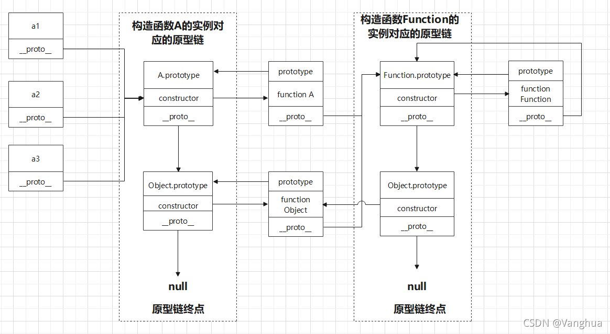

### 1.数据类型

**1.JavaScript有哪些数据类型？**

> 八种基本类型：Number，String，Boolean，BigInt，Symbol，Undefined，Null，Object


**2.数据类型检测有哪些方法？**

> （1）typeof判断八种类型，显示为对应类型的小写。
>
> * null被判断为object
> * 函数被判断为function。
>
> （2）instanceof通过原型链判断引用类型。
>
> * 左式不是对象则一直为false
>
> （3）constructor通过构造函数判断有构造函数的类型。
>
> （4）Object.prototype.toString.call().slice(8, -1)判断所有类型
>
> * 自定义类型可以用[Symbol.toStringTag]修改返回值。


**3.判断数组的方法有哪些？**

> （1）Object.prototype.toString.call().slice(8, -1)判断
>
> （2）Array.isArray判断
>
> （3）instanceof原型链判断


**4.null和undefined的区别是什么？**

> （1）null和undefined都是原始类型，这两个原始类型下都只各有一个值null和undefined。
>
> （2）null是JavaScript保留字。undefined不是保留字，可以用作变量名，可以通过void 后跟任何值安全获得undefined值。
>
> （3）null表示一个空对象，只有栈内存没有堆内存。undefined表示变量已声明但未赋值。
>
> （4）第一版JavaScript规定了存储数据的低三位用于类型判断，对象和null低三位都是0，在使用typeof时null会被误判为对象。undefined不会出现这种问题。
>
> （5）使用宽松相等判断null==undefined时会返回true，使用严格相等时会返回false。


**5.typeof null 的结果为什么是object？**

> 第一版JavaScript规定数据存储中低三位用于数据类型判断，object低三位为000，null所有位都是0。并且typeof以此判断数据类型，因此null会被误判为object。


**6.instanceof该如何实现?**

> instanceof先判断变量是否是对象，如果是对象则沿着原型链一直查找，是否有目标原型。
>
> ```javascript
> function imitateInstanceof(left, right) {
>     // 开启尾调用优化条件
>     "use strict";
> 
>     // 检查右值是否有[Symbol.hasInstance]属性
>     if (right && !right[Symbol.hasInstance])
>         throw new TypeError("类型检查函数的第二个参数必须是类")
> 
>     // 如果左值不是引用类型，那么不存在原型链，直接返回false
>     if(!left || left && typeof left !== "object" && typeof left !== "function")
>         return false
> 
>     // 初始值设置
>     // 如果getPrototypeOf传入一个原始类型，那么会经历装箱，变成引用类型来寻找原型链，所以之前必须检查left是否是原始类型
>     let leftProto = Object.getPrototypeOf(left)
>     let rightProto = right.prototype;
> 
>     // 使用尾调用优化
>     return (function check() {
>         if(!leftPrototype)
>             return false
>         else if(leftPrototype === rightPrototype)
>             return true
>         else {
>             leftPrototype = Object.getPrototypeOf(leftPrototype)
>             return check()
>         }
>     })();
> }
> ```


**7.为什么0.1 + 0.2 ！= 0.3，如何让其相等？**

> JavaScript的数值类型使用IEEE754 64位标准存储，0.1和0.2不能二进制小数被精确表示，因此相加不为0.3。
>
> 解决方法：
>
> （1）调用toFixed函数四舍五入变成字符串，然后再转化为数值。（2）把小数运算变成整数运算，同乘10.


**8.如何安全获得undefined值？**

> void 0。
>
> void后跟一个表达式但是不返回值，因此void 0的结果是undefined。所以void后面跟任何表达式都可以获取安全的undefined值。


**9.引用类型到基本类型的转化规则是什么？**

> （1）偏数值算法：先调用valueOf若失败再调用toString
>
> （2）偏字符串算法：先调用toString若失败再调用valueOF。
>
> （3）无偏好算法：可以通过[Symbol.toPrimitive]改写原始偏好算法。在JavaScript中除了Date是偏字符串算法之外都是偏数值算法。


**10.其它类型到布尔类型的转化规则是什么？**

> 真值转化为true，假值转化为false。假值只有7个是0，-0，NaN，“”，undefined，null，false会转化为false，其余都会转化为true。


**11.其它类型到字符类型的转化规则是什么？**

> （1）基本类型都是直接转换，即加上双引号。
>
> * BigInt类型转化时会去掉n
>
> （2）数组比较特殊。
>
> * 空数组转换为空串
> * 其它形式的数组都按join(",")方法转化，然后对每个元素做字符类型的转化
>
> （3）引用类型按偏好算法转换。


**12.其它类型到数值类型的转化规则是什么？**

> （1）特殊类型：
>
> * null转化为0
> * undefined转化为NaN
> * false转化为0，true转化为1
> * Symbol无法转化为数值
> * String数值字符串转化为数值其它字符串转化为NaN。
>
> （2）引用类型按偏好算法转换。
>
> 注：例如数组，先转化为字符串再转为数组，空数组转为0，单个元素的数值数组转为该元素等等


**13.如何进行隐式类型转换？**

> 隐式类型转换可以理解为不调用类型转换函数的转换。例如使用运算符隐式转换。
>
> （1）一元操作符+或-：表示正负数。转化为数值。
>
> （2）二元操作符+或-：表示加减运算。如果存在字符串那么都转化为字符串，否则都转化为数值。
>
> （3）二元操作符*或/：表示乘除运算。转化为数值。
>
> （4）二元操作符==或!=：表示宽松相等。除了null和undefined外，都转化为数值。
>
> （5）二元操作符>或<或>=或<=：表示比较。如果存在字符串那么转化为字符串，否则都转化为数值。
>
> （6）一元操作符!!：表示两次取反。转化为布尔值。


**14.||和&&操作符返回值是什么？**

> 与和或操作符会根据两边真值假值进行运算。与操作符只有操作符两侧都是真值才会返回操作符后的表达式结果，否则返回假值对应表达式结果。或操作符只有操作符两侧都是假值才会返回操作符后的表达式结果，否则返回真值对应表达式结果。


**15.Object.is()和==和===都是判断相等，有什么区别？**

> * ==是宽松相等，比较前会做类型转换，除了null和undefined，会转化为数值再比较。
>
> * ===是严格相等，比较前不会做类型转换。
> * Object.is(val1, val2)是经过修改的严格相等，+0和-0相等，NaN和NaN相等。


**16.isNaN函数和Number.isNaN函数的区别？**

> * isNaN在判断时会先做类型转换，转换为数值再判断是不是NaN。
> * Number.isNaN不会做类型转换。非数值都不会是NaN。


**17.什么是JavaScript装箱和拆箱？**

> * 装箱是基本类型到引用类型。指JavaScript基本类型没有方法，想要访问方法需要先使用基本类型工厂函数包装为引用类型才能访问方法。
>
> * 拆箱是引用类型到基本类型，可以通过valueOf和toString方法拆箱。


**18.为什么会有BigInt提案？**

> JavaScript数值采用IEEE754 64位标准存储，尾数52位，表示的最大整数精度是16位。用超过16位的整数进行科学计算会丢失精度，因此提出BigInt提案扩展计算精度。


### 2.ES6

**19.你有使用过ES6的什么内容？**

> （1）新的数据类型：Symbol用于call实现中给对象添加一个不重复属性。BigInt用于解决机器学习问题。
>
> （2）解构：机器学习函数参数比较多，利用解构描述形参，解构传参可以不按照变量顺序传参。解构提取深层嵌套对象中的内容。
>
> （3）三点运算符：call实现中接收参数。展开数组。迭代对象。
>
> （4）Promise异步编程：fetch发起网络请求。


**20.const和let的区别？**

> （1）const声明变量必须赋初始值。
>
> （2）const声明变量栈内存指针不能修改。


**21.let/const和var的区别？**

> （1）作用域不同。let/const是块级作用域，var是函数作用域。
>
> （2）变量提升和暂时性死区。var声明的变量在声明前可以使用，但是值为undefined。let/const声明的变量在声明前不能使用。
>
> （3）重复声明。var声明的变量可以重复声明，后声明的覆盖先声明的。let/const声明的变量不能重复声明。


**22.箭头函数和普通函数的区别？**

> （1）箭头函数的this继承自函数作用域，且不能被其它方法修改。普通函数的this要视情况而定，默认指向全局对象globalThis；作为对象方法时指向对象；可以被call，apply，bind修改。
>
> （2）箭头函数由于this不可被修改，因此不可作为构造函数。普通函数可以作为构造函数。
>
> （2）箭头函数没有Prototype，普通函数有Prototype。
>
> * 注意一个情况，对象属性中的函数如果使用ES6写法也会导致prototype为undefined
>
> （3）箭头函数没有自己的arguments，普通函数有arguments。


**23.三点运算符如何使用？**

> （1）函数形参中表示收集变量。函数实参中表示展开可迭代对象作为实参。
>
> （2）数组中或对象中表示对数组或对象的浅拷贝，此时不需要考虑对象是否是可迭代的。此时三点运算符后跟任何值都是合理的，如果不可浅拷贝则会返回空元素或空字段。
>


**24.谈谈对解构的理解？**

> 解构是一种针对性提取数据的方法。
>
> （1）数组解构是按照下标解构，对象解构是按照属性解构
>
> （2）解构可以方便地提取深层嵌套对象中的数据。函数参数过多时记不住顺序可以使用使用解构。
>
> ```javascript
> // 数组解构
> let [a, b, c] = [1, 2, 3] // a = 1, b = 2, c = 3
> 
> // 对象解构
> let obj = {
>     name: "Danny",
>     gender: "man"
> }
> // ES6增强型对象写法
> let { name, gender } = obj
> // 对象解构普通写法，属性值用于存储提取出来的数据，属性名要和原对象属性名相同
> let { name: name2, gender: gender2 } = obj
> 
> // 深层对象嵌套
> let obj = {
>     event: {
>         target: {
>             result: "Danny"
>         }
>     }
> }
> let { event: { target: { result } } } = obj
> console.log(result)
> 
> // 函数参数
> function linearRegression({theta, Y, X, alpha = 0.5, iter =10000}) {
>     // 略
> }
> 
> let theta = []
> let X = []
> let Y = []
> 
> // 调用时只需要直到有哪些参数即可，不需要考虑它们的顺序
> linearRegression({theta: theta, X: X, Y: Y})
> ```


**25：怎样不使用额外的变量来交换两个变量的值？**

> **（1）使用解构赋值**
>
> ```javascript
> let a = 1
> let b = 2
> [a, b] = [b, a]
> ```
>
> **（2）使用位运算（对于非数值类型不行）**
>
> ```javascript
> let a = 1
> let b = 2
> a = a ^ b
> b = a ^ b
> a = a ^ b
> ```
>
> **原理：**
>
> * 一个数和自己异或一定为零
> * 一个数和零异或一定为自己
> * 异或操作具有结合律
>
> ```a = a ^ b```
>
> ```b = (a ^ b) ^ b = a ^ (b ^ b) = a ^ 0 = a```
>
> ```a = (a ^ b) ^ a = (a ^ a) ^ b = b```


### 3.JavaScript基础

**25.new操作符实现原理是什么？**

> （1）创建一个空对象
>
> （2）绑定构造函数的this指向该对象
>
> （3）绑定该对象的prototype指向构造函数的原型
>
> （4）判断构造函数返回值类型，如果是引用类型则返回引用类型，如果是基本类型则返回该对象


**26.Map和Object的区别是什么？**

> （1）Map中默认不包含键，Object中默认包含原型链上的键
>
> （2）Map中键可以是任意类型，Object中键只能是String或Symbol类型
>
> （3）Map中的键是依据插入顺序的，Object中的键无序
>
> （4）Map中键的个数可以用size获取，Object中的键的个数不能直接获取。
>
> （5）Map是可迭代对象，Object必须有迭代器协议才能迭代。
>
> （6）Map对频繁增删键值对情景有优化，Object对频繁增删键值对情景无优化


**27.Map是怎么实现的？**

> （1）Map其实就是通过键快速查找到值，实现Map其实就是实现高效查找算法。
>
> * C++中std中的Map的实现是红黑树实现，不论是添加还是删除都能不超过3次旋转维护红黑树性质，插入删除指定位置查询时间复杂度在O(n)，维护性质的时间复杂度在O(1)
> * JavaScript中的Map可能是通过哈希实现，时间复杂度是O(1)，但是哈希函数的碰撞/冲突率不能保证一定很低，所以事实上哈希查询的时间复杂度不一定能保证在O(1)
>
> （2）其实和Map类似的还有定时器setTimeout。一些C++库中的定时器会选择红黑树或跳表或堆来实现，因为定时器的底层涉及到轮询，因此要能实现快速查找定时器，避免时间精度损失。
>
> （3）和Map类似的还有Set。因为向集合中插入元素时要考虑不能重复，并且在集合中还需要能快速判断一个元素是否存在。所以C++的std的Set有红黑树的实现形式。
>
> （4）总结一下，默认API的实现取决于编译器或解释器。例如JavaScript一般使用V8引擎。例如一般使用babel将代码编译成ES5代码，其中ES6的API怎么实现，就取决于babel如何处理。


**28.Map和WeakMap的区别？**

> （1）Map中键可以是任意类型，WeakMap中键只能是引用类型
>
> （2）Map中键值对是强引用，如果键是对象，Map外不再引用时不能被回收。WeakMap中键值对是弱引用，WeakMap外不再引用时，可以被垃圾回收。


**29.对前后端交换信息的JSON的理解？**

> （1）JSON是一种基于文本的轻量级数据交换格式，也是JavaScript语法的子集。
>
> （2）JSON中字符串都要求使用双引号，非字符串有true，false，null，数值。
>
> （3）JSON通常表示成数组或对象的形式。


**30.对JavaScript内置对象JSON的理解？**

> （1）JSON对象负责JavaScript对象和JSON格式对象的转换。stringify函数表示将JavaScript对象转换为JSON格式对象的字符串形式。parse函数表示将JSON格式对象的字符串形式转换为JavaScript对象。
>
> （2）JSON可以用来做对象深拷贝，但是无法深拷贝JavaScript内置对象和循环引用，但是可以给stringify传一个处理函数，复制属性时用WeakMap记录，如果某个键已经存在，则不再拷贝，用于解决循环引用问题。


**31.JavaScript脚本延迟加载的方法有哪些？**

> （1）defer属性：script标签会在html解析完成后再执行，不阻塞html解析。
>
> （2）async属性：async属性必须添加http请求的URL，表示该脚本异步请求，不阻塞html解析。
>
> （3）动态创建DOM：监听DOMContentLoaded事件，html加载完成后动态插入script标签。
>
> （4）宏任务队列：可以将脚本内容放入setTimeout中等html解析完后执行。
>
> （5）放置到文档底部：将script标签放到文档底部，不阻塞html解析。


**32.什么是类数组对象？**

> 拥有length和index索引的对象。例如：
>
> * String
>
> * 函数内部的arguments
> * HTMLCollection
> * NodeList


**33.解释一下NodeList和HTMLCollection的区别？**

> （1）获取这两种类型的方法不同。
>
> * NodeList：
>   * HTMLElement.querySelector相关方法
>   * HTMLElement.childNodes
> * HTMLCollection：
>   * HTMLElement.getElementBy相关方法
>   * HTMLElement.children
>
> （2）NodeList是动态的HTMLCollection是静态快照。NodeList获取之后，其中的DOM元素发生增删变化，NodeList都能反应。HTMLCollection无法反应。
>
> （3）两者都是类数组对象，两者其中存储的都是真实DOM的引用。


**33.如何将类数组对象转化为数组对象？**

> （1）Array.from方法中传入类数组对象
>
> （2）通过原型调用Array方法。slice或splice或concat（与空数组拼接）。将类数组对象传入其中。
>
> （3）通过原型调用Array方法。类数组对象会被默认转为数组对象进行执行。


**34.说一说数组常用原生方法？**

> （1）归并方法：reduce(归并函数，初始值)。
>
> （2）首尾操作方法：push，pop，shift，unshift
>
> （3）查找方法：indexOf，lastIndexOf，includes，find，findIndex
>
> （4）排序方法：sort，reverse
>
> （5）扁平化方法：flat，flatMap
>
> （6）截取方法：slice
>
> （7）拼接方法：concat
>
> （8）增删元素方法：splice
>
> （9）字符串方法：toString，join
>
> （10）迭代方法：forEach，map，filter，every，some


**35.知道数组slice方法吗，怎么使用？**

> （1）slice是数组截取函数。
>
> （2）slice接收两个参数
>
> * 第一个参数表示开始截取位置，闭区间。
> * 第二个参数表示截取结束位置，开区间。不传第二个参数默认截取到数组尾部。第二个参数可以为负数，表示从数组尾部向前的位置。
>
> （3）slice返回一个新数组。


**36.知道数组splice方法吗，怎么使用？**

> （1）splice是数组添加删除函数。
>
> （2）splice可以接收两个参数
>
> * 第一个参数表示开始删除位置。如果值不合法，例如负值或超出数组长度的值，那么会默认取当前数组最后一个元素。
> * 第二个参数表示从这个位置开始删除多少个元素，为0时表示不删除元素。
> * 第三个和后续参数表示删除完后再添加若干元素。
>
> （3）splice修改原数组。


**37.数组方法map和filter方法有什么区别？**

> （1）返回值不同。map的处理函数依据原数组元素返回一个新值。filter的处理函数以及数组元素返回true或false。
>
> （2）返回数组长度不同。map返回一个新数组和原数组长度相同，对每个元素都做了映射。filter返回一个新数组和原数组长度不一定相同，filter不会处理undefined元素，会抛弃返回值为false的元素。


**38.数组怎样去重？**

> （1）O(n)的操作。
>
> * 把数组元素加入set，再把set转为数组。
> * 和set类似，借助map来去重，可以解决数组中存在对象类型的数据。
> * 让数组元素作为对象的键，再提取对象的键。
>
> （2）O(n^2)的操作。
>
> * 遍历数组，在插入元素时寻找一下原数组中是否存在该元素。可以进行优化，查找可以做二分查找。


**38.数组扁平化怎么实现？**

> 数组扁平化函数flat返回一个新数组。设计递归实现数组扁平化，递归函数参数是数组和扁平次数，递归方程是遍历当前数组每个元素，如果当前需扁平次数大于零且当前元素为数组，那么对调用扁平化函数对该数组扁平化，否则将元素加入新数组。
>
> ```javascript
> const customFlat = (ar, flatNum) => {
>   const result = [];
>   (Array.isArray(ar) ? ar : []).forEach((item) => {
>     if (Array.isArray(item)) {
>       if (!isNaN(flatNum) && flatNum) {
>         result.push(...customFlat(item, flatNum - 1));
>       } else {
>         result.push(item);
>       }
>     } else {
>       result.push(item);
>     }
>   });
> 
>   return result;
> };
> 
> Array.prototype.customFlat = function (flatNum) {
>   const num = flatNum < 0 || isNaN(flatNum) ? 0 : flatNum;
>   return customFlat(this, num);
> };
> ```


**39.flatMap方法怎么使用？**

> flatMap方法结合了map和flat方法。如果回调函数没有特殊操作flatMap的时间复杂度就是O(n)。
>
> （1）flatMap是先进行映射再进行一次数组扁平化（先Map后Flat）。
>
> （2）flatMap可以用于过滤，如果某个元素映射值为空数组，那么扁平化时将会过滤掉该元素。


**40.数组方法中哪些方法会修改原数组？**

> （1）首尾修改方法push，pop，shift，unshift
>
> （2）排序方法sort，reverse
>
> （3）添加删除方法splice


**41.什么是AJAX？如何实现AJAX？**

> AJAX是不刷新页面就可以发起网络请求来更新页面。
>
> 实现AJAX：
>
> （1）创建一个XMLHttpRequest对象。
>
> （2）在该对象上创建Http请求，配置基本信息。
>
> （3）设置回调函数，监听XMLHttpRequest对象状态。readyState为4时正常，status为服务器返回的状态码。
>
> （4）发送Http请求。
>
> ```javascript
> // 1.创建对象
> let xhr = new XMLHttpRequest();
> 
> // 2.创建Http请求
> xhr.open("GET", "/api/test");
> // 2.配置基本信息
> xhr.responseType = "json"
> xhr.setRequestHeader("Accept", "application/json")
> 
> // 3.设置回调函数监听
> xhr.onreadystatechange = function() {
>     if (this.readyState ! == 4)
>         return;
>     if (this.status == 200) 
>         handle(this.response)
>     else
>         console.log(this.statusText)
> }
> 
> // 3.设置回调函数监听
> xhr.onerror = function() {
>     console.log(this.statusText)
> }
> 
> // 4.发送Http请求
> xhr.send(null)
> ```


**42.fetch如何使用？**

> ```javascript
> fetch("/api/test", {
> 	headers,
> 	method,
> 	body
> }).then(res => {
>     if(res.status == 200)
>         return res.text()
>     else
>         throw "error"
> }).then(ans => {
>     return ans
> }).catch(error = {
>     
> })
> ```


**43.fetch和XMLHttpRequest发起网络请求有什么区别？**

> （1）fetch最初不支持终止网络请求，现在可以用AbortController类终止Promise请求。XHR可以终止网络请求。
>
> （2）fetch默认不携带cookie，如果使用需要手动添加。XHR默认携带cookie。
>
> （3）fetch无法监听网络请求上传进度，XHR可以监听网络请求上传和下载进度。


**44.什么是尾调用优化？**

> 尾调用优化指提前让执行上下文出栈来降低空间复杂度。尾调用优化只能在严格模式下开启。尾调用优化情景是当前函数返回值和父级函数返回值相同，那么先让父级执行上下文出栈。
>
> 例如：递归中没有回溯中要进行的操作，并且返回值在函数末尾，并且返回的是当前函数，那么在栈中可以让递归需要保留的记录提前出栈。


**45.ES6模块和CommonJS模块的异同？**

> （1）区别：ES6是对模块引用，CommonJS是对模块浅拷贝。ES6可以修改模块中内容，但是指向模块的指针不能修改，类似于const。CommonJS可以修改模块中的内容，也可以修改指向模块的指针。
>
> （2）共同点：ES6和CommonJS都可以修改引用的对象的内部值。


**46.常见DOM选择节点操作有哪些？**

> （1）老式方法：
>
> document.getElementById。document.getElementsByClassName。document.getElementsByTagName。
>
> （2）新方法：
>
> document.querySelector。
>
> document.querySelectorAll。


**47.常见DOM添加节点操作有哪些？**

> （1）element.append添加到孩子的末尾，element.prepend添加到孩子的开头。
>
> （2）element.after添加到自己后面，element.before添加到自己前面。


**48.常见DOM删除节点操作有哪些？**

> （1）element.remove删除自己
>
> （2）element.replaceWith替换自己


**49.谈一谈严格模式下熟悉的限制？**

> （1）不能有with，以提高解释器优化效率
>
> （2）变量必须先声明后使用
>
> （3）不能delete prop，只能delete global[prop]
>
> （4）禁止this指向全局对象


**50.for in和for of的区别？**

> （1）for of是ES6新提出的，根据迭代器协议遍历对象键值对。
>
> （2）for in是遍历对象键。for in会遍历原型链上所有可枚举属性。


**51.如何用for of迭代对象？**

> 给对象添加迭代器协议。迭代器协议函数返回一个迭代器对象，对象中有一个next方法，next方法返回一个对象{value：，done：}，当done为true时迭代结束。
>
> ```javascript
> let obj = {
>     a: 1, b: 2, c: 3
> }
> 
> obj[Symbol.iterator] = function() {
>     let keys = Object.keys(this)
>     let length = keys.length, cnt = 0
>     return {
>         next() {
>             if(cnt < length)
>                 return { value: { key: keys[cnt], value: obj[keys[cnt ++]]}, done: false}
>             return { value: undefined, done: true }
>         }
>     }
> }
> 
> for(let { key, value } of obj)
>     console.log(key, value)
> ```


### 4.原型链

**52.描述一下原型链的指针关系？**

> （1）对象的\_\_proto\_\_属性指向自己的原型对象。
>
> （2）原型对象的constructor指向构造函数，\_\_proto\_\_属性指向自己的原型对象。
>
> （3）构造函数的prototype属性指向该构造函数对应的原型对象，\_\_proto\_\_指向自己的原型对象。
>
> 注：一个对象深究，用两条原型链来描述，如下
>
> 


**53.原型链的终点是什么？**

> 原型链的终点是null而不是某一个对象


**54.如何获得对象非原型链上的属性？**

> 用for in遍历对象所有属性，用hasOwnProperty来判断是不是非原型链属性


**55.修改原型时该注意什么？**

> 修改原型尽量修改原型内部属性。如果重写原型，那么之前的对象的原型指针不能指向最新的原型对象。


### 5.执行上下文/作用域链/闭包

**56.谈谈对闭包的理解？**

> 闭包是一种机制，即用函数声明时的作用域和函数内部变量解析函数的机制是闭包机制。闭包机制通常表现形式是，一个函数内部声明另一个函数，内函数访问并持有外函数变量的引用。


**57.什么是执行上下文？**

> JavaScript代码执行时的环境。执行上下文分为全局执行上下文和函数执行上下文。每个函数执行前都会创建自己的执行上下文环境并压入执行上下文栈，执行完毕时出栈。


**58.执行上下文创建过程是什么样的？**

> （1）绑定this。
>
> * 普通函数的this指向全局对象
> * 箭头函数this的指向和所在函数作用域中的this指向相同
> * 普通函数被作为对象方法调用时this指向对象
> * 构造函数中this指向新创建的对象
> * apply，call，bind改变this的指向。
>
> （2）创建词法环境。词法环境记录了函数的外部作用域，记录了函数相关参数如name，prototype，arguments
>
> （3）创建变量环境。
>
> * 先将形参加入变量环境，属性值为undefined。
>
> * 先找var声明的变量加入变量环境，属性值为undefined。
> * 找let和const变量声明的变量加入变量环境，属性值为未初始化不可访问。
> * 将实参值带入。
> * 将声明式函数加入变量环境，属性值为函数本身。


### 6.this/call/apply/bind

**59.改变this指向操作的优先级是什么？**

> this默认指向全局对象，有四种改变this指向的方法，分别为函数调用；对象方法调用；构造函数调用；call，apply，bind调用。
>
> 改变this的优先程度是：
>
> （1）构造函数调用
>
> （2）call，apply，bind调用
>
> （3）对象方法调用
>
> （4）函数调用


**60.call和apply的区别是什么？**

> call和apply只有使用形式上的区别。
>
> * call接收若干个参数，第一个参数指定this指向，后续参数指定传入参数。
>
> * apply接收两个参数，第一个参数指定this指向，第二个参数是数组，指定传入参数。


**61.call，apply如何实现？**

> （1）call，apply实现思路是让函数作为绑定的this对象的属性来调用，为了避免属性冲突可以使用Symbol作为属性。
>
> （2）call，apply也可以使用ES6中的代理对象实现。
>
> ```javascript
> // call的精简版实现，不考虑类型检查等问题
> Object.prototype.$call = function(tar, ...args) {
>  let prop = Symbol("call")
>  tar[prop] = this
>  let res = tar[prop](...args)
>  delete tar[prop]
>  return res
> }
> 
> // ES6的Proxy实现
> Object.prototype.$call = function(tar, ...args) {
>  return new Proxy(this, {
>      apply(target, thisArg, argArray) {
>          return Reflect.apply(target, tar, args)
>      }
>  })(...args)
> }
> ```


**62.bind如何使用？**

> bind接收若干个参数，第一个参数表示绑定函数中的this，后续若干个参数表示给函数传入初始参数。调用bind后返回一个新函数为绑定后的函数，bind不影响原函数。


**63.bind如何实现？**

> bind的实现是返回一个未执行的函数，用于接收bind未接收到的参数。该函数内部返回原函数调用call绑定this和参数的结果。
>
> ```javascript
> // bind实现精简版
> Object.prototype.$bind = function(tar, ...args) {
>     let that = this
>     return function Fun(...restArg) {
>         return that.call(tar, ...args, ...restArg)
>     }
> }
> ```


### 7.Promise与异步编程

**64.使用异步编程有什么好处？**

> （1）便于解决回调函数多层嵌套不易理解的问题。例如多个异步操作必须依次执行，使用回调函数编写，必须回调函数中嵌套回调函数，不易于理解，使用Promise或async/await异步编程可以线性表示非线性逻辑，代码便于理解和维护。
>
> （2）便于解决回调函数嵌套错误不易传给顶层函数的问题。使用Promoise编写异步代码用catch容易解决。


**65.Promise如何实现？**

> （1）构造函数：传给Promise的函数立即执行，Promise把自己的resolve方法和reject方法传给该函数。
>
> （2）then方法：
>
> * 接收解决回调函数和拒绝回调函数。如果当前Promise实例处于等待态，那么将回调函数加入回调函数队列，Promise维护回调函数队列是因为一个Promise实例可以用then注册若干回调函数。如果当前Promise已经解决或拒绝，那么依据PromiseA+标准，等到JavaScript主程序执行完后再执行回调函数，V8引擎是让回调函数在微任务队列执行。
> * 除了对回调函数的处理，then还会立即返回一个Promise实例，会以兑现回调函数的返回值兑现或以拒绝回调函数的拒绝值拒绝。
>
> （3）resolve和reject方法：
>
> * resolve和reject方法会维护Promise有限状态自动机，Promise的状态只能由pending到fulfilled或rejected，不能逆向转变或多次由pending转变。
> * 如果解决值或拒绝值不是Promise实例，那么会立即修改Promise实例状态转为解决或拒绝，并依次执行回调函数队列中的函数。
> * 依据PromiseA+规范，如果解决值或拒绝值时Promise实例，那么当前Promise实例仍处于等待态，知道该Promise实例解决或拒绝时才解决或拒绝。此时只需要给解决值或拒绝值通过then方法注册回调函数，当它解决或拒绝时通知当前Promise实例即可。
>
> ```javascript
> class VPromise {
>   static PENDING = "pending";
>   static FULFILLED = "fulfilled";
>   static REJECTED = "rejected";
> 
>   static REJECT_ERROR = "can't reject yourself";
>   static RESOLVE_ERROR = "can't resolve yourself";
>   static STATUS_ERROR = "wrong status change";
> 
>   #status = VPromise.PENDING;
>   #value;
>   #reason;
> 
>   #fulfilledCallbacks = [];
>   #rejectedCallbacks = [];
> 
>   constructor(func) {
>     try {
>       typeof func === "function" &&
>         func.call(this, this.#resolve.bind(this), this.#reject.bind(this));
>     } catch (err) {
>       this.#reject(err);
>     }
>   }
> 
>   #resolve(value) {
>     if (this.#status !== VPromise.PENDING) return;
>     if (value === this) throw new TypeError(VPromise.RESOLVE_ERROR);
>     if (value instanceof VPromise) {
>       value.then(
>         (res) => this.#resolve(res),
>         (err) => this.#reject(err)
>       );
>     } else {
>       this.#value = value;
>       this.#status = VPromise.FULFILLED;
>       (Array.isArray(this.#fulfilledCallbacks)
>         ? this.#fulfilledCallbacks
>         : []
>       ).forEach((func) => {
>         typeof func === "function" && func(this.#value);
>       });
>     }
>   }
> 
>   #reject(reason) {
>     if (this.#status !== VPromise.PENDING) return;
>     if (reason === this) throw new TypeError(VPromise.REJECT_ERROR);
>     if (reason instanceof VPromise) {
>       reason.then(
>         (res) => this.#reject(res),
>         (err) => this.#reject(err)
>       );
>     } else {
>       this.#reason = reason;
>       this.#status = VPromise.REJECTED;
>       (Array.isArray(this.#rejectedCallbacks)
>         ? this.#rejectedCallbacks
>         : []
>       ).forEach((func) => {
>         typeof func === "function" && func(this.#reason);
>       });
>     }
>   }
> 
>   then(onFulfilledCallback, onRejectedCallback) {
>     const forMatFulfilledCallback =
>       typeof onFulfilledCallback === "function"
>         ? onFulfilledCallback
>         : (value) => value;
>     const forMatRejectedCallback =
>       typeof onRejectedCallback === "function"
>         ? onRejectedCallback
>         : (reason) => reason;
> 
>     return new VPromise((resolve, reject) => {
>       if (this.#status === VPromise.PENDING) {
>         const fulfilledCallbacks = Array.isArray(this.#fulfilledCallbacks)
>           ? this.#fulfilledCallbacks
>           : [];
>         fulfilledCallbacks.push((value) => {
>           try {
>             resolve(forMatFulfilledCallback(value));
>           } catch (err) {
>             reject(err);
>           }
>         });
>         this.#fulfilledCallbacks = fulfilledCallbacks;
> 
>         const rejectedCallbacks = Array.isArray(this.#rejectedCallbacks)
>           ? this.#rejectedCallbacks
>           : [];
>         rejectedCallbacks.push((reason) => {
>           try {
>             reject(forMatRejectedCallback(reason));
>           } catch (err) {
>             reject(err);
>           }
>         });
>         this.#rejectedCallbacks = rejectedCallbacks;
>       } else if (this.#status === VPromise.FULFILLED) {
>         queueMicrotask(() => {
>           try {
>             resolve(forMatFulfilledCallback(this.#value));
>           } catch (err) {
>             reject(err);
>           }
>         });
>       } else if (this.#status === VPromise.REJECTED) {
>         queueMicrotask(() => {
>           try {
>             reject(forMatRejectedCallback(this.#reason));
>           } catch (err) {
>             reject(err);
>           }
>         });
>       } else {
>         throw new Error(VPromise.STATUS_ERROR);
>       }
>     });
>   }
> 
>   catch(onCatchCallback) {
>     return this.then(
>       null,
>       (reason) =>
>         typeof onCatchCallback === "function" && onCatchCallback(reason)
>     );
>   }
> 
>   finally(onFianllyCallback) {
>     return this.then(
>       (value) => {
>         typeof onFianllyCallback === "function" && onFianllyCallback(value);
>         return value;
>       },
>       (reason) => {
>         typeof onFianllyCallback === "function" && onFianllyCallback(reason);
>         throw new Error(reason);
>       }
>     );
>   }
> 
>   static all(promiseList) {
>     return new VPromise((resolve, reject) => {
>       const result = [];
>       (Array.isArray(promiseList) ? promiseList : []).forEach(
>         (promise, index) => {
>           if (promise instanceof VPromise) {
>             promise.then((value) => {
>               result[index] = value;
>               result.length === promiseList.length && resolve(result);
>             }, reject);
>           } else {
>             result[index] = promise;
>             result.length === promiseList.length && resolve(result);
>           }
>         }
>       );
>     });
>   }
> 
>   static allSettled(promiseList) {
>     return new VPromise((resolve) => {
>       const result = [];
>       (Array.isArray(promiseList) ? promiseList : []).forEach(
>         (promise, index) => {
>           if (promise instanceof VPromise) {
>             promise
>               .then(
>                 (value) => {
>                   result[index] = {
>                     status: VPromise.FULFILLED,
>                     value,
>                   };
>                 },
>                 (reason) => {
>                   result[index] = {
>                     status: VPromise.REJECTED,
>                     reason,
>                   };
>                 }
>               )
>               .then(
>                 () => result.length === promiseList.length && resolve(result)
>               );
>           } else {
>             result[index] = {
>               status: VPromise.FULFILLED,
>               value: promise,
>             };
>             result.length === promiseList.length && resolve(result);
>           }
>         }
>       );
>     });
>   }
> 
>   static race(promiseList) {
>     return new VPromise((resolve, reject) => {
>       (Array.isArray(promiseList) ? promiseList : []).forEach(
>         (promise) =>
>           promise instanceof VPromise && promise.then(resolve, reject)
>       );
>     });
>   }
> 
>   static any(promiseList) {
>     return new VPromise((resolve, reject) => {
>       const result = [];
>       (Array.isArray(promiseList) ? promiseList : []).forEach(
>         (promise, index) => {
>           if (promise instanceof VPromise) {
>             promise.then(resolve, (reason) => {
>               result[index] = reason;
>               result.length === promiseList.length && reject(result);
>             });
>           }
>         }
>       );
>     });
>   }
> 
>   static withResolvers() {
>     let resolve;
>     let reject;
>     const promise = new VPromise((res, rej) => {
>       resolve = res;
>       reject = rej;
>     });
>     return { promise, resolve, reject };
>   }
> }
> 
> ```


**66.Promise.all和Promise.race的区别？**

> Promise.all和Promise.race都是接收一个数组。Promise.all等到所有Promise解决再返回一个数组，存储所有解决值，或者等到第一个Promise被拒绝，返回拒绝值。Promise.race返回第一个解决或拒绝的Promise的解决或拒绝值。


**67.Promise.any方法如何使用？**

> Promise.any接收一个数组，包含若干个Promise实例。返回第一个解决的Promise的解决值。


**68.Promise.allSettled方法如何使用？**

> Promise.allSettled方法接受一个数组，包含若干个Promise实例。等到所有Promise解决或拒绝后，返回所有Promise的解决值或拒绝值。
>
> ```typescript
> interface Res {
>     status: 'fulfilled' | 'rejected'
>     value?: any
>     reason?: any
> }
> ```


**69.说一下对生成器的理解？**

> 1.与迭代器不同，生成器的yield是双向通信的。
>
> * 每次调用生成器的next方法时都可以传一个值作为当前yield表达式的值。
> * 要注意next传入的值与yield的对应关系。对yield的调用可以看做是遍历链表，最初在内容为空的头结点。调用next函数会先生成值，然后再调用yield抛出指定内容
>
> ```javascript
> function* generatorMaker() {
>   let ans1 = yield 1
>   console.log(ans1)
>   let ans2 = yield 2
>   console.log(ans2)
>   return "完成" // 最后一个yield或return都可以进行终止
> }
> let gen = generatorMaker();
> console.log(gen.next().value)
> console.log(gen.next("Vanghua").value)
> console.log(gen.next("Danny").value)
> // 1 Vanghua 2 Danny 完成
> ```
>
> 2. 生成器可以实现async和await机制
>
> * 生成器函数作为async函数，里面的yield相当于await，等待promise解决或者拒绝后才进行yield，否则yield后面的语句不会执行。


**69.async和await如何使用？**

> （1）await只能在声明时前面加上async的函数中使用。await等待Promise，await表达式的值是Promise的解决值或拒绝值。await会阻塞函数内后续操作。
>
> （2）声明时前面加上async的函数返回值是一个Promise，如果函数内部返回Promise那么async返回的Promise就是该Promise，否则返回一个已经解决的Promise，解决值是函数返回值。


### 8.面向对象技术

**70.如何创建对象？**

> 主要三大类方法，其它方法大同小异。
>
> （1）工厂函数：直接调用函数创建一个对象，然后给对象添加属性和方法。缺点是方法无法复用
>
> （2）构造函数：new调用函数创建对象，对象方法设置在构造函数的原型上，做到方法复用
>
> （3）对象字面量创建：直接用大括号定义对象


**71.如何实现对象继承？**

> （1）函数实现对象继承，
>
> * 子构造函数中调用父构造函数创建父对象，this指向该对象。
> * 子构造函数的原型用Object.create传入父构造函数的原型来创建。
>
> （2）JavaScript自带函数实现，Object.create传入一个对象，作为新对象的原型，只是简单继承了原型上的属性。
>
> （3）ES6的类继承


### 9.垃圾回收机制

**72.垃圾回收有哪些方式？**

> （1）引用计数。针对每个引用类型，都会有一个引用次数计数器，当计数器为0时立即垃圾回收。当引用赋值为null或执行上下文出栈时，引用次数会减一。优点是：能实时垃圾回收。缺点是：无法回收循环引用的情况。
>
> （2）标记清理。垃圾回收程序运行时，遍历所有引用类型，打上待清理的标记。再次遍历所有引用类型，如果当前执行栈中还能访问到某些对象，那么清除标记。遍历结束后清理所有有标记的对象。优点：能解决循环引用问题。缺点：容易造成内存碎片化。
>
> （3）标记整理。在标记清理基础上多一步对碎片化内存整理，整理成连续内存。优点：不存在内存碎片化。缺点：时间开销大。
>
> （4）复制回收。在内存开辟两片相同区域，分为to和from。比如先在from中存储数据，当from中数据满时，将执行栈中能访问到的数据加入to区，然后清理from区，最后交换to和from区的内容。
>
> （5）增量回收。使得垃圾回收程序能和主程序并行进行（时间片上交替）。


**73.既然了解垃圾回收，那么怎样合理使用内存？**

> （1）对象不使用时赋值为null。变量不使用时赋值为null，能提前对象被垃圾回收的时间。
>
> （2）使用块级作用域。块级作用域最晚被销毁后会进行垃圾回收，如果用var声明对象，那么是函数作用域，最晚在函数运行完毕时才会垃圾回收。
>
> （3）考虑隐藏类。用构造函数创建对象时，JavaScript默认它们属于同一个类，如果再次添加删除对象属性的话，JavaScript会认为该对象属于一个新类，会新创建一个类消耗内存。所以要考虑隐藏类，使用严格的面向对象技术。
>
> （4）合理使用闭包。内函数持有外函数对象的引用，但可能仅需要使用其中某一个属性，那么内函数只需要引用该属性即可。例如内函数引用了外函数中获取的DOM对象，但只使用其id。那么只用新创建一个变量赋值一下id即可存储在栈内存，这样就释放了对DOM对象的引用。


**74.V8引擎如何进行垃圾回收？**

> （1）将内存分为新生代和老生代，新生代较小，又分为to区和from区。先在from区存储，当from区满时，将所有执行栈能访问的对象都移入to区。
>
> （2）如果to区使用率超过25%，则判断这些对象是否经过一轮垃圾回收，如果经历过，则加入老生代，否则加入to区。完成后清理from区，交换from和to。
>
> （3）老生代不时进行标记清理和标记整理垃圾回收。


**75.V8引擎编译器怎样进行优化？**

> V8使用JIT优化。如果发现某段代码运行次数过多，例如for循环中的语句，那么就会给该语句打上warm标记，交给基线编译器对该代码编译提升运行速度。由于JavaScript是弱类型语言，变量类型不确定，因此基线编译器会编译变量取不同类型的所有情况。如果某段代码执行次数更多，那么就会打上hot标记，交给优化编译器处理，优化编译器不会编译变量取所有类型的情况，而是从中推测一种最有可能发生的情况进行编译。如果优化编译器推测失败次数过多，那么会回退到基线编译器，回退次数过多时不会再开启优化编译器。


### 10.渐进式web应用

**76.请简述你对PWA的理解：**

> PWA是普通web应用程序的增强版本，让用户在不同的平台/操作系统上有接近对应平台/操作系统的原生应用程序的良好体验。
>
> 如果想把一个普通web应用程序改进为PWA，那么至少需要支持PWA的这些特性：
>
> * **可安装：** 配置manifest文件。配置图标，是否可以全屏显示等等。
> * **离线操作：** 
>   * 在service worker中拦截各种请求并缓存，离线时发送失败的请求可以被捕获，然后有网络时重新发送。因为Cache Storage是存储在主存储器上。
> * **推送服务：** Notification对象在window上，可以用来推送。后端将消息推送到谷歌中转服务器，然后谷歌服务器推送给web程序。缺点是默认使用谷歌的推送服务，需要翻墙。
> * **平台支持性好：** 应该支持响应式设计，隐藏url栏，工具栏等交互操作。


**77.请阐述一下服务线程的生命周期？**

> **正常服务线程的生命周期：**
>
> 这并不是一个线性的生命周期，在parsed之后的每个周期，都有可能因为发生错误后进入redunant周期。
>
> * parsed：解析完毕
> * installing：安装中
> * installed：安装完毕
> * activating：激活中
> * activatied：激活完毕
> * redunant：失效
>
> **服务线程工作中生命周期的表现：**
>
> * 页面规定只有一个服务线程，此时没有其它服务线程
>   * 第一次导航事件：正常经历生命周期
>   * 至少第二次导航事件及以后：开始接管程序。第一次导航事件发生后页面可能还有数据没有加载完成，直接接管程序可能造成逻辑错误。
> * 页面规定只有一个服务线程，上次的服务线程未销毁
>   * 第一次导航事件：正常经历生命周期，销毁上个服务线程
>   * 同上
