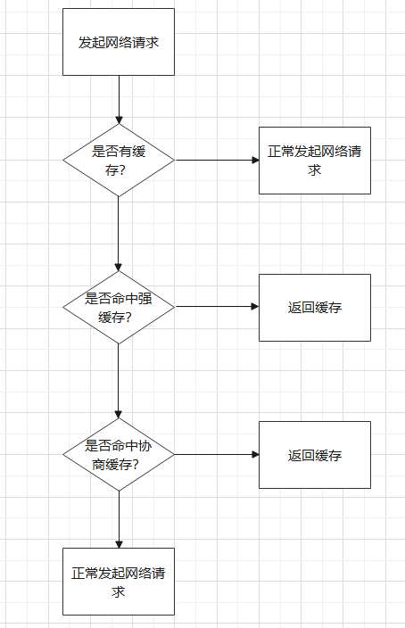

### 1.浏览器事件

**1.JavaScript的事件循环是怎么工作的？**

> 重复执行下述过程：
>
> **1.执行主线程**
>
> **2.执行微任务队列到微任务队列为空**
>
> **3.执行宏任务中的每种任务队列**
>
> * **3.1 执行该任务队列直到任务队列为空**
> * **3.2 执行微任务队列到没有微任务队列为空**


**2.JavaScript中有哪些宏任务哪些微任务？**

> **宏任务：**
>
> * setTimeout
>
> * setInterval
>
> * setImmediate（仅在IE浏览器中IE10以上支持）
> * IO操作的回调函数。
> * DOM事件的回调函数。
> * IntersectionObserver，ScrollObserver，InputObserver，AnimationObserver是通过事件方式来监听元素，回调函数会放在宏任务里执行。
>
> **微任务：**
>
> * Promise相关回调函数按Promise A+规范和V8的实现效果来看是在微任务执行
> * queueMicrotask可以将指定任务推入微任务中
> * MutationObserver，ResizeObserver根据DOM变化来进行监听，回调函数会放入微任务中执行


**3.浏览器中有哪些事件模型？**

> （1）DOM0级事件模型。没有事件冒泡和事件捕获。不支持事件监听器。兼容所有浏览器。只能在标签上或通过js添加事件处理函数。
>
> （2）IE事件模型。没有事件捕获。不支持事件监听器，但是有attchEvent和detachEvent实现类似功能。在IE9以下浏览器工作。
>
> （3）DOM2级事件模型。W3C中DOM1级未定义事件相关内容。有事件捕获和事件处理和事件冒泡。支持事件监听器。在IE9及以上版本支持DOM2级事件模型。


**4.什么是事件捕获和事件冒泡？**

> * 事件捕获是事件发生时从document传向事件触发处。
>
> * 之后进行事件处理。
>
> * 事件处理完之后事件从事件触发处传向document。


**5.如何阻止事件冒泡？**

> 普通浏览器：event.stopPropagation
>
> IE浏览器：event.cancelBubble = true
>
> Vue：.stop事件修饰符


**6.如何进行事件捕获？**

> 在addeventListener的第三个参数中配置capture为true


**7.什么是事件委托/事件代理？**

> 事件委托是利用事件冒泡机制，让子元素上发生的事件被父元素监听。使用事件委托可以用于监听大量子元素事件，避免在每个子元素上都注册监听器来减少内存消耗。使用事件委托可以用于监听动态元素，频繁添加删除元素可能会频繁添加删除事件监听器，使用事件委托可以不用频繁添加删除子元素的事件监听器。


**8.事件对象中的target和currentTarget表示什么意思？**

> * target：target是我们最常用的属性，例如一些输入组件中value就挂载在target上面。可以根据此进行助记，target永远就是事件发生的根源元素。
> * currentTarget：在事件冒泡过程中如果有元素捕获了事件并进行处理，那么currentTarget就返回此元素。


### 2.浏览器跨域

**8.什么是浏览器同源策略？**

> * **安全策略：** 脚本只能与脚本所在文档同源的资源进行交互，只是浏览器安全策略。
> * **同源概念：** 协议，域名/IP地址，端口号相同


**9.什么是跨域？**

> **概念：** 脚本访问一个资源，并且这个资源和自己所在的文档不同源。


**9.有哪些跨域方法？**

> （1）代理服务器跨域。
>
> * 在项目中网络请求的发起的URL都是路径形式不带有域名。
>
> * 在开发时在vue.config.js中配置代理服务器反向代理地址，由自带的nodejs提供代理服务器功能。
>
> * 在项目部署时使用nginx作为代理服务器，配置反向代理地址proxy_pass。
>
> ```nginx
> server {
>  listen       80;
>  server_name  localhost;
>  location / {
>      root   /usr/share/nginx/html;
>      index  index.html index.php;
> 
>  }	
>  location /api {
>      proxy_pass http://39.96.175.246:8051/api;                           
>  }	
> }
> 
> ```
>
> （2）CORS跨域。
>
> * 对于简单请求：HEAD，GET，POST并且是简单请求头。在客户端请求头中携带Origin字段，表明当前源。在服务端响应头携带Access-Control-Allow-Origin字段，表明允许跨域的地址。
>
> * 对于非简单请求：DELETE，PUT请求，或非简单请求头的简单请求。在客户端请求头中携带Origin字段，表明当前源。此时客户端会先发起预检请求，即preflight请求，请求方法是OPTIONS，如果允许跨域该请求会返回http状态码200。在服务端响应头携带Access-Contorl-Allow-Origin字段，表明允许跨域的地址。Access-Control-Allow-Methods字段，表明跨域请求允许的方法。Access-Control-Allow-Headers字段，表明跨域请求允许的非基本请求头属性。Access-Control-Max-Age字段，表明预检请求生效的时间。预检请求得到响应后即可跨域。
>
> * CORS安全性不好，网络请求中暴露了请求者的源地址。
>
> 
>
> （3）JSONP跨域。
>
> * JSONP跨域利用了同源策略只针对于脚本中发起的网络请求，但不针对标签中的请求来进行跨域。JSONP理由script标签发起跨域请求。
>
> * 在脚本中创建一个script标签，请求地址写入标签的src，地址中要携带回调函数名称。因为请求成功后会自动执行脚本中的内容，预期是请求成功后在脚本中执行回调函数。
>
> * 在服务端返回响应值时不能只返回响应值，应拼接上回调函数的名称，因为响应值将会作为JavaScript脚本运行。


### 3.浏览器存储

**10.localStorage和sessionStorage有什么区别？**

> （1）作用域相同，都是相同浏览器下的同源文件可以访问存储内容。
>
> （2）存储大小相同，一次性最大存储容量大概是5MB左右。
>
> （3）生命周期不同，localStorage的生命周期和硬盘生命周期相同，sessionStorage生命周期是浏览器关闭时将被销毁。


**11.sessionStorage和cookie有什么区别？**

> （1）作用域相同：同源文件下可访问。
>
> （2）cookie存储大小较小：cookie是早期的浏览器存储机制，存储大小限制是4KB。
>
> （3）生命周期相似：浏览器关闭cookie被销毁，但是可手动设置延长cookie声明周期。


**12.什么是cookie有哪些应用？**

> （1）cookie是早期的浏览器本地存储技术，每次发起HTTP请求都会携带本地cookie。
>
> （2）设置document.cookie存储密码并设置过期时间可以记住用户密码；和服务端会话session搭配使用，将sessionId存到cookie中可以统计网站点击量。


**13.客户端怎么操作cookie？**

> （1）通过document.cookie获取当前域下可访问的cookie。
>
> （2）通过document.cookie=“字段名=字段值”设置cookie字段。
>
> （3）在设置cookie字段的同时可以设置cookie的过期时间max-age（多少秒后过期）或expires（某一时间点过期），cookie的作用域路径path。


**14.cookie的作用域是什么样的？**

> cookie作用域是同源文件夹下的文档可访问相同的cookie。
>
> 举例而言，在发起HTTP请求时，会携带同源路径下的所有cookie，以及父级及以上路径下的所有路径。


**15.什么是JWT技术？**

> 


### 4.浏览器缓存

**15.浏览器缓存策略是什么？**

> 浏览器请求资源时先判断本地是否有缓存，如果有缓存则判断是否命中强缓存，如果没有则正常发起网络请求。如果命中强缓存则直接返回缓存，未命中强缓存，即缓存资源过期，则判断是否命中协商缓存。如果命中协商缓存则返回缓存，状态码为304，如果未命中则正常发起网络请求并返回新的返回值。
>
> 


**16.何时进行协商缓存？**

> （1）已经到达服务端设置的缓存过期时间max-age，强制缓存过期。之后的若想使用缓存，必须像服务端协商是否能继续使用，缓存内容是否发生改变。
>
> （2）客户端请求头配置特殊字段，no-cache表示每次都要进行协商缓存，max-age表示定期检查缓存是否失效，min-fresh表示与还剩多少时间过期进行比较，如果min-fresh小则用强制缓存，否则使用协商缓存。


**17.点击刷新按钮或按F5，按Ctrl+F5（强制刷新），地址栏回车对于缓存有什么区别？**

> （1）点击刷新或按F5：不论缓存是否过期，都要进行一次协商缓存。返回结果可能是304或200。
>
> （2）Ctrl+F5（强制刷新）：直接过期本地缓存。并且忽略缓存，直接发起网络请求。
>
> （3）地址栏回车：正常的一次网络请求，先尝试强缓存再尝试协商缓存。


**18.什么是CacheStorage？**

> （1）CacheStorage一般在ServiceWorker中使用，但是CacheStorage也被挂载到window上了，也可以在JavaScript主线程使用。
>
> （2）Cache只能用于存储网络请求和网络请求响应，并且只能存储GET方法的网络请求，因为非GET方法可能会携带参数，参数变化可能性较大。
>
> （3）Cache的设计结构是二层映射结构，第一层是Caches映射是每个键都是字符串，都对应一个值cache对象。第二层是Cache映射是每个键都是一个请求request，都对应一个值response响应对象。


**19.如何使用CacheStorage缓存网络请求？**

> 对于第二层映射：cache.add(request)，添加一个网络请求作为键，请求得到响应后，响应值将作为值放入cache映射。cache.delete(request)，删除一个键。


### 5.浏览器安全

**20.什么是XSS攻击？**

> （1）XSS攻击是一种脚本注入攻击，向目标网页注入攻击脚本以窃取数据或破坏网页结构。
>
> （2）XSS攻击入手点多为网页评论模块，通过提交评论在网站注入脚本进行攻击。有些网站可能通过innerHTML向网页注入内容，不会启动JavaScript解释器，此时可以插入一个src不存在的img标签，在onerror写入攻击脚本。


**21.如何防御XSS攻击？**

> （1）想要对抗XSS攻击，必须仔细甄别用户向网页插入的内容，可以对一些敏感标签进行特殊处理，例如script，img onerror这些标签或方法中添加特殊符号，破坏其原有的含义。
>
> （2）可以开启CSP来防御XSS攻击。可以在meta标签或服务端响应头添加字段来开启CSP防御，限制网页行为。例如只能加载同源脚本，同源图片，不允许添加内联样式等等。


**22.什么是CSRF攻击？**

> （1）CSRF攻击是第三方网站盗用用户的名义来发起网络请求，来窃取数据。
>
> （2）CSRF攻击入手点多为诱导用户打开某个网页，然后向某些服务器发起请求，此时会携带用户的cookie通过身份验证。例如盗QQ号，用户本地保存了用于身份验证的cookie，钓鱼网站已知了QQ登录接口的URL，此时只要诱导用户打开钓鱼网站，那么钓鱼网站会立即向登录接口发送登录请求，并自动携带本地cookie通过身份验证。


**23.如何防御CSRF攻击？**

> （1）对请求头的Refered字段进行检测，判断是否是钓鱼网站发来的。缺点是可以用代理服务器伪造Refered。
>
> （2）Token伪随机数检测。服务端在响应时返回一个token随机数保存在会话session中，客户端每次请求时都要携带token进行身份验证。
>
> （3）双重cookie验证。客户端发起请求时除了自动携带cookie外还要把cookie拼接到URL上，CSRF只能自动携带cookie不能访问cookie。缺点是URL携带cookie，容易暴露用户信息。
>
> （4）设置cookie同站。设置cookie的same-site字段为strict，这样第三方网站发起请求时不会携带cookie。
>
> （5）不使用cookie，改用post请求等方法。


**24.什么是MITM攻击？**

> （1）MITM攻击是中间人攻击。在服务端和客户端都不知情的情况下拦截请求响应信息进行篡改。
>
> （2）例如物理层进行嗅探攻击，老的使用集线器的网络中，可以将网卡启动混杂模式，接收链路上的所有信息，篡改后再进行转发。
>
> （3）例如数据链路层的ARP欺骗，主机通过ARP协议来获取目标主机的MAC地址，但是主机不会检查自己是否发送过ARP报文。此时其它主机可以向待攻击主机发送ARP响应报文，告知目标主机就是自己，这样就可以拦截通信。
>
> （4）例如应用层的DNS劫持，入侵DNS服务器，改变服务器地址与域名的映射关系。


### 6.浏览器渲染

**25.浏览器渲染过程是什么样的？**

> （1）HTML和CSS解析器同时启动开始解析，在DOM树和CSSOM树创建过程中就开始渲染避免网页长时间白屏，预解析器启动开始扫描异步资源提前加载。document.readyState=loding。遇到同步JavaScript脚本则执行，阻塞HTML和CSS解析器。遇到非同步脚本，即带有defer，async，module的脚本暂时不执行。defer等到DOM构建完成后DOMContentLoaded派发前执行，async等到脚本下载完成后执行。
>
> （2）HTML解析完成后生成DOM树，document.readyState=interactive，执行非同步脚本
>
> （3）非同步脚本执行完毕后在document对象上派发DOMContentLoaded事件。
>
> （4）加载其它异步资源，完成剩余的页面渲染。
>
> （5）完成全部渲染后，document.readyState=complete，在window对象上派发loading事件。


**26.什么是文档预解析？**

> webkit和firefox做了这样的优化，当执行JavaScript脚本时，html和css解析器被阻塞。此时启动另一个线程去加载后续需要异步请求的资源。


**27.CSS如何阻塞文档解析？**

> 如果CSS未完成下载，那么将会阻塞JavaScript脚本的执行（CSS资源的下载会阻塞同步JavaScript脚本执行）。


**28.浏览器渲染过程中树是如何变化的？**

> （1）渲染需要同时依据DOM树和CSSOM树。DOM树和CSSOM树在构建过程中就会开始渲染，避免网页长时间白屏。
>
> （2）生成Layout树。描述元素的大小位置信息，添加伪元素，标记display为none的元素不渲染。
>
> （3）生成Layer树。描述不同的图层信息。
>
> （4）光栅化。把之前得到的树的信息转化为浏览器像素信息。
>
> （5）合成。把大的图层分块进行光栅化，之后按照顺序和位置组合完成渲染。


**29.在JavaScript和CSS的引入上如何优化浏览器渲染？**

> （1）针对JavaScript。
>
> * 涉及DOM操作的JavaScript脚本引入可以放到文档最后，不阻塞HTML的解析。如果JavaScript中不涉及DOM操作，仅起到插件作用，可以将引入放到CSS下载前，避免CSS下载阻塞JavaScript执行，在JavaScript执行时预解析器会下载CSS。
> * 引入标签可以选择defer或async不阻塞HTML的解析。
>
> （2）针对CSS。
>
> * 尽量使用link标签引入CSS。link和@import都会异步下载CSS，但是link会顺序返回CSS文件，@import不会。link标签可以被JavaScript控制，@import不能被JavaScript控制。
> * 引入位置尽量放在header中，避免阻塞渲染的进行。


**30.什么是回流和重绘？**

> * 重绘是只改变元素的样式，不改变元素的布局。
>
> * 回流是需要重新布局，重新计算元素的位置和大小。回流一定会触发重绘。


**31.如何减少回流和重绘？**

> （1）减少对DOM的频繁操作。
>
> * 减少DOM树的深度。
> * 添加多个子元素时，可以使用documentFragment，把添加的子元素都附加上去，然后一次性添加。
> * 尽量不使用table布局，table中元素变化会引起DOM大幅度变化。
>
> （2）减少对CSSOM的频繁操作。
>
> * 减少css选择器嵌套的深度和复杂程度。
> * 使用cssText覆盖式修改内联样式，能够一次性修改多个样式。
> * 样式修改尽量使用类名切换实现。


**32.哪些操作会立即触发回流重绘？**

> （1）获取元素的计算几何属性，例如offsetLeft（当前元素针对父元素的左边界偏移值），offsetTop（当前元素针对父元素的上边界偏移值）等等
>
> （2）修改元素的计算几何属性


**33.前端怎么做性能优化？**

> * 引入JavaScript和CSS的方式（但一般不关注，因为有webpack）
> * 部署方式（cdn）
> * 缓存（手动storage缓存，pwa缓存，代理服务器缓存）
> * 打包优化（gzip压缩，图片选用webp，支持懒加载和代码分割）
> * 代码中（减少回流和重绘的次数）


**33.说一下对于SSR的理解？**

>SSR指的是服务端渲染。
>
>* 将页面渲染完成，只返回给前端html，减少前端加载页面时间
>* 可以配合数据预装填技术，装填数据到页面


### 7.浏览器历史记录

**34.控制路由前进和回退有哪些方法？**

> ```window.history.go(n)```
>
> ```window.history.back()```
>
> ```window.history.forward()```
>
> ```popstate``` 事件监听路由变化


**35.控制历史记录栈状态的方法有哪些？**

> ```window.history.push(stateObj, pageTitle, newUrl)```
>
> ```window.history.replaceState(stateObj, pageTitle, newUrl)```
>
> ```popstate``` 事件监听路由变化


**36.跳转新页面方法有哪些？**

> **1.window.open：**
>
> > ```window.open(url, target, configration)```
> >
> > * url表示跳转地址
> > * target表示跳转方式
> > * configration表示样式设置，并设置target为打开新的浏览器进程（窗口）
>
> **2.a标签：**
>
> > ```<a href="" target="_blank" />```
> >
> > * href表示跳转地址
> > * target表示跳转方式（默认为_self）
>
> **3.window.location：**
>
> > ```window.location.href```
> >
> > * 设置href表示跳转地址，重新设置为自己表示刷新
> >
> > ```window.location.reload```
> >
> > * 重新刷新页面
>
> **target可选项：**
>
> > * 名称：加载指定名称的页面
> > * _self：当前页面加载
> > * _blank：新页面加载
> > * _parent：父级加载（iframe使用）
> > * _top：顶级加载（iframe使用）


**37.不同的修改URL方式会对页面和历史记录栈产生什么样的影响？**

> **锚点修改：**
>
> > * **用途：** #号原本的用途是用于定位页面中对应id的元素。
> > * **页面刷新：** #号是客户端的本地操作。#号相关内容的变化不会触发页面刷新。
> > * **历史记录栈：** #号的修改会向历史记录栈中添加历史记录。
>
> **其它修改：**
>
> > * **页面刷新：** 修改url的路径，修改查询参数都会导致页面重新加载
> > * **历史记录栈：** 会向历史记录栈中添加历史记录


**38.跳转新页面对历史记录栈的影响是什么？**

> 加载新页面的行为默认是清空当前记录上方的所有记录，然后新页面对应的记录入栈。


**39.react中没有vue中的keep-alive标签，怎样在页面下钻过程中保持状态？**

> **react-keeper或react-activation或react-router-cache-router库：** 
>
> > * react-keeper库支持路由过滤器（类似于vue的路由守卫），不需要我们在react路由配置项里一个个用高阶组件进行包裹再进行过滤。
> > * react-keeper库支持路由缓存，在路由配置中配置cache字段（永久缓存或父页面不卸载时一直缓存）即可。类似于vue的keep-alive。
>
> **子路由：**
>
> > 页面下钻时使用子路由。
> >
> > * 子路由在父页面中通过Routes和Route配置，传参数可以直接传，比较方便
> > * 子路由在配置文件中配置，传参数需要通过路由跳转函数传参，麻烦一点
>
> **全屏弹窗和历史记录：**
>
> > * 下钻到新页面时弹出全屏弹窗，制造出路由跳转新页面的假象
> > * 在电脑端点击回退会导致全部回退，因此必须向浏览器历史记录里添加一个记录，并不渲染页面，修改锚点的内容可以满足需求。在手机端尤其要注意这个问题。或者也可以手动推入一条空记录。**需要手动维护历史记录，比较麻烦** （栈顶指针指向该历史记录时需要下钻，通常在移动端是左滑操作。但是通常没法实现这种操作。因此在页面回退时一般让历史记录出栈。）
>
> **浏览器存储状态：**
>
> > 使用状态管理器，url查询参数，storage能力存储页面状态，回退后更新状态即可


**40.谈一谈对SPA的理解？**

> **什么是SPA：** SPA就是单页路由，多页路由。
>
> **怎么实现SPA：**
>
> > * 使用路由监听和浏览器历史记录技术。监听路由变化，路由变化会向历史记录栈添加记录，保证了以后返回逻辑的合理性。路由变化后动态修改DOM，插入指定页面对应的内容。
> > * 使用AJAX技术。不刷新页面就能发起请求来获取数据，来更新页面内容。
>
> **为什么用SPA（优缺点）：**
>
> > **优点：**
> >
> > * 用户体验好。切换页面不会重新刷新整个页面，速度比多页路由要快。
> >
> > **缺点：**
> >
> > * 首次加载慢。
> >   * 正常情况下SPA首次加载需要下载所有页面的资源和所有的第三方库，因此速度会很慢。不过正常情况下都是会做一些优化（参考后续问题）。
> >
> > * 不利于SEO。
> >
> >   * 多页路由项目中不同页面的联系基本都是用url建立的，我可以通过当前页面的跳转逻辑获取下个页面的内容，对于庞大而复杂的系统，便于我的爬虫去分析其中的内容。
> >
> >   * 单页路由中不同页面的联系不是直接由url建立的，是url修改后被监听，再加载指定的组件实现的。这样我的爬虫只能获取并分析入口页面，对大型web应用程序，爬虫难以理解其中的含义。


**41.SPA首页加载慢怎么做优化？**

> * **按需加载：** 在代码中对页面和第三方库做按需加载。然后使用打包工具对代码做分割，打包后的文件应该是分割开的。在页面加载时会按需加载打包分割后的js文件。
> * **体积压缩：** 
>   * 图片可以转为webp格式，编码格式更高效，图片体积更小。
>   * webpack打包的时候可以做gzip压缩，同时nginx也要配置支持gzip压缩，目前大部分浏览器都支持直接解析gzip压缩的文件
> * **部署方式：** cdn部署加速静态资源访问速度。
> * **服务端渲染：** 
>   * **资源加载与渲染：** 使用SSR技术来优化首页，加载首页时直接返回html文件，不需要加载其它任何内容。
>   * **数据预装填：** 在SSR中进行预取数据，将某些接口中的数据预装填到页面中，减少请求次数。


**42.SPA为什么不利于做SEO优化？**

> **多页路由便于做SEO优化：**
>
> > * 多页路由每次请求页面都是返回html，爬虫可以根据html的DOM进行逻辑和内容分析。
> > * 多页路由页面跳转是通过url形式，当到达一个页面后，爬虫可以继续爬取这些url指向的其它相关页面。
>
> **单页路由不方便做SEO优化：**
>
> > * 单页路由首页加载返回html，但是通常里面就挂载了一个div。页面再渲染时会动态插入内容。一般情况下爬虫没有渲染引擎，因此无法根据DOM进行逻辑和内容分析。
> > * 单页路由页面跳转都是通过url变化后脚本动态插入DOM元素，即使爬虫获取了相关页面url，还是无法获取其html，无法分析DOM元素。


**43.SPA怎么做SEO优化？**

> **服务端渲染：** 
>
> * 服务端渲染保证了完整的html。爬虫可以根据首页进行逻辑和内容分析。
> * 但是每个页面都使用SSR会造成后端性能负担。
>
> **构建时预渲染：**
>
> * 可以使用webpack进行打包构建时预渲染的方法生成一个或多个相关的html便于爬虫搜索和分析
> * 但是无法获取后端动态的数据，可以写静态数据进去
>
> **二分处理：**
>
> * 对浏览器进行正常的SPA渲染
> * 根据userAgent识别是否是爬虫，针对爬虫对每个页面进行SSR优化。


### 8.浏览器窗口

**1.当前页面的窗口可以访问哪些窗口/可以和哪些窗口通信**

> * 当前窗口下的所有iframe窗口，以及这些iframe窗口可以进一步访问到的窗口
> * 当前窗口的所有父级和祖先级窗口，以及这些窗口可以进一步访问到的窗口
> * 打开当前窗口的窗口，以及它可以进一步访问的窗口。但是这受到同源策略的限制


**2.JavaScript获取窗口的能力有哪些？**

> **iframe相关：**
>
> * iframeElement.contetWindow：获取某个iframe的引用后通过contentWindow获取其窗口
> * window.frames：获取window对象下所有iframe的引用，可以通过对应window的name```window.frames.someName```或下标```window.frames[index]```访问
>
> **窗口嵌套相关：**
>
> * window.top：最顶级的窗口
> * window.parent：父级的窗口
> * window.self：自己本身
>
> **弹窗相关：**
>
> * window.opener：打开自己的窗口的来源窗口。受到同源策略限制。
>
> **名称相关：**
>
> * window.[xxxName]：某个名称为xxxName的窗口，并且这个窗口是能被当前窗口访问到的（见下一个问题）


### 9.浏览器进程线程

**1.浏览器有哪些进程？**

> 主要关注的进程：
>
> **1.浏览器进程：** 管理Tab页签。
>
> * **渲染浏览器外壳：** 包括前进后退刷新，书签搜索栏，Tab页签等
> * **启动并管理下面的子进程**
> * **管理用户交互事件**
>
> **2.渲染进程：** 渲染Tab页签。
>
> * **数量特点：** 一个标签页一个渲染进程。
>
> **3.网络进程：** 加载网络请求
>
> **4.存储进程：** 实现浏览器存储能力
>
> **5.插件进程：** 运行插件
>
> **6.GPU模型：** 使用GPU辅助渲染


**2.为什么渲染进程只开启一个主线程？**

> 结论：只能使用一个主线程，其他方式实现不了
>
> 该问题需要再思考下


**3.主线程为什么要有事件循环？**

> 需要协调同步事件和异步事件的执行顺序。
>
> **比如：** 定时器到时间了，但是正在执行同步代码，那么应该立即执行定时器的回调函数还是同步代码就无法确定了。


**4.主线程为什么需要异步？**

> 避免耗时操作阻塞后续操作和渲染。
>
> **比如：** 网络请求需要10秒中，如果没有异步，必须等到网络请求结束后再执行后续操作。
