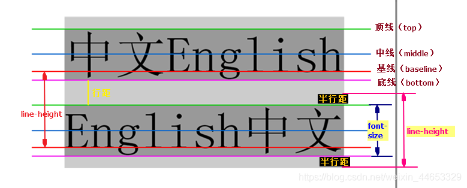

### 视觉格式化模型

#### 瀑布流布局

> 

#### 弹性布局伸缩规则

> **计算空间：**
>
> 先根据flex-basis计算空间是否剩余或者溢出
>
> **伸缩：**
>
> 根据是否剩余或者溢出再根据flex-grow或flex-shrink分配空间

#### 弹性布局布局属性说明

> **初始空间计算**
>
> flex-basis
>
> *\<percentage>：* 设置针对弹性盒容器宽度
>
> *\<width>：* 设置宽度值
>
> *auto：* 设置宽度值和内部元素一致
>
> **空间分配与对齐**
>
> *justify-content：* 主轴上空间分配方式
>
> *align-content：* 侧轴上空间分配方式
>
> *align-items：* 元素在侧轴对齐方式
>
> *align-self：* 精确到某个元素在侧轴对齐方式
>
> **空间分配属性取值**
>
> *space-between：* 边界项目贴边界，其它项目间隔相等
>
> *space-around：* 所有项目margin相等
>
> *space-evenly：* 所有项目间隔相等

#### 弹性布局flex取值说明

> **单值语法**
>
> *number：* ```flex-grow: <number>; flex-shrink: 1; flex-basis: 0;```
>
> *length：* ```flex-grow: 0; flex-shrink: 1; flex-basis: <length>;```
>
> **关键字语法**
>
> *initial：* ```flex-grow: 0; flex-shrink: 1; flex-basis: auto;```
>
> *auto：* ```flex-grow: 1; flex-shrink: 1; flex-basis: auto;```
>
> *none：* ```flex-grow: 0; flex-shrink: 0; flex-basis: auto;```

#### 多种常规布局方式

> **基础布局—流式布局：**
>
> 布局按设计稿采用百分比相对单位。(例如：bootstrap栅格系统)
>
> **基础布局—静态布局：**
>
> 布局按设计稿采用绝对单位。
>
> **组合布局—自适应布局：**
>
> 媒体查询+多套静态布局叠加。(例如：京东/淘宝首页)
>
> **组合布局—响应式布局：**
>
> 媒体查询+流式布局+相对单位。(例如：加入断点的bootstrap栅格系统；使用vw/vh/em/rem)

#### 响应式布局媒体查询配置

> **CSS内部配置**
>
> ```@media screen and (min-width: 1024px) and (max-width: 1440px) {  ... }```
>
> **Link标签**
>
> ```<link rel="stylesheet" type="text/css" href="style.css" media="handheld and (max-width:480px), screen and (min-width:960px)" />```

#### 响应式布局meta配置

> ```<meta name="viewport" content="width=device-width, initial-scale=1.0">```
>
> *width：* 设置宽度为移动设备宽度，而不是较大的默认宽度。
>
> *initial-scale：* 设置屏幕缩放比为1，即移动设备屏幕大小。

#### 水平垂直居中方式

#### 水平垂直居中transform比margin高效原因


### CSS属性计算过程

#### CSS属性计算过程

> **确定声明值**
>
> 非几何信息的相对单位计算为绝对单位
>
> 寻找作者样式和浏览器样式没有冲突的值作为计算值
>
> **层叠**
>
> 比较源重要性：作者样式优先于浏览器样式
>
> 比较选择器优先级： 选择器权重高的优先
>
> 比较声明次序： 声明次序靠前的有限
>
> **继承：**
>
> 尝试使用继承值
>
> **默认值：** 
>
> 都不满足时使用默认值

#### CSS继承规则

> **常见继承属性：**
>
> *字体属性：* font-size，font-family等
>
> *行高间距属性：* line-height，letter-spacing，word-spacing等
>
> *其它属性：* visibility，cursor等
>
> **继承规则：**
>
> *inherit：* 使用继承样式
>
> *initial：* 使用W3C默认样式；没有则使用继承样式。
>
> *unset：* 使用继承样式；没有则使用W3C默认样式。
>
> *revert：*  使用浏览器默认样式

#### CSS选择器

> **选择器：**
>
> **：* 命中所有选择器
>
> *元素/类/id：* 命中指定类型
>
> *A, B：* 命中任意一个选择器
>
> **组合器：**
>
> *A B：* 所有后代
>
> *A \> B：* 直接后代
>
> *A \~ B：* 所有兄弟
>
> *A + B：* 相邻兄弟
>
> **叠加**
>
> *ABC：* 同一个元素上同时满足A和B和C选择器或组合器

#### CSS选择器权重

> **权重计算**
>
> *内联样式：* 1000
>
> *id选择器：* 100
>
> *属性/类/伪类选择器：* 10
>
> *元素/伪元素选择器：* 1
>
> **其它场景**
>
> *!important：* 最高
>
> *其它选择器/组合器：* 0

#### CSS覆盖内联!imporatant

> **CSS：寻找其它属性**
>
> 如果是几何属性width。可以使用max-width约束，或者transform形变强制修改
>
> **JS：强制修改**
>
> JS强制设置属性

#### CSS伪类选择器

> **伪类含义**
>
> 选择元素状态
>
> **逻辑伪类**
>
> *A:is(B,C,D)：* ,列表选择器的升级。内部列表可容错。保持内部选择器权重。命中任何一个内部选择器。
>
> *A:where(B,C,D)：* ,列表选择器的升级。内部列表可容错。清空内部选择器权重。命中任何一个内部选择器。
>
> *A:not(B,C,D)：* 平级过滤元素。内部列表不可容错。保持内部选择器权重。命中没有B的A。
>
> *A:has(B,C,D)：* 根据后代过滤当前元素。内部列表不可容错。保持内部选择器权重。命中有后代B的A。
>
> **列表伪类**
>
> *A:first-child：* A命中元素中第一个兄弟元素。
>
> *A:last-child：* A命中元素中最后一个兄弟元素。
>
> *A:nth-child(an+b)：* A命中元素中符合an+b规则的兄弟元素。
>
> *A:fitst-of-type：* A类型元素中第一个兄弟元素。
>
> *A:last-of-type：* A类型元素中最后一个兄弟元素。
>
> *A:nth-of-type(an+b)：* A类型元素中符合an+b规则的兄弟元素。
>
> **状态伪类**
>
> *:link：* 命中尚未访问的元素(a元素或area元素)。
>
> *:visited：* 命中访问过的元素(a元素或area元素)。
>
> *:hover：* 命中鼠标悬停元素。
>
> *:active：* 命中鼠标按下和松开之间的时间，激活状态元素(a元素和button元素)。
>
> *lovehate原则：* 同时存在状态伪类是顺序是，link/visited/hover/active。原因是link和visited互斥，hover和active互斥。
>
> :focus： 命中聚焦元素。
>
> :disabled：命中设置disabled属性元素。
>
> :checked：命中被选中元素(option元素或radio类型input元素)。

#### CSS伪类技巧

> **提升选择器权重**
>
> 通过一个不存在的id选择器提升权重：#A:not(#B)的权重大于#A的权重，同理其它逻辑伪类也可以实现此效果。
>
> **选择父类元素**
>
> 通过A:has(B)命中父级或祖先级元素：A:has(B)命中有B的A，不借助has其它选择无法反向选择父级。

#### CSS伪元素选择器

> **伪元素含义**
>
> 选择元素位置(前面，后面，里面，整体等等)
>
> **常见伪元素**
>
> *::after：* 元素后面
>
> *::before：* 元素前面
>
> *::first-line：* 元素中第一行文本
>
> *::first-letter：* 元素中文本第一个字母
>
> *::placeholder：* 元素中提示文本
>
> *::-webkit-scrollbar：* 谷歌浏览器整个滚动条元素


### 包含块

#### 包含块

> **普通元素：** 
>
> 最近块盒的内容盒
>
> **固定定位：** 
>
> “根元素”或“设置transform/filter等属性的填充盒”
>
> **绝对定位：** 
>
> “最近设置过定位的填充盒”或“设置transform/filter等属性的填充盒”

#### 盒模型

> **CSS标准盒模型/内容盒模型：** 
>
> content计算宽高
>
> **CSS怪异盒模型/IE盒模型/填充盒模型： **
>
> content+padding+border计算宽高

#### 盒模型宽高计算

> **box-sizing属性：** 
>
> 描述盒子的宽高计算规则
>
> **content-box：** 
>
> 宽高计算包含content
>
> **border-box：** 
>
> 宽高计算包含content和padding和border
>
> <font color=red>**注：border-box不是默认值，但是布局时一般使用border-box，因为高保真图大部分是固定一块的宽高，边距大小根据内容大小调整**</font>

#### 盒模型相对单位计算

> **vw/vh：**
>
> 相对于视口大小。
>
> **rem：**
>
> 相对于html根元素的字体大小。
>
> **em：**
>
> font-size相对于父元素字体大小；其它属性相对于本元素字体大小。
>
> **\<length>和\<percentage>：** 
>
> 几何信息(width/height/padding/margin/top)等属性\<percentage>相对于包含块大小。\<length>是绝对大小。
>
> 行高间距(line-height/letter-spacing/word-spacing)等属性\<length>和\<percentage>相对于自身字体大小。 

#### BFC和IFC和FFC和GFC(IFC样式阶段)

#### 行盒样式截断


### -------------------------------------------

#### CSS-Houdini

#### CSS原子化和缺点

#### CSS规范比较原子化和CSS-IN-JS

#### canvas图像不清晰

#### @import和link比较

#### @import工程化应用

#### 文字多行省略方式

#### 文字行中间省略方式

#### 图片/背景/多媒体元素覆盖方式

#### offset和client和srcoll属性

#### getComputedStyle

#### 平滑滚动

#### 清除浮动方式

#### 解决外边距塌陷

#### 隐藏元素方式

#### 隐藏元素方式特点对比

#### 解决Inline-Block间距

#### 媒体元素对齐方式

#### 背景和盒模型关系

#### 层叠上下文优先级

#### 画多边形圆/三角形/多边形

#### 倒影效果

#### 毛玻璃效果

#### 多层阴影效果

#### 多边形棋盘格效果

#### 手电筒光照效果

#### 人物悬浮弹幕效果

#### SVG和Canvas比较

#### 雪碧图应用场景

#### font-face应用场景

#### 各种定位规则

#### translate高效原因

#### animation常见属性

#### transition常见属性


### 1.标签资源解析

#### defer和async区别

> defer：不阻塞dom解析，dom解析完成后顺序执行
>
> async：不阻塞dom解析，下载完成后立即执行

#### preload和prefetch区别

> preload：下载资源但不执行，浏览器立即下载
>
> prefetch：下载资源但不执行，浏览器空闲时下载

#### crossOrigin


### 1.页面布局

**1.px，em，rem单位的区别是什么？**

> px是固定的像素大小。
>
> em是相对于父元素字体大小的像素大小，1em相当于1个父元素字体大小。
>
> rem是相对于根元素html字体大小的像素大小，1rem相当于1个根元素字体大小。


**2.vw/vh单位是什么？**

> vw/vh是视图相关单位，视图指的是浏览器中工具栏以下的显示区域。vw是相对于视图窗口的宽度，1vw相当于视图窗口宽度1%，vh是相对于视图窗口的高度，1vh相当于视图窗口高度1%。


**3.媒体查询如何使用？**

> （1）meta标签声明以适配移动端。必须的设置有name设置为viewport，content中设置宽度为设备宽度，初始比例为1。
>
> ```html
> <meta name="viewport" content="width=device-width,initial-scale=1.0">
> ```
>
> （2）在style中使用@media设置不同设备下的样式。常用属性有min-width宽度下限，max-width宽度上限，媒体类型screen，print等等。
>
> ```css
> @media only screen (min-width: 100px) and (max-width: 200) {
>     div: {
>         
>     }
> 	// 对于屏幕类型，且宽度大于100px小于200px时应用此样式。   
> }
> ```


**4.如何进行响应式布局？**

> （1）通过媒体查询针对不同类型设备设计不同的样式
>
> （2）可以配合rem，em，vw，vh这些相对宽高单位进行布局
>
> （3）页面头部设置meta标签设置移动端视图大小，name为viewport，content为宽度等于设备宽度，初始比例为1


**5.两栏布局的实现（左边一栏固定，右边一栏自适应）**

> （1）浮动+margin布局。左边元素设置浮动，右边元素设置margin-left。
>
> （2）浮动+BFC布局。左边元素设置浮动，右边元素开启BFC，overflow:hidden不与左元素重合。
>
> （3）绝对定位+margin布局。左边元素设置绝对定位，右边元素设置margin-left。
>
> （4）绝对定位+偏移布局。右边元素设置绝对定位，设置左偏移left。
>
> （5）flex布局。左元素正常设置，右元素设置flex:1。相当于flex-grow:1。


**6.三栏布局的实现（左右两栏固定，中间一栏自适应）**

> （1）浮动+margin布局。左右元素设置浮动，中间元素设置margin。（注意中间元素必须最后设置，因为元素浮动是根据当前位置浮动，如果提前设置中间元素，右部元素将被挤到下一层）
>
> （2）浮动+BFC布局。左右元素设置浮动，中间元素设置overflow:hidden，开启BFC，不与浮动元素重合。（注意还是中间元素必须最后设置）
>
> （3）绝对定位+margin布局。左右元素设置绝对定位，右元素设置右偏移值为0偏移到最右。中间元素设置margin-left和margin-right即可。（注意还是上述原因，中间元素必须最后设置）
>
> （4）flex布局。中间元素设置flex：1。左右元素正常设置即可。


**7.圣杯布局如何实现？**

> 圣杯布局解决的是三栏布局问题。
>
> （1）父元素用padding给左右固定栏留下位置。
>
> （2）先设置中间自适应元素。设置浮动。宽度100%
>
> （3）设置左栏元素。设置浮动。利用margin-left：-100%拖拽到父元素内容部分最左端。再利用相对定位进行左负偏移，偏移到父元素预留位置。
>
> （4）设置右栏元素。设置浮动。利用margin-left：-”自身宽度“拖拽到父元素内容部分最右端。再利用相对定位进行右负偏移，偏移到父元素预留位置。


**8.圣杯布局中左右栏设置浮动为了和中间元素在一行显示，那么中间元素为什么设置浮动？**

> 中间元素设置浮动是因为左右栏元素回到父元素预留位置时用到了margin-left负值来进行拖拽。只有在浮动元素之间用margin-left取负值的拖拽才能回到上一行。如果中间元素不设置浮动，那么左右栏元素使用margin-left负值会一直向左拖拽，并溢出视图。


**9.双飞翼布局如何实现？**

> 双飞翼布局解决的是三栏布局问题。
>
> （1）父元素正常设置
>
> （2）先设置中间自适应元素。设置margin给左右栏留下位置。给中间自适应元素包裹一个元素，设置浮动，设置宽度100%。
>
> （3）设置左栏元素。设置浮动。利用margin-left：-100%拖拽到父元素内容部分最左端，和中间自适应元素预留位置重合。
>
> （4）设置右栏元素。设置浮动。利用margin-left：-“自身宽度”拖拽到父元素内容部分最右端，和中间自适应元素预留位置重合。


**10.双飞翼布局中为什么要给中间自适应元素外面包裹一个浮动元素？**

> margin-left取负值进行换行拖拽只能应用于浮动元素之间。如果不给中间自适应元素包裹浮动元素，来对左右栏进行margin-left负值拖拽，那么就会一直向左溢出视图。


**11.水平居中如何实现？**

> （1）普通块级元素设置margin：0 auto
>
> （2）普通行级元素在父级元素设置：text-align：center
>
> （3）绝对定位元素设置左偏移50%，左边距取负的自身宽度的一半
>
> （4）绝对定位元素设置左偏移50%，设置transform：translate(-50%,0)偏移回去
>
> （5）绝对定位元素设置左右偏移都为0，再设置margin：0 auto（auto表示自动调整外边距，对于普通块级元素，宽度已经是100%了，对于绝对定位元素而言需要再拉伸一下）
>
> （6）flex布局下在父元素设置justify-content：center


**12.垂直居中如何实现？**

> （1）普通行内块元素设置vertical-algin：middle，在父元素中插入伪元素，设置为行内块元素，content为空，height：100%，vertical-align：middle
>
> （2）普通行级元素设置line-height和父元素高度相同
>
> （3）绝对定位设置上偏移50%，上边距取负的自身高度的一半
>
> （4）绝对定位设置上偏移50%，transform：translate(0,-50%)偏移回去
>
> （5）绝对定位设置上下偏移都为0，再设置margin：auto 0
>
> （6）flex布局下载父元素设置align-items：center


**13.水平垂直居中的实现**

> （1）绝对定位下设置左上偏移50%，再设置margin-left和margin-top取负的该元素的宽度和高度
>
> （2）绝对定位下设置左上偏移50%，再设置transform：translate(-50%, -50%)
>
> （3）绝对定位下设置上下左右偏移量都为0，再设置margin：auto auto
>
> （4）flex布局下设置justify-content：center，align-items：center


**14.flex布局常用配置有哪些？**

> （1）容器设置。flex-direction设置排列方向，垂直或水平上的正负向。flex-wrap设置轴线上排列不下时如何换行。align-content设置换行时侧轴的排列方式。justif-content设置主轴排列方式。align-content：设置侧轴排列方式。
>
> （2）项目设置。order设置项目排列顺序。flex-grow设置容器有空间时项目放大比例。flex-shrink设置容器没有空间时项目缩小比例。flex-basis设置项目所占百分比。align-self设置项目在侧轴的排列方式，覆盖容器设置。


**15.flex:1的含义是什么？**

> （1）flex属性时flex-grow和flex-shrink和flex-basis属性的简写，默认值为0 1 auto。
>
> （2）flex-grow表示有空间时元素按什么比例扩大填充空间，flex-shrink表示空间不足时元素按什么比例缩小适应空间，flex-basis表示主轴上元素所占比例。
>
> （3）flex：1表示flex-grow为1，flex-shrink为1，flex-basis为0%。


### 2.定位与浮动

**16.使用浮动可能引起什么问题？**

> （1）浮动元素中无内容时，父元素高度无法被支撑。
>
> （2）浮动元素可能覆盖非浮动元素，需要清除浮动。


**17.清除浮动有什么方法？**

> （1）在非浮动元素上设置clear：both。如果父元素中没有非浮动元素，那么可以用::after在父元素最后插入伪元素设置为块级元素后设置clear：both。
>
> （2）父元素开启BFC，BFC内部不允许有浮动。
>
> （3）给父元素设置高度。


**18.如何清除行内块元素之间的水平空隙？**

> （1）直接删除行内块标签之间的空格回车和换行，但是代码会变得不易理解
>
> （2）在行内块标签间添加注释，但是代码会不美观
>
> （3）行内块元素设置浮动转变成浮动元素，之后清除浮动
>
> （4）不使用行内块元素布局，采用特殊布局如flex


**19.谈一谈对clear属性的理解？**

> clear是指元素盒子的边不能和前面的浮动元素相邻。clear：left指的是左边不能与浮动元素相邻，clear：top指的是上边不能与浮动元素相邻。清除浮动在父元素最后一个元素且为块元素上设置clear：both，这样就把父元素高度撑起，与浮动元素一样高。


**20.浮动元素的width是默认100%吗？**

> 浮动元素默认width是内容的width，和普通块级元素不同。


**21.什么是BFC？**

> BFC是块级格式化上下文。
>
> （1）BFC内部，盒子自上而下排列，每个盒子贴紧容器左边。
>
> （2）BFC内部，上下相邻的两个容器的margin会折叠。同时设置margin-bottom和margin-top只会生效一个。
>
> （3）BFC内部，计算高度时考虑浮动元素。
>
> （4）BFC外部，不与浮动元素重叠。
>
> （5）BFC外部，BFC内部元素的布局不影响外部元素。


**22.如何创建BFC？**

> （1）overflow属性不是visible即可，通常设置为hidden或auto
>
> （2）float属性不是none
>
> （3）position属性不是relative和static
>
> （4）display属性为inline-block或table-cell等table相关


**23.如何解决margin折叠？**

> （1）兄弟元素margin折叠。（1.1）两兄弟元素开启BFC，BFC内部不影响外部布局。（1.2）给其中一个兄弟元素添加一个透明边框（border：1px solid transparent;）
>
> （2）父子元素margin折叠。（2.1）子元素不用margin，用父元素的padding代替。（2.2）子元素开启BFC，BFC内部不影响外部布局。（2.3）给子元素添加一个透明边框


**24.什么是IFC？**

> IFC是内联格式化上下文。
>
> （1）盒子一个一个水平排列，垂直方向上的排列取决于对齐方式，例如vertical-align。
>
> （2）每一行都存在一个行框，能够放下所有盒子，行框的宽高由放进的盒子决定。
>
> （3）当盒子宽度超出行框时，盒子内容会被放到下一个行框中。如果某些内容不可分割，盒子将溢出行框。


**25.元素的层叠顺序是什么样的？**

> （1）背景和边框是最底层（2）z-index为负（3）块级元素（4）浮动元素（5）行内块元素（6）z-index为零（7）z-index为正


**26.position有哪些属性？**

> absolute，relative，fixed，static，inherit从父元素继承position属性值


**27.absolute、relative定位规则是什么？**

> absolute的规则是：
>
> （1）元素在文档原来位置处脱离文档流。
>
> （2）偏移量的计算依据第一个position不为static的父元素进行偏移计算，表示距离父元素边界的距离。
>
> relative的规则是：
>
> （1）元素在文档原来位置处脱离文档流。
>
> （2）偏移量计算依据自己原来位置，表示距离自己原来边界的距离。


**28.fixed、sticky定位规则是什么？**

> fixed的规则是：
>
> （1）元素在文档原来位置处脱离文档流，并一直固定在窗口当前位置。
>
> （2）偏移量计算依据最初在窗口中的位置计算。
>
> sticky的规则是：
>
> （1）元素在文档原来位置处脱离文档流，根据情况在relative和fixed定位间切换，当元素在窗口中能满足偏移量时则依据relative定位，若滚动滚轮元素不能满足在窗口中的偏移量，那么切换到fixed定位。
>
> （2）偏移量计算依据最初在窗口中的位置计算。
>
> （3）如果不设置偏移量sticky定位不会生效。


### 3.盒模型

**29.CSS中有哪两种盒模型？**

> （1）标准盒模型。由内容，内边距，边框，外边距组成。在计算盒模型的宽高时以内容content的宽高为准。（2）IE盒模型。由内容，内边距，边框，外边距组成。在计算盒模型的宽高时以内容，内边距，边框的宽高为准。（3）在IE8及以上浏览器中使用的都是标准盒模型


**30.如何修改盒模型？**

> 使用box-sizing属性修改。box-sizing默认是content-box标准盒模型，修改为border-box是IE盒模型。


**31.margin和padding有哪些使用场景？**

> margin是需要在边框外添加空白，且空白处不需要背景色。
>
> padding是需要在边框内添加空白，且空白处需要背景色。
>
> 外边距margin发生折叠时可以用padding代替margin计算。


**32.margin取百分比值时百分比是针对什么元素？**

> 针对父元素


**33.margin负值会产生什么影响？**

> （1）margin-left和margin-top取负值表示向左或向上拖拽元素。margin-right和margin-bottom取负值表示该元素不动，向左或向上拖拽临接的元素。（2）一般margin取负值用于浮动元素。在圣杯布局或双飞翼布局中，对浮动元素设置margin负值，可以把溢出到下一行的浮动元素拖拽到内容content中。


### 4.CSS基础

**34.CSS选择器和优先级是什么样的？**

> （1）内联样式
>
> （2）id选择器。权重最高
>
> （3）类选择器，属性选择器（标签[属性=值]），伪类选择器。权重次之
>
> （4）标签选择器，伪元素选择器（元素::before）。权重次之。
>
> （5）相邻兄弟选择器（元素+相邻兄弟），子选择器（元素>子元素），后代选择器（元素 后代），通配符选择器（*）。权重最低。
>
> 属性设置最后添加!important优先级最高，例如background: red !important;


**35.什么是伪元素？你在哪些地方使用过伪元素？**

> 伪元素是在某个选择器上添加特殊样式。（1）见到过添加特殊样式，使用::first-line给文本第一行添加特殊样式。（2）使用过清除浮动，设置在父元素的子元素最后插入一个伪元素，即在选择器后添加::after。并设置display：block，因为插入的伪元素默认是inline-block，无内容时无宽高。clear：both，撑起父元素的高度。


**36.什么是伪类？你在哪些地方使用过伪类？**

> 伪类是在某个选择器上定义元素的特殊状态。常用的伪类有:hover鼠标悬停，a:visited已访问的链接，a:link未访问的链接，a:active已选择的链接（1）用到伪类实现项目名称，鼠标悬停时会有发光效果。


**36.伪元素和伪类的区别有哪些？**

> 伪元素是向元素内部添加额外的元素或额外的样式，伪元素会在渲染生成Layout树时被处理。
>
> 伪类是在某元素特殊状态下添加样式。
>
> 伪元素在使用是双冒号，伪类在使用时是但冒号。


**37.::before和:after的双冒号和但冒号有什么区别？**

> 单冒号表示伪类，双冒号表示伪元素。在CSS2.1中出现了:after和:before伪元素，但是在CSS3中伪元素的语法被修改成了双冒号。


**38.你常用的属性哪些可以被继承？**

> （1）字体相关属性，font-size，font-weight，font-family
>
> （2）文本相关属性，line-height行高，text-align水平对齐，color
>
> （3）可见性属性，opacity


**39.你常用的属性哪些不可以被继承？**

> （1）盒模型相关属性，margin，padding，border，height，width
>
> （2）背景相关属性，background，background-color
>
> （2）渲染属性display
>
> （3）垂直布局属性vertical-align
>
> （4）定位属性position
>
> （5）溢出控制属性overflow


**40.隐藏元素的方法有哪些？**

> （1）display：none。该元素不会被渲染。
>
> （2）visibility：hidden。元素被渲染，但不显示，但占据空间。
>
> （3）opacity：0。元素透明度为0，不显示，但占据空间。
>
> （4）position：absolute。将元素移出可视区域。
>
> （5）z-index：负值。
>
> （6）transform：scale(0,0)。将元素缩放为0，元素仍占据位置（和opacity效果一样）。


**41.display：none和visibility：hidden的区别是什么？**

> （1）display：none表示元素不被渲染。visibility：hidden表示元素被渲染但是不显示，并且占据空间。（2）display是非继承属性，visibility是继承属性，设置visibility：hidden的元素的子元素也会被这样设置。


**42.link和@import的区别是什么？**

> （1）link标签加载CSS不存在兼容问题，@import是css2.1某些低版本浏览器不支持
>
> （2）link可以用JavaScript创建并动态添加，@import不是DOM标签不受JavaScript控制
>
> （3）link和@import都是异步下载多个资源，但是link会顺序返回，在IE浏览器中@import不会顺序返回，如果css资源间存在依赖，那么会出现错误。
>
> （4）在IE浏览器中，link和@import标签一起使用时link标签下载资源会阻塞@import下载资源.


**43.CSS3有哪些新特性？**

> （1）text-decoration属性，是text-decoration-line，text-decoration-color，text-decoration-style简写。可以给文本添加上划线overline，下划线underline，删除线line-through，并定义其样式等。
>
> （2）text-shadow属性，定义文字阴影，定义值是水平阴影距离，垂直阴影距离，模糊距离，阴影颜色。
>
> （3）border-radius圆角属性
>
> （4）伪元素选择器::before，::after等。
>
> （5）伪类选择器:first-child，:last:child等。
>
> ```css
> // ul的第一个子元素是li时，改变此li的属性
> ul li:first-child {
>     color: tomato;
> }
> ```


**44.物理像素和逻辑像素的区别？**

> （1）开发时使用逻辑像素。例如开发者工具显示手机像素为300px*900px，那么开发时如果设置div宽高为300px和900px即可填充整个手机显示屏。
>
> （2）物理像素指实际像素，虽然开发者工具显示手机像素为300px\*900px，但实际手机上有1200\*3600像素，那么此时一个逻辑像素对应16个物理像素。
>
> （3）开发时通常使用媒体查询来决定图片分辨率，使图像分辨率适应不同设备的物理像素，避免失真。


**45.谈一谈对line-height的理解？**

> 
>
> （1）line-height指一行文本的高度。文本高度的描述由四条线描述，底线，基线，中线，顶线。其中font-size设置的是底线到顶线的距离。line-height设置的是上半行距+底线到顶线的距离+下半行距。
>
> （2）如果标签没有定义height，那么高度由line-height决定。
>
> （3）line-height可以用于文本垂直居中，在子元素span中设置line-height和父元素div的height一样高时可以使子元素中的文本垂直居中。


**46.line-height值设置为纯数字是什么含义？**

> line-height值为父元素字体大小的数值倍数。


**47.CSS优化的方法有哪些？**

> （1）减少CSS选择器嵌套深度和复杂程度，少用后代选择器（CSS选择器是从右向左匹配的，因此会遍历所有后代）
>
> （2）减少对CSSOM的频繁操作，如果要修改多个属性，可以选择通过cssText属性覆盖式修改。（3）减少对CSSOM的频繁操作，尽量通过类名切换修改样式。
>
> （4）CSS引入的位置尽量放在header中，避免阻塞渲染，渲染需要使用CSSOM树。
>
> （5）尽量使用link标签引入CSS。在IE浏览器中，@import下载多个资源时异步下载，但是返回不按顺序。@import和link同时使用时link会阻塞@import。@import不可被JavaScript控制。


**48.怎样对文本溢出进行隐藏？**

> （1）单行文本溢出。
>
> ```css
> overflow: hidden; // 隐藏溢出部分
> white-space: nowarp; // 溢出部分不换行
> text-overflow: ellipsis; // 溢出部分用省略号表示
> ```
>
> （2）多行文本溢出。
>
> ```css
> overflow: hidden; // 隐藏溢出部分
> text-overflow: ellipsis; // 溢出部分用省略号表示
> display: -webkit-box; // 弹性盒布局
> -webkit-line-clamp: 3; // 最多允许几行不溢出
> -webkit-box-orient: vertical; // 弹性盒垂直布局
> ```


**49.z-index属性在什么情况下会失效？**

> （1）元素没有设置定位属性position时z-index一定失效。解决方案是添加定位属性设置非static值。
>
> （2）父元素图层优先级高于子元素图层优先级。例如一个元素设置absolute，并设置较高图层。其兄弟节点设置relative或absolute，设置负数图层，其中子节点设置relative，设置最高图层。但是此时子节点无法到达最高图层，因为父元素图层优先度高。
>
> （3）元素在设置z-index时也设置了浮动属性。解决方案是清除浮动，或不用浮动改用inline-block。


**50.CSS3的transform有哪些属性？**

> transform是动画相关属性。用过的属性有translate(xxx, xxx)表示将元素从当前位置移动，如果取百分比，则依据元素自身宽高，这个用于水平或垂直居中。用过scale(0, 0)表示将元素缩小的看不到，但是仍占据空间，用于不显示元素。


### 5.HTML

**51.src和href的区别是什么？**

> （1）src用于替换当前内容，例如img标签，script标签。href用于文档和资源之间建立联系。
>
> （2）src一般用于script，img，iframe标签。href一般用于link标签
>
> （2）现代浏览器中都有预加载器，src和href都能够异步下载多个资源。


**52.什么是HTML语义化？**

> （1）HTML语义化指正确的标签做正确的事。例如用div标签布局，而不是用span标签设置display为block来布局。常用的语义化标签有：header，nav导航栏，section区块（语义化的div），article，main，aside，footer等。
>
> （2）HTML语义化的好处是对开发者友好，增强代码的可读性。对机器优化，便于搜索引擎优化，便于爬虫搜索数据。


**53.DOCTYPE的作用是什么？**

> （1）DOCTYPE用于告知浏览器用哪种HTML规范或XHTML规范来解析文档。例如\<!DOCTYPE html>表示用html5规范来解析文档。（2）加上DOCTYPE会以严格模式解析渲染文档，如果不加上DOCTYPE，会以混杂模式，即浏览器自己的规范来解析文档。


**54.常用的meta标签有哪些？**

> （1）描述文档编码类型，\<meta charset="TUF-8">
>
> （2）用于适配移动端，name和content配置为\<meta name="viewport" content="width=device-width,initial-scale=1">
>
> （3）用于搜索引擎搜索优化，name和content配置为\<meta name="keywords" content="关键词">,\<meta name="description" content="页面描述内容">


**55.HTML5有哪些更新？**

> （1）新增了一些语义化标签，例如header，footer，main，article，section，aside，nav
>
> （2）新增了一些媒体标签，例如audio，video
>
> （3）新增了进度条标签，例如progress
>
> （4）新增了表单类型，例如email验证邮箱，url验证url，color颜色拾取器
>
> （6）新增了表单属性，例如placeholder提示信息，pattern正则表达式


**56.块级元素有哪些？**

> div，p，h系列，ul无序列表，ol有序列表，li


**57.行内元素有哪些？**

> a，span，b，strong


**58.空标签（没有闭合标签的标签）有哪些？**

> br换行，hr水平线，img，input，link，meta


**59.可替换和不可替换元素有哪些？**

> （1）可替换元素指元素的渲染效果独立于CSS，元素内容由标签类型和标签属性决定，例如video，img，iframe，input，textarea等。这些元素实际是由不可替换元素组装得到的。（源自JavaScript权威指南第7版）。
>
> （2）不可替换元素指元素的渲染效果由CSS控制。常用的标签div，span，p等都是不可替换元素。


**60.title与h1，b与strong，i与em有什么区别？**

> title只是表示标题，h1表示一级层次标题语义更明确。b只是加粗标签没有语义，strong表示加重语气并且加粗，有语义。i只是斜体标签没有语义，em表示强调并斜体，有语义。


**61.label的作用是什么，该怎么使用？**

> label标签与表单标签关联，当用户点击label时表单标签将自动获取焦点。有两种使用方式，第一种是label设置for属性，属性值可以设置为表单的id值。第二种使用方式是label直接嵌套表单标签。
>
> ```html
> <label for="mobile">Number:</label>
> <input type="text" id="mobile"/>
> ```
>
> ```html
> <label>Date:<input type="text"/></label>
> ```
