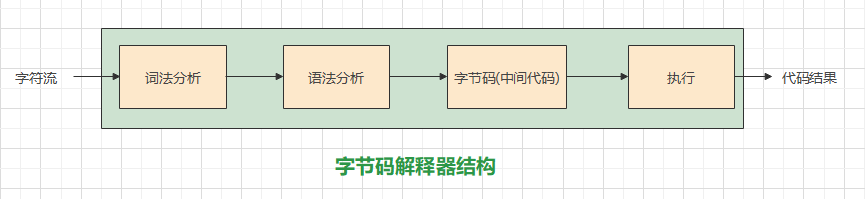

### 1.数据结构

**1.什么是哈希算法？**

> 哈希是一种时间复杂度为O(1)的查找算法。哈希算法是在数据与数据存储位置质检建立映射关系，通过映射关系一次比较找到数据。哈希使用时可能会产生冲突，可能多个数据映射到一个位置，此时可以用线性再探测法将数据向后映射或用冲突链表将数据链接起来。


**2.链表和数组的优缺点？**

> （1）数组在内存中连续存取，链表在内存中动态申请空间存取不一定连续。
>
> （2）数组查找元素效率高。插入删除元素效率低。需要提前申请固定大小内存，不灵活，可能越界，数据量小时可能浪费空间。
>
> （3）链表查找元素效率低。插入删除元素效率高。不用提前申请固定大小内存，灵活，不易越界。


**3.什么是时间复杂度和空间复杂度？**

> 时间复杂度指算法对于输入产生输出需要的步数，空间复杂度指算法对于输入产生输出需要的存储空间。时间复杂度，空间复杂度通常用大O函数，即低阶函数，表示上界。
> $$
> 0\leq g(n) \leq cf(n), 则g(n) \in O(f(n))
> $$


### 2.编译原理

**4.编译器工作流程是什么样的？**

> （1）进行词法分析，描述代码线性结构。生成词素集tokens；消除空格换行；记录行列信息便于错误处理。
>
> （2）进行语法分析，描述代码层次结构。例如生成抽象语法树AST描述层次结构，a = 1 + 2，AST类似该表达式的中缀表达式树。
>
> （3）进行语义分析，检查代码语义错误，在语法树上添加信息。例如不能出现1/0。在语法树上添加变量的逻辑地址。
>
> （4）中间代码生成。生成对程序代码更简洁描述的代码。
>
> （5）代码优化。优化中间代码，例如Vue的模板编译器中的优化器会寻找静态节点例如文本节点进行标记，在虚拟DOM的Diff算法中将不会被考虑。
>
> （6）代码生成。生成在某种环境下可执行的语言，例如Java或C#生成对应虚拟机下执行的语言。
>
> （7）交给后续处理的解释器执行代码。
>
> 


**5.解释器工作流程是什么样的？**

> （1）进行词法分析，描述代码线性结构。生成词素集tokens；消除空格换行；记录行列信息便于错误处理。
>
> （2）进行语法分析，描述代码层次结构。例如生成抽象语法树AST描述层次结构，a = 1 + 2，AST类似该表达式的中缀表达式树。
>
> （3）中间代码生成。生成对程序代码更简洁描述的代码。
>
> （4）执行代码
>
> 


**6.解释器和编译器的跨平台能力有何不同？**

> （1）编译器跨平台能力弱。编译器生成的代码如果是面对操作系统的，那么编译器跨平台能力弱。但如果编译器生成的代码是面向虚拟机或解释器的，那么跨平台能力强，只要对应平台安装解释器或虚拟机即可执行。但习惯称编译器跨平台能力弱。
>
> （2）解释器跨平台能力强。只要在对应平台安装了解释器就可以执行程序代码。


### 3.计算机网络

#### 计算机网络七层模型？

> **OSI七层模型：**
>
> > 比五层模型多出了表示层和会话层，可以看做是五层模型中的应用层拆成了三层来表示。细分之下，这三层的作用为：
> >
> > * 会话层：负责同一个应用程序内部通信（线程，进程之间）或负责不同应用程序之间的通信（前后端跨通信）。
> >
> > * 表示层：负责数据格式化，数据加密等。
> >
> > * 应用层：负责规定数据传输的规则（http协议规定了数据传输要有头部和载荷，头部content-type，缓存控制字段等等）
>
> **七层模型：**	
>
> > * 物理层
> > * 数据链路层
> > * 网络层
> > * 传输层
> > * 会话层
> > * 表示层
> > * 应用层
>
> **五层模型：**
>
> > * 物理层：
> >   * 物理信号的传输。
> > * 数据链路层：
> >   * 数据帧的传输。提供数据错误检测，一定程度的可靠传输（只能做到简单的单比特或多比特校验，没有传输层TCP那样丢包检查，拥塞控制）。
> >   * ARP协议：在局域网内广播，寻找指定mac地址的主机进行通信。
> > * 网络层：
> >   * IP数据报的转发和路由选择。
> >   * IP协议：定义设备间的寻址方式；
> >   * ICMP协议：传递错误信息。状态信息等内容，例如使用ping命令；
> >   * RIP协议，OSPF协议：内部网关路由选择协议
> >   * BGP协议：互联网路由选择协议
> >   * IGMP协议：组播协议
> > * 传输层：
> >   * 端到端（相同主机的不同端口或不同主机的端口）的数据传输。可以确保传输的可靠性。
> >   * TCP，UDP协议
> > * 应用层：
> >   * 应用程序之间的数据传输。
> >   * HTTP，SMTP协议等


#### TCP3次握手的过程是什么？

> 握手时参与字段有seq序列号，ack确认号，ACK确认位，SYN同步位，表示连接请求或连接接受。
>
> 第一次握手是客户端向服务端请求，SYN=1，seq=x。
>
> 第二次握手是服务端向客户端响应，SYN=1，ACK=1，ack=x+1，seq=y。
>
> 第三次握手是客户端向服务端响应，ACK=1，ack=y+1，seq=x+1。
>
> 
>
> **简述：**
>
> * 客户端向服务端请求
> * 服务端响应收到了请求
> * 客户端响应收到了服务端的响应


#### TCP为什么要三次握手？

> 如果两次握手可能导致建立多个连接。客户端发送的第一个请求连接被阻塞。客户端又发送一个请求连接先到达服务端，服务端响应并建立连接。在服务端又收到被阻塞的连接请求时又会响应，建立一个新的连接，是无效的。因此三次握手就是为了解决网络信道不可靠问题。
>
> 
>
> **简述：**
>
> * 原因就是网络请求可能丢失或阻塞。
>
>   * 一次握手不能保证服务端收到客户端的请求
>
>   * 两次握手不能保证客户端收到服务端的响应，客户端可能认为之前自己的请求失败了，进而重新请求
>
>   * 三次握手能保证让客户端得知自己的请求成功了，后续可以发送数据
>
> * 如何保证第三次握手被接受？
>   * 如果还需要客户端响应，那么就变成死循环了。因此服务端会等待一段时间，来判断是否接收到第三次握手。
> * 对安全通信的理解：
>   * 安全通信就是请求响应机制来确保客户端请求成功被接受，服务端响应被成功接受
>   * 安全通信最后一次请求或响应通常采用等待来确保是否成功接受


#### TCP4次挥手过程是什么？

> 挥手时参与字段有seq序列号，ack确认号，ACK确认位，FIN终止位。
>
> 第一次挥手时客户端向服务端请求，FIN=1，seq=u。
>
> 第二次挥手时服务端向客户端响应，seq=v，ack=u+1，ACK=1。
>
> 第三次挥手时服务端向客户端请求，FIN=1，seq=w，ack=u+1，ACK=1。
>
> 第四次挥手时客户端向服务端响应，seq=u+1，ack=w+1，ACK=1。
>
> 
>
> **简述：**
>
> * 客户端请求服务端断开连接
> * 服务端响应收到了请求
> * 服务端响应所有数据传递完毕
> * 客户端响应收到了服务端的响应，服务端可以不再使用这个连接


#### TCP为什么要四次挥手后等待？

> 如果三次挥手可能导致服务端无法关闭。客户端发送第一个关闭请求后不再传输数据，服务端响应。此时服务端可能还有数据未向客户端传输，因此继续传输。传输完毕后，服务端向客户端发起关闭请求。此时客户端必须像服务端发送确认，否则服务端不清楚客户端是否收到关闭请求。客户端发送确认后还需要等待一段时间，如果服务端收到确认则不会有其它行为，如果未收到确认，则会重发关闭请求。因此四次挥手后等待就是为了解决网络信道不可靠问题。
>
> 
>
> **简述：**
>
> 原因是网络请求可能阻塞或丢失，并且连接断开前可能有数据没有传递完
>
> * 一次挥手肯定不行，不能保证服务端接收到断开连接的请求
> * 两次挥手肯定不行，不能保证客户端接收到服务端的响应，客户端可能认为自己的请求失败了
> * 三次挥手不可以，和连接建立一样，客户端告知服务端收到了响应，可以断开数据。但是可能连接上有数据没传递完，因此服务端要通知客户端数据传递完毕。
> * 四次挥手可以。依据安全通信，客户端响应服务端的响应，然后不需要再有更多的请求和响应。最后一次等待一段时间避免挥手堵塞的问题即可。


#### TCP采取了哪些措施确保数据传输可靠？

> * **握手挥手**
> * **报文编号：** IP数据报有长度限制（MTU），因此TCP报文超长时需要分片传输。每一片都带有序号，保证接收后可以重组。
> * **确认重传：** 每一个传输的数据片都会进行接收后的确认，如果发送方没有接收到确认，那么将会重传。
> * **超时重传：** 每一个传输的数据片都会进行超时重传。
> * **数据校验：** 用数据校验和来判断传输过程中数据是否受损。
> * **滑动窗口：** 控制发送速率，避免造成拥塞或丢失
> * **拥塞控制：** 慢启动，拥塞避免，快重传。来调节传输速率，避免一直拥塞。


#### TCP和UDP有哪些区别？

> * **可靠性：** TCP连接传输数据可靠。UDP不可靠，UDP不需要建立或释放连接，也不关注数据是否在传输中丢失或损坏，只能保证数据以比TCP更快的速度传输。
> * **精简性：** TCP报文较长，头部有很多字段来确保TCP的可靠性。UDP头部很短，在传输等量数据时，需要传输的数据较少。
> * **连接关系：** TCP有握手挥手机制，确认机制，这使得它只能建立一对一地连接，并支持长连接一直传输。UDP没有建立和释放连接的机制，可以一对一建立连接，也可以一对多建立连接，只需要修改头部的IP地址为广播地址或多播地址即可。


#### TCP和UDP有哪些应用场景？

> **TCP：**
>
> >  **长时间，稳定可靠传输：** 文件传输，视频下载
>
> **UDP：**
>
> > **速度快，能接受一定不可靠因素：** 游戏，直播，隧道网络（里面包裹TCP）


#### HTTP请求有哪些常见的状态码？

> （1）200系列
>
> 200 Accepted：请求成功
>
> （2）300系列
>
> 304 Not Modified：协商缓存时缓存没有发生改变，可以继续使用
>
> （3）400系列
>
> 401 Unauthorized：需要身份验证，服务器拒绝证书
>
> 403 Forbidden：服务器拒绝执行
>
> 404 Not Found：资源未被服务器发现
>
> 405 Method Not Allowed：请求方法不被允许。例如，使用CORS跨域，使用非简单方法请求，会先发送一个预检请求preflight，使用options方法。此时服务端要设置字段Access-Control-Allow-Methods，如果客户端发起请求的方法不属于这些规定，那么可以返回405状态码（原生下自己决定返回什么状态码）。例如，SpringBoot中接口要求方法和客户端请求方法不一致，也返回405。
>
> （5）500系列
>
> 500 Internal Server Error：服务器运行错误
>
> 502 Bad Gateway：网关或代理服务器请求时，收到上游服务器无效响应（点击某些网站时遇到）


#### HTTP1.x（常用：HTTP1.1）有什么特点？

> **1.支持长连接：** 本来TCP就支持长连接，但是http1.0没有利用起来，每次发请求都要重新建立TCP连接。
>
> > * **注意：** 虽然说这是一个全双工通道，但是这条连接上每次只能存在一个请求或响应。不能同时有多个请求和响应存在。对于http2.0来说，支持多路复用，对此进行了改进。
> > * **实现：** 请求头或响应头添加connection表示请求长连接或同意长连接，timeout和max字段决定了时长和复用次数。
>
> **2.支持管道化/流水线传输：** 支持在前一个请求没有响应的时候再发起另一个请求。并且按顺序接收响应。（在浏览器调试栏里看起来是阶梯型）。
>
> > * **注意：** 由于TCP还是一条连接，所以即使在应用层看起来并行了，但是在传输层还是会存在队头阻塞，必须等前一个请求发出去之后才能发下一个请求。所以这只是节省了获取上一个请求的响应的这段时间。
> >
> > * **弊端：** 由于提到了“响应也是按序的”，因此一旦一条响应的速度非常慢，也会阻塞后续的响应。
>
> **3.支持断点重传和大文件分块传输：** 请求头增加了range字段支持断点重传，响应头增加了chunked字段，允许大文件在响应时分块。
>
> **4.区分虚拟主机：** 请求头增加了host字段来表明请求的主机。但是实际上可以根据url和端口来判断。并且host字段容易被中间人攻击。
>
> **5.增强了对缓存机制的支持：**
>
> > * **http1.0只支持：** 
> >   * **缓存行为控制：** 后端在响应中只能通过Expires控制过期时间，通过Pragma控制缓存行为。
> >   * **文件对比控制：** 前端if-modified-since请求缓存从某个时间后是否变化。后端支持last-modified通知前端上次修改时间。
> > * **http1.1支持：** 
> >   * **增强缓存行为控制：** Cache-Control支持比Pragma更丰富的缓存行为，请求和响应中都可以控制。max-age，min-age等跟多字段支持过期时间。
> >   * **增强文件对比控制：** 前端除了if-modified-since询问过期时间，还可以if-none-match询问指定文件是否过期。后端除了last-modified通知前端上次修改时间，还可以etag通知前端上次修改的文件（每修改一次文件，就会重新生成一个etag字符串）


#### HTTP2.0有什么特点？

> **1.多路复用：** 在一个TCP连接上可以同时发送多个http请求和响应（指的是支持多个请求，多个响应，多个请求或响应）。解决了应用层的队头阻塞问题，但是没有解决传输层TCP的队头阻塞问题。
>
> **2.头部压缩：** 对http的请求头和响应头大小进行压缩。
>
> **3.二进制分帧：** 将头部和数据载体部分划分为更小的单位，二进制帧。由于支持了多路复用，因此可以同时发送多个请求或响应，这时分帧后的片段可以直接发送。可能数据体比头部先到达。（如果不分帧，那么在应用层，必须一个个http请求或响应来发送）。
>
> **4.支持主动推送：** http2.0之前只能是客户端向服务端请求，之后服务端向客户端响应。http2.0支持服务端直接向客户端响应，推送信息。
>
> > * **场景1：** 一般用于长连接中的推送。例如用户提交了一个申请，这个申请需要领导实时审批，不能延后，那么用户不退出当前页面，当领导审批完成后服务端在该连接上返回另一个响应，告知用户申请是否通过，并在页面上进行提示。
> >
> > * **场景2：** 用于预解析的推送。如果后端对请求html做了优化，不安装引擎渲染文档，只是对文档做了预解析，把某些需要用的资源也探测到，之后一并返回给前端。由于http2.0的多路复用，可能会导致css返回的比html快，这样浏览器会自己先做缓存，等html来了之后再解析。这对前端是无感知的。（和服务端渲染的数据预装填有些类似）。
> >
> > * **错误场景：** 谈到主动推送，不代表是无条件，无前提的推送。不能用于版本更新迭代的提示信息推送。例如用户在登录页面后，需要检查本地版本，如果过低则提示新版本迭代，通常全部由前端控制。如果使用服务端推送，推送的前提是依赖前端ajax技术和服务端端建立的长连接，不可避免再在JavaScript里发起一条请求，所以这就没有意义了。
> >
> > * **示例：** 使用fetch来接收推送。原理是http2.0支持多路复用，在我们获取其中一个响应后还可以获取后续的响应，只需要传递response即可。
> >
> >   ```javascript
> >   // 发起 fetch 请求
> >   fetch(url)
> >     .then((response) => {
> >       // 获取第一个响应体的数据
> >       return new Promise((resolve) => {
> >           response.text().then(data => {
> >               resolve({
> >                   data,
> >                   response
> >               })
> >           })
> >       });
> >     })
> >     .then(({ data, response }) => {
> >       // 处理第一个响应体的数据
> >       console.log(data);
> >           
> >       // 当有新的推送数据到达时，继续获取响应体的数据
> >       response.text()
> >         .then(function(newData) {
> >           // 处理新到达的推送数据
> >           console.log(newData);
> >         });
> >     });
> >   ```
>
> **5.支持流级别的流量控制：** http2.0中的流对应着一个请求和响应的传输，使用http2.0同时发起5个请求会建立5条流。这样支持双向并且多路复用的信道的流量控制要比TCP的流量控制复杂许多。http2.0控制流量会精确到流，不同流之间不干扰。


#### 解释一下对称加密算法和非对称加密算法？

> 这两个算法是相辅相成的。
>
> **对称加密算法：** 
>
> > 对称加密算法的加密和解密过程都是对称密钥配合数据完成，该算法通常用于网络通信的数据加密解密，我们应尽量保证对称密钥的安全，并尽量保证其不被除了通信双方之外的人获取。因此就引出了非对称加密算法，非对称加密算法可以帮助保证对称密钥的安全。
>
> **非对称加密算法：**
>
> > 非对称加密算法的加密依赖公钥，解密算法依赖私钥。公钥是透明的，直接在网络上传输。该算法通常用于网络通信并配合对称加密使用，通常是先通过非对称加密算法传递对称密钥，然后再用对称加密算法传输数据。


#### 对称加密算法和非对称加密算法有什么常见应用场景？

> **HTTPS中TLS的建立：**
>
> > TLS连接的建立需要先用非对称加密算法传递对称加密的对称公钥，之后再采用对称加密传输数据
>
> **忘记密码时的展示：**
>
> > 用户设置密码时先用非对称加密密码，然后再用https传输，即使被中间人截获并破解，也只能获取密文。用户如果忘记密码，那么请求展示老密码，服务器先用非对称加密算法的私钥解密，再用https传输密码明文。缺点是回传密码明文时如果被中间人截获，那么就G了，因此目前用户忘记密码时，大家都是让老密码作废，通过手机，邮箱等验证用户身份后让用户重新认证身份。


#### 常见的对称加密算法和非对称加密算法有什么（了解）？

> **非对称加密：**
>
> > RSA（项目中用到），ECC，DSA，Diff-HellMan（TLS等协议应用）
>
> **对称加密：**
>
> > AES，DES，3DES，BlowFish


#### HTTPS中的证书是什么（了解）？

> **文件：**
>
> > https中的证书是一个文件，通常是.cer，.pem，.crt格式的文件。通常是一个二进制文件，如果是文本文件，那么通常使用base64进行编码。
>
> **存储文件：**
>
> * 公钥
> * 证书签发机构的签名（该机构的相关信息）
> * 证书的过期时间


#### TLS和SSL的区别（了解）？

> TLS是SSL的升级版本，TLS和SSL是同一个协议的不同版本，目前我们通常使用TLS协议。


#### TLS建立过程中客户端如何校验服务端提供的证书？

> 证书的校验需要校验证书过期时间和证书签发机构的信息，通常浏览器或操作系统会内置证书的公钥。客户端会根据这些公钥和服务端发来的证书公钥进行对比，进行证书合法性验证。


#### TLS的建立过程是什么？

> 和TCP相比，TCP的建立关注于可靠性，必须有确认重传，超时重传机制。TLS的建立关注于数据加密解密和数据传输方式。
>
> * **身份验证：** 服务端发送证书给客户端验证。验证通过后客户端生成随机内容作为会话的对称密钥，通过非对称加密传递给服务端。服务端获取后用私钥解密获取会话密钥。
> * **会话开始：** 使用对称加密传输数据。 