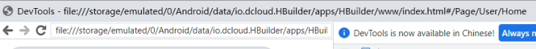
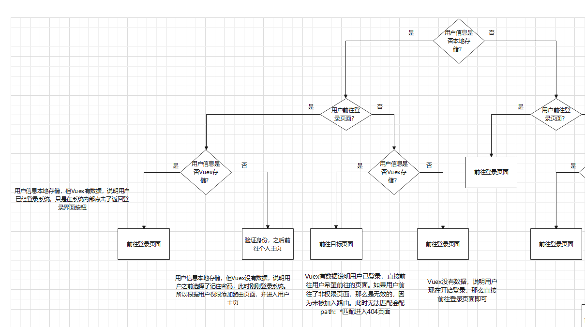
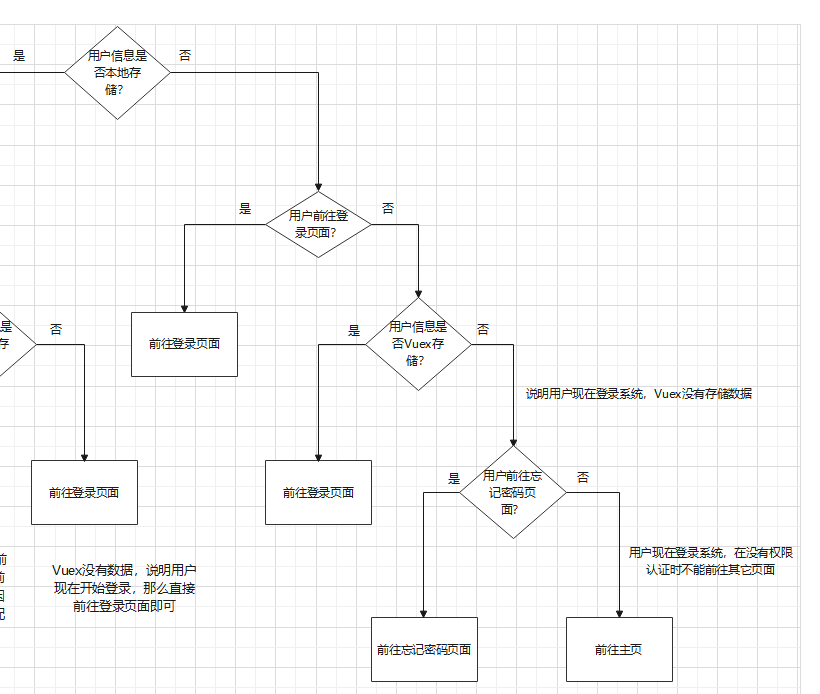

### 1.打包成webAPP时遇到的问题

#### 1.1 路由模式问题

在history模式下尝试各种设置，但webAPP的根路径为空，导致加载资源失败。使用hash模式不存在这种问题。

**（下面是history模式的路径和hash模式的路径对比）**




#### 1.2 请求资源路径问题

在vue.config.js中设置publicPath，在生产环境下不论是webAPP还是服务端部署，都要做此配置。publicPath表示打包后加载资源的路径是相对路径，在index.html所在文件夹下进行路径查询，即dist文件夹下。使用默认publicPath则会直接在域名后进行路径查询。

```javascript
publicPath: './',
```

#### 1.3 跨域问题

webAPP不存在跨域问题，直接使用完整的URL发起HTTP请求

#### 1.4 物理按键问题

监听物理按键我尝试在window上监听popstate事件，当回退时则pushstate一个空状态抵消物理按键回退，使用闭包判断1秒内连续回退事件发生时则不进行抵消。发现在安卓11上无法监听该事件。采取措施是引入github上的Mui来监听物理按键回退。

#### 1.5 适配问题

选用了@media媒体查询来给不同尺寸设备设计不同布局方案。

```css
@media screen and ( max-width: 1000px ) // max-width表示小于1000px时
@media screen and ( min-width: 1000px ) // min-width表示大于1000px时
```


### 2.权限管理时遇到的问题





* **（记住密码问题）** 考虑本地是否保存用户信息，在路由守卫中判断如果保存了则跳转到个人主页。
* **（多组件共享个人信息问题）** 后续很多组件需要使用用户信息，将用户信息保存到Vuex中。
* **（不同权限页面问题）** 把路由分为恒定路由和异步路由，登录过程中根据用户权限和路由配置项meta中的permission字段来选择路由加入恒定路由。
* **（侧边栏页面多级展开）** 使用函数式递归组件实现侧边栏多级展开。
* **（用户越界访问问题）** 用户越界访问不存在的路由或无权限的路由，用path:"*"捕获返回404界面。如果在登录页面访问异步路由，那么只会返回到主页。


### 3.侧边栏子页面多级展开是怎么实现的？

#### 3.1 函数式组件

函数式组件特点是不对应Vue实例，只能通过props接收数据。优点是性能好，不会参与响应式状态管理和虚拟DOM更新。

#### 3.2 组件递归

组件递归指在组件中使用组件name调用自己。

#### 3.3 设计流程

使用antd的a-menu，a-sub-menu标签提供样式。

使用函数式递归组件，递归边界是页面没有子页面。

递归函数是页面有子页面时，用当前组件来表示子页面。

实现时用v-for表示循环，用v-if表示分支判断。


### 4.Vuex刷新丢失问题

* **（刷新丢失原因）** Vuex存储在浏览器运行时申请的内存中，在浏览器刷新时会清空这段空间。
* **（解决方案）** 监听刷新事件，刷新前使用浏览器存储API存储到本地。刷新后在路由守卫中恢复Vuex。


### 5.JSON序列化失效问题

* **（失效原因）** JSON序列化并非能序列化所有类型，例如循环引用，Date对象等。在项目中遇到了序列化循环引用的问题。
* **（解决方案）** 解决方案是可以使用weakMap将属性作为键来记录，如果某次发现某属性在weakMap对应的值不为undefined，则直接返回，不序列化。解决方案和对象深拷贝一样。


### 6.Nginx配置问题

#### 6.1 什么是正向代理和反向代理？

* 维基百科解释是：正向代理是客户端和其它所有服务器的代理者，反向代理是客户端和要代理的服务器的代理者。

* 正向代理指的是代理服务器对客户端负责，只要是连接到代理服务器的客户端，代理服务器就会对其所有请求代理转发。例如，用代理服务器访问外网；代理服务器隐藏客户端。
* 反向代理指的是代理服务器对服务端负责，只有客户端要访问被代理的服务端，代理服务器才会对客户端进行代理转发。例如，负载均衡，只有访问对应网站才会负载均衡。

#### 6.2 项目中Nginx代理服务器如何配置？

在nginx.conf中的server中进行配置。

（1）修改location /用于指定首页，添加try_files $url $uri / / index.html用于history模式路由访问无效路径时返回首页，其实也可以在路由配置项中用通配符*匹配无效路由，自定义404页面。

（2）添加location /api用于反向代理，表示前端发出的所有请求都是/api开头，其中配置proxy_pass到应用服务器的ip地址。

（3）配置Gzip压缩，设置压缩级别，哪些资源可以压缩，对IE6以下的浏览器禁用。

```nginx
 server {
    listen       80;
    server_name  localhost;
    # compression-webpack-plugin 配置
    # 开启gzip压缩
    gzip on;
    # 低于1k的资源不压缩
    gzip_min_length 1k;
    # 压缩级别1-9，压缩机别越大压缩率越高
    gzip_comp_level 9;
    # 压缩哪些类型的资源
    gzip_types text/plain application/javascript application/x-javascript text/css application/xml text/javascript application/x-httpd-php image/jpeg image/gif image/png;
    # 是否添加“Vary: Accept-Encoding”响应头
    gzip_vary on;
    # 配置禁用 gzip 条件，支持正则，此处表示 ie6 及以下不启用 gzip（因为ie低版本不支持）
    gzip_disable "MSIE [1-6]\.";
    location / {
        root   /usr/share/nginx/html;
        index  index.html index.php;
        try_files $uri $uri/ /index.html;
    }	
    location /api {
        proxy_pass http://39.96.175.246:8051/api;                                 
    }	
}
```


### 7.项目中的节流与防抖问题

对可能频繁点击的事件包裹一个节流防抖函数，函数使用闭包机制存储上次点击时间。在本次点击时判断当前点击时间和上次点击时间间隔，决定是否向后端发送网络请求，同时更新上次点击时间。

```javascript
export default function(func, time) {
    let pre = Date.now()
    return function(...args) {
        let now = Date.now()
        if(now - pre < time) {
            pre = now
            console.log("点击过快")
            return
        } else {
            func(...args)
            pre = now
        }
    }
}
```


### 8.项目中chunk-vendor.js过大导致下载速度慢的问题

（1）项目打包后将外部依赖，即node_modules中引用的模块打包进chunk-vendor.js，引入依赖过多导致该文件较大，从而导致了首次加载速度过慢。解决方案是将chunk-vendor.js压缩成.gz文件，浏览器可以直接解析.gz压缩文件。

（2）在项目中引入了compression-webpack-plugin插件用于压缩，在vue.config.js中配置configureWebpack，在plugins中指定gz算法进行压缩。

```javascript
// 打包解决chunk-vendor.js第三方依赖太大的问题，打成浏览器能解析的压缩包
configureWebpack: {
    plugins: [
        new webpack.IgnorePlugin(/^\.\/locale$/, /moment$/),
        // 下面两项配置才是 compression-webpack-plugin 压缩配置
        // 压缩成 .gz 文件
        new CompressionPlugin({
            filename: '[path][base].gz',
            algorithm: 'gzip',
            test: /\.js$|\.css$|\.html$/,
            threshold: 10240,
            minRatio: 0.8
        })
    ]
}
```

（3）在nginx代理服务器中的http的server中配置开启gzip压缩，指定哪些文件可以压缩，并且禁用IE6以下浏览器压缩，因为浏览器不支持解析.gz压缩文件。

```nginx
 server {
    # compression-webpack-plugin 配置
    # 开启gzip压缩
    gzip on;
    # 低于1k的资源不压缩
    gzip_min_length 1k;
    # 压缩级别1-9，压缩机别越大压缩率越高
    gzip_comp_level 9;
    # 压缩哪些类型的资源
    gzip_types text/plain application/javascript application/x-javascript text/css application/xml text/javascript application/x-httpd-php image/jpeg image/gif image/png;
    # 是否添加“Vary: Accept-Encoding”响应头
    gzip_vary on;
    # 配置禁用 gzip 条件，支持正则，此处表示 ie6 及以下不启用 gzip（因为ie低版本不支持）
    gzip_disable "MSIE [1-6]\.";
}
```


### 9.项目中百度地图的使用问题

百度地图是在index.html中引入，虽然有Vue组件化的百度地图接口，但是功能不太全因此没有使用。百度地图相关操作主要归纳为三点，第一是向百度地图添加点和路线，用于路线规划和地点显示，第二是通过百度地图接口获取经纬度坐标用于地点选择和路线规划，第三是使用百度地图的地点搜索接口，快速选择用户期望的地址。


### 10.项目中Antd的使用问题

主要使用AntDesignVue提供的样式，主要使用了Antd提供的表格，表单，消息通知，菜单栏等组件


### 11.项目中Echarts的使用问题

在项目中使用Echarts主要是修改options配置项来绘图，绘制有树状图，条形图，柱状图。


### 12.Docker使用问题

#### 12.1 什么是Docker

（1）Docker主要是提供了一种容器机制。容器机制将容器内外的环境隔离开，并且容器应指定镜像作为容器中程序运行的环境。

（2）Docker容器类似于虚拟机，但Docker容器运行只需要指定镜像，对内存的需求远少于虚拟机。


#### 12.2 使用Docker的原因

（1）Docker提升了项目的跨平台能力。如果想更换服务器，那么不需要重新配置项目运行环境，只需要在新的服务器上安装Docker，并使用对应的Docker镜像即可。

（2）Docker资源利用率高。Docker容器类似于虚拟机，但是Docker容器运行只需要指定镜像，不需要像虚拟机一样模拟操作系统。


#### 12.3 项目部署时常用的Docker指令

（1）docker run创建容器并运行指令。-p 外部端口:内部端口 端口映射。-d xxx 指定容器运行的镜像。-v 主机文件 容器中文件 进行文件映射。

（2）docker ps查看当前正在运行的容器。-a 列出所有容器，包括没有运行的容器。

（3）docker build创建镜像指令。-t xxx指定镜像名称 . 创建镜像。

（4）docker start启动容器，docker stop停止容器运行

（5）docker exec -i -t 容器名 /bin/bash 进入容器内容，项目中用于调试


#### 12.4 Docker部署项目的流程

（1）对于前端项目，在远程linux服务器上先下载了Nginx的Docker镜像。采用挂载运行，在服务器本地创建文件夹存放项目内容，并配置nginx.conf。使用docker run指令指定Nginx镜像运行容器，将文件夹挂载到容器对应文件夹中，好处是项目需要修改时直接在服务器本地修改，可以直接更新docker容器中的内容。

（2）对于后端项目，是springboot项目，自带tomcat服务器。采用编写镜像运行，在服务器本地编写DockerFile文件，并用docker build指令创建镜像。最后使用docker run指令创建容器指定该镜像进行运行。


### 12.SpringBoot使用问题

#### 12.1 SpringBoot中三层模型

* 描述数据接口：

  @Tablename（数据表名）类描述数据库接收的数据

* 数据访问层：

  在类前加@Mapper什么也不加。下面写接口interface，接口里写增删查改的方法，并不实现

* 业务逻辑层：

  在类前加@Service，下面写类继承对应的接口，实现接口的方法

* 表示层：

  在类前加@RestController，调用业务层的方法与前端进行交互，在方法前加@getmapping或postmapping表示前后端数据接口地址

#### 12.2 连接数据库方法

（1）在pom.xml中添加mysql连接的依赖，用maven下载相关依赖的包。

（2）在application.yml中配置数据库地址，登录名，登录密码等参数。


### 13.基于JavaScript的C语言编译器

编译器实现了词法分析和语法分析部分。

（1）词法分析部分输入源代码，输出token词素集。token记录了关键字，自定义变量等信息；清除了回车换行空格和注释；记录了每个token所在的行列号便于抛出错误。最后输出的token词素集描述了代码的线性关系。

（2）语法分析采用LR1分析自底向上进行语法分析建立抽象语法树，因为自顶向下建立抽象语法树对文法有比较高的要求，并且C语言文法是自己设计的，官网上只有帮助理解的C语言文法并不适用于这样自底向上或自顶向下分析，因此自己设计了满足LR1分析的C语言局部文法。在LR1分析过程中，会根据action表和goto表来判断是否符合C语言语法，不符合则依据action表做出修改预测并继续编译，直到不能做出修改预测或完成编译才抛出错误。最后输出的抽象语法树描述了代码的层次结构。

（3）最后使用Echarts做了抽象语法树的可视化


### 14.物流仓储管理系统

（1）物流仓储管理系统主要分为两部分功能，第一是一个面向中小物流企业的管理平台，涉及订单，人事，仓库，调度管理。第二是一个面向用户的物流下单平台，用户可以在该平台下单寄件，实时查询物流运输情况。

（2）项目中使用了百度地图接口来实现物流调度算法，调度路线可视化，仓库地址可视化，收寄件地址选择等模块。使用百度地图主要是向地图中添加点，线做路线规划和仓库可视化，另外就是利用百度地图获取经纬度信息用于调度算法的实现，最后还有利用搜索接口便于用户快速搜索找到目标地点。

（3）项目中使用异步路由来进行权限管理，判断用户身份后才在路由对象中加入可访问的路由页面。

（4）项目中使用路由守卫来实现记住密码快速登录，在路由守卫中判断本地存储是否有用户密码，判断vuex来判断用户登录状态，从而决定是否快速登录。

（5）项目中使用路由通配和异步路由来避免用户越界访问页面。由于已经使用了异步路由，所以路由对象中只有用户可访问的路由对象，但是用户输入了非自己权限的页面地址在history路由模式下会跳转到空页面。因此在恒定路由中用path:*来匹配所有非法路径，返回自定义的404页面。其它解决方法有改用hash模式或在nginx中配置try_files字段。

（6）项目中实现了多级菜单栏，便于用户快速到达自己权限可以访问的页面。实现是配合权限管理中的异步路由实现，使用了ant-design-vue的菜单组件样式，最后使用vue的函数式组件和递归组件实现多级菜单栏。

（7）项目中多数组件需要共享用户信息，使用vuex在众多兄弟组件间贡献用户信息。并使用本地存储来解决vuex刷新后丢失问题。


### 15.建筑咨询管理系统

建筑咨询管理系统我主要参与了项目维护。

（1）修改Echarts可视化中options选项配置错误问题。例如展示区域优先，树状图节点过多看不清楚，解决方案是修改options选项，使树状图可以放大缩小展示，并提前设置树状图高度超出一定范围后某些节点不展开。

（2）添加无人机飞控系统。无人机飞控系统用到了百度地图接口。主要运用百度地图在地图上添加点线标记，添加控制界面。
