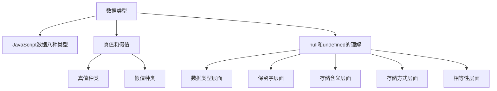
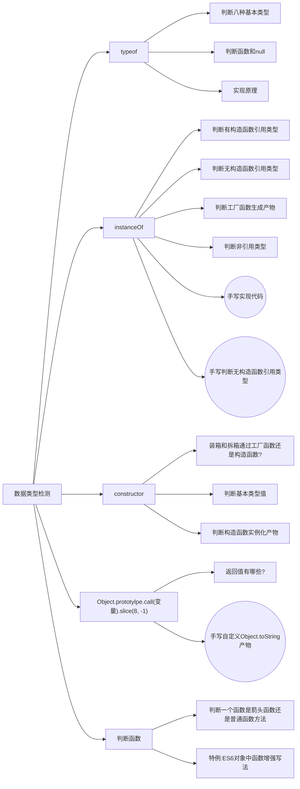
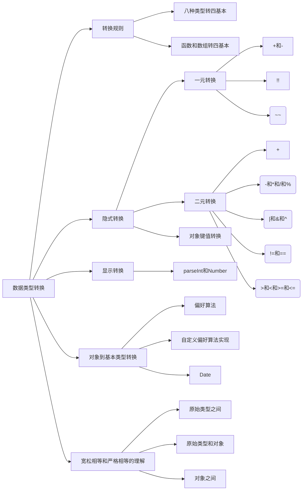

# JavaScript

## 1.数据类型

### 数据类型基础

### 数据类型检测

### 数据类型转换

### 数据类型存储

### 数据类型拷贝

## 2.原型链

## 3.函数闭包

## 4.ES规范

### ES2015

### ES2016

### ES2017

### ES2018

### ES2019

### ES2020

### ES2021

### ES2022

### ES2023

### ES2024

## 5.面向对象编程

## 6.函数式编程

## 7.异步编程

## 8.设计模式

## 9.垃圾回收

## 10.IO操作

### Buffer

## 11.Worker

### 线程池

## 12.WebAssembly

## 13.位运算技巧