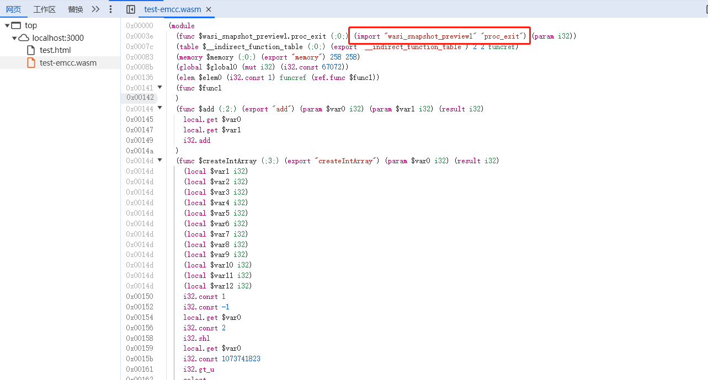
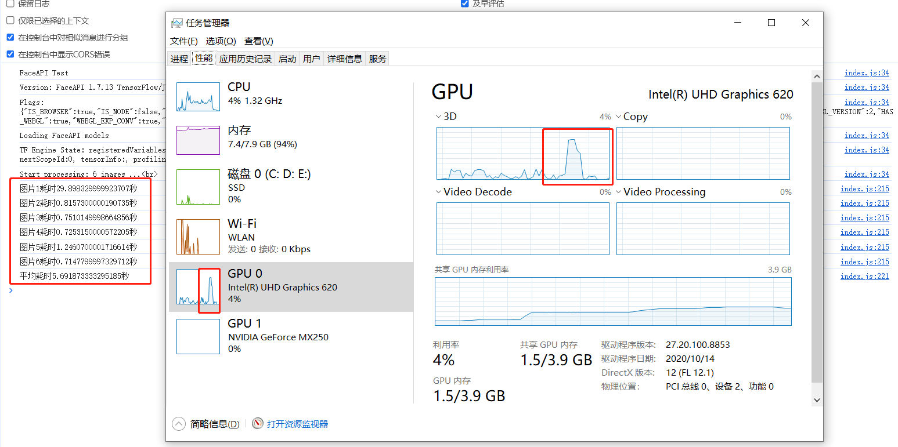
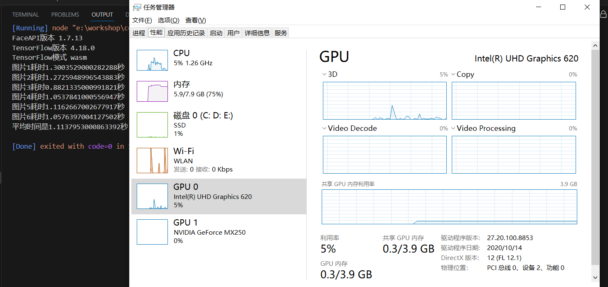
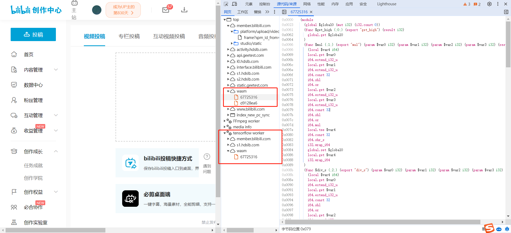

## 1.WebAssembly

### 1.1 指令集

> <font color=green>**概念：二进制编码集合。**</font> 
>
> 依据计算机组成原理和计算机概论，指令集是一组二进制编码。
>
> <font color=green>**作用：控制硬件。**</font>
>
>  这些二进制指令直接作用于硬件电路，控制硬件完成指定操作。
>
> * 例如：控制数据进入某个寄存器，控制数据做位运算。
>
> <font color=green>**分类： 按CPU分类。**</font>
>
> 不同架构的CPU有不同的指令集。
>
> * 例如：x86和arm架构CPU指令集不同。

### 1.2 WebAssembly

> <font color=green>**概念：低级静态程序语言。**</font> 
>
> WebAssembly可以看做是针对于浏览器的一组指令集。它是低级程序语言。
>
> * 例如：它和汇编语言类似，只不过不同CPU的汇编语言不同，但是不同浏览器的WebAssembly都相同。
>
> <font color=green>**作用：在浏览器中运行。**</font> 
>
> 除了JavaScript外另一种可以直接在浏览器中运行的语言。
>
> * 例如：因为WebAssembly可以在浏览器中运行，因此C/C++，Rust等语言选择把它们编译成WebAssembly在浏览器运行。
>
> <font color=green>**特点：效率高。**</font>
>
> 不需要通过高级程序员的解释器或编译器，是编译产物，免去这个耗时操作。
>
> * 例如：高级程序语言的一系列操作可以被汇编级语言优化成几次简单操作，例如优化后简单将数据在寄存器间移动就可能完成多个语句表示的操作。


## 2.优化密集计算型业务

### 2.1 编译流程概述

> <font color=green>**流程背景**</font>
>
> 编译C/C++指定函数到wasm文件，为JavaScript提供计算密集型任务的高效解决方案。
>
> <font color=green>**流程概述**</font>
>
> 按照emscripten官方文档安装编译器并对C/C++打包。
>
> <font color=red>**注：也可以编译整个C/C++文件到wasm，本流程只导出函数**</font>
>
> * **激活环境：** 运行 ```emsdk_env.bat``` 和 ```emsdk_env.sh``` 激活编译器环境
>
> * **编译：** 运行 ```emcc test1.cpp -s EXPORTED_FUNCTIONS=_fib,_add -O3 -o fib-emcc.wasm``` 编译成wasm文件
>
> <font color=green>**命令说明**</font>
>
> <font color=red>**注：官网上提到过导出cwrap，ccall来给JavaScript调用导出的C/C++函数。但是安装最新版emscripten发现没用。**</font>
>
> * **```-s EXPORTED_FUNCTIONS=```** 指明导出的C/C++函数，函数名前需要加下划线
> * **```-O```** 指明编译优化方案，和g++中 ```-O``` 指令含义相同

### 2.2 编译流程详解

#### 2.2.1 C/C++部分

> <font color=green>**extern "C"连接指示符：**</font> 
>
> 按C语言规则来处理函数名称。Emscripten要求导出C++函数时必须有该操作。
>
> <font color=green>**main函数：**</font>
>
> Emscripten要求导出C/C++函数时，即使不导出main函数也要必须写main函数。
>
> <font color=green>**开辟内存和写入内存函数：**</font>
>
> JavaScript传入引用类型给Wasm模块时直接传入会失败。因为C++中引用类型需要指明指针地址，如果JavaScript需要传入引用类型，需要在Wasm模块中开辟一块空间写入传入的参数，这样C++才能访问到。如果传入普通类型不需要考虑开辟空间。
>
> ```c++
> #include<algorithm>
> 
> extern "C" {
> 	// 将导出给JavaScript：a+b函数
> 	int add(int a, int b) {
> 		return a + b;
> 	}
> 	
> 	// 将导出给JavaScript：开辟内存空间函数
> 	int* createIntArray(int length) {
> 		return new int[length];
> 	}
> 	// 将导出给JavaScript：写入内存空间函数
> 	void writeToArray(int* arr, int index, int value) {
> 		arr[index] = value;
> 	} 
> 	
>     // 将导出给JavaScript：快排函数
> 	int* qSort(int* arr, int length) {		
> 	    std::sort(arr, arr + length);
> 	    return arr;
> 	}
> 
>     // 将导出给JavaScript：斐波那契数列函数
> 	int fib (int n) {
> 	  if (n <= 0) return 0;
> 	  if (n <= 2) return 1;
> 	  return fib(n - 2) + fib(n - 1);
> 	}
> }
> 
> 
> int main () {}
> ```

#### 2.2.2 JavaScript部分

> <font color=green>**读取WebAssembly文件：**</font>
>
> 读取WebAssembly文件方法有很多，经过若干版本迭代，使用MDN最新推荐的方法 ``` WebAssembly.instantiateStreaming(fetch(fileName), importObject)``` 读取
>
> <font color=green>**传入C/C++模块初始值：**</font>
>
> 类似node运行时可以传参 ```node build.js --env=development``` 一样，C/C++编译后的wasm模块也需要传参。传参的标准可以参考WASI（专门为WebAssembly设计的）规范。传参通过读取wasm模块的第二个参数传递，是否传参由wasm模块决定。
>
> 由下图圈出部分可知需要给wasm模块传递什么样的参数。
>
> <font color=red>**注：直接打开wasm文件打不开，都是二进制。可以通过浏览器查看对应的浏览器层面的汇编语言。**</font>
>
> <font color=red>**注：下面的传参很简单。如果在C/C++引入了更多的模块，例如 ```#incldue<iostream>``` 需要传入更多初始参数。**</font>
>
> 
>
> <font color=green>**传递引用到wasm模块：**</font>
>
> 下述代码在调用wasm的 ```qSort``` 时不能直接把一个JavaScript数组传递过去，这样会导致C/C++的快排函数读取失败。传递引用时需要有C/C++编程思想：
>
> * **传递指针：** 首先肯定要传递指针，指针的值实际是地址，所以需要传数值。
> * **申请空间：** 需要在wasm模块中为函数形参申请内存空间，并将需要排序的数组写入。
>
> <font color=green>**读取引用从wasm模块：**</font>
>
> 读取引用类型和传递引用类型类似，都要以指针为中心。
>
> * **读取指针：** ```qSort``` 函数返回指针，其实就是数值，需要我们从wasm模块的内存中读取对应地址内容。
> * **转换为JavaScript对象：** 转换为JavaScript对象一般利用 ```Buffer``` 类实现，下面文件接收 ```int``` 数组，因此使用 ```Int32Array``` 类转化为JavaScript对象。
>
> ```javascript
> <html>
>   <head>
>     <meta charset="utf-8" />
>   </head>
>   <body>
>     <script>
>       // 初始化随机数据
>       const handleInitData = (length) => {
>         return Array.from({ length }).map(() =>
>           Math.floor(Math.random() * length)
>         );
>       };
> 
>       // 加载WebAssembly文件
>       const handleUseWebAssembly = (fileName) => {
>         // C++运行时传入的参数（具体传入什么变量需要等wasm生成后再分析。）
>         const importObject = {
>           wasi_snapshot_preview1: {
>             proc_exit: function (code) {
>               console.log(`Process exited with code ${code}`);
>             },
>           },
>         };
>         // 利用fetch加载wasm文件
>         return WebAssembly.instantiateStreaming(fetch(fileName), importObject);
>       };
> 
>       // 把数据传给wasm模块
>       const handlePostData = (result, initData) => {
>         // 获取C++提供的函数
>         const {
>           // 在C++所在的wasm中申请数组内存
>           createIntArray,
>           // 在C++所在的wasm中向某个内存地址写入数据
>           writeToArray,
>         } = result?.instance?.exports;
> 
>         const length = initData.length;
> 
>         // 在wasm申请一片内存空间，用于存储数组
>         const arrPointer = createIntArray(length);
>         // 向刚刚申请的内存空间中写入数据
>         Array.from({ length }).forEach((_, index) =>
>           writeToArray(arrPointer, index, initData[index])
>         );
> 
>         return arrPointer;
>       };
> 
>       // 排序
>       const handleSort = (result, initData, dataPointer) => {
>         const length = initData.length;
> 
>         const startJS = performance.now();
>         // sort默认转成字符串排序，需要转回数值再排序
>         initData.sort((a, b) => Number(a) - Number(b));
>         const endJS = performance.now();
>         console.log(`JS排序${length}条数据用时${(endJS - startJS) / 1000}秒`);
> 
>         const { qSort } = result?.instance?.exports;
>         const startC = performance.now();
>         const newPointer = qSort(dataPointer, length);
>         const endC = performance.now();
>         console.log(`C++排序${length}条数据用时${(endC - startC) / 1000}秒`);
> 
>         return newPointer;
>       };
> 
>       // 输出排序结果
>       const handlePrint = (result, length, pointer, jsResult) => {
>         const data = new Int32Array(
>           // Buffer对象，表示获取WebAssembly文件使用的内存空间
>           result.instance.exports.memory.buffer,
>           pointer,
>           length
>         );
>         const cResult = Array.from(data);
> 
>         console.log("JavaScript排序结果是", jsResult);
>         console.log("C++排序结果是", cResult);
>       };
> 
>       (async () => {
>         // 初始化10万条随机数用于排序
>         const length = 1e6;
>         // 要导入的WebAssembly文件
>         const fileName = "./test-emcc.wasm";
> 
>         // 初始化数据
>         const initData = handleInitData(length);
>         // 读取WebAssembly文件
>         const result = await handleUseWebAssembly(fileName);
>         // 把初始化数据传给WebAssembly文件
>         const dataPointer = handlePostData(result, initData);
>         // 排序
>         const newPointer = handleSort(result, initData, dataPointer);
>         // 输出排序结果
>         handlePrint(result, initData.length, newPointer, initData);
>       })();
>     </script>
>   </body>
> </html>
> ```

#### 2.2.3 Web服务器部分

> 上面直接引入wasm文件会有同源限制问题。下面用原生node实现一个简单的web服务器解决该问题。
>
> ```javascript
> let fs = require("fs");
> function read(path, res) {
>   fs.readFile(path, function (err, data) {
>     if (err) console.log(err);
>     else if (path.slice(-2, path.length) === "js") {
>       res.writeHead(200, {
>         "Content-Type": "text/javascript",
>       });
>       res.write(data);
>       res.end();
>     } else if (path.slice(-4, path.length) === "html") {
>       res.writeHead(200, {
>         "Content-Type": "text/html",
>       });
>       res.write(data);
>       res.end();
>     } else if (path.slice(-4, path.length) === "wasm") {
>       res.writeHead(200, {
>         "Content-Type": "application/wasm",
>       });
>       res.write(data);
>       res.end();
>     }
>   });
> }
> require("http")
>   .createServer(function (req, res) {
>     if (req.url === "/favicon.ico") res.end();
>     else read("." + req.url, res);
>   })
>   .listen(3000, function (err) {
>     if (err) console.log(err);
>     else console.log("运行成功");
>   });
> 
> ```

### 2.3 计算结果

> <font color=green>**实验结果阐述**</font>
>
> 输出结果表示wasm模块执行效率要比JavaScript效率高了一倍以上，但是这只是一个简单的使用。网上有其它实验表示平均基于C/C++的wasm模块的效率要比JavaScript高30%~50%，但wasm相比C/C++直接编译后再生成exe文件在windows上运行效率低30%。
>
> 
>
> <font color=green>**实验结果概述**</font>
>
> 运行速度：<font color=blue>**JavaScript > 基于C/C++的wasm模块 > 原生环境的C/C++**</font>

### 2.4 特点分析

> <font color=green>**效率高**</font>
>
> 虽然没有让性能成倍提升，但是提升30%~50%的性能还可以让人接受。
>
> <font color=green>**编译过程参考少**</font>
>
> C/C++编译成wasm时发现Emscripten的文档很老，并且网上参考博客也很古老，参考内容不多，出错不好排查。
>
> <font color=green>**需要前端直面指针和内存**</font>
>
> 相互交换引用类型时，使用JavaScript不得不直面指针和内存操作。和JavaScript设计初衷不符。


## 3.优化Tensorflow

### 3.1 优化流程概述

> <font color=green>**流程背景**</font>
>
> 为了缓解服务器压力，需要将某些模块的人脸识别功能迁移到前端完成。目前使用了基于tensorflow的 ```face-api``` 相关库和模型实现，考虑使用多线程和wasm做进一步优化。
>
> <font color=green>**流程概述**</font>
>
> 还没有分析和实现完，暂时用 ```face-api``` 的测试仓库举例。
>
> <font color=green>**注意事项**</font>
>
> * **跨环境对比：**  ```face-api``` 中只提供了node环境的wasm模块，对于浏览器环境没有给出wasm模块。因此只用node下的wasm模块和浏览器的普通模块做对比。
> * **不在node环境下对比：** 不用node环境作对比是因为需要安装的包太麻烦，里面的tensorflow并不是全部由JavaScript实现，还需要安装精确版本的python和C/C++的编译器。
> * **对比存在差异：** ```face-api```提供的node下的wasm版本并不支持使用GPU加速，但是浏览器环境下支持自动使用GPU加速。因此对比时会考虑到GPU加速带来的影响。

### 3.2 优化流程详解

#### 3.2.1 浏览器部分

> 基于demo中的index.js进行修改（下面只是截取了修改的部分）。
>
> <font color=red>**注：计算时间时考虑YOLO目标检测和face-api人脸识别两个神经网络的时间。**</font>
>
> ```javascript
> for (const img of samples) {
>     document.body.appendChild(document.createElement("br"));
>     const canvas = await image(img);
>     try {
>         const start = performance.now();
>         const dataTinyYolo = await faceapi
>         .detectAllFaces(canvas, optionsTinyFace)
>         .withFaceLandmarks()
>         .withFaceExpressions()
>         .withFaceDescriptors()
>         .withAgeAndGender();
> 
>         const dataSSDMobileNet = await faceapi
>         .detectAllFaces(canvas, optionsSSDMobileNet)
>         .withFaceLandmarks()
>         .withFaceExpressions()
>         .withFaceDescriptors()
>         .withAgeAndGender();
>         const end = performance.now();
>         const time = (end - start) / 1000;
>         timeList.push(time);
>         console.log(`图片${timeList.length}耗时${time}秒`);
>     } catch (err) {
>         log(`Image: ${img} Error during processing ${str(err)}`);
>     }
> }
> 
> console.log(
>     `平均耗时${timeList.reduce((sum, time) => time + sum, 0) / timeList.length}秒`
> );
> ```

#### 3.2.2 Node部分

> 基于demo中的node-wasm.js进行修改。修改内容较多，下述代码给出了详细的注释。
>
> <font color=red>**注：计算时间时由于没有YOLO目标检测，这里只计算face-api识别人脸的时间。**</font>
>
> ```javascript
> const fs = require("fs");
> const image = require("@canvas/image");
> const tf = require("@tensorflow/tfjs");
> const wasm = require("@tensorflow/tfjs-backend-wasm");
> const faceapi = require("../dist/face-api.node-wasm.js");
> 
> async function readImage(imageFile) {
>   const buffer = fs.readFileSync(imageFile);
>   const canvas = await image.imageFromBuffer(buffer);
>   const imageData = image.getImageData(canvas);
> 
>   // 图片转化成tensor向量
>   const tensor = tf.tidy(() => {
>     const data = tf.tensor(
>       Array.from(imageData?.data || []),
>       [canvas.height, canvas.width, 4],
>       "int32"
>     );
>     const channels = tf.split(data, 4, 2);
>     const rgb = tf.stack([channels[0], channels[1], channels[2]], 2);
>     const squeeze = tf.squeeze(rgb);
>     return squeeze;
>   });
>   return tensor;
> }
> 
> async function main() {
>   // 加载wasm形式的tensorflow
>   wasm.setWasmPaths(
>     // 国内jsdelivr镜像
>     "https://jsd.cdn.zzko.cn/npm/@tensorflow/tfjs-backend-wasm/dist/",
>     true
>   );
>   await tf.setBackend("wasm");
>   await tf.ready();
> 
>   console.log(`FaceAPI版本 ${faceapi.version}`);
>   console.log(`TensorFlow版本 ${tf.version_core}`);
>   console.log(`TensorFlow模式 ${faceapi.tf.getBackend()}`);
> 
>   // 加载SSD Mobilenet V1神经网络判断所有面部
>   await faceapi.nets.ssdMobilenetv1.loadFromDisk("model");
>   // 加载68点阵判断面部神经网络
>   await faceapi.nets.faceLandmark68Net.loadFromDisk("model");
>   // 加载年龄和性别神经网络
>   await faceapi.nets.ageGenderNet.loadFromDisk("model");
>   // 加载人的脸判断神经网络
>   await faceapi.nets.faceRecognitionNet.loadFromDisk("model");
>   // 加载标签神经网络
>   await faceapi.nets.faceExpressionNet.loadFromDisk("model");
> 
>   // 配置第一个网络SSD神经网络网络的参数（其它神经网络用默认参数）
>   const options = new faceapi.SsdMobilenetv1Options({
>     minConfidence: 0.1,
>     maxResults: 10,
>   });
> 
>   // 待检测图片列表
>   const ImageList = Array.from({ length: 6 });
>   const getImagePath = (index) => `demo/sample${index}.jpg`;
> 
>   // 依次检测图片（测试发现下面faceapi并行调用会阻塞）
>   const detectList = ImageList.reduce(async (previousPromise, _, index) => {
>     const timeList = await previousPromise;
> 
>     const tensor = await readImage(getImagePath(index + 1));
>     const start = performance.now();
> 
>     // 调用神经网络进行识别
>     await faceapi
>       .detectAllFaces(tensor, options)
>       .withFaceLandmarks()
>       .withFaceExpressions()
>       .withFaceDescriptors()
>       .withAgeAndGender();
>       
>     const end = performance.now();
>     const elapsedTime = (end - start) / 1000;
>     timeList.push(elapsedTime);
>     console.log(`图片${index + 1}耗时${elapsedTime}秒`);
> 
>     // 销毁向量
>     tf.dispose(tensor);
> 
>     return Promise.resolve(timeList);
>   }, Promise.resolve([]));
> 
>   detectList.then((list) => {
>     const averageTime = list.reduce((sum, time) => sum + time, 0) / list.length;
>     console.log(`平均时间是${averageTime}秒`);
>   });
> }
> 
> main();
> ```

### 3.3 优化结果

> <font color=green>**结论**</font>
>
> 不使用GPU加速的tensorflow的wasm版本的速度逼近使用GPU加速的tensorflow的普通JavaScript版本。可以看出wasm还是有明显加速效果的。
>
> <font color=green>**浏览器部分**</font>
>
> 使用GPU加速tensorflow。去除第一个极端例子后，最终平均时间在1秒以内，集成显卡使用率有明显波动。
>
> 
>
> <font color=green>**Node部分**</font>
>
> 使用wasm加速tensorflow。最终平均时间是1秒出头，两个GPU的使用率没有明显波动
>
> 


## 4.优化多线程

### 4.1 优化举例

> 哔哩哔哩的投稿页面可以看到有两个运用wasm的地方，第一个是直接提供计算密集型的操作函数。第二个是工作线程，可以看出是在tensorflow的工作线程中又引入了wasm提速，主要是用于快速生成AI视频封面。
>
> 

### 4.2 优化线程池举例

> 例子后续再写
