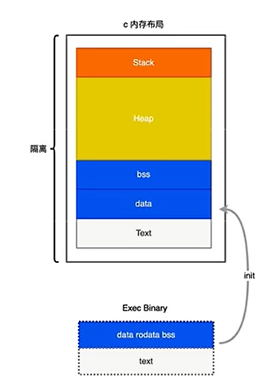
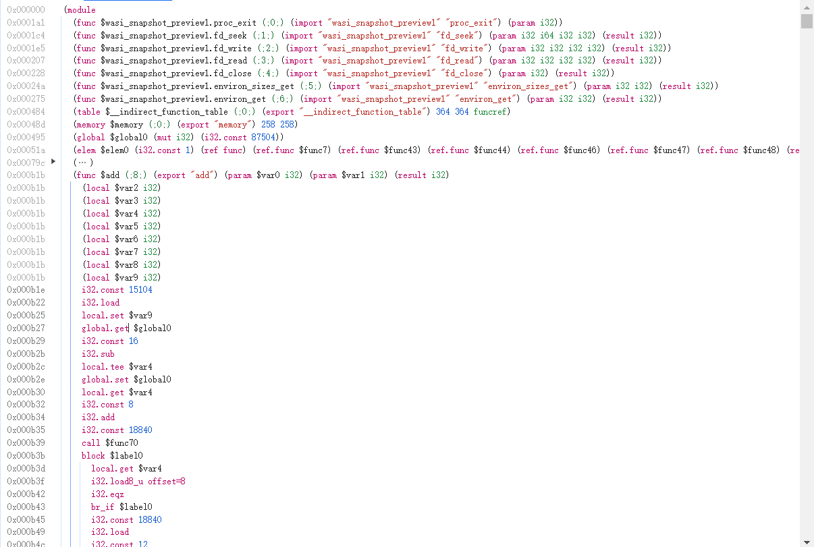
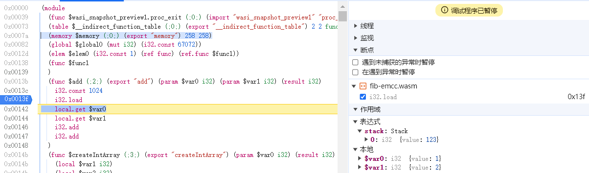
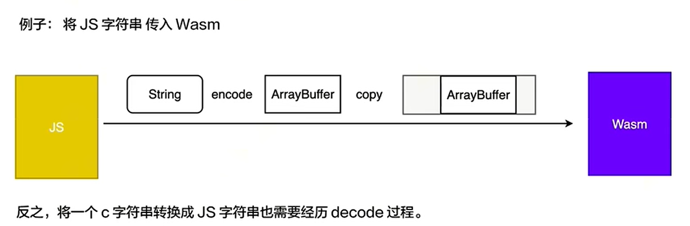
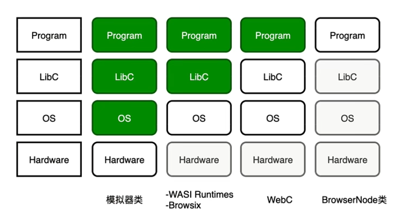

> <font color=blue>**参考：**</font>
>
> <font color=blue>**大文件上传深入研究：https://juejin.cn/post/6870837414852886542**</font>
>
> <font color=blue>**Worker+Wasm切片上传：https://juejin.cn/post/7221003401996091429**</font>
>
> <font color=blue>**Wasm实现MD5文件编码：https://juejin.cn/post/7319541565318398003**</font>
>
> <font color=blue>**SharedArrayBuffer与幽灵漏洞：https://juejin.cn/post/7300106933745909771**</font>
>
> <font color=blue>**Wasm多线程：https://42yeah.github.io/webassembly/2019/01/14/wasm-threading.html**</font>
>
> <font color=blue>**WebAssembly学习记录：https://blog.csdn.net/qq_37464878/article/details/138202363?spm=1001.2014.3001.5501**</font>
>
> <font color=blue>**阿里巴巴基于Wasm的WebC平台技术会议：https://www.bilibili.com/video/BV1vy411q7Lm/?spm_id_from=333.999.0.0**</font>


## 1.内存结构

### 1.1 JavaScript内存结构

> **Text：** 代码段
>
> **Heap：** 堆区
>
> **Stack：** 栈区

### 1.2 C内存结构

> **Text：** 代码段
>
> **Data：** 已初始化全局变量数据段（```int a = 1;```）
>
> **Bss：** 未初始化全局变量数据段（```int a;```）
>
> **Heap：** 堆区
>
> **Stack：** 栈区



### 1.3 WASM内存结构

> <font color=green>**Local：**</font> 
>
> > * **存储：** 函数作用域局部变量。
> >
> > * **解释：** Wasm汇编语言可访问，C语言中无法直接访问。
> > * **举例：** 下图的 ```add``` 函数是C语言提供，里面用local声明了几个局部变量。 
>
> <font color=green>**Global： **</font>
>
> > * **存储：** 全局变量。
> >
> > * **解释：** 引入WebAssembly时从JavaScript注入全局变量。Wasm汇编语言可访问，C语言中无法直接访问。
> > * **举例：** 下图的 ```import "wasi_snapshot_preview1"``` 等等表示需要从JavaScript导入全局变量与之对应。```fd_xxx``` 等内容是引入了头文件 ```#include <iostream>``` 导致必须配置的。
>
> 
>
> <font color=green>**Linear Memory：**</font>
>
> > * **存储：** 是缓冲区ArrayBuffer或SharedArrayBuffer。
> > * **解释：** 是线性内存区域，内存单元地址连续。
> >   * **Stack：** 
> >     * **存储：** 操作栈。
> >     * **解释：** 存储函数局部变量。局部变量和Local的局部变量一一对应，地址是Local的逻辑地址。
> >     * **原因：** Local地址不希望被访问，没有开放C语言访问权限，因此创建Stack区域。
> >   * **Data：**
> >     * **存储：** 全局变量。
> >     * **解释：** c语言定义的全局变量存储在Data。
> >     * **举例：** ```add``` 函数是c语言提供，实现 ```a + b + 全局变量``` 效果。断点上面两行表示从线性内存1024位置取出值放入栈顶。右侧可以看到栈顶的值已经变成全局变量123。
>
> <font color=green>**Table：**</font>
>
> > * **存储：** 函数的指针
> > * **解释：** func表示将函数放入table表中
> > * **举例：** 下图的代码新建了一个函数的指针的表 ```(table $__indirect_function_table (;0;) (export "__indirect_function_table") 2 2 funcref)```
>
> 

<font color=red>**注：下图提到的“StackPointer”和“MemoryBase”是LLVM编译器的产物，如果使用EMSCRIPTEN不一定有这两个内容**</font>


## 2.内存交换

### 2.1 JavaScript和Wasm的内存交换

> <font color=green>**回顾&类比JavaScript和Worker交换内存**</font>
>
> > **拷贝**
> >
> > ArrayBuffer+MessageChannel
> >
> > **移动**
> >
> > ArrayBuffer+MessageChannel+transferable（postMessage配置）
> >
> > **共享**
> >
> > SharedArrayBuffer+Atomics（上锁）
>
> <font color=green>**JavaScript访问Wasm内存**</font>
>
> > 加载完WebAssembly后Wasm默认导出自己的线性内存，JavaScript通过memory对象访问内存 <font color=blue>**（最大大概16MB）**</font>。
> >
> > 一般是JavaScript通过调用Wasm函数返回指针或变量配合memory对象访问内存。
> >
> > **c++**
> >
> > ```c++
> > // 导出：申请内存函数
> > // JavaScript可以申请Wasm内存
> > int* createIntArray(int length) {
> >     return new int[length];
> > }
> > 
> > // 导出：写入内存函数
> > // JavaScript可以写入Wasm内存
> > void writeToArray(int* arr, int index, int value) {
> >     arr[index] = value;
> > } 
> > 
> > // 导出：快排函数
> > // 基于上述操作JavaScript可以实现和Wasm交互的快速排序
> > int* qSort(int* arr, int length) {		
> >     std::sort(arr, arr + length);
> >     return arr;
> > }
> > ```
> >
> > **JavaScript**
> >
> > ```javascript
> > // 加载WebAssembly
> > const importObject = {
> >     wasi_snapshot_preview1: {
> >         proc_exit: function (code) {
> >             console.log(`Process exited with code ${code}`);
> >         },
> >     },
> > };
> > const result = await WebAssembly.instantiateStreaming(fetch(fileName), importObject);
> > 
> > const data = new Int32Array(
> >     result.instance.exports.memory.buffer,
> >     // wasm函数返回的指针
> >     pointer,
> >     length
> > );
> > ```
>
> <font color=green>**Wasm访问Javascript内存**</font>
>
> > **ArrayBuffer：**
> >
> > 不能访问。JavaScript传来的数据统一被拷贝到ArrayBuffer缓冲区中，进入Wasm的内存区域。
> >
> > 
> >
> > **SharedArrayBuffer：**
> >
> > 不能访问。但是可以利用SharedArrayBuffer共享缓冲区，JavaScript调用Wasm导出的函数时把SharedArrayBuffer传给Wasm。此时JavaScript和Wasm可以同时读写同一个缓冲区。
> >
> > <font color=red>**注：SharedArrayBuffer目前默认不支持使用，需要特殊配置响应头，因为共享缓冲区可能导致安全问题**</font>

### 2.2 SharedArrayBuffer安全性

#### 2.2.1 幽灵漏洞

> <font color=green>**内存工作原理**</font>
>
> > * **结构：** CPU——高速缓存——内存
>
> <font color=green>**预测执行**</font>
>
> > * **预测：** Intel芯片在2000年左右对CPU执行速度进行优化。对于条件语句，CPU会预测执行结果，会直接忽视条件尝试执行某个分支，并忽视数组越界，内存权限等限制条件，原因是条件计算完后会统一判断。等到条件计算完毕后再决定是否回滚刚才的操作。
> >
> > * **回滚：** CPU的执行结果会尽可能存入缓存，但是回滚不会消除缓存中的执行结果。
>
> <font color=green>**旁信道攻击**</font>
>
> > * **遍历：** 对数据进行暴力破解，根据程序响应时间来判断破解是否正确。
> > * **举例：** 比如破解密码，1234567，猜测密码为199999和猜测密码为99999程序反应时间有细微不同，因为1是正确的，一旦访问到会被尽可能放入高速缓存。这样程序响应这两个密码都是错误的时候，199999的响应速度会稍微快一点。
>
> <font color=green>**幽灵漏洞举例：**</font>
>
> > 利用预测执行和旁信道攻击来访问没有权限的内存，利用系统的响应速度来判断是否获取成功，获取成功可以直接去高速缓存中获取目标值

#### 2.2.2 高精度计时器

> <font color=green>**背景**</font>
>
> > 幽灵漏洞的攻击思路是根据读取数据的时间差来判断是否访问到目标内存。但是很早之前浏览器已经降低了 ```setTimeout``` ，```performance.now``` 可以获取的时间戳的精度，这样来避免攻击者获取到微小的CPU时间差。
>
> <font color=green>**制作高精度计时器**</font>
>
> > 创建worker，和主线程共享sharedArrayBuffer区域。worker中通过for循环每次给sharedArrayBuffer的某个区域递增微量的值。
> >
> > 主线程中进行幽灵漏洞攻击，在访问某个内存值前后分别获取sharedArrayBuffer指定位置的值，用差值来表示访问时间，获取高精度时间差。
> >
> > <font color=red>**注意：这个操作非sharedArrayBuffer不可，如果主线程和worker没有共享内存区域，那么必须通过postMessage通信，时间有损耗**</font>
>
> <font color=green>**高精度计时器举例**</font>
>
> > **Worker**
> >
> > ```javascript
> > self.onmessage = (event) => {
> >     const view = new Int8Array(event?.data)
> >     let time = 0
> >     while(true) {
> >         view[0] = time
> >         time += 0.00001
> >     }
> > }
> > ```
> >
> > **Main**
> >
> > ```javascript
> > const sharedArrayBuffer = new SharedArrayBuffer(1)
> > const worker = new Worker('你的worker')
> > worker.postMessage(sharedArrayBuffer)
> > 
> > setTimeout(() => {
> >     const startTime = sharedArrayBuffer[0] 
> >     // 你的幽灵攻击代码 0.0003
> >     const endTime = sharedArrayBuffer[0]
> >     // 利用高精度时间来分析你的幽灵攻击过程
> > }, 
> > // 等待Worker启动的时间
> > time) 
> > ```

#### 2.2.3 安全限制

> 在ES6开始浏览器就支持SharedArrayBuffer，但是由于上述安全问题会默认禁用该能力。想启用该能力必须配置HTML页面的响应头。
>
> <font color=green>**跨源嵌入策略：COEP**</font>
>
> > ```Cross-Origin-Embedder-Policy: require-corp```
> >
> > 限制嵌入的非同源请求。例如嵌入的资源如果没有配置CORS或CORP跨域，那么请求直接会被拒绝
>
> <font color=green>**跨源开放策略：COOP**</font> 
>
> > ```Cross-Origin-Opener-Policy: same-origin```
> >
> > 限制打开的非同源资源交互。例如window.open新打开的页面或使用的worker不允许和原页面通信，除非同源。
>
> <font color=green>**副作用举例：**</font>
>
> > 如果background背景图使用了非同源资源，配置上述响应头会导致资源无法加载。

### 2.3 内存交换问题

> <font color=green>**拷贝限制：**</font>
>
> > * **解释：** JavaScript不能直接向wasm传递引用或指针，需要拷贝数据。
> >
> > * **举例：**  
> >   * **场景：** 在处理文件的场景下，JavaScript向wasm传递数据一般通过缓冲区（ArrayBuffer）的视图（TypedArray）进行传递。
> >   * **内存交换：** 缓冲区和视图都不会把缓冲区内容读入内存，但是传递给wasm处理时必须将数据读入内存（拷贝过程）。因为wasm的隔离性，wasm只能读取自己的内存。
> >   * **副作用：** 但是好消息是wasm的内存建立在缓冲区，读写速度不慢，也不占用浏览器内存。
>
> <font color=green>**大小限制：**</font>
>
> > * **解释：** wasm的内存有限制，容易溢栈。
> > * **举例：** 
> >   * **场景1：** 上面1.3中给出的图例中展示了emscripten编译的wasm，C语言和JavaScript都是默认操作，内存上限为16MB。已经达到了上限。
> >   * **场景2：** 在npm发布的一些基于wasm的包（比如hash-wasm），wasm的内存上限可能是64KB，仅允许一次扩容，到128KB。
>
> <font color=green>**安全限制：**</font>
>
> > * **解释：** wasm的内存一般不通过SharedArrayBuffer交换，有安全问题，使用需要配置html页面的响应头。


## 3.多线程能力

### 3.1 Wasm多线程

> 在wasm内部启用多线程需要额外配置编译时的emscripten指令，并且浏览器必须配置开启SharedArrayBuffer。原因是底层依托于浏览器环境，多线程还是需要借助Worker实现。
>
> ```c++
> #include <iostream>
> #include <thread>
> 
> void count(void) {
>     for (int i = 1; i <= 3; i++) {
>         std::cout << "Counting " << i << std::endl;
>     }
> }
> 
> int main(void) {
>     for (int i = 0; i < 3; i++) {
>         std::thread worker(count);
>         worker.detach();
>     }
>     return 0;
> }
> ```

### 3.2 Worker+Wasm多线程

> 不启用SharedArrayBuffer，通过JavaScript实现多线程。每个Web Worker中都引入Wasm进行计算，替换Worker中的JavaScript计算。
>
> <font color=green>**Worker+Wasm对文件MD5编码：**</font>
>
> 下面是一个worker的代码。worker引入hash-wasm，里面引用wasm进行md5运算。
>
> hash-wasm本身不支持在wasm中开启多线程，因此借助worker传入大文件切片来让wasm做编码实现多线程能力。
>
> ```javascript
> import SparkMD5 from 'spark-md5'
> import { createMD5 } from 'hash-wasm'
> 
> /** @constant {string} WebAssembly编码模式 */
> const WASM = 'wasm'
> /** @constant {string} Javascript编码模式 */
> const ORIGIN = 'origin'
> 
> // eslint-disable-next-line
> self.onmessage = (event) => {
>   encodeFile(event?.data?.mode, event?.data?.buffer)
> }
> 
> /**
>  * @function encodeByWasm
>  * @param {ArrayBuffer} 文件切片内容
>  * @returns {Promise} 文件切片编码结果
>  * @description 通过WebAssembly对文件MD5编码
>  */
> const encodeByWasm = async (arrayBuffer) => {
>   return createMD5()
>     .then((encoder) => {
>       // 创建：操作缓冲区的视图
>       const buffer = arrayBuffer instanceof ArrayBuffer ? arrayBuffer : new ArrayBuffer()
>       const view = new Uint8Array(buffer)
>       // 编码：依据当前片段编码
>       encoder?.update?.(view)
>       // 保存：当前片段的编码结果
>       const state = encoder?.save()
>       return state
>     })
>     .catch((err) => {
>       console.warn('EncodeByWasm Error', err)
>       return null
>     })
> }
> 
> /**
>  * @function encodeByOrigin
>  * @param {ArrayBuffer} 文件切片内容
>  * @returns {Promise} 文件切片编码结果
>  * @description 通过Javascript对文件MD5编码
>  */
> const encodeByOrigin = (arrayBuffer) => {}
> 
> /**
>  * @param {string} mode 编码模式
>  * @param {ArrayBuffer} arrayBuffer 文件切片
>  */
> const encodeFile = (mode, arrayBuffer) => {
>   const codeFunction =
>     mode === WASM ? encodeByWasm : mode === ORIGIN ? encodeByOrigin : () => Promise.resolve()
>   codeFunction(arrayBuffer).then((result) => {
>     // eslint-disable-next-line
>     self.postMessage(result)
>   })
> }
> 
> ```


## 4.浏览器上运行环境

### 4.1 运行环境综述

> 
>
> 上述的效果是在浏览器端从不同层面模拟一个本不属于浏览器的运行环境。
>
> <font color=green>**模拟器类**</font>
>
> > **解释：**
> >
> > 只模拟硬件，模拟CPU，寄存器，磁盘，网卡等功能。在该环境上运行的内容，必须是操作系统镜像。
> >
> > **举例：**
> >
> > 运行windows2000镜像。https://bellard.org/jslinux/vm.html?url=https://bellard.org/jslinux/win2k.cfg&mem=192&graphic=1&w=1024&h=768
>
> <font color=green>**系统接口类**</font>
>
> > **解释：**
> >
> > 在模拟了硬件的基础上再次模拟了操作系统，具有文件系统，进程调度，网络管理等操作系统功能。在该环境上运行的内容，必须实现系统接口（调用操作系统功能的函数）。
> >
> > **举例：**
> >
> > 运行底层的高级程序语言，C/C++等。https://browsix.org/
>
> <font color=green>**WebContainer类**</font>
>
> > **解释：**
> >
> > 模拟了硬件，操作系统和系统接口。在该环境上运行的内容，可以是偏高层的高级程序设计语言，不需要实现系统接口和操作系统交互。
> >
> > **举例：**
> >
> > 运行JavaScript，Python等等。https://stackblitz.com/
>
> <font color=green>**BrowserNode类**</font>
>
> > **解释：**
> >
> > 是更高层的模拟。是WebContainer的一个具体方向，只能运行NodeJS相关代码。
> >
> > **举例：**
> >
> > 专用的NodeJS运行环境。https://stackblitz.com/

