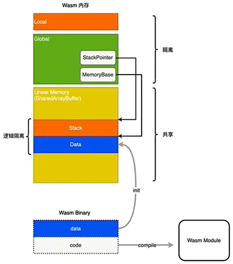

> **参考：**
>
> 阿里巴巴基于WebAssembly实现的Webcontainer环境


## 1.内存结构

### 1.1 JavaScript内存结构

> **Text：** 代码段
>
> **Heap：** 堆区
>
> **Stack：** 栈区

### 1.2 C内存结构

> **Text：** 代码段
>
> **Data：** 已初始化全局变量数据段（```int a = 1;```）
>
> **Bss：** 未初始化全局变量数据段（```int a;```）
>
> **Heap：** 堆区
>
> **Stack：** 栈区


### 1.3 WASM内存结构

> <font color=green>**Local：**</font> 
>
> > * **存储：** 函数作用域局部变量。
> >
> > * **解释：** Wasm汇编语言可访问，C语言中无法直接访问。
> > * **举例：** 下图的 ```add``` 函数是C语言提供，里面用local声明了几个局部变量。 
>
> <font color=green>**Global： **</font>
>
> > * **存储：** 全局变量。
> >
> > * **解释：** 引入WebAssembly时从JavaScript注入全局变量。Wasm汇编语言可访问，C语言中无法直接访问。
> > * **举例：** 下图的 ```import "wasi_snapshot_preview1"``` 等等表示需要从JavaScript导入全局变量与之对应。```fd_xxx``` 等内容是引入了头文件 ```#include <iostream>``` 导致必须配置的。
>
> 
>
> <font color=green>**Linear Memory：**</font>
>
> > * **存储：** 是缓冲区ArrayBuffer或SharedArrayBuffer。
> > * **解释：** 是线性内存区域，内存单元地址连续。
> >   * **Stack：** 
> >     * **存储：** 操作栈。
> >     * **解释：** 存储函数局部变量。局部变量和Local的局部变量一一对应，地址是Local的逻辑地址。
> >     * **原因：** Local地址不希望被访问，没有开放C语言访问权限，因此创建Stack区域。
> >   * **Data：**
> >     * **存储：** 全局变量。
> >     * **解释：** c语言定义的全局变量存储在Data。
> >     * **举例：** ```add``` 函数是c语言提供，实现 ```a + b + 全局变量``` 效果。断点上面两行表示从线性内存1024位置取出值放入栈顶。右侧可以看到栈顶的值已经变成全局变量123。
>
> <font color=green>**Table：**</font>
>
> > * **存储：** 函数的指针
> > * **解释：** func表示将函数放入table表中
> > * **举例：** 下图的代码新建了一个函数的指针的表 ```(table $__indirect_function_table (;0;) (export "__indirect_function_table") 2 2 funcref)```
>
> 

<font color=red>**注：下图提到的“StackPointer”和“MemoryBase”是LLVM编译器的产物，如果使用EMSCRIPTEN不一定有这两个内容**</font>




## 2.内存交换

### 2.1 JavaScript和Wasm的内存交换

> <font color=green>**JavaScript访问Wasm内存**</font>
>
> > 加载完WebAssembly后Wasm默认导出自己的线性内存，JavaScript通过memory对象访问内存 <font color=blue>**（大概16MB）**</font>。
> >
> > 一般是JavaScript通过调用Wasm函数返回指针或变量配合memory对象访问内存。
> >
> > **c++**
> >
> > ```c++
> > // 导出：申请内存函数
> > // JavaScript可以申请Wasm内存
> > int* createIntArray(int length) {
> >     return new int[length];
> > }
> > 
> > // 导出：写入内存函数
> > // JavaScript可以写入Wasm内存
> > void writeToArray(int* arr, int index, int value) {
> >     arr[index] = value;
> > } 
> > 
> > // 导出：快排函数
> > // 基于上述操作JavaScript可以实现和Wasm交互的快速排序
> > int* qSort(int* arr, int length) {		
> >     std::sort(arr, arr + length);
> >     return arr;
> > }
> > ```
> >
> > **JavaScript**
> >
> > ```javascript
> > // 加载WebAssembly
> > const importObject = {
> >     wasi_snapshot_preview1: {
> >         proc_exit: function (code) {
> >             console.log(`Process exited with code ${code}`);
> >         },
> >     },
> > };
> > const result = await WebAssembly.instantiateStreaming(fetch(fileName), importObject);
> > 
> > const data = new Int32Array(
> >     result.instance.exports.memory.buffer,
> >     // wasm函数返回的指针
> >     pointer,
> >     length
> > );
> > ```
>
> <font color=green>**Wasm访问Javascript内存**</font>
>
> > 不能访问。但是可以利用SharedArrayBuffer共享缓冲区，JavaScript调用Wasm导出的函数时把SharedArrayBuffer传给Wasm。此时JavaScript和Wasm可以同时读写同一个缓冲区。
> >
> > <font color=red>**注：SharedArrayBuffer目前默认不支持使用，需要特殊配置响应头，因为共享缓冲区可能导致安全问题**</font>

### 2.2 内存交换负担

> **Buffer交换：**
>
> 推荐基于Buffer的内存交换
