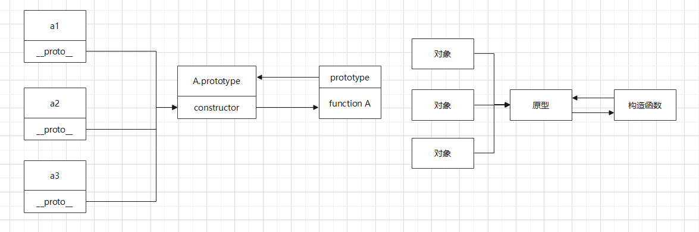

# 1.原型链
### 1.1 原型链解释：
1. **(概念)** 原型链指一些原型通过__proto__指针构成的链表，一个原型链可以为想共享原型链中数据的对象服务，用于实现JavaScript中的继承机制。


2. **(原型链指针)** 原型链中涉及到的指针：
   * 每个对象都有一个__proto__指针来访问对象的原型
   * 每个原型都是一个用于实现继承的对象，除了有__proto__指针之外，还有constructor指针指向构造函数
   * 每个函数都是一个对象，除了有__proto__指针之外，还有prototype指针指向与之关联的原型对象，prototype的指向和__proto__指向不一定相同。

### 1.2 不涉及继承的原型链图示：
1. 构造函数类型原型链：原型链服务的对象由构造函数产生 **(这张图非常重要，涉及了底层的链，网上也有类似的图)**
```javascript
function A() {

}
let a1 = new A()
let a2 = new A()
let a3 = new A()
// 这几行代码会产生下面图示的原型链
```


2. 非构造函数类型原型链：原型链服务的对象由工厂函数，对象字面量，Object.create等方式产生
```javascript
let A = {
    test: ""
}
let a1 = Object.create(A)
let a2 = Object.create(A)
let a3 = Object.create(A)
// 这几行代码对应下面图示的原型链
```


3. 简化的原型链：实际考虑原型链时往往不需要考虑“构造函数Function的实例对应的原型链”，甚至"原型链终点"和"Object.prototype"都不需要考虑。因为涉及到复杂的继承关系时考虑这些偏底层的内容不利于分析。**一般分析时使用下面的两个简化图分析即可。**
```javascript
function A() {

}
let a1 = new A()
let a2 = new A()
let a3 = new A()
// 这几行代码会产生下面图示的原型链
```


### 1.3 涉及继承的原型链图示
涉及继承的原型链使用简化图分析即可
```javascript
// 使用寄生组合模式实现继承
function C() {}
function B() {}
B.prototype = new C()
function A() {}
A.prototype = new B()

let a1 = new A()
let a2 = new A()
let a3 = new A()
```


### 1.4 原型链终点
原型链的终点是null，并不是指某个原型对象

### 1.5 原型的动态性
原型的动态性在“面向对象编程”中详细解释过，主要涉及的是原型的重写和修改。这里列举几个例题。
**例题1---原型的动态性**
```javascript
var A = function() {};
A.prototype.n = 1;
var b = new A();
A.prototype = {
    n: 2,
    m: 3
}
var c = new A();

console.log(b.n); // 1
console.log(b.m); // undefined

console.log(c.n); // 2
console.log(c.m); // 3
```

**例题2---原型的动态性&原型链底层链**
```javascript
var F = function() {};

Object.prototype.a = function() {
    console.log('a');
};

Function.prototype.b = function() {
    console.log('b');
}

var f = new F();

f.a(); // a
f.b(); // 并不存在b属性

F.a(); // a
F.b(); // b
```
参考上述提到的“不涉及继承的原型链图示”中的第一幅图可以画出如下简化参考图分析问题。


**例题3---原型动态性&原型链底层链**
```javascript
function Person(name) {
    this.name = name
}
let p = new Person('Tom');
console.log(p.__proto__) //  Person.prototype
console.log(Person.__proto__) // Function.prototype
```

**例题4---原型动态性&原型链底层链**
```javascript
var foo = {}, F = function(){};
Object.prototype.a = 'value a';
Function.prototype.b = 'value b';
Object.prototype = {
    a: "value a"
}
Function.prototype = {
    b: "value b"
}

console.log(foo.a); // value a
console.log(foo.b); // undefined

console.log(F.a); // value a
console.log(F.b); // value b
```
参考上述提到的“不涉及继承的原型链图示”中的第一幅图可以画出如下简化参考图分析问题。**由于foo和F声明时它们就将自己的原型进行绑定，它们通过栈内存中存储的指针获取堆内存中存储的原型的地址。首先进行了原型的修改操作，修改操作会在堆内存上修改原型，foo和F通过栈内存的指针仍然可以访问到修改后的结果。第二步进行了原型的重写，JS都是“传值操作”，重写原型后，首先在堆内存中开辟一块新空间存储新的原型，然后在栈内存重新开辟一个空间存储指向堆内存的指针。此时由于foo和F持有的栈内存指针和新的栈内存指针不同，所以foo和F无法访问到重写后的原型。**

