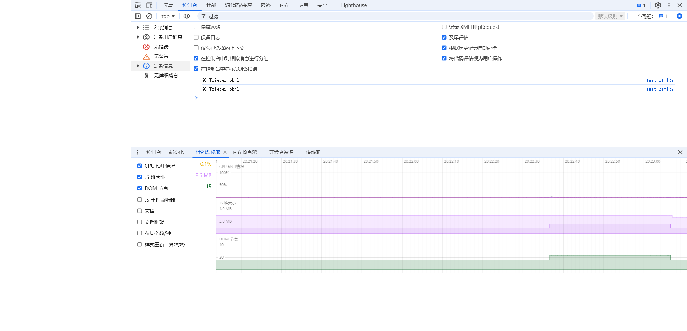
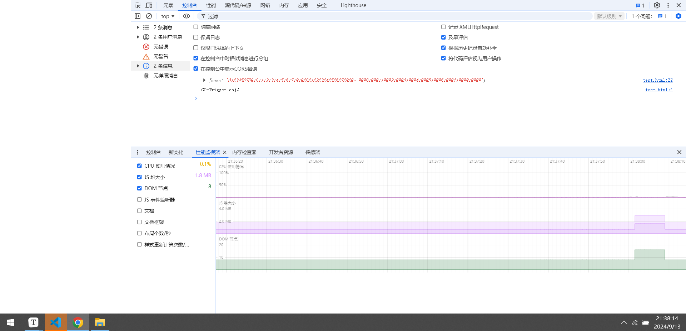

# 1.垃圾处理注意事项
**1. JS都是值传递：** 不管是函数传参数还是赋值操作都是值传递，会在栈内存中重新开辟一块空间。如果是对象赋值，不会获得这个对象的引用，不能完全控制原对象，只能在栈内存中重新开辟一个空间，存储指向堆内存中该对象的地址。    


**2. 执行栈出栈一定清空局部变量：** 执行栈相当于一块内存单元，执行上下文入栈并创建局部变量会占用执行栈中的内存，当执行上下文出栈时其中所有的栈内存都会被释放。出栈相当于清空一段内存。

**3. 回收机制是针对堆内存：** 不管是下面提到的标记清理还是引用计数，处理的对象都是堆内存中的内存单元而不是栈内存中的内存单元。(虽然屡次使用赋值操作会耗费栈内存，但是网络博客的解释都是针对堆内存，参考了JVM中的垃圾回收机制也是如此)

# 2.标记清理回收机制
---参考<<JavaScript高级程序设计(第四版)>>，相关内容解释的不清楚   
### 2.1 工作流程
1. 当垃圾回收程序运行时(不一定是内存占满才运行)，会把当前进程/线程占用的堆内存都外打上“将被回收标记“。


2. 查找当前执行栈中的所有变量能够访问到的堆内存，把它们占用的内存的”将被回收标记“去掉。


3. 把当前进程/线程占用的堆内存中带有”将被回收标记“的内存单元回收。

### 2.2 优缺点
**1. 优点---解决循环引用：** 可以解决引用计数中不能回收循环引用情况下的内存

**2. 缺点---不能实时回收：** 不想引用计数能够实时监控，立即回收不可达的堆内存，可能会造成内存过大仍未回收的情况

**3. 缺点---时间慢：** 和引用计数相比，标记清理需要先遍历堆内存打标记然后再遍历可访问的堆内存去掉标记，当堆内存很大时很耗费时间

**4. 缺点---造成内存碎片化：** 在堆内存中如果一些将要被释放的内存中间夹杂了一块不会被释放的内存，那么在内存释放后，这块不可释放内存的地址在一块连续内存中并不是从起始地址开始，相当于不可释放内存把这个大的连续内存分割成了两小块小连续内存。如果此时像开辟一大块内存存储对象，那么这块连续内存不能满足，因为被不可释放内存分割成了小块。

# 3.标记整理回收机制
### 3.1 工作流程
1. 按照“标记清理”机制进行打标记和去掉标记


2. 在回收之前进行堆内存整理，把将要释放的内存整理到连续地址的内存空间中


3. 把带有“将被回收标记”的内存单元回收
### 3.2 优缺点
**1. 优点---解决内存碎片化：** 解决了“标记清理”机制中的内存浪费情况，此机制将将回收的内存安排到连续空间中，最后释放后剩下的还是可分配的连续空间。

**2. 缺点---效率低下：** 标记清理由于不实时且需要先打标记再去掉标记已经不算高效了，标记整理还要加上内存整理就更耗费时间了。

# 4. 引用计数回收机制
引用计数的垃圾回收机制没有标记清理机制优秀，最大的缺点是在出现循环引用时无法回收内存。
### 4.1 工作流程
1. 变量占用的堆内存都有一个引用次数，内存中的数据每被引用一次引用次数就加一，每消失一个引用引用次数就减一
   * 变量赋值为null或undefined相当于对内存单元的引用消失，对应内存单元的引用次数减一
   * 变量赋为其它值或引用时，对原有内存单元的引用消失，对应内存单元的引用次数减一
   * 局部执行上下文被移除执行栈时，存储在栈内存中的局部变量也会随着执行上下文的出栈而被清空，栈内存存储的指向堆内存的指针数据被清空，对应堆内存单元的引用次数减一。


2. 当垃圾回收程序工作时，释放引用次数为0的内存。

### 4.2 存在问题
引用计数会存在循环引用的问题。
```javascript
class A { iter }
function test() {
    let a = new A()
    let b = new A()
    a.iter = b
    b.iter = a
}
```
上述情况在标记清理回收机制中，由于a和b没有被其它上下文的变量引用，所以在test执行完毕(test的上下文出栈)后，a和b对应的堆内存在下次垃圾回收程序运行时会被回收。   


在引用计数中来看，let a = new A()会使得堆内存中存的对象的引用次数加一，此时a在引用这块内存。b.iter = a会使得堆内存中存的对象的引用次数加一。此时第一个new A()占用的堆内存的引用次数为2，同理第二个new A()占用的堆内存的引用次数也为2。当test的执行上下文被移除执行栈时引用次数变为1，因为不是0所以不会被清除。


### 4.3 优缺点
**1. 优点---实时回收：** 实时监控，一旦有引用次数为0的堆内存，那么将被立即回收，减少了内存过大仍未回收的问题。

**2. 缺点---循环引用：** 无法回收循环引用占用的堆内存，这是一个致命问题，因为这一点，很多浏览器已经不用这种策略了。    

**3. 缺点---开销大：** 为了维护堆内存的引用次数，需要有计数器，每个堆内存维护计数器所需要的时间和空间开销大。

# 5. 复制回收机制
复制回收机制核心是开辟两块大小相同的空间，回收时需要在两块空间之间复制。假设有空间From和To，申请堆内存时全部在From中申请。
### 5.1 工作流程
1. 当From空间被占满时，在执行栈中的所有上下文中寻找可以访问到的堆内存，将这些堆内存移动到To空间中，这些内存的空间是连续的不会是碎片的。


2. 现在From空间中全部是不可访问的内存，清空From空间中的内存。


3. 交换From空间和To空间，将To空间作为From空间使用，From空间作为To空间使用。

### 5.2 优缺点
**1. 优点---速度快：** 相比于标记清理和标记整理，都需要先扫描整个堆内存打上“将被回收标记”，然后再扫描所有可访问内存去掉“将被回收标记”，复制回收算法只是扫描可访问的内存。当堆内存很大时复制回收会明显比前两者快。

**2. 优点---解决碎片化：** 在内存数据移动到To空间时是要求按照连续地址来移动的，不会产生非连续内存单元。

**3. 缺点---内存利用率低：** 为了实现复制的思想，必须二等分堆内存，非垃圾回收时一定有一块是空的，浪费空间。

**4. 缺点---必须移动内存：** 为了实现复制的思想，必须移动内存单元中的数据，进行写操作，开销较大。

# 6. 增量回收机制
垃圾回收程序运行时会暂停主程序的执行，增量标记回收机制不会完全暂停主程序的执行，而是穿插着进行垃圾回收。----网上博客对此介绍比较少，可以参考<<垃圾回收的算法与实现>>

# 7. 分代回收机制
V8引擎采用分代回收机制，分为新生代和老生代。新生代是垃圾回收的复制机制，老生代是垃圾回收的标记清理，标记整理或增量机制

### 7.1 V8引擎的内存分配
|操作系统位数|32位|64位|
|---|---|:--|
|新生代内存|16M|32M|
|老生代内存|800M|1.5G|
|注： 下面提到的新生代和老生代内存区都是堆内存。|||
```c
enum AllocationSpace {
  // TODO(v8:7464): Actually map this space's memory as read-only.
  RO_SPACE,    // 不变的对象空间
  NEW_SPACE,   // 新生代用于 GC 复制算法的空间
  OLD_SPACE,   // 老生代常驻对象空间
  CODE_SPACE,  // 老生代代码对象空间
  MAP_SPACE,   // 老生代 map 对象
  LO_SPACE,    // 老生代大空间对象
  NEW_LO_SPACE,  // 新生代大空间对象
  FIRST_SPACE = RO_SPACE,
  LAST_SPACE = NEW_LO_SPACE,
  FIRST_GROWABLE_PAGED_SPACE = OLD_SPACE,
  LAST_GROWABLE_PAGED_SPACE = MAP_SPACE
};
```
1. 新生代内存区(New Space)
   * From区
   * To区
   * 新生代大对象区(New Lo Space)：大对象区存储的内容一般在1M以上，参与复制机制的回收会降低效率
2. 老生代内存区(Old Space)
   * 老生代内存(Old Space)
   * 老生代映射区(Map Space)
   * 老生代大对象区(Large Object Space)：存储大于1M以上左右的对象
   * 老生代代码区(Code Space)：存储执行代码，大小为512M
   * 不变的对象空间：不参与回收的对象

### 7.2 工作流程
1. 在垃圾回收前申请的堆内存都存储在新生代的From空间中。From空间被占满时会先扫描From中的所有可访问的堆内存，将其移动到To空间中。
2. To空间检查空间占用率是否超过25%，如果超过那么拒绝这些数据在To空间开辟新的内存，把这些数据交给老生代空间开辟内存。To空间检查这些数据是否已经经历了一次复制机制的垃圾回收，如果已经经历了一次，那么也把它们交给老生代处理。如果这些数据不会被交给老生代，那么按照连续的地址顺序在To空间中开辟内存存储。
3. 清理From空间中的所有内存。
4. 交换To空间和From空间。
5. 老生代在收到新生代To空间“晋升”的数据后，如果空间被占满那么会启用标记清理机制的垃圾回收。标记清理会出现碎片化内存，如果碎片过多新生代“晋升”的数据无法开辟空间，那么会启用标记整理。


# 8.内存管理
注：下面介绍几种JavaScript中管理内存的方法，JavaScript不像C/C++可以直接操纵指针管理内存，但是可以采用下面几种策略对内存进行管理，提升内存使用效率。
### 8.1 学会解除引用
**通过JavaScript的赋值语句可以给某一个变量赋一个null值可以让这个变量原来占有的内存在下一次垃圾回收程序运行时被回收。**    

注意：
1. 不要赋为undefined，undefined从意义上讲是变量占有一块内存只是内存中还没有存储数据，null从意义上讲是变量占有一块不可访问的内存，赋为null值不会在栈内存中开辟新的空间(参考<<JavaScript权威指南(第七版)>>第三章)。


2. 原因是在本文最开始介绍了JavaScript中赋值语句都是“传值”不是“传引用”，所以赋值语句中如果不赋为null值，那么就会在栈内存中新开辟一个空间。
### 8.2 使用块级作用域
1. **(使用说明)** 对于块级作用域的内容不属于本专题详细介绍的内容，大致而谈，就是尽可能使用const和let来声明变量，let和const的作用域仅限于{}，当作用域销毁后，里面的不可访问的局部变量占用的空间会被回收，这听起来就像本文最开始提到的执行上下文离开执行栈时的操作，实际上这是执行上下文中更细微的操作。如果使用var声明变量，那么这个变量一定会在所在的函数调用完毕后才会被回收。


2. **(举例)** 块级作用域中的引用类型可能会更快地被回收
```javascript
;(function() {
    var obj = {
        name: "Danny",
        gender: "man"
    }

    {
        let obj =  {
            name: "Danny",
            gender: "man"
        }
    }

    for(let i = 0; i < 2 ** 24; i ++);
})();
```
如果使用引用计数机制的垃圾回收程序，那么块级作用域结束后，对象立即失去obj这个引用，堆内存将会被立即回收。如果使用标记清理相关算法，如果正巧在当前函数正在执行循环时触发，那么会发现块级作用域中的对象无法通过已有变量访问到，堆内存将会被立即回收。

### 8.3 考虑隐藏类
```javascript
function Test(name) {
    this.name = name
}
let test1 = new Test("Danny")
let test2 = new Test("Cathy")
```
此时V8引擎认为test1和test2共用一个构造函数，V8引擎会在后台让这两个实例共享同一个隐藏类
```javascript
function Test(name) {
    this.name = name
}
let test1 = new Test("Danny")
let test2 = new Test("Cathy")
test1.gender = "man"
```
此时V8引擎认为test1和test2并非共用一个构造函数，因为test1多了一个属性，V8引擎会在后台给test1和test2分别创建关联的隐藏类。当涉及到大量对象类似的操作时，后台将会占用大量内存给每个实例一个关联的隐藏类。
```javascript
function Test(name) {
    this.name = name
    this.gender = ""
}
let test1 = new Test("Danny")
let test2 = new Test("Cathy")
test1.gender = "man"
```
考虑到隐藏类可能会拖垮性能，建议在使用面向对象思想编程时使用严格的面向对象规范，上述在构造函数中添加了新的字段。这样避免了创建多个隐藏类，可以让两个实例共享一个隐藏类。建议在JavaScript面向对象编程时，严格遵循C++面向对象编程时的规范。

### 8.4 注意内存泄漏
内存泄漏是指一些不打算使用的内存却不能被回收
1. **(意外的全局对象属性)** 在非严格模式下，不使用任何声明符声明变量，将会被自动加入全局变量globalThis，成为它的一个属性。这种情况下只有程序结束时才会清理该变量占用的内存。这种情况很好排查和解除，开启严格模式或者将其赋值为null即可避免内存无法被回收。
2. **(持续存在的引用)** 持续存在的引用主要指闭包的情况，函数返回了一个新函数或者变量，但是却引用了函数作用域里的一些变量，这些被引用的变量由于自己有引用在身，不会随着函数执行上下文出栈而被回收。这种情况下你需要把接收这些变量的引用的变量赋为null值，解除对原函数中变量的引用，这样内存才可被回收。**注意：理论上来说，如果不采取这个解除引用操作，闭包中被外界引用的变量占用的内存不会被释放，但是网上有网友做测试发现现代大多浏览器都会对此优化，在很长不使用的情况下闭包中的变量所占的内存也会被回收**
   
   ```javascript
   // 闭包引起的内存泄漏
   let reciever = (function() {
        let stu = {
            name: "Vanghua",
            gender: "man"
        }    
        return () => console.log(stu)
   })();
   reciever()
   // 解除引用
   reciever = null
   ```

### 8.5 必要时使用对象池静态分配
我们无法控制垃圾回收程序运行的时间，但是可以控制垃圾回收程序运行的条件。垃圾回收程序往往是学习性的，智能性的，会根据前次垃圾回收情况决定下次垃圾回收的时间。
```javascript
// 举一个复数类的例子
class Complex {
   image
   virtual
   constructor(image, virtual) {
      this.image = image
      this.virtual = virtual
   }

   // 两个复数相加返回一个新的复数，我们当前希望相加操作后能够保留相加前的两个复数，而不是把相加结果存到相加前的某个复数中去
   static add(complexA, complexB) {
      let complex = new Complex()
      complex.image = complexA.image + complexB.image
      complex.virtual = complexA.virtual + complexB.virtual
      return complex
   }

   get() {
      return `${this.image.toFixed(2)} + ${this.virtual.toFixed(2)}i`
   }
}

for(let i = 0; i < 10; i++) {
   let complexA = new Complex(Math.random() * 10, Math.random() * 10)
   let complexB = new Complex(Math.random() * 10, Math.random() * 10)
   let complexC = Complex.add(complexA, complexB)
   console.log(complexC.get())
}
```
在上面的示例中，如果频繁调用复数类的add方法进行两个复数相加的操作，那么会频繁产生新的复数对象。就像例子中的for循环，局部作用域不停地被创建然后很快被销毁，里面的对象频繁创建和修改，垃圾回收算法根据学习能力得知你的代码频繁产生垃圾需要在更短的时间间隔运行垃圾回收程序。这样频繁进行垃圾回收就造成了性能负担。此时可以考虑使用对象池来优化，对象池不会让引擎频繁垃圾回收，能把上述操作放到正常的垃圾回收频率中处理。
```javascript
class ObjectPool {
    // 用数组来维护对象池结构，提前规定对象池的容量
    objectList
    // 构造函数参数包括对象的构造函数和数组大小
    constructor(createObject, size) {
        this.objectList = new Array(size)
        for(let i = 0; i < size; i++)
            this.objectList[i] = new createObject()
    }

    allocate() {
        let object = this.objectList.pop()
        if(object)
            return object
        else
            throw new TypeError("对象池已被耗尽")
    }

    free(object) {
        this.objectList.push(object)
    }
}

class Complex {
    image
    virtual
    // 内置一个大小为10的对象池
    static pool = new ObjectPool(Complex, 10)
    constructor(image, virtual) {
        this.image = image
        this.virtual = virtual
    }

    // 两个复数相加返回一个新的复数，我们当前希望相加操作后能够保留相加前的两个复数，而不是把相加结果存到相加前的某个复数中去
    static add(complexA, complexB) {
        let complex = Complex.pool.allocate()
        complex.image = complexA.image + complexB.image
        complex.virtual = complexA.virtual + complexB.virtual
        return complex
    }

    get() {
        return `${this.image.toFixed(2)} + ${this.virtual.toFixed(2)}i`
    }
}

// 创建一个大小为3的针对Complex类的对象池
let pool = new ObjectPool(Complex, 3)
for(let i = 0; i < 10; i++) {
    // 对象池进行分配
    let complexA = pool.allocate()
    ;[complexA.image, complexA.virtual] = [Math.random() * 10, Math.random() * 10];
    let complexB = pool.allocate()
    ;[complexB.image, complexB.virtual] = [Math.random() * 10, Math.random() * 10];
    let complexC = Complex.add(complexA, complexB)
    console.log(complexC.get())

    // 对象池归还
    Complex.pool.free(complexC)
    pool.free(complexA)
    pool.free(complexB)
}
```
使用对象池来进行优化。注意：这些方法其实在大多数情况下都是过度优化了。


# 9.垃圾回收验证

### 9.1 V8垃圾回收

> **说明**
>
> V8垃圾回收本身还是标记清理机制，只是内容复杂一些。
>
> **结论：**
>
> * **循环引用无影响：** V8使用标记清理机制，即使不主动解除循环引用，对象循环引用也不会影响内存回收。
> * **垃圾回收时机：** 垃圾回收是耗时机制，Node环境下垃圾回收处理时机可能比Web环境快，Web下列实验表现是大约30秒后垃圾回收。
>
> **验证：node环境**
>
> ```javascript
> const getHeap = (tag) => {
>   console.log(tag);
>   let heapUse = (process.memoryUsage().heapUsed / 1024 / 1024).toFixed(2);
>   console.log("当前Node进程使用的堆内存大小是 " + heapUse + " MB");
> 
>   heapUse = (process.memoryUsage().heapUsed / 1024 / 1024).toFixed(2);
>   console.log("当前Node进程使用的堆内存大小是 " + heapUse + " MB");
> 
>   heapUse = (process.memoryUsage().heapUsed / 1024 / 1024).toFixed(2);
>   console.log("当前Node进程使用的堆内存大小是 " + heapUse + " MB");
> 
>   heapUse = (process.memoryUsage().heapUsed / 1024 / 1024).toFixed(2);
>   console.log("当前Node进程使用的堆内存大小是 " + heapUse + " MB");
> 
>   heapUse = (process.memoryUsage().heapUsed / 1024 / 1024).toFixed(2);
>   console.log("当前Node进程使用的堆内存大小是 " + heapUse + " MB");
> };
> 
> getHeap("pre");
> 
> const func = () => {
>   let obj1 = {
>     name: Array.from({ length: 10000 })
>       .map((_, index) => index)
>       .join(""),
>   };
>   let obj2 = {
>     name: Array.from({ length: 10000 })
>       .map((_, index) => index)
>       .join(""),
>   };
>   obj1.target = obj2;
>   obj2.target = obj1;
>   getHeap("run");
> };
> 
> func();
> 
> setTimeout(() => {
>   getHeap("end2000");
> }, 2000);
> 
> getHeap("end");
> ```
>
> \
>
> **验证2：浏览器ES12环境**
>
> **实验1：** 无循环引用的垃圾回收。在页面等待一段时间后切页，发现自动触发垃圾回收。
>
> ```html
> <html>
>   <script>
>     const finalRegistry = new FinalizationRegistry((msg) => {
>       console.log("GC-Trigger", msg);
>     });
> 
>     const func = () => {
>       let obj1 = {
>         name: Array.from({ length: 10000 })
>           .map((_, index) => index)
>           .join(""),
>       };
>       let obj2 = {
>         name: Array.from({ length: 10000 })
>           .map((_, index) => index)
>           .join(""),
>       };
>       finalRegistry.register(obj1, 'obj1');
>       finalRegistry.register(obj2, 'obj2');
>     };
> 
>     func();
>   </script>
> </html>
> ```
>
> 
>
> **实验2：** 有循环引用的垃圾回收。在页面等待一段时间后切页，发现自动触发垃圾回收。
>
> ```html
> <html>
>   <script>
>     const finalRegistry = new FinalizationRegistry((msg) => {
>       console.log("GC-Trigger", msg);
>     });
> 
>     const func = () => {
>       let obj1 = {
>         name: Array.from({ length: 10000 })
>           .map((_, index) => index)
>           .join(""),
>       };
>       let obj2 = {
>         name: Array.from({ length: 10000 })
>           .map((_, index) => index)
>           .join(""),
>       };
>       obj1.target = obj2;
>       obj2.target = obj1;
>       finalRegistry.register(obj1, 'obj1');
>       finalRegistry.register(obj2, 'obj2');
>     };
> 
>     func();
>   </script>
> </html>
> ```
>
> 

### 9.2 Console垃圾回收

> **说明**
>
> Console相关API输出的对象会影响垃圾回收。
>
> **结论：**
>
> Console相关API输出的对象无法被垃圾回收。
>
> **验证： 浏览器ES12环境**
>
> 在devtools的“内存”选项中手动点击垃圾回收，发现obj1无论如何也回收不了。
>
> ```html
> <html>
>   <script>
>     const finalRegistry = new FinalizationRegistry((msg) => {
>       console.log("GC-Trigger", msg);
>     });
> 
>     const func = () => {
>       let obj1 = {
>         name: Array.from({ length: 20000 })
>           .map((_, index) => index)
>           .join(""),
>       };
> 
>       const obj2 = {
>         name: Array.from({ length: 20000 })
>           .map((_, index) => index)
>           .join(""),
>       };
> 
>       finalRegistry.register(obj1, "obj1");
>       finalRegistry.register(obj2, "obj2");
>       console.log(obj1);
>     };
> 
>     func();
>   </script>
> </html>
> ```
>
> 


> ### 参考
> [1] <<JavaScript高级程序设计(第四版)>>    
> [2] <<JavaScript权威指南(第七版)>>   
> [3] https://segmentfault.com/a/1190000037762539 多种垃圾回收算法    
> [4] https://juejin.cn/post/6916157109906341902/#heading-84 关于V8引擎的内存分配    
> 其它若干低质量参考内容省略