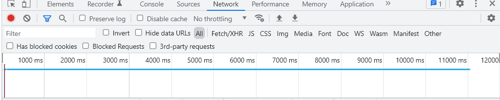
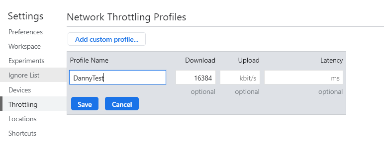

# 1.本地磁盘IO----"点击"读取

### 1.1 创建FileReader对象
FileReader对象是用于IO操作中的读取操作
```javascript
let fd = new FileReader()
```

### 1.2 利用FileReader对象读取文件
>1. fd.readAsArrayBuffer() 异步读取一个文件，返回ArrayBuffer
>
>
>2. fd.readAsBinaryString() 异步读取一个文件，返回二进制形式
>
>
>3. fd.readAsDataURL() 异步读取一个文件，返回Base64编码形式
>
>
>4. fd.readAsText() 异步读取一个文件，返回文本形式

### 1.3 设置input标签的属性
点击input标签用于打开文件管理器
>1. type属性设置为file，表示input标签用于读取文件
>
>
>2. multiple属性可以选择性设置为multiple，表示是否允许读取多个文件
>
>
>3. 监听change事件
```html
<input type="file" multiple="multiple" onchange="handleChanged()">
<script>
    function handleChanged() {
        // 遍历打开的所有文件
        Array.prototype.forEach.call(event.target.files, (file => {
            let fd = new FileReader()
            // 使用ArrayBuffer存储
            fd.readAsArrayBuffer(file)
            fd.onload = function(event) {
                console.log(event.target.result)
            }
        }))
    }
</script>
```

### 1.4 特殊样式的点击读取
在实际使用中我们通常并不直接使用input标签，因为样式往往不符合需求，可以使用如下方式解决。
>1. 设置display属性来隐藏input标签
>
>
>2. 创建一个点击上传按钮，在按钮上设置我们期望的样式
>
>
>3. 设置该按钮点击时会触发input标签的点击事件

```html
<div style="width: 100px; height: 100px; background: blue;" onclick="handleClick()"></div>
<input type="file" style="display: none;" onchange="handleChanged()" id="input">
<script>
    let input = document.querySelector("#input");
    
    function handleClick() {
        input.click()
    }
    
    function handleChanged() {
        // 假设只允许读取一个文件
        let fd = new FileReader(), file = event.target.files[0]
        fd.readAsDataURL(file)
        fd.onload = function(event) {
            console.log(event.target.result)
        }
    }
</script>
```

# 2.本地磁盘IO----"拖拽"读取

### 2.1 基本拖拽事件学习


draggable = true 表示元素允许拖拽

1. ondragstart 拖拽开始事件，注册在容器上，**用于状态判断和拖拽信息携带**
2. ondragenter 拖拽进入容器事件，注册在容器上，用于状态判断
3. ondragover 拖拽进入容器事件，注册在容器上，**需要禁用默认事件，默认事件禁止拖入容器**
4. ondragleave 拖拽离开容器事件，注册在容器上，用于状态判断
5. ondrop 拖拽鼠标释放事件，注册在容器上，**需要禁用默认事件，用于读取拖拽信息并放置拖拽元素**
6. ondragend 拖拽结束事件，用于状态判断


### 2.2 基本拖拽事件演示
```html
<div style="border: 1px solid black; width: 200px; height: 100px;"
     ondragstart="handleDragStart()"
     ondrop="handleDrop()"
     ondragover="handleDragOver()"
     ondragenter="handleDragEnter()"
     ondragleave="handleDragLeave()"
     ondragend="handleDragEnd()">
    <p draggable="true" id="p">Danny</p>
</div>

<div style="border: 1px solid black; width: 200px; height: 100px; margin-top: 44px;"
     ondragstart="handleDragStart()"
     ondrop="handleDrop()"
     ondragover="handleDragOver()"
     ondragenter="handleDragEnter()"
     ondragleave="handleDragLeave()"
     ondragend="handleDragEnd()"></div>
<script>
    
    // ondragstart
    // 当开始拖动时触发
    function handleDragStart() {
        // 将拖动元素的id加入拖动事件的属性，当拖动结束时能够找到该拖动元素
        event.dataTransfer.setData("Danny", event.target.id)
    }
    
    // ondragenter
    // 当拖动元素进入该容器时触发
    function handleDragEnter() {
        console.log("进入容器", event.target)
    }
    
    // ondragleave
    // 当拖动元素离开该容器时触发
    function handleDragLeave() {
        console.log("离开容器", event.target)
    }
    
    // ondragend
    // 完成拖动时触发
    function handleDragEnd() {
        console.log("完成拖放")
    }
    
    // ondrop
    // 当拖动时鼠标释放时触发
    function handleDrop() {
        // 原生事件禁止拖入其它地方
        event.preventDefault()
        // 将拖动元素放入当前元素
        event.target.append(document.querySelector(`#${event.dataTransfer.getData("Danny")}`))
    }
    
    // ondragover
    // 当拖动元素进入某个容器时触发
    function handleDragOver() {
        // 原生事件禁止拖入其它地方
        event.preventDefault()
    }
</script>
```

### 2.3 拖拽读取
>1. 给容器注册ondrop事件，禁止原生事件，使用FileReader读取
>
>
>2. 给容器注册ondragover事件，禁止原生事件

```html
<div style="width: 200px; height: 100px; border: 1px solid black;" ondrop="handleDrop()" ondragover="handleDragOver()"></div>
<script>
    function handleDragOver() {
        event.preventDefault()
    }

    function handleDrop() {
        event.preventDefault()
        // 这里默认只拖拽上传一个文件
        let file = event.dataTransfer.files[0]
        let fd = new FileReader()
        fd.readAsArrayBuffer(file)
        fd.onload = function(event) {
            console.log(event.target.result)
        }
    }
</script>
```

### 2.4 读取的进度问题
FileReader的实例化对象，可以监听读取的进度
```javascript
fd.onprogress = function(event) {
    console.log(event.loaded)
}
```


# 3.本地磁盘IO----写入

### 3.1 对象URL与Blob
>1. Blob表示二进制大对象。在客户端JavaScript的IO中Blob对象和File对象处于相等的地位(但实际上File是Blob的子类)，都是表示一个二进制大文件。
>
>
>2. 对象URL和Blob，File地位不同。Blob和File理解为整个二进制大文件，对象URL理解为指向文件的URL，不包含文件本身。生成对象URL可以使用URL.createObjectURL()来实现，参数可以是File或Blob。


### 3.2 a标签写入
>1. 设置a标签的href属性为对应的资源的URL，如果没有URL，可以获取该文件，再通过对象URL来生成URL
>
>
>2. 设置a标签的download属性为你希望的文件下载名称

### 3.3 特殊样式的a标签写入
同样是类似于上文提到的灵活使用input的问题

>1. 设置a标签的display属性为none，隐藏之
>
>
>2. 设置新的点击下载元素，将其点击事件设置为触发a标签的点击事件

# 4.网络IO----下载

### 4.1 客户端JavaScript的可读流学习
>1. 可读流对象：ReadableStream
>
>
>2. 可控可读流：在构造函数中传入参数{ start(control){} }，表示可读流控制参数
>
>
>3. 可控可读流的封装：在start函数中，通过control.enqueue向可读流写入数据，当数据写完后使用control.close关闭可读流
>
>
>4. 可控可读流的读：通过ReadableStream.getReader()获取读锁S，能够安全读。之后调用读锁S.read()读取数据，read()实际上是调用异步迭代器的next()方法，详情见“JavaScript异步编程”博客。
```html
<script>
    // 创建一个异步迭代器，这里通过生成器实现
    let asyncIter = (function* asyncMaker() {
        for (let i = 0; i < 5; i++)
            yield new Promise(res => setTimeout(res.bind(globalThis, i), 1000))
    })();

    // 创建一个可读流，封装底层数据
    let stream = new ReadableStream({
        async start(control) {
            // 遍历异步迭代器，把数据装入可读流
            for await(let value of asyncIter)
                control.enqueue(value)
            // 写入数据后可读流关闭
            control.close()
        }
    });

    // 获取可读流的读锁
    let readLock = stream.getReader();

    // 自动读取可读流，这里采用递归形式
    (function () {
        let that = arguments.callee
        readLock.read().then(res => {
            if (!res.done) {
                console.log(res.value)
                that()
            }
        })
    })();
</script>
```

### 4.2 fetchAPI实现网络IO下载进度条
通过获取可读流response.getReader().read()的每一数据块大小，来获知当前下载进度
### 网页代码
```html
<p>下载中</p>
<progress id="progress" value="0"></progress>
<script>
    // 实际时间是：网络中的数据流传输时间 + 数据流转为二进制对象的时间 + 本地磁盘IO时间 （仅列举三个耗时时延）
    // 进度条显示的时间是：网络中的数据流传输时间
    // 这种问题在XHR中也是如此，大文件可以直接用a标签下载，只是无法定制样式来显示进度

    let progress = document.querySelector("#progress")

    fetch("test.mp4")
        .then(res => {
            let size = res.headers.get("Content-Length")
            let readLock = res.body.getReader()
            let sum = 0
            // 设置进度条容量
            progress.max = size

            let stream = new ReadableStream({
                async start(control) {
                    while(true) {
                        let { done, value } = await readLock.read()
                        if(done) {
                            control.close()
                            break
                        }
                        sum += value.length
                        progress.value = sum

                        // 将数据块放入新的流中，当读取完毕后，readLock流已经到头，想后续交给a标签下载就需要一个新的从头开始的流
                        control.enqueue(value)
                    }
                }
            })
            return new Response(stream)
        })
        .then(res => res.blob())
        .then(blob => {
            let a = document.createElement("a")
            a.style.display = "none"
            a.href = URL.createObjectURL(blob)
            a.download = "视频.mp4"
            document.body.prepend(a)
            a.click()
            // 回收URL内存并移除a标签，相当于减少一个对该文件的引用
            URL.revokeObjectURL(a.href)
            document.body.firstElementChild.remove()
        })
</script>
```
### 代理服务器代码
视频test.mp4 **(以下代码按照mp4格式)** 放在当前目录下，虽然是放在本地，实际上本地回路测试时数据要通过回路测试网卡，也会有网络时延。
```javascript
let fs = require("fs").promises
require("http").createServer((req, res) => {
    if(req.url.includes("html")) {
        fs.readFile("." + req.url).then(data => {
            res.writeHead(200, {
                "Content-Type": "text/html"
            })
            res.write(data)
            res.end()
        })
    } else if(req.url.includes("mp4")) {
        fs.readFile("." + req.url).then(data => {
            res.writeHead(200, {
                "Content-Type": "video/mp4",
                "Content-Length": data.length
            })
            res.write(data)
            res.end()
        })
    }
}).listen(3000)
```
如果下载速度过快，可以在调试台中设置一下下载速度限制，以便于更清晰显示进度条进度。如下是在谷歌浏览器中设置，设置下载速度为2MB每秒，图中单位是bit/s。



### 4.3 XHR实现网络IO下载进度条
通过监听xhr.onprogress事件来获取下载进度   
注意：注意设置responseType，否则接收乱码
### 网页代码
```html
<p>下载中</p>
<progress id="progress" value="0"></progress>
<script>
    let progress = document.querySelector("#progress")

    let xhr = new XMLHttpRequest()
    xhr.open("get", "test.mp4")
    xhr.responseType = "blob"
    xhr.send(null)

    xhr.onload = function() {
        if(xhr.readyState === 4 && xhr.status === 200)
            xhrCallback(xhr.response)
    }

    xhr.onprogress = function(event) {
        progress.max = event.total
        progress.value = event.loaded
    }

    function xhrCallback(res) {
        console.log(res)
        let a = document.createElement("a")
        a.href = URL.createObjectURL(res)
        a.download = "视频.mp4"
        a.style.display = "none"
        document.body.append(a)
        a.click()
        URL.revokeObjectURL(a.href)
        document.body.lastElementChild.remove()
    }
</script>
```
### 代理服务器代码同上

# 5.网络IO----上传
### 5.1 FormData序列化与JSON序列化
上传操作在这里默认使用post方法携带载荷(payload)，载荷即为HTTP请求的body部分。客户端发请求时body需要序列化后才能正确地被服务端接收。

>1. JSON序列化：JSON进行序列化时是结构化克隆，但是有缺陷，有些特殊的引用类型无法结构化克隆(详情见另一篇博客“JavaScript数据深拷贝和浅拷贝”)
>
>
>2. FormData序列化：使用时比JSON要稍微麻烦些，但是能够解决二进制文件传输，传输可以是字符串或Blob类型。如果想传输Blob对象，JSON序列化无法对其结构化克隆，但是FormData可以正常传输。

### 5.1.1 FormData的演示
### 网页代码
```html
<script>
    let fd = new FormData()
    fd.append("name", "Danny")
    fd.append("age", "20")
    fd.append("gender", "man")

    fetch("/Vanghua", {
        method: "post",
        body: fd
    }).then(res => res.text()).then(console.log)
</script>
```

### 服务器代码
```javascript
let fs = require("fs").promises
require("http").createServer((req, res) => {
    if(req.url.includes("html")) {
        fs.readFile("." + req.url).then(data => {
            res.writeHead(200, {
                "Content-Type": "text/html"
            })
            res.write(data)
            res.end()
        })
    } else if(req.url.includes("Vanghua")) {
        req.on("data", function(chunk) {
            console.log(chunk.toString())
        })
        res.writeHead(200)
        res.write("成功")
        res.end()
    }
}).listen(3000)
```
### 服务器输出
“------WebKitFormBoundaryqd9O7Vy6pSDqNKIq” 为字段分隔符。在Content-Type中会自动加上boundary字段，该字段值为此分隔符。
> ------WebKitFormBoundaryqd9O7Vy6pSDqNKIq   
>Content-Disposition: form-data; name="name"   
>   
>Danny   
>------WebKitFormBoundaryqd9O7Vy6pSDqNKIq
>Content-Disposition: form-data; name="age"
>    
>20   
>------WebKitFormBoundaryqd9O7Vy6pSDqNKIq   
>Content-Disposition: form-data; name="gender"    
>
>man   
>------WebKitFormBoundaryqd9O7Vy6pSDqNKIq--

### 5.1.2 FormData字段的分割
### 网页代码
```html
<script>
    let fd = new FormData()
    fd.append("name", "Danny")
    fd.append("age", "20")
    fd.append("gender", "man")
    fd.append("school", JSON.stringify({
        name: "SDU",
        age: 120
    }))

    fetch("/Vanghua", {
        method: "post",
        body: fd
    }).then(res => res.text()).then(console.log)
</script>
```
### 服务器代码
注：下面的切割代码只适用于切割普通传输字符串，不适合媒体传输的切割
```javascript
let fs = require("fs").promises
require("http").createServer((req, res) => {
    if(req.url.includes("html")) {
        fs.readFile("." + req.url).then(data => {
            res.writeHead(200, {
                "Content-Type": "text/html"
            })
            res.write(data)
            res.end()
        })
    } else if(req.url.includes("Vanghua")) {
        let ct = req.headers["content-type"]
        let boundary = ct.slice(ct.indexOf("boundary") + 9)
        let data = ""

        req.on("data", function(chunk) {
            // 接收到的chunk，是Buffer类型数据，是流数据，用data拼接并转化为字符串形式
            data += chunk
        })

        req.on("end", function() {
            // 将拼接好的数据块交给分割函数处理分隔符，获取最终的结果对象
            let res = getData(data, boundary)
            console.log(res)
        })

        res.writeHead(200)
        res.write("成功")
        res.end()
    }
}).listen(3000)

// 分割FormData的数据
function getData(str, boundary) {
    let res = {}
    // 分隔符实际应用时前面还有两个"--"
    boundary = "--" + boundary
    while(str.length) {
        // 每一个分隔符后面跟一个回车+换行，所以额外切除2个
        str = str.slice(str.indexOf(boundary) + boundary.length + 2)
        // 在最后一个字段的末尾也会有一个分隔符，至此切割完会剩下一个回车+换行，避免下面再给res赋空key和空value，直接退出
        if(str.length === 2)
            break

        let keyStart = str.indexOf("name") + 6
        // 键的终止位置：键后是回车+换行。找到回车的位置，之后-1到达“的位置，由于slice左闭右开，因此到达”即可
        let keyEnd = str.indexOf("\r") - 1

        // 值的起始位置：第一个换行是在键的末尾，键的末尾是回车+换行。键下面还有一空行，是回车+换行。空行下面是值，因此要加3.
        let valueStart = str.indexOf("\n") + 3
        // 减2是减去回车+换行
        let valueEnd = str.indexOf(boundary) - 2

        let key = str.slice(keyStart, keyEnd)
        let value = str.slice(valueStart, valueEnd)

        res[key] = value
    }
    return res
}
```
### 服务端输出
>{   
>name: 'Danny',   
>age: '20',   
>gender: 'man',  
>school: '{"name":"SDU","age":120}'   
>}

### 5.1.3 使用Multiparty包解决FormData的切割
npm install Multiparty来安转处理FormData的包   
下面演示了基本用法：
>1. 对于普通字段，可以实现5.1.2中实现的getData函数的功能，通过fields访问普通字段。(字段形式是 key: [value])
>
>
>2. 对于Blob类型，可以通过files来访问，下述代码演示了服务器收到客户端的上传视频，并将其保存的代码。
```javascript
let fs = require("fs").promises
let fss = require("fs")
let multiparty = require("multiparty")
require("http").createServer((req, res) => {
    if(req.url.includes("html")) {
        fs.readFile("." + req.url).then(data => {
            res.writeHead(200, {
                "Content-Type": "text/html"
            })
            res.write(data)
            res.end()
        })
    } else if(req.url.includes("Vanghua")) {
        // 使用multiparty来解析传来的FormData
        let form = new multiparty.Form()
        form.parse(req, function(err, fields, files) {
            // fields中保存普通数据，files中保存文件数据(传过来的Blob类型)
            if(files.video[0]) {
                // file.path是当前视频缓存地址，multiparty解析FormData中的文件后保存到缓存
                let file = files.video[0]
                // 将缓存中的视频读写到指定位置
                let readStream = fss.createReadStream(file.path)
                let writeStream = fss.createWriteStream("./Danny.mp4")
                readStream.pipe(writeStream)
                // 监听流的状态
                writeStream.on("finish", function() {
                    console.log("写入完成")
                })
                // 清除C盘缓存中的视频
                fss.unlinkSync(file.path)
            }
            res.writeHead(200)
            res.write("成功")
            res.end()
        })
    }
}).listen(3000)
```

### 5.1.4 FormData的使用注意事项
在客户端使用FormData时，注意HTTP请求的Headers中的Content-Type，FormData会自动将其加上boundary，并且会根据你所传输的内容自动生成Content-Type。自己写Content-Type很容易写错，网络博客不少博文反应自己认为正确的Content-Type却报错了。因此可以忽略请求中的Content-Type的设置。

### 5.2 上传显示进度条
上传进度条只能有XHR来完成，通过监听XHR的upload的onprogress事件来完成。在下载时fetch可以收到数据流，但是在上传时无法获取fetch的数据流，监听进度无从下手。
### 网页代码
下面代码演示还是以视频为例
```html
<input style="display: none;" type="file" accept="video/*" id="input" onchange="handleChanged()"/>
<button onclick="handleClick()">选择上传文件</button>
<p>上传中</p>
<progress id="progress" value="0"></progress>
<video id="video" style="display: block;" controls></video>
<script>
    let progress = document.querySelector("#progress")
    let input = document.querySelector("#input")

    function handleClick() {
        input.click()
    }

    function handleChanged() {
        // 实现视频预览
        video.src = URL.createObjectURL(event.target.files[0])

        let xhr = new XMLHttpRequest()
        xhr.open("post", "/Vanghua")
        
        // 监听进度，注意这个事件的监听需要在xhr.send之前
        xhr.upload.onprogress = function(event) {
            progress.max = event.total
            progress.value = event.loaded
        }
        
        // 接收服务端回复
        xhr.onload = function() {
            console.log(xhr.responseText)
        }
        
        // 通过5.1介绍的FormData挂载
        let fd = new FormData()
        fd.append("video", event.target.files[0])
        xhr.send(fd)
    }
</script>
```
### 服务端代码同5.1.3中的代码

### 5.3 上传问题----断点重传
