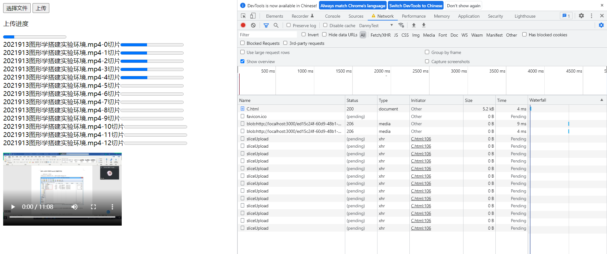
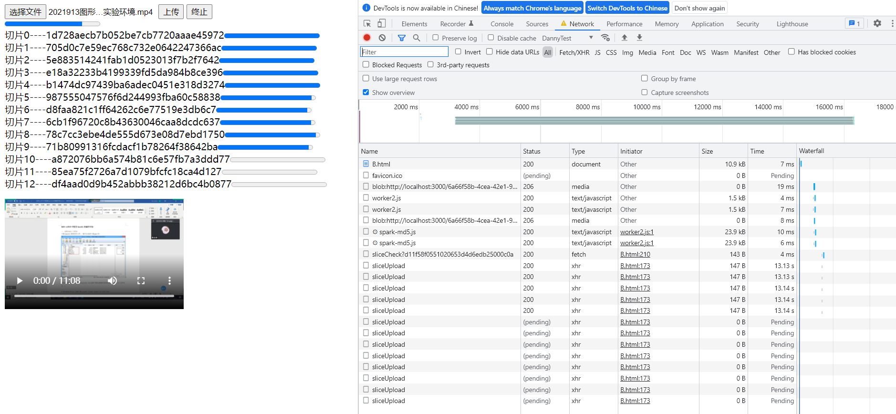
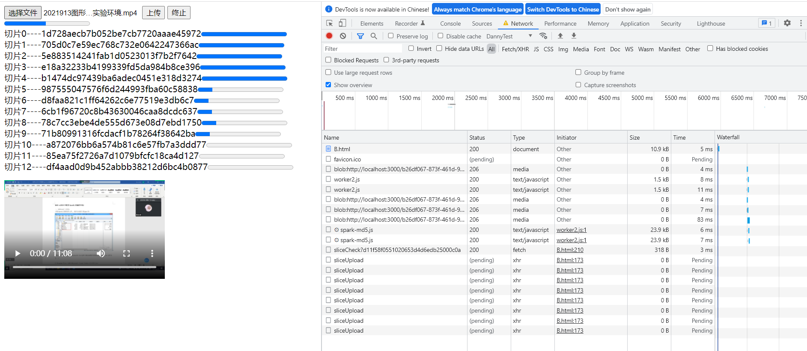
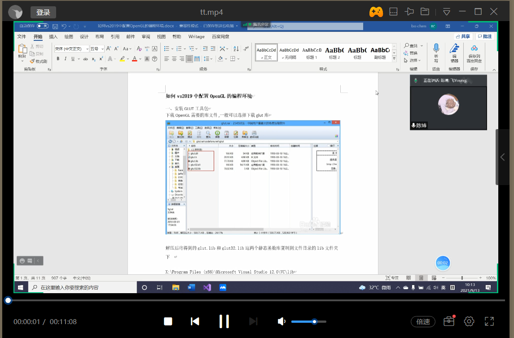

# 1.非持久的断点下载
### 介绍：
在不关闭页面的情况下实现暂停，重传，暂停，重传...的行为。

### 实现思路：

1. 使用的API是fetchAPI
2. 使用AbortController来终止Promise
3. 使用可控可读流和response.blob()实现多次暂停后的数据拼接，拼接操作blob()会完成，不需要自己写额外代码
4. 请求头维护Range字段，告知服务端已接收到的字节数


### 演示代码说明：
1. 演示代码以上传视频为例
2. 视频为mp4格式
3. 本地回路测试占用3000端口
### 客户端代码
```html
<button onclick="handleClick()">下载</button>
<button onclick="handleAbort()">终止请求</button>
<p>下载中</p>
<progress id="progress" value="0" ></progress>
<video id="video" style="display: block;" controls>
</video>
<script>
    let progress = document.querySelector("#progress")
    let video = document.querySelector("#video")
    let controller = null

    // 断点重传信息
    let sum = 0

    // 中断请求函数
    function handleAbort() {
        controller.abort()
    }

    // 发起请求函数
    function handleClick() {
        controller = new AbortController()
        let signal = controller.signal
        fetch("/test.mp4", {
            signal: signal,
            headers: {
                "Range": `bytes=${sum}`
            }
        })
            .then(res => {
                // 获取response.body的可读流的读锁
                let streamLock = res.body.getReader()
                // 进度条的总长度为数据总字节数
                progress.max = parseInt(res.headers.get("Content-Length"))
                // 创建可控可读流
                return new Response(new ReadableStream({
                    async start(control) {
                       while(true) {
                           // res.body.getReader().read()相当于调用异步迭代器的next()方法
                           let { done, value } = await streamLock.read()
                           if(done) {
                               // 可控可读流关闭
                               control.close()
                               break
                           } else {
                               // sum记录已读取的字节数，用于维护请求头的Range字段和进度条的进度
                               sum += value.length
                               progress.value = sum
                               // 加入可控可读流
                               control.enqueue(value)
                           }
                       }
                    }
                }))
            })
            .then(res =>  res.blob()) // response.blob可以自动拼接流中的数据，我们不需要处理分片
            .then(res => {
                // 下载完成后展示
                video.src = URL.createObjectURL(res)
            })
    }
</script>
```

### 服务端代码
```javascript
let fs = require("fs").promises
require("http").createServer((req, res) => {
    if(req.url.includes("html")) {
        fs.readFile("." + req.url).then(data => {
            res.writeHead(200, {
                "Content-Type": "text/html"
            })
            res.write(data)
            res.end()
        })
    } else if(req.url.includes("mp4")) {
        fs.readFile("." + req.url).then(data => {
            res.writeHead(200, {
                "Content-Type": "video/mp4",
                "Content-Length": data.length,
            })
            res.write(data)
            res.end()
        })
    } 
}).listen(3000)
```

# 2.大文件切片上传
### 介绍：
大文件上传采用普通的客户端上传操作会比较耗时，尤其是G级文件。这里采取的方案是将大文件切成若干个片段并发上传，并发量由TCP套接字数量和浏览器调度决定(见“HTTP1.1抓包分析”)，最终由服务端将片段合并。

### 实现效果：
由于TCP套接字池限制，此时能做到的最大并发请求是5。最初的html的请求占用一个TCP套接字。


### 2.1 客户端操作
1. 参考“客户端JavaScript的IO操作”打开文件
```javascript
// input文件选择事件，此函数对应input的onchange属性的绑定
function handleChanged() {
    // 获取打开的文件(input标签设置只能选择打开一个文件，所以是files[0])，file是全局变量。
    file = event.target.files[0]
    // 假设打开一个视频。在video标签中预览视频，video是video元素的引用，是全局变量。
    video.src = URL.createObjectURL(file)
}
```
2. 文件切片
```javascript
// 每一个切片大小限制为5MB
const SLICE_SIZE = 5 * 1024 * 1024
// 文件切片，传入的参数file是input标签打开的文件
function fileSlice(file) {
    let pos = 0
    let chunks = []
    while(pos < file.size) {
        // slice可以自动处理第二个参数越界
        chunks.push(file.slice(pos, pos + SLICE_SIZE))
        pos += SLICE_SIZE
    }
    return chunks
}
```
3. 为每个切片都创建一个进度条并插入DOM
```javascript
// progresses是全局变量，一个数组，用于存储这些进度条的引用
let progresses = []
// 为每一个切片创建一个进度条并插入DOM
function makeProgress(length) {
    let ar = []
    // 创建元素
    for(let i = 0; i < length; i ++) {
        let div = document.createElement("div")
        let span = document.createElement("span")
        span.textContent = `${file.name}-${i}切片`
        let progress = document.createElement("progress")
        progress.value = 0
        div.prepend(span)
        div.append(progress)
        ar.push(div)
    }
    // 插入DOM并更新切片进度条的引用
    ar.forEach((div, index) => {
        video.before(div)
        // progresses是全局变量，一个数组，用于存储这些进度条的引用
        progresses[index] = div.lastElementChild
    })
}
```
4. 切片进行并发上传，并且监听上传进度，为此封装一个特殊格式的网络请求。在监听进度时会更新进度条的进度信息。
```javascript
// 分片上传的网络请求的封装，最后一个参数为已经切好的文件片段数组，倒数第二个参数为这些分片共用的标识名称，就像IP数据报中的标识字段
function sliceRequestMaker(method, url, name, chunkList) {
    let promises = []
    chunkList.forEach((chunk, index) => {
        let xhr = new XMLHttpRequest()
        // 用promise封装xhr，以便于使用all方法，使用xhr而不用fetch是用于获取上传进度
        promises.push(new Promise((res, rej) => {
            xhr.open(method, url)
            let fd = new FormData
            // body为chunk分片和分片的序号和文件名称
            fd.append("chunk", chunk)
            fd.append("index", index)
            fd.append("name", name)
            // 监听每一个分片的上传事件，并记录上传进度，监听事件要在xhr.send之前
            xhr.upload.onprogress = function(event) {
                // progresses和progress都是全局变量，progress为总进度条元素的引用，progresses[index]为当前切片上传进度条的引用
                progresses[index].max = event.total
                progresses[index].value = event.loaded
                // 更新总进度条的进度为所有切片已上传的进度
                progress.value = progresses.reduce((a, b) => a + b.value, 0)
            }
            xhr.onload = function() {
                if(xhr.readyState === 4 && xhr.status === 200)
                    res(xhr.response)
                else
                    rej("请求失败")
            }

            xhr.send(fd)
        }))
    })
    return promises
}
```
5. 获取封装好的网络请求进行切片上传，上传完毕后再发送一个切片合并请求合并切片
```javascript
// 上传事件
async function handleUpload() {
    // 获取文件的切片
    let chunks = fileSlice(file)
    // 为每一个切片创建一个进度条
    makeProgress(chunks.length)
    // 更新总进度条总量
    progress.max = file.size
    // 获取封装好的网络请求数组，/sliceUpload是切片上传接口
    let promises = sliceRequestMaker("post", "/sliceUpload", file.name, chunks)
    // 并行处理
    await Promise.all(promises).then(console.log, console.log)
    // 最后发送一个合并分片请求，/sliceMerge是切片合并接口
    await fetch("/sliceMerge", {
        method: "post",
        body: JSON.stringify({
            // 携带内容时文件名，让服务端明确要合并哪个文件的所有切片
            name: file.name,
            // 携带此文件的分片大小，用于服务端读写依据
            size: SLICE_SIZE
        })
    })
}
```

### 2.2 服务端操作
1. 创建服务器，实现服务器基本功能。能够展示网页，并提前预留接口
```javascript
http.createServer(function(req, res) {
    if(req.url.includes("html")) {
        fs.readFile("." + req.url).then(data => {
            res.write(data)
            res.end()
        })
    } else if(req.url.includes("sliceUpload")) { // 分片上传接口
    } else if(req.url.includes("sliceMerge")) { // 分片合并接口
    }
}).listen("3000")
```
2. 实现分片上传接口，接收分片。在此使用multiparty包解析客户端FormData序列化的数据。
```javascript
// 设置一个promises全局变量，用于记录每个分片写入的完成情况，全部写入后才可合并
let promises = []
let multiparty = require("multiparty")
if(req.url.includes("sliceUpload")) { // 分片上传接口
    let form = new multiparty.Form()
    form.parse(req, async function (err, fields, files) {
        let chunk = files.chunk[0]
        let index = fields.index[0]
        let name = fields.name[0]
        // 处理分片，建立文件夹保存分片数据，进一步实现具体的分片处理函数
        let promise = await getSlices({chunk, index, name})
        promises.push(promise)
        // 清除该分片在C盘的缓存
        fss.unlinkSync(chunk.path)
        res.write("成功")
        res.end()
    })
}
```
2.1 进一步实现分片处理函数。分片处理函数的作用是将分片临时存储到临时文件夹中。
```javascript
// 处理分片函数
async function getSlices({chunk: chunk, index: index, name: name}) {
    // 在当前目录下创建一个存储分片文件的文件夹，在此之前先询问是否已存在此文件夹
    let path = "./" + name + "Temp"
    try {
        fss.statSync(path)
    } catch {
        await fs.mkdir(path)
    }
    //通过流读写，先从缓冲区读取分片信息
    let readStream = fss.createReadStream(chunk.path)
    let writeStream = fss.createWriteStream(path + "/" + index)
    readStream.pipe(writeStream)
    // 返回一个标识当前切片写入完成的promise。这样是应对一种情况，当合并请求被服务端接收时，分片写入仍未完成，那么必须等待写入完成后才能合并切片。
    return new Promise(res => {
        writeStream.on("finish", function() {
            res("完成")
        })
    })
}
```
3. 实现分片合并接口
```javascript
if(req.url.includes("sliceMerge")) { // 分片合并接口
    // 要合并某一个文件的分片，在此先获取这个文件的名称
    let data = ""
    req.on("data", function (chunk) {
        data += chunk
    })
    req.on("end", async function () {
        data = JSON.parse(data)
        // 等到所有切片都写入完成后再合并，还可以优化为一旦一个切片写入完成，那么立即合并一个
        // 这个promises就是上面第二步中提到的全局对象
        await Promise.all(promises)
        // 等到所有切片都合并完成后才能删除
        await Promise.all(await mergeSlice(data.name, data.size))
        // 合并完成后删除存储临时切片的文件夹
        await deleteSlice(data.name)
        promises = []
        res.write("ok")
    })
}
```
3.1 进一步实现分片合并函数
```javascript
// 合并分片函数，第一个参数是文件名，第二个参数是分片大小
async function mergeSlice(name, size) {
    // 该文件默认保存在以下路径中
    let path = name + "Temp"
    // 获取目录下的所有分片
    let files = await fs.readdir(path)
    // promises用于记录每一个分片是否都被写入最终文件完成合并，当promises中的promise全兑现时服务端向客户端反馈完成。
    let promises = []
    // 临时存储分片的文件夹下的每一个分片都使用可读流读出，再统一写到一个新的文件
    files.forEach((filename, index) => {
        let readStream = fss.createReadStream(path + "/" + filename)
        let writeStream = fss.createWriteStream("./tt.mp4", {
            // filename命名就是当前切片在所有切片中的序号，因此知道应该写到哪个位置
            start: parseInt(filename) * size
        })
        readStream.pipe(writeStream)
        promises.push(new Promise(res => {
            writeStream.on("finish", res)
        }))
    })
    return promises
}
```
3.2 进一步实现删除临时存储切片的文件夹函数
```javascript
// 删除临时存储切片的文件夹
async function deleteSlice(name) {
    // 该文件默认保存在以下路径中
    let path = name + "Temp"
    // 获取目录下的所有分片
    let files = await fs.readdir(path)
    // 删除切片文件
    let ps = []
    files.forEach(filename => ps.push(fs.rm(path + "/" + filename)))
    // 等待切片文件删除完成
    for await(let p of ps);
    // 文件夹为空时才可删除文件夹
    await fs.rmdir(path)
}
```

### 2.3 完整代码
### 网页代码
```html
<input style="display: none;" id="input" type="file" accept="video/mp4" onchange="handleChanged()"/>
    <button onclick="handleSelect()">选择文件</button>
    <button onclick="handleUpload()">上传</button>
    <p>上传进度</p>
    <progress value="0" id="progress"></progress>
    <video id="video" controls style="display: block;"></video>
    <script>
        let input = document.querySelector("#input")
        let video = document.querySelector("#video")
        let progress = document.querySelector("#progress")
        // 切片进度条的元素的引用
        let progresses = []
        let file = null
        // 每一个切片大小限制为5MB
        const SLICE_SIZE = 5 * 1024 * 1024

        // input文件选择事件
        function handleChanged() {
            file = event.target.files[0]
            video.src = URL.createObjectURL(file)
        }

        // 文件选择事件
        function handleSelect() {
            input.click()
        }

        // 为每一个切片创建一个进度条并插入DOM
        function makeProgress(length) {
            let ar = []
            // 创建元素
            for(let i = 0; i < length; i ++) {
                let div = document.createElement("div")
                let span = document.createElement("span")
                span.textContent = `${file.name}-${i}切片`
                let progress = document.createElement("progress")
                progress.value = 0
                div.prepend(span)
                div.append(progress)
                ar.push(div)
            }
            // 插入DOM并更新切片进度条的引用
            ar.forEach((div, index) => {
                video.before(div)
                progresses[index] = div.lastElementChild
            })
        }

        // 上传事件
        async function handleUpload() {
            // 获取文件的切片
            let chunks = fileSlice(file)
            // 为每一个切片创建一个进度条
            makeProgress(chunks.length)
            // 更新总进度条总量
            progress.max = file.size
            // 获取封装好的网络请求数组
            let promises = sliceRequestMaker("post", "/sliceUpload", file.name, chunks)
            // 并行处理
            await Promise.all(promises).then(console.log, console.log)
            // 最后发送一个合并分片请求
            await fetch("/sliceMerge", {
                method: "post",
                body: JSON.stringify({
                    name: file.name,
                    size: SLICE_SIZE
                })
            })
        }

        // 分片上传的网络请求的封装，最后一个参数为已经切好的文件片段数组，倒数第二个参数为这些分片共用的标识名称，就像IP数据报中的标识字段
        function sliceRequestMaker(method, url, name, chunkList) {
            let promises = []
            chunkList.forEach((chunk, index) => {
                let xhr = new XMLHttpRequest()
                // 用promise封装xhr，以便于使用all方法，使用xhr而不用fetch是用于获取上传进度
                promises.push(new Promise((res, rej) => {
                    xhr.open(method, url)
                    let fd = new FormData
                    // body为chunk分片和分片的序号和文件名称
                    fd.append("chunk", chunk)
                    fd.append("index", index)
                    fd.append("name", name)
                    // 监听每一个分片的上传事件，并记录上传进度，监听事件要在xhr.send之前
                    xhr.upload.onprogress = function(event) {
                        progresses[index].max = event.total
                        progresses[index].value = event.loaded
                        progress.value = progresses.reduce((a, b) => a + b.value, 0)
                    }
                    xhr.onload = function() {
                        if(xhr.readyState === 4 && xhr.status === 200)
                            res(xhr.response)
                        else
                            rej("请求失败")
                    }

                    xhr.send(fd)
                }))
            })
            return promises
        }

        // 文件切片
        function fileSlice(file) {
            let pos = 0
            let chunks = []
            while(pos < file.size) {
                // slice可以自动处理第二个参数越界
                chunks.push(file.slice(pos, pos + SLICE_SIZE))
                pos += SLICE_SIZE
            }
            return chunks
        }
    </script>
```

### 服务端代码
```javascript
let fs = require("fs").promises
let fss = require("fs")
let http = require("http")
let multiparty = require("multiparty")
// 存储切片写入的promise数组
let promises = []

http.createServer(function(req, res) {
    if(req.url.includes("html")) {
        fs.readFile("." + req.url).then(data => {
            res.write(data)
            res.end()
        })
    } else if(req.url.includes("sliceUpload")) { // 分片上传接口
        let form = new multiparty.Form()
        form.parse(req, async function(err, fields, files) {
            let chunk = files.chunk[0]
            let index = fields.index[0]
            let name = fields.name[0]
            // 处理分片，建立文件夹保存分片数据
            let promise = await getSlices({chunk, index, name})
            promises.push(promise)
            // 清除该分片在C盘的缓存
            fss.unlinkSync(chunk.path)
            res.write("成功")
            res.end()
        })
    } else if(req.url.includes("sliceMerge")) { // 分片合并接口
        // 要合并某一个文件的分片，在此先获取这个文件的名称
        let data = ""
        req.on("data", function(chunk) {
            data += chunk
        })
        req.on("end", async function() {
            data = JSON.parse(data)
            // 等到所有切片都写入完成后再合并，还可以优化为一旦一个切片写入完成，那么立即合并一个
            await Promise.all(promises)
            // 等到所有切片都合并完成后才能删除
            await Promise.all(await mergeSlice(data.name, data.size))
            // 合并完成后删除存储临时切片的文件夹
            await deleteSlice(data.name)
            promises = []
            res.write("ok")
        })
    }
}).listen("3000")

// 处理分片函数
async function getSlices({chunk: chunk, index: index, name: name}) {
    // 在当前目录下创建一个存储分片文件的文件夹，在此之前先询问是否已存在此文件夹
    let path = "./" + name + "Temp"
    try {
        fss.statSync(path)
    } catch {
        await fs.mkdir(path)
    }
    //通过流读写，先从缓冲区读取分片信息
    let readStream = fss.createReadStream(chunk.path)
    let writeStream = fss.createWriteStream(path + "/" + index)
    readStream.pipe(writeStream)
    // 返回一个标识当前切片写入完成的promise
    return new Promise(res => {
        writeStream.on("finish", function() {
            res("完成")
        })
    })
}

// 合并分片函数，第一个参数是文件名，第二个参数是分片大小
async function mergeSlice(name, size) {
    // 该文件默认保存在以下路径中
    let path = name + "Temp"
    // 获取目录下的所有分片
    let files = await fs.readdir(path)

    let promises = []
    files.forEach((filename, index) => {
        let readStream = fss.createReadStream(path + "/" + filename)
        let writeStream = fss.createWriteStream("./tt.mp4", {
            // filename命名就是当前切片在所有切片中的序号，因此知道应该写到哪个位置
            start: parseInt(filename) * size
        })
        readStream.pipe(writeStream)
        promises.push(new Promise(res => {
            writeStream.on("finish", res)
        }))
    })
    return promises
}

// 删除临时存储切片的文件夹
async function deleteSlice(name) {
    // 该文件默认保存在以下路径中
    let path = name + "Temp"
    // 获取目录下的所有分片
    let files = await fs.readdir(path)
    // 删除切片文件
    let ps = []
    files.forEach(filename => ps.push(fs.unlink(path + "/" + filename)))
    // 等待切片文件删除完成
    for await(let p of ps);
    // 文件夹为空时才可删除文件夹
    await fs.rmdir(path)
}
```

# 3.持久的断点上传
### 介绍：
持久的断点上传是指上传某个文件时，点击暂停。重启浏览器继续上传时能够依据上次的进度继续上传。

### 实现效果：
上传至此时点击终止

退出浏览器重新打开页面，选择相同文件上传

最终上传完毕，写入tt.mp4，可以正常打开


### 思路：
断点上传的思路基于大文件分片上传，把文件分成若干个切片后并发上传。当暂停时，终止所有上传请求。再次上传时，先发起一个已上传切片查询请求，服务端返回已接收的切片告知客户端。客户端再依据已上传切片继续上传剩余切片。

### 具体任务：
>**客户端：**  
>1. 文件选择   
> 
> 
>2. 文件切片
> 
> 
>3. 文件MD5加密和文件切片MD5加密
> 
> 
>4. 网络请求封装
> 
> 
>5. 切片上传

>**网络接口：**
>1. 切片上传接口：   
>   * 当前切片在所有切片中的序号   
>   * 当前切片的MD5编码   
>   * 切片文件   
>   * 切片所属文件的MD5编码
>
> 
>2. 切片查询接口：   
>   * 文件的MD5编码
>
>
>3. 切片合并接口：   
>   * 文件的MD5编码
>   * 文件切片的大小

>**服务端：**
>1. 搭建基础http服务器，支持对html和js文件的请求
> 
> 
>2. 实现切片上传接口
> 
> 
>3. 实现切片查询接口
> 
> 
>4. 实现切片合并功能
> 
> 
>5. 实现文件夹删除功能

>**服务端存储规范：**
>1. 上传来的文件的切片保存在当前目录下的一个文件夹，该文件夹命名为文件名+“Temp”
>
> 
>2. 上传来的切片的保存在该文件下，命名为切片的MD5编码+该切片在所有切片中的序号
>
> 
>3. 当完成切片合并后删除该文件夹，最终合并后的文件保存在当前目录下，命名为tt.mp4(假设传视频)

### 3.1 客户端文件选择和文件切片
此部分内容和2中介绍的大文件上传一样，基本没有改动，具体实现见最下方完整代码。

### 3.2 客户端MD5编码
断点续传再次上传文件名可能改变但是文件内容不变，因此得到的MD5编码结果不变。如果对文件和切片进行MD5编码，那么即使用户更改了原文件名，也能恢复到上一次进度继续上传。   
**实现步骤：**
1. 下载spark-md5包，可以去github或npm官网搜索，或见另一篇博客“JavaScript线程池设计”
2. 实现客户端的MD5线程池，因为MD5计算量大且耗时，引入线程池优化。下述代码分析详情见“JavaScript线程池介绍”
```javascript
class MD5Pool {
    worker = []
    status = "Idle"
    blockRequestQueue = []
    constructor(size) {
        for(let i = 0; i < size; i ++)
            this.worker.push({
                worker: new Worker("worker.js"),
                status: "Idle"
            })
    }

    statusUpdate() {
        let sum = 0
        this.worker.forEach(({ status }) => {
            if(status === "Busy")
                sum ++
        })
        if(sum === this.worker.length)
            this.status = "Busy"
         else
            this.status = "Idle"
    }

    assign() {
        if(this.status !== "Busy") {
            for (let i = 0; i < this.worker.length; i++)
                if (this.worker[i].status === "Idle") {
                    this.worker[i].status = "Busy"
                    this.statusUpdate()
                    return {
                        worker: this.worker[i].worker,
                        index: i
                    }
                }
        }
        else {
            let resolve = null
            let promise = new Promise(res => {
                resolve = res
            })
            this.blockRequestQueue.push(resolve)
            return {
                info: "full",
                wait: promise
            }
        }
    }

    release(index) {
        this.worker[index].status = "Idle"
        // 阻塞请求队列中的第一个请求出队，队列中存储的是promise的resolve方法，此时执行，通知请求者已经有可用的线程了
        if(this.blockRequestQueue.length)
            this.blockRequestQueue.shift()()
        this.status = "Idle"
    }
}
```
3. 实现加密函数
```javascript
// 获取文件的MD5编码的函数，第一个参数是文件，第二个参数是MD5线程池，第三个参数表示是第几个切片，第四个参数是文件名
async function getMD5(chunk, pool, i, filename) {
    let thread = pool.assign()
    // 如果info为full，那么说明线程池线程已被全部占用，需要等待
    if(thread.info === "full") {
        // 获取线程等待期约
        let wait = thread.wait
        // 等到wait兑现时说明已经有可用的线程了
        await wait
        thread = pool.assign()
        let { worker, index } = thread
        worker.postMessage(chunk)
        worker.onmessage = function ({data}) {
            // 存储MD5编码
            localStorage.setItem(`${filename}-${i}`,data)
            localStorage.setItem(data,`${filename}-${i}`)
            pool.release(index)
        }
    } else {
        // 此时线程池不满，有可用线程
        let { worker, index } = thread
        worker.postMessage(chunk)
        worker.onmessage = function ({data}) {
            // 存储MD5编码
            localStorage.setItem(`${filename}-${i}`,data)
            localStorage.setItem(data,`${filename}-${i}`)
            pool.release(index)
        }
    }
}
```
4. 加密函数的使用
```javascript
// input点击事件处理函数
function handleChanged() {
    file = event.target.files[0]
    video.src = URL.createObjectURL(file)
    // 创建一个大小为3的MD5计算线程池
    let pool = new MD5Pool(2)
    // 计算整个文件的MD5编码，第三个参数为-1表示是整个文件，其它则表示该文件的第几个切片
    getMD5(file, pool, -1, file.name)
    // 获取文件切片
    chunkList = fileSlice(file)
    // 计算每个切片文件的MD5编码
    chunkList.forEach((chunk, index) => {
        getMD5(chunk, pool, index, file.name)
    })
}
```
5. 实现MD5加密的工作线程worker.js
```javascript
self.importScripts("spark-md5.js")

let fd = new FileReader()
let spark = new self.SparkMD5.ArrayBuffer()

self.onmessage = function(event) {
    // 获取文件
    let chunk = event.data
    // spark-md5要求计算文件的MD5必须切片计算
    let chunks = fileSlice(chunk)
    // 计算MD5编码
    load(chunks)
}

// 切片函数
function fileSlice(file) {
    let pos = 0
    let chunks = []
    // 将文件平均切成10分计算MD5
    const SLICE_SIZE = Math.ceil(file.size / 10)
    while(pos < file.size) {
        // slice可以自动处理第二个参数越界
        chunks.push(file.slice(pos, pos + SLICE_SIZE))
        pos += SLICE_SIZE
    }
    return chunks
}

// MD5计算函数
async function load(chunks) {
    for(let i = 0; i < chunks.length; i ++) {
        fd.readAsArrayBuffer(chunks[i])
        // 在这里希望节约空间，因此复用了FileReader，而不是每次循环新创建一个FileReader。需要等到FileReader完成read后才可以进行下一轮复用，因此用await阻塞。
        await new Promise(res => {
            fd.onload = function(event) {
                spark.append(event.target.result)
                if(i === chunks.length - 1) {
                    self.postMessage(spark.end())
                }
                res()
            }
        })
    }
}
```

### 3.3 客户端切片上传网络请求的封装
按照上述的规定，网络请求要携带如下参数
1. 该文件切片的MD5编码
2. 该文件切片在所有切片序列中的位置编号
3. 该文件切片的内容
4. 该文件切片所属的文件的MD5编码

另外要考虑的事情是请求终止，要将每个请求的终止函数暴露出来，如下“reqsAbort.push(xhr.abort.bind(xhr))”，用户请求暂停时调用之。
```javascript
// 分片上传的网络请求的封装，最后一个参数为已经切好的文件片段数组，倒数第二个参数为这些分片共用的标识名称，就像IP数据报中的标识字段
function sliceRequestMaker(method, url, name, chunkList) {
    let promises = [], reqsAbort = []
    chunkList.forEach(chunk => {
        let xhr = new XMLHttpRequest()
        // 用promise封装xhr，以便于使用all方法，使用xhr而不用fetch是用于获取上传进度
        promises.push(new Promise((res, rej) => {
            xhr.open(method, url)
            // reqsAbort数组存储请求拒绝函数
            reqsAbort.push(xhr.abort.bind(xhr))
            let fd = new FormData
            // body为chunk分片和文件名称和chunk分片在总分片中的位置和分片的名称
            fd.append("chunk", chunk.chunk)
            fd.append("name", name)
            fd.append("index", chunk.index)
            fd.append("sliceName", localStorage.getItem(`${file.name}-${chunk.index}`))
            // 监听每一个分片的上传事件，并记录上传进度，监听事件要在xhr.send之前
            xhr.upload.onprogress = function(event) {
                // chunk.index表示当前切片在所有切片中的序号，对应其进度条
                progresses[chunk.index].max = event.total
                progresses[chunk.index].value = event.loaded
                progress.value = progresses.reduce((a, b) => a + b.value, 0)
            }
            xhr.onload = function() {
                if(xhr.readyState === 4 && xhr.status === 200)
                    res(xhr.response)
                else
                    rej("请求失败")
            }
            xhr.send(fd)
        }))
    })
    return [promises, reqsAbort]
}
```

### 3.4 客户端切片上传
客户端切片上传的逻辑如下：
1. 发起一个切片检查请求，携带一个参数是文件的MD5编码。服务端返回一个切片MD5编码数组，通过比较可知该文件有哪些切片已经上传到服务器，本次还要上传哪些文件。


2. 已经上传到服务器的切片要更新它们的进度条，设置为100%，并且更新总进度条。


3. 获得3.3中封装好的切片上传网络请求对象，把剩余未上传的切片通过该对象发送给服务端


4. 当发送完毕后，向服务器发送一个切片合并请求
```javascript
// 开始上传
async function start() {
    // 获取文件的切片
    let chunks = chunkList
    // 为每一个切片创建一个进度条，此函数请参考2中介绍大文件上传时的函数，具体实现见最下方完整代码
    makeProgress(chunks.length)
    // 更新总进度条总量
    progress.max = file.size

    // 查询服务端已经接收并保存的切片
    let res = await fetch("/sliceCheck?" + localStorage.getItem(`${file.name}-${-1}`)).then(res => res.json())
    let hasUploadChunks = chunks.flatMap((chunk, index) => {
        if(res.indexOf(localStorage.getItem(`${file.name}-${index}`)) !== -1)
            return index
        else
            return []
    })
    // 若切片已被服务端接收，那么更新其上传进度为100%
    hasUploadChunks.forEach(chunkIndex => {
        progresses[chunkIndex].max = chunkList[chunkIndex].size
        progresses[chunkIndex].value = progresses[chunkIndex].max
        progress.value += progresses[chunkIndex].value
    })

    // 将服务器未接收保存的切片重新上传
    let needUploadChunks = chunks.flatMap((chunk, index) => {
        if(res.indexOf(localStorage.getItem(`${file.name}-${index}`)) === -1)
            return { chunk, index }
        else
            return []
    })
    // 获取封装好的网络请求数组
    let [promises, reqs] = sliceRequestMaker("post", "/sliceUpload", localStorage.getItem(`${file.name}-${-1}`), needUploadChunks)
    reqsAbort = reqs
    // 并行处理
    await Promise.all(promises)
    // 切片合并请求
    await fetch("/sliceMerge", {
        method: "post",
        body: JSON.stringify({
            name: localStorage.getItem(`${file.name}-${-1}`),
            size: SLICE_SIZE
        })
    })
}
```

### 4.1 服务端实现基本http服务器，并实现基本接口
```javascript
let fs = require("fs").promises
let fss = require("fs")
let http = require("http")
let multiparty = require("multiparty")

http.createServer(function(req, res) {
    // 支持html和js文件的访问，因为需要用到工作线程所以要添加js类型可访问
    if(req.url.includes("html") || req.url.includes("js")) {
        fs.readFile("." + req.url).then(data => {
            if(req.url.includes("js"))
                res.writeHead(200, {
                    "Content-Type": "text/javascript"
                })
            else
                res.writeHead(200, {
                    "Content-Type": "text/html"
                })
            res.write(data)
            res.end()
        })
    } else if(req.url.includes("sliceUpload")) { // 分片上传接口
    } else if(req.url.includes("sliceCheck")) {  // 分片查询接口
    }  else if(req.url.includes("sliceMerge")) { // 分片合并接口
    }
}).listen(3000)
```

### 4.2 服务端实现分片上传接口
```javascript
if(req.url.includes("sliceUpload")) {
    let form = new multiparty.Form()
    form.parse(req, async function (err, fields, files) {
        // 分片上传接口要求的四个参数，分别为：切片本身，切片所属文件的MD5编码，当前切片在所有切片中的序号，切片自身的MD5编码
        let chunk = files.chunk[0]
        let name = fields.name[0]
        let index = fields.index[0]
        let sliceName = fields.sliceName[0]
        // 处理分片，建立文件夹保存分片数据
        let promise = await getSlices({chunk, sliceName, name, index})
        // promises存储所有切片的处理操作，等待其所有元素兑现后才可合并
        promises.push(promise)
        // 清除该分片在C盘的缓存
        fss.unlinkSync(chunk.path)
        res.write("成功")
        res.end()
    })
}
```
进一步实现getSlice函数，实现切片读写到服务端
```javascript
// 处理分片函数
async function getSlices({chunk: chunk, sliceName: sliceName, name: name, index: index}) {
    // 在当前目录下创建一个存储分片文件的文件夹，在此之前先询问是否已存在此文件夹
    let path = "./" + name + "Temp"
    try {
        fss.statSync(path)
    } catch {
        await fs.mkdir(path)
    }
    //通过流读写，先从缓冲区读取分片信息
    let readStream = fss.createReadStream(chunk.path)
    // 写入分片时，分片文件名设置为其MD5编码 + 其所在所有分片中的位置编号
    let writeStream = fss.createWriteStream(path + "/" + sliceName + index)
    readStream.pipe(writeStream)
    // 返回一个标识当前切片写入完成的promise
    return new Promise(res => {
        writeStream.on("finish", res)
    })
}
```

### 4.3 服务端实现分片查询接口
分片查询接口按照上述指定的规则，参数只接收一个，为文件的MD5编码。然后查询其是否在服务端本地已经有被保存的切片。
```javascript
if(req.url.includes("sliceCheck")) {
    let filename = req.url.slice(req.url.indexOf("?") + 1)
    let path = "./" + filename + "Temp"
    fs.readdir(path).then(slices => {
        // 保存的切片文件的名称是其MD5编码 + 该切片所在总文件中的切片编号。返回时返回其MD5编码即可
        slices = slices.map(slice => slice.slice(0,slice.length - 1))
        // slices即为已保存的切片数组
        res.write(JSON.stringify(slices))
        res.end()
    }, () => {
        res.write(JSON.stringify([]))
        res.end()
    })
}
```

### 4.4 服务端实现分片合并
这里的分片合并几乎和2中介绍的大文件分片上传的分片合并部分代码一样，下面仅介绍不同代码。   
差别在于分片在所有分片中的序号的获取，上述规范要求切片命名规则为MD5编码+分片序号，那么序号的获取直接通过字符串截取获得即可。
```javascript
// 合并分片函数，第一个参数是文件名，第二个参数是分片大小
async function mergeSlice(name, size) {
    // 该文件默认保存在以下路径中
    let path = name + "Temp"
    // 获取目录下的所有分片
    let files = await fs.readdir(path)

    let promises = []
    files.forEach((filename, index) => {
        let readStream = fss.createReadStream(path + "/" + filename)
        let writeStream = fss.createWriteStream("./tt.mp4", {
            // 按照存储规范，文件名的最后存储这该切片在所有切片中的序列号，由于切片的MD5是32位，直接截取获得序号即可
            start: parseInt(filename.slice(32)) * size
        })
        readStream.pipe(writeStream)
        promises.push(new Promise(res => {
            writeStream.on("finish", res)
        }))
    })
    return promises
}
```

### 完整代码
**网页部分**
```html
<input id="input" type="file" accept="video/mp4" onchange="handleChanged()"/>
<button onclick="start()">上传</button>
<button onclick="pause()">终止</button>
<progress id="progress" value="0" style="display:block;"></progress>
<video id="video" controls style="display: block;"></video>
<body>
    <script>
        // 文件
        let file
        // 文件切片
        let chunkList = []
        // 文件切片的大小，单位是字节
        const SLICE_SIZE = 5 * 1024 * 1024
        let video = document.querySelector("#video")
        let progress = document.querySelector("#progress")
        // 切片进度条
        let progresses = []
        // 切片请求终止函数数组
        let reqsAbort = null

        class MD5Pool {
            worker = []
            status = "Idle"
            blockRequestQueue = []
            constructor(size) {
                for(let i = 0; i < size; i ++)
                    this.worker.push({
                        worker: new Worker("worker.js"),
                        status: "Idle"
                    })
            }

            statusUpdate() {
                let sum = 0
                this.worker.forEach(({ status }) => {
                    if(status === "Busy")
                        sum ++
                })
                if(sum === this.worker.length)
                    this.status = "Busy"
                 else
                    this.status = "Idle"
            }

            assign() {
                if(this.status !== "Busy") {
                    for (let i = 0; i < this.worker.length; i++)
                        if (this.worker[i].status === "Idle") {
                            this.worker[i].status = "Busy"
                            this.statusUpdate()
                            return {
                                worker: this.worker[i].worker,
                                index: i
                            }
                        }
                }
                else {
                    let resolve = null
                    let promise = new Promise(res => {
                        resolve = res
                    })
                    this.blockRequestQueue.push(resolve)
                    return {
                        info: "full",
                        wait: promise
                    }
                }
            }

            release(index) {
                this.worker[index].status = "Idle"
                // 阻塞请求队列中的第一个请求出队，队列中存储的是promise的resolve方法，此时执行，通知请求者已经有可用的线程了
                if(this.blockRequestQueue.length)
                    this.blockRequestQueue.shift()()
                this.status = "Idle"
            }
        }

        // input点击事件处理函数
        function handleChanged() {
            file = event.target.files[0]
            video.src = URL.createObjectURL(file)
            // 创建一个大小为3的MD5计算线程池
            let pool = new MD5Pool(2)
            // 计算整个文件的MD5编码，第三个参数为-1表示是整个文件，其它则表示该文件的第几个切片
            getMD5(file, pool, -1, file.name)
            // 获取文件切片
            chunkList = fileSlice(file)
            // 计算切片文件的MD5编码
            chunkList.forEach((chunk, index) => {
                getMD5(chunk, pool, index, file.name)
            })
        }

        // 获取文件的MD5编码的函数，第一个参数是文件，第二个参数是MD5线程池，第三个参数表示是第几个切片，第四个参数是文件名
        async function getMD5(chunk, pool, i, filename) {
            let thread = pool.assign()
            // 如果info为full，那么说明线程池线程已被全部占用，需要等待
            if(thread.info === "full") {
                // 获取线程等待期约
                let wait = thread.wait
                // 等到wait兑现时说明已经有可用的线程了
                await wait
                thread = pool.assign()
                let { worker, index } = thread
                worker.postMessage(chunk)
                worker.onmessage = function ({data}) {
                    // 存储MD5编码
                    localStorage.setItem(`${filename}-${i}`,data)
                    localStorage.setItem(data,`${filename}-${i}`)
                    pool.release(index)
                }
            } else {
                let { worker, index } = thread
                worker.postMessage(chunk)
                worker.onmessage = function ({data}) {
                    // 存储MD5编码
                    localStorage.setItem(`${filename}-${i}`,data)
                    localStorage.setItem(data,`${filename}-${i}`)
                    pool.release(index)
                }
            }
        }

        // 切片函数
        function fileSlice(file) {
            let pos = 0
            let chunks = []
            while(pos < file.size) {
                // slice可以自动处理第二个参数越界
                chunks.push(file.slice(pos, pos + SLICE_SIZE))
                pos += SLICE_SIZE
            }
            return chunks
        }

        // 分片上传的网络请求的封装，最后一个参数为已经切好的文件片段数组，倒数第二个参数为这些分片共用的标识名称，就像IP数据报中的标识字段
        function sliceRequestMaker(method, url, name, chunkList) {
            let promises = [], reqsAbort = []
            chunkList.forEach(chunk => {
                let xhr = new XMLHttpRequest()
                // 用promise封装xhr，以便于使用all方法，使用xhr而不用fetch是用于获取上传进度
                promises.push(new Promise((res, rej) => {
                    xhr.open(method, url)
                    // reqsAbort数组存储请求拒绝函数
                    reqsAbort.push(xhr.abort.bind(xhr))
                    let fd = new FormData
                    // body为chunk分片和文件名称和chunk分片在总分片中的位置和分片的名称
                    fd.append("chunk", chunk.chunk)
                    fd.append("name", name)
                    fd.append("index", chunk.index)
                    fd.append("sliceName", localStorage.getItem(`${file.name}-${chunk.index}`))
                    // 监听每一个分片的上传事件，并记录上传进度，监听事件要在xhr.send之前
                    xhr.upload.onprogress = function(event) {
                        // chunk.index表示当前切片在所有切片中的序号，对应其进度条
                        progresses[chunk.index].max = event.total
                        progresses[chunk.index].value = event.loaded
                        progress.value = progresses.reduce((a, b) => a + b.value, 0)
                    }
                    xhr.onload = function() {
                        if(xhr.readyState === 4 && xhr.status === 200)
                            res(xhr.response)
                        else
                            rej("请求失败")
                    }
                    xhr.send(fd)
                }))
            })
            return [promises, reqsAbort]
        }

        // 为每一个切片创建一个进度条并插入DOM
        function makeProgress(length) {
            let ar = []
            // 创建元素
            for(let i = 0; i < length; i ++) {
                let div = document.createElement("div")
                let span = document.createElement("span")
                span.textContent = `切片${i}----` + localStorage.getItem(`${file.name}-${i}`)
                let progress = document.createElement("progress")
                progress.value = 0
                div.prepend(span)
                div.append(progress)
                ar.push(div)
            }
            // 插入DOM并更新切片进度条的引用
            ar.forEach((div, index) => {
                video.before(div)
                progresses[index] = div.lastElementChild
            })
        }

        // 开始上传
        async function start() {
            // 获取文件的切片
            let chunks = chunkList
            // 为每一个切片创建一个进度条
            makeProgress(chunks.length)
            // 更新总进度条总量
            progress.max = file.size

            // 查询服务端已经接收并保存的切片
            let res = await fetch("/sliceCheck?" + localStorage.getItem(`${file.name}-${-1}`)).then(res => res.json())
            let hasUploadChunks = chunks.flatMap((chunk, index) => {
                if(res.indexOf(localStorage.getItem(`${file.name}-${index}`)) !== -1)
                    return index
                else
                    return []
            })
            // 若切片已被服务端接收，那么更新其上传进度为100%
            hasUploadChunks.forEach(chunkIndex => {
                progresses[chunkIndex].max = chunkList[chunkIndex].size
                progresses[chunkIndex].value = progresses[chunkIndex].max
                progress.value += progresses[chunkIndex].value
            })

            // 将服务器未接收保存的切片重新上传
            let needUploadChunks = chunks.flatMap((chunk, index) => {
                if(res.indexOf(localStorage.getItem(`${file.name}-${index}`)) === -1)
                    return { chunk, index }
                else
                    return []
            })
            // 获取封装好的网络请求数组
            let [promises, reqs] = sliceRequestMaker("post", "/sliceUpload", localStorage.getItem(`${file.name}-${-1}`), needUploadChunks)
            reqsAbort = reqs
            // 并行处理
            await Promise.all(promises)
            await fetch("/sliceMerge", {
                method: "post",
                body: JSON.stringify({
                    name: localStorage.getItem(`${file.name}-${-1}`),
                    size: SLICE_SIZE
                })
            })
        }

        // 暂停上传
        function pause() {
            reqsAbort.forEach(abort => abort())
        }
    </script>
</body>
```
**工作线程 worker.js**
```javascript
self.importScripts("spark-md5.js")

let fd = new FileReader()
let spark = new self.SparkMD5.ArrayBuffer()

self.onmessage = function(event) {
    // 获取文件
    let chunk = event.data
    // spark-md5要求计算文件的MD5必须切片计算
    let chunks = fileSlice(chunk)
    // 计算MD5编码
    load(chunks)
}

// 切片函数
function fileSlice(file) {
    let pos = 0
    let chunks = []
    // 将文件平均切成10分计算MD5
    const SLICE_SIZE = Math.ceil(file.size / 10)
    while(pos < file.size) {
        // slice可以自动处理第二个参数越界
        chunks.push(file.slice(pos, pos + SLICE_SIZE))
        pos += SLICE_SIZE
    }
    return chunks
}

// MD5计算函数
async function load(chunks) {
    for(let i = 0; i < chunks.length; i ++) {
        fd.readAsArrayBuffer(chunks[i])
        // 在这里希望节约空间，因此复用了FileReader，而不是每次循环新创建一个FileReader。需要等到FileReader完成read后才可以进行下一轮复用，因此用await阻塞。
        await new Promise(res => {
            fd.onload = function(event) {
                spark.append(event.target.result)
                if(i === chunks.length - 1) {
                    self.postMessage(spark.end())
                }
                res()
            }
        })
    }
}
```
**服务端代码**
```javascript
let fs = require("fs").promises
let fss = require("fs")
let http = require("http")
let multiparty = require("multiparty")
let promises = []

http.createServer(function(req, res) {
    if(req.url.includes("html") || req.url.includes("js")) {
        fs.readFile("." + req.url).then(data => {
            if(req.url.includes("js"))
                res.writeHead(200, {
                    "Content-Type": "text/javascript"
                })
            else
                res.writeHead(200, {
                    "Content-Type": "text/html"
                })
            res.write(data)
            res.end()
        })
    } else if(req.url.includes("sliceUpload")) {
        let form = new multiparty.Form()
        form.parse(req, async function(err, fields, files) {
            let chunk = files.chunk[0]
            let name = fields.name[0]
            let index = fields.index[0]
            let sliceName = fields.sliceName[0]
            // 处理分片，建立文件夹保存分片数据
            let promise = await getSlices({chunk, sliceName, name, index})
            promises.push(promise)
            // 清除该分片在C盘的缓存
            fss.unlinkSync(chunk.path)
            res.write("成功")
            res.end()
        })
    } else if(req.url.includes("sliceCheck")) {
        let filename = req.url.slice(req.url.indexOf("?") + 1)
        let path = "./" + filename + "Temp"
        fs.readdir(path).then(slices => {
            // 保存的切片文件的名称是其MD5编码 + 该切片所在总文件中的切片编号。返回时返回其MD5编码即可
            slices = slices.map(slice => slice.slice(0,slice.length - 1))
            res.write(JSON.stringify(slices))
            res.end()
        }, () => {
            res.write(JSON.stringify([]))
            res.end()
        })
    }  else if(req.url.includes("sliceMerge")) { // 分片合并接口
        // 要合并某一个文件的分片，在此先获取这个文件的名称
        let data = ""
        req.on("data", function(chunk) {
            data += chunk
        })
        req.on("end", async function() {
            data = JSON.parse(data)
            // 等到所有切片都写入完成后再合并，还可以优化为一旦一个切片写入完成，那么立即合并一个
            await Promise.all(promises)
            // 等到所有切片都合并完成后才能删除
            await Promise.all(await mergeSlice(data.name, data.size))
            // 合并完成后删除存储临时切片的文件夹
            await deleteSlice(data.name)
            promises = []
            res.write("ok")
        })
    }
}).listen(3000)

// 处理分片函数
async function getSlices({chunk: chunk, sliceName: sliceName, name: name, index: index}) {
    // 在当前目录下创建一个存储分片文件的文件夹，在此之前先询问是否已存在此文件夹
    let path = "./" + name + "Temp"
    try {
        fss.statSync(path)
    } catch {
        await fs.mkdir(path)
    }
    //通过流读写，先从缓冲区读取分片信息
    let readStream = fss.createReadStream(chunk.path)
    // 写入分片时，分片文件名设置为其MD5编码 + 其所在所有分片中的位置编号
    let writeStream = fss.createWriteStream(path + "/" + sliceName + index)
    readStream.pipe(writeStream)
    // 返回一个标识当前切片写入完成的promise
    return new Promise(res => {
        writeStream.on("finish", res)
    })
}

// 合并分片函数，第一个参数是文件名，第二个参数是分片大小
async function mergeSlice(name, size) {
    // 该文件默认保存在以下路径中
    let path = name + "Temp"
    // 获取目录下的所有分片
    let files = await fs.readdir(path)
    
    let promises = []
    files.forEach((filename, index) => {
        let readStream = fss.createReadStream(path + "/" + filename)
        let writeStream = fss.createWriteStream("./tt.mp4", {
            // 按照存储规范，文件名的最后存储这该切片在所有切片中的序列号，由于切片的MD5是32位，直接截取获得序号即可
            start: parseInt(filename.slice(32)) * size
        })
        readStream.pipe(writeStream)
        promises.push(new Promise(res => {
            writeStream.on("finish", res)
        }))
    })
    return promises
}

// 删除临时存储切片的文件夹
async function deleteSlice(name) {
    // 该文件默认保存在以下路径中
    let path = name + "Temp"
    // 获取目录下的所有分片
    let files = await fs.readdir(path)
    // 删除切片文件
    let ps = []
    files.forEach(filename => ps.push(fs.unlink(path + "/" + filename)))
    // 等待切片文件删除完成
    for await(let p of ps);
    // 文件夹为空时才可删除文件夹
    await fs.rmdir(path)
}
```