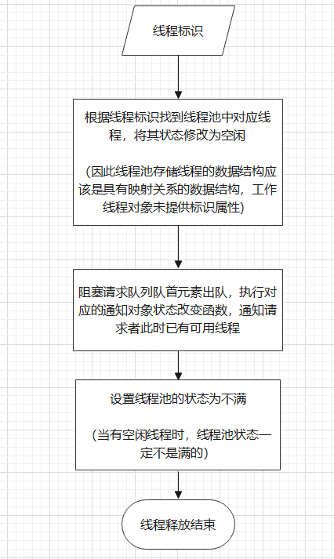

### 1.介绍：
本打算在客户端JavaScript进行机器学习算法计算时应用线程池来优化，就像(http://playground.tensorflow.org)演示的神经网络。但是由于各种原因不了了之了。本次遇到了一个新的问题，客户端的MD5运算也是耗时操作，如果同时对多个字符串或文件进行MD5加密就可以使用线程池来优化。


### 2.准备工作：
到npm官网搜索spark-md5，到其github仓库下载spark-md5.js。该js文件支持AMD，CommonJS和web工作线程的模块系统，我们在实现线程池时，线程工作代码交给web工作线程处理。


### 3.测试spark-md5是否正常工作：
创建一个网页，再创建一个worker.js用于保存工作线程的代码。以下述代码测试，如果成功输出MD5编码，那么准备工作完成。   

**客户端网页代码**
```html
<script>
    let worker = new Worker("worker.js")
    worker.postMessage("Danny")
    worker.onmessage = function({data}) {
        console.log(data)
        worker.terminate()
    }
</script>
```
**工作线程代码**
```javascript
self.importScripts("spark-md5.js")

self.onmessage = function({data}) {
    self.postMessage(self.SparkMD5.hash(data))
}
```

### 4.线程池设计
**1. 目标：**   
本次线程池设计的目标是初始创建n个初始线程，能够满足任意个线程请求，超出n的请求并不丢弃，而是等待到出现空闲线程后再分配之。

**2. 基本设计思路：**   
为了基本满足上述目标，至少要有一个线程分配功能，一个线程回收功能。

**3. 线程分配功能设计：**   
* 线程池满指的是线程池已经没有可用空闲线程
* 通知对象是一个不可逆状态机，可以用Promise对象来实现
* 阻塞请求队列存储Promise对象的resolve方法即可
* 存储线程池中的线程使用数组即可，数组每个元素是一个对象，包括线程和线程状态
* 返回给用户的可用线程还需要有线程在数组中的下标，在线程释放中会用到


**4. 线程释放功能设计：**  
* 线程释放功能需要接收一个参数，为线程的标识，3中设计该标识为数组下标
* 当线程释放后，查看阻塞请求队列是否为空，如果不为空，说明有被阻塞的线程请求，此时令队首元素出队即可，执行resolve()通知对象的状态变更为Fulfilled



**5. 实现线程池：**
```javascript
class MD5Pool {
    // worker用于存储线程
    worker = []
    // status是线程池状态
    status = "Idle"
    // 阻塞请求队列
    blockRequestQueue = []
    // size为用户希望的线程池的容量
    constructor(size) {
        for(let i = 0; i < size; i ++)
            this.worker.push({
                worker: new Worker("worker.js"),
                status: "Idle"
            })
    }
    
    // 线程池状态更新函数
    statusUpdate() {
        let sum = 0
        this.worker.forEach(({ status }) => {
            if(status === "Busy")
                sum ++
        })
        if(sum === this.worker.length)
            this.status = "Busy"
         else
            this.status = "Idle"
    }
    
    // 线程请求方法
    assign() {
        if(this.status !== "Busy") {
            // 此时线程池不满，遍历线程，寻找一个空闲线程
            for (let i = 0; i < this.worker.length; i++)
                if (this.worker[i].status === "Idle") {
                    // 该线程空闲，更新状态为忙碌
                    this.worker[i].status = "Busy"
                    // 更新线程池状态，如果这是最后一个空闲线程，那么线程池状态变为满
                    this.statusUpdate()
                    // 返回给用户该线程，和该线程的标识，标识用数组下标表示
                    return {
                        worker: this.worker[i].worker,
                        index: i
                    }
                }
        }
        else {
            // 此时线程池满
            let resolve = null
            // 创建一个通知对象
            let promise = new Promise(res => {
                // 取得通知对象的状态改变方法
                resolve = res
            })
            // 通知对象的状态改变方法加入阻塞请求队列
            this.blockRequestQueue.push(resolve)
            // 返回给请求者线程池已满信息和通知对象
            return {
                info: "full",
                wait: promise
            }
        }
    }
    
    // 线程释放方法，接收一个参数为线程标识
    release(index) {
        this.worker[index].status = "Idle"
        // 阻塞请求队列中的第一个请求出队，队列中存储的是promise的resolve方法，此时执行，通知请求者已经有可用的线程了
        if(this.blockRequestQueue.length)
            // 阻塞请求队列队首出列，并执行通知对象的状态改变方法
            this.blockRequestQueue.shift()()
        // 更新线程池状态，此时一定空闲
        this.status = "Idle"
    }
}
```

### 5.spark-md5对文件进行md5编码
**说明：**  
在3的测试中spark-md5只是对简单字符串进行MD5编码，并非需要大量运算的耗时操作。spark-md5可以对文件进行MD5编码，耗时较多，实现如下。

**注意：**   
spark-md5对文件编码时必须要对文件进行切片后再加密整合，否则不同文件可能会有相同编码。详情见github或npm。
```javascript
// 在工作线程中引入spark-md5
self.importScripts("spark-md5.js")

let fd = new FileReader()
let spark = new self.SparkMD5.ArrayBuffer()

// 接收主线程发来的消息，是一个文件
self.onmessage = function(event) {
    // 获取文件
    let chunk = event.data
    // spark-md5要求计算文件的MD5必须切片计算
    let chunks = fileSlice(chunk)
    // 计算MD5编码
    load(chunks)
}

// 切片函数
function fileSlice(file) {
    let pos = 0
    let chunks = []
    // 将文件平均切成10分计算MD5
    const SLICE_SIZE = Math.ceil(file.size / 10)
    while(pos < file.size) {
        // slice可以自动处理第二个参数越界
        chunks.push(file.slice(pos, pos + SLICE_SIZE))
        pos += SLICE_SIZE
    }
    return chunks
}

// MD5计算函数
async function load(chunks) {
    for(let i = 0; i < chunks.length; i ++) {
        fd.readAsArrayBuffer(chunks[i])
        // 在这里希望节约空间，因此复用了FileReader，而不是每次循环新创建一个FileReader。需要等到FileReader完成read后才可以进行下一轮复用，因此用await阻塞。
        await new Promise(res => {
            fd.onload = function(event) {
                spark.append(event.target.result)
                if(i === chunks.length - 1) {
                    self.postMessage(spark.end())
                }
                res()
            }
        })
    }
}
```

### 6.大量文件进行MD5加密并使用线程池优化
下面的测试代码就是对上文所述的拼接

**网页代码**
```html
<input id="input" type="file" multiple onchange="handleChanged()"/>
<body>
    <script>
        class MD5Pool {
            worker = []
            status = "Idle"
            blockRequestQueue = []
            constructor(size) {
                for(let i = 0; i < size; i ++)
                    this.worker.push({
                        worker: new Worker("worker.js"),
                        status: "Idle"
                    })
            }

            statusUpdate() {
                let sum = 0
                this.worker.forEach(({ status }) => {
                    if(status === "Busy")
                        sum ++
                })
                if(sum === this.worker.length)
                    this.status = "Busy"
                 else
                    this.status = "Idle"
            }

            assign() {
                if(this.status !== "Busy") {
                    for (let i = 0; i < this.worker.length; i++)
                        if (this.worker[i].status === "Idle") {
                            this.worker[i].status = "Busy"
                            this.statusUpdate()
                            return {
                                worker: this.worker[i].worker,
                                index: i
                            }
                        }
                }
                else {
                    let resolve = null
                    let promise = new Promise(res => {
                        resolve = res
                    })
                    this.blockRequestQueue.push(resolve)
                    return {
                        info: "full",
                        wait: promise
                    }
                }
            }

            release(index) {
                this.worker[index].status = "Idle"
                // 阻塞请求队列中的第一个请求出队，队列中存储的是promise的resolve方法，此时执行，通知请求者已经有可用的线程了
                if(this.blockRequestQueue.length)
                    this.blockRequestQueue.shift()()
                this.status = "Idle"
            }
        }

        // input点击事件处理函数
        function handleChanged() {
            let files = event.target.files
            // 创建一个大小为2的MD5计算线程池
            let pool = new MD5Pool(2)
            // 计算切片文件的MD5编码
            Array.prototype.forEach.call(files, file => {
                getMD5(file, pool)
            })
        }

        // 获取文件的MD5编码的函数，第一个参数是文件，第二个参数是MD5线程池
        async function getMD5(chunk, pool) {
            let thread = pool.assign()
            // 如果info为full，那么说明线程池线程已被全部占用，需要等待
            if(thread.info === "full") {
                // 获取线程通知对象
                let wait = thread.wait
                // 等到wait兑现时说明已经有可用的线程了
                await wait
                thread = pool.assign()
                let { worker, index } = thread
                worker.postMessage(chunk)
                worker.onmessage = function (event) {
                    console.log(event.data)
                    pool.release(index)
                }
            } else {
                let { worker, index } = thread
                worker.postMessage(chunk)
                worker.onmessage = function (event) {
                    console.log(event.data)
                    pool.release(index)
                }
            }
        }
    </script>
</body>
```
**工作线程代码**
```javascript
self.importScripts("spark-md5.js")

let fd = new FileReader()
let spark = new self.SparkMD5.ArrayBuffer()

self.onmessage = function(event) {
    // 获取文件
    let chunk = event.data
    // spark-md5要求计算文件的MD5必须切片计算
    let chunks = fileSlice(chunk)
    // 计算MD5编码
    load(chunks)
}

// 切片函数
function fileSlice(file) {
    let pos = 0
    let chunks = []
    // 将文件平均切成10分计算MD5
    const SLICE_SIZE = Math.ceil(file.size / 10)
    while(pos < file.size) {
        // slice可以自动处理第二个参数越界
        chunks.push(file.slice(pos, pos + SLICE_SIZE))
        pos += SLICE_SIZE
    }
    return chunks
}

// MD5计算函数
async function load(chunks) {
    for(let i = 0; i < chunks.length; i ++) {
        fd.readAsArrayBuffer(chunks[i])
        // 在这里希望节约空间，因此复用了FileReader，而不是每次循环新创建一个FileReader。需要等到FileReader完成read后才可以进行下一轮复用，因此用await阻塞。
        await new Promise(res => {
            fd.onload = function(event) {
                spark.append(event.target.result)
                if(i === chunks.length - 1) {
                    self.postMessage(spark.end())
                }
                res()
            }
        })
    }
}
```
随机选取18个文件进行MD5编码，结果如下
