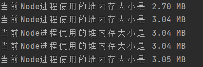
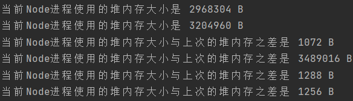
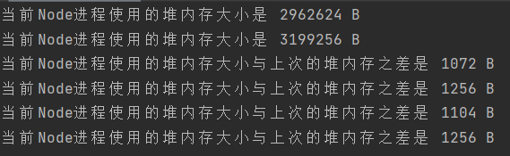
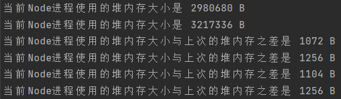
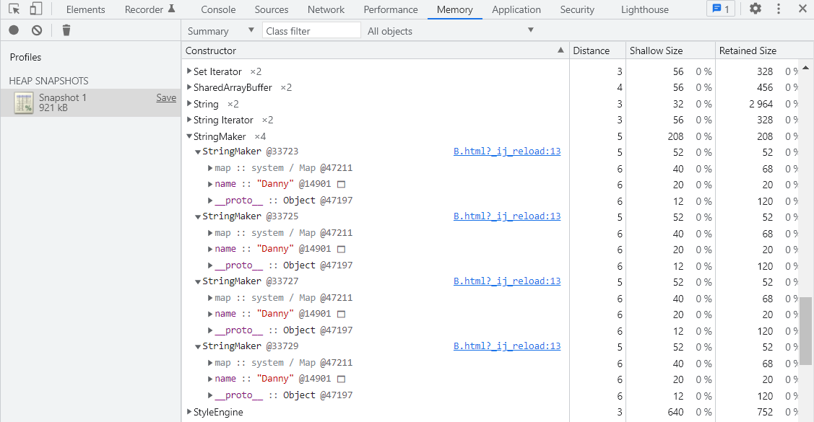
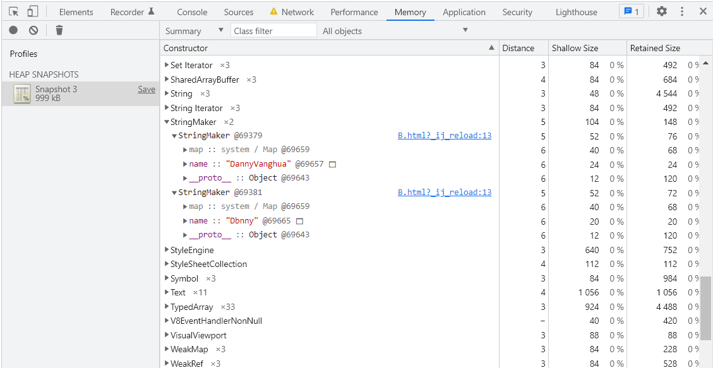
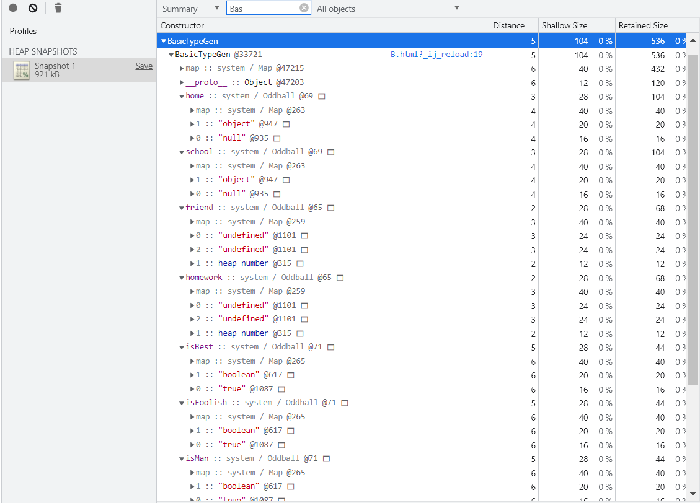

> 参考
>
> https://www.zhihu.com/question/482433315/answer/2083349992
>
> https://bbs.csdn.net/topics/390355334
>
> https://hashnode.com/post/does-javascript-use-stack-or-heap-for-memory-allocation-or-both-cj5jl90xl01nh1twuv8ug0bjk
>
> https://zhuanlan.zhihu.com/p/362219811
>
> https://v8.dev/blog/pointer-compression


# 1.JavaScript字符串的存储位置

### 1.0 前提条件

可以做到的能力：

1. 在服务端可以获取Node进程当前堆内存的使用情况
2. 在浏览器中可以获取JavaScript中变量的逻辑内存地址


### 1.1 准备工作：创建MB级别的大文件

使用Node写入一个大小在1MB以上的数据（大小超过Node栈内存限制900KB作用）

```javascript
let fs = require("fs")

// 写入限制为100MB，在本次测试执行时，实际写入3.5MB后就退出认为已经足够大
const size = 10 * 1024 * 1024
fs.writeFile("test.txt", "", "utf-8", function() {})
fs.open("test.txt", "w", async function(err, fd) {
    for(let i = 0; i < size;) {
        await new Promise((res, rej) => {
            fs.write(fd, "11111111111", i, function (err) {
                if (err) {
                    console.log(err)
                    rej()
                } else {
                    console.log(`已经写入了${i / 1024 / 1024}MB`)
                    res()
                }
            })
        })
        i += 10
    }
})
```


### 1.2 对照实验：测试调用```process.memoryUsage()```和```console.log```方法对堆内存的影响

重复调用获取堆内存的方法，该方法每次会新创建对象占用堆内存。查看该方法对堆内存有多大影响。

```javascript
let heapUse = (process.memoryUsage().heapUsed / 1024 / 1024).toFixed(2)
console.log("当前Node进程使用的堆内存大小是 " + heapUse + " MB")

heapUse = (process.memoryUsage().heapUsed / 1024 / 1024).toFixed(2)
console.log("当前Node进程使用的堆内存大小是 " + heapUse + " MB")

heapUse = (process.memoryUsage().heapUsed / 1024 / 1024).toFixed(2)
console.log("当前Node进程使用的堆内存大小是 " + heapUse + " MB")

heapUse = (process.memoryUsage().heapUsed / 1024 / 1024).toFixed(2)
console.log("当前Node进程使用的堆内存大小是 " + heapUse + " MB")

heapUse = (process.memoryUsage().heapUsed / 1024 / 1024).toFixed(2)
console.log("当前Node进程使用的堆内存大小是 " + heapUse + " MB")
```

从实验结果可知调用前两次获取堆内存方法后堆内存趋于稳定。




### 1.3 正式试验1：以字符串形式读入大文件查看堆内存变化

在Node中以字符串形式读入刚刚写好的文件，其余地方保持和对照实验基本保持相同

```javascript
let fs = require("fs")
let fss = fs.promises

;(async function() {
    let heapUse1, heapUse2, heapUse3, heapUse4, heapUse5
    let heapUse = process.memoryUsage().heapUsed
    console.log("当前Node进程使用的堆内存大小是 " + heapUse + " B")

    heapUse1 = process.memoryUsage().heapUsed
    console.log("当前Node进程使用的堆内存大小是 " + heapUse1 + " B")

    heapUse2 = process.memoryUsage().heapUsed
    console.log("当前Node进程使用的堆内存大小与上次的堆内存之差是 " + (heapUse2 - heapUse1).toString() + " B")

    // 在Node中读取一个大小为3617KB的数据，并以字符串保存在tmp中
    let data = await fss.readFile("test.txt")
    let tmp = data.toString()

    heapUse3 = process.memoryUsage().heapUsed
    console.log("当前Node进程使用的堆内存大小与上次的堆内存之差是 " + (heapUse3 - heapUse2).toString() + " B")

    heapUse4 = process.memoryUsage().heapUsed
    console.log("当前Node进程使用的堆内存大小与上次的堆内存之差是 " + (heapUse4 - heapUse3).toString() + " B")

    heapUse5 = process.memoryUsage().heapUsed
    console.log("当前Node进程使用的堆内存大小与上次的堆内存之差是 " + (heapUse5 - heapUse4).toString() + " B")
})();
```

读取的字符串大小为3617KB即3.5322MB。我们只需要关注下面输出的第四行，第四行与第三行之间进行了大字符串的读入。可以看到读入大字符串后堆内存发生了显著变化，因此推测字符串存储在堆内存中。




### 1.4 正式实验2：声明小字符串查看堆内存变化

将正式实验1中读取大字符串的操作修改为声明一个小字符串的操作，更改小字符串的大小，重复多次实验。

```javascript
let fs = require("fs")
let fss = fs.promises

;(async function() {
    let heapUse1, heapUse2, heapUse3, heapUse4, heapUse5
    let heapUse = process.memoryUsage().heapUsed
    console.log("当前Node进程使用的堆内存大小是 " + heapUse + " B")

    heapUse1 = process.memoryUsage().heapUsed
    console.log("当前Node进程使用的堆内存大小是 " + heapUse1 + " B")

    heapUse2 = process.memoryUsage().heapUsed
    console.log("当前Node进程使用的堆内存大小与上次的堆内存之差是 " + (heapUse2 - heapUse1).toString() + " B")

    let s = "123456789123456789" // 18B的字符串

    heapUse3 = process.memoryUsage().heapUsed
    console.log("当前Node进程使用的堆内存大小与上次的堆内存之差是 " + (heapUse3 - heapUse2).toString() + " B")

    heapUse4 = process.memoryUsage().heapUsed
    console.log("当前Node进程使用的堆内存大小与上次的堆内存之差是 " + (heapUse4 - heapUse3).toString() + " B")

    heapUse5 = process.memoryUsage().heapUsed
    console.log("当前Node进程使用的堆内存大小与上次的堆内存之差是 " + (heapUse5 - heapUse4).toString() + " B")
})();
```

从下述结果中可以看到小字符串对堆内存没有影响。因此推测小字符串存储在栈中，大字符串存储在堆中。

在读入小字符串时的输出结果



不读入任何内容时的输出结果




### 1.5 资料查阅：查阅V8源代码以及C++中字符串的存储规则

**V8源代码：**

* V8源代码参考滴滴工程师的解读：https://www.zhihu.com/question/482433315/answer/2083349992。JavaScript中的字符串时C++的字符串提供支持，作者根据源代码认为字符串都是创建在堆内存上。

**C++中字符串存储规则如下：**

* 参考：https://bbs.csdn.net/topics/390355334

* 如果在函数中使用非构造函数创建字符串，且字符串长度小于等于16B，那么字符串存储在栈内存中。超过16B存储在堆内存中。

* 使用new调用构造函数创建字符串或者在类中使用非构造函数创建字符串，那么字符串存储在堆内存中。


### 1.6 总结：

虽然网络上的结论是任务JavaScript字符串存储在堆上，与本人第二个正式实验结果有些差别。但是由于目前能力有限，暂无法进一步探究，就暂且认为JavaScript字符串都存储在堆内存上。


# 2.JavaScript字符串的存储逻辑

### 2.1 JavaScript字符串是只读的

在《JavaScript权威指南》和《JavaScript高级程序设计》中都提到了JavaScript中字符串是不可更改的问题。不论是字符串中某个字符的修改还是字符串的拼接，都会得到一个新字符串。


### 2.2 实验1：观察字符串的逻辑地址

在前三步的实验结果中已经做出了字符串存于堆内存的假设。由于栈内存无法查看，我们无法直接验证字符串是否存于栈中。但是可以通过查看逻辑地址进一步验证。

```html
<script>
    class StringMaker {
        name
        constructor() {
            this.name = "Danny"
        }
    }

    let sA = new StringMaker()
    let sB = new StringMaker()
    let sC = new StringMaker()
    let sD = new StringMaker()
</script>
```

在下面的实验结果中可以看到，StringMaker构造函数创建的4个对象sA，sB，sC，sD的逻辑地址分别为@33723，@33725，@33727，@33729。这四个对象中的成员name都是构造时创建的字符串“Danny”，但是它们的逻辑地址都是@14901。根据实验结果推测JavaScript中相同的字符串只会存储一次。




### 2.3 实验2：修改或拼接字符串并观察逻辑地址

```html
<script>
    class StringMaker {
        name
        constructor() {
            this.name = "Danny"
        }
    }

    let sA = new StringMaker()
    sA.name += "Vanghua"

    let sB = new StringMaker()
    // JavaScript字符串是只读的，不能直接修改
    sB.name = sB.name.replace("a", "b");
</script>
```

在下面的实验结果中发现name的逻辑地址发生了变化，按照实验1的结论来说```sA.name```和```sB.name```的逻辑地址应该是相同的。但是在修改或拼接后地址却发生了变化，这也验证了“JavaScript字符串是只读”的结论，每当修改字符串时都会创建一个新的字符串。




### 2.4 资料查阅：查看V8中实现字符串的相关代码

V8源代码参考滴滴工程师的解读：https://www.zhihu.com/question/482433315/answer/2083349992。

* 作者在源代码解读时提到了C++实现了散列映射机制，每次创建一个字符串时都会去哈希表中寻找该字符串是否被创建，如果被创建，那么就使用该字符串，不再重新创建新的字符串。
* 作者在源代码解读时提到，最初的哈希表创建是在JavaScript解释器工作的语法分析阶段（详情可参考另一篇博客“JavaScript解释器与编译器”）


### 2.5 总结：

JavaScript的字符串是只读的，任何改变原有字符串的操作都会创建一个新的字符串。

JavaScript的字符串的字符不能随意修改，需要调用replace函数。

JavaScript的字符串有唯一性，不会有两块相同的地址存储一样的字符串。


# 3.JavaScript数值的存储位置

### 3.1 小整数存储于栈内存，其它数存储于堆内存

在博客“JavaScript类型存储”中已经根据IEEE754 64位原文详细说明了JavaScript数值类型的存储方式。数值是使用IEEE744 64位标准存储，标准等同于C++中的double。但是这样存储会消耗空间，计算性能也会下降。如果是纯粹整数间的大量运算，使用双精度存储整数时每次计算都要进行两个64位数的计算，耗费性能。

实际上V8引擎中有特殊优化，对于小整数（小整数的范围等同于C++中int的范围，不是IEEE标准），JavaScript将其存储到栈中，其余数都存储到堆中。小整数存储时占用4字节，内存节省一半，被监测时进行64位对齐表现出IEEE754标准即可。详情可参考https://v8.dev/blog/pointer-compression

```javascript
const cycleLimit = 50000
console.time('heapNumber')
const foo = { x: 1.1 };
for (let i = 0; i < cycleLimit; ++i) {
// 创建了多出来的heapNumber实例
    foo.x += 1;
}
console.timeEnd('heapNumber') // slow   


console.time('smi')
const bar = { x: 1.0 };
for (let i = 0; i < cycleLimit; ++i) {
    bar.x += 1;
}
console.timeEnd('smi')  // fast

// 输出结果
// heapNumber: 12.561ms
// smi: 3.039ms


// 案例来源：https://www.zhihu.com/question/482433315/answer/2083349992
```


# 4.JavaScript其它基本类型存储位置

### 4.1 其它基本类型存储在栈上

JavaScript基本类型除了字符，数值，大整型（可包括到数值的讨论中）就剩下boolean，null，undefined，symbol。在这里先不考虑symbol。结论是boolean，null，undefined，symbol都存储在栈上。验证如下：

```html
<script>
    class BasicTypeGen {
        isMan
        isFoolish
        isBest
        isRussian
        home
        friend
        homework
        constructor() {
            this.isMan = true
            this.isFoolish = true
            this.isBest = true
            this.isRussian = true
            this.school = null
            this.home = null
            this.friend = undefined
            this.homework = undefined
        }
    }
    let someBody = new BasicTypeGen()
</script>
```

可以看到true的逻辑地址始终是@1087，null的逻辑地址始终是@935，undefined的逻辑地址始终是@1101。这些值在线程创建之前就创建在操作系统分配给该线程的执行栈中。（注：这里的“逻辑地址始终是”是说明在一个主线程中，基本类型的逻辑地址是固定的。每次主线程执行前，操作系统会分配不同的逻辑地址。所以当你再次进行此实验时得到的结果可能不同于下述结果，原因是操作系统对逻辑地址的分配每次不一定相同。）




# 5.总结

JavaScript的引用类型毋庸置疑存储在堆内存上，并且不会存在C++中部非基本类型可能存储在栈中的问题。

JavaScript的字符串存储在堆内存中，并且是只读的。

JavaScript的数值中小整数存储在栈内存中，其余存储在堆内存中。

JavaScript的其它基本类型存储在栈内存中。