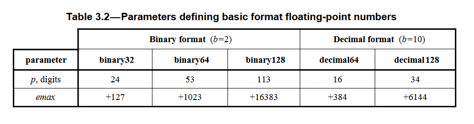

>参考：https://irem.univ-reunion.fr/IMG/pdf/ieee-754-2008.pdf (官方文档)   
>参考章节：3.3，3.4，3.5，4.3.1
### 1.1 IEEE754 存储标准


**1. IEEE 754 64位标准下的各部分取值情况**

|64位|S|E|M|
|---|---|---|---|
|+∞|0|2047|0|
|-∞|1|2047|0|
|NaN|1或0|2047|不全为0|
|+0|0|0|0|
|-0|1|0|0|
|非规格化数|1或0|0|不全为0|
|规格化数|1或0|1到2046|任意|

**2. IEEE 754 64位标准下的各部分范围**

|64位|S|E|M|
|---|---|---|---|
|二进制位范围|第63位|62到52位|51到0位|
|总计位数|1位|11位|52位|

**3. IEEE 754 64位标准下的各部分特殊值**

|64位|E的偏置|p|e|
|---|---|---|---|
|空|1023|53|E - 1023|

**4. IEEE 754 64位下规格化数的表示**

$$
S \times 1.M \times 2^{E - 1023}
$$
**5. IEEE 754 32位标准下的各部分取值情况**

|32位|S|E|M|
|---|---|---|---|
|+∞|0|255|0|
|-∞|1|255|0|
|NaN|1或0|255|不全为0|
|+0|0|0|0|
|-0|1|0|0|
|非规格化数|1或0|0|不全为0|
|规格化数|1或0|1到254|任意|

**6. IEEE 754 32位标准下的各部分范围**

|64位|S|E|M|
|---|---|---|---|
|二进制位范围|第31位|30到23位|22到0位|
|总计位数|1位|8位|23位|

**7. IEEE 754 32位标准下的各部分特殊值**

|32位|E的偏置|p|e|
|---|---|---|---|
|空|127|24|E - 127|

**8. IEEE 754 32位下规格化数的表示**   


### 1.2 存储最值

1. **P值介绍：**      
在1.1中的图中T部分提到了p变量，在下面的表格中也提到了p变量。p变量在计算机组成原理中并没有提到过。**p值表示T的位数+1，也就是表格中M的位数+1，表示还可以额外存储一位。也就是除了规格化数中的1.M，可以额外保存整数部分1以外，实际上还可以再额外保存一个二进制位。** 
    



2. **存储最值介绍：**   
在JavaScript下通过**Number.MAX_VALUE**和**Number.MIN_VALUE**可以获取可存储的最大值和最小值。与之对应在C或C++中可以使用**DBL_MAX**和**DBL_MIN**获取同样使用IEEE 754 64位标准的double的可存储最值。

   |最值类型|大小|位数|
   |---|---|---|
   |最大值(默认为正)|2^1024 - 2^971|308位|
   |最小值(默认为正)|2^(-1074)|324位|
   |+Infinity|2^1024 - 2^970|308位|
   |-Infinity|2^970 - 2^1024|308位|

3. **存储最值推导：**     

   * **最大值**：根据1中提到的规格化数格式来看，只要让S为1，M最大，E最大，即可取得最大值。可表示为如下形式，E在规格化条件下取2046，M的52位全为1。结果为1.7976931348623157e+308，和2^1024很像，只不过在这个有效数字范围内2^1024最后是158。
   }=1\\times{2^{1023}}\\times{(1+1-2^{-52})}=2^{1024}-2^{971})
   

   <br>    

   * **最小值**：JavaScript中Number的最小值和IEEE 754 64位规范下的最小值有所不同。按照最大值的思路理应为如下公式计算最小值，令E取规格化下的最小值1，令M的52位全为0。
   =1\\times{2^{-1022}}\\times(1+0)=2^{-1022})
   
   在C和C++下获取double类型的最小值，发现结果和2^ (-1022)一致，但是JavaScript下却不一样，为2^(-1074)。在外网上也没有找到这个最小值是如何得来的。
   

   <br>

   * **极限值**：极限值的定义不同于1中表格中的∞值，在IEEE 754 4.5.1章节中专门提到极限值的计算公式为如下形式：(b表示进制，只能取2或10，这里取2)		 	
           	
   =2^{1023}\\times(2-\\frac{2^{1-53}}{2})=2^{1024}-2^{970})
   

   <br>

   * **极限值存在问题**：在没有接触极限值推倒和数据安全范围(将会在下面3中提到)时，会误以为在获取最大值之后，即Number.MAX_VALUE后，将其+1，就会变成Infinity，这实际上是错误的。上面的极限推导后可知，+Infinity要比正最大值要大2^ 970，所以你只+1是没有用的。从数据安全范围来讲，IEEE754 64位标准下安全表示的数只有2^ 53，2^ 970远超这个范围，Number.MAX_VALUE也远超这个范围，在这个范围之外存储或者进行运算将会得到不准确的数据。最大值加上或者减去一个小一点的数据都会因为不安全性而被近似等于自己。
     
     ```javascript
      let a = Number.MAX_VALUE
      console.log(a === a + 1) // true
      console.log(a === a + (2 ** 969)) // true
      console.log(a === a - (2 ** 969)) // true
      console.log(a === a + (2 ** 969) + (2 ** 969) + (2 ** 969) + (2 ** 969)) // true
      // Infinity和最大值刚好相差2^970，加上之后就越界了
      console.log(a === a + (2 ** 970)) // false
     ```

### 1.3 存储安全范围
虽然在1.2中提到了p值和存储极限的概念，说明了在10进制下可以最小存储324位，无限趋近于0，最大可以存储308位，趋近于Infinity。但实际上这些数据不是安全的，用64个二进制位如何才能表示精确的300多位的10进制数据，这显然是不科学的。**精确表示的位数取决于M部分，即M全为1时表示精确存储的极限，由于规格化还有整数部分的1，所以总共可以用于存储的有53位**

**1. 安全整数推导**：(逆推)   
   * 直接取极限位数，假设有一个数2^ 53。使用规格化表示时就是M全为1，然后e = E - 1023 = 52。相当于让M部分左移52位，此时可以精确表示。
   * 取极限位数的下一位，假设有一个数2^ 53 + 1。使用规格化表示时就是M全为1，然后e = 52。相当于让M部分左移52位，发现无论如何也表示不了加的1，此时无法精确表示。


**2. 安全小数推导**：(逆推)   

   * 直接取极限位数，假设有一个小数1 - 2^ (-53)。使用规格化表示时就是M全为1，然后e = E - 1023 = -1。相当于让1.M的1右移一位，此时可以精确表示。
   * 取极限位数的下一位，假设有一个小数1 - 2^ (-54)。使用规格化表示时就是M全为1，然后e = -1。相当于让1右移一位，发现无论如何也表示不了2^ (-54)，只有53个二进制位可用，此时无法精确表示。


|数据类型|安全范围|位数|
|---|---|---|
|整数|[-2^ 53, 2^ 53]|16位整数|
|小数|[-1 + 2^ (-53), 1 - 2^ (-53)]|小数点后16位|

```javascript
// 超过16位时，运算变得不准确。不知道系统如何处理超出16位的部分，推测全0，但是运算时并不是这样
// 使用IEEE754 64位标准测试长度超过16位安全范围的整数。结果会出差错。
let a = 1111111111111111111111111111111123
let b = 11111111111111119
console.log(a % 10) // 2
console.log(b % 10) // 0

// 使用BigInt处理长度超过16位和32位的整数。结果正确。
let c = 1111111111111111111111111111111123n
let d = 11111111111111119n
console.log(c % 10n) // 3n
console.log(d % 10n) // 9n

// 超过了安全数据范围的数据变得不再精确
let e = 2 ** 53
console.log(e === e + 1) // true

// 考虑小数，小数点后的精确度也是16位
let f = 0.9999999999999999
console.log(f) // 0.9999999999999999
// 小数点后17位会不精确，直接进行四舍五入
let g = 0.99999999999999999
console.log(g) // 1
```

### 1.4 存储精确度
不论是在C/C++还是在java，double类型和float类型的运算总是存在不精确性，当然在同样采用IEEE 754标准的JavaScript中也是一样，比如0.1 + 0.2 == 0.3的结果就是false。这要从十进制与二进制的转化说起。
```javascript
// 十进制小数转化为二进制，”小数乘二判断法“
function decimalToBinary(num) {
    let ar = []
    // 最多循环53次，是安全数据范围
    for(let i = 0; i < 52; i ++) {
        num = num * 2
        // -0.5低效toFixed的四舍五入效果
        ar.push(parseInt((num - 0.5).toFixed(0)))
        if(num === 1)
            break
        if(num > 1)
            num -= 1
    }

    // 处理由于-0.5造成的-0的情况。返回一个数组，存储二进制数据
    return ar.map(el => el === 0 ? 0 : el)
}

// 二进制小数转为十进制
function binaryToDecimal(ar) {
    return ar.reduce((a, b, index) => a + b * (2 ** ((-1) * (index + 1))), 0)
}

console.log(binaryToDecimal(decimalToBinary(0.1))) // 0.09999999999999987
```
由上述例子可知，当0.1被存进内存时，需要由十进制转为二进制，但是转化成的二进制是无线不循环的，53位安全二进制位无法全部保存。所以再经过二进制转化为十进制后可以看出，出现了误差。也就是说实际上并不是0.1 + 0.2，实际是误差值相加再进行判断。
