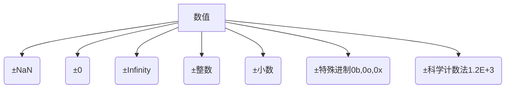
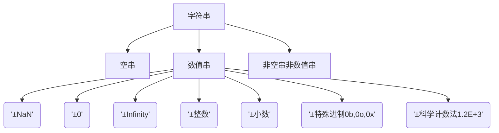

# 1.强制类型转换的规则
### 1.1 Number



|数值|转换为数值|转换为字符串|转换为布尔值|转换为大整型|转换为符号|
|---|---|---|---|---|---|
| **<font color=red>±0</font>**                | **<font color=red>无</font>** | **<font color=red>"0"</font>**          | **<font color=red>false</font>** | **<font color=red>0n</font>**          | **<font color=red>先转换为字符串再转换为符号</font>** |
| **<font color=red>±NaN</font>**              | **<font color=red>无</font>** | **<font color=red>"NaN"</font>**        | **<font color=red>false</font>** | **<font color=red>无法转换</font>**    | **<font color=red>先转换为字符串再转换为符号</font>** |
| **<font color=red>±1.2E+3（科学计数法）</font>** | **<font color=red>-6≤指数≤20时展示非科学计数法，此外展示科学计数法</font>** | **<font color=red>“-6≤指数≤20时展示非科学计数法，此外展示科学计数法”</font>** | **<font color=red>true</font>**  | **<font color=red>整数时：非科学计数法十进制n</font>** | **<font color=red>先转换为字符串再转换为符号</font>** |
| ±0b011（特殊进制）                               | 无                                                           | "±对应十进制"                                                | true                             | 对应十进制n                                            | 先转换为字符串再转换为符号                            |
| ±Infinity                                        | 无                                                           | "±Infinity"                                                  | true                             | 无法转换                                               | 先转换为字符串再转换为符号                            |
| ±1.3（小数）                                     | 无                                                           | "±1.3"                                                       | true                             | 无法转换                                               | 先转换为字符串再转换为符号                            |
| ±1（整型）                                       | 无                                                           | "±1"                                                         | true                             | ±1n                                                    | 先转换为字符串再转换为符号 |
### 1.2 String



|字符串|转换为数值|转换为字符串|转换为布尔值|转换为大整型|转换为符号|
|---|---|---|---|---|---|
|"" (空字符串)|0|无|false|先转换为数值再转换为大整型|Symbol("")|
|" 1.2  " (非空，前后可以有若干空格，中间是数值字符串)|1.2|无|true|忽略空格，先转换为数值再转换为大整型|Symbol("1.2")|
|W"one" (非空，非数值字符串)|NaN|无|true|无法转换|Symbol("2")|

**字符串到数值的转换详细列举**

| 字符串                                       | 数值                                                         |
| -------------------------------------------- | ------------------------------------------------------------ |
| **<font color=red>'±科学计数法1.2E'</font>** | **<font color=red>±-6≤指数≤20时直接展开，其它情况转换成科学计数法</font>** |
| **<font color=red>'±NaN'</font>**            | **<font color=red>NaN</font>**                               |
| '±0'                                         | ±0                                                           |
| '±Infinity'                                  | ±Infinity                                                    |
| '±整数'                                      | ±整数                                                        |
| '±小数'                                      | ±小数                                                        |
| '±特殊进制0b,0o,0x'                          | ±对应十进制                                                  |

### 1.3 Boolean

|布尔值|转换为数值|转换为字符串|转换为布尔值|转换为大整型|转换为符号|
|---|---|---|---|---|---|
|true|1|"true"|无|先转换为数值再转换为大整型|先转换为字符串再转换为符号|
|false|0|"false"|无|先转换为数值再转换为大整型|先转换为字符串再转换为符号|
### 1.4 Null和Undefined
|null和undefined|转换为数值|转换为字符串|转换为布尔值|转换为大整型|转换为符号|
|---|---|---|---|---|---|
|**<font color=red>undefined</font>**|<font color=red>**NaN**</font>|**<font color=red>"undefined"</font>**|**<font color=red>false</font>**|**<font color=red>无法转换</font>**|**<font color=red>Symbol() 转换成空Symbol。但是Symbol.for是正常的，先转成字符串再转符号</font>**|
|null|0|"null"|false|先转换为数值再转换为大整型|先转换为字符串再转换为符号|
### 1.5 Symbol
|符号|转换为数值|转换为字符串|转换为布尔值|转换为大整型|转换为符号|
|---|---|---|---|---|---|
|**<font color=red>Symbol("Danny") (任意符号)</font>**|**<font color=red>不能转换</font>**|<font color=red>**'Symbol("Danny")'**</font>|**<font color=red>true</font>**|**<font color=red>无法转换</font>**|**<font color=red>无</font>**|
### 1.6 BigInt
|大整型|转换为数值|转换为字符串|转换为布尔值|转换为大整型|转换为符号|
|---|---|---|---|---|---|
|123n (任意大整型)|123|"123"|true|先转换为数值再转换为大整型|先转换为字符串再转换为符号|
### 1.7 Object
|对象|转换为数值|转换为字符串|转换为布尔值|转换为大整型|转换为符号|
|---|---|---|---|---|---|
|{} (任意对象)|NaN 或 依据对象的valueOf()方法|"[object Object]" 或依据对象的toString()方法|true|先转换为数值再转换为大整型|先转换为字符串再转换为符号|
### 1.8 Array
|数组|转换为数值|转换为字符串|转换为布尔值|转换为大整型|转换为符号|
|---|---|---|---|---|---|
|[] (空数组)|0|“” (空字符串)|true|先转换为数值再转换为大整型|先转换为字符串再转换为符号|
|**<font color=red>[9] (仅含1个元素的数组转向基本类型，由该元素转向基本类型的结果决定数组最终转换结果)</font>**|9|"9"|true|先转换为数值再转换为大整型|先转换为字符串再转换为符号|
|[xxx, xxx] (其它任何数组)|NaN|join(",")方法转换|true|无法转换|先转换为字符串再转换为符号|
### 1.9 Function
|函数|转换为数值|转换为字符串|转换为布尔值|转换为大整型|转换为符号|
|---|---|---|---|---|---|
|任何函数|NaN|返回函数代码的字符串形式，原生方法会显示Native Code|true|先转换为数值再转换为大整型|先转换为字符串再转换为符号|


# 2.显示转换与隐式转换

### 2.1 隐式转换

#### 2.1.1 一元运算符

> <font color=green>**A+B或A-B：**</font>
>
> * **所有类型：** 转换为数值
>
> <font color=green>**!!A：**</font>
>
> * **所有类型：**转换为布尔值
>
> <font color=green>**~~A：转换后按32为有符号整数截取（精度：9位数和10位数的一部分）**</font>
>
> * **数值：** 
>  * **±NaN：** 转换为0
>   * **±Infinity：** 转换为0
>  * **±0：** 转换为0
>   * **±整数：** 转换为自己
>  * **±小数：** 直接舍弃小数部分
>   * **±特殊进制0b,0o,0x：** 转换为自己
>   * **±科学计数法1.2E+3：** 转换为自己，-6≤指数≤20时展开，其余转换成科学计数法
>   
> * **其它类型：** 转换为数值

#### 2.1.2 二元运算符

> <font color=green>**A-B或A/B或A*B或A%B：**</font> 
>
> * **所有类型：** 都转换为数值
>
> <font color=green>**A&B或A|B或A^B：转换后按32为有符号整数截取（精度：9位数和10位数的一部分）**</font>
>
> * **数值：**
>  * **±NaN：** 转换为0
>   * **±Infinity：** 转换为0
>  * **±0：** 转换为0
>   * **±整数：** 转换为自己
>  * **±小数：** 直接舍弃小数部分
>   * **±特殊进制0b,0o,0x：** 转换为自己
>   * **±科学计数法1.2E+3：** 转换为自己，-6≤指数≤20时展开，其余转换成科学计数法
>   
> * **其它类型：** 转换为数值
>
> <font color=green>**A+B：**</font>
>
> * **字符串或对象：** 存在字符串或对象，都转换为字符串
>* **其它类型：** 其它都转换为数值
> 
> <font color=green>**A==B或A!=B：**</font>
>
> * **null和undefined：** null和undefined相等，并且不会因为另一个值做类型转换
>* **NaN：** NaN和任何值都不相等
> * **对象：** 对象按偏好算法转为基本类型后再重复该规则
> * **其它类型：** 其它转换为数值
> 
> <font color=green>**A>B或A<B或A>=B或A<=B：**</font>
>
> * **字符串：** 字符串按字典序比较
>
> * **NaN：** NaN和任何值都不相等
>* **对象：** 对象按偏好算法转为基本类型后再重复该规则
> * **其他类型：** 其它转换为数值

#### 2.1.3 对象键值

> <font color=green>**对象键值：**</font>
>
> * **所有类型：** 转换为字符串


### 2.2 显式转换
**显示转换可以理解为调用类型转换函数的转换方法。**

#### 2.2.1 工厂函数

> 工厂函数转化方法：调用Number(x)，String(x)，Boolean(x)，BigInt(x)，Symbol(x)，Object(x)等工厂函数对x进行类型转换。
>
> * <font color=red>**注意：原始类型的工厂函数返回原始类型。**</font>

#### 2.2.2 构造函数

> 构造函数转化方法：调用new Number(x)，new String(x)，new Boolean(x)，new Object(x)等构造函数对x进行类型转换。
>
> * <font color=red>**注意：原始类型的构造函数返回一个对象。**</font>
> * **<font color=red>注意：BigInt和Symbol没有构造函数。</font>**

#### 2.2.3 数值和字符串转换

> 数值和字符串的转化：(最常用的4个API)
>
> * 数值到字符串toString(num)：在这种情况下toString()接收一个可选参数，表示转化后的进制
>
> * 数值到字符串toFixed(num)：在这种情况下toFixed()接收一个可选参数，表示转化后保留几位小数
>
> * 字符串到数值parseInt(string, num)：
>
>   > **含义：**
>   >
>   > 把一个num进制的字符串转换成10进制的数值
>   >
>   > **<font color=red>注意：数值和字符串相互转换时涉及到进制的参数，都是指明字符串的进制。toString表示转换成num进制字符串，parseInt表示把num进制字符串转换成10进制</font>**
>   >
>   > **第一个参数：**
>   >
>   > * **转换：** 第一个参数接收字符串，会默认隐式类型转换。
>   >
>   > **第二个参数：**
>   >
>   > * **进制范围：** 范围是2~36，默认是10。
>   > * **特殊进制：** 0进制按10进制处理，其余不合法按NaN结果处理。
>   >
>   > **与标准StringToNumber不同：**
>   >
>   > * **类型转换：** 传入parseInt的不是String时，必须多一步隐式类型转换。
>   >
>   > * **空串处理：** 处理空格的逻辑和标准Number工厂函数处理相同，但是空串会返回NaN。
>   >
>   > * **非数值串保护：** 如果不是数值字符串，那么会仅从首字符开始找最长的数值子串进行处理。
>
> * 字符串到数值parseFloat(string)：parseFloat接收一个参数，为字符串


# 3.对象到原始值的转换

<font color=red>**注： Object基类有toString和valueOf方法，分别返回“[object Object]”和{}**</font>

### 3.1 对象到原始值的显示转换
对象的显式转换应用在调用显示转换函数之中，例如原始类型的工厂函数。
1. **数值转化：(同偏数值算法)** 
   * 调用valueOf()，如果返回值不是引用类型，那么直接返回，否则下一步
   * 调用toString()，如果返回值不是引用类型，那么直接返回，否则下一步
   * 抛出TypeError错误，不可转化


2. **字符串转化：(同偏字符串算法)** 
   * 调用toString()，如果返回值不是引用类型，那么直接返回，否则下一步
   * 调用valueOf()，如果返回值不是引用类型，那么直接返回，否则下一步
   * 抛出TypeError错误，不可转化
```javascript
// 对象的显示类型转化的测试，符合上述算法
class Test {
    toString() {
        console.log("调用了toString")
        return "123"
    }
    valueOf() {
        console.log("调用了valueOf")
        return {
            name: "Danny"
        }
    }
}
let test = new Test
console.log(Number(test))
// 调用了valueOf
// 调用了toString
// 123
console.log(String(test))
// 调用了toString
// 123
```
### 3.2 对象到原始值的隐式转换与偏好算法 
<font color=red>**注：Date类的实例转换到原始值时优先转换成字符串，转换失败再尝试转换为数值。Date类中声明了Symbol.toPrimitive规定偏好算法，其它类没有声明该函数。**</font>

1. **偏数值算法：** 
   * 调用valueOf()，如果返回值不是引用类型，那么直接返回，否则下一步
   * 调用toString()，如果返回值不是引用类型，那么直接返回，否则下一步
   * 抛出TypeError错误，不可转化
```javascript
// JavaScript除了Date对象，默认都是偏数值算法，会先调用valueOf。
class Test {
    toString() {
        console.log("调用了toString")
        return "123"
    }
    valueOf() {
        console.log("调用了valueOf")
        return {
            name: "Danny"
        }
    }
}
let test = new Test
console.log(test == "Danny")
// 调用了valueOf
// 调用了toString
// false
```

2. **偏字符串算法：** 
   * 调用toString()，如果返回值不是引用类型，那么直接返回，否则下一步
   * 调用valueOf()，如果返回值不是引用类型，那么直接返回，否则下一步
   * 抛出TypeError错误，不可转化
```javascript
// JavaScript的Date对象是偏字符串算法，会优先调用toString。
Date.prototype.toString = function() {
    console.log("调用了toString")
    return {
        name: "Danny"
    }
}

Date.prototype.valueOf = function() {
    console.log("调用了valueOf")
    return 123
}

let date = new Date

console.log(date == 123)
// 调用了toString
// 调用了valueOf
// true
```

3. **无偏好算法：** 在对象的隐式类型转化中，不偏向任何一方，由自己定义偏好，可以通过[Symbol.toPrimitive] (hint)来定义偏好。
```javascript
// 自定义一个偏字符串算法的类，由输出结果可知，并没有调用传统的toString和valueOf方法
class Test {
    [Symbol.toPrimitive](hint) {
        if(hint === "number") {
            console.log("Symbol.toPrimitive的number")
            return 10
        }
        if(hint === "string") {
            console.log("Symbol.toPrimitive的string")
            return "Danny"
        }
        else if(hint === "default") {
            // 设置成偏字符算法
            console.log("Symbol.toPrimitive的default")
            return "Danny"
        }
    }
}
let test = new Test
console.log(test == "Danny")
// Symbol.toPrimitive的default
// true

console.log(test + 1)
// Symbol.toPrimitive的default
// Danny1
```


# 4.真值和假值

### 4.1 真值和假值的理解
在JavaScript中真值，假值与布尔值并不是一回事，布尔值是真值和假值的子集。真值和假值主要应用于逻辑运算符，逻辑运算符&&和||的两侧的结果就是真值和假值。

### 4.2 真值和假值的类型
> **假值：**
>
> * 0
> * -0
> * NaN
> * undefined
> * null
> * "" 
>
> **真值：**
>
> * 除了上述6个假值，其余都是真值

# 5.宽松相等与严格相等

### 5.1判断相等的区别
宽松相等==：
1. **原始类型之间判断：** 做隐式类型转换，尽可能转换成数值。    
   **注：null在和非0的原始类型比较时，null不会隐式转换为数值**


2. **原始类型与对象之间判断：** 按照对象的偏好算法做隐式类型转换，之后两者再尽可能转换成数值做比较


3. **对象之间判断：** 对象如果是同一个堆内存则返回true，否则返回false

严格相等===：
1. **原始类型之间判断：** 不做类型转换，如果类型不同返回false，如果相同类型下相同才返回true


2. **原始类型与对象之间判断：** 直接返回false


3. **对象之间判断：** 对象如果是同一个堆内存则返回true，否则返回false

# 6.null和undefined的理解
1. **(数据类型)** null和undefined都是原始数据类型，这两个原始类型下各自只有一个值是null和undefined 


2. **(保留字)** null是JavaScript保留字，undefined不是保留字，是一个全局常量，类似的还有Infinity，NaN等，因此undefined可以用作变量名。可以通过void 0来获取安全的undefined值。


2. **(含义)** null表示一个空对象，只有栈内存(栈内二进制位存全0)没有堆内存。undefined表示已经声明但是没有赋值，只有栈内存(栈内存二进制位表示-2^30，见“数据类型检测”)。


3. **(存储方式)** 第一版JavaScript规定了存储数据的低三位用于类型判断，对象低三位是000，null是所有二进制位都是0，因此在typeof判断时会被误判为对象。undefined是表示-2^30，typeof时会返回”undefined”。


4. **(相等性)** 使用==判断null和undefined时返回true，使用严格相等===判断null和undefined时返回false。