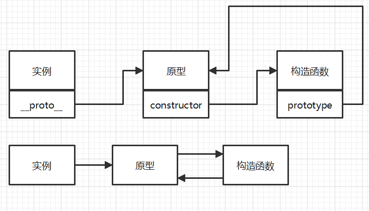
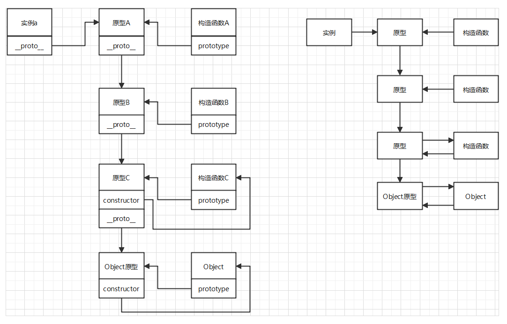

# 1.对象创建
### 1.1 工厂模式
简述：创建一个工厂函数，在其中创建一个新对象(一般通过Object构造函数创建)，然后再扩展这个对象的属性。
```javascript
// 工厂模式
function Student(name, gender, age) {
    let object = new Object()
    object.name = name
    object.gender = gender
    object.age = age
    object.show = function() {
        console.log(`${this.name} ${this.gender} ${this.age}`)
    }
    return object
}
let student = Student("Danny", "man", 20)
student.show()
```
缺点：**(1)** 没有建立对象和类之间的联系。只是简单对代码复用，无法使用instanceof来确定对象所属的类，不过可以使用[Symbol.toStringTag]，这属于是ES6新增的内容。**(2)** 没有实现对象方法的复用。和构造函数模式一样，如果对象中含有方法，那么这个方法每创建一个对象就会被重新创建一次

### 1.2 构造函数模式
简述：创建一个构造函数，使用new调用该构造函数，**(1)** 构造函数会创建一个对象。**(2)** 构造函数中的this被绑定到这个对象上。**(3)** 这个对象的prototype为构造函数的prototype。**(4)** 如果构造函数使用return返回一个非空对象，那么最后返回此对象，其它情况不论是否使用return都会返回这个构造函数自己创建的对象。
```javascript
// 构造函数模式
function Student(name, gender, age) {
    this.name = name
    this.gender = gender
    this.age = age
    this.show = function() {
        console.log(`${this.name} ${this.gender} ${this.age}`)
    }
}
Student.prototype = {
    school: "SDU"
}
let student = new Student("Danny", "man", 20)
student.show()
console.log(student.__proto__)
```
缺点：没有实现对象方法的复用。和C++严格的面向对象编程不同，如果创建的对象中有方法，那么每次使用new调用构造函数创建一个新对象时都会重新创建该方法。这浪费了空间。

### 1.3 原型模式
简述：利用了构造函数模式的思路，仍然是通过new操作符来调用原型函数。由于new的使用会导致对象的prototype为原型函数的prototype，那么原型模式直接在函数的prototype中进行创建属性，这样避免了构造函数模式中对象方法浪费空间的问题，不再在函数体中写其它代码。
```javascript
// 原型模式
function Student(name, gender, age) {}
Student.prototype = {
    constructor: Student,
    name: "Danny",
    gender: "man",
    age: 20,
    show: function() {
        console.log(`${this.name} ${this.gender} ${this.age}`)
    }
}
let student = new Student("Danny", "man", 20)
student.show()
console.log(student.__proto__) // 输出自己
```
缺点：(1)共享引用类型。所有实例都会共用一个原型对象，如果prototype中存在引用类型会非常危险。(2)无法使用带参构造函数。使用new调用原型函数时传入参数不起作用。   

> ### 注意1：原型具有动态性，意思是要注意重写原型和修改原型   
> 一个失败操作：重写原型
> ```javascript
> function Student(name, gender, age) {}
> // 创建完对象后对象的prototype和Student的prototype在栈内存中存储的内容都是空值，因为还没有创建prototype所指向的对象。
> let student = new Student()
> // 修改Student的prototype的效果是Student的prototype在栈内存中存储的内容由原来的空值，变成一个新的堆内存地址。
> Student.prototype = {
>     constructor: Student,
>     name: "Danny",
>     gender: "man",
>     age: 20,
>     show: function() {
>         console.log(`${this.name} ${this.gender} ${this.age}`)
>     }
> }
> // 此时调用student的show方法，student会首先在实例属性中寻找是否有show，发现没有，然后去prototype中寻找，由于student的prototype是空值所以查找失败。
> student.show()
> ```
> 由于JavaScript的赋值操作都是“传值”不是“传引用”，所以在原型模式简介中提到的实例的prototype和函数的prototype相等，实际意味着实例的prototype是在构造函数执行时，在栈内存中重新开辟空间，存储函数prototype在栈内存中存储的指向堆内存的地址。   
> 
> 一个成功的操作：修改原型
> ```javascript
> function Student(name, gender, age) {}
> Student.prototype = {
>     name: "Danny",
>     gender: "man",
>     age: 20
> }
> // 创建完对象后对象的prototype和Student的prototype在栈内存中存储的内容都是prototype对象的堆内存地址。
> let student = new Student()
> // 修改Student函数的prototype，实际是对堆内存内部存储内容进行修改，student实例仍然可以通过栈内存中存储的地址找到Student函数的prototype的堆内存地址。
> Student.prototype.show = function() {
>     console.log(`${this.name} ${this.gender} ${this.age}`)
> }
> student.show()
> ```
> ### 注意2：原型模式中存在引用类型的风险，意思是修改栈内存是安全的，修改堆内存会影响所有实例
> ```javascript
> function Student(name, gender, age) {}
> Student.prototype = {
>     name: "Danny",
>     gender: "man",
>     age: 20,
>     info: {
>         grade: 3
>     }
> }
> Student.prototype.show = function() {
>     console.log(`${this.name} ${this.gender} ${this.age}`, this.info)
> }
> let student = new Student()
> let student2 = new Student()
> // 修改栈内存，实际上是覆盖操作，在当前实例上创建该属性，覆盖了原型中的该属性在该实例中的表现
> student2.age = 21
> // 修改堆内存，相当于直接修改该实例的原型
> student2.info.grade = 1
> // 发现student2的修改堆内存操作影响到了其它实例
> student.show()
> // 修改栈内存，实际上是覆盖操作，在当前实例上创建该属性，覆盖了原型中的该属性在该实例中的表现
> student2.info = { name: "xxx" }
> // 发现student2的修改栈内存操作没有影响到其它实例
> student.show()
> ```

### 1.4 构造函数和原型组合模式
简述：由于原型模式和构造函数模式使用相同的思想，所以可以组合使用。在用new调用组合函数时，函数体中使用this来解决参数赋值问题，使用函数的prototype来解决。如果不使用class，使用此模式的频率会多一些。
```javascript
// 构造函数和原型组合模式
function Student(name, gender, age) {
    this.name = name
    this.gender = gender
    this.age = age
}
Student.prototype = {
    show: function() {
        console.log(`${this.name} ${this.gender} ${this.age}`)
    }
}
let student = new Student("Danny", "man", 20)
student.show()
console.log(student.__proto__)
```
缺点：代码封装程度不高。需要在构造函数外继续进行构造初始化，把方法绑定到原型对象上。

### 1.5 寄生构造函数模式
简述：寄生构造函数模式和上面的组合模式类似，都是组合了上述的模式。寄生构造函数模式是根据构造函数return的特点结合工厂模式来创建对象，在构造函数中不使用new默认创建的对象，而是自己创建对象进行扩展，最后返回这个对象。
```javascript
// 寄生构造函数模式
function Student(name, gender, age) {
    let object = new Object
    object.name = name
    object.gender = gender
    object.age = age
    object.show = function() {
        console.log(`${this.name} ${this.gender} ${this.age}`)
    }
    return object
}
let student = new Student("Danny", "man", 20)
student.show()
console.log(student.__proto__)
```
缺点：**(1)** 没有建立对象和类的联系。由于使用了工厂模式寄生在构造函数模式之上，所以还是没有建立起对象与类的联系。无法通过instanceof来确定对象所属的类，不过可以使用ES6新增的[Symbol.toStringTag]。**(2)** 对象方法也无法复用

### 1.6 动态原型模式
简介：动态原型模式解决了原型模式无法利用参数进行初始化和所有实例共享一个对象的问题。动态原型模式在函数中进行参数赋值，在函数中把方法挂载到函数的prototype上，看起来像是对构造函数和原型组合模式的改进，提高了封装程度，不需要再在函数外给prototype赋值。
```javascript
// 动态原型模式
function Student(name, gender, age) {
    this.name = name
    this.gender = gender
    this.age = age
    if(typeof this.show !== "function")
        Student.prototype.show = function() {
            console.log(`${this.name} ${this.gender} ${this.age}`)
        }
}
let student = new Student("Danny", "man", 20)
student.show()
console.log(student.__proto__)
```

### 1.7 类
```javascript
class Student {
    name
    gender
    age
    constructor(name, gender, age) {
        this.name = name
        this.gender = gender
        this.age = age
    }

    show() {
        console.log(`${this.name} ${this.gender} ${this.age}`)
    }
}
let student = new Student("Danny", "man", 20)
student.show()
console.log(student.__proto__)
```

### 1.8 不考虑代码复用---对象字面量构造
使用{}来创建对象，只不过这种方法并不能提供复用机制

### 1.9 不考虑代码复用---Object.create()方法构造
使用Object.create(obj)来创建对象，并指定对象的原型，这不是标准的代码复用思路。

### 特点总结：
|创建模式|特点|缺点|
|---|---|---|
|工厂模式|工厂函数中新建Object对象，以此对象进行扩展|1.未建立对象和类的联系 2.对象方法无法复用|
|构造函数模式|构造函数中使用this给对象属性赋值，用new调用构造函数|对象方法无法复用|
|原型模式|构造函数中不写操作，对象属性赋值全部在原型中完成|1.共享引用类型 2.带参构造函数无法使用|
|组合模式|构造函数中处理参数，原型中处理方法|代码封装程度不高|
|寄生模式|构造函数中新建Object对象，以此对象进行扩展，构造函数返回此对象|1.未建立对象和类的联系 2.对象方法无法复用|
|动态原型模式|构造函数中使用this给对象属性赋值，第一次调用构造函数时把对象方法绑定到原型上||

# 2.对象继承
**注：下述考虑继承时默认创建对象都是使用“原型+构造函数组合模式”(假设还没出现ES6中的class，这个可以算是瘸子里面挑将军，最优的创建方法了)**
### 2.1 原型链继承
回顾原型链单个节点情况，即构造函数和实例和原型之间的关系



简介：原型链继承的思路是把原型更改成要继承的构造函数的实例。图中原型A是通过new调用构造函数B得到的构造函数B的实例，没有constructor指针。同理原型B是构造函数C的实例。而最终原型C是一个正常的原型。


```javascript
// 实现上图的原型链
// 我们想在prototype中再添加get方法，并使之能被继承，所以应该先初始化父原型
function C(schoolName, schoolInfo) {
    this.schoolName = schoolName
    this.schoolInfo = schoolInfo
}

C.prototype = {
    getSchoolName: function() {
        return this.schoolName
    },
    getSchoolInfo: function() {
        return this.schoolInfo
    },
    testProperty: "test"
}

function B(className, classInfo) {
    this.className = className
    this.classInfo = classInfo
}

// 原型链继承设计思路，将原型赋值为父构造函数的一个实例
B.prototype = new C()
// 添加获取方法
B.prototype.getClassName = function() {
    return this.className
}
B.prototype.getClassInfo = function() {
    return this.classInfo
}

function A(stuName, stuInfo) {
    this.stuName = stuName
    this.stuInfo = stuInfo
}

// 原型链继承设计思路，将原型赋值为父构造函数的一个实例
A.prototype = new B()
// 添加获取方法
A.prototype.getStuName = function() {
    return this.stuName
}
A.prototype.getStuInfo = function() {
    return this.stuInfo
}

let stu = new A("Danny", {
    id: "001",
    grade: 3
})

console.log(stu.testProperty)
```
缺点(和原型模式对应)：**(1)** 共享引用类型。如果原型链中的某一个原型中存在引用类型，那么会很危险，它会被原型链起点的构造函数实例化的所有对象共享，如果重写这个属性还好只是添加了自有属性进行覆盖，如果修改堆内存，那么修改结果将会作用于所有实例 **(原因是原型中不仅有方法，还有普通的属性，普通的属性不应该出现在原型里)** 。**(2)** 调用父构造函数无法传参。在给原型赋值为父构造函数的实例时无法控制参数 **(原因是在确定原型为父构造函数的实例时，这个是需要提前写死的，不能够复用)** 。

### 2.2 盗用构造函数继承
介绍：在构造函数中调用父类型的构造函数，并把当前构造函数创建的对象绑定为父类型构造函数执行时的this。
```javascript
// 班级构造函数作为父类型
function Class(className, classInfo) {
    this.className = className
    this.classInfo = classInfo
}
Class.prototype = {
    getClassName: function() {
        return this.className
    },
    getClassInfo: function() {
        return this.classInfo
    },
    show: () => {
        console.log(`${this.className} ${this.classInfo}`)
    }
}

// 学生构造函数作为子类型
function Student(stuName, stuInfo) {
    // 调用父类构造函数，并把本构造函数创建的对象作为父构造函数执行时this的绑定，以此来给本构造函数创建的对象赋值
    Class.call(this, "ECE_Class3", {
        stuNumber: 42
    })
    this.stuName = stuName
    this.stuInfo = stuInfo
}
Student.prototype = {
    getStuName: function() {
        return this.stuName
    },
    getStuInfo: function() {
        return this.stuInfo
    }
}

let stu = new Student("Danny", {
    id: "001",
    grade: 3
})

// 可以看见stu的自有属性中同时含有本身构造函数中的属性，也含有父构造函数初始的属性 
console.log(stu)
// 实际上这个方法不能获取父类型所有属性，这些属于父构造函数的原型的属性都无法通过此方法赋给子类型实例
console.log("getClassInfo" in stu, "getClassName" in stu, "show" in stu, "getStuName" in stu, "getStuInfo" in stu) // false false false true true
```
缺点：**(1)** 对象的方法无法复用。 **(2)** 父类型的方法无法继承

### 2.3 原型链和盗用构造函数组合继承
介绍：原型链继承的核心思路是子类型的原型赋值为父类型的构造函数，盗用构造函数继承的核心思路是子类型的构造函数中调用父类型的构造函数。组合模式只需要将两者结合。
```javascript
// 本示例是把上述代码从Student的原型赋值往下进行了修改，Student的原型赋值往上部分保持一致。
// 在此使用原型链的思路
Student.prototype = new Class()
Student.prototype.getStuName = function() {
    return this.stuName
}
Student.prototype.getStuInfo = function() {
    return this.stuInfo
}

let stu = new Student("Danny", {
    id: "001",
    grade: 3
})
console.log(stu)
console.log("getClassInfo" in stu, "getClassName" in stu, "show" in stu, "getStuName" in stu, "getStuInfo" in stu) // 全是true
```
缺点：**(1)** 两次调用父类型的构造函数。其中子类型原型赋值为父类型构造函数的实例，这里面的属性实际上是不会被用到的，调用两侧有些浪费了。

### 2.4 原型继承
介绍：这种继承策略比较轻量化，适合不使用构造函数的情况。直接调用let x = Object.create(obj)来进行继承，指定x的原型就是obj，x会得到obj的浅复制副本，两者共用引用类型的堆内存。
```javascript
let person = {
    name: "Danny",
    allFriends: ["Jack", "Lucy", "Sam", "Mike"]
}

let monitorPerson = Object.create(person, {
    name: {
        value: "Cathy"
    }
})
monitorPerson.allFriends.push("Lily")
// 输出多了一个Lily，说明此继承方式是共享引用类型的
console.log(person) // Jack, Lucy, Sam, Mike, Lily
```
缺点：共享引用类型。缺点和原型链类似，都是受到了共享引用类型的困扰，引用类型的修改会作用于所有继承者。

### 2.5 寄生继承
介绍：这种策略也是比较轻量化，适合不使用构造函数的情况，是原型继承策略的增强。类似于工厂函数，得到原型继承后的对象后，以它为基础进行扩展。
```javascript
let person = {
    name: "Danny",
    allFriends: ["Jack", "Lucy", "Sam", "Mike"]
}

// 使用寄生继承
function createPerson(person) {
    let object = Object.create(person)
    object.sayFriends = function() {
        console.log(object.allFriends)
    }
    return object
}

let otherPerson = createPerson(person)
otherPerson.name = "Cathy"
otherPerson.allFriends.push("Lily")
console.log(person.allFriends)
otherPerson.sayFriends()
```
缺点：**(1)** 共享引用类型。和原型继承一样，共享引用类型会造成危险。 **(2)** 对象方法无法复用。和工厂函数缺点一样，每次扩展对象的方法都会重新新创建一个对象方法。

### 2.6 寄生组合继承
介绍：寄生组合继承主要解决组合继承中调用两次父类型构造函数的问题，利用工厂函数和寄生继承的思路对子类型原型赋值过程进行寄生优化。当不使用class进行继承时，通常使用寄生组合继承。
```javascript
// 还是像组合继承一样，针对“盗用构造函数继承”里面的代码示例进行改进，将Student.prototype的赋值以下部分更改为此
// 在此使用寄生继承/工厂函数的思想
function inheritPrototype(son, father) {
    // 原型继承的思路，这样最后只会调用一次父类型的构造函数
    let prototype = Object.create(father.prototype)
    // 寄生继承的思路，对对象进行扩展，或者也可以说是工厂函数的思路
    prototype.constructor = son
    return prototype
}
Student.prototype = inheritPrototype(Student, Class)
Student.prototype.getStuName = function() {
    return this.stuName
}
Student.prototype.getStuInfo = function() {
    return this.stuInfo
}

let stu = new Student("Danny", {
    id: "001",
    grade: 3
})
console.log(stu)
console.log("getClassInfo" in stu, "getClassName" in stu, "show" in stu, "getStuName" in stu, "getStuInfo" in stu) // 全是true
```
缺点：缺点只剩下共享引用类型。

### 2.7 类继承
介绍：类继承直接使用extends关键字

### 特点总结：
|继承模式|特点|缺点|
|---|---|---|
|原型链继承|子类型的原型赋值为父类型构造函数实例化的对象|1.共享引用类型 2.调用父类型构造函数无法传参|
|盗用构造函数继承|子类型的构造函数执行时调用父类型的构造函数|1.无法继承父类型的方法 2.对象的方法无法复用|
|组合继承|子类型的原型赋值为父类型构造函数实例化的对象，子类型的构造函数执行时调用父类型的构造函数|1.调用两次父类型构造函数|
|原型继承|Object.create()|1.共享引用类型 2.只适合轻量化环境|
|寄生继承|Object.create()，以此放入工厂函数扩展|1.共享引用类型 2.只适合轻量化环境|
|寄生组合继承|子类型构造函数执行时调用父类型的构造函数，子类型的原型赋值为父类型原型的浅拷贝副本|共享引用类型|


# 3. ES6中的类
介绍：在此只介绍自己掌握不牢的
### 3.1 类的实现
1. **(函数实现)** 类的是实现实际是通过函数，使用typeof查看类结果是函数。
2. **(new调用)** 在使用new + 类()时，和使用new + 构造函数()时一样，都会有上述提到的四个步骤。
3. **(寄生组合继承)** 实际上类也是通过原型链来实现的，类也有prototype属性，当分析原型链时可以把类看做一个构造函数。

### 3.2 类的继承
1. **(extends继承)** class通过extends关键字来继承，并且只支持继承一个类，不支持多类继承
2. **(super调用父类)** 继承时可以通过super()调用父类型的构造函数，可以通过super关键字调用父类型的方法或其它属性

### 3.3 抽象类
注：**(1)** new.target指的是触发该构造函数的类，如果是new Obj()那么就是Obj，如果是通过继承触发，那么就是Rec。 **(2)** 通过this来检查子类是否实现对应的方法，第一个原因是在调用构造函数之前类中的属性已经存在了，第二个原因参考寄生组合继承机制中子类构造函数调用父类构造函数时的绑定this操作。
```javascript
// 创建一个图形抽象基类
class Obj {
    edgeNumber
    edges
    constructor(edgeNumber, edges) {
        // 不允许调用new Obj()来实例化抽象类
        if(new.target === Obj)
            throw new TypeError("抽象类不能被实例化")
        // 要求子类必须实现的方法
        if(!this.getArea)
            throw new TypeError("getArea方法必须实现")
        // 要求子类必须实现的方法
        if(!this.getLength)
            throw new TypeError("getLength方法必须实现")
        this.edgeNumber = edgeNumber
        this.edges = edges
    }
}

// 创建一个正方形派生类
class Rec extends Obj {
    area
    length
    constructor(edge) {
        super(4, [edge, edge, edge, edge]);
    }

    getArea() {
        return this.area = this.edges[0] ** 2
    }

    getLength() {
        return this.length = this.edges.reduce((x, y) => x + y, 0)
    }
}

let rec = new Rec(3)
console.log(rec.getArea(), rec.getLength(), rec)
```

### 3.4 类的混入模式
**混入模式介绍：** 经常会有需求是多个类要集中到一个类中使用。JavaScript中没有多类继承机制，可以通过类的混入模式来实现这种需求。类的混入模式通过类的继承来实现。

**需求介绍：** 现在有一个类Base，还有类A，B，C，需要让A，B，C集中到Base中使用。

**实现原理介绍：** 让Base类继承一个新类，这个新类由A，B，C之间通过继承关系形成。

**代码实现：**
```javascript
// 需求中介绍已经存在的类
class Base {
    msg
    constructor() {
        this.msg = "hello"
    }
}
class A {
    constructor() {
        this.A = "A"
    }
}
class B {
    constructor() {
        this.C = "B"
    }
}
class C {
    constructor() {
        this.C = "C"
    }
}

// 下面是只完成一次混入操作的函数，返回一个混入完成的匿名类
// 创建一个匿名类，参数是这个匿名类的父类，匿名类的子类是待混入类。完成一次混入
function mixinA(otherClass) {
    return class extends otherClass {
        constructor() {
            super();
            this.A = "A"
        }
    }
}
function mixinB(otherClass) {
    return class extends otherClass {
        constructor() {
            super();
            this.B = "B"
        }
    }
}
function mixinC(otherClass) {
    return class extends otherClass {
        constructor() {
            super();
            this.C = "C"
        }
    }
}

// 混入函数将混入操作连接起来，将第一个参数作为基类，其它的类依次继承
function mixins(baseClass, ...otherClass) {
    return otherClass.reduce((res, targetClass) => targetClass(res), baseClass)
}

// 结果是A继承自B，B继承自C，C继承自Base。由于需求只是要求A,B,C类集中到Base中使用，所以这个继承顺序可以任意。
let Res = mixins(Base, mixinC, mixinB, mixinA)
let test = new Res()
console.log(test)
```
**混入的缺陷：** 设计模式中遵循“组合胜过继承”。上述继承实现“将多个类集中到一起使用”完全可以用组合方式实现，可以在Base的构造函数中实例化A，B，C类，这相当于一个组合过程。
