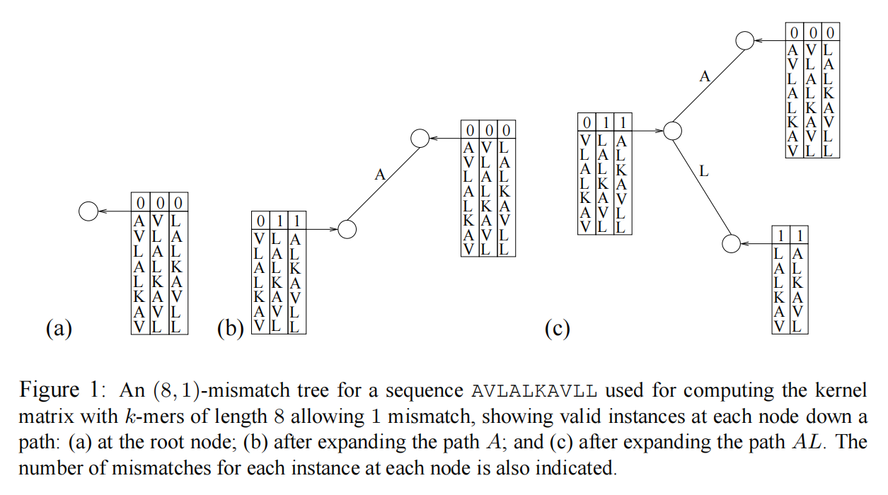
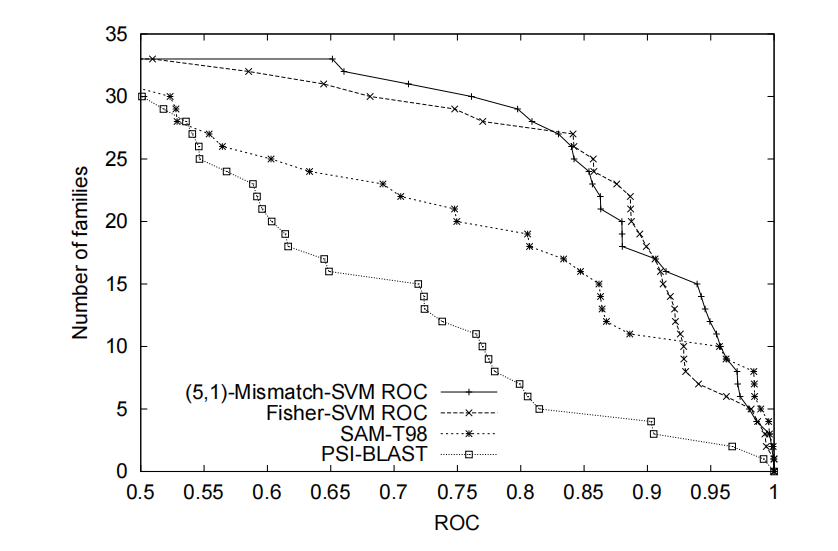
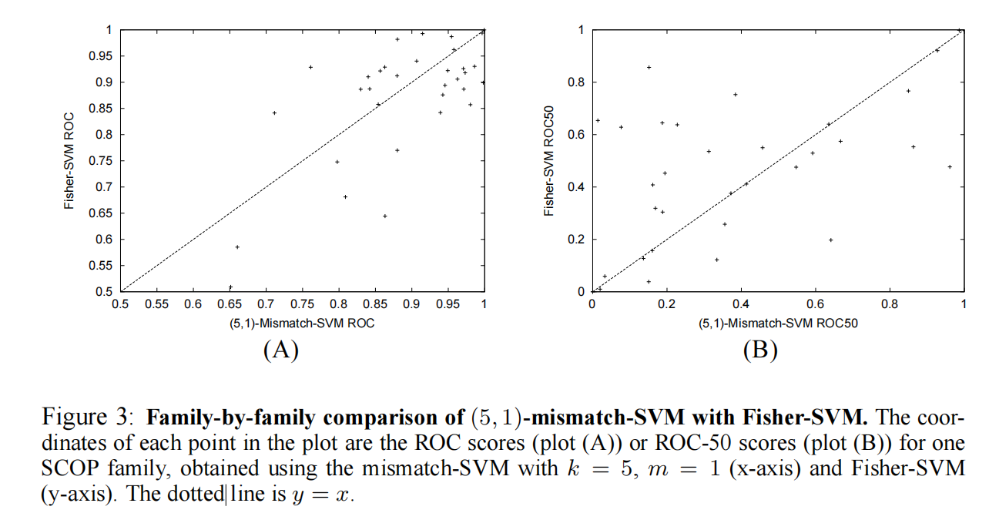
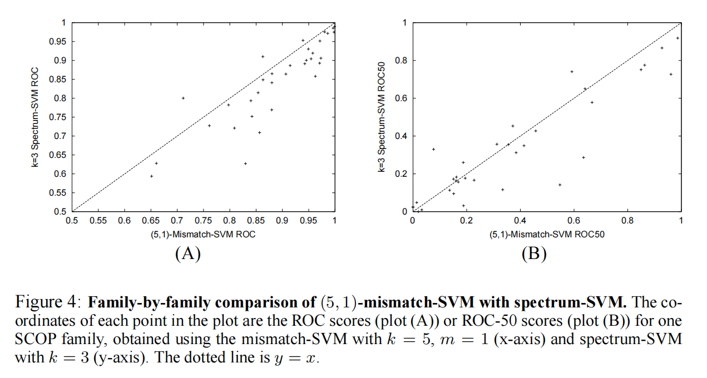

# 摘要：

我们介绍了一种字符串核函数`（注：支持向量机SVM中数据升维使用核函数）`，叫做字符串**不匹配核函数**。基于这种核函数`（注：核函数是支持向量机的核心，知核函数，可进行分类）`的支持向量机SVM用于解决蛋白质分类问题。 **这种支持向量机SVM分类的依据是蛋白质序列中长度为K的子序列和序列中m个不匹配位置**`（注：就是k和m作为核函数的参数，具体参见下文核函数公式）`并且不需要依赖任何生成模型来计算生成序列`（注：没读懂，表示牛逼）`。我们使用不匹配的树型数据结构来高效计算核函数（注：不清楚具体怎么高效计算，金长龙没讲过这方面），并且在SCOP数据集报告实验（`注：SCOP数据集是一个蛋白质分类数据集）`。**在实验结果中，我们展示了使用该不匹配核函数的支持向量机与使用了Fisher核函数的支持向量机（远程蛋白质同源性检测最成功的方法）的性能一样好，同时节省了计算量。** `（注：作者想表示不匹配核函数Mismatch Kerneld的性能和费舍尔核函数Fisher Kernel在蛋白质分类方面分类结果一样好，并且速度更快）`。

# 1.引入：

### 1.1 蛋白质识别背景：

计算生物学中的一个基本问题是根据蛋白质序列数据的同源性`（注：这里使用专用术语homology [n.] 同源性，可以理解为蛋白质相似性）`将**蛋白质分类为功能类蛋白质和结构类蛋白质。已知的蛋白质分类和同源性检测方法有“蛋白质序列对比法”，“蛋白质家族图谱法”，主要使用隐马尔科夫模型来实现。** `（注：隐马尔科夫模型理解成一种统计学方法即可，经常用于模式识别和深度学习）`我们对于这种判别方法最感兴趣，这种判别方法给每个蛋白质序列打上了标签，如果它们属于蛋白质的家族图谱或超家族图谱，那么标签为阳性，否则标签为阴性。`（注：家族和超家族是family和superfamily应该是生物学术语，这里的阴性阳性可以理解为正负，支持向量机中二分类通过正负区分是一种技巧）`  我们关注远程蛋白质同源性检测这个更困难的问题上`（注：远程蛋白质同源性检测在摘要中提到）`，我们希望我们的SVM支持向量机分类器只探测结果为阳性的蛋白质。

### 1.2 同类方法介绍：

Fisher-SVM是最成功的蛋白质分类鉴别技术之一，也是远程同源性检测的最佳执行方法。`（注：这里作者又说一遍废话，摘要中最后一句已经说过了）` 在使用Fisher核函数的支持向量机方法中，首先为阳性蛋白质训练集建立一个HMM隐马尔科夫模型。该模型对于任意的蛋白质序列x定义了一个对数似然函数`（注：不清楚什么是似然函数）` 如果θo是模型参数的最大似然估计，那么梯度向量为每个（阳性或阴性）训练序列x指定一个称为Fisher分数的特征显式向量。`（注：读不懂，就是表示上述操作可以得到Fisher核函数）`。该特征映射定义了一个称为Fisher核的核函数，然后可用于训练支持向量机。**Fisher-SVM方法的优点之一是，它结合了隐马尔科夫模型中编码的丰富生物信息和SVM算法的识别能力。**  然而，人们通常需要大量数据或复杂的先验知识来训练隐马尔可夫模型，而且由于计算Fisher分数需要动态规划（一种二次算法），在实践中，计算核矩阵非常昂贵。`（注：训练支持向量机的前提是获取核函数，作者表示Fisher核函数虽然性能优异，但是需要动态规划和复杂数据分析实现隐马尔科夫模型，这是弊端，制约了该支持向量机的性能。）`

### 1.3 本文提出的新方法介绍：

**在本文中提出一种字符核函数，称作不匹配核函数，用于解决和Fisher核函数一样的远程蛋白质同源性检测问题。** 不匹配核函数的参数是k和m，通过这两个参数把数据映射到高维特征空间中去。对于一个(k，m)向量中各维度的介绍：k表示不同蛋白质序列中氨基酸可能的匹配长度`（注：如果一个蛋白质序列是“色氨酸，谷氨酸，甘氨酸，亮氨酸”，另一个蛋白质序列是“赖氨酸，谷氨酸，甘氨酸，缬氨酸”，那么k为2，仅个人理解）`，m表示这些拥有长度为k匹配氨基酸片段的蛋白质之间可能有m处不匹配。`（注：上述例子中“色氨酸和赖氨酸不匹配，亮氨酸和缬氨酸不匹配”，那么m为2，仅个人理解）` 。由于上文提到了m这个表示不匹配的维度，所以基于不匹配核函数的支持向量机体现了生物学上的重要的不匹配思想。`（注：这TM是啥呀）`。在当前的论文中我们还描述了如何用不匹配树这个数据结构高效计算核函数，`（注：作者想表示用这种数据结构比用隐马尔科夫模型和动态规划计算的Fisher核函数要更快计算出不匹配核函数）`在这个应用场景中，核函数速度快到足够在真实模型上使用，并且计算量少于Fisher核函数的计算量。我们从Jaakkola等人组装的SCOP数据集中汇报结果，并表明**基于不匹配核函数的支持向量机，可获得与Fisher-SVM方法相同的性能，同时优于所有其他测试方法。最后，我们注意到，不匹配核函数不依赖于任何生成模型，并且可能用于其他基于序列的分类问题。**

# 2. 不匹配字符串核函数：

我们的蛋白质分类方法是通过基于字符串的特征映射函数`（注：就是核函数，就是介绍了下SVM原理）`将蛋白质序列表示为高维特征空间中的向量。然后我们训练了支持向量机，用高维数据代替蛋白质序列进行分类，这是一种拥有大边界的线性分类器。`（注：这里是一个二分类问题，所以看起来支持向量机是一个线性分类器，“大边界”原文为large-margin，在支持向量机的损失函数中，就是在“大边界”范围内找到一个损失值最小的超平面）` 由于支持向量机是一种基于核函数的学习算法，因此我们不显式计算特征向量，而是使用不匹配的字符串核计算其成对内积，我们在本节中定义了该内积。`（注：这句话介绍了支持向量机的原理，说的等于没说，不会的看不懂，会的不用看）`

### 2.1 字符串特征映射函数：

**引入：**

对于字母表A，A看做一个集合，大小为L，那么有(L^k)维向量。对于氨基酸来说，A就是氨基酸的集合，这里仅考虑20种氨基酸，所以L=20。

**规则1：氨基酸序列的向量空间表示**

设α是一个长度为k的序列，其中ai都来自于字母表A，表示某一个氨基酸。
$$
\alpha = (a_1, a_2, a_3,...,a_k)
$$
**公式1：符合长度为k，且最多m处不同的氨基酸序列的表示**  

设N(k,m)(α)为所有可能的长度为k的氨基酸序列的集合，并且这些氨基酸序列至多和α有m处不匹配。实际上这就是一个A^k向量空间。

设映射函数表示所有的长度为k的氨基酸序列的集合，映射函数φ如下：
$$
\varPhi_{(k,m)}(\alpha) = (\phi_\beta(\alpha))_{\beta \in A^k}
$$
**规则2：将符合要求的氨基酸序列映射为数值**

公式1右端映射函数φ的取值规则如下，如果当前集合属于N(k,m)(α)，那么值为1，否则值为0。所以公式1的取值就变得不确定，就成功映射到了一个数值。
$$
\varPhi_{(k,m)}(\alpha) = \sum^{所有可能的 \phi_\beta(\alpha)} \left\{
\begin{aligned}
1, \qquad \phi_\beta(\alpha)\in N_{(k,m)}(\alpha)\\
0, \qquad \phi_\beta(\alpha)\notin N_{(k,m)}(\alpha)
\end{aligned}
\right.
$$

**公式2：根据蛋白质的氨基酸序列，生成描述蛋白质的数值** 

规定对于一个蛋白质序列，其中有长度为x的子序列，x为任意取值，那么依据上述规则和公式，获取一个描述该蛋白质的特征函数。

下述公式表示，该蛋白质序列中任意一个长度为x的子序列的φ函数值的和，该函数的结果是一个数值。
$$
\varPhi_{(k,m)}(x) = \sum_{k-mers\;\alpha\;in\;x} \varPhi_{(k,m)}(\alpha)
$$
**公式3：支持向量机的核函数表示**

在公式2中我们已经能够用数值描述一个蛋白质，假设在一个蛋白质中，有长度为x的子序列和长度为y的子序列，那么根据公式2，我们可以获取该蛋白质的直角坐标系中的坐标描述。在此基础上规定核函数如下：`（注：这个核函数看起来有点奇怪，并不是金长龙提到的向量内积的形式，在重新阅读作者原文后，发现核函数指的是将坐标映射到特征空间，并没有说一定要数据升维。不同机器学习教程中讲解不同）` 对于m=0的情况，作者在引用[14]中说明，在本文中并未说明。下述核函数其实就是表示将直角坐标系中的坐标重新映射到直角坐标系，使得数据能够区分。x和y表示长度为x或y的蛋白质氨基酸子序列。
$$
K_{(k,m)}(x,y) \; = \; <\varPhi_{(k,m)}(x), \; \varPhi_{(k,m)}(y)>
$$

### 2.2 Fisher核函数的评分和光谱核函数

`（注：这个标题有点奇怪，不确定该怎么翻译，不过就是讲解解决此问题的同类方法）`

本部分讲解了马尔科夫链和最大似然估计(不太懂)，公式复杂，跟主题SVM以及主题算法有些不相关，暂时略去。

# 3.不匹配核函数的高效计算

与Fisher核函数使用的向量不同，我们的特征向量是高维特征空间中的稀疏向量。因此，我们不需要计算和存储特征向量，而是直接高效地计算核函数矩阵，用于支持向量机分类器。`（注：知道了核函数矩阵，可以快速知道所有点对应的映射）`

### 3.1 不匹配树数据结构

我们使用不匹配树数据结构来表示特征空间（所有k-mers的集合，k-mers就是长度为k的子序列），并对样本数据集中出现的所有k-mers进行词汇遍历，匹配最多有m个不匹配；**对于n个序列的样本，在树的一次遍历中计算整个核函数矩阵。**

`（注：下述描述仅限于个人理解）`

**☆不匹配树数据结构描述：**

* 不匹配树的每个节点都是字母表A中的某一个元素，其实就是某一个氨基酸的标识。

* 不匹配树的高度是k，因为我们要计算φ函数，就要知道所有长度为k的氨基酸序列。由根节点到任意节点，路径上的边存储的信息加上该节点存储的信息，就表示一个长度为k的子序列（详情可参考下面示例解释）。

* 除了叶子结点，每一个节点都有|A|个分支，表示在一个序列中已有当前节点的氨基酸，序列中下一个氨基酸的选择总共有|A|种可能。
* 每个节点存储信息表示R个长度为k-d+1的子序列信息（R将在下面解释，长度的表示也请参考下面示例讲解），d为该节点的高度。树的边上存储字母表A的字母信息（每个字母代表一种氨基酸），比如从根节点到根节点的最左边的孩子，表示从根存储的长度为k的序列中删除第一个氨基酸，得到长度为k-1的子序列。此时对比删除的氨基酸是否与边上的字母表信息相等，如果不相等，那么该匹配序列对应的值加1，表示有一个不匹配。
* 根节点存储R个长度为k的序列信息，R是原蛋白质序列中长度为k的子序列的个数。

**☆不匹配树数据结构实例说明：**

* 先看图(a)，蛋白质序列AVLALKAVLL长度为10，现在要求求出它长度为8的子序列（当然不可能是跳跃的子序列AVL是一个长度为3的子序列，ALA就不是），总共有三种情况，图A已经列出来了，从上向下看即可。最上面的000表示对应每种情况下，与长度为8的子序列总共有0处不匹配。图中还表示该节点存储着这个像表一样的数据结构。
* 再看图(b)，右上角是图(a)中求出的根节点，没有发生变化。然后根据“不匹配树数据机构描述”，根节点向下扩展，边上存储着字母表中的信息。图(b)假设了该边上存储信息A，表示A类型的氨基酸。扩展到最左边的孩子节点。观察孩子节点存储的信息，就是上文描述的存储了长度为k-d+1=7的子序列，该子序列就是剔除了父节点存储的序列的首个氨基酸（不信可以验证之，VLALKAV就是父节点AVLALKAV剔除了第一个氨基酸后的结果），该子序列加上根节点到该节点的边上的氨基酸就构成了一个长度为k的序列，因此该节点存储的氨基酸序列分别为AVLALKAV，ALALKAVL，AALKAVLL。此时表中信息还要更新，对比剔除的父节点序列的首个氨基酸是否和边存储的氨基酸相等，发现第一个序列相等AVLALKAV等于父节点第一个序列AVLALKAV，其余不相等ALALKAVL!=VLALKAVL，AALKAVLL!=LALKAVLL）。因此该节点后两个序列出现了1个不匹配，所以更新表头信息为011.
* 再看图(c)，图(c)是基于图(a)和图(b)得来。由根节点的第一个子节点向下扩展得到。新节点的序列如下：ALLALKAV，与父节点AVLALKAV有一处不匹配。ALALKAVL，与父节点ALALKAVL相等，因为父节点与根节点本省就有一处不匹配，所以该序列记作仍有一处不匹配。ALLKAVLL与父节点AALKAVLL有一处不匹配，父节点与根节点一处不匹配，总共该节点序列与原始序列有2处不匹配，超过了背景要求“allowing 1 mismatch”，所以舍去，所以就有了上图只有两个序列的情况。

**☆不匹配树数据结构计算核函数说明：**

从上述举例可知，每扩展一个节点就可以知道一个长度为k的子序列，就是知道了“规则2”中的φ函数的一个取值。如果一个节点中存在R个表项，例如上述例子中根节点3个表项，第一个孩子节点3个表项，第一个孙子节点2个表项，那么φ(k,m)的值就加上R。表示新发现了R个长度为k的子序列，并这R个子序列存在Q个与原始子序列的不匹配，且Q小于等于要求的m。所以当遍历（或者说生成）完整个树，那么核函数矩阵也就更新完成了，因为“公式3”中提到了核函数需要φ(k,m)函数。

### 3.2 高效计算核函数矩阵

首先要注意，由于我们在一次深度优先遍历中计算核函数，因此实际上不需要存储整个不匹配树，而是使用递归函数计算内核，这样可以更有效地使用内存，并允许对大型数据集进行核函数计算。`（注：就是上文示例演示的，只需要在根节点创建序列信息，在DFS中扩展节点生成新的信息并更新核函数，每一次回溯都会销毁局部的序列信息）`。

**公式4：符合要求的氨基酸序列个数以及计算时间复杂度**

对于一个蛋白质，它的氨基酸序列长度为L，要求子序列长度为k，要求最多子序列中有m处不匹配。那么满足要求的长度为k的子序列的个数n可以如下表示：
$$
n = \sum_{i=0}^m \left(\begin{array}{l} k \\ i \end{array}\right) (l-1)^i = O(k^ml^m)
$$
这个公式的计算形式令我疑惑，二维向量乘一个常数并求和？不过理解含义即可，求出长度为k且有i处不匹配的子序列即可，i<=m。将求出的子序列的个数相加就是所有符合要求的氨基酸序列个数。时间复杂度如上。`（注：作者说会在其它地方详细解释时间复杂度的计算过程，这里了解即可。可是作者在本论文没有再详细展开，可能写到其它论文了？也许）`

**公式5：对于所有数据下的时间复杂度分析**

公式4是对于一个蛋白质序列而言，如果有N组数据，那么时间复杂度如下：
$$
O(Nk^ml^m)
$$
**公式6：最坏情况下的时间复杂度**

在这里作者只是简要说明最坏情况的时间复杂度，并没有给出证明。作者说当蛋白质序列长度为k的子序列对应的蛋白质都相同时计算成本是最高的。`（注：结合时间复杂度公式，感觉是说N组数据的蛋白质都相同，但是这种几率很低，所以不太可能有最坏情况？）`

>It is not hard to see that for the kernel computation, the worst case occurs when all k-mer instances in the data are the same

时间复杂度如下：
$$
O(N^2k^ml^m)
$$
作者最后提出，在本算法的应用中，m取一个很小的值是非常有用的，会节省计算成本。`（注：这不是废话吗，看时间复杂度就行了）`

上图给出了几种检测蛋白质同源性的方法，上图采取了ROC曲线进行分析。**可以看出在相同家庭数下，不匹配核函数的阳性率较高（就是对应着横坐标，感觉可以说是分类成功的蛋白质的比率），说明基于不匹配核函数的SVM算法性能优异。**注：ROC的全称是Receiver Operating Characteristic Curve，中文名字叫“受试者工作特征曲线”，顾名思义，其主要的分析方法就是画这条特征曲线。`（注：结合网上搜集的资料，推测横坐标应该表示阳性率（检测出目标蛋白质的比率），因为做二分类，下面表示筛选出阳性的概率。纵坐标家庭数作者在本文没有详细提，只是在introduction中简单提到，这应该是生物学术语）`

>Figure 2: **Comparison of four homology detection methods.** The graph plots the total number of families for which a given method exceeds an ROC score threshold. Each series corresponds to one of the homology detection methods described in the text.

该图描绘了给定方法超过ROC评分阈值的家庭总数。每个系列对应于文本中描述的一种同源性检测方法。`（注：不知道怎么翻译好，这是百度翻译的翻译）`

# 4.实验：远程蛋白质同源性探测

### 4.1 介绍使用训练集

针对远程同源性检测问题，我们在SCOP数据集`（注：SCOP数据集在摘要中已经提到）`上使用SVM分类器测试不匹配核函数。

下面介绍了作者如何在SCOP数据集中选取数据，哪些是目标蛋白质。涉及生物学术语，不太好翻译。

> In these experiments, remote homology is simulated by holding out all members of a target SCOP family from a given superfamily. Positive training examples are chosen from the remaining families in the same superfamily, and negative test and training examples are chosen from outside the target family’s fold.

下面介绍了同类方法Fisher核函数如何通过数据集训练隐马尔科夫模型。没有什么实际内容。

> The held-out family members serve as positive test examples. In order to train HMMs, Jaakkola et al. used the SAM-T98 algorithm to pull in domain homologs from the non-redundant protein database and added these sequences as positive examples in the experiments. Details of the datasets are available at www.soe.ucsc.edu/research/compbio/discriminative.

### 4.2 正则化公式介绍

**公式7：核函数正则化**

我们在远程蛋白质同源检测中使用较小的k和m值`（注：结合上文时间复杂度分析，大的k和m容易导致状态爆炸）`，在这里使用k=5，m=1和k=6，m=1进行测试，并且对核函数进行正则化：（核函数表示请参考公式3）
$$
K^{Norm}_{(k,m)}(x,y) = \frac {K_{(k,m)}(x,y)}{ {\sqrt{{K_{(k,m)}(x,x)}} \cdot \sqrt{K_{(k,m)}(y,y)} }}
$$
原核函数将原坐标表示映射到特征空间的坐标。这样正则化的结果就变成了特征空间的坐标对应的向量直接的夹角的余弦值。
$$
cos\theta = \frac {a \cdot b} {||a|| \cdot ||b||}
$$

### 4.3 不同方法在实验中的表现

作者声称在这之后我们发现选用k=5，m=1，比k=6，m=1的表现更好。我们使用了支持向量机软边界优化算法（soft margin optimization algorithm），参考www.cs.columbia.edu/compbio/svm。为了比较，作者又测试了同类相同的方法比如上文经常提到的Fisher核函数下的SVM，以及其它一些方法（可以参考原文）

上图是作者对不匹配核函数和Fisher核函数在SCOP数据集下的表现进行的绘图，还是使用ROC曲线进行评分，纵横坐标表示Fisher核函数和不匹配核函数在ROC曲线中的阳性率。A图采用ROC评估，B图采用ROC50评估。**注：可以看出在ROC评估下，Fisher和不匹配核函数的表现差不多，因为点都集中在y=x附近，说明两者的分类预测率差不多。在ROC50下差异较大。** `（注：原文在此还有几百字对于图的解释就暂时略去，感兴趣可以阅读）`

# 5.讨论：

### 5.1 通过同类方法对比介绍该算法优势

我们提出了一类无需对齐或不依赖生成模型即可测量序列相似性的字符串核函数，并给出了计算这些核函数的有效方法。对于远程同源性检测问题，我们的鉴别方法——将支持向量机与不匹配核函数相结合——在SCOP实验中的表现与已知最成功的方法一样好。`（注：这是一句废话，自卖自夸，重复n遍了）` 

一个实用的蛋白质分类系统将涉及对大规模测试集的快速多类预测——可能涉及数千个二元分类器。在此类应用中，核函数的计算效率成为一个重要问题。Chris Watkins和David Haussler最近定义了一组字符串上的核函数，同类方法中的一些字符串核函数已经运用在文本分类问题中了，这些核函数的计算成本是O(n^2)，和Fisher核函数的计算成本类似。而不匹配核函数计算成本在k和m取较小值时显著要低于上述核函数，所以不匹配核函数显著提升了性能。`（注：这还是在说自己的算法比较不错）`

**上图的分析和“实验：远程蛋白质同源性探测”中的图的分析一致，可以看出不匹配核函数和光谱核函数在ROC和ROC50的评估体系下表现相似，这些点都分布在y=x附近。**

### 5.2 对比同类方法提出改进措施

许多基于家族的远程蛋白质同源检测算法结合了一种用于从未注释的蛋白质序列数据库中选择可能的结构域同源物的方法，以获得额外的训练数据。在这些实验中，我们使用SAM-T98（一种基于HMM隐马尔科夫模型的迭代算法）识别的域同系物作为Fisher-SVM方法的一部分，并将其包含在数据集中；这些同系物对于Fisher核函数可能比对于不匹配核函数更有用。**我们计划通过研究半监督技术来扩展我们的方法，以选择用于基于不匹配核函数的支持向量机的未注序列** `（注：有些读不懂，生物专业术语有点多，不过作者称希望通过半监督学习来扩展该方法）`。

### 5.3 由生物学和算法本质提出改进措施

使用本文介绍的框架可以探索失配内核上许多有趣的变化。

* 例如，在计算核矩阵期间，可以基于在每个叶或内部节点上实施的标准来实现显式长度为k的氨基酸序列的特征选择。一个好的特征选择标准可能会提高某些应用程序的性能，同时减少内核计算时间。`（注：文章中作者在每个节点上依据当前有小于m处不匹配的长度为k的序列的个数的和作为特征选择的依据。也许我们能做出改进，更改规则2中的参数？）`

* 在生物应用中，还考虑通过进化替代概率加权每个长度为k的氨基酸序列对应蛋白质的特征坐标`（注：这句话优点生物学专业，没读懂，应该是作者希望通过生物学的某种特性对特征坐标的计算进行加权）`。

* 还可以根据第2.2节中描述的Fisher分数调整长度为k的氨基酸序列（k-mer）坐标图。`（注：这句话不太懂，根据英文原文推测，应该是修改不同的k值来调整支持向量机的性能）`

* 最后，我们可以使用核K（ki，mi）的线性组合来捕捉不同长度K-mers（不同长度的氨基酸序列）的相似性。`（注：这句话优点搞不清楚，推测是说对核函数进行新的线性变换，将原坐标映射到一个更合适的特征空间中，以提高分类准确率）`我们相信，进一步的错配串核实验对于远程蛋白质同源性检测和其他生物序列分类问题可能是富有成效的。

