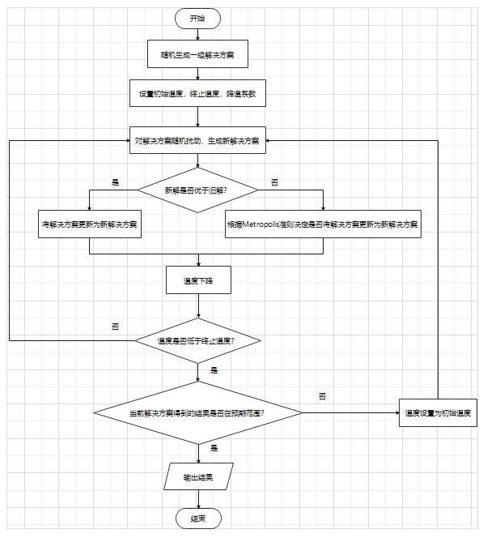
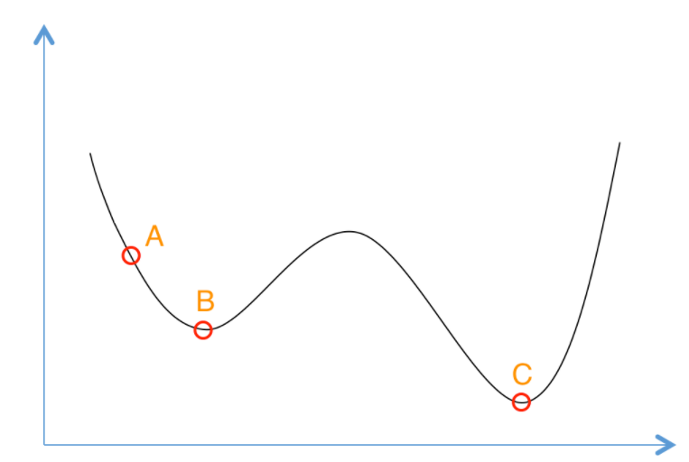
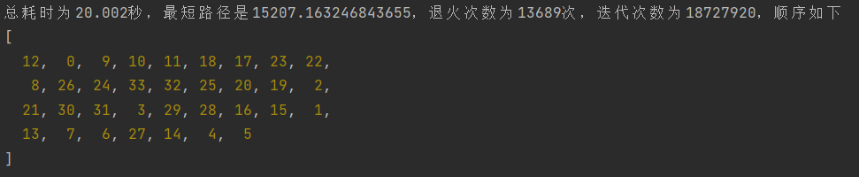

### 1.金属退火

#### 1.1 金属退火概念：

金属退火是一种化学上的热处理技术，指的是将金属加热到一定温度后再以适宜速度冷却。金属退火可以改变金属的一些物理性质，化学性质，以达到某种特殊的用途。

#### 1.2 金属退火化学模型：

加热后金属原子最初处于某种活跃的状态，此时原子的活跃程度为x1，金属的内能E(x1)可由x得来，温度为T1

降温时金属原子的活跃程度逐渐下降，此时原子的活跃程度为x2，金属的内能E(x2)可由x得来，温度为T2

当温度降至稳定温度时金属原子的活跃程度最低，此时原子的活跃程度为x3，金属的内能E(x3)可由x得来，温度为T3


### 2.模拟退火

#### 2.1 模拟退火参数：

模拟退火模型由“金属退火化学模型”改进得来，模拟退火关注如下几种参数：

1. 金属原子的活跃程度x，对应着问题的某一种**解决方案**

2. 金属的内能E，对应着使用x解决方案解决问题最后的到的**结果**

3. 金属的温度T，对应着解决问题要进行的**迭代次数**，温度有**初始温度，终止温度，降温系数**，三者共同控制迭代次数

4. 金属降温系数α，α是一个[0, 1]之间的数，表示每次温度降低的幅度，T在降低时```T = αT``` 

#### 2.2 模拟退火流程：



#### 2.3 Metropolis准则

**Metropolis准则公式：**

当E越小越好时：即金属退火模型或求最小值的NP问题
$$
P = \left\{\begin{aligned}1\qquad{E_{t+1}}<E_t\\e^{\frac{-(E_{t+1}-E_t)}{kT}}\qquad{E_{t+1}\geq{E_t}}\end{aligned}\right.
$$
当E越大越好时：例如求最大值的NP问题
$$
P = \left\{\begin{aligned}1\qquad{E_{t+1}}>E_t\\e^{\frac{-(E_t-E_{t+1})}{kT}}\qquad{E_{t+1}\leq{E_t}}\end{aligned}\right.
$$


1. P表示是否让新的解决方案代替当前解决方案。
2. Et+1表示新解决方案，对应金属退火中的t+1温度下的金属内能。

3. T表示当前温度，k表示降温系数。


**Metropolis准则带来的优势：**

Metropolis准则是模拟退火的优势所在，在机器学习的梯度下降法中可能会遇到局部最优解。这种情况下往往需要调整梯度下降的步长和迭代次数来越过局部最优解。**上述流程图中的随机扰动+Metropolis准则给予了模拟退火算法不确定性，即使当前获取的了最优解，也会再次探测是否存该解是局部最优，是否存在全局最优解。**



在上图，如果步长很小的梯度下降法会停留在B点，因为梯度最大的缘故。只有反复修改步长和迭代次数才能寻找更优解。在模拟退火算法中，由于不确定性，当找到B点的局部最优解时，还会继续跳动寻找更优解，有可能寻找到最优解C。

#### 2.4 模拟退火举例：旅行商TSP问题

**问题描述：**

> 有N个城市，任意一个城市i到其它城市都有一条双向道路且长度为Li。现在旅行商想从某个城市出发要访问这N个城市，且每个城市只能访问一次。旅行商希望他经过这N个城市所走的路线是最短路线，那么旅行商该从哪个城市出发，又应该走什么样的路线呢？

**阐述流程：**

边是N^2级别，适合使用邻接矩阵存图。几种经典最短路算法，并不使用此情景，给出起点终点，但是无法保证一定经过所有节点。使用搜索算法的开销较大。**此时考虑使用模拟退火算法解决，流程如下：**

1. 设置初始温度为2000，终止温度为0.1，降温系数为0.98
2. 随机生成一组解决方案，旅行商从1城市出发，顺序经过其它城市，最后到N城市，再回到1城市。
3. 设置随机扰动，随意将解决方案中的两个城市交换顺序
4. 计算扰动后的路线长度和扰动前的路线长度哪个更优，扰动后优则更新解决方案，扰动前优则根据Metropolis决定是否更新解决方案
5. 温度乘降温系数，温度下降
6. 判断温度是否低于终止温度
7. 低于终止温度则输出最短路长度和访问这些城市的顺序（如果最短路长度不满意，可以在此重置温度为初始温度，重新迭代）

**算法实现：（JavaScript）**

运行环境：NodeJS或chrome浏览器调试框

```javascript
// 生成初始解决方案
function makeAns(n) {
    // n表示城市的数量，这里生成初始解决方案，就是按顺序访问这n个城市
    let cities = []
    for(let i = 0; i < n; i ++)
        cities.push(i)
    return cities
}

// 随机扰动解决方案，生成新解决方案
function makeNewAns(resultNow, n) {
    let resultNew = resultNow.slice(0)
    // 随机选取两个不同的城市
    let firstCity = Math.floor(Math.random() * n)
    let secondCity = Math.floor(Math.random() * n)
    while (secondCity === firstCity)
        secondCity = Math.floor(Math.random() * n)
    // 交换访问它们的顺序，造成小扰动
    resultNew[firstCity] = resultNew[firstCity] ^ resultNew[secondCity]
    resultNew[secondCity] = resultNew[firstCity] ^ resultNew[secondCity]
    resultNew[firstCity] = resultNew[firstCity] ^ resultNew[secondCity]
    return resultNew
}

// 控制解决方案是否更新的Metropolis准则
const Metropolis = (Et, EtNew, T) => EtNew < Et ? 1 : Math.E ** (-(EtNew - Et) / T)

// 计算两个城市之间的欧几里得距离
const getDistance = (cityA, cityB) => Math.sqrt(((cityA[0] - cityB[0]) ** 2) + ((cityA[1] - cityB[1]) ** 2))

// 计算当前解决方案下的总距离
const getAns = (result, cities) => result.reduce((a, b, index) => result[index + 1] ? a + getDistance(cities[b], cities[result[index + 1]]) : a, 0)

// 设置模拟退火参数
function setParameters() {
    //中国34个城市实际距离坐标x坐标y坐标
    const cities = [[9932, 4439], [10109, 4351], [11552, 3472], [10302, 3290], [8776, 3333], [7040, 4867], [9252, 4278], [9395, 4539], [11101, 2540], [9825, 5087], [10047, 4879], [10227, 4648], [100027, 4229], [9878, 4211], [9087, 4065], [10438, 4075], [10382, 3865], [11196, 3563], [11075, 3543], [11544, 3365], [11915, 2900], [11305, 3189], [11073, 3137], [10950, 3394], [11576, 2575], [12239, 2785], [11529, 2226], [9328, 4006], [10012, 3811], [9952, 3410], [10612, 2954], [10349, 2784], [11747, 2469], [11673, 2461]]
    // 初始解决方案
    let result = makeAns(cities.length)
    // 初始温度
    let startTemperature = 10000
    // 结束温度
    let endTemperature = 1e-8
    // 降温系数
    let alpha = 0.98
    // 目标结果范围
    let targetDistance = 12000
    return {
        cities, result, startTemperature, endTemperature, alpha, targetDistance
    }
}

// 模拟退火执行函数
function anneal() {
    // 获取参数
    let {
        cities, result, startTemperature, endTemperature, alpha, targetDistance
    } = setParameters()

    // startTime为开始执行时间
    let startTime = Date.now()
    // cnt用于记录退火次数
    let cnt = 0
    // sum用于记录迭代次数
    let sum = 0
    // T表示当前温度
    let T = startTemperature
    // 最优解
    let bestResult = result
	
    // 如果当前求解最短路大于目标结果，那么重新退火
    while(getAns(result, cities) > targetDistance) {
        // 限制时间，如果超过20秒则退出程序
        if((Date.now() - startTime) / 1000 > 20)
            break
        while (T > endTemperature) {
            // 制造一些波动，获取一个新解决方案
            let resultNew = makeNewAns(result, cities.length)
            // 获取新解决方案替换当前解决方案的概率
            let p = Metropolis(getAns(result, cities), getAns(resultNew, cities), T)
            // 获取一个概率值，如果p大于等于这个概率，那么就让新解决方案替换当前解决方案
            p >= Math.random() && (result = resultNew)
            // 降温
            T *= alpha
            // 更新最优解
            bestResult = getAns(result, cities) < getAns(bestResult, cities) ? result : bestResult
            sum ++
        }
        T = startTemperature
        // 记录退火次数
        cnt ++
    }

    return {
        distance: getAns(bestResult, cities),
        order: bestResult,
        cnt,
        sum,
        startTime
    }
}

// 主函数
(() => {
    let {
        distance,
        order,
        startTime,
        cnt,
        sum
    } = anneal()
    console.log(`总耗时为${(Date.now() - startTime) / 1000}秒，最短路径是${distance}，退火次数为${cnt - 1}次，迭代次数为${sum}，顺序如下`)
    console.log(order)
})()
```

**实验效果：**




### 3. 模拟退火参数调节

**1. 扰动函数**

> **调节方法：**
>
> 扰动函数控制着算法是否能够跳出局部最优解，扰动函数带来的扰动要恰当。如果扰动太大，很可能难以找到最优解；如果扰动太小，很可能需要迭代很多次才能找到最优解。
>
> **类比：**
>
> 扰动和梯度下降法中的步长有一些类似，要选择适当才行。
>
> **举例：**
>
> 在上述例子中，可以将代码中“任意交换两个城市的访问顺序”造成扰动，变成“任意交换四个城市的访问顺序”造成更大的扰动。

**2.退火温度**

>**调节方法：**
>
>退火温度指“初始温度”，“终止温度”，“降温系数”这三个参数，通过控制初始温度的大小和降温系数的大小，可以控制每次退火搜索最优解的范围。如果初始温度设置很高，降温系数逼近1，那么搜索最优解的范围将变得很大。
>
>**类比：**
>
>退火温度和梯度下降法中的迭代次数相关，“初始温度”和“终止温度”对应着迭代次数，“降温系数”对应着下降速率**（梯度下降法涉及的这些名词摘自吴恩达的机器学习教程）**
>
>**举例：**
>
>上述代码中可以调节setParameters函数中的startTemperature，endTemperature，alpha参数来调节

**3.目标结果**

>目标结果可以控制模拟退火算法何时退出，依据每一次的结果来设置即可