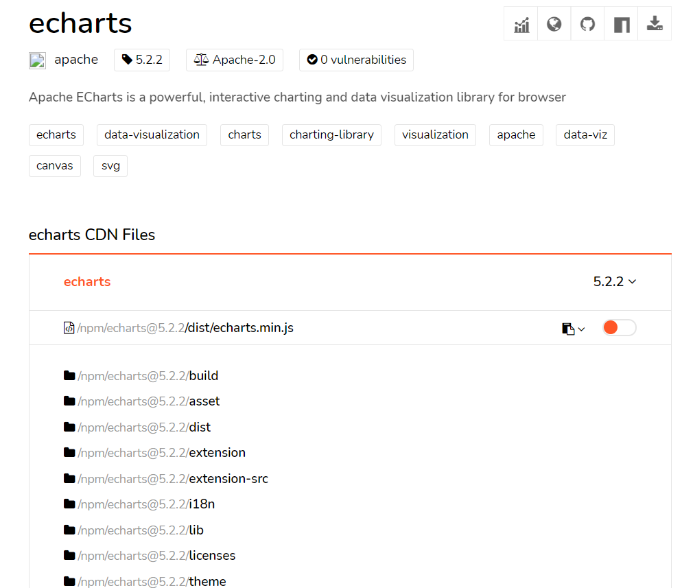
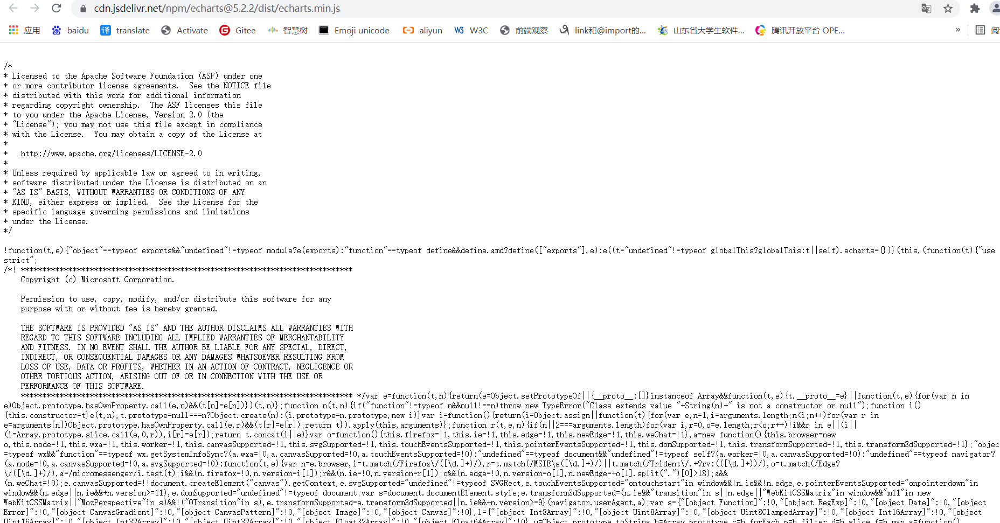
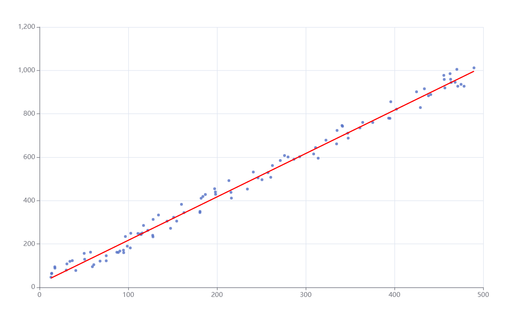

# 1.Echarts绘图库引入
学习演示过程不涉及大型工程，只需要下载Echarts的js文件在html中引用即可。使用echarts.js进行数据分析，在本人体验来看，要比python提供的绘制库强大的多。

### 1.1下载Echarts.js
下载链接https://www.jsdelivr.com/package/npm/echarts


选择第一个“echarts.min.js”打开

将内容拷贝到本地js文件中

### 1.2 测试Echarts.js
用Echarts画一个线性回归需要用到的分析图
```html
<html lang="en">
<head>
    <meta charset="UTF-8">
    <title>Title</title>
    <script src="echarts.js"></script>
</head>
<body>
    <div id="main" style="height: 600px; width: 1000px;"></div>
    <script>
        function draw(data, realData) {
            // 画图前先绑定目标对象
            let chart = echarts.init(document.querySelector("#main"))
            let option = {
                // 必须初始化X轴和Y轴
                xAxis: {},
                yAxis: {},
                // 表示数据部分，如果有多个对象，那么表示在一个画板上叠加画图
                series: [
                    // 在该画板上绘制散点图
                    {
                        symbolSize: 5,
                        data: data,
                        type: 'scatter'
                    },
                    // 在该画板上叠加绘制折线图
                    {
                        data: realData,
                        type: "line",
                        symbol: "none",
                        color: "red"
                    }
                ]
            }
            // 绘制
            chart.setOption(option)
        }
        
        // 制造数据
        function randomMaker() {
            // data是经过混淆的数据, realData是真实数据
            let data = [], realData = []
            // 创造数据依据的函数
            function y(x) {
                return 2 * x + 17
            }
            // 创造100条随机数据
            for(let i = 0; i < 100; i++) {
                // 横坐标范围是0~500
                let x = Math.random() * 500
                // 数据混淆，对函数值进行波动处理
                let hx = y(x) + (Math.random() - 0.5) * 100
                data.push([x, hx])
                realData.push([x, y(x)])
            }
            return [data, realData]
        }
        
        // 画图
        draw(...randomMaker())
    </script>
</body>
</html>
```
绘制效果如下：


# 2.Sylvester矩阵库引入

### 2.下载Sylvester.js(西尔维斯特)矩阵库
机器学习和深度学习涉及到线性代数的矩阵操作非常多，这里使用github上star第二高的西尔维斯特矩阵库来辅助我们矩阵运算。

### 2.1 下载矩阵库
下载地址：http://sylvester.jcoglan.com/#download (VPN)

选择Download下载即可。下载完进行解压，把sylvester.js拷贝到你需要的地方，这个js仅仅支持浏览器环境，不支持CommonJS规范，所以不能在nodejs中使用，如果想使用支持CommonJS，AMD或CMD规范的矩阵库，可以到上图所示的矩阵库的github网址上找到支持对应模块化规范的矩阵库。

### 2.2 测试矩阵库
```html
<html lang="en">
<head>
    <meta charset="UTF-8">
    <title>Title</title>
    <script src="sylvester.js"></script>
</head>
<body>
    <script>
        var M1 = $M([
            [1,7,3],
            [9,4,0],
            [2,7,1]
        ]);

        var M2 = $M([
            [6,2,8],
            [9,1,3],
            [0,7,6]
        ]);

        var M = M1.x(M2);

        console.log(M)
    </script>
</body>
</html>
```
输出结果如下图：
