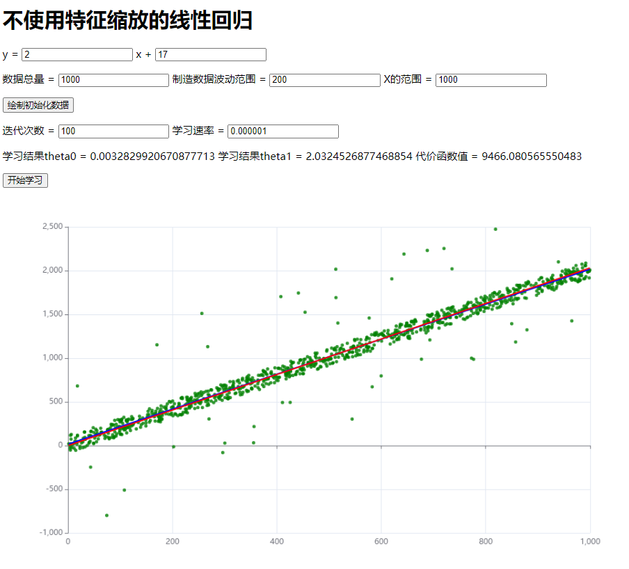
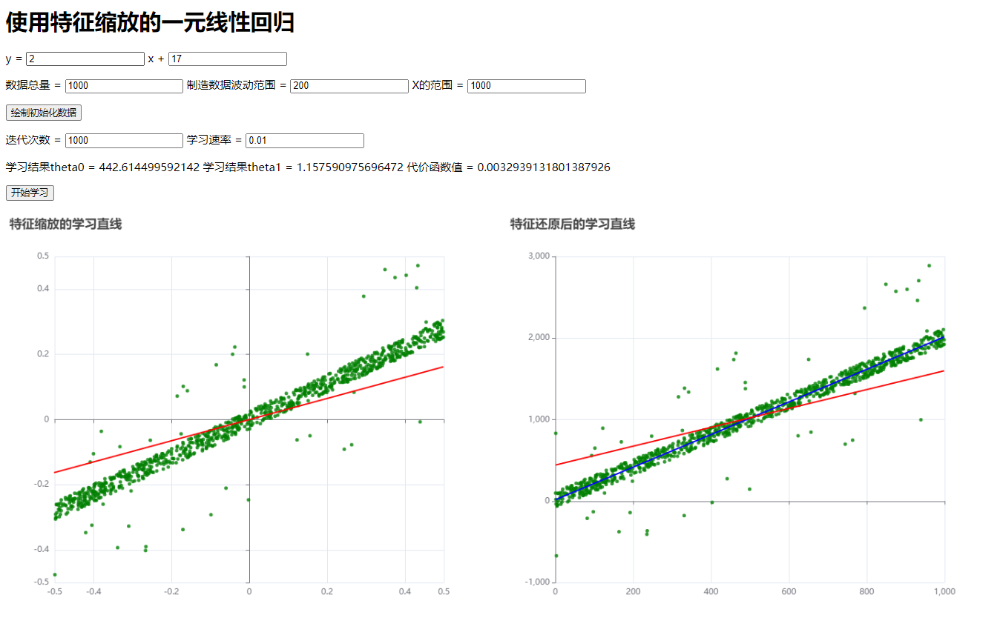

# 1.线性回归梯度下降法

### 1.1 线性回归前提

> **前提条件：**
>
> ​	有一个n元函数hθ(x)，现在已知m组函数值和n元参数的取值情况，需要预测出最能贴合该情况的函数表达式。
>
> **存储规范：(依据吴恩达教程的规范)**
>
> 1. 函数值存储到一个1行m列的矩阵中
> 2. 函数中n元参数取值情况存储到一个n行m列的矩阵中
> 3. 函数中n元参数的系数存储到一个n行1列的矩阵中
> 3. 上标表示列，下标表示行
>
> **矩阵的列表示数据组数，矩阵的行表示数据维度**


### 1.2 模型表示

**公式一：**用求和式表示某一组数据的情况：
$$
h\theta(x)^i = \sum_{j=1}^n \theta^i_j x^i_j
$$

**公式二：**用矩阵式表示所有数据的情况(便于简化编程代码)
$$
H = \theta^T \cdot X
$$


### 1.3 代价函数表示

**公式三：**用求和式表示代价函数：
$$
J(\theta) = \frac{1}{2m} \sum^m_{i=1}(h\theta(x)^i - y^i)^2
$$


### 1.4 梯度下降表示

想要求出最贴合实际情况的hθ(x)，就要找到最佳的参数θ矩阵，这里采用梯度下降算法。梯度下降对每个参数x的系数θ求偏导数，偏导数的几何意义是与曲面的切线，所有偏导数的切线叠加在一起的方向就是此时函数变化的速率最快的方向。**对每个参数x的系数θ求偏导数，并且设置一个下降速率，来控制每次θ下降的距离，以达到控制函数沿着变化速率最快的方向的下降速率。**

**公式四：**用求和式表示梯度下降算法核心计算
$$
\theta_j = \theta_j - \frac {\partial J(\theta)}{\partial \theta_j} \\ \theta_j = \theta_j - \frac {1}{m} \sum_{i=1}^m(h(\theta)^i - y^i)x_j^i
$$

公式五：用矩阵式表示梯度下降算法核心计算(便于简化编程代码)

注：X.row(j)表示n行m列的X矩阵中的第j行，col函数是JavaScript的Sylvester矩阵库的库函数


$$
\theta_j = \theta_j - \frac{1}{m} (\theta^T \cdot X - Y) \cdot X.row(j)^T
$$


### 1.5 代码表示

梯度下降核心代码：

```javascript
// X表示X变量的矩阵，n*m的矩阵，n表示数据维数，m表示数据组数
// Y表示Y变量的矩阵，1*m的矩阵，m表示数据组数
// Theta表示Theta变量的矩阵，n*1的矩阵，n表述数据维数
// rate表示学习速率
// num表示学习次数
function gradient({X, Y, Theta, rate, num}) {
    		// length表示Theta第一列有几个数据，即为n的大小，表示变量x的数据维数
            let length = Theta.col(1).elements.length
            // m表示X的第一行有多少个数据，即为m的大小
            let m = X.row(1).elements.length
            // cost为代价函数值
            let cost = 0
            // error为矩阵，表示公式五中的Theta的转置乘X再减去Y的矩阵
            let error
			
            // 第一层循环表示学习次数
            for(let k = 0; k < num; k ++) {
                // 按照公式五计算error矩阵
                error = Theta.transpose().multiply(X).subtract(Y)
                // 按照公式五，对每一个theta都计算error乘X.row(j)的转置                
                for(let j = 1; j <= length; j ++)
                    Theta.set(j, 1, Theta.e(j, 1) - (rate / m) * error.multiply($M([X.row(j).elements]).transpose()).e(1, 1))
            }
    		// 计算代价函数
            for(let i = 1; i <= m; i ++)
                cost += error.e(1, i) ** 2
            cost /= 2 * m
}
```


### 1.6 演示代码

#### 1.6.1 准备工作

1. 此时默认已经准备好了echarts.js和sylvester.src.js，准备过程参考博客“JavaScript机器学习数据可视化和矩阵库”

2. 取出下载完的sylvester库中的sylvester.src.js，这是未经过代码丑化的矩阵库代码。由于这个矩阵库不像python中的数学运算库那么强大，所以我们将其扩展一下，提高封装程度。在代码中找到“Matrix.prototype”，可以看出来这是使用原型模式创建对象，然后我们在prototype中添加两个新的方法

```javascript
  // changed by Vanghua, get the sum of all elements in the matrix
  // sum方法表示对矩阵所有元素进行求和
  sum: function() {
    let res = 0
    for(let i = 0; i < this.elements.length; i ++)
      for(let j = 0; j < this.elements[i].length; j ++)
        res += this.elements[i][j]
    return res
  },

  // changed by Vanghua, set the elements in matrix
  // set方法表示修改矩阵中的某一个元素的值，由于JS是传递值不传递引用，仅仅通过api提供的e方法无法实现此效果
  set: function(i, j, value) {
    if(i < 1 || i > this.elements.length || j < 1 || j > this.elements[0].length)
      return null
    else
      this.elements[i - 1][j - 1] = value;
  },
```


#### 1.6.2 演示代码

```html
<html lang="en">
<head>
    <meta charset="UTF-8">
    <title>Title</title>
    <script src="sylvester.src.js"></script>
    <script src="echarts.js"></script>
</head>
<body>
    <div>
        <span>y = </span>
        <input id="theta" value="2">
        <span> x + </span>
        <input id="d" value="17">
    </div>
    <div style="margin-top: 16px;">
        <span>数据总量 = </span>
        <input id="num" value="1000">
        <span> 制造数据波动范围 = </span>
        <input id="breakRange" value="200">
        <span>X的范围 = </span>
        <input id="valueX" value="1000">
    </div>
    <button style="margin-top: 16px;" onclick="getData()">绘制初始化数据</button>
    <div style="margin-top: 16px;">
        <span>迭代次数 = </span>
        <input id="iter" value="100">
        <span> 学习速率 = </span>
        <input id="rate" value="0.000001">
    </div>
    <div style="margin-top: 16px;">
        <span>学习结果theta0 = </span>
        <span id="theta0">(学习中)</span>
        <span>学习结果theta1 = </span>
        <span id="theta1">(学习中)</span>
        <span>代价函数值 = </span>
        <span id="cost">(学习中)</span>
    </div>
    <button style="margin-top: 16px;" onclick="handleClick()">开始学习</button>
    <div id="main" style="height: 600px; width: 1000px;"></div>

    <script>
        // 随机化得到的数据
        let X, Y, realY, chart, Theta = Matrix.Zero(2, 1)

        // 把初始化的数据画出来
        function getData() {
            let inputs = document.querySelectorAll("input")
            let theta = parseInt(inputs[0].value)
            let d = parseInt(inputs[1].value)
            let num = parseInt(inputs[2].value)
            let breakRange = parseInt(inputs[3].value)
            let valueX = parseInt(inputs[4].value);
            // 获取制造好的数据
            [X, Y, realY, chart] = init(theta, d, num, breakRange, valueX)
            let point = [], line = []
            // 数据整理
            for(let i = 0; i < num; i ++) {
                line[i] = [X[i], realY[i]]
                point[i] = [X[i], Y[i]]
            }
            // 画图
            draw(line, point, undefined, chart)
        }

        // 触发开始学习事件
        function handleClick() {
            let inputs = document.querySelectorAll("input")
            let theta = parseInt(inputs[0].value)
            let d = parseInt(inputs[1].value)
            let num = parseInt(inputs[2].value)
            let breakRange = parseInt(inputs[3].value)
            let valueX = parseInt(inputs[4].value)
            let iter = parseInt(inputs[5].value)
            let rate = parseFloat(inputs[6].value)
            // 在开始学习前检查用户是否已经随机生成数据
            if(!X)
                [X, Y, realY, chart] = init(theta, d, num, breakRange, valueX)

            // 在一元线性回归中，x0为1，x1已经是上面的X了0
            let x = []
            for(let i = 0; i < num; i ++)
                x[i] = 1
            // 开始梯度下降法进行学习，向梯度下降函数中传入sylvester库api包装过的矩阵
            gradient({X: $M([X, x]), Y: $M([Y]), realY: $M([realY]), Theta: Theta, rate: rate, num: iter})
        }

        // 根据用户输入参数创造数据
        function dataGenerate(y, num, breakRange, rangeX) {
            let valueY = [], realValueY = [], valueX = []
            for(let i = 0; i < num; i ++) {
                // 在范围内随机制造x
                valueX[i] = Math.random() * rangeX
                // 记录真实函数值
                realValueY[i] = y(valueX[i])
                // 制造数据波动
                valueY[i] = realValueY[i] + (Math.random() - 0.5) * breakRange
                // 制造更大的波动
                if(Math.random() > 0.95)
                    valueY[i] = realValueY[i] + (Math.random() - 0.5) * breakRange * 10
            }
            return [valueX, valueY, realValueY]
        }

        // 初始化echarts并制造数据
        function init(theta, d, num, breakRange, valueX) {
            let chart = echarts.init(document.querySelector("#main"))
            return [...dataGenerate(x => theta * x + d, num, breakRange, valueX), chart]
        }

        // 将结果绘制出来，line表示原始依据的直线，point表示经过数据波动的点，是学习数据，studyLine表示最终学习结果
        function draw(line, point, studyLine, chart) {
            let option = {
                xAxis: {},
                yAxis: {},
                series: [
                    {
                        type: "line",
                        data: line,
                        symbol: "none",
                        color: "blue"
                    },
                    {
                        type: "scatter",
                        data: point,
                        symbolSize: 5,
                        color: "green"
                    },
                    studyLine && {
                        type: "line",
                        data: studyLine,
                        symbol: "none",
                        color: "red"
                    }
                ]
            }
            chart.setOption(option)
        }

        // 梯度下降算法
        function gradient({X, Y, realY, Theta, rate, num}) {
            let length = Theta.col(1).elements.length
            let m = X.row(1).elements.length
            let cost = 0
            let error
			// 梯度下降
            for(let k = 0; k < num; k ++) {
                error = Theta.transpose().multiply(X).subtract(Y)
                for(let j = 1; j <= length; j ++)
                    Theta.set(j, 1, Theta.e(j, 1) - (rate / m) * error.multiply($M([X.row(j).elements]).transpose()).e(1, 1))
            }
            for(let i = 1; i <= m; i ++)
                cost += error.e(1, i) ** 2
            cost /= 2 * m

            // 规范化数据，进行绘图
            let H = Theta.transpose().multiply(X)
            let line = [], point = [], studyLine = []
            for(let i = 0; i < m; i++) {
                line[i] = [X.e(1 ,i + 1), realY.e(1, i + 1)]
                point[i] = [X.e(1, i + 1), Y.e(1, i + 1)]
                studyLine[i] = [X.e(1, i + 1), H.e(1, i + 1)]
            }
            draw(line, point, studyLine, chart)
            document.querySelector("#theta0").textContent = Theta.e(2, 1)
            document.querySelector("#theta1").textContent = Theta.e(1, 1)
            document.querySelector("#cost").textContent = cost.toString()
        }
    </script>
</body>
</html>
```

### 1.6.3 效果图



### 1.7 特征缩放

#### 1.7.1 特征缩放介绍

归一化是一种优化策略，当x和y在同一个范围内时，下降速率是最快的。(借用一下吴恩达的图示)


在上述的演示代码中，我设置了默认的生成直线的函数，和X的范围。直线函数默认是y=2x+17，x的默认范围是0到1000，这样看来y的变化范围基本上是x的两倍，这样在学习过程中就需要更多的学习次数才能得到最优解。这样的情况就像是左图，而我们为了优化，要让模型变成右图那样。**在不使用特征缩放的模型中，迭代很多次才能达到最优解，这个次数和学习速率不好把握，在上述代码实际测试中发现至少10000次以上的学习次数和0.000001左右的学习速率才能逐渐向最优情况拟合。但是下述使用特征缩放法的模型，经过4000次左右的迭代，0.1的学习速率就能比上述代码1000000次迭代出的模型还有优秀**

#### 1.7.2 特征缩放公式和核心代码

**公式六：**特征缩放实际上有很多种方法应用于不同环境，这里介绍使用平均值和最值的缩放公式。对于x来说，j表示第j维的x，i表述第i组的x。总共有n维变量，m组数据。使用该方法可以将x和y都缩放到-0.5~+0.5这个范围。
$$
x_j = \frac {x_j - avg(x^i)}{max(x^i) - min(x^i)} \quad

y = \frac {y - avg(y)}{max(y) - min(y)}
$$
缩放后可以表示成：
$$
\frac {y - μ_y}{s_y} = \theta_0^{'} + \frac {x_1 - μ_1}{s_1} + \frac {x_2 - μ_2}{s_2} + {...} + \frac {x_n - μ_n}{s_n}
$$


**公式七：**特征缩放后求得的参数只能应用于x和y都缩放的情况，如果我们不想应用于这种情况，那么应该将theta参数进行还原。这里用μ和s来表示平均值和最值。依据公式六中提到的缩放后表达式，将其变形进行推导。
$$
y = [(\theta_0^{'} - \sum_{i = 1}^n \frac{\theta_i^{'}μ_i}{s_i})s_y + μ_y] + x_1\frac {\theta_1^{'}s_y}{s_1} + x_2\frac {\theta_2^{'}s_y}{s_2} + ... +x_n\frac {\theta_n^{'}s_y}{sn}
$$
可以得到公式七的表达式
$$
\theta_i = \left\{
\begin{aligned}
\frac {\theta_i^{'}s_y}{s_i} \qquad i\neq0\\
(\theta_0^{'} - \sum_{i = 1}^n \frac{\theta_i^{'}μ_i}{s_i})s_y + μ_y \qquad i=0\\
\end{aligned}
\right.
$$
核心代码：

```javascript
// 特征缩放函数
function zoom(X, Y) {
    // avg表示平均值，s表示最大值减去最小值
    avgX = X.reduce((sum, el) => sum + el, 0) / X.length
    sX = Math.max(...X) - Math.min(...X)
    avgY = Y.reduce((sum, el) => sum + el, 0) / Y.length
    sY = Math.max(...Y) - Math.min(...Y)
    // 依据avg和s进行特征缩放，这样使得x和y都在-0.5到+0.5的范围中
    return [X.map(el => (el - avgX) / sX), Y.map(el => (el - avgY) / sY)]
}

// 特征还原，只是针对一元线性回归的特征还原
function reZoom(Theta) {
    let temp = Matrix.Zero(2, 1)
    // 还原θ0
    temp.set(1, 1, Theta.e(1, 1) * sY + avgY - avgX * sY / sX * Theta.e(2, 1))
    // 还原θ1
    temp.set(2, 1, Theta.e(2, 1) * sY / sX)
    return temp
}
```


#### 1.7.3 使用特征缩放方法的代码

使用特征缩放的代码：

```html
<html lang="en">
<head>
    <meta charset="UTF-8">
    <title>Title</title>
    <script src="sylvester.src.js"></script>
    <script src="echarts.js"></script>
</head>
<body>
    <h1>使用特征缩放的一元线性回归</h1>
    <div>
        <span>y = </span>
        <input id="theta" value="2">
        <span> x + </span>
        <input id="d" value="17">
    </div>
    <div style="margin-top: 16px;">
        <span>数据总量 = </span>
        <input id="num" value="1000">
        <span> 制造数据波动范围 = </span>
        <input id="breakRange" value="200">
        <span>X的范围 = </span>
        <input id="valueX" value="1000">
    </div>
    <button style="margin-top: 16px;" onclick="getData()">绘制初始化数据</button>
    <div style="margin-top: 16px;">
        <span>迭代次数 = </span>
        <input id="iter" value="1000">
        <span> 学习速率 = </span>
        <input id="rate" value="0.01">
    </div>
    <div style="margin-top: 16px;">
        <span>学习结果theta0 = </span>
        <span id="theta0">(学习中)</span>
        <span>学习结果theta1 = </span>
        <span id="theta1">(学习中)</span>
        <span>代价函数值 = </span>
        <span id="cost">(学习中)</span>
    </div>
    <button style="margin-top: 16px; display: block; margin-bottom: 20px;" onclick="handleClick()">开始学习</button>
    <div id="main" style="height: 600px; width: 700px; float: left;"></div>
    <div id="main2" style="height: 600px; width: 700px; float: left; margin-left: 20px;"></div>

    <script>
        // 随机化得到的数据
        let X, Y, realY,
            chart = echarts.init(document.querySelector("#main2")),
            zoomChart = echarts.init(document.querySelector("#main")),
            Theta = Matrix.Zero(2, 1)
        // 特征缩放需要用到的平均值和标准差
        let avgX, sX, avgY, sY

        // 把初始化的数据画出来
        function getData() {
            // 获取用户输入参数
            let inputs = document.querySelectorAll("input")
            let theta = parseInt(inputs[0].value)
            let d = parseInt(inputs[1].value)
            let num = parseInt(inputs[2].value)
            let breakRange = parseInt(inputs[3].value)
            let valueX = parseInt(inputs[4].value);
            // 获取制造好的数据
            [X, Y, realY] = dataGenerate(x => theta * x + d, num, breakRange, valueX);
            let point = [], line = []
            // 数据整理
            for(let i = 0; i < num; i ++) {
                line[i] = [X[i], realY[i]]
                point[i] = [X[i], Y[i]]
            }
            draw(point, line, [], chart)
        }

        // 触发开始学习事件
        function handleClick() {
            // 获取用户输入参数
            let inputs = document.querySelectorAll("input")
            let theta = parseInt(inputs[0].value)
            let d = parseInt(inputs[1].value)
            let num = parseInt(inputs[2].value)
            let breakRange = parseInt(inputs[3].value)
            let valueX = parseInt(inputs[4].value)
            let iter = parseInt(inputs[5].value)
            let rate = parseFloat(inputs[6].value)
            // 在开始学习前生成数据
            if(!X)
                [X, Y, realY] = dataGenerate(x => theta * x + d, num, breakRange, valueX);
            // 进行特征缩放
            let [zoomX, zoomY] = zoom(X, Y)

            // 在一元线性回归中，x0为1，x1已经是上面的X了0
            let x = []
            for(let i = 0; i < num; i ++)
                x[i] = 1
            // 开始梯度下降法进行学习。面对大量参数时使用解构来处理参数顺序问题，这样实现了python的传参机制。
            // 传参时通过矩阵库的$M将数组转化成矩阵
            gradient({zoomX: $M([x, zoomX]), zoomY: $M([zoomY]), realY: $M([realY]), Theta: Theta, rate: rate, num: iter, X: $M([x, X]), Y: $M([Y])})
        }

        // 根据用户输入参数创造数据
        function dataGenerate(y, num, breakRange, rangeX) {
            let valueY = [], realValueY = [], valueX = []
            for(let i = 0; i < num; i ++) {
                // 在范围内随机制造x
                valueX[i] = Math.random() * rangeX
                // 记录真实函数值
                realValueY[i] = y(valueX[i])
                // 制造数据波动
                valueY[i] = realValueY[i] + (Math.random() - 0.5) * breakRange
                // 制造更大的波动
                if(Math.random() > 0.95)
                    valueY[i] = realValueY[i] + (Math.random() - 0.5) * breakRange * 10
            }
            return [valueX, valueY, realValueY]
        }

        // 特征缩放函数
        function zoom(X, Y) {
            // avg表示平均值，s表示最大值减去最小值
            avgX = X.reduce((sum, el) => sum + el, 0) / X.length
            sX = Math.max(...X) - Math.min(...X)
            avgY = Y.reduce((sum, el) => sum + el, 0) / Y.length
            sY = Math.max(...Y) - Math.min(...Y)
            // 依据avg和s进行特征缩放，这样使得x和y都在-0.5到+0.5的范围中
            return [X.map(el => (el - avgX) / sX), Y.map(el => (el - avgY) / sY)]
        }

        // 特征还原
        function reZoom(Theta) {
            let temp = Matrix.Zero(2, 1)
            // 还原θ0
            temp.set(1, 1, Theta.e(1, 1) * sY + avgY - avgX * sY / sX * Theta.e(2, 1))
            // 还原θ1
            temp.set(2, 1, Theta.e(2, 1) * sY / sX)
            return temp
        }

        // 绘制特征缩放后的直线
        function drawZoom(point, studyLine, chart) {
            let option = {
                title: {
                    text: "特征缩放的学习直线"
                },
                xAxis: {
                    min: -0.5,
                    max: 0.5
                },
                yAxis: {
                    min: -0.5,
                    max: 0.5
                },
                series: [
                    {
                        type: "scatter",
                        data: point,
                        symbolSize: 5,
                        color: "green"
                    },
                    {
                        type: "line",
                        data: studyLine,
                        symbol: "none",
                        color: "red"
                    }
                ]
            }
            chart.setOption(option)
        }

        // 绘制特征还原后的直线
        function draw(point, line, studyLine, chart) {
            let option = {
                title: {
                    text: "特征还原后的学习直线"
                },
                xAxis: {},
                yAxis: {},
                series: [
                    {
                        type: "line",
                        symbol: "none",
                        data: line,
                        color: "blue"
                    },
                    {
                        type: "line",
                        symbol: "none",
                        data: studyLine,
                        color: "red"
                    },
                    {
                        type: "scatter",
                        symbolSize: "5",
                        data: point,
                        color: "green"
                    }
                ]
            }
            chart.setOption(option)
        }

        // 梯度下降算法
        function gradient({zoomX, zoomY, realY, Theta, rate, num, X, Y}) {
            let n = Theta.col(1).elements.length      // 数据维度n
            let m = zoomX.row(1).elements.length      // 数据组数m
            let cost = 0                              // 代价函数
            let error                                 // error依据公式五表示θ的转置乘X再减去Y

            // 梯度下降
            for(let k = 0; k < num; k ++) {
                error = Theta.transpose().multiply(zoomX).subtract(zoomY)
                for(let j = 1; j <= n; j ++)
                    // 依据公式五对theta求偏导数进行梯度下降
                    Theta.set(j, 1, Theta.e(j, 1) - (rate / m) * error.multiply($M([zoomX.row(j).elements]).transpose()).e(1, 1))
            }

            // 计算代价函数
            for(let i = 1; i <= m; i ++)
                cost += error.e(1, i) ** 2
            cost /= 2 * m

            // 规范化数据，进行绘图
            let zoomH = Theta.transpose().multiply(zoomX), H = reZoom(Theta).transpose().multiply(X)
            let line = [], zoomPoint = [], studyZoomLine = [], studyLine = [], point = []
            for(let i = 0; i < m; i++) {
                line[i] = [X.e(2 ,i + 1), realY.e(1, i + 1)]                // 原始直线，我们的数据是根据原始直线进行波动制造的
                point[i] = [X.e(2, i + 1), Y.e(1, i + 1)]                   // 未经过特征缩放得到的散点图
                zoomPoint[i] = [zoomX.e(2, i + 1), zoomY.e(1, i + 1)]       // 经过特征缩放得到的散点图
                studyZoomLine[i] = [zoomX.e(2, i + 1), zoomH.e(1, i + 1)]   // 缩放参数未还原得到的学习直线
                studyLine[i] = [X.e(2, i + 1), H.e(1, i + 1)]               // 将缩放的参数还原后得到的最终学习直线
            }
            // 绘制特征缩放后的学习直线
            drawZoom(zoomPoint, studyZoomLine, zoomChart)
            // 绘制特征还原后的学习直线
            draw(point, line, studyLine, chart)

            // 将结果反馈到DOM中
            document.querySelector("#theta1").textContent = reZoom(Theta).e(2, 1)
            document.querySelector("#theta0").textContent = reZoom(Theta).e(1, 1)
            document.querySelector("#cost").textContent = cost.toString()
        }
    </script>
</body>
</html>
```

### 1.7.4 效果图




# 2. 线性回归正规方程算法

### 2.1 正规方程

**公式八：** 正规方程适合求解小数据量特征较少的线性回归情况，不需要再调整参数。矩阵求逆的操作是O(n^3)时间复杂度。有些时候可能会遇到矩阵的逆不存在的情况，这时候就需要考虑使用梯度下降算法了。
$$
\theta = Y \cdot (X^T \cdot X)^{-1} \cdot X^T
$$
