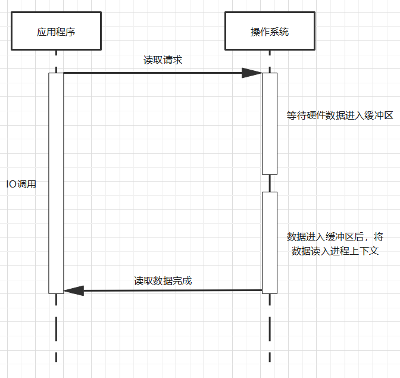
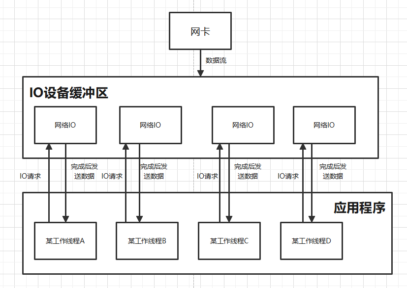
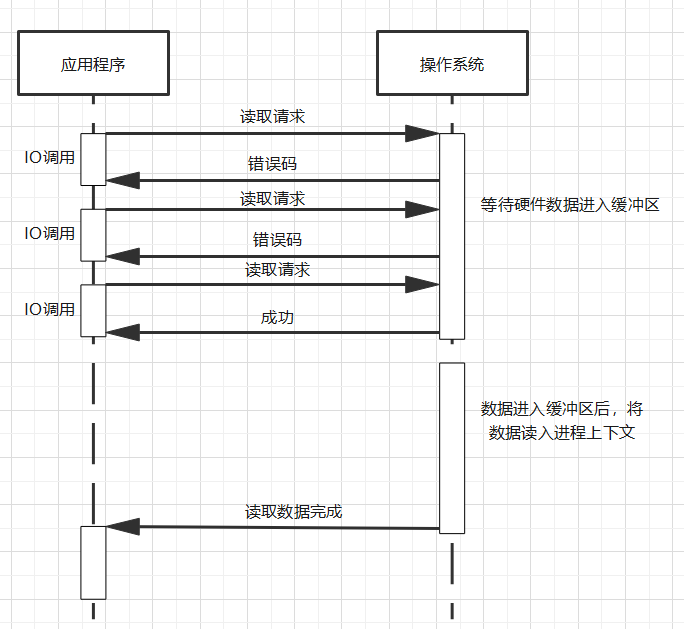
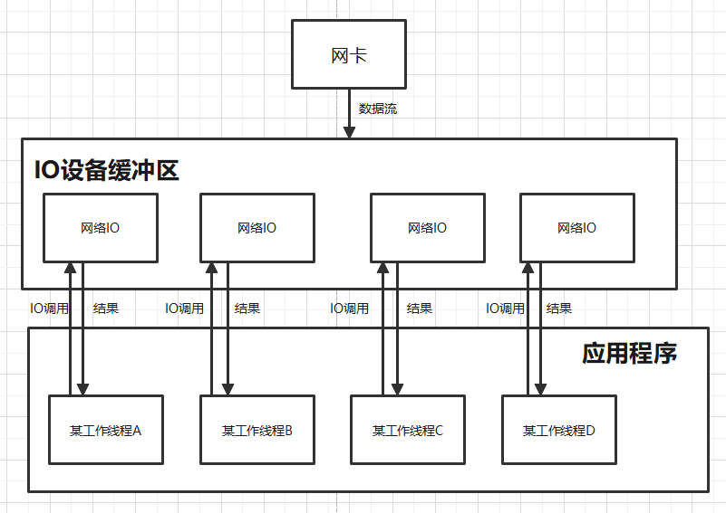
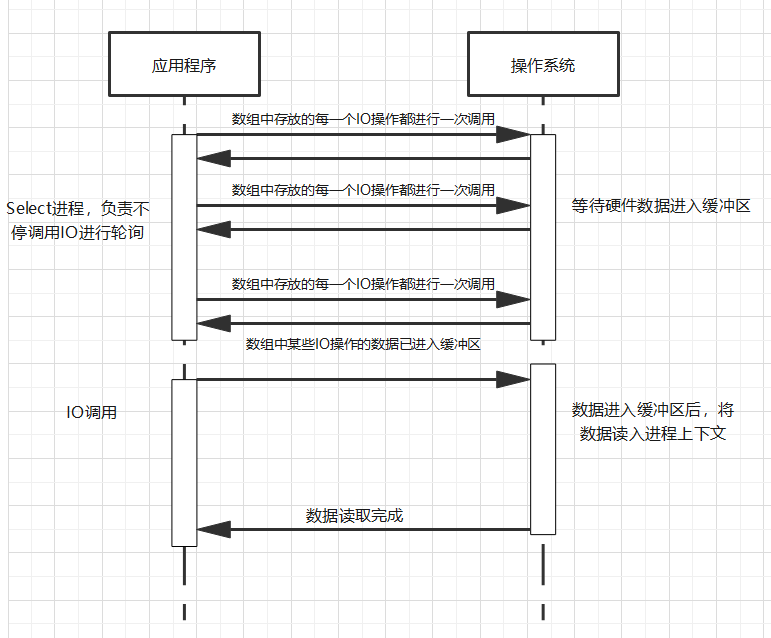
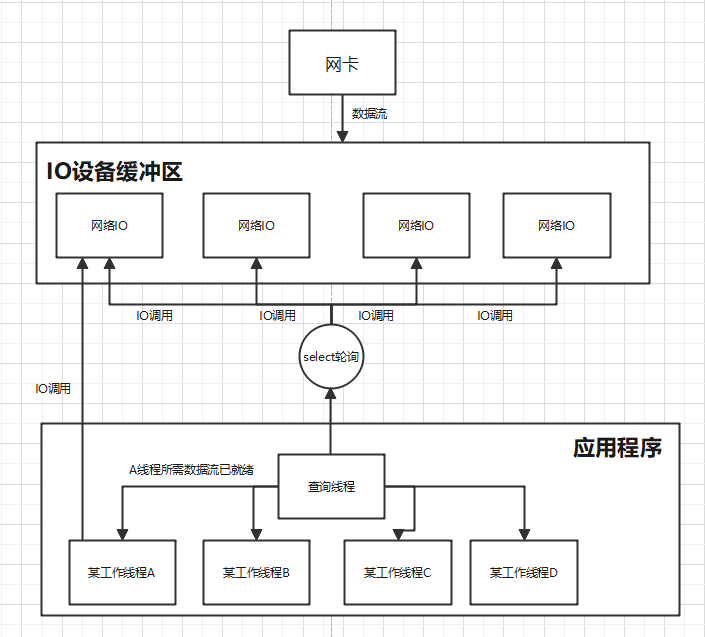
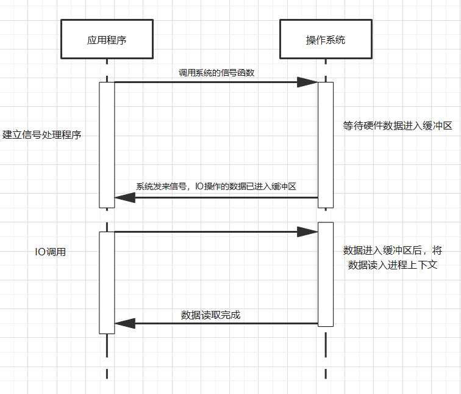
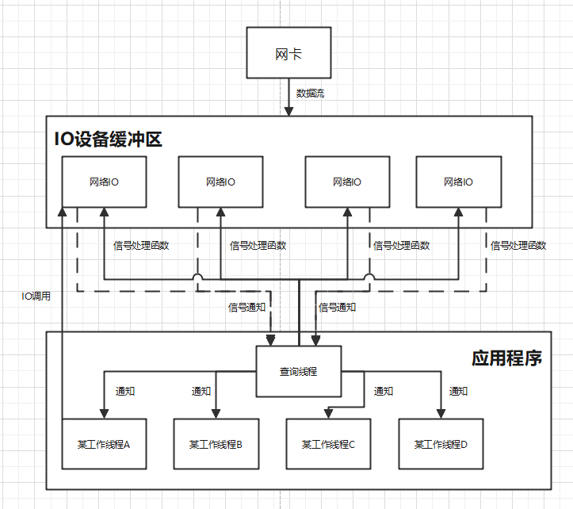
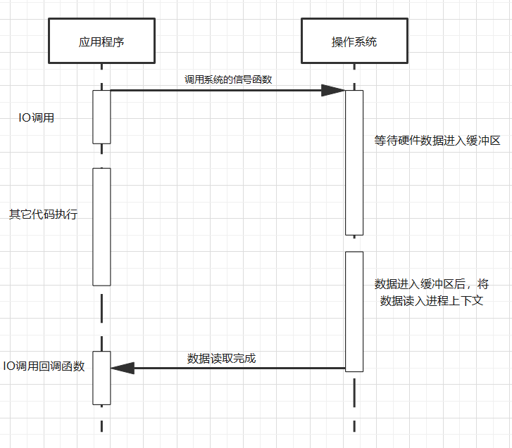
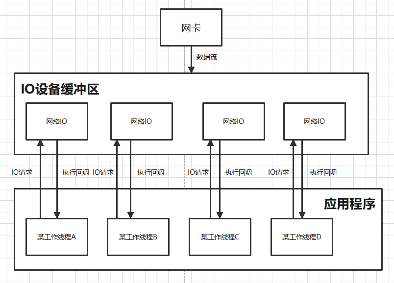

>### 注意：
>1. 下面内容参考<<UNIX网络编程>>。
>
>
>2. 前四种是同步IO，最后一种是异步IO。异步IO是理想情况，通常会采用前四种方案加多线程来模拟理想中的异步IO。
>
>
>3. IO可以包括硬件IO，内存IO，网络IO。下面画图讨论的都是非内存IO，都是外部设备的数据在进入总线前需要进入缓冲区的情况。**图示是调用读取操作。**

# 1.阻塞IO
> 使用阻塞IO即进程发起一个IO请求，操作系统需要先等待数据进入缓冲区，数据全部就绪后进入总线，高速复制到进程执行上下文环境中。在操作系统执行相关操作时该进程被完全阻塞，不能进行其它任何操作。
> 

# 2.非阻塞IO
> 使用非阻塞IO即进程发起一个IO请求，在操作系统获取硬件数据到拷贝到进程上下文这段时间内进程还可以执行其它任务。但是在等待数据进入缓冲区的过程中必须要不断重新调用IO读取数据请求，如果数据未就绪就会返回一个错误码，如果数据就绪那么就会进入下一个阶段，将数据拷贝到进程中。**虽然进程可以执行操作了，但实际上得不断重新调用IO，还是意义不大。**
> 

# 3.复用IO
>1. 使用复用IO即多个进程发起多个IO请求或一个进程发起多个IO请求，这么多请求都交给一个查询线程，然后该线程需要一个轮询进程/线程，这个轮询进程/线程执行的工作就是2中提到的阻塞IO操作。这个轮询进程/线程把这么多IO请求保存到数组中，不停遍历数组进行IO调用，一旦有哪一个IO请求的数据准备完毕了，那么就会通知查询线程告知对应的线程，该线程会发送一个IO调用请求，这时候缓冲区数据就会拷贝到对应的线程中去。
>
> 
>2. **(多种策略)** 复用IO有多重策略。**(1)** 下图所示的select策略是把请求保存到数组中(网络编程一般由静态语言实现，这个数组的大小不是动态的)，处理IO数量受到数组大小影响。**(2)** poll策略是把数组换成链表，这样解决了长度限制问题，但是大量的IO操作需要不断遍历链表是一个大开销任务。**(3)** epoll策略是把IO操作放入红黑树中，策略也不是轮询，而是直接进行休眠，一旦有数据就绪就会通知epoll，这是一种高效的事件机制。

# 4.信号驱动IO
> 使用信号驱动IO即多个进程发起多个IO请求或一个进程发起多个IO请求，这么多请求都交给一个查询线程，然后查询线程会建立信号处理程序，这是对复用IO的优化，这个信号处理程序利用底层的信号机制，当数据完全就绪时会有信号通过总线通知CPU，这样不需要进行轮询。也就是数据就绪时就绪信号通过查询线程发送给调用IO操作的线程/进程，这样它们就可以再发出IO调用请求，让系统把数据读入线程/进程上下文环境即可。
> 

# 5.异步IO
>1. 使用异步IO即一个进程发起一个IO请求，此时该进程可以继续执行其它任务，等IO操作结束后会自动执行IO操作的回调函数。这个好处是不会阻塞进程中的其它任务，也不像前面的信号驱动IO需要进程再次发送一个IO调用请求。
>
>
>2. **(缺点)** **(1)** 遗憾的是这只是一种理想情况，前四种同步IO都是可以通过图示思路实现。异步IO可以使用信号驱动IO思路实现，但是并不是所有操作系统都有完善支持。异步IO通常是采用线城池来实现多线程，在线程池分配的线程中中可以使用不同的IO策略，比如IO复用，非阻塞IO等等。**(2)** 异步IO并不是在每种情况下都是像下图看起来这么简洁高效。如果使用异步IO去读写机械硬盘上的数据，在同一个进程中发起多个异步IO操作去读写同一个硬盘上的数据。此时为了模拟异步IO通常使用多线程，这样CPU要不断切换线程，每次读取每个操作的一部分，机械硬盘的柱头必须不断换道，更换起始位置，这样的情况下可能还不如IO复用或者阻塞IO高效。
>2. **(优点)**  适合处理IO密集型任务，Nginx是单线程异步IO，即使用线程池和同步IO模拟，线程池分配的一个线程可以处理多个IO操作。Apache采用多线程IO，多线程操作要求每个IO操作都要开一个新的线程比较花费时间。多线程下的IO并发量没有单线程异步IO高，异步IO一个线程可以处理多个IO操作，nodejs在linux下采用线城池+epoll模拟异步IO，这样不需要大量线程的上下文切换，而多线程IO受限于最大线程数量，并发效果并不高。

