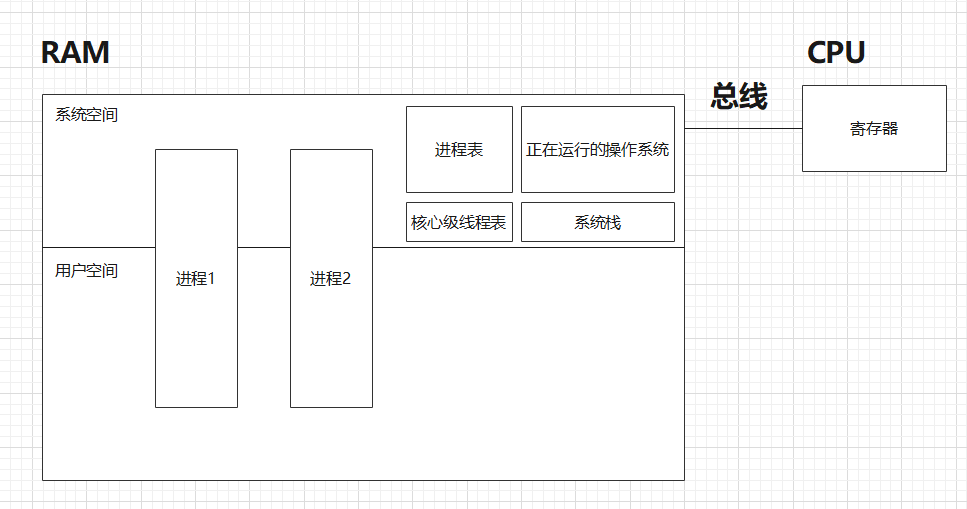
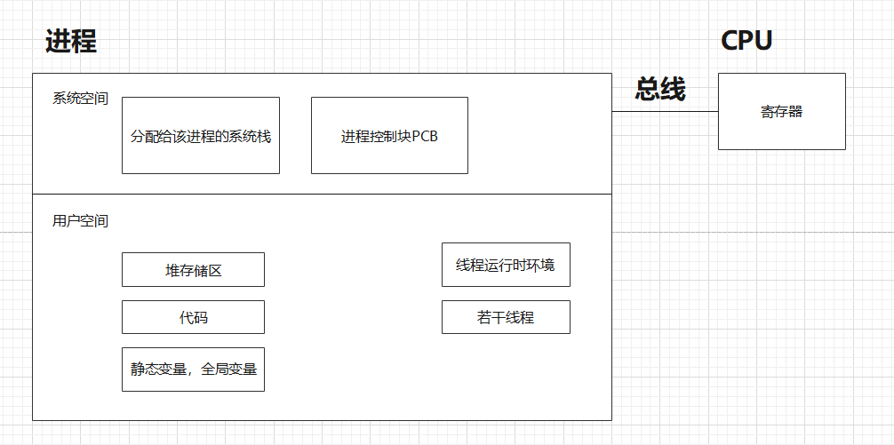
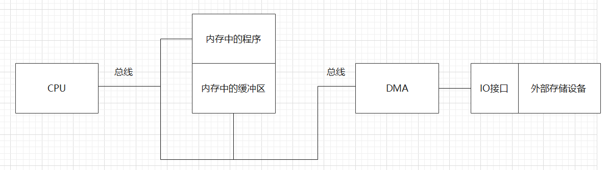
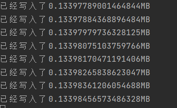
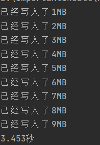

# 1.进程

### 1.1 进程的概念

> 进程是程序关于数据集的一次运行活动

### 1.2 进程的状态转换


### 1.3 进程的组成

#### 1.3.1 进程在存储空间中的存在情况



#### 1.3.2 进程内部的组成情况



#### 1.3.3 进程的组成

> 进程由“程序+进程控制块”组成。也可以说进程由“代码，数据（进程映像）+进程控制块”组成。


#### 1.3.4 进程控制块

进程控制块是进程的一部分，是进程存在的唯一标志。

进程控制块用来记录管理进程信息


# 2. IO操作

### 2.1 IO操作的实现方式

#### 2.1.1 宏观角度的实现方式

在《计算机组成原理》中介绍了以下几种IO方式：

1. **程序实现** ：

   * **程序查询** ：此时操作系统需要进行IO操作，CPU需要不断查询外部设备的IO接口是否已经就绪，如果就绪则开始读写。数据需要通过总线以及CPU在内存和外设之间传递。
   * **程序中断** ：此时操作系统需要进行IO操作，CPU先通知外部设备需要进行IO，外部设备开始准备数据让数据到达外部设备的IO接口，这个时间内CPU去执行其它任务。当数据准备完成后外部设备的IO接口发来一个中断请求，CPU中断当前进程，来进行IO读写。数据需要通过总线以及CPU在内存和外设之间传递。

2. **硬件实现** ：

   * **DMA通道** ：此时操作系统需要进行IO操作，CPU通知外部设备需要进行IO即可，CPU转去执行其它任务。DMA通道可以直接在外部设备和内存之间交换数据，之前的经过“CPU和总线”的过程变成了只经过“总线”的过程。如果DMA通道和CPU需要同时使用总线，那么CPU会暂时让出总线。

   * **通道/IOP** ：此时操作系统需要进行IO操作，CPU通知外部设备需要进行IO即可，CPU转去执行其它任务。通道是DMA的升级，是一个简化版的CPU，执行类似于DMA通道的操作。

     

#### 2.1.2 微观角度的实现方式

在《Unix网络编程》中提到了5种IO方式：

​	

#### 2.1.3 IO操作的主流实现方式


### 2.2 IO操作的准备工作

#### 2.2.1 IO操作前的状态切换

在《操作系统》中提到了进程需要进行IO操作的前提：

1. **管态** ：操作系统运行时所处的状态。能够执行一些特权指令，例如访问任意内存，执行IO操作。

2. **目态** ：一般用户程序运行时所处的状态。执行的指令受限制，例如不能随意访问程序外的内存。

3. **目态与管态的切换** ：目态到管态的切换必须使用程序中断，管态到目态的切换可以直接使用特权指令。

因此如果用户程序中希望进行IO操作，就必须进行程序中断，暂停当前进程的执行，转到操作系统运行状态，再进行IO操作。


### 2.3 IO操作中的缓冲区

#### 2.3.1 缓冲区在IO操作中的应用

**IO读操作**

带有缓冲区的IO读操作指的是外部设备的数据通过外部设备的IO接口传送到总线上，然后通过DMA通道存入内存中的缓冲区。等到某一个时刻CPU再从缓冲区取出数据，经过CPU传送给需要使用的程序。

**IO写操作**

带有缓冲区的IO写操作指的是内存中的数据通过总线进入CPU，然后CPU将数据存入内存中的缓冲区。等到某一个时刻CPU再从缓冲区取出数据，经过CPU传送给需要使用的外部存储设备。

**IO过程中涉及到的存储设备**




#### 2.3.2 缓冲区的优势

**不使用缓冲区进行写操作：**

```javascript
let fs = require("fs")

// 计划写入文件的大小，大小为10MB
const size = 10 * 1024 * 1024
fs.writeFile("test.txt", "", "utf-8", function() {})
fs.open("test.txt", "w", async function(err, fd) {
    for(let i = 0; i < size; i ++) {
        // fs.write是异步操作，这里使用promise进行等待
        await new Promise((res, rej) => {
            // 每一轮循环都进行一次完整IO操作写入1个字节
            fs.write(fd, "1", i, function (err) {
                if (err) {
                    console.log(err)
                    rej()
                } else {
                    console.log(`已经写入了${i / 1024 / 1024}MB`)
                    res()
                }
            })
        })
    }
})
```

以下是写的过程，实际用时就不展示了，写了几分钟才能写1MB。在这个过程中总共需要进行10\*1024\*1024次完整的写操作。由于每次都需要程序中断，并还原，这是一个非常耗时的操作。




**使用缓冲区进行写操作：**

```javascript
let fs = require("fs")

// 记录程序起始时间
let start = Date.now()

// 计划写入文件的大小，大小为10MB
const size = 10 * 1024 * 1024
// 设置缓冲区大小为1024字节
const bufLength = 1024 * 1024
// 写操作缓冲区大小
let writeBuffer = Buffer.allocUnsafe(bufLength);

// 通过写操作强制创建一个新的test.txt文件
fs.writeFile("test.txt", "", "utf-8", function() {})

// 打开test.txt文件，操作权限只能是写
fs.open("test.txt", "w", async function(err, fd) {
    for(let i = 0; i < size; i ++) {
        // fs.write是异步操作，这里使用promise进行等待
        await new Promise((res, rej) => {
            // 当缓冲区不满时，写入缓冲区
            writeBuffer.write("1", i % bufLength);
            // 当缓冲区满时，进行一次完整的IO操作
            if(i && !(i % bufLength))
                // 从缓冲区的0偏移位置，取bufLength的长度写入fd文件符描述的文件
                fs.write(fd, writeBuffer, 0, bufLength, function(err) {
                    if (err) {
                        console.log(err)
                        rej()
                    } else {
                        console.log(`已经写入了${i / 1024 / 1024}MB`)
                        res()
                    }
                })
            else
                res()
        })
    }

    // 记录终止时间
    let end = Date.now()
    console.log((end - start) / 1000 + "秒")
})
```

以下是写的过程，每次都写入1MB，因为缓冲区的大小是1MB。在这个过程中总共进行了10次完整的写入操作。



**缓冲区优势总结：**

**在需要对某个文件多次写入时或多次读入时，缓冲区减少了IO操作次数，提升了程序的效率。**在写入时如果你有能力一次性写入，你可以不使用缓冲区。在读取的时候，文件中的数据往往是有规律的，比如按行读取，这样我们就必须多次读取，使用缓冲区就可以有效减少IO操作。
