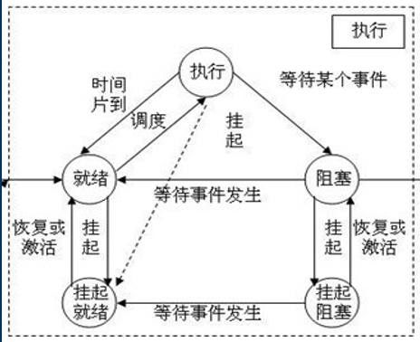
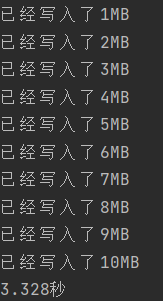

>参考：
>
>《计算机组成原理》白中英
>
>《操作系统》左万历
>
>《计算机网络》谢希仁
>
>《Unix网络编程》W. Richard Stevens
>
>《深入浅出Nodejs》朴灵
>
>《JavaScript权威指南（第七版）》David Flanagan
>
>https://mp.weixin.qq.com/s/YdIdoZ_yusVWza1PU7lWaw IO多路复用
>
>http://c.biancheng.net/view/1220.html 多线程模型
>
>https://zhuanlan.zhihu.com/p/23488863 Java NIO


# 1.进程

### 1.1 进程的概念

> 进程是程序关于数据集的一次运行活动

### 1.2 进程的状态转换

也可以考虑成七个状态，在就绪前加上“创建”状态。在执行时加上“销毁”状态。

挂起状态时将进程转移到外存中，因为内存资源十分宝贵。



### 1.3 进程的组成

#### 1.3.1 进程在存储空间中的存在情况


#### 1.3.2 进程内部的组成情况


#### 1.3.3 进程的组成

> 进程由“程序+进程控制块”组成。也可以说进程由“代码，数据（进程映像）+进程控制块”组成。


#### 1.3.4 进程控制块

> 进程控制块是进程的一部分，是进程存在的唯一标志。
>
> 进程控制块用来记录管理进程信息的数据结构。


### 1.4 进程的调度

**概念：**

> 进程和核心级线程是操作系统资源分配的最小单位。操作系统最多只能切换进程和核心级线程。

**状态与调度：**

依据1.2的状态转换图可知，当一个进程处于运行状态时，可以转换到就绪态或者阻塞态。

如果转换到就绪态表明，进程执行的时间片到了，需要切换下一个进程使用CPU资源。

如果转换到阻塞态表明，进程进行某种行为被阻塞了，通常是系统调用下的IO操作，需要切换下一个进程使用CPU资源。

**调度时操作系统的行为：**

进程切换时会进行程序中断，操作系统进入管态（见3.1），操作系统记录当前进程的进程控制块PCB信息以及CPU寄存器信息，然后操作系统分配系统栈给另一个进程，操作系统进入目态，另一个进程进入运行状态开始运行。


# 2.线程

### 2.1 线程的概念

> 线程是轻进程，是进程中一个独立的执行流

线程分为用户级线程和核心级线程，用户级线程由用户创建，存在于内存用户空间的某个进程之中。核心级线程用户无法直接创建，核心级线程存在于内存的系统空间中。


### 2.2 线程的组成

（注：下面只考虑是用户级线程）

线程存在在进程之中，一个进程中的线程只能使用该进程的系统栈，只能使用操作系统给该进程分配的CPU资源。进程中的“线程运行时环境”指的是线程运行的一些必要内容，例如控制线程切换的功能，线程控制块TCB等等。在Java中线程运行时环境实际就是JRE，在C++中是CLE。


### 2.3 线程的调度

**概念：**

> 用户级线程是CPU的调度单位。用户级线程不能被操作系统调度，只能被进程调度。

线程的调度只能由该线程属于的进程完成，具体由进程中的线程控制块TCB来配合完成。如果线程被阻塞，那么这个进程以及进程中的其它线程也会被阻塞。（实际上目前的操作系统并不是这样实现，详情可参考3.4中的内容）

**调度时操作系统的行为：**

线程调度时操作系统没有特殊行为，即不会发生程序中断。操作系统只是知道进程在运行状态。只有进程本身会发生特殊行为，进程中的线程运行时环境来控制线程的切换。


# 3. IO操作

| IO操作目录                   |
| ---------------------------- |
| 3.1 IO操作前的准备工作       |
| 3.2 IO操作中的缓冲区         |
| 3.3 IO操作的实现方式         |
| 3.4 不同IO操作在开发中的使用 |
| 3.5 IO操作的总结             |

### 3.1 IO操作的准备工作

#### 3.1.1 IO操作前的状态切换

在《操作系统》中提到了进程需要进行IO操作的前提：

1. **管态** ：操作系统运行时所处的状态。能够执行一些特权指令，例如访问任意内存，执行IO操作。

2. **目态** ：一般用户程序运行时所处的状态。执行的指令受限制，例如不能随意访问程序外的内存。

3. **目态与管态的切换** ：目态到管态的切换必须使用程序中断，管态到目态的切换可以直接使用特权指令。

因此如果用户程序中希望进行IO操作，就必须进行程序中断，暂停当前进程的执行，转到操作系统运行状态，再进行IO操作。


### 3.2 IO操作中的缓冲区

#### 3.2.1 缓冲区在IO操作中的应用

注：具体名词会在下文解释

**IO读操作**

真正的IO读操作：外部设备的数据经过总线进入RAM中系统空间的系统缓冲区。

用户看到的假IO操作：用户调用IO接口函数，从系统缓冲区读取数据读到自己的缓冲区或某个变量中

**IO写操作**

真正的IO写操作：RAM中系统空间的系统缓冲区中的数据经过总线进入外部设备。

用户看到的假IO操作：用户调用IO接口函数，把自己的某个变量或者自己的缓冲区写入系统缓冲区。

**实际IO过程**

用户调用IO接口函数后会询问内核缓冲区是否有目标数据，如果没有内核缓冲区在外部设备准备好后接收IO接口传来的数据，内核缓冲区读取外部设备的数据的过程是IO过程。


用户调用IO接口函数，触发程序中断，进入操作系统的管态。此时在管态下，用户进程可以读取不属于自己的存储空间的数据，此时请求内核缓冲区的数据，如果有数据则读取，如果没有数据则可能阻塞，这样的情况会在下文的阻塞非阻塞实现IO中讨论。之后程序恢复原有状态。主要的耗时操作是源于程序中断和恢复。


#### 3.2.2 缓冲区的优势

**不使用缓冲区进行写操作：**

```javascript
let fs = require("fs")

// 计划写入文件的大小，大小为10MB
const size = 10 * 1024 * 1024
fs.writeFile("test.txt", "", "utf-8", function() {})
fs.open("test.txt", "w", async function(err, fd) {
    for(let i = 0; i < size; i ++) {
        // fs.write是异步操作，这里使用promise进行等待
        await new Promise((res, rej) => {
            // 每一轮循环都进行一次完整IO操作写入1个字节
            fs.write(fd, "1", i, function (err) {
                if (err) {
                    console.log(err)
                    rej()
                } else {
                    console.log(`已经写入了${i / 1024 / 1024}MB`)
                    res()
                }
            })
        })
    }
})
```

以下是写的过程，实际用时就不展示了，写了几分钟才能写1MB。在这个过程中总共需要进行10\*1024\*1024次完整的写操作。由于每次都需要程序中断，并还原，这是一个非常耗时的操作。


**使用缓冲区进行写操作：**

```javascript
let fs = require("fs")

// 记录程序起始时间
let start = Date.now()

// 计划写入文件的大小，大小为10MB
const size = 10 * 1024 * 1024
// 设置缓冲区大小为1024字节
const bufLength = 1024 * 1024
// 写操作缓冲区大小
let writeBuffer = Buffer.allocUnsafe(bufLength);

// 通过写操作强制创建一个新的test.txt文件
fs.writeFile("test.txt", "", "utf-8", function() {})

// 打开test.txt文件，操作权限只能是写
fs.open("test.txt", "w", async function(err, fd) {
    for(let i = 0; i < size + 1; i ++) {
        // fs.write是异步操作，这里使用promise进行等待
        await new Promise((res, rej) => {
            // 当缓冲区不满时，写入缓冲区
            writeBuffer.write("1", i % bufLength);
            // 当缓冲区满时，进行一次完整的IO操作
            if(i && !(i % bufLength))
                // 从缓冲区的0偏移位置，取bufLength的长度写入fd文件符描述的文件
                fs.write(fd, writeBuffer, 0, bufLength, function(err) {
                    if (err) {
                        console.log(err)
                        rej()
                    } else {
                        console.log(`已经写入了${i / 1024 / 1024}MB`)
                        res()
                    }
                })
            else
                res()
        })
    }

    // 记录终止时间
    let end = Date.now()
    console.log((end - start) / 1000 + "秒")
})
```

以下是写的过程，每次都写入1MB，因为缓冲区的大小是1MB。在这个过程中总共进行了10次完整的写入操作。



**缓冲区优势总结：**

**在需要对某个文件多次写入时或多次读入时，缓冲区减少了IO操作次数，提升了程序的效率。**在写入时如果你有能力一次性写入，你可以不使用缓冲区。在读取的时候，文件中的数据往往是有规律的，比如按行读取，这样我们就必须多次读取，使用缓冲区就可以有效减少IO操作。（注：使用流IO操作时默认使用缓冲区）


#### 3.2.3 内核缓冲区和用户缓冲区

上文演示的都是用户缓冲区，都是用户可以在内存用户空间自定义创建的缓存区。实际上在内存的系统空间也存在一片专门用于缓冲的缓冲区叫内核缓冲区。

**内核缓冲区与用户缓冲区的关系：**

写操作：

	* 用户使用缓冲时是 “用户调用IO接口函数，程序中断，用户缓冲区的数据写入内核缓冲区“ 
	* 用户不使用缓冲时是 ”用户调用IO接口函数，程序中断，进程中的数据写入内核缓冲区“

读操作：

 * 用户使用缓冲时是 “用户调用IO接口函数，程序中断，内核缓冲区的数据读入用户缓冲区“ 
 * 用户不使用缓冲时是 ”用户调用IO接口函数，程序中断，内核缓冲区中的数据读入进程“

 <u>所以用户调用这些IO接口函数主要的耗时操作来源于程序中断和恢复</u>

**内核缓冲区对IO操作的优化：**

内核缓冲区是在操作系统级别对IO操作的优化。比如你看似在程序层面调用多次IO操作的API，例如调用10次write接口函数，但是实际上操作系统可能是等待内核缓冲区满后才进行IO操作，实际只执行了2次写入外部存储设备的IO操作。

**内核缓冲区造成的数据丢失：**

在上述实验中测试只是在每次write成功后显示当前写入了多少字节，但是实际上这与实际情况不符（例如上文中的实验结果），这只是描述向内核缓冲区写入了多少字符。有些时候会发现write函数的回调函数已经显示写入了n个字节，但是此时电源切断，重新启动计算机时发现文件实际少于n个字节，这就是内核缓冲区接收到了数据但是还没有进行IO操作。实际上这方面是对用户不可见的，如果想要优化自己程序反复进行IO操作效率，那么还是应该多在用户缓冲区上下功夫。

**内核缓冲区实例：**

未提到但需要用到的内容：单缓冲不允许同时读写缓冲区，即不能在写入系统缓冲区的时候，同时读取系统缓冲区


内核缓冲区就是指题中的系统缓冲区。在上文已经提到，系统缓冲区什么时候进行真正的IO操作是不确定，如果考虑最短时间，那么就是系统缓冲区立即从外设读入一个数据块，花费100单位时间。此时可以是再读入一个数据块进入缓冲区，也可以是正好用户调用IO接口函数，将数据块读入工作区。假设是用户调用IO接口函数，读入数据，那么消耗5单位时间，由于是单缓冲，所以这5单位时间不能读入另一个数据块到系统缓冲区。此时再读入下一个数据块到缓冲区，花费100单位时间，这个是对用户不可见的，用户于此同时花费90单位时间分析完了第一个数据块，此时已经过去了205单位时间。之后用户正好调用IO接口函数，将缓冲区数据读入并分析，花费95单位时间。总共花费300单位时间。选C。（其它方案都不是最优的，在此不再列举，过于耗费篇幅）


### 3.3 IO操作的实现方式

#### 3.3.1 从程序和硬件讨论IO实现

在《计算机组成原理》中介绍了以下几种IO方式：

1. **程序实现** ：

   * **程序查询** ：此时操作系统需要进行IO操作，CPU需要不断查询外部设备的IO接口是否已经就绪，如果就绪则开始读写。数据需要通过总线以及CPU在内存和外设之间传递。
   * **程序中断** ：此时操作系统需要进行IO操作，CPU先通知外部设备需要进行IO，外部设备开始准备数据让数据到达外部设备的IO接口，这个时间内CPU去执行其它任务。当数据准备完成后外部设备的IO接口发来一个中断请求，CPU中断当前进程，来进行IO读写。数据需要通过总线以及CPU在内存和外设之间传递。

2. **硬件实现** ：

   * **DMA通道** ：此时操作系统需要进行IO操作，CPU通知外部设备需要进行IO即可，CPU转去执行其它任务。DMA通道可以直接在外部设备和内存之间交换数据，之前的经过“CPU和总线”的过程变成了只经过“总线”的过程。如果DMA通道和CPU需要同时使用总线，那么CPU会暂时让出总线。

   * **通道/IOP** ：此时操作系统需要进行IO操作，CPU通知外部设备需要进行IO即可，CPU转去执行其它任务。通道是DMA的升级，是一个简化版的CPU，执行类似于DMA通道的操作。

     

#### 3.3.2 从阻塞和非阻塞讨论IO实现

在《Unix网络编程》中提到了5种IO方式：

```c++
// recvfrom函数需要的头文件
#include <winsock.h>

// recvfrom函数的参数的描述
int recvfrom(SOCKET s, char FAR* buf, int len, int flags, struct sockaddr FAR* from, int FAR* fromlen);

/*
recvfrom函数用于从某个套接字接收数据，存储到当前进程创建的缓冲区中
s表示套接字
buf表示希望用于接收数据的进程中的缓冲区
len表示缓冲区长度
后面的参数可以不用深究
*/
```

> 注：这里并不清楚内核缓冲区进入用户空间是否经过CPU，因为有DMA可以技术支持内存单元间访问，暂时没有在网上找到相关解释。本人暂且理解为会程序中断，进入管态，将数据写入对应的用户空间。

**1.同步阻塞IO：**

* （程序中断）进程A调用recvfrom函数相当于调用了IO接口函数，程序中断，进入管态，此时进程A向内核缓冲区询问是否有需要的数据。

* （进程状态改变）进程A发现没有数据，内核缓冲区需要读取数据。在内核缓冲区读取数据的过程中，进程A由运行状态转变为阻塞状态或挂起阻塞状态。

* （进程切换）此时操作系统切换到另一个处于就绪状态或者挂起就绪状态的进程B来执行，并进入目态。

* （程序中断）当数据报（这是网络编程IO模型，所以是数据报）准备好时，程序中断，进入管态，数据报从内核缓冲区进入用户空间，完成后回到目态，据需执行进程B。用户空间可以是用户缓冲区，也可以是某个用于存储的变量。 

* （进程状态改变）之后进程A从阻塞状态或者挂起阻塞状态进入就绪状态或挂起就绪状态。


**2.同步非阻塞IO：**

* （程序中断）进程A调用recvfrom函数相当于调用了IO接口函数，程序中断，进入管态，此时进程A向内核缓冲区询问是否有需要的数据。
* （进程状态不变）进程A发现没有数据，内核缓冲区需要读取数据。此时操作系统返回一个EWOULDBLOCK标志，管态结束，操作系统通过改变程序状态字进入目态，继续执行进程A。此时进程A仍处于运行状态。
* （反复程序中断）进程A在操作系统返回数据阻塞标志后，仍然不停调用recvfrom函数，每次都是一个系统调用，都会进行程序中断与恢复。
* （进程切换）进程A一直处于运行状态，在这个过程中可能会有正常的进程切换操作，进程A将会在不同的CPU时间片进行执行。
* （最后一次程序中断）当内核缓冲区的数据准备好后，进程A再次调用recvfrom函数时，先程序中断进入管态。内核缓冲区的数据经过CPU传送到用户空间，之后管态结束进入目态，进程A可以根据数据进一步操作。


**3.IO多路复用：**

IO多路复用是同步阻塞IO，需要等待数据读入内核缓冲区。

```c++
#include <sys/select.h>
#include <sys/time.h>
#include <sys/types.h>
#include <unistd.h>

// select函数
 int select(int nfds, fd_set *readfds, fd_set *writefds, fd_set *exceptfds, struct timeval *timeout);

/*
select函数接收多个个文件描述符集合，开始监听的文件描述符下标，以及一个阻塞时间。
nfds表示开始监听的文件描述符下标
writefds表示用于写的文件的文件描述符集合
readfds表示用于读的文件的文件描述符集合
exceptfds表示用于异常处理的文件描述符集合
timeout表示select阻塞时间，如果超过这个时间select仍然阻塞，那么就立即返回
*/
```

* （需要进行IO操作的文件加入集合）在一个线程或进程中需要多个IO操作时不妨可以选用多路复用IO。此时需要现将需要进行IO操作的文件的文件描述符加入到对应的文件描述符集合中。
* （select阻塞）获取文件描述符集合后调用select函数，select函数会在当前线程或进程造成阻塞，它会遍历这些文件描述符，对于每个文件描述符，select都会进行一次系统调用，询问系统缓冲区是否有数据。当select询问完所有文件描述符并且内核缓冲区没有可用数据时，select函数不会返回任何值，当前线程或进程变成阻塞或挂起阻塞状态。
* （进程切换）当前进程A受阻于select函数，状态已经不是运行态，此时操作系统会调度就绪态或挂起就绪态的进程B来执行，避免浪费CPU。
* （进程状态改变）当select查询的文件描述符当中任何一个的数据到达内核缓冲区时，会以某种形式通知select（在此不讨论），select函数结束阻塞状态，返回一个可读条件。此时进程A由阻塞态变为就绪态或挂起就绪态。
* （程序中断）当进程A处于下一个属于自己的CPU时间片时，此时进程A调用recvfrom函数，程序中断，进入管态将数据从内核缓冲区读入进程A的用户空间。此时进程A进入阻塞状态（其实这个时间也可以忽略，内核缓冲区经过CPU写入用户空间的时间非常短）。
* （进程切换）在进程A阻塞时操作系统会调用其它进程来使用CPU资源。
* （进程状态改变）在数据都读入用户空间后，进程A处于就绪态。在下一次执行时间片进程A会进一步执行。


**4.信号驱动IO：**

由图可知信号驱动IO是异步阻塞IO，不需要等待IO的过程，但是从内核读取数据受到阻塞。在等待数据阶段不需要进程反复调用recvfrom函数进行轮询，这样提高了效率。下图提到数据复制到应用缓冲区期间进程阻塞，这相当于从内核缓冲区复制到用户空间的缓冲区，这样的时间相比外部设备到内核缓冲区的时间要短不少，例如2.2.3中的例题。

* （在套接字中安装信号处理函数）当希望从某个套接字读取数据时，先在该套接字中建立信号处理程序，这个信号处理程序只有在收到SIGIO信号时才会执行。在建立信号处理程序时，把recvfrom操作写到信号处理程序中。
* （程序中断）当收到SIGIO信号时，信号处理程序执行，其中调用recvfrom函数。之后程序中断，进入管态，读取内核缓冲区的数据。
* （进程状态改变）在读取数据时进程进入阻塞状态，虽然上文提到这个时间很短，但是进程仍然会阻塞，进入阻塞态。
* （进程切换）在进程阻塞期间操作系统会调度其它进程来使用CPU资源。
* （进程状态改变）当所有数据进入用户空间后，进程变成就绪态。当下一个属于自己的CPU时间片到达时，就可以进行进一步操作。


**5.异步IO：**

异步IO从图上看很像信号驱动IO，但是实际差别很大，异步IO指异步非阻塞IO。异步IO不需要建立信号处理程序，再把IO接口函数放进去。异步IO只需要调用IO接口函数，在里面加入数据处理函数即可，并且不存在任何阻塞。

* （程序中断）进程A调用IO接口函数aio_read，操作系统进入管态询问内核缓冲区有无所需数据，此时没有，操作系统立即结束管态，进入目态，进程A继续执行。
* （进程切换）进程A执行时处于运行态，此时可能会发生正常的进程切换。
* （读取数据）当内核缓冲区数据准备好时，数据读入进程A用户空间。

<u>异步IO的实现问题：</u>

操作系统对异步IO的支持并不是很好，下图中表示IO操作没有任何阻塞的环节。实际上在操作系统层面设计这样一个aio_read接口函数并非易事。实际在实现时可能是专门设置一个网络IO进程，在网络IO进程下实现IO多路复用，当其它进程需要网络IO时，将操作托管给网络IO进程即可，网络IO进程经历了两个阻塞环节（上文已分析）后将数据写入对应进程的用户空间。这样看起来对应进程没有发生任何阻塞，实际上阻塞都是交给了网络进程这个倒霉蛋。


### 3.4 不同IO操作在开发中的使用

#### 3.4.1 多线程模型

**引入：**

在《操作系统》左万历版本中有一句话<u>“调度在进程级别进行，若某进程中的一个线程通过系统调用进入OS受阻，则该进程的其它线程也不能运行。”</u> 这就是在说线程对于操作系统是透明的，一个进程下如果开多线程进行不同的IO操作，IO操作选用同步阻塞IO，看似如果一个线程阻塞了，那么就接着执行下一个线程，实际上并非如此，这是一个串行的工作模式。当某一个线程因为IO被阻塞时，整个进程都进入阻塞状态，该进程无法再进行该进程下的线程调度。

**疑问：**

那么这样就会产生疑问。同步阻塞IO虽然不是最优的IO方案，但是也在很多场合下使用，在一些java工程中，使用传统的多线程或线程池解决并发问题时，每一个线程可能会使用同步阻塞IO。<u>如果线程都使用同步阻塞IO，那么根据上文《操作系统》中的话来说，这不就是无法做到真正的并发了吗，因为线程一旦阻塞，就会造成进程的阻塞。</u>

**实际的多线程模型：**

根据博客参考，实际的多线程模型有很多。在《操作系统》中介绍较少，理解起来并不是很全面。

1. 多对一模型：进程下的多个用户级线程对应着一个核心级线程，这也就是《操作系统》中说这句话的默认情景。操作系统知道核心线程，不知到用户线程，当用户线程阻塞时会认为是核心级线程阻塞，那么操作系统会调度另一个核心级线程执行。

   

2. 一对一模型：进程下的每个用户级线程对应着属于自己的核心级线程。当一个线程被阻塞时，操作系统能够让另一个核心级线程对应的用户线程继续执行。缺点是每个用户线程都会创建一个核心级线程，未免有些浪费。


3. 多对多模型：进程下的每个用户级线程对应着多个核心级线程，每个核心级线程也对应着多个用户级线程。这个模型能完成前两个模型能完成的任务，但是实现复杂。

在网络博客中介绍，实际上Linux，Windows系统是使用一对一模型。<u>这也就意味着，当多线程/线程池下某个线程在进行IO操作时被阻塞，此时该线程对应的进程以及该进程下其它线程不会被阻塞，因为操作系统有调度某个进程下所有线程的能力。</u>


#### 3.4.2 NodeJS下的开发

**NodeJS采用异步IO：**

NodeJS采用异步IO解决了高并发问题，NodeJS只采用一个主线程工作，异步IO操作的实现实际上是交给背后的线程池处理来模拟异步IO。NodeJS更适合作为服务端处理高并发的语言，原因是NodeJS诞生以来就是在异步IO的环境（当然NodeJS肯定也会提供同步阻塞IO接口函数），这让高并发开发变得易于上手。当然Java，Python等语言也拥有异步IO接口，但是使用比NodeJS略微复杂些。


**开发基于NodeJS的应用服务器：**

在解决服务器的连接并发量时：

* 基于NodeJS编写的应用服务器程序在处理大量连接请求时是默认使用异步IO，使用异步IO来处理高并发，性能优异。

在开发应用服务器接口时（前后端接口）：

* 本地IO操作：可以直接调用NodeJS的异步IO接口，直接解决高并发问题。
* 数据库IO操作：数据库往往使用连接池，取得封装好的连接池对象，需要读写数据库时获取一条连接，读写完毕时归还该连接。
* 其它网络IO操作：可以直接调用NodeJS的网络IO接口，例如fetch，XHR（可以引入一些包，使用类似于客户端JavaScript的两种网络IO接口），request，response。这些操作也是默认使用异步IO，你并不需要关心它的并发问题。

供参考的NodeJS服务端开发框架：

* express


#### 3.4.3 Java下的开发

**Java提供多种IO接口：**

Java诞生时并没有异步IO的概念。Java能够提供三大类IO接口，BIO接口是同步阻塞IO，NIO接口是同步非阻塞IO，AIO接口是异步IO。使用这些接口比NodeJS复杂一些，但好在有不少框架可以直接使用，例如提供网络IO解决方案的SpringBoot。


**开发基于Java的应用服务器：**

在解决服务器的连接并发量时：

* 基于Java开发的应用服务器可以选择多种策略，可以使用多线程/线程池+BIO开发，也可以使用基于NIO的IO多路复用开发，也可以使用AIO做到和NodeJS一样的效果。<u>在实际使用中，例如SpringBoot框架，就是在tomcat服务器中使用了NIO解决并发问题。</u>

在开发应用服务器接口时（前后端接口）：

* 本地IO操作：这个需要根据实际情况考虑，可以设计成基于BIO，NIO或者AIO的模式，当然开发复杂程度和使用情景也不同。
* 数据库IO操作：数据库往往使用连接池，取得封装好的连接池对象，需要读写数据库时获取一条连接，读写完毕时归还该连接。
* 其它网络IO操作：这个也是需要根据情况考虑使用哪种IO接口。

供参考的Java服务端开发框架：

* SpringBoot


### 3.5 IO操作的总结

**在进行IO操作前** ，进程需要先进行程序中断，进入操作系统管态，才能进行后续操作，这也是IO操作耗时的重要原因。

**在进行IO操作时** ，是内核缓冲区与外部存储设备进行IO读写操作，用户感受到的只是用户空间与内核缓冲区的数据交换。

**在实现IO操作时** ，《计算机组成原理》从软硬件方式上分析，特殊硬件可以使外部存储设备的数据直接存入内存。《Unix网络编程》从阻塞非阻塞方式上分析，提出了同步阻塞IO，同步非阻塞IO，基于同步非阻塞思路的IO多路复用，异步阻塞的信号驱动IO，纯粹的异步IO五类模型。

**在提高IO操作效率时** ，操作系统创建了内核缓冲区，当内核缓冲区数据达到一定限度时才进行IO读写。用户可以创建用户缓冲区，将数据读入或写入缓冲区，当缓冲区满时再调用IO接口函数，减少IO读写次数。

**在开发中涉及到IO操作时** ，NodeJS处理服务器大量用户连接时采用异步IO，Java处理服务器大量用户连接时根据不同框架，采用不同IO策略，例如Spring框架采用基于NIO的IO多路复用，这是我们在开发中一般不触碰的。在考虑服务器前后端接口时，需要制定不同的IO策略，NodeJS开发可以以简单方式调用异步IO接口解决，Java开发可以使用不同IO策略，也许Java异步IO的调用生态可能不如NodeJS？
