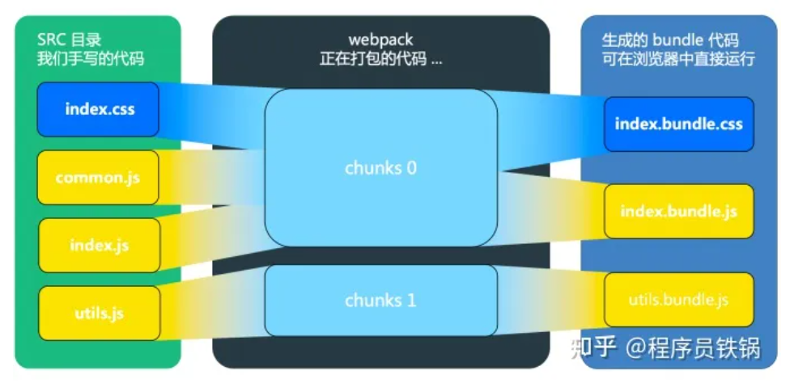
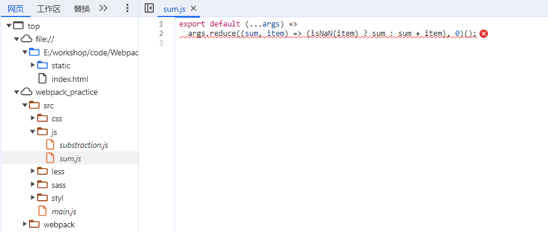
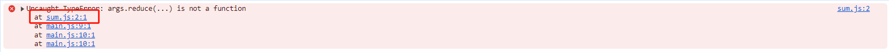
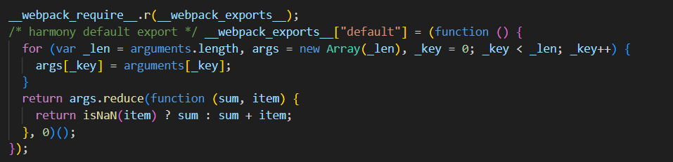
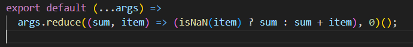
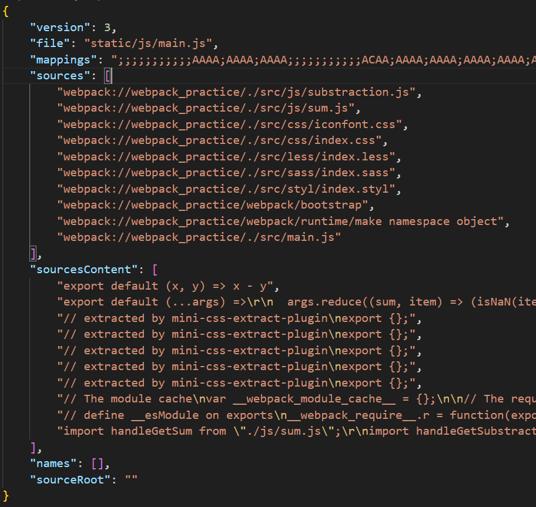
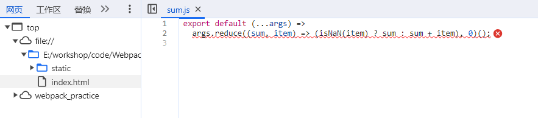
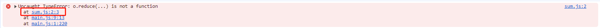
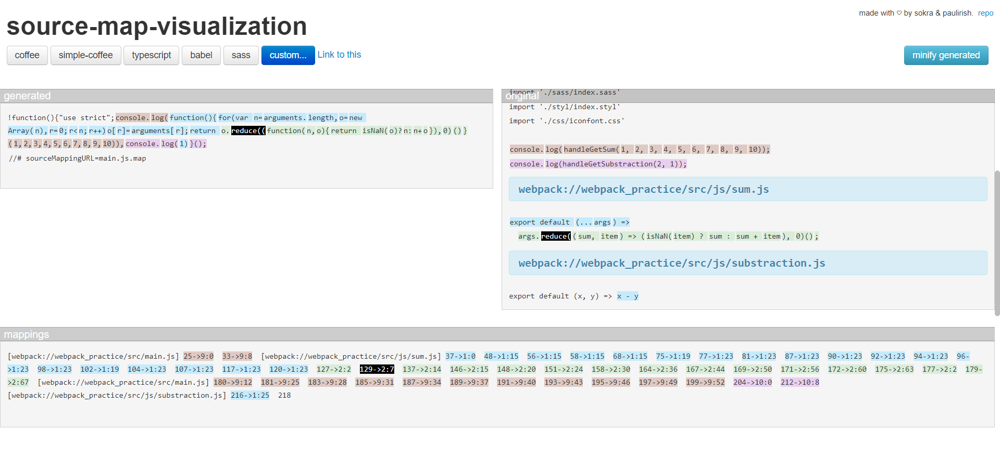

### 1.大型项目为什么需要打包

#### 1.1 使用打包工具原因

> **编译或转译文件：**
>
> * 项目中可能用到ES6语法，可能有浏览器不支持。需要打包工具将代码编译输出为ES5语法的代码。
> * 项目中可能使用Sass，Less等预处理器，浏览器本身并不支持。需要打包工具将代码编译输出为CSS代码。
> * 同编译器的特点，打包工具具有编译器可以优化代码。
>
> **处理模块：**
>
> * 大型项目可以划分为若干模块，模块的开发需要依赖规范。例如UMD，AMD，CMD，ESM规范。浏览器默认不支持除了ESM的规范，需要打包工具将项目打包成js文件，css文件后通过入口文件引入。
>
> **<font color=red>注意：编译和转译的区别？</font>**
>
> * <font color=red>编译是将高级程序语言的代码转为低级程序语言的代码，例如汇编代码，或者适合于某种虚拟机上运行的代码。转译是将高级程序语言的代码转为另一种高级程序语言的代码。严格来说babel应该称之为转译器。</font>
>
> **<font color=red>注意：webpack的能力包含编译CSS，Typescript等文件吗？</font>**
>
> * <font color=red>webpack本身功能比较局限只能编译JavaScript和Json文件，将模块进行处理。编译ES6，Sass，Less等需要webpack安装其它的loader加载器。</font>
>
> **<font color=red>注意：为什么使用ESM规范还需要打包？</font>**
>
> * <font color=red>避免频繁网络请求：</font>
>   * <font color=red>如果使用ESM规范但不打包，那么每使用一个模块都要重新请求，频繁请求会影响浏览器缓存效率，导致缓存命中率低。</font>
>   
>   * <font color=red>如果使用ESM规范但打包，那么可以把模块聚集在一个或屈指可数的几个文件中，不会让浏览器频繁请求文件</font>
>   
> * <font color=red>提升兼容性：</font>
>   * <font color=red>大部分浏览器都支持ESM规范，但是考虑可能有低版本浏览器不支持，或支持度低。</font>


### 2.包管理工具常识

#### 2.1 开发环境和生产环境

> **开发环境：** 
>
> * 项目未打包时运行的环境。
> * 依赖于开发时依赖和生产时依赖的包。
>   * 生产时依赖的包可以流向开发时依赖，可以通过集合的包含关系来理解。如果想移动生产时依赖的包到开发时依赖，直接执行 ```npm i sylvester -D``` 类似的命令即可。
> * 通常webpack配置全局变量process.env.NODE_ENV为development。
>
> **生产环境：** 
>
> * 项目打包后运行的环境。
> * 依赖于生产时依赖的包。
>   * 开发时依赖的包不能流向生产时依赖，可以通过集合的包含关系来理解。如果想移动包，那么只能删除开发时依赖的指定包，之后再在生产时依赖中重新安装。
> * 通常webpack配置全局变量process.env.NODE_ENV为production。
>
> **<font color=blue>举例：</font>**
>
> * <font color=blue>例如用于代理前缀的修改。通常为了便于做反向代理，会把所有JavaScript发起的请求的URL添加前缀做统一代理。如果不使用项目中统一封装的网络请求，例如使用window.location.href下载文件，并且生产环境下前后端都塞入tomcat，不存在跨域，那么可以通过process.env.NODE_ENV来判断环境来决定是否添加前缀。</font>

#### 2.2 包的常用指令

> **npm install/add/i/ins...**
>
> * **空：** 安装开发时依赖和生产时依赖的所有包。
>
> * **某个包：** 默认使用--save命令安装这个包。
>
> * **--save或-S + 某个包：** 安装生产时依赖，记录到package.json的dependencies中。
>   * **<font color=blue>举例：</font>** <font color=blue>react，ahooks，styled-components</font>
>   * **<font color=red>注意：</font>** <font color=red>安装包时**默认是--save指令**是为了保证项目的正常运行。如果默认安装到开发时环境或全局环境，那么如果交付远程服务器打包时，可能导致缺少必要的包。</font>
> * **--save-dev或-D + 某个包：** 安装开发时依赖，记录到package.json的devDependencies中。
>   * **<font color=blue>举例：</font>** <font color=blue>webpack，typescript，jest，eslint</font>
>   * **<font color=red>注意：</font>** <font color=red>生产时依赖和开发时依赖不存在交集，因此无法同时将某个包安装到两个环境中，即 ```npm install sylvester -D -S``` 不会同时安装到两个环境。</font>
> * **--global或-g + 某个包：** 安装到全局环境。
>   * **<font color=red>注意：</font>** 
>     * <font color=red>项目之间的依赖最好是独立管控的，不推荐全局安装。</font>
>     * <font color=red>如果项目要使用远程服务器打包（打包后交付测试或部署上线）走自动化流程，那么远程服务器打包时找不到你在本地全局安装的包，因为你不会把它记录到package.json中</font>
> * **--no-save + 某个包：** 安装依赖。但不记录到开发时依赖和生产时依赖。
>   * **<font color=red>注意：</font>** <font color=red>这通常用于测试某个第三方依赖，并且你的同事暂时不会安装它。不过这并不是妥当的方法，因为你可能编写依赖于这个第三方依赖的代码，如果你提交代码，会导致其他人报错。推荐的方法是应该新拉一个分支，或者新建一个项目来进行测试。</font>
> * **--force或-f (+ 某个包)：** 强制安装。
> * **--production：** 只安装生产时依赖。
>   * **<font color=red>注意：</font>** 
>     * <font color=red>只是依据package.json安装生产时依赖，安装新依赖时使用该命令将被忽视。因此这个命令的表现和 ```npm update``` 的表现类似，可以用来更新依赖。</font>
>     * <font color=red>不论在什么环境下webpack打包都会依赖开发时依赖和生产时依赖，因此交付远程服务器打包时应该使用 ```npm install``` 而不是 ```npm install --production``` </font>
>     * <font color=red>目前没有只安装开发时依赖的指令，因为开发环境依赖于开发时依赖和生产时依赖，只安装开发时依赖没有任何意义。</font>
>
> **npm update ** 
>
> * **空：** 忽略开发时依赖的更新，只更新生产时的依赖。
> * 其它与安装时指令类似，如果想指定也更新开发时依赖，可以添加特殊指令。
>
> **npm uninstall/rm** 
>
> * 与安装时指令类似

#### 2.3 包版本计算器

> **版本命名规范：**
>
> ```2.3.5-beta.3``` 
>
> ```<major>.<minor>.<patch>-<prerelease_tag>.<prerelease_version>```
>
> * **major：** 大版本
> * **minor：** 小版本（可选）
> * **patch：** 补丁版本（可选）
> * **prerelease_tag：** 预发布标签（可选）
>   * **alpha：** 内测版本
>   * **beta：** 公测版本
>   * **rc：** 候选版本
>   * **pre：** 前面的三个数字类型的版本不足以标识修改时使用pre
> * **prerelease_version：** 预发布版本（可选）
>
> **版本前缀含义：**
>
> * ***：** 允许升级到任何版本。
> * **^：** 不超过左边非零数字
>   * **<font color=blue>举例：</font>** 
>     * <font color=blue>```^2.3.1``` 表示 ```2.3.1 <= version < 3.0.0``` </font>
>     * <font color=blue>```^0.3.1``` 表示 ```0.3.1 <= version < 0.4.0```</font> 
>     * <font color=blue>```^0.0.1``` 表示 ```0.0.1 <= version < 0.0.2```</font>
> * **~：** 允许补丁版本升级到任意发布的版本。
>   * **<font color=blue>举例：</font>** 
>     * <font color=blue>```~2.3.1``` 表示 ```2.3.1 <= version < 2.4.0``` </font>
>     * <font color=blue>```~2.3``` 表示 ```2.3.0 <= version < 2.4.0```</font>  
>     * <font color=blue>```~2``` 表示 ```2.0.0 <= version < 2.1.0```</font>
> * **\>,<,>=,\<=：** 按符号字面意思表示版本允许升级的范围。
>
> **模糊版本更新机制：**
>
> ```npm install``` 忽略模糊版本
>
> ```npm update``` 更新到最新模糊版本

#### 2.4 包执行者

> **npx + 包 + 包对应的指令**
>
> npx是包执行者，在项目里npx会去node_modules/.bin中寻找包的执行程序执行。例如我没有全局安装webpack，只是在项目中用npm安装，并且我想执行webpack的指令，那么我可以使用npx。
>
> **<font color=blue>举例：</font>**
>
> * <font color=blue>无webpack.config.js：```npx webpack ./src/main.js --mode=development```</font>
>
> * <font color=blue>有webpack.config.js：```npx webpack```</font>


### 3.Webpack核心配置点

#### 3.1 概述

> **entry（入口）：** 打包入口，从一个或多个入口打包。
>
> **output（输出）：** 打包文件输出位置。
>
> **loader（加载器）：** 把js和json外的其它文件转为Webpack可以识别的模块。
>
> **plugins（插件）：** 扩展webpack的功能。
>
> **devServer（服务器）：** 开发模式下运行项目并热更新。
>
> **mode（模式）：** 开发模式development和生产模式production。


#### 3.2 Output

##### 3.2.1 配置入口文件输出位置

> 1. **Node全局变量和方法：**
>
>    * **\_\_dirname：**\__dirname返回当前文件所在文件夹的绝对路径
>
>    * **\_\_filename：** __filename返回当前文件的绝对路径
>
>    * **path.resolve：** 负责解析路径。
>      * 将若干个表示相对路径的参数拼接到当前文件所在的文件夹的绝对路径上
>      * 如果有参数是绝对路径，那么忽略最后一个绝对路径前的参数
>
> ```javascript
> module.exports = {
>     output: {
>         path: path.resovle(__dirname, "dist")
>         filename: "static/js/main.js"
>     }
> }
> ```

##### 3.2.2 配置自动清空上次打包效果

> ```javascript
> module.exports = {
>     output: {
>      clean: true
>     }
> }
> ```


#### 3.3 loader

##### 3.3.1 配置样式loader

> 1. **解析顺序：** loader可以通过配置use属性进行链式调用，默认规定链表头是数组尾部，因此loader是从右向左解析。
>
> ```javascript
> module.exports = {
>     module: {
>         rules: [
>             { 
>                 test: /\.css$/,
>                 use: ["style-loader", "css-loader"] 
>             },
>             {
>                 test: /\.less$/,
>                 use: ["style-loader", "css-loader", "less-loader"],
>             },
>             {
>                 test: /\.s[ac]ss$/,
>                 use: ["style-loader", "css-loader", "sass-loader"],
>             },
>             {
>                 test: /\.styl$/,
>                 use: ["style-loader", "css-loader", "stylus-loader"],
>             },
>         ]
>     }
> }
> ```

##### 3.3.2 配置样式兼容性loader

> 在package.json中配置需要兼容的浏览器，否则兼容性loader不会生效
>
> ```javascript
> // package.json中配置需要兼容的浏览器
> {
> 	"browserslist": {
>         "last 2 version"   // 匹配的浏览器的最近的两个版本
>         "> 1%"             // 全球用户使用率超过1%的浏览器
>         "not dead"         // 不考虑官方声明已经不再维护的浏览器
>     }
> }
> ```
>
> 配置css兼容性loader
>
> 1. **样式兼容性loader的位置：** 在css-loader后面，在css预解析器loader的前面
> 2. **配置loader的方式：** 在use中直接写loader名称表示使用默认配置，使用对象方式写loader和options可以自定义配置
>
> ```javascript
> const getStyleLoader = (pre) => {
>     return [
>         MiniCssExtractPlugin.loader,
>         "css-loader",
> 		// 在use中直接写loader的名称表示使用默认配置，下面是通过options自定义配置，配置依据来源于官网
>         {
>           loader: "postcss-loader",
>           options: {
>             postcssOptions: {
>               plugins: ["postcss-preset-env"],
>             },
>           },
>         },
>         pre,
>     ].filter(Boolean);
> }
> 
> module.exports = {
>     module: {
>         rules: [
>             { 
>                 test: /\.css$/, 
>                 use: getStyleLoader() 
>             },
>             {
>                 test: /\.less$/,
>                 use: getStyleLoader("less-loader")
>             },
>             {
>                 test: /\.s[ac]ss$/,
>                 use: getStyleLoader("sass-loader")
>             },
>             {
>                 test: /\.styl$/,
>                 use: getStyleLoader("stylus-loader")
>             },
>         ]
>     }
> }
> ```

##### 3.3.3 配置脚本兼容性loader

> 配置babel-loader。可以和样式兼容性loader类比：
>
> * 都是处理兼容性的loader
> * 都用到了自定义配置
> * 自定义配置都可以提出来形成独立的配置文件
>
> ```javascript
> {
>     test: /\.js$/,
>     // 不处理的文件
>     exclude: /node_modules|bower_components/,
>     use: {
>         loader: "babel-loader",
>         // 也可以写独立文件babel.config.js来配置下述内容
>         options: {
>            presets: ["@babel/preset-env"],
>         },
>     },
> }
> ```

##### 3.3.4 配置资源loader

> 1. **配置资源输出路径：** generator中的filename指定了输出的文件名或路径。
>    * **有效配置：** 只有设置了type为资源类型 ```asset, asset/resource, ...``` 的文件配置输出路径才有效。
>    * **无效配置：** 如果给css或者css预解析文件配置输出路径是无效的，这些loader的行为是把css输出到js文件中，因此不会输出css文件，因此不会有文件在期望的输出路径生成。但是你可以借助plugin扩展loader的能力来完成这个行为。
> 2. **资源打包成DataUrl形式：** 资源打包成DataUrl可以避免发请求。
>    * **DataUrl形式：** ```<mediaType>[编码类型]<编码数据>``` 文件转为DataUrl体积会变大，但是文件较小时转成DataUrl的增长率较小，比较适合。如果文件较大，不适合转DataUrl，会导致体积大幅度上升。其中编码类型可以base64编码，未编码等编码形式
>    * **可转化类型：** 设置 ```type: asset``` 会编码成base64，需要配置一下DataUrl，什么大小才转base64编码的DataUrl。```type: asset/resource``` 不会进行转DataUrl形式。
>
> ```javascript
> module.exports = {
>     modules: {
>         rules: [
>             // 图片文件
>             {
>               test: /\.(png|svg|jpg|jpeg|gif|webp)$/i,
>               type: 'asset',
>               parser: {
>                   // 小于100KB的图片解析为内置资源dataUrl形式
>                   dataUrlCondition: {
>                       maxSize: 100 * 1024,
>                   },
>               },
>               generator: {
>                 // name: 文件名  
>                 // hash: 生成文件的唯一标识
>                 // 10: 限制hash长度最多为10
>                 // ext: 扩展名
>                 // query: 查询参数  
>                 filename: 'images/[name][hash:10][ext][query]',
>               },
>             },
>             // 字体文件
>             {
>               test: /\.(woff|woff2|eot|ttf|otf)$/i,
>               type: 'asset',
>               generator: {
>                 filename: 'fonts/[name][hash][ext]',
>               },
>             },
>         ]
>     }
> }
> ```


#### 3.4 plugin

##### 3.4.1 配置开发规范plugin

> **webpack配置**
>
> > ```javascript
> > const ESLintPlugin = require("eslint-webpack-plugin");
> > 
> > module.exports = {
> >  plugins: [
> >      new ESLintPlugin({
> >        // eslint检测的文件夹
> >        context: path.resolve(__dirname, "../src"),
> >      })
> >  ]
> > }
> > ```
>
> **.eslintrc配置**
>
> > **注意：** eslint配置文件.eslintrc.js一般放在根目录下。配置完后立即生效，在开发代码时会自动调用解析器检查是否符合配置的规范。
> >
> > **配置说明：**
> >
> > * **extends：** 配置要继承的eslint配置文件。
> >   * <font color=blue>**举例：** 下面的配置继承于 ```eslint:recommended``` ，之后又添加了部分自定义配置。也可以安装 ```eslint-config-react-app``` 来继承于 ```react-app``` 。</font>
> > * **env：** 配置代码运行的环境。
> >   * <font color=blue>**举例：** 下面配置node环境和browser环境，那么代码可能会运行在这两个环境上，那么eslint在做检查时要支持对应环境上的全局变量。</font>
> >
> > * **parser：** 配置eslint调用的解析器。默认解析器是Espree。
> >   * <font color=blue>**举例：** 即使配置parserOptions，Espree也会判定在函数中使用import动态加载模块是错误的。那么这时可以更换parser，例如babel-eslint或@typescript-eslint/parser</font>
> >
> > * **parserOptions：** 修改parse的配置。
> >   * <font color=blue>**举例：** Espree默认检查es5语法，项目如果用es6规范的代码，那么需要指定ecmaVersion支持对应版本的语法。sourceType指定文件的模块系统，是module模块还是单独的script脚本。</font>
> > * **rules：** 修改eslint的检查规则。核心配置内容。
> >   * <font color=blue>**举例：** </font>
> >     * <font color=blue>每个配置项都对应着值 ```0, 1, 2```和```off, warn, error``` 。表示命中该规则时“在文件中的表现”和“本地服务器上的表现”，例如文件中显示黄色波浪线，红色波浪线，不阻塞服务器运行，但是输出提示，阻塞服务器运行。</font>
> >     * <font color=blue>下面的配置表示使用var声明变量时会报警告。声明变量后未使用会报警告。</font>
> > * **plugins：** 扩展eslint能力。
> >   * <font color=blue>**举例：** 配置插件使eslint可以检查JSX。这样扩展了rules内容，eslint本身的所有rules可以在官网上查到配置，安装插件可以提供新的校验能力和校验选项。例如安装eslint-plugin-react，提供JSX和react框架风格的相关检查。</font>
> >
> > ```javascript
> > module.exports = {
> >   extends: ["eslint:recommended"],
> >   env: {
> >     node: true,
> >     browser: true,
> >   },
> >   parser: "@typescript-eslint/parser",
> >   parserOptions: {
> >     ecmaVersion: 2020,
> >     sourceType: "module"
> >   },
> >   plugins: ["@typescript-eslint"],
> >   rules: {
> >     // 使用var做警告
> >     "no-var": "warn",
> >     // 未使用的变量做警告
> >     "no-unused-vars": "warn",
> >   },
> > };
> > ```

##### 3.4.2 配置文档输出plugin

> 1. **配置输出HTML的原因：** 没有配置前打包输出没有html文件，只是在public文件夹中的入口html文件中配置引入脚本的位置。如果打包后的脚本名称发生变化的话又需要重新配置引入比较麻烦。
>
> ```javascript
> const HtmlWebpackPlugin = require("html-webpack-plugin");
> 
> module.exports = {
>     plugins: [new HtmlWebpackPlugin({
>         // 不使用默认位置，自定义输出位置
>         template: path.resolve(__dirname, "../public/index.html")
>     })]
> }
> ```

##### 3.4.3 配置提取样式plugin

> 1. **提取CSS文件的原因：** 如果使用style-loader来实现CSS-In-JS的方式，进入页面时会有闪动效果。先解析js，解析完成后再通过style标签插入样式，由无样式的效果到有样式的效果导致了页面闪动。
> 2. **注意事项：** 用插件的loader代替style-loader
>
> ```javascript
> const MiniCssExtractPlugin = require("mini-css-extract-plugin")
> 
> module.exports = {
>     modules: {
>         // 用MiniCssExtractPlugin.loader代替style-loader避免把CSS输出到JS中
>         rules: [
>             { test: /\.css$/, use: [MiniCssExtractPlugin.loader, "css-loader"] },
>             {
>                 test: /\.less$/,
>                 use: [MiniCssExtractPlugin.loader, "css-loader", "less-loader"],
>             },
>             {
>                 test: /\.s[ac]ss$/,
>                 use: [MiniCssExtractPlugin.loader, "css-loader", "sass-loader"],
>             },
>             {
>                 test: /\.styl$/,
>                 use: [MiniCssExtractPlugin.loader, "css-loader", "stylus-loader"],
>             },
>         ]
>     }
>     plugins: [
>         new MiniCssExtractPlugin({
>             // 不用默认输出位置，指定输出位置
>       		filename: "static/css/main.css",
>     	})
>     ]
> }
> ```

##### 3.4.4 配置压缩样式plugin

> 1. **是否要安装压缩其它资源的plugin：** js压缩在生产模式下打包webpack会默认输出压缩后的js **（使用的Terser）**，配置输出html的插件并且在生产模式下打包webpack也会默认输出压缩后的html，但是css不会默认压缩，需要安装压缩样式的plugin
>
> ```javascript
> const CssMinimizerPlugin = require("css-minimizer-webpack-plugin");
> 
> module.exports = {
>     plugins: [new CssMinimizerPlugin()]
> }
> ```


#### 3.5 devServer

##### 3.5.1 配置热更新服务器

> ```javascript
> // 开发服务器：不会输出打包内容到dist
> devServer: {
>  host: "localhost",
>  port: "3000",
>  // 是否自动打开浏览器
>  open: true,
>  // 是否只局部重新构建修改的文件，如果为false，那么已修改就会重新打包所有内容（默认值就是true）
>  hot: true     
> }
> ```


#### 3.6 mode

##### 3.6.1 开发模式和生产模式

> 1. 需要配置mode为development或production，这会影响打包结果是否压缩
>    * **<font color=blue>举例：</font>** <font color=blue>网上说可以在根目录新建一个config文件夹来保存生产和开发环境的webpack配置文件。个人觉得使用一份webpack配置文件即可，在内部进行环境判断即可。</font>
> 2. 开发模式不需要指定output的输出目录，开发模式下一般采用webpack-dev-server服务器运行，会将打包结果输入内存。
>    * **<font color=red>注意：</font>** <font color=red>热更新会导致频繁打包来更新打包后的文件，webpack-dev-server将文件输出到内存可以提高IO读写效率</font>

#### 3.7 内部过程

##### 3.7.1 Module

> Module是模块，指的是文件，不是webpack运行时内部过程的概念。
>
> **模块支持性：** webpack支持多种模块系统，例如ESM，AMD，CommonJS等。
>
> **模块类型：** 
>
> * 模块一定是文件。如果通过import从某个js文件中导入了一个函数，那么函数不会被视为webpack模块，函数所在的js文件将被视为模块。
>
> * 模块不一定是js文件，在ESM系统中import可以导入各种资源，css文件，图片等都可以被视为webpack模块。

##### 3.7.2 Chunk

> **Chunk定义：**
>
> > Chunk是webpack打包的内部过程中的概念，Chunk表示块，是一种文件，产生在webpack的输入到输出过程中。
>
> **Chunk产生方式：**
>
> > * **根据入口产生的依赖图：** 将文件系统看做图，那么默认情况下每个打包入口的所有可达节点的集合都会被装载到一个chunk中。
> > * **根据按需加载：** 例如在ESM系统中每个 ```import()``` 导入的模块都会被装载到一个新chunk中。这么做的意图是将按需加载的模块放到不同chunk中，然后输出不同的bundle，最后在使用某个按需加载的模块时就会发请求新的bundle文件，以此实现按需加载。
> >   * <font color=red>**注意：** 这是一个理想情况，chunk和bundle不一定是一一对应的，默认情况下它们是一对一，如果有特殊配置，例如code split，那么会有不同的对应关系。因此真正按需加载时你想请求模块A，可能也会同时请求到模块B和模块C，因为你可能对配置了chunk组，使部分模块打包到一个chunk中，最后使得按需加载的模块都在一个bundle中。</font>
> >     * <font color=blue>**举例：** chunk和bundle不一定是一一对应的。下图描述了一个chunk可以对应多个最终输出的bundle。如果使用了上文提到的提取样式的插件就会有改效果。</font>
> > * **根据代码分割：** 如果使用了下文提到的代码分割来做优化，那么将会按照配置规则来将模块转载到chunk中，可能导致一个模块被装到多个chunk的情况。
>
> **产生Chunk的时机：**
>
> > 产生的chunk并不只是对代码块进行组装或拆分。产生chunk时，loader和plugin的大部分工作已经完成了。chunk到bundle的过程主要是optimization配置和部分plugin配置在发挥作用，例如MiniCssExtractPlugin将css提取成单独文件。
> >
> > <font color=red>**注意：** code split只是控制生成chunk的规则，并不控制chunk到bundle的生成规则。</font>

##### 3.7.3 Bundle

> bundle是文件，表示webpack最终输出的文件。bundle不是webpack运行时的内部概念。

##### 3.7.4 Chunk和Bundle的对应关系

> 参考Chunk中的描述


### 4.Webpack优化

#### 4.1 开发体验优化

使用 ```devtool``` 中不同 ```source-map``` 报错信息和源代码进行对应，否则报错信息会直接指向打包后的代码。不同的 ```source-map``` 记录的报错信息精度不同，因此打包时编译的速度会受到影响。

* **开发模式：** cheap-module-source-map
  * 错误信息精确到行
  * 打包速度快
* **生产模式：** source-map
  * 错误信息精确到行和列
  * 打包速度比上面的慢

##### 4.1.1 cheap-module-source-map

> **报错信息精确到行**
>
> > 下图中显然是args.reduce调用时出错，但是波浪线从第二行开头开始。不能精确到从args开始。
> >
> > 
> >
> > 报错信息精确到行不代表不会显示列信息，下图显示了错误在源代码第二行第一列。只是这个列不够精确，默认就是第一列。
> >
> > 
>
> **映射建立方式**
>
> > 打包后文件片段
> >
> > 
> >
> > 对应的源文件片段
> >
> > 打包后会生成json格式的.map映射文件描述映射关系。其中mappings描述了映射关系。**指的是打包后文件到源文件的映射。**
> >
> > 
> >
> > <font color=blue>**这里翻译成js形式可以解读为：**</font>
> >
> > * <font color=blue>```return args.reduce(function (sum, item) {``` 映射到 ```args.reduce((sum, item) => (isNaN(item) ? sum : sum + item), 0)();``` </font>
> >
> > * <font color=blue>```return isNaN(item) ? sum : sum + item;```   映射到 ```args.reduce((sum, item) => (isNaN(item) ? sum : sum + item), 0)();``` </font>
> >
> > * <font color=blue> ```}, 0)();``` 映射到 ```args.reduce((sum, item) => (isNaN(item) ? sum : sum + item), 0)();``` </font>
> >
> > <font color=red>**从编译原理的角度理解：**</font>
> >
> > * <font color=red>词法分析阶段只记录源代码的行信息到词素（token）上。</font>
> > * <font color=red>行信息传递到语法分析阶段生成的抽象语法树上。</font>
> > * <font color=red>依据抽象语法树生成中间代码时，中间代码的每个词素都能记忆源代码的行信息。并且保证中间代码某一行的词素都对应源代码的同一行，否则换行。</font>
> > * <font color=red>编译完成后根据输出代码每行词素记忆的行信息，建立.map映射文件，方便代码出错时快速定位到源文件。</font>

##### 4.1.2 source-map

> **报错信息精确到行和列**
>
> > 与source-map相比，波浪线可以精确到调用语句。控制台报错信息可以精确到调用语句所在的列。
> >
> > 
> >
> > 
>
> **映射建立方式**
>
> > 和cheap-module-source-map一样都会建立.map映射文件，效果和上面一样。
> >
> > 翻译一下就是建立了词素到词素的映射关系，词素到词素的映射细粒度比行到行的映射细粒度小很多，所以生成的map文件也会大一些。
> >
> > 
> >
> > <font color=red>**为什么生产模式下不能用cheap-module-source-map？**</font>
> >
> > * <font color=red>如果生成模式下使用cheap-module-source-map会导致无法精确定位错误信息到源文件，并且也不会生成.map映射文件。</font>
> > * <font color=red>生产模式下js代码是压缩的，只有一行。从编译原理的角度来讲，即使代码只有一行那也不影响我做映射，因为词法分析阶段记录的映射是精确到词素（token）级别的。但是问题出在cheap-module-source-map工具上，它只会根据词素记录的行信息来建立行到行映射，即建立细粒度更大更模糊的映射。压缩后的代码可能只有一行，所以映射只会有一条，所以无法精确定位。并且不论词法分析阶段记录再多信息也没用，因为最后只会取一小部分信息做模糊的映射。</font>


#### 4.2 提升打包构建速度

#####  4.2.1 模块热更新—HotModuleReplacement

> **配置devServer**
>
> > 设置hot属性为true，当文件修改时只局部重新构建。设置为false时，文件一旦修改就会对整个项目重新构建。
> >
> > hot属性无法针对js文件。如果修改js可以局部重新构建，那么可以考虑安装vue-hot-loader或react-hot-laoder。

##### 4.2.2 匹配唯一Loader一oneOf

> **配置loader**
>
> 生产环境和开发环境都适用。如果不配置oneOf，那么处理css文件时能命中第一个loader，但是命中完成后还会向后遍历看是否能命中其它loader。如果文件很多时，打包的时间复杂度的常数会很大。oneOf是一种优化常数的方法。
>
> ```javascript
>  rules: [
>      {
>          oneOf: [
>              {
>                  test: /\.css$/,
>                  use: getStyleLoader(),
>              },
>              {
>                  test: /\.less$/,
>                  // 类比上述过程，那就是先把less转为css-loader，然后重复上述过程
>                  use: getStyleLoader("less-loader"),
>              },
>              {
>                  test: /\.s[ac]ss$/,
>                  use: getStyleLoader("sass-loader"),
>              },
>              {
>                  test: /\.styl$/,
>                  use: getStyleLoader("stylus-loader"),
>              },
> 
>              // 激活内置的loader（见文档外部资源模块）
>              {
>                  test: /\.(png|jpe?g|gif|webp)$/,
>                  // 大图尽量不转base64，base64增长率太大。小图片转base64，base64增长率比较小，可以接受。
>                  type: "asset",
>                  parser: {
>                      dataUrlCondition: {
>                          // 小于300KB的图片会转base64以节省请求数量。（300KB有点大，是因为本地没有小图）。
>                          // 并且重新打包不会删除之前资源，所以删除dist后重新打包即可。
>                          maxSize: 10 * 1024,
>                      },
>                  },
>                  generator: {
>                      // 输出图片名称（也可以是路径）
>                      // hash: 图片名称（唯一的）。下面的是10表示只取前十位
>                      // ext: 文件扩展名
>                      // query: url查询参数
>                      filename: "static/images/[hash:10][ext][query]",
>                  },
>              },
>              {
>                  test: /\.(woff|woff2|eot|ttf|otf)$/i,
>                  type: "asset/resource",
>                  generator: {
>                      filename: "static/media/[hash:10][ext][query]",
>                  },
>              },
> 
>              // babel
>              {
>                  test: /\.js$/,
>                  // 不处理的文件
>                  exclude: /node_modules|bower_components/,
>                  use: {
>                      loader: "babel-loader",
>                      // 也可以写独立文件babel.config.js
>                      // options: {
>                      //   presets: ["@babel/preset-env"],
>                      // },
>                  },
>              },
>          ],
>      },
>  ],
> ```

##### 4.2.3 包含和排除—Include/Exclude

> 一般只针对js文件做处理，例如babel和eslint。并且要注意include和exclude只能存在一个。
>
> ```javascript
> // babel
> module.exports = {
>     module: {
>         rules: [
>             {
>                 test: /\.js$/,
>                 // 不处理的文件
>                 exclude: /node_modules|bower_components/,
>                 // 处理的文件（exclude和include只能使用一种）
>                 // include: path.resolve(__dirname, '../src')
>                 use: ["babel-loader"],
>             }
>         ]
>     }
> }
> 
> // eslint
> module.exports = {
>     plugins: [
>         new ESLintPlugin({
>             // 检测的文件夹
>             context: path.resolve(__dirname, "../src"),
>             // 不处理的文件
>             exclude: 'node_modules'
>         })
>     ]
> }
> ```

##### 4.2.4 缓存—Cache

> **使用缓存原因**
>
> 打包文件中往往都是js占比最大，并且每个js都会经过Eslint插件和Babel加载器编译。因此在重新构建时可以缓存上次编译结果，为重复构建提速。
>
> ```javascript
> module.exports = {
>     module: {
>         rules: [
>             {
>                 oneOf: [
>                     // babel
>                     {
>                         test: /\.js$/,
>                         exclude: /node_modules|bower_components/,
>                         use: {
>                             loader: "babel-loader",
>                             options: {
>                                 // 开启babel缓存
>                                 cacheDirectory: true,
>                                 // 不压缩缓存文件（压缩会影响速度，压缩只会减少缓存占用的存储空间）
>                                 cacheCompression: false,
>                             },
>                         },
>                     }
>                 ]
>             }
>         ]
>     },
>     plugins: [
>         // eslint
>         new ESLintPlugin({
>             context: path.resolve(__dirname, "../src"),
>             exclude: "node_modules",
>             // 开启缓存
>             cache: true,
>             // 缓存位置
>             cacheLocation: path.resolve(__dirname, "../node__modules/.cache/eslintcache")
>         })
>     ]
> }
> ```

##### 4.2.5 多进程—Thread

> **对JS处理的loader或plugin进行多线程优化**
>
> 下面对：（1）babel（2）eslint（3）terser（4）cssMinimizer做了多进程优化
>
> * <font color=red>**注意：** 关于优化的插件可以放到optimization属性的配置中。例如代码压缩，代码分割，tree shaking等等。</font>
>
> ```javascript
> const CssMinimizerPlugin = require("css-minimizer-webpack-plugin");
> const TerserWebpackPlugin = require("terser-webpack-plugin");
> 
> const threads = 4
> 
> module.exports = {
>     // babel
>     module: {
>         oneOf: [
>             {
>                 test: /\.js$/,
>                 exclude: /node_modules|bower_components/,
>                 use: [
>                     {
>                         // 安装thread-loaders，开启多进程对babel做处理
>                         loader: "thread-loader",
>                         options: {
>                             // 进程数量
>                             works: threads,
>                         },
>                     },
>                     {
>                         loader: "babel-loader",
>                         options: {
>                             cacheDirectory: true,
>                             cacheCompression: false,
>                         },
>                     },
>                 ],
>             },
>         ]
>     },
>     plugins: [
>         new ESLintPlugin({
>             context: path.resolve(__dirname, "../src"),
>             exclude: "node_modules",
>             cache: true,
>             cacheLocation: path.resolve(
>                 __dirname,
>                 "../node_modules/.cache/eslintcache"
>             ),
>             // 开启多进程
>             threads,
>         }),  
>     ],
>     optimization: {
>         minimizer: [
>             // 压缩css
>             new CssMinimizerPlugin(),
>             // 压缩js
>             new TerserWebpackPlugin({
>                 // 开启多进程对JavaScript压缩优化
>                 parallel: threads,
>             }),
>         ]
>     }
> }
> ```

#### 4.3 减少代码体积

##### 4.3.1 移除未使用代码—Tree Shaking

> tree shaking是webpack的默认行为。如果一个模块导出了若干内容，但是其中有某些内容没有被其余模块使用，那么不会被打包最后的文件。
>
> <font color=blue>**举例：** 假设main.js是项目的入口文件，在其中引用了add函数，但是从main开始打包，没有任何其余文件引用util中的mul函数，那么最后只会有add函数被打进包。</font>
>
> **util.js**
>
> ```javascript
> export const add = (a, b) => a + b
> export const mul = (a, b) => a * b
> ```
>
> **main.js**
>
> ```javascript
> import { add } from './util'
> 
> console.log(add(1, 2))
> ```

##### 4.3.2 禁止引入的方法直接注入—babel

> * **普通babel导致的问题：** 正常情况下，假设项目中多个文件引入了lodash的debounce做防抖，按之前的打包配置，babel会把debounce方法实现的代码直接注入到每个引用它的模块中，这导致了debounce的代码重复出现了很多次。
> * **解决方案：** 安装插件@babel/plugin-transform-runtime在babel-loader中使用，可以把注入的行为转为引用，实际上公共代码就出现一次。<font color=red>**注意（代码复用针对对象问题）：这个babel插件只是针对辅助函数，例如Object.assign，Promise等等。并不能处理我们自定义的函数或组件，复用这些自定义代码块需要通过配置splitchunk实现。**</font>
>
> ```javascript
> module.exports = {
>     module: {
>         oneOf: [
>             // babel
>             {
>                 test: /\.js$/,
>                 exclude: /node_modules|bower_components/,
>                 use: [
>                     {
>                         loader: "thread-loader",
>                         options: {
>                             works: threads,
>                         },
>                     },
>                     {
>                         loader: "babel-loader",
>                         options: {
>                             cacheDirectory: true,
>                             cacheCompression: false,
>                             // 减少代码体积
>                             plugins: ["@babel/plugin-transform-runtime"],
>                         },
>                     },
>                 ],
>             }
>         ]
>     }
> }
> ```

##### 4.3.3 压缩图片—Image Minimizer

> 可以配置Image Minimizer在打包时对图片进行压缩。这个优化操作配置比较麻烦。需要安装该插件，image-minimizer-webpack-plugin，可以在webpack官网上查看相关配置。

#### 4.4 优化代码运行性能

##### 4.4.1 代码分割—Code Split

> **Code Split定义：**
>
> > 回顾一下上文提到的Chunk的概念，而Code Split主要用于控制生成Chunk，那么Code Split主要应用于
> >
> > * **多入口：** 打包设置多个入口
> > * **分割插件：** 根据Code Split配置分割代码生成新Chunk
> > * **按需加载：** 遇到按需加载直接分割代码生成新Chunk。<font color=red>**注（产生过多小chunk问题）：大型项目中路由很多，动态加载的代码很多，可能导致分割出很多小chunk，这通过splitchunk插件无法控制，需要使用webpack内置的limitchunk插件控制数量**</font>
>
> **Code Split通信：**
>
> > **背景：**
> >
> > > 浏览器不能直接支持AMD，CMD等模块系统。假如代码分割导致打包后产生了A和B两个js文件，并且A文件需要引用B文件的某些代码块，这会怎么实现？
> >
> > **原理：**
> >
> > > 查看打包后文件（例如要求输出UMD格式）发现每个文件都是一个封闭的作用域，无法直接通信。那么A要引用B中代码时，先请求B的资源，请求完后放入页面执行B的脚本，B会把自己导出的内容挂载到全局对象上。不同模块引用代码块通过全局对象进行通信。
>
> **Code Split默认配置：**
>
> > 需要注意，在生产模式和开发模式下默认值会有些出入
> >
> > | 字段                 | 取值                       | 默认值 | 含义                                                         |
> > | -------------------- | -------------------------- | ------ | ------------------------------------------------------------ |
> > | chunks               | 'async'\|'all'\| 'initial' | async  | **代码分割应用的场景：** 表示代码分割默认应用场景。默认为async，只对按需加载生效。all表示对所有模块生效。initial表示对入口和按需加载生效。 |
> > | minSize              | number                     | 20000  | **分割时，chunk的最小大小：** 表示当前chunk超过该大小后会自动分割出新chunk。单位是byte，默认在20kb左右。 |
> > | minRemainingSize     | number                     | 0      | **分割后，chunk的最小大小：** 表示分割后不能生成过小的chunk。默认为0，表示分割后的chunk大小不做限制。 |
> > | minChunks            | number                     | 1      | **分割后，chunk的最小引用次数：** 表示分割后的chunk被其它chunk引用的最小次数。默认是1，该条件默认生效，表示默认可分割。<font color=red>**注（无法复用问题）：如果SPA应用只打出一个chunk，chunk中有很多复用代码块，如果设置minChunks大于1不会触发公共代码块分割**</font> |
> > | maxAsyncRequests     | number                     | 30     | **分割后，产生的chunk的最大数量：** 指的是按需加载文件生成的chunk过大，需要进一步拆分成多个chunk，限制进一步拆分chunk的数量。 |
> > | maxInitialRequests   | number                     | 30     | **分割后，产生的chunk的最大数量：** 指的是入口文件生成的chunk过大，需要进一步拆分成多个chunk。显然这对异步加载模块无效，因为异步加载模块已经分到另一个chunk里面了，使用的是maxAsyncRequests配置。 |
> > | enforceSizeThreshold | number                     | 50000  |                                                              |
> > | cacheGroups          |                            |        | 配置哪些代码可以打包到一个组里                               |
> >
> > ```javascript
> > module.exports = {
> >     optimization: {
> >         splitChunks: {
> >             chunks: 'async',
> >             minSize: 20000,
> >             minRemainingSize: 0,
> >             minChunks: 1,
> >             maxAsyncRequests: 30,
> >             maxInitialRequests: 30,
> >             enforceSizeThreshold: 50000,
> >             cacheGroups: {
> >                 defaultVendors: {
> >                     test: /[\\/]node_modules[\\/]/,
> >                     priority: -10,
> >                     reuseExistingChunk: true,
> >                 },
> >                 default: {
> >                     minChunks: 2,
> >                     priority: -20,
> >                     reuseExistingChunk: true,
> >                 },
> >             },
> >         },
> >     }
> > }
> > ```
>
> 

##### 4.4.2 提取公共模块—代码分割—Code Split

> 回顾一下上文提到的Chunk的概念，Code Split主要用于控制生成Chunk，那么Code Split主要方式是
>
> * **多入口：** 打包设置多个入口
> * **分割插件：** 根据Code Split配置分割代码生成新Chunk
> * **按需加载：** 遇到按需加载直接分割代码生成新Chunk。
>
> 除此之外Code Split可以用于指定哪些代码需要打包到一个Chunk中，可以借助这个能力来复用代码块（4.3.2中提到）。
>
> ```javascript
> module.exports = {
>     splitChunks: {
>         cacheGroups: {
>             // node_modules中代码都打包到vendors块中
>             vendors: {
>                 test: /[\\/]node_modules[\\/]/,
>                 priority: -10,
>                 chunks: 'all',
>                 name: 'vendors'
>             },
>             // common中代码都打包到common块中
>             common: {
>                 test: /[\\/]packages\/common[\\/]/,
>                 priority: -10,
>                 chunks: 'all',
>                 name: 'common'
>             },
>             // sfa中代码都打包到sfa块中
>             sfa: {
>                 test: /[\\/]packages\/sfa[\\/]/,
>                 priority: -10,
>                 chunks: 'all',
>                 name: 'sfa'
>             },
>             // 其它代码打包规则
>             // reuseExistingChunk: true 表示开启打包时代码复用
>             default: {
>                 // minChunks为1表示SPA中只要存在代码复用就可以分割出去
>                 minChunks: 1,
>                 priority: -20,
>                 reuseExistingChunk: true
>             }
>         }
>     },
> },
> }
> ```


### T.个人思考的问题

#### T.1 babel

1. babel有运行时的概念吗？
